# 1、审批引擎的简介

## 1.1、审批引擎使用说明

 本手册将从以下几个方面，对审批的使用场景、功能、操作、实现效果等方面做详细的介绍：

  * [审批引擎的简介](https://document.chaoxing.com/web/#/99/995 "审批引擎的简介")

  * [创建](https://document.chaoxing.com/web/#/99/997 "审批创建与设计")

  * [界面设计](https://document.chaoxing.com/web/#/99/999)

  * [管理页设计](https://document.chaoxing.com/web/#/99/1188 "审批的管理页设计")

  * [流程设置](https://document.chaoxing.com/web/#/99/1040 "审批的流程设置")

  * [高级设置](https://document.chaoxing.com/web/#/99/1045 "审批的高级设置")

  * [前台填写](https://document.chaoxing.com/web/#/99/1057 "审批的前台填写")

  * [审批操作](https://document.chaoxing.com/web/#/99/1076 "审批操作")

  * [数据管理](https://document.chaoxing.com/web/#/99/1058 "审批的数据管理")

* * *

提示：您可以通过左侧【目录】直接定位到想要查看的页面，还可以通过【搜索】进行精确查询

## 1.2、审批的用途及使用场景

[TOC]

🧭 文档更新日期：2025年2月13日 

  

# 📖 审批引擎用途 

  * 审批引擎以表单引擎为基础，结合流程设置形成的独立引擎。使用审批引擎可以快速配置出各类**审批性质** 的微应用，并可根据用户的需求进行个性化设置。

# 📖 使用场景

  * 审批适用于需要数据流转的场景，比如请假：请假需要申请人向上级申请，上级查看相关信息并同意后请假成功。其他可以使用的场景包括外出、报修、用车申请等。

> 使用场景示例

# 2、一、创建审批

## 2.1、三个创建入口

[TOC]

🧭 文档更新日期：2024年7月17日 

  
审批类应用目前有3个创建途径，分别为：在[【应用管理】](<https://document.chaoxing.com/web/#/99/997> "【应用管理】")中创建，在[【业务系统】](<https://document.chaoxing.com/web/#/99/2180> "【业务系统】")中创建，或者从[【产品工厂】](<https://document.chaoxing.com/web/#/99/1070> "【产品工厂】")复制

# 📖 【应用管理】vs【业务系统】创建的区别 

### 1\. 审批名称的设置方式不同

  * 从【业务系统】创建的审批：名称在【菜单】处修改

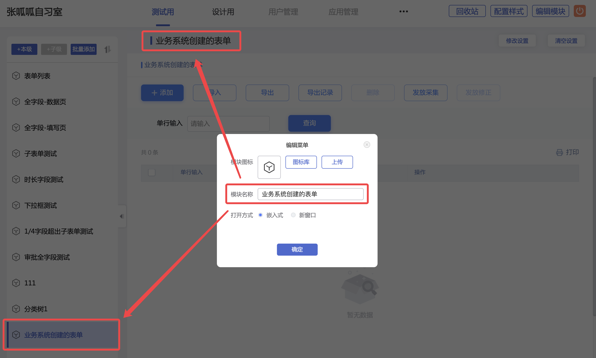

  * 从【应用管理】创建的审批：名称、图标在左上角的【应用基础设置】中修改

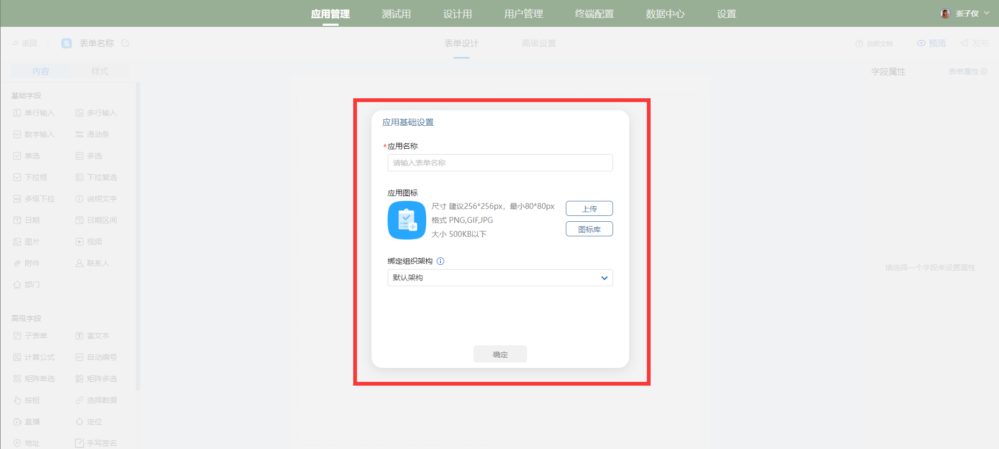

  

### 2\. 创建后的默认添加到不同位置

  * 从【业务系统】创建的表单：只默认添加于单位应用市场；如需在其它位置使用，需要从【单位应用市场】中手动选择，添加至单位应用管理页面中

  * 从【应用管理】创建的表单：默认添加至单位应用管理页面中

  
  

# 📖 【应用管理】vs【业务系统】创建的联系 

### 1\. 创建后都会存放在应用市场

创建成功后都会进入【单位应用市场-自建应用-表单应用】分类下

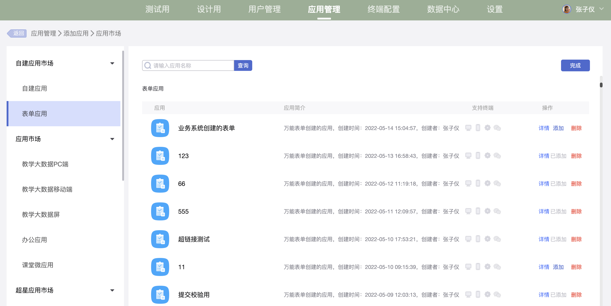

  

### 2\. 创建后都会自动生成前后台

创建成功后，系统都会自动生成表单前台（填写页）和表单后台（数据管理页）

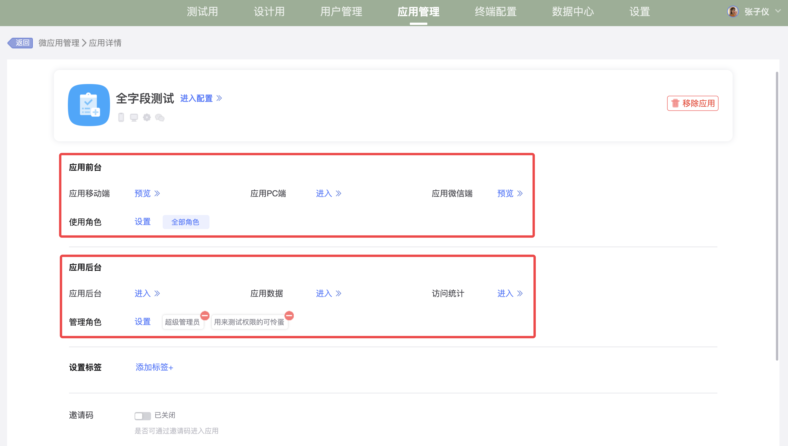

  
  

## 2.2、◾在【应用管理】中创建

[TOC]

🧭 文档更新日期：2025年2月11日 

  
步骤：微服务后台 →应用管理 →添加应用 →应用引擎 →审批

### 步骤详情：

#### 1\. 登录微服务后台，打开应用管理，点击添加应用

#### 2\. 选择应用引擎

#### 3\. 选择审批

#### 4\. 选择新建审批或者复制已存在的审批

#### 5\. 填写应用基础设置

* * *

提示：**应用名称** 为必填项，否则无法保存。应用图标可以从本地上传或者从图标库中选择。绑定组织架构如果单位存在办公通讯录，默认绑定通讯录。若没有办公通讯录，则默认绑定默认架构

## 2.3、◾在【业务系统】中创建

[TOC]

🧭 文档更新日期：2025年2月11日 

  

### 🪧 创建入口

  * 微服务平台-设置-业务系统界面管理-配置菜单

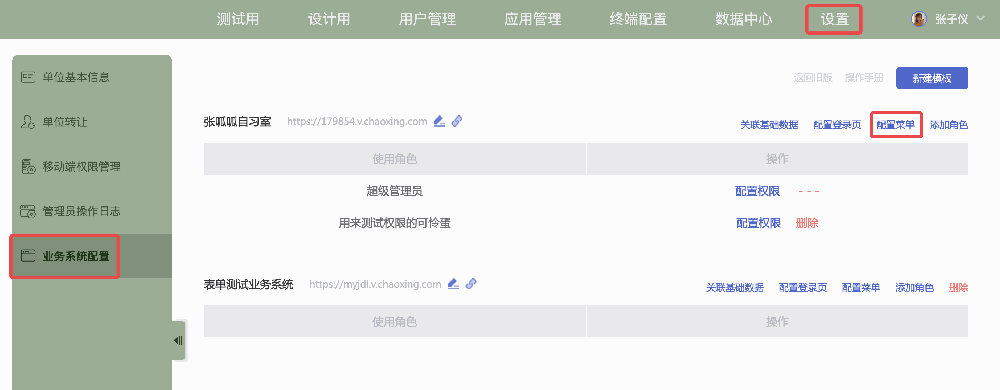

  

### 🪧 创建步骤

  1. 打开配置菜单界面 ——> 在左侧菜单中添加栏目，选中需要编辑的栏目 ——> 在右侧页面中选择【新建应用】-【审批引擎】

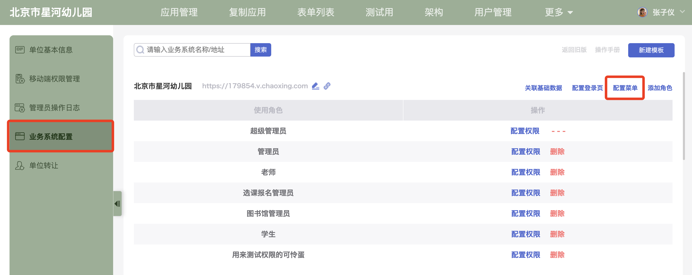

⚠️ 初次点进时，需点击右上角编辑按钮，先添加一个允许编辑的菜单

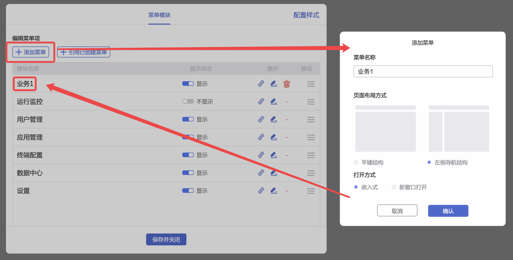

  2. 选择【从空白创建审批】或【复制已存在审批】

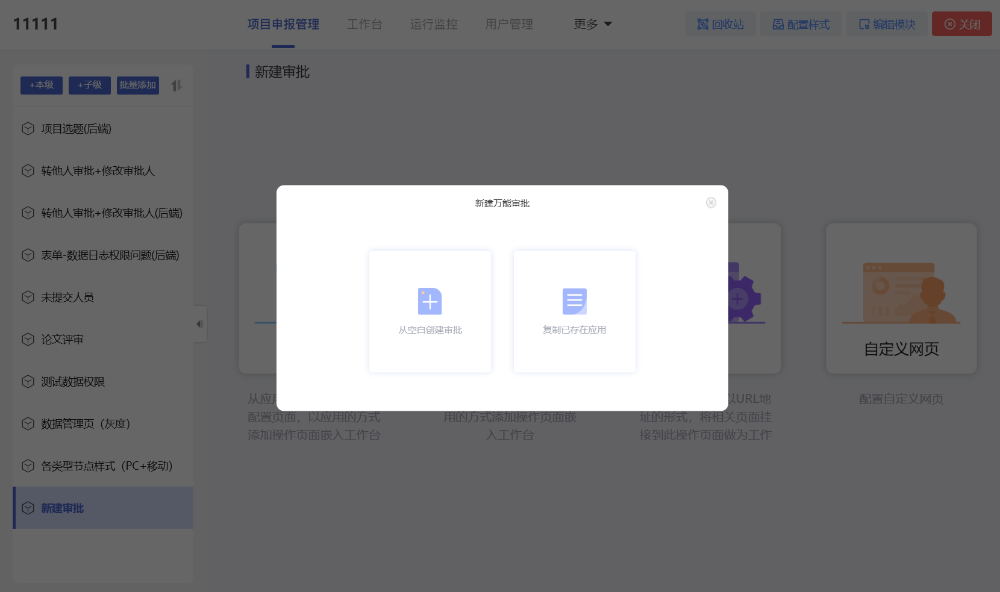

## 2.4、◾从【产品工产】复制

[TOC]

🧭 文档更新日期：2025年2月11日 

  

**步骤：** 添加产品工厂 →进入产品工厂pc端 →填写基本信息 →打包内容 →复制到目标单位
**添加产品工厂步骤：** 微服务后台 →应用管理 →添加应用 →应用市场 →添加产品工厂

### 步骤详情

#### 1.添加产品工厂

#### 2.打开产品工厂pc端，点击创建产品

#### 3.填写基本信息

#### 4.点击下一步，选择添加需要打包内容

#### 5.从单位应用库选择需要添加的审批

#### 6.选择后确认并打包，选择复制到的单位，填写想要复制到的单位信息。

#### 7.复制完成后，可到复制记录查看

#### 8.复制成功后，可以在目标单位应用管理查看到相关审批

## 2.5、审批设计流程指引

[TOC]

🧭 文档更新日期：2024年7月17日 

  

### 📖 1. 使用帮助

  * 在使用的过程中，可从右上角使用说明获取帮助，查看使用说明和更新日志

* * *

### 📖 2. 设计流程

  * 一般设计流程为：表单设计→管理页设计→流程设置→高级设置→发布

#### 🪧2.1 表单设计

  1. 在【样式库】中选择想要的审批样式并进行配置

  2. 在属性配置区【表单属性】中对整个表单的属性进行配置

 

  3. 从【字段库】拖拽字段至预览区，对字段进行属性配置，具体字段参考[**界面设置**](<https://document.chaoxing.com/web/#/99/999> "**界面设置** ")

🔅 提示：预览区内字段可通过拖拽调节顺序，字段可以进行复制和删除

* * *

  

#### 🪧2.2 管理页设计

  * 根据需要配置数据管理页

* * *

#### 🪧2.3 流程设置

  * 根据需要配置需要的流程，具体内容参考[**流程设置**](<https://document.chaoxing.com/web/#/99/1040> "**流程设置** ") 

* * *

#### 🪧2.4 高级设置

  * 根据需要配置高级设置，具体内容参考[**高级设置**](<https://document.chaoxing.com/web/#/99/1045> "**高级设置** ")

#### 🪧2.5 发布

  * 配置完成，点击右上角发布保存 

# 3、二、配置审批

## 3.1、审批基础设置

### 3.1.1、应用名称、图标

🧭 文档更新日期：2024年7月19日 

  

从应用管理中创建审批后，进入创建页会直接弹出基础设置的弹窗

弹窗中可修改应用的名称、选择或上传应用的图标

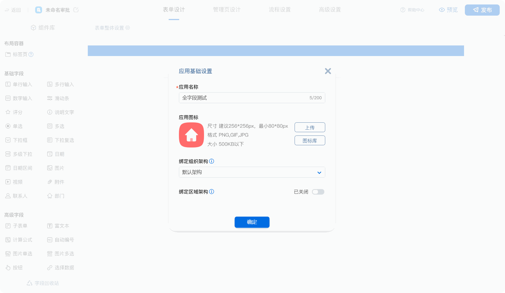

设置后，该名称和图标将显示在：应用列表、填写页、数据管理页等各个地方

   
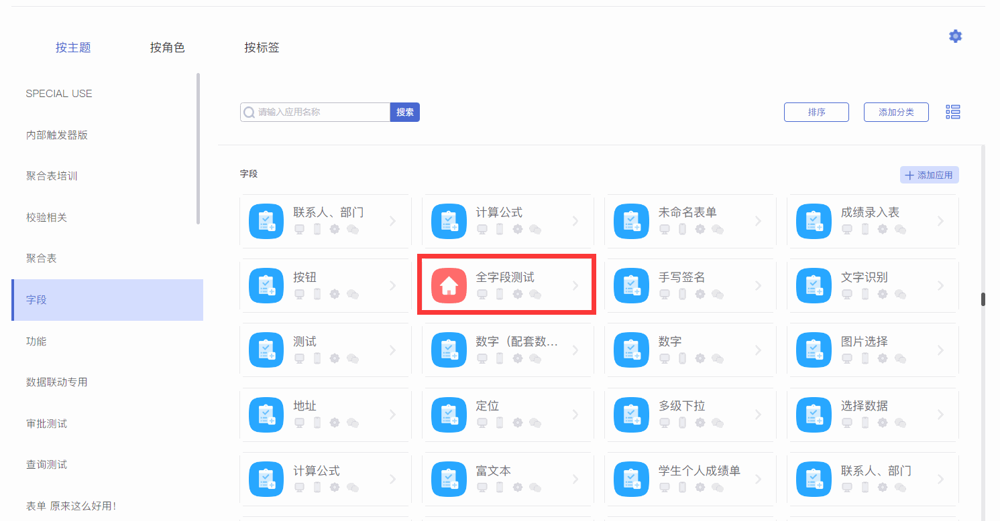  
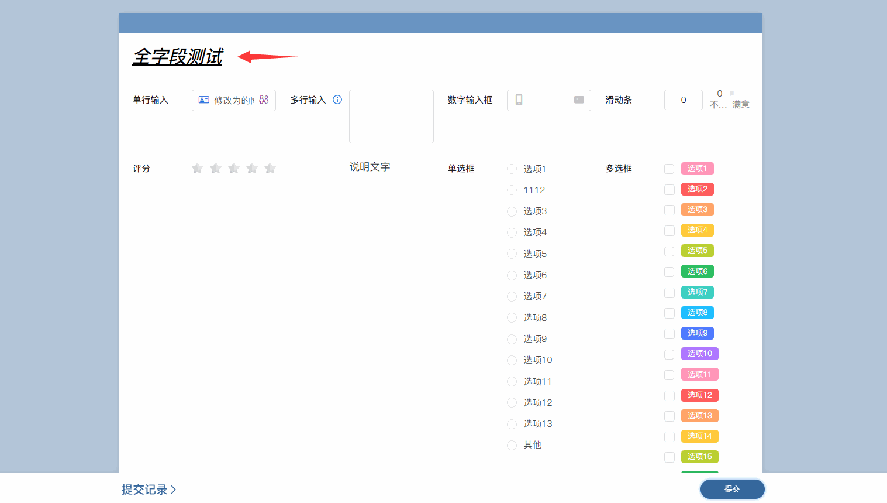   
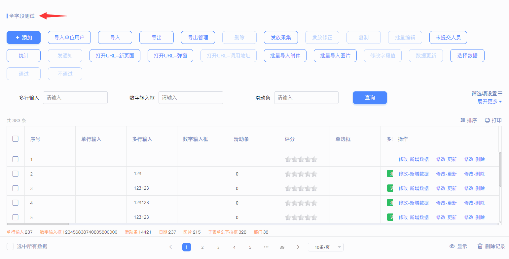

  
  

### 3.1.2、绑定组织架构

[TOC]

🧭 文档更新日期：2025年2月11日 

  

# 📖 功能简介 

### 🪧定义

组织架构用于维护该单位中的部门列表、部门和人的关系，每个单位可以创建多套组织架构，分别服务于不同的业务

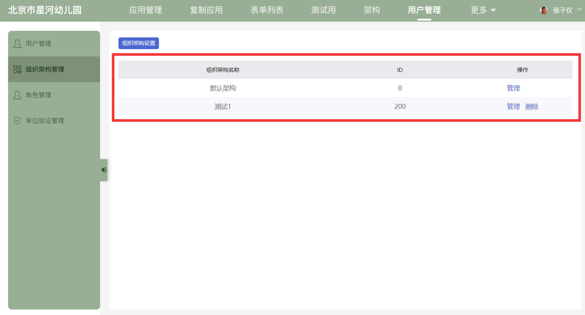

但每个审批应用必须绑定其中的某一套架构

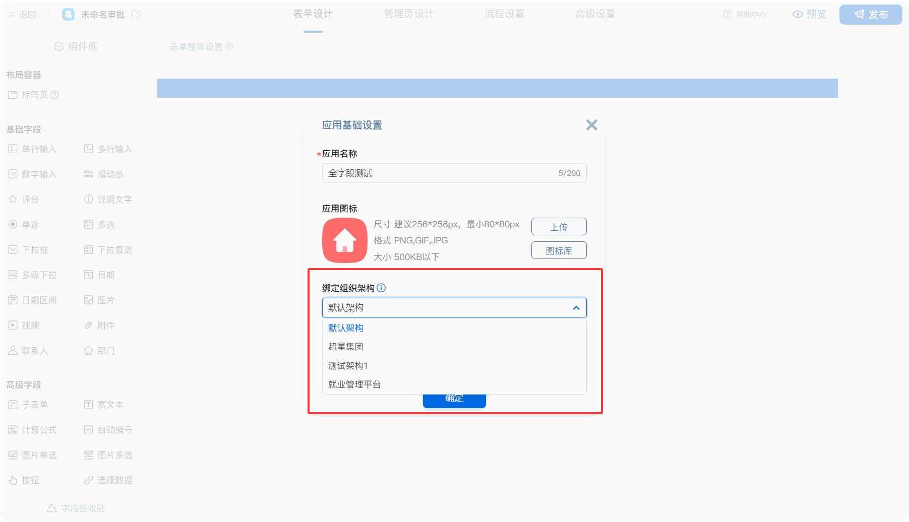

  

### 🪧使用场景

学校有多套架构，分别用于教学管理、教务管理、后勤管理 教学和教务系统中涉及的表单，需要绑定架构A；后勤系统中涉及的表单，需要绑定架构B

  
  

# 💡 特殊说明 

### 🪧绑定架构影响位置

绑定不同的组织架构，会影响以下地方弹窗中显示的内容

  * 表单填写页：联系人、所属人、部门字段展开的弹窗中的部门和人员列表

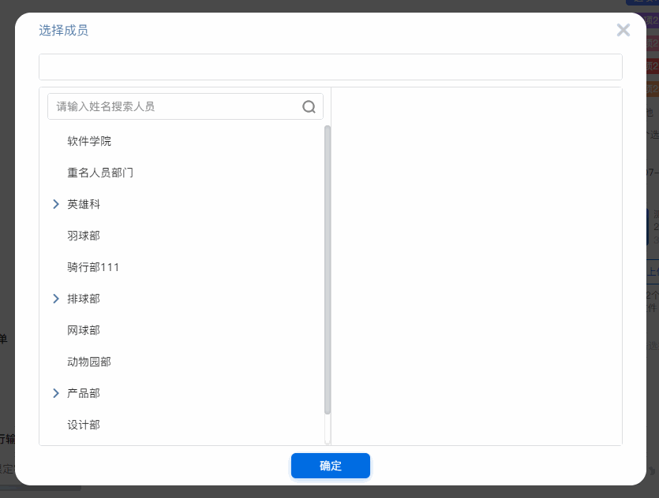

  * 数据管理页：联系人、部门等字段的【筛选项】弹窗中的部门和人员列表

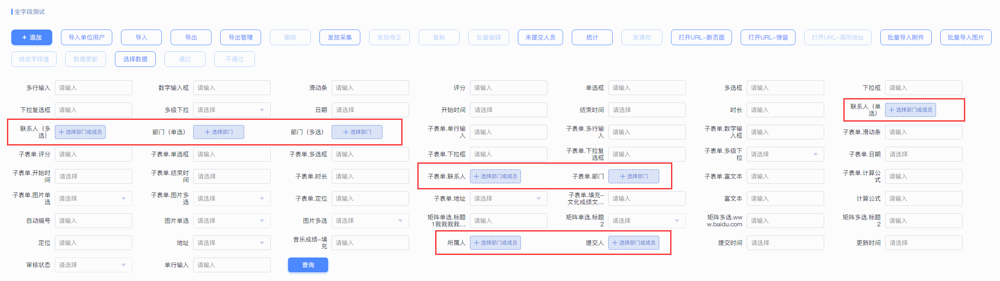

  * 创建页：联系人、部门等字段的【过滤组件、赋值组件等】弹窗中的部门和人员列表

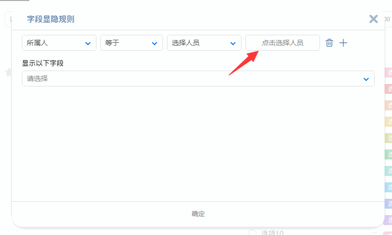

  

### 🪧切换架构影响位置

切换组织架构后，会导致联系人字段已经配置的可选范围失效，需要重新配置

  
  

### 3.1.3、绑定区域架构

[TOC]

🧭 文档更新日期：2025年2月11日 

  

# 📖 功能简介 

### 🪧 什么是区域架构

以往，基于微服务的业务大多局限于某个单位内部，但随着数字化转型推进，**跨单位业务** 的需求在日益增长 例如：集团校的师生管理、文化馆总分馆间的资源流转等

为此公司开发了【区域架构】应用，用于维护**多单位间的层级关系** ，在顶级单位中添加区域架构应用后，可将其他单位添加为下级单位，并为其设置角色、权限和相关应用

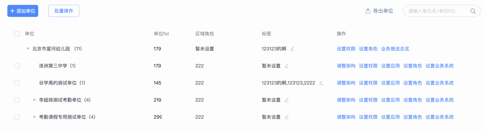

  

### 🪧 绑定方式

当单位在区域架构中时，审批的基础设置弹窗中会显示【绑定区域架构】模块，开关默认关闭 注意：如果本应用不用于跨单位的信息收集和审批，则无需开启区域架构

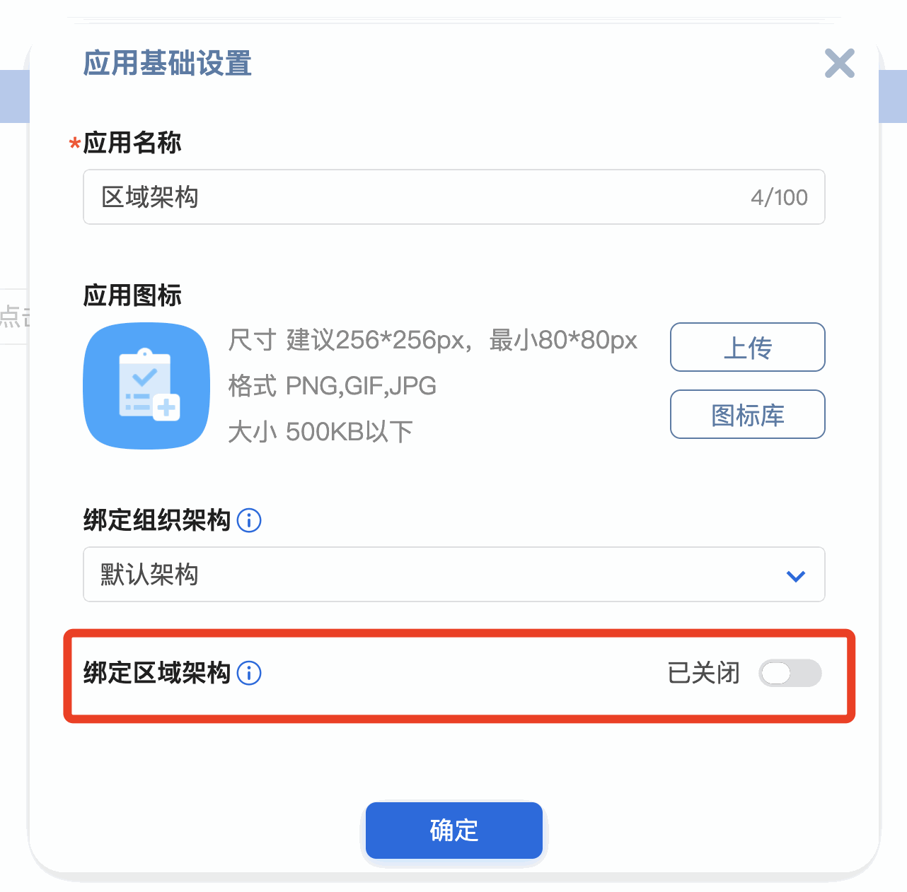

开关开启后，在下拉框中选择要绑定的架构 注意：一个单位可以存在于多套区域架构中，但每个审批应用必须绑定其中的某一套区域架构

  
  

# 💡 特殊说明 

### 🪧开启区域架构的影响

  * 区域架构开启后，组件库中将显示【单位】字段，配置方式详见：[单位字段使用说明](<https://document.chaoxing.com/web/#/120/2170> "单位字段使用说明")

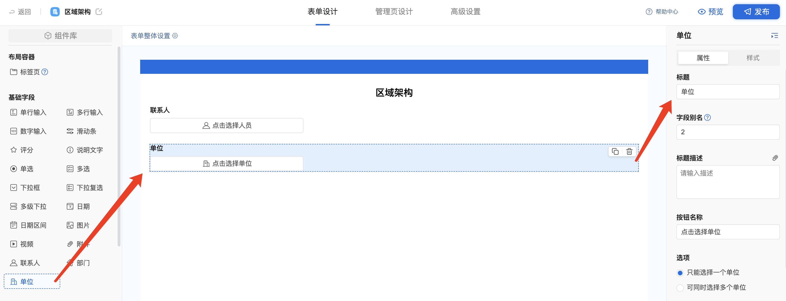

  * 区域架构开启后，联系人字段的【可选范围】将显示更多选项，配置方式详见：[联系人字段使用说明](<https://document.chaoxing.com/web/#/120/1509> "联系人字段使用说明")

  * 区域架构开启后，流程设置-审批人节点-设置审批人将显示选项“区域架构角色”，配置方式详见：[区域架构角色](<https://document.chaoxing.com/web/#/99/1977> "区域架构角色")

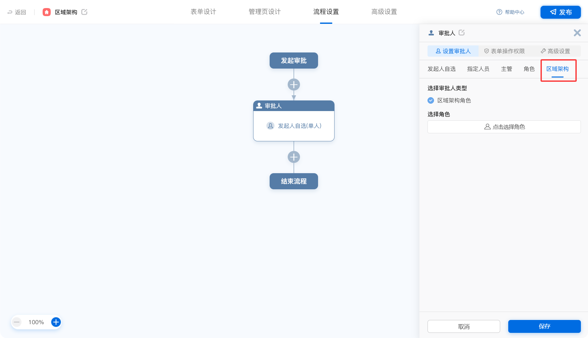

  

### 🪧切换区域架构的影响

切换绑定的区域架构会导致单位、部门、联系人的范围和默认值、审批人类型等相关配置失效，需要重新配置

  
  

## 3.2、审批的表单设计

### 3.2.1、◾表单设计简介

[TOC]

🧭 文档更新日期：2025年3月6日 

  

### 🪧 表单设计分区

表单设计页面分为四个区域：左侧组件库、顶部全局操作栏、右侧配置面板、中央操作面板 

  * **组件库：** 包含布局容器、基础字段、高级字段、系统字段，以及字段回收站

  * **全局操作栏：** 包含表单整体设置、批量删除字段等功能

  * **右侧配置面板：** 表单、组件的属性/样式配置面板

  * **中央操作面板：** 实时预览填写页效果、操作表单元素的区域

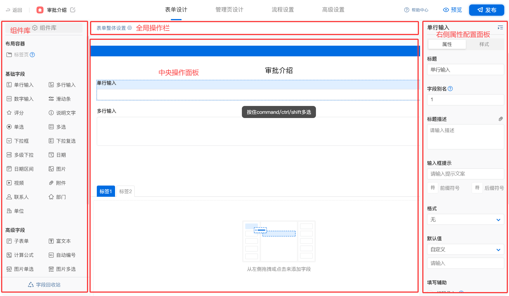

  

### 🪧 通用设计流程

  1. 从【组件库】拖拽所需的组件至预览区

  2. 在【中央操作面板】调节组件顺序、对组件进行复制或删除

  3. 点击某个组件，在【右侧配置面板】对该字段的属性、样式进行配置

  4. 点击【表单整体设置】，对表单的属性、样式进行调整

  
  

### 3.2.2、◾表单整体设置 | 属性

[TOC]

🧭 文档更新日期：2025年3月6日 

### 🪧 功能位置

点击表单整体设置，可以在【右侧配置面板】调整表单整体属性：业务规则（显隐规则、编辑规则、必填规则）

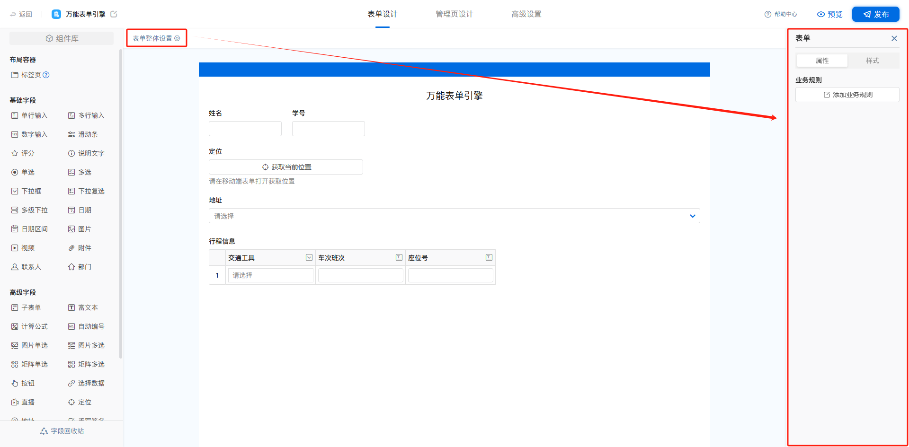

### 3.2.3、◽◾业务规则-显隐规则

[TOC]

🧭 文档更新日期：2025年3月6日 

  

# 📖 功能简介 

### 🪧 定义

根据当前填写页中的某些字段的值，判断其他字段是否显示

  

### 🪧 使用场景

  * 活动报名表中，仅当勾选了【同意上述规则】字段，才显示其他的报名字段
  * 学生所在年级不同，需要填写的报名字段不同
  * 终端设置中勾选了哪些端口，就显示相应的字段，不勾选时不显示

  

### 🪧 功能位置

表单创建页-【表单整体设置】-右侧配置面板【属性】-【业务规则-显隐规则】

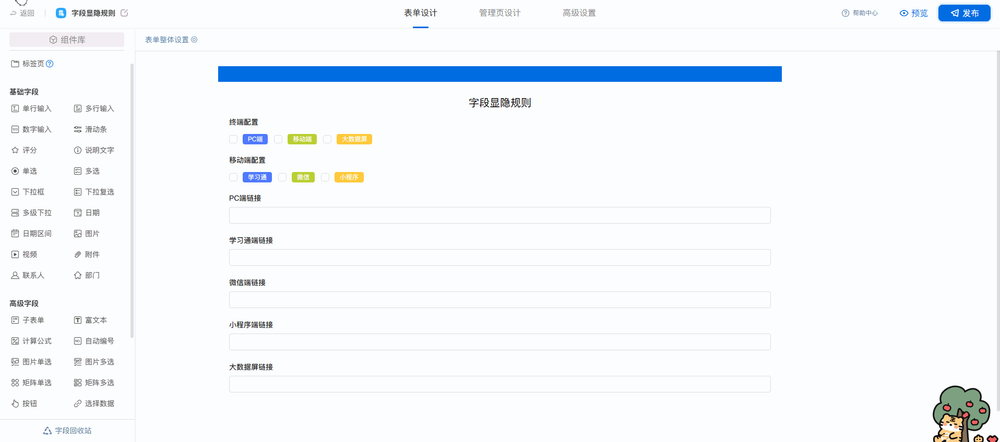

  
  

# 🔧 配置流程

显隐规则的配置流程一共分为三步：添加显隐规则、配置条件、选择显示字段

### 🪧 第一步：添加显隐规则

> 在【表单整体设置-属性-业务规则】中添加显隐规则，可添加多条

>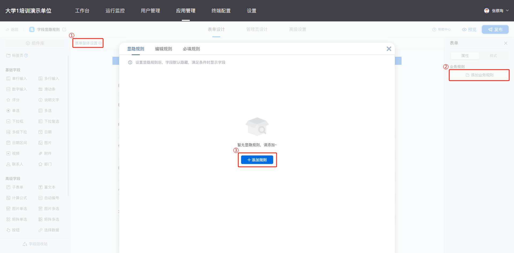

  

### 🪧 第二步：配置条件

> 配置条件，用于判断其他字段是否显示 > \- 支持配置多个条件，条件之间可为 “且/或”混合关系 > \- 必须先配置条件，才能继续选择显示字段

>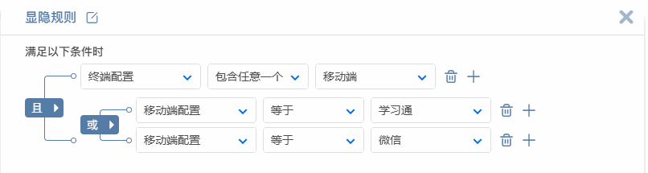

  

### 🪧 第三步：选择显示字段

> 选择一个或多个被上述条件控制显隐的字段 > \- 配置过条件后，显示字段列表处只显示位于所有条件字段**后面** 的字段

>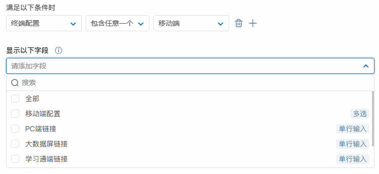

  
  

# 💡 配置规则

### 🪧 每个字段只能被一个规则控制显隐

>示例：学校类型为“中学”时显示A、B字段；为“小学”时显示B、C字段

>此时不能同时设置两个规则来控制B字段

>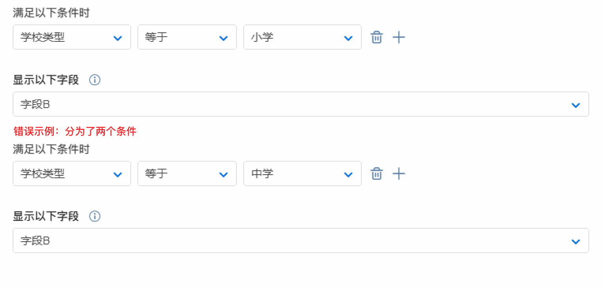

>而应该在一个规则中，一次性把所有条件配置完

>

  

### 🪧 条件字段只能控制后面的字段

  * 必须先配置条件，才能继续选择显示字段
  * 配置过条件后，显示字段列表处只显示位于所有条件字段 后面 的字段
  * 调整字段顺序不会使字段显隐规则失效，但系统会限制规则的条件和显示字段 形成闭环 的情况

  * 【标签页】内的字段也有顺序，从表单整体上来说，顺序为：主表单区域字段、标签1区域字段、标签2区域字段…
  * 当一个标签内的字段全部隐藏时，标签也会隐藏

  * 【子表单】内的字段同样存在顺序，在子表单内，位于前面的字段可以控制后边字段的显隐
  * 主字段可以控制子表单整体的显隐

  
  

# 💡 注意事项

### 🪧 隐藏字段参与运算

因显隐规则而隐藏的字段，如果有值，仍会参与页面上的运算，此运算包括：数据联动、公式编辑、常用公式、计算公式

  

### 🪧 提交后清空隐藏字段的值

数据提交后，因显隐规则而隐藏的字段会被 **清空**

  

### 🪧 显隐规则触发机制

除用户手动填写数据外，通过【默认值、前端事件、数据联动、选择数据等】方式给条件字段赋值后，同样能触发字段显隐规则

  
  

### 3.2.4、◽◾业务规则-必填规则

[TOC]

🧭 文档更新日期：2025年3月6日 

  

# 📖 功能简介 

### 🪧 定义

根据当前填写页中的某些字段的值，判断其他字段是否必填

  

### 🪧 使用场景

  * 用户选择“实践课”时，必须填写【实验器材】
  * 当监护人身份选“其他”时，必须填写【关系说明】
  * 当论文类型为“实证类论文”时，必须填写【数据来源】

  

### 🪧 功能位置

表单创建页-【表单整体设置】-右侧配置面板【属性】-【业务规则-必填规则】

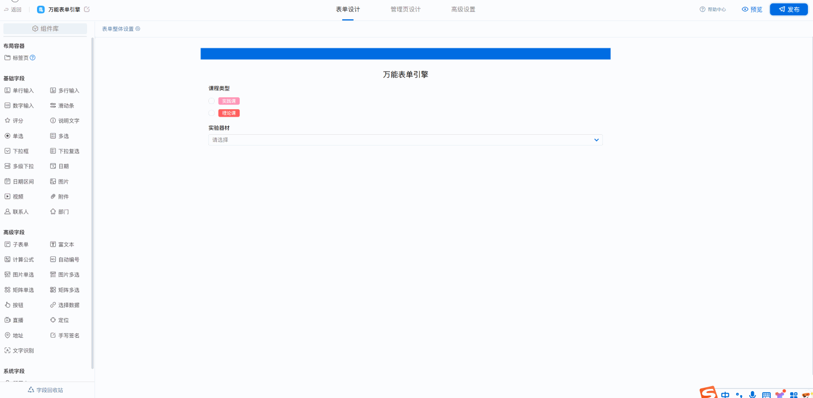

  
  

# 🔧 配置流程

必填规则的配置流程一共分为三步：添加必填规则、配置条件、选择必填字段

### 🪧 第一步：添加必填规则

> 在【表单整体设置-属性-业务规则】中添加必填规则，可添加多条 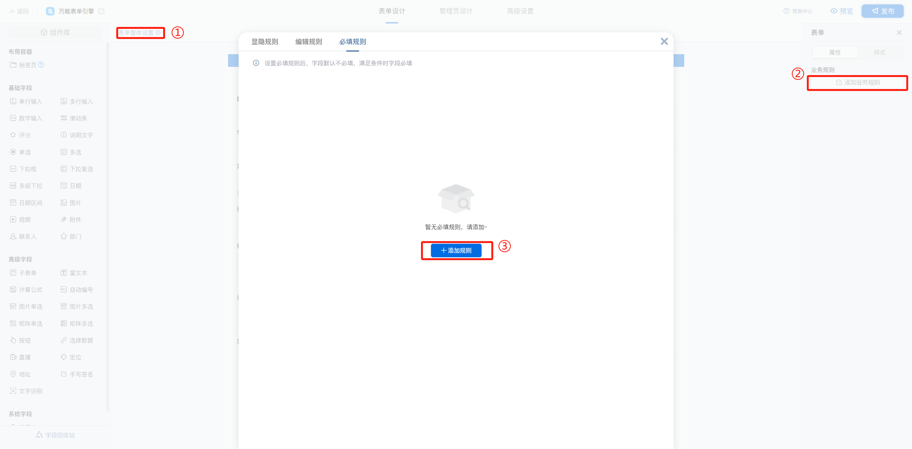

  

### 🪧 第二步：配置条件

> 配置条件，用于判断其他字段是否必填 > \- 支持配置多个条件，条件之间可为 “且/或”混合关系 > \- 必须先配置条件，才能继续选择必填字段

>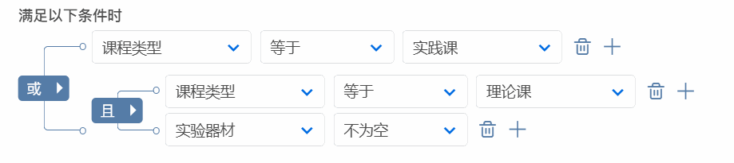

  

### 🪧 第三步：选择必填字段

> 选择一个或多个被上述条件控制必填的字段 > \- 配置过条件后，必填字段列表处只显示位于所有条件字段 **后面** 的字段

>

  
  

# 💡 配置规则

### 🪧 每个字段只能被一个规则控制必填

>示例：课程类型为“实践课”或“实践理论结合课”时实验器材字段必填

>此时不能同时设置两个规则来控制实验器材字段

>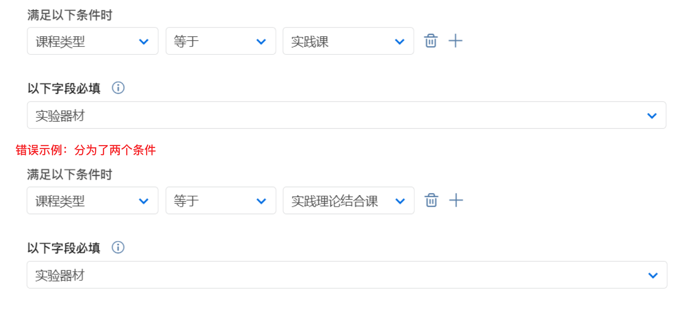

>而应该在一个规则中，一次性把所有条件配置完

>

  

### 🪧 条件字段只能控制后面的字段

  * 必须先配置条件，才能继续选择必填字段
  * 配置过条件后，必填字段列表处只显示位于所有条件字段 后面 的字段
  * 子表单内的字段同样存在顺序，在子表单内，位于前面的字段可以控制后边字段的必填

  
  

# 💡 注意事项

### 🪧 必填属性仅可在一个地方配置

配置必填规则后，字段属性处必填属性隐藏，不可重复配置

  
  

### 3.2.5、◽◾业务规则-编辑规则

[TOC]

🧭 文档更新日期：2025年3月6日 

  

# 📖 功能简介 

### 🪧 定义

根据当前填写页中的某些字段的值，判断其他字段是否允许编辑

  

### 🪧 使用场景

  * 教师只能在成绩提交截止日期前编辑成绩，过期后不可修改
  * 学生选题经导师确认后，选题字段自动锁定
  * 报修单状态变为“维修中”时，报修描述和联系方式字段锁定，仅允许补充维修反馈

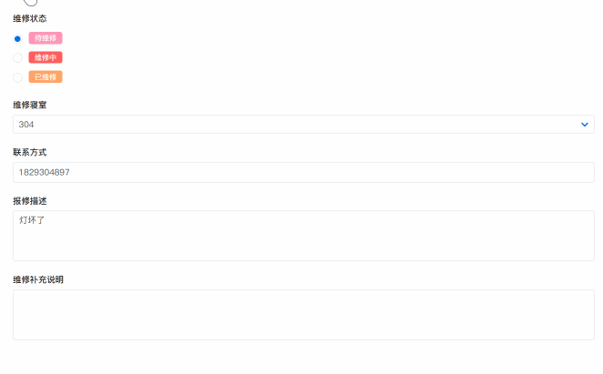

  

### 🪧 功能位置

表单创建页-【表单整体设置】-右侧配置面板【属性】-【业务规则-编辑规则】

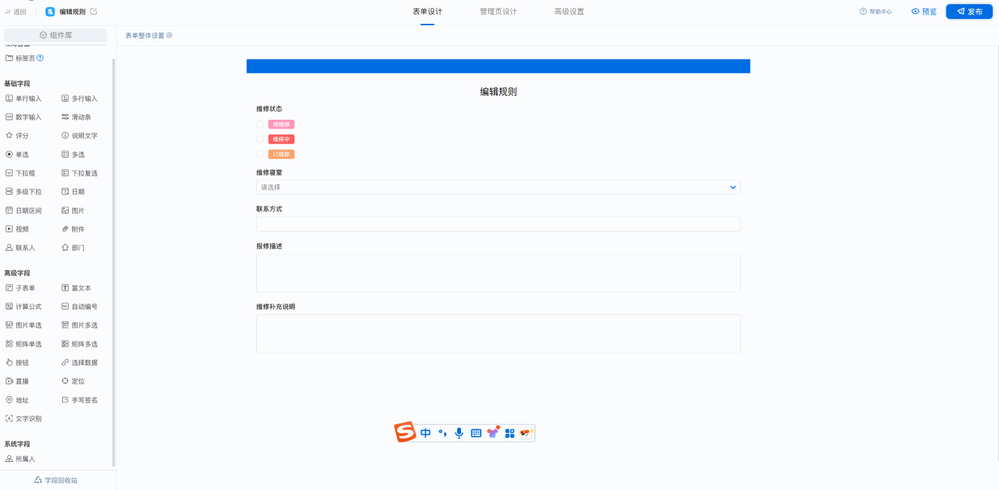

  
  

# 🔧 配置流程

编辑规则的配置流程一共分为三步：添加编辑规则、配置条件、选择可编辑字段

### 🪧 第一步：添加编辑规则

> 在【表单整体设置-属性-业务规则】中添加编辑规则，可添加多条

>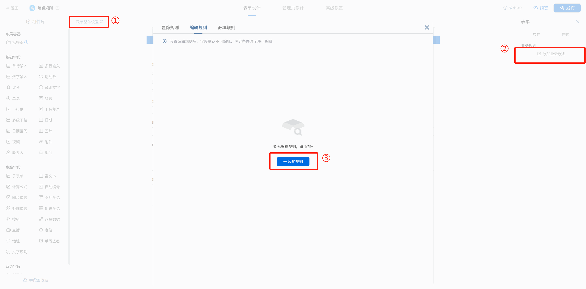

  

### 🪧 第二步：配置条件

> 配置条件，用于判断其他字段是否可编辑 > \- 支持配置多个条件，条件之间可为 “且/或”混合关系 > \- 必须先配置条件，才能继续选择可编辑字段

>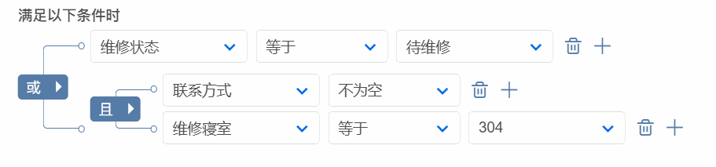

  

### 🪧 第三步：选择可编辑字段

> 选择一个或多个被上述条件控制编辑属性的字段 > \- 配置过条件后，可编辑字段列表处只显示位于所有条件字段 **后面** 的字段

>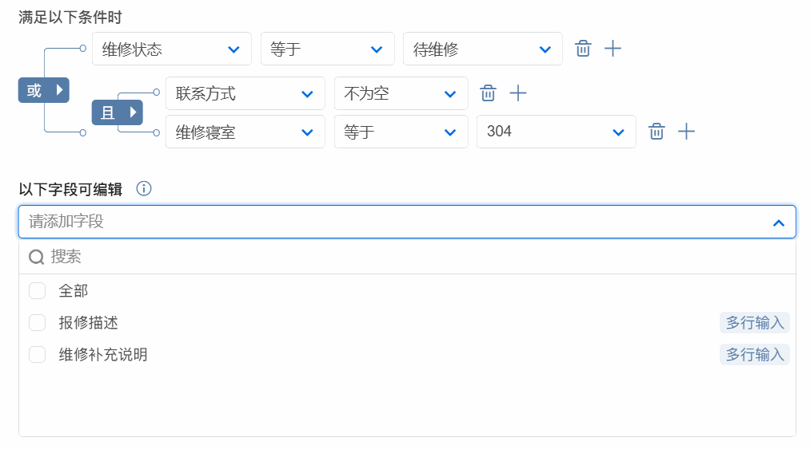

  
  

# 💡 配置规则

### 🪧 每个字段只能被一个规则控制编辑属性

>示例：维修状态为“维修中”或“已维修”时维修补充说明字段可编辑

>此时不能同时设置两个规则来控制维修补充说明字段

>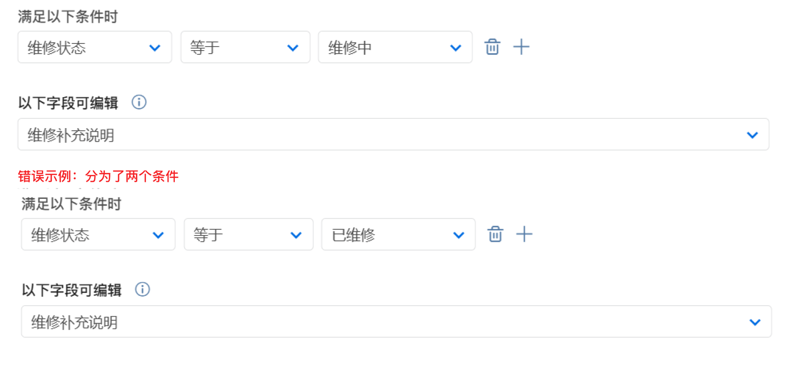

>而应该在一个规则中，一次性把所有条件配置完

>

  

### 🪧 条件字段只能控制后面的字段

  * 必须先配置条件，才能继续选择可编辑字段
  * 配置过条件后，可编辑字段列表处只显示位于所有条件字段 后面 的字段
  * 子表单内的字段同样存在顺序，在子表单内，位于前面的字段可以控制后边字段是否可编辑

  

### 🪧 编辑权限由流程节点字段权限和编辑规则共同控制

  * 字段显示+节点字段权限为可编辑+满足编辑规则时，字段才可编辑

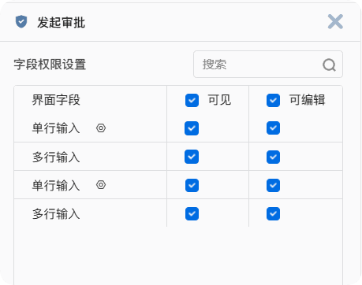

  
  

# 💡 注意事项

### 🪧 子表单的编辑规则

满足编辑规则的子表单，可编辑内容根据【流程节点-字段权限】处配置决定

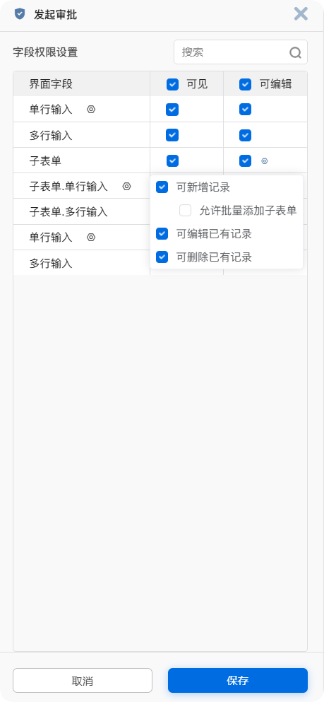

  
  

### 3.2.6、◾表单整体设置 | 样式

[TOC]

🧭 文档更新日期：2025年3月6日 

  

# 📖 功能简介 

### 🪧 定义

用于配置审批填写页的整体样式，包含标题、背景、按钮、字段等

  

### 🪧 功能位置

审批创建页 -【表单设计】-【表单整体设置】- 右侧配置面板【样式】

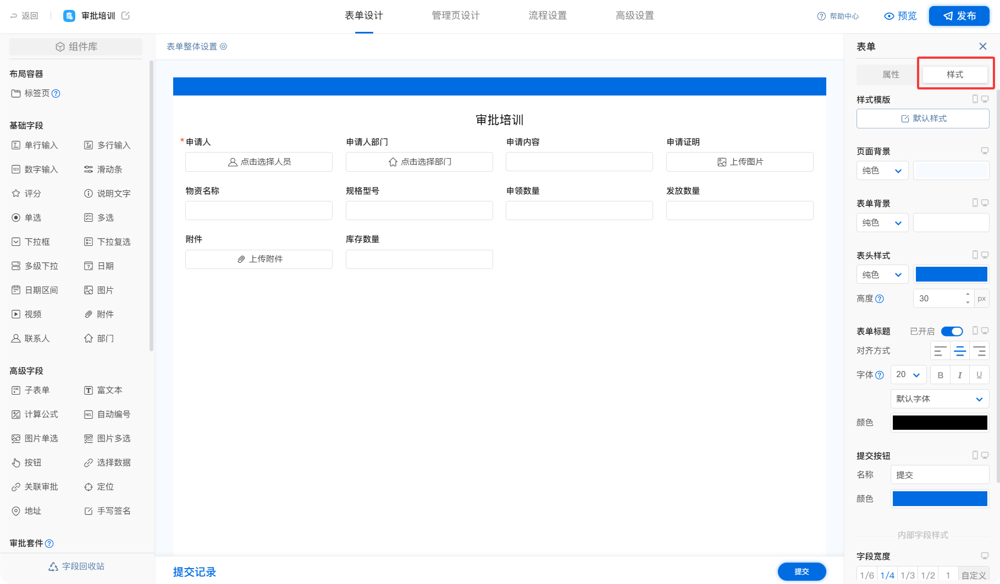

  
  

# 🔧 配置流程

### 🪧 样式模板

  * 系统提供了多套样式模板，创建者可以根据场景自行选择
  * 用户也可以在每套模板的基础上对各个元素进行二次编辑，编辑后会生成一套自定义模板

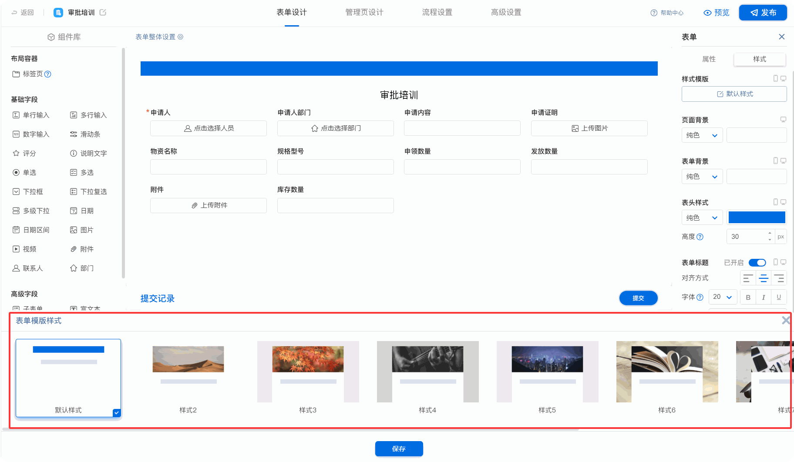

  

### 🪧 页面背景

用于控制填写页的背景色，目前支持选择【纯色】或自行上传【图片】，仅在PC端生效

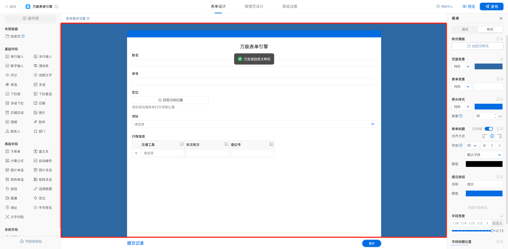

  

### 🪧 表单背景

用于控制中央填写区域的背景颜色，目前支持设置为纯色或自行上传【图片】，在PC、移动端均生效

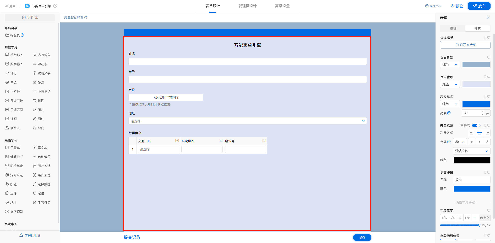

  

### 🪧 表头样式

用于控制表头区域的内容和高度，内容支持选择【纯色】【渐变色】或上传【图片】，在PC、移动端均生效

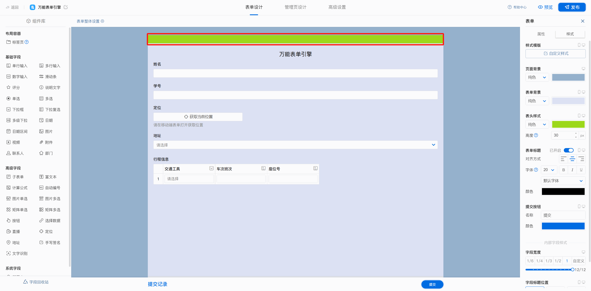

  

### 🪧 表单标题

控制是否显示表单标题，以及显示的位置、字体等，在PC、移动端均生效

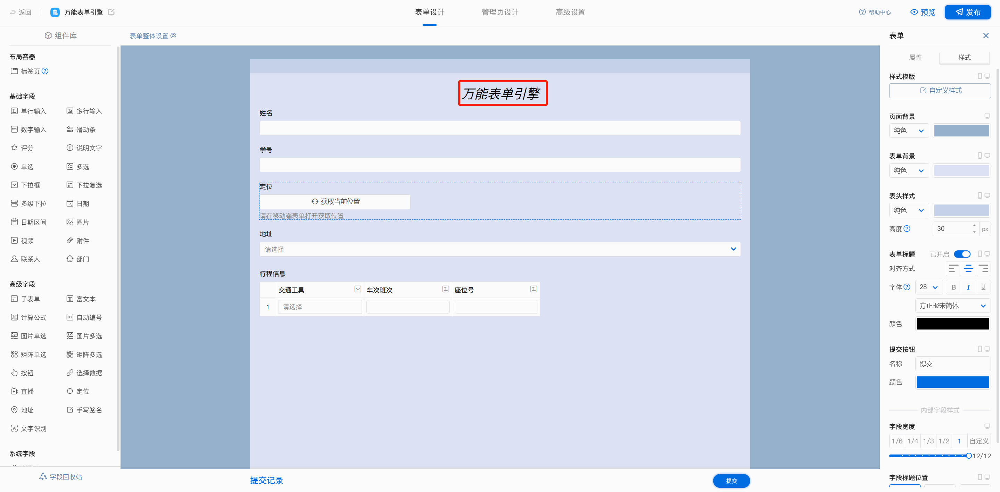

  

### 🪧 提交按钮

控制提交按钮的文案和按钮样式，在pc、移动端均生效

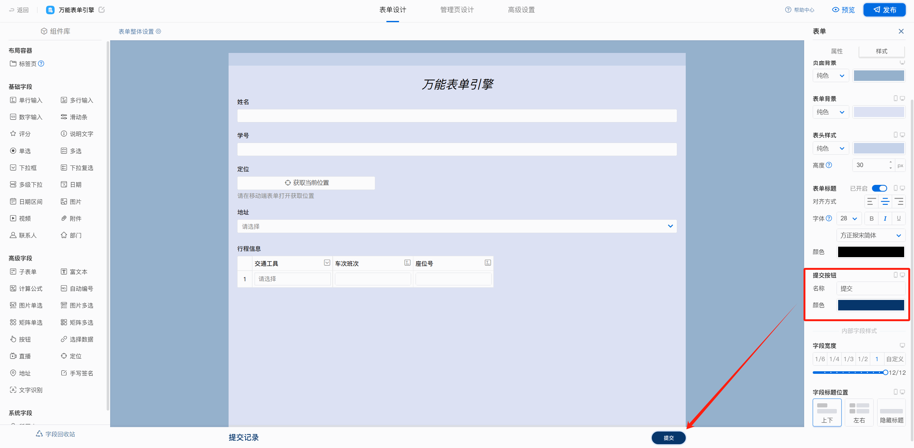

  

### 🪧 字段宽度

  * 批量设置表内所有字段的宽度，支持设置1/6、1/4、1/3、1/2、1或自定义，仅在pc端生效
  * 设置后，用户仍可单独调节某个字段的宽度
  * 新插入的字段，默认按此处设置的宽度进行显示

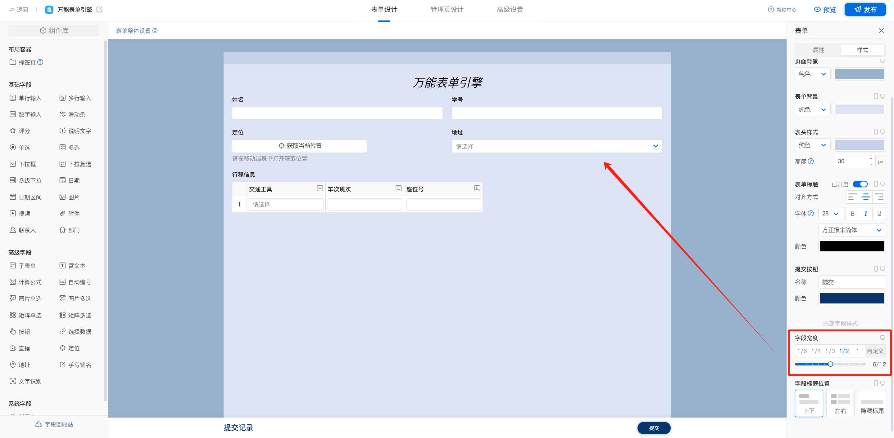

  

### 🪧 字段标题位置

  * 批量设置表内所有字段的标题位置，支持选择【上下】【左右】【隐藏标题】，在pc、移动端均生效
  * 选择【左右】时，支持设置标题对齐方式
  * 设置后，用户仍可单独调节某个字段的标题位置
  * 新插入的字段，默认按此处设置的位置进行显示

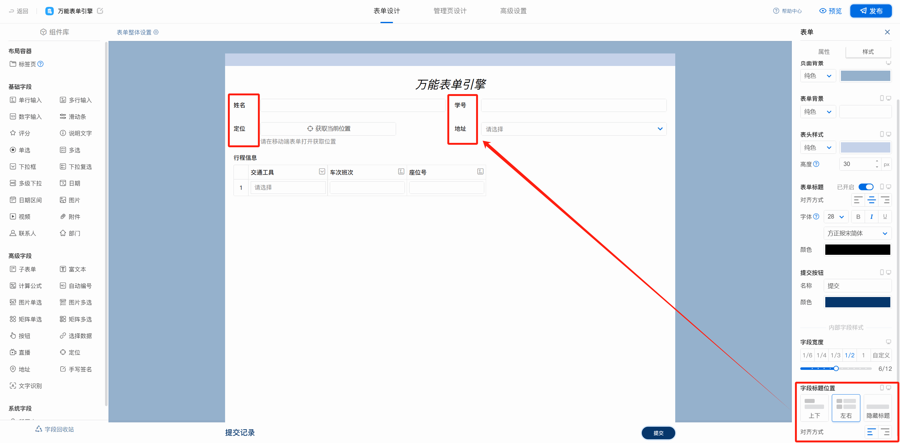

  
  

### 3.2.7、◾字段回收站

[TOC]

🧭 文档更新日期：2024年4月30日 

  

# 📖 功能简介 

### 🪧 定义

字段回收站是专门用来存储被删除字段的地方；在回收站中，用户可以恢复60天内删除的字段、相关配置及字段数据

  

### 🪧 功能位置

审批创建页-表单设计-左下角字段回收站

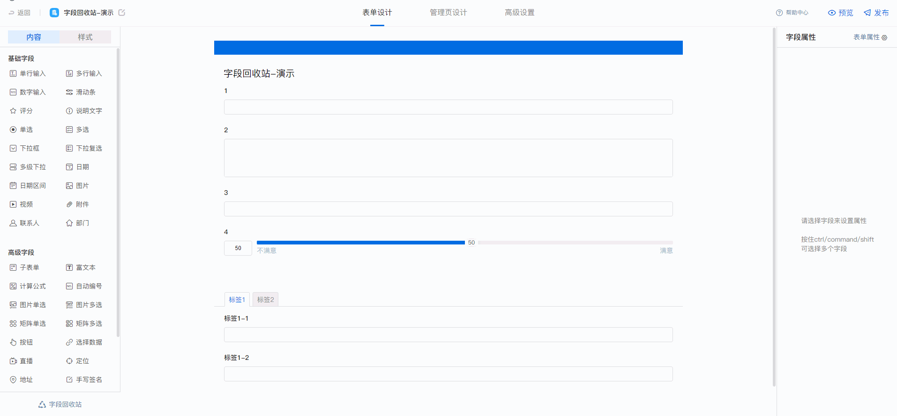

  

### 🪧 功能意义

在用户操作审批时，可能会因为误操作或其他原因不小心删除了某些重要字段，进而造成不可逆的数据损失

字段回收站允许用户找回并恢复误删的字段， 提高了容错率，减少了因误操作带来的潜在风险

  
  

# 💡 注意事项

### 🪧 删除和恢复机制

  1. 删除字段并发布表单后，该字段才会进入字段回收站
  2. 恢复字段后也需要发布表单，才真正恢复了字段

  

### 🪧 彻底删除机制

  1. 为防止删除字段过多，数据量过大给服务器造成压力，删除超过60天的字段将自动被彻底删除
  2. 彻底删除的字段，字段配置和存储的数据将无法通过任何方式找回，彻底删除时请谨慎操作

  

### 🪧 字段恢复后的位置

  1. 主字段恢复时，会自动追加至 主表单的尾部
  2. 原本标签页内的字段恢复时，也会恢复至 主表单的尾部
  3. 子表单内的字段恢复时，会恢复至 所属子表单的尾部

  

### 🪧 字段恢复后的字段别名

  1. 字段恢复时，如果别名和其他字段重复，则恢复后会在自身的别名后追加“_1”

  

### 🪧 字段相关限制

  1. 每个审批仅能存在一个审批套件类字段，恢复时需要确保当前表单中没有其他套件类字段，否则将提示：

  2. 恢复子字段时，需要确保该字段所属的子表单未被删除，否则将提示：

  
  

## 3.2.1、组件库

### 3.2.1.1、◾组件库简介

[TOC]

🧭 文档更新日期：2025年3月26日 

  

### 🪧 组件库分区

组件库分为四大模块：布局容器、基础字段、高级字段、系统字段 

  * **布局容器：** 支持拖拽添加标签页

  * **基础字段：** 包含单行输入、多行输入、数字输入等基础字段

  * **高级字段：** 包含子表单、富文本等高级字段

  * **审批套件：** 支持拖拽添加请假套件、外出套件、加班套件、补卡套件、销假套件


  
  

### 3.2.1.2、◾布局容器

[TOC]

🧭 文档更新日期：2024年3月8日 

  

# 📖 功能简介 

### 🪧 定义

布局容器是用于存放多个字段的容器类组件，目前支持：标签页 

  * **标签页：** 用于字段的分类存放，帮助用户更高效地管理和展示信息，使界面更加清晰、直观和易于操作

  

### 🪧 使用场景

  * 将学生信息分为“基本信息”“成绩记录”“考勤记录”等部分，方便教师快速查看和更新
  * 将活动按类型分组，如“体育类”“艺术类”“学术类”，方便学生和家长选择


  
  

### 3.2.1.3、◽◾布局容器 | 标签页

[TOC]

🧭 文档更新日期：2025年3月6日 

  

# 📖 功能简介 

### 🪧 定义

标签页是一种布局组件，用于字段的分类存放，帮助用户更高效地管理和展示信息，使界面更加清晰、直观和易于操作

  

### 🪧 使用场景

例如幼儿入园申请表：添加多个标签，分别用于收集【基本信息】【班级信息】【健康与生活】【性格与教育】等


  

### 🪧 功能位置

表单创建页-组件库-布局容器


  
  

# 🔧 配置流程

  * 添加标签页后，可以在属性区增删标签，也可以对标签名称、顺序进行更改
  * 删除某个标签时，可选择将标签内的字段一并删除，或转移到主表单的尾部


  
  

### 3.2.1.4、◾字段属性

[TOC]

🧭 文档更新日期：2025年3月6日 

### 🪧 字段简介

  * 我们将利用表单收集到的信息称为【数据】，而【字段】是数据的最小单元

  * 例如：收集学生家长信息时，每个学生提交一条数据，数据中的“学生姓名”、“家长姓名”、“家长联系方式”等均是一个个的字段

* * *

  * 目前万能表单提供了30种不同类型的字段，供用户构建信息采集表

  * ## **注意：字段类型之间无法相互转换，因此，在搭建前期【字段类型】的选择非常重要，关系到公式编辑、数据联动、统计等功能是否可用**

  

### 🪧 字段属性

  * 不同的字段有丰富的属性配置项

  * 选中某个字段，页面右侧区域将显示此字段的基本属性，根据需要更改设置

以下仅列出各个字段较为通用的属性类型，详细内容请查看字段库中每个字段的介绍：

  * 【标题】指该字段的名称，其默认值为字段类型名称

  * 【字段别名】用于使用表单数据接口时，同一个表单下唯一、且不能为空（请使用数字或字母）

  * 【标题描述】对该字段的解释或说明，可添加图片

  * 【输入框提示】自定义配置输入框占位符号和文案

  * 【格式】在单行文本字段中系统预设的数据格式，起到字段校验的作用。如：勾选了手机号码，用户则必须输入11位数字才能提交数据

  * 【默认值】指用户在填写表单时该字段默认显示的值。部分字段可设置自定义（预设好一个值）、关联其他表单数据、数据联动、上次填写内容、常用公式（从身份证号提取出生日期或性别）等

  * 【表单填写缓存】部分字段可设置进入表单时，自动加载上次提交过的填写内容

  * 【填写辅助】扫码录入仅对移动端学习通和微信生效；开启联想录入，根据已输入的字词联想出用户可能想输入的内容

  * 【校验】部分字段可设置是否必填、是否允许小数、是否允许重复值、选择多项等

  * 🔆🔆🔆 **_审批的前台字段权限需要在流程设置的各个节点中配置_** 🔆🔆🔆

### 3.2.1.5、◽◾字段属性 | 数据联动

[TOC]

🧭 文档更新日期：2025年3月6日 

  

# 📖 功能简介 

### 🪧 定义

数据联动是字段【默认值】或【选项来源】的一种，在当前表单数据符合一定条件时，调用另一张表中的数据，并将其作为默认值或选项，带入当前表单中。

  

### 🪧 使用场景

当某一字段需要根据其他字段值的变化而变化时，可以使用数据联动功能，例如：

  * 在教学管理系统中，老师选择了 班级和日期 后，系统自动联动出对应的 课程明细，填入对应字段

  * 在库存管理系统中，管理员填入 商品编号 时，系统自动联动出商品相关信息 ，填入对应字段

>**示例：** 入库时选择资产编号，联动显示资产名称、类型等信息

>

  

### 🪧 支持字段及功能位置

  * 支持作为以下字段的【默认值】：单行输入、多行输入、数字输入、下拉框、下拉复选、日期、图片、视频、附件、联系人、部门、子表单、富文本、定位、地址、

>在【字段属性-默认值】处选择【数据联动】后，可在弹窗内配置数据联动

> 

  

  * 支持作为以下字段的【选项】：下拉框、下拉复选

> 在【字段属性-选项】处选择【数据联动】后，可在弹窗内配置选项数据联动

>   

  
  

# 🔧 配置流程

数据联动的配置流程一共分为四步：选择联动表单、配置条件、选择联动字段、设置数据排序规则


### 🪧 第一步：选择联动表单

>选择本单位的表单、审批或聚合表（开通后可见）作为目标表

  

### 🪧 第二步：配置条件

> 配置条件，用于在目标表中筛选数据： > \- 支持配置多个条件，条件之间为 “且” 的关系 > \- 左侧选择的是目标表中的字段，中间选择逻辑关系，右侧设置比较对象 > \- 比较对象可以设置为本表中的某个字段、固定值、动态值等

>

  

### 🪧 第三步：选择联动字段

>从目标表中选择一个字段，用于给【当前字段】赋值

>联动字段有字段类型限制，详见注意事项处的说明

  

### 🪧 第四步：设置数据排序规则

>配置的条件，可能从目标表中筛选出多条符合条件的数据，此时系统会根据此处的规则，将这些数据进行排序，用于：

>\- 如果是【默认值】设置了数据联动，系统会按设置的顺序，将 第一条数据 联动到本表中

>\- 如果是【选项】设置了数据联动，系统将数据滤重后，会按设置的顺序返回到下拉框的选项中

> 

>  

>**支持五种排序规则：**

>\- 按提交时间排序-正序：最老提交的数据在前 >\- 按提交时间排序-倒序：最新提交的数据在前 >\- 按字段值-正序：按数据正向排序，空值—>特殊符号—>数字—>汉字—>字母 >\- 按字段值-倒序：按数据倒序排序，字母—>汉字—>数字—>特殊符号—>空值 >\- 按手动排序顺序：按手动设置的顺序（注意：仅当目标表开启了手动排序时才显示该选项）

> 

>

  
  

# 💡 注意事项 & 配置规则

### 🪧 联动字段类型限制

除【单行输入、下拉框、下拉复选】字段外，大部分字段只能关联相同类型的字段，具体对应关系如下：

本表字段类型 | 目标表可选择的字段类型  
---|---  
单行输入 | 单行输入、单选框、下拉框、多级下拉、计算公式、地址、自动编号  
多行输入 | 多行输入  
数字输入 | 数字输入、计算公式  
下拉框 | 单行输入、数字输入、日期、下拉框、下拉复选、计算公式、滑动条、自动编号  
下拉复选 | 单行输入、数字输入、日期、下拉框、下拉复选、计算公式、滑动条、自动编号  
日期 | 日期  
图片 | 图片  
视频 | 视频  
附件 | 附件  
联系人（单选） | 联系人（单选）、发起人  
联系人（多选） | 联系人（多选）、审批人、当前审批人、抄送人  
部门（单选） | 部门（单选）  
部门（多选） | 部门（多选）  
子表单 | 子表单（内部字段也需要满足对应关系）  
富文本 | 富文本  
定位 | 定位  
地址 | 地址  
  
  

### 🪧 单行输入OR下拉框

单行输入和下拉框都是用于存储文本类信息的字段，如果这个字段要设置数据联动，那是使用单行输入，还是下拉框呢？

可以根据下述场景进行选择：

  * 如果从目标表筛选出的数据有多条，且系统无法替用户决定要填入哪一条，则应该选择【下拉框】字段，并且是需要给下拉框的【选项】模块设置数据联动

  * 如果从目标表中筛选出的数据仅有一条，则可以根据需要选用其他字段

… …… …… …… …… …… …

**示例：** 资产信息表中存在两条资产编号相同的数据


**资产名称使用【单行输入】进行联动时：** 只能联动显示一条数据

**资产名称使用【下拉框】进行联动时：** 可显示两条数据供选择

  
  

### 3.2.1.6、◽◾字段属性 | 公式编辑

[TOC]

🧭 文档更新日期：2025年3月6日 

# 📖 功能简介 

### 🪧 定义

公式编辑是字段【默认值】的一种，它能获取到当前数据中其他字段的值，并根据配置的公式进行计算，最终将结果返回本字段。

  

### 🪧 使用场景

当某个字段的值需要通过一定的计算才能获得，可以使用公式编辑功能 ，例如：

  * 用户输入了活动的 开始时间、结束时间，系统自动计算 时长

  * 用户输入 身份证号，系统自动返回对应的 年龄、性别 等信息
  * 考试结束后，教师往表单中录入学生的 分数，需要根据分数计算对应的 等级

>**示例：** 录入学生成绩，大于85分，输出优秀；70-85分的区间，输出良好；60-75分的区间，输出合格；小于60分，输出不合格

>

🔆 得益于丰富的函数，公式编辑可以进行非常灵活的运算，能满足绝大多数计算类的需求

  

### 🪧 支持字段及功能位置

支持作为以下字段的【默认值】：单行输入、多行输入、数字输入、日期

>在【字段属性-默认值】处选择【公式编辑】后，可在弹窗内配置数据联动：

> 

  
  

# 🔧 配置界面

公式编辑的弹窗中分为几个区域：公式编辑区、可用变量列表、函数列表、函数说明

  * 在【公式编辑区】输入公式
  * 在【可用变量列表】中选择要插入到公式中的字段，插入后，该字段将参与运算
  * 在【函数列表】中选择需要的函数
  * 如果对函数功能不了解，还可以查看【函数说明】中该函数的示例


  

具体的函数使用说明请查看以下说明文档或对应的函数示例说明:  
<https://vptbfpqk2e.feishu.cn/docx/YhwvdStn3oEbExxGDw6cMIH7nMe>

  
  

# 📋 配置规则

### 🪧 使用英文半角符号

公式编辑中支持插入如下符号，请确保使用英文输入法输入

|  |  |  |  |  |  |  |  |   
---|---|---|---|---|---|---|---|---|---  
等于 | 不等于 | 大于 | 大于等于 | 小于 | 小于等于 | 加 | 减 | 乘 | 除  
== | != | > | >= | < | <= | + | - | * | /  
|  |  |  |  |   
---|---|---|---|---|---  
小数点 | 逗号 | 双引号 | 单引号 | 小括号 | 中括号  
. | , | "" | '' | ( ) | [ ]  
  
  

### 🪧 选择正确的字段类型

公式编辑可能会输出【文本、数字、日期类】的结果

我们需要事先判断输出值类型，选择合适的字段，再给这个字段配置公式编辑

>示例1：想要输出“优秀、良好、合格”等文本信息，如果给【数字输入】配置该公式，则无法正常返回

>示例2：想要输出日期，如果给【数字输入】配置该公式，则会返回时间戳“1714360167376”

  
  

# 💡 配置思路

我们可以将公式和函数分为两类：计算、判断

  * 计算类的函数和公式：SUM、COUNT、CONCATENATE、DAY、+-*/…

>根据函数进行运算，返回某个值

  * 判断类的函数和公式：AND、OR、NOT、ISEMPTY、EXACT、EXACTALL、==、!=、>、<…

>根据函数进行判断，返回true或false

  * 判断+计算类的函数：IF、IFS、COUNTIF

>既能进行判断，又能根据判断结果进行运算

  

按照上述函数的分类方式，我们也可以将使用场景进行分类：

### 🪧 简单场景——直接计算

>示例1：获取当前时间（仅利用函数进行计算）

> 

>  

>示例2：获取联系人字段中的姓名文本（仅利用字段进行计算）

> 

>  

>示例3：表单中有各科成绩，求各科的总分（利用字段和函数进行计算）

> 

  

### 🪧 复杂场景——判断后再计算

>示例1：计算团队成员中的女生数量（利用COUNTIF函数，进行判断和运算）

> 

>  

>示例2：录入学生成绩，根据分值计算等级（利用IFS函数，进行判断并规定输出值）

> 

  
  

# 🔑 使用技巧

### 🪧 利用字符颜色查找问题

可根据字符颜色判断公式是否有误，错误的文本、符号会标红显示


  

点击括号，左右括号均会高亮显示，常用于查找层级错误的位置

  

### 🪧 复杂公式转行

多级嵌套的公式可能非常长，可以在不同层级之间进行转行，方便查看和编辑

>转行前：

>

>转行后：

>

  
  

### 3.2.1.7、◾字段样式

[TOC]

🧭 文档更新日期：2025年3月6日 

  

# 📖 功能简介 

当字段属性右侧标签切换到【样式】后，可以给每个字段设置样式


  

### 🪧 样式配置项

  * 字段宽度：指字段显示的宽度占表单整行的比例

💡 支持在中央预览直接拖拽调整字段宽度

  * 字段标题位置：支持选择【上下/左右/隐藏标题】，选择左右时还可以设置【居左/居右对齐】

  * 【单选】/【多选】字段：支持设置选项排列方式：纵向排列、横向排列、矩阵排列

  * 【图片】字段：支持设置图片显示样式：卡片、缩略图

  * 【附件】字段：支持设置文件排列方式：横向排列、纵向排列

  * 【子表单】字段：支持设置显示样式：横向表格显示、纵向展开显示

  * 【图片单选】/【图片多选】字段：支持设置：选项框大小、图片展示方式

  
  

### 🪧 样式配置效果

  
  

## 3.2.1.1、基础字段

### 3.2.1.1.1、◾组件库简介

[TOC]

🧭 文档更新日期：2025年3月26日 

  

### 🪧 组件库分区

组件库分为四大模块：布局容器、基础字段、高级字段、系统字段 

  * **布局容器：** 支持拖拽添加标签页

  * **基础字段：** 包含单行输入、多行输入、数字输入等基础字段

  * **高级字段：** 包含子表单、富文本等高级字段

  * **审批套件：** 支持拖拽添加请假套件、外出套件、加班套件、补卡套件、销假套件

  
  

### 3.2.1.1.1、◾布局容器

[TOC]

🧭 文档更新日期：2024年3月8日 

  

# 📖 功能简介 

### 🪧 定义

布局容器是用于存放多个字段的容器类组件，目前支持：标签页 

  * **标签页：** 用于字段的分类存放，帮助用户更高效地管理和展示信息，使界面更加清晰、直观和易于操作

  

### 🪧 使用场景

  * 将学生信息分为“基本信息”“成绩记录”“考勤记录”等部分，方便教师快速查看和更新
  * 将活动按类型分组，如“体育类”“艺术类”“学术类”，方便学生和家长选择

  
  

### 3.2.1.1.1、◽◾布局容器 | 标签页

[TOC]

🧭 文档更新日期：2025年3月6日 

  

# 📖 功能简介 

### 🪧 定义

标签页是一种布局组件，用于字段的分类存放，帮助用户更高效地管理和展示信息，使界面更加清晰、直观和易于操作

  

### 🪧 使用场景

例如幼儿入园申请表：添加多个标签，分别用于收集【基本信息】【班级信息】【健康与生活】【性格与教育】等

  

### 🪧 功能位置

表单创建页-组件库-布局容器

  
  

# 🔧 配置流程

  * 添加标签页后，可以在属性区增删标签，也可以对标签名称、顺序进行更改
  * 删除某个标签时，可选择将标签内的字段一并删除，或转移到主表单的尾部

  
  

### 3.2.1.1.1、◾字段属性

[TOC]

🧭 文档更新日期：2025年3月6日 

### 🪧 字段简介

  * 我们将利用表单收集到的信息称为【数据】，而【字段】是数据的最小单元

  * 例如：收集学生家长信息时，每个学生提交一条数据，数据中的“学生姓名”、“家长姓名”、“家长联系方式”等均是一个个的字段

* * *

  * 目前万能表单提供了30种不同类型的字段，供用户构建信息采集表

  * ## **注意：字段类型之间无法相互转换，因此，在搭建前期【字段类型】的选择非常重要，关系到公式编辑、数据联动、统计等功能是否可用**

  

### 🪧 字段属性

  * 不同的字段有丰富的属性配置项

  * 选中某个字段，页面右侧区域将显示此字段的基本属性，根据需要更改设置

以下仅列出各个字段较为通用的属性类型，详细内容请查看字段库中每个字段的介绍：

  * 【标题】指该字段的名称，其默认值为字段类型名称

  * 【字段别名】用于使用表单数据接口时，同一个表单下唯一、且不能为空（请使用数字或字母）

  * 【标题描述】对该字段的解释或说明，可添加图片

  * 【输入框提示】自定义配置输入框占位符号和文案

  * 【格式】在单行文本字段中系统预设的数据格式，起到字段校验的作用。如：勾选了手机号码，用户则必须输入11位数字才能提交数据

  * 【默认值】指用户在填写表单时该字段默认显示的值。部分字段可设置自定义（预设好一个值）、关联其他表单数据、数据联动、上次填写内容、常用公式（从身份证号提取出生日期或性别）等

  * 【表单填写缓存】部分字段可设置进入表单时，自动加载上次提交过的填写内容

  * 【填写辅助】扫码录入仅对移动端学习通和微信生效；开启联想录入，根据已输入的字词联想出用户可能想输入的内容

  * 【校验】部分字段可设置是否必填、是否允许小数、是否允许重复值、选择多项等

  * 🔆🔆🔆 **_审批的前台字段权限需要在流程设置的各个节点中配置_** 🔆🔆🔆

### 3.2.1.1.1、◽◾字段属性 | 数据联动

[TOC]

🧭 文档更新日期：2025年3月6日 

  

# 📖 功能简介 

### 🪧 定义

数据联动是字段【默认值】或【选项来源】的一种，在当前表单数据符合一定条件时，调用另一张表中的数据，并将其作为默认值或选项，带入当前表单中。

  

### 🪧 使用场景

当某一字段需要根据其他字段值的变化而变化时，可以使用数据联动功能，例如：

  * 在教学管理系统中，老师选择了 班级和日期 后，系统自动联动出对应的 课程明细，填入对应字段

  * 在库存管理系统中，管理员填入 商品编号 时，系统自动联动出商品相关信息 ，填入对应字段

>**示例：** 入库时选择资产编号，联动显示资产名称、类型等信息

>

  

### 🪧 支持字段及功能位置

  * 支持作为以下字段的【默认值】：单行输入、多行输入、数字输入、下拉框、下拉复选、日期、图片、视频、附件、联系人、部门、子表单、富文本、定位、地址、

>在【字段属性-默认值】处选择【数据联动】后，可在弹窗内配置数据联动

> 

  

  * 支持作为以下字段的【选项】：下拉框、下拉复选

> 在【字段属性-选项】处选择【数据联动】后，可在弹窗内配置选项数据联动

>   

  
  

# 🔧 配置流程

数据联动的配置流程一共分为四步：选择联动表单、配置条件、选择联动字段、设置数据排序规则

### 🪧 第一步：选择联动表单

>选择本单位的表单、审批或聚合表（开通后可见）作为目标表

  

### 🪧 第二步：配置条件

> 配置条件，用于在目标表中筛选数据： > \- 支持配置多个条件，条件之间为 “且” 的关系 > \- 左侧选择的是目标表中的字段，中间选择逻辑关系，右侧设置比较对象 > \- 比较对象可以设置为本表中的某个字段、固定值、动态值等

>

  

### 🪧 第三步：选择联动字段

>从目标表中选择一个字段，用于给【当前字段】赋值

>联动字段有字段类型限制，详见注意事项处的说明

  

### 🪧 第四步：设置数据排序规则

>配置的条件，可能从目标表中筛选出多条符合条件的数据，此时系统会根据此处的规则，将这些数据进行排序，用于：

>\- 如果是【默认值】设置了数据联动，系统会按设置的顺序，将 第一条数据 联动到本表中

>\- 如果是【选项】设置了数据联动，系统将数据滤重后，会按设置的顺序返回到下拉框的选项中

> 

>  

>**支持五种排序规则：**

>\- 按提交时间排序-正序：最老提交的数据在前 >\- 按提交时间排序-倒序：最新提交的数据在前 >\- 按字段值-正序：按数据正向排序，空值—>特殊符号—>数字—>汉字—>字母 >\- 按字段值-倒序：按数据倒序排序，字母—>汉字—>数字—>特殊符号—>空值 >\- 按手动排序顺序：按手动设置的顺序（注意：仅当目标表开启了手动排序时才显示该选项）

> 

>

  
  

# 💡 注意事项 & 配置规则

### 🪧 联动字段类型限制

除【单行输入、下拉框、下拉复选】字段外，大部分字段只能关联相同类型的字段，具体对应关系如下：

本表字段类型 | 目标表可选择的字段类型  
---|---  
单行输入 | 单行输入、单选框、下拉框、多级下拉、计算公式、地址、自动编号  
多行输入 | 多行输入  
数字输入 | 数字输入、计算公式  
下拉框 | 单行输入、数字输入、日期、下拉框、下拉复选、计算公式、滑动条、自动编号  
下拉复选 | 单行输入、数字输入、日期、下拉框、下拉复选、计算公式、滑动条、自动编号  
日期 | 日期  
图片 | 图片  
视频 | 视频  
附件 | 附件  
联系人（单选） | 联系人（单选）、发起人  
联系人（多选） | 联系人（多选）、审批人、当前审批人、抄送人  
部门（单选） | 部门（单选）  
部门（多选） | 部门（多选）  
子表单 | 子表单（内部字段也需要满足对应关系）  
富文本 | 富文本  
定位 | 定位  
地址 | 地址  
  
  

### 🪧 单行输入OR下拉框

单行输入和下拉框都是用于存储文本类信息的字段，如果这个字段要设置数据联动，那是使用单行输入，还是下拉框呢？

可以根据下述场景进行选择：

  * 如果从目标表筛选出的数据有多条，且系统无法替用户决定要填入哪一条，则应该选择【下拉框】字段，并且是需要给下拉框的【选项】模块设置数据联动

  * 如果从目标表中筛选出的数据仅有一条，则可以根据需要选用其他字段

… …… …… …… …… …… …

**示例：** 资产信息表中存在两条资产编号相同的数据

**资产名称使用【单行输入】进行联动时：** 只能联动显示一条数据

**资产名称使用【下拉框】进行联动时：** 可显示两条数据供选择

  
  

### 3.2.1.1.1、◽◾字段属性 | 公式编辑

[TOC]

🧭 文档更新日期：2025年3月6日 

# 📖 功能简介 

### 🪧 定义

公式编辑是字段【默认值】的一种，它能获取到当前数据中其他字段的值，并根据配置的公式进行计算，最终将结果返回本字段。

  

### 🪧 使用场景

当某个字段的值需要通过一定的计算才能获得，可以使用公式编辑功能 ，例如：

  * 用户输入了活动的 开始时间、结束时间，系统自动计算 时长

  * 用户输入 身份证号，系统自动返回对应的 年龄、性别 等信息
  * 考试结束后，教师往表单中录入学生的 分数，需要根据分数计算对应的 等级

>**示例：** 录入学生成绩，大于85分，输出优秀；70-85分的区间，输出良好；60-75分的区间，输出合格；小于60分，输出不合格

>

🔆 得益于丰富的函数，公式编辑可以进行非常灵活的运算，能满足绝大多数计算类的需求

  

### 🪧 支持字段及功能位置

支持作为以下字段的【默认值】：单行输入、多行输入、数字输入、日期

>在【字段属性-默认值】处选择【公式编辑】后，可在弹窗内配置数据联动：

> 

  
  

# 🔧 配置界面

公式编辑的弹窗中分为几个区域：公式编辑区、可用变量列表、函数列表、函数说明

  * 在【公式编辑区】输入公式
  * 在【可用变量列表】中选择要插入到公式中的字段，插入后，该字段将参与运算
  * 在【函数列表】中选择需要的函数
  * 如果对函数功能不了解，还可以查看【函数说明】中该函数的示例

  

具体的函数使用说明请查看以下说明文档或对应的函数示例说明:  
<https://vptbfpqk2e.feishu.cn/docx/YhwvdStn3oEbExxGDw6cMIH7nMe>

  
  

# 📋 配置规则

### 🪧 使用英文半角符号

公式编辑中支持插入如下符号，请确保使用英文输入法输入

|  |  |  |  |  |  |  |  |   
---|---|---|---|---|---|---|---|---|---  
等于 | 不等于 | 大于 | 大于等于 | 小于 | 小于等于 | 加 | 减 | 乘 | 除  
== | != | > | >= | < | <= | + | - | * | /  
|  |  |  |  |   
---|---|---|---|---|---  
小数点 | 逗号 | 双引号 | 单引号 | 小括号 | 中括号  
. | , | "" | '' | ( ) | [ ]  
  
  

### 🪧 选择正确的字段类型

公式编辑可能会输出【文本、数字、日期类】的结果

我们需要事先判断输出值类型，选择合适的字段，再给这个字段配置公式编辑

>示例1：想要输出“优秀、良好、合格”等文本信息，如果给【数字输入】配置该公式，则无法正常返回

>示例2：想要输出日期，如果给【数字输入】配置该公式，则会返回时间戳“1714360167376”

  
  

# 💡 配置思路

我们可以将公式和函数分为两类：计算、判断

  * 计算类的函数和公式：SUM、COUNT、CONCATENATE、DAY、+-*/…

>根据函数进行运算，返回某个值

  * 判断类的函数和公式：AND、OR、NOT、ISEMPTY、EXACT、EXACTALL、==、!=、>、<…

>根据函数进行判断，返回true或false

  * 判断+计算类的函数：IF、IFS、COUNTIF

>既能进行判断，又能根据判断结果进行运算

  

按照上述函数的分类方式，我们也可以将使用场景进行分类：

### 🪧 简单场景——直接计算

>示例1：获取当前时间（仅利用函数进行计算）

> 

>  

>示例2：获取联系人字段中的姓名文本（仅利用字段进行计算）

> 

>  

>示例3：表单中有各科成绩，求各科的总分（利用字段和函数进行计算）

> 

  

### 🪧 复杂场景——判断后再计算

>示例1：计算团队成员中的女生数量（利用COUNTIF函数，进行判断和运算）

> 

>  

>示例2：录入学生成绩，根据分值计算等级（利用IFS函数，进行判断并规定输出值）

> 

  
  

# 🔑 使用技巧

### 🪧 利用字符颜色查找问题

可根据字符颜色判断公式是否有误，错误的文本、符号会标红显示

  

点击括号，左右括号均会高亮显示，常用于查找层级错误的位置

  

### 🪧 复杂公式转行

多级嵌套的公式可能非常长，可以在不同层级之间进行转行，方便查看和编辑

>转行前：

>

>转行后：

>

  
  

### 3.2.1.1.1、◾字段样式

[TOC]

🧭 文档更新日期：2025年3月6日 

  

# 📖 功能简介 

当字段属性右侧标签切换到【样式】后，可以给每个字段设置样式

  

### 🪧 样式配置项

  * 字段宽度：指字段显示的宽度占表单整行的比例

💡 支持在中央预览直接拖拽调整字段宽度

  * 字段标题位置：支持选择【上下/左右/隐藏标题】，选择左右时还可以设置【居左/居右对齐】

  * 【单选】/【多选】字段：支持设置选项排列方式：纵向排列、横向排列、矩阵排列

  * 【图片】字段：支持设置图片显示样式：卡片、缩略图

  * 【附件】字段：支持设置文件排列方式：横向排列、纵向排列

  * 【子表单】字段：支持设置显示样式：横向表格显示、纵向展开显示

  * 【图片单选】/【图片多选】字段：支持设置：选项框大小、图片展示方式

  
  

### 🪧 样式配置效果

  
  

## 3.2.2.1、高级字段

### 3.2.2.1.1、◾组件库简介

[TOC]

🧭 文档更新日期：2025年3月26日 

  

### 🪧 组件库分区

组件库分为四大模块：布局容器、基础字段、高级字段、系统字段 

  * **布局容器：** 支持拖拽添加标签页

  * **基础字段：** 包含单行输入、多行输入、数字输入等基础字段

  * **高级字段：** 包含子表单、富文本等高级字段

  * **审批套件：** 支持拖拽添加请假套件、外出套件、加班套件、补卡套件、销假套件

  
  

### 3.2.2.1.1、◾布局容器

[TOC]

🧭 文档更新日期：2024年3月8日 

  

# 📖 功能简介 

### 🪧 定义

布局容器是用于存放多个字段的容器类组件，目前支持：标签页 

  * **标签页：** 用于字段的分类存放，帮助用户更高效地管理和展示信息，使界面更加清晰、直观和易于操作

  

### 🪧 使用场景

  * 将学生信息分为“基本信息”“成绩记录”“考勤记录”等部分，方便教师快速查看和更新
  * 将活动按类型分组，如“体育类”“艺术类”“学术类”，方便学生和家长选择

  
  

### 3.2.2.1.1、◽◾布局容器 | 标签页

[TOC]

🧭 文档更新日期：2025年3月6日 

  

# 📖 功能简介 

### 🪧 定义

标签页是一种布局组件，用于字段的分类存放，帮助用户更高效地管理和展示信息，使界面更加清晰、直观和易于操作

  

### 🪧 使用场景

例如幼儿入园申请表：添加多个标签，分别用于收集【基本信息】【班级信息】【健康与生活】【性格与教育】等

  

### 🪧 功能位置

表单创建页-组件库-布局容器

  
  

# 🔧 配置流程

  * 添加标签页后，可以在属性区增删标签，也可以对标签名称、顺序进行更改
  * 删除某个标签时，可选择将标签内的字段一并删除，或转移到主表单的尾部

  
  

### 3.2.2.1.1、◾字段属性

[TOC]

🧭 文档更新日期：2025年3月6日 

### 🪧 字段简介

  * 我们将利用表单收集到的信息称为【数据】，而【字段】是数据的最小单元

  * 例如：收集学生家长信息时，每个学生提交一条数据，数据中的“学生姓名”、“家长姓名”、“家长联系方式”等均是一个个的字段

* * *

  * 目前万能表单提供了30种不同类型的字段，供用户构建信息采集表

  * ## **注意：字段类型之间无法相互转换，因此，在搭建前期【字段类型】的选择非常重要，关系到公式编辑、数据联动、统计等功能是否可用**

  

### 🪧 字段属性

  * 不同的字段有丰富的属性配置项

  * 选中某个字段，页面右侧区域将显示此字段的基本属性，根据需要更改设置

以下仅列出各个字段较为通用的属性类型，详细内容请查看字段库中每个字段的介绍：

  * 【标题】指该字段的名称，其默认值为字段类型名称

  * 【字段别名】用于使用表单数据接口时，同一个表单下唯一、且不能为空（请使用数字或字母）

  * 【标题描述】对该字段的解释或说明，可添加图片

  * 【输入框提示】自定义配置输入框占位符号和文案

  * 【格式】在单行文本字段中系统预设的数据格式，起到字段校验的作用。如：勾选了手机号码，用户则必须输入11位数字才能提交数据

  * 【默认值】指用户在填写表单时该字段默认显示的值。部分字段可设置自定义（预设好一个值）、关联其他表单数据、数据联动、上次填写内容、常用公式（从身份证号提取出生日期或性别）等

  * 【表单填写缓存】部分字段可设置进入表单时，自动加载上次提交过的填写内容

  * 【填写辅助】扫码录入仅对移动端学习通和微信生效；开启联想录入，根据已输入的字词联想出用户可能想输入的内容

  * 【校验】部分字段可设置是否必填、是否允许小数、是否允许重复值、选择多项等

  * 🔆🔆🔆 **_审批的前台字段权限需要在流程设置的各个节点中配置_** 🔆🔆🔆

### 3.2.2.1.1、◽◾字段属性 | 数据联动

[TOC]

🧭 文档更新日期：2025年3月6日 

  

# 📖 功能简介 

### 🪧 定义

数据联动是字段【默认值】或【选项来源】的一种，在当前表单数据符合一定条件时，调用另一张表中的数据，并将其作为默认值或选项，带入当前表单中。

  

### 🪧 使用场景

当某一字段需要根据其他字段值的变化而变化时，可以使用数据联动功能，例如：

  * 在教学管理系统中，老师选择了 班级和日期 后，系统自动联动出对应的 课程明细，填入对应字段

  * 在库存管理系统中，管理员填入 商品编号 时，系统自动联动出商品相关信息 ，填入对应字段

>**示例：** 入库时选择资产编号，联动显示资产名称、类型等信息

>

  

### 🪧 支持字段及功能位置

  * 支持作为以下字段的【默认值】：单行输入、多行输入、数字输入、下拉框、下拉复选、日期、图片、视频、附件、联系人、部门、子表单、富文本、定位、地址、

>在【字段属性-默认值】处选择【数据联动】后，可在弹窗内配置数据联动

> 

  

  * 支持作为以下字段的【选项】：下拉框、下拉复选

> 在【字段属性-选项】处选择【数据联动】后，可在弹窗内配置选项数据联动

>   

  
  

# 🔧 配置流程

数据联动的配置流程一共分为四步：选择联动表单、配置条件、选择联动字段、设置数据排序规则

### 🪧 第一步：选择联动表单

>选择本单位的表单、审批或聚合表（开通后可见）作为目标表

  

### 🪧 第二步：配置条件

> 配置条件，用于在目标表中筛选数据： > \- 支持配置多个条件，条件之间为 “且” 的关系 > \- 左侧选择的是目标表中的字段，中间选择逻辑关系，右侧设置比较对象 > \- 比较对象可以设置为本表中的某个字段、固定值、动态值等

>

  

### 🪧 第三步：选择联动字段

>从目标表中选择一个字段，用于给【当前字段】赋值

>联动字段有字段类型限制，详见注意事项处的说明

  

### 🪧 第四步：设置数据排序规则

>配置的条件，可能从目标表中筛选出多条符合条件的数据，此时系统会根据此处的规则，将这些数据进行排序，用于：

>\- 如果是【默认值】设置了数据联动，系统会按设置的顺序，将 第一条数据 联动到本表中

>\- 如果是【选项】设置了数据联动，系统将数据滤重后，会按设置的顺序返回到下拉框的选项中

> 

>  

>**支持五种排序规则：**

>\- 按提交时间排序-正序：最老提交的数据在前 >\- 按提交时间排序-倒序：最新提交的数据在前 >\- 按字段值-正序：按数据正向排序，空值—>特殊符号—>数字—>汉字—>字母 >\- 按字段值-倒序：按数据倒序排序，字母—>汉字—>数字—>特殊符号—>空值 >\- 按手动排序顺序：按手动设置的顺序（注意：仅当目标表开启了手动排序时才显示该选项）

> 

>

  
  

# 💡 注意事项 & 配置规则

### 🪧 联动字段类型限制

除【单行输入、下拉框、下拉复选】字段外，大部分字段只能关联相同类型的字段，具体对应关系如下：

本表字段类型 | 目标表可选择的字段类型  
---|---  
单行输入 | 单行输入、单选框、下拉框、多级下拉、计算公式、地址、自动编号  
多行输入 | 多行输入  
数字输入 | 数字输入、计算公式  
下拉框 | 单行输入、数字输入、日期、下拉框、下拉复选、计算公式、滑动条、自动编号  
下拉复选 | 单行输入、数字输入、日期、下拉框、下拉复选、计算公式、滑动条、自动编号  
日期 | 日期  
图片 | 图片  
视频 | 视频  
附件 | 附件  
联系人（单选） | 联系人（单选）、发起人  
联系人（多选） | 联系人（多选）、审批人、当前审批人、抄送人  
部门（单选） | 部门（单选）  
部门（多选） | 部门（多选）  
子表单 | 子表单（内部字段也需要满足对应关系）  
富文本 | 富文本  
定位 | 定位  
地址 | 地址  
  
  

### 🪧 单行输入OR下拉框

单行输入和下拉框都是用于存储文本类信息的字段，如果这个字段要设置数据联动，那是使用单行输入，还是下拉框呢？

可以根据下述场景进行选择：

  * 如果从目标表筛选出的数据有多条，且系统无法替用户决定要填入哪一条，则应该选择【下拉框】字段，并且是需要给下拉框的【选项】模块设置数据联动

  * 如果从目标表中筛选出的数据仅有一条，则可以根据需要选用其他字段

… …… …… …… …… …… …

**示例：** 资产信息表中存在两条资产编号相同的数据

**资产名称使用【单行输入】进行联动时：** 只能联动显示一条数据

**资产名称使用【下拉框】进行联动时：** 可显示两条数据供选择

  
  

### 3.2.2.1.1、◽◾字段属性 | 公式编辑

[TOC]

🧭 文档更新日期：2025年3月6日 

# 📖 功能简介 

### 🪧 定义

公式编辑是字段【默认值】的一种，它能获取到当前数据中其他字段的值，并根据配置的公式进行计算，最终将结果返回本字段。

  

### 🪧 使用场景

当某个字段的值需要通过一定的计算才能获得，可以使用公式编辑功能 ，例如：

  * 用户输入了活动的 开始时间、结束时间，系统自动计算 时长

  * 用户输入 身份证号，系统自动返回对应的 年龄、性别 等信息
  * 考试结束后，教师往表单中录入学生的 分数，需要根据分数计算对应的 等级

>**示例：** 录入学生成绩，大于85分，输出优秀；70-85分的区间，输出良好；60-75分的区间，输出合格；小于60分，输出不合格

>

🔆 得益于丰富的函数，公式编辑可以进行非常灵活的运算，能满足绝大多数计算类的需求

  

### 🪧 支持字段及功能位置

支持作为以下字段的【默认值】：单行输入、多行输入、数字输入、日期

>在【字段属性-默认值】处选择【公式编辑】后，可在弹窗内配置数据联动：

> 

  
  

# 🔧 配置界面

公式编辑的弹窗中分为几个区域：公式编辑区、可用变量列表、函数列表、函数说明

  * 在【公式编辑区】输入公式
  * 在【可用变量列表】中选择要插入到公式中的字段，插入后，该字段将参与运算
  * 在【函数列表】中选择需要的函数
  * 如果对函数功能不了解，还可以查看【函数说明】中该函数的示例

  

具体的函数使用说明请查看以下说明文档或对应的函数示例说明:  
<https://vptbfpqk2e.feishu.cn/docx/YhwvdStn3oEbExxGDw6cMIH7nMe>

  
  

# 📋 配置规则

### 🪧 使用英文半角符号

公式编辑中支持插入如下符号，请确保使用英文输入法输入

|  |  |  |  |  |  |  |  |   
---|---|---|---|---|---|---|---|---|---  
等于 | 不等于 | 大于 | 大于等于 | 小于 | 小于等于 | 加 | 减 | 乘 | 除  
== | != | > | >= | < | <= | + | - | * | /  
|  |  |  |  |   
---|---|---|---|---|---  
小数点 | 逗号 | 双引号 | 单引号 | 小括号 | 中括号  
. | , | "" | '' | ( ) | [ ]  
  
  

### 🪧 选择正确的字段类型

公式编辑可能会输出【文本、数字、日期类】的结果

我们需要事先判断输出值类型，选择合适的字段，再给这个字段配置公式编辑

>示例1：想要输出“优秀、良好、合格”等文本信息，如果给【数字输入】配置该公式，则无法正常返回

>示例2：想要输出日期，如果给【数字输入】配置该公式，则会返回时间戳“1714360167376”

  
  

# 💡 配置思路

我们可以将公式和函数分为两类：计算、判断

  * 计算类的函数和公式：SUM、COUNT、CONCATENATE、DAY、+-*/…

>根据函数进行运算，返回某个值

  * 判断类的函数和公式：AND、OR、NOT、ISEMPTY、EXACT、EXACTALL、==、!=、>、<…

>根据函数进行判断，返回true或false

  * 判断+计算类的函数：IF、IFS、COUNTIF

>既能进行判断，又能根据判断结果进行运算

  

按照上述函数的分类方式，我们也可以将使用场景进行分类：

### 🪧 简单场景——直接计算

>示例1：获取当前时间（仅利用函数进行计算）

> 

>  

>示例2：获取联系人字段中的姓名文本（仅利用字段进行计算）

> 

>  

>示例3：表单中有各科成绩，求各科的总分（利用字段和函数进行计算）

> 

  

### 🪧 复杂场景——判断后再计算

>示例1：计算团队成员中的女生数量（利用COUNTIF函数，进行判断和运算）

> 

>  

>示例2：录入学生成绩，根据分值计算等级（利用IFS函数，进行判断并规定输出值）

> 

  
  

# 🔑 使用技巧

### 🪧 利用字符颜色查找问题

可根据字符颜色判断公式是否有误，错误的文本、符号会标红显示

  

点击括号，左右括号均会高亮显示，常用于查找层级错误的位置

  

### 🪧 复杂公式转行

多级嵌套的公式可能非常长，可以在不同层级之间进行转行，方便查看和编辑

>转行前：

>

>转行后：

>

  
  

### 3.2.2.1.1、◾字段样式

[TOC]

🧭 文档更新日期：2025年3月6日 

  

# 📖 功能简介 

当字段属性右侧标签切换到【样式】后，可以给每个字段设置样式

  

### 🪧 样式配置项

  * 字段宽度：指字段显示的宽度占表单整行的比例

💡 支持在中央预览直接拖拽调整字段宽度

  * 字段标题位置：支持选择【上下/左右/隐藏标题】，选择左右时还可以设置【居左/居右对齐】

  * 【单选】/【多选】字段：支持设置选项排列方式：纵向排列、横向排列、矩阵排列

  * 【图片】字段：支持设置图片显示样式：卡片、缩略图

  * 【附件】字段：支持设置文件排列方式：横向排列、纵向排列

  * 【子表单】字段：支持设置显示样式：横向表格显示、纵向展开显示

  * 【图片单选】/【图片多选】字段：支持设置：选项框大小、图片展示方式

  
  

### 🪧 样式配置效果

  
  

## 3.2.3.1、审批套件字段

### 3.2.3.1.1、◾组件库简介

[TOC]

🧭 文档更新日期：2025年3月26日 

  

### 🪧 组件库分区

组件库分为四大模块：布局容器、基础字段、高级字段、系统字段 

  * **布局容器：** 支持拖拽添加标签页

  * **基础字段：** 包含单行输入、多行输入、数字输入等基础字段

  * **高级字段：** 包含子表单、富文本等高级字段

  * **审批套件：** 支持拖拽添加请假套件、外出套件、加班套件、补卡套件、销假套件

  
  

### 3.2.3.1.1、◾布局容器

[TOC]

🧭 文档更新日期：2024年3月8日 

  

# 📖 功能简介 

### 🪧 定义

布局容器是用于存放多个字段的容器类组件，目前支持：标签页 

  * **标签页：** 用于字段的分类存放，帮助用户更高效地管理和展示信息，使界面更加清晰、直观和易于操作

  

### 🪧 使用场景

  * 将学生信息分为“基本信息”“成绩记录”“考勤记录”等部分，方便教师快速查看和更新
  * 将活动按类型分组，如“体育类”“艺术类”“学术类”，方便学生和家长选择

  
  

### 3.2.3.1.1、◽◾布局容器 | 标签页

[TOC]

🧭 文档更新日期：2025年3月6日 

  

# 📖 功能简介 

### 🪧 定义

标签页是一种布局组件，用于字段的分类存放，帮助用户更高效地管理和展示信息，使界面更加清晰、直观和易于操作

  

### 🪧 使用场景

例如幼儿入园申请表：添加多个标签，分别用于收集【基本信息】【班级信息】【健康与生活】【性格与教育】等

  

### 🪧 功能位置

表单创建页-组件库-布局容器

  
  

# 🔧 配置流程

  * 添加标签页后，可以在属性区增删标签，也可以对标签名称、顺序进行更改
  * 删除某个标签时，可选择将标签内的字段一并删除，或转移到主表单的尾部

  
  

### 3.2.3.1.1、◾字段属性

[TOC]

🧭 文档更新日期：2025年3月6日 

### 🪧 字段简介

  * 我们将利用表单收集到的信息称为【数据】，而【字段】是数据的最小单元

  * 例如：收集学生家长信息时，每个学生提交一条数据，数据中的“学生姓名”、“家长姓名”、“家长联系方式”等均是一个个的字段

* * *

  * 目前万能表单提供了30种不同类型的字段，供用户构建信息采集表

  * ## **注意：字段类型之间无法相互转换，因此，在搭建前期【字段类型】的选择非常重要，关系到公式编辑、数据联动、统计等功能是否可用**

  

### 🪧 字段属性

  * 不同的字段有丰富的属性配置项

  * 选中某个字段，页面右侧区域将显示此字段的基本属性，根据需要更改设置

以下仅列出各个字段较为通用的属性类型，详细内容请查看字段库中每个字段的介绍：

  * 【标题】指该字段的名称，其默认值为字段类型名称

  * 【字段别名】用于使用表单数据接口时，同一个表单下唯一、且不能为空（请使用数字或字母）

  * 【标题描述】对该字段的解释或说明，可添加图片

  * 【输入框提示】自定义配置输入框占位符号和文案

  * 【格式】在单行文本字段中系统预设的数据格式，起到字段校验的作用。如：勾选了手机号码，用户则必须输入11位数字才能提交数据

  * 【默认值】指用户在填写表单时该字段默认显示的值。部分字段可设置自定义（预设好一个值）、关联其他表单数据、数据联动、上次填写内容、常用公式（从身份证号提取出生日期或性别）等

  * 【表单填写缓存】部分字段可设置进入表单时，自动加载上次提交过的填写内容

  * 【填写辅助】扫码录入仅对移动端学习通和微信生效；开启联想录入，根据已输入的字词联想出用户可能想输入的内容

  * 【校验】部分字段可设置是否必填、是否允许小数、是否允许重复值、选择多项等

  * 🔆🔆🔆 **_审批的前台字段权限需要在流程设置的各个节点中配置_** 🔆🔆🔆

### 3.2.3.1.1、◽◾字段属性 | 数据联动

[TOC]

🧭 文档更新日期：2025年3月6日 

  

# 📖 功能简介 

### 🪧 定义

数据联动是字段【默认值】或【选项来源】的一种，在当前表单数据符合一定条件时，调用另一张表中的数据，并将其作为默认值或选项，带入当前表单中。

  

### 🪧 使用场景

当某一字段需要根据其他字段值的变化而变化时，可以使用数据联动功能，例如：

  * 在教学管理系统中，老师选择了 班级和日期 后，系统自动联动出对应的 课程明细，填入对应字段

  * 在库存管理系统中，管理员填入 商品编号 时，系统自动联动出商品相关信息 ，填入对应字段

>**示例：** 入库时选择资产编号，联动显示资产名称、类型等信息

>

  

### 🪧 支持字段及功能位置

  * 支持作为以下字段的【默认值】：单行输入、多行输入、数字输入、下拉框、下拉复选、日期、图片、视频、附件、联系人、部门、子表单、富文本、定位、地址、

>在【字段属性-默认值】处选择【数据联动】后，可在弹窗内配置数据联动

> 

  

  * 支持作为以下字段的【选项】：下拉框、下拉复选

> 在【字段属性-选项】处选择【数据联动】后，可在弹窗内配置选项数据联动

>   

  
  

# 🔧 配置流程

数据联动的配置流程一共分为四步：选择联动表单、配置条件、选择联动字段、设置数据排序规则

### 🪧 第一步：选择联动表单

>选择本单位的表单、审批或聚合表（开通后可见）作为目标表

  

### 🪧 第二步：配置条件

> 配置条件，用于在目标表中筛选数据： > \- 支持配置多个条件，条件之间为 “且” 的关系 > \- 左侧选择的是目标表中的字段，中间选择逻辑关系，右侧设置比较对象 > \- 比较对象可以设置为本表中的某个字段、固定值、动态值等

>

  

### 🪧 第三步：选择联动字段

>从目标表中选择一个字段，用于给【当前字段】赋值

>联动字段有字段类型限制，详见注意事项处的说明

  

### 🪧 第四步：设置数据排序规则

>配置的条件，可能从目标表中筛选出多条符合条件的数据，此时系统会根据此处的规则，将这些数据进行排序，用于：

>\- 如果是【默认值】设置了数据联动，系统会按设置的顺序，将 第一条数据 联动到本表中

>\- 如果是【选项】设置了数据联动，系统将数据滤重后，会按设置的顺序返回到下拉框的选项中

> 

>  

>**支持五种排序规则：**

>\- 按提交时间排序-正序：最老提交的数据在前 >\- 按提交时间排序-倒序：最新提交的数据在前 >\- 按字段值-正序：按数据正向排序，空值—>特殊符号—>数字—>汉字—>字母 >\- 按字段值-倒序：按数据倒序排序，字母—>汉字—>数字—>特殊符号—>空值 >\- 按手动排序顺序：按手动设置的顺序（注意：仅当目标表开启了手动排序时才显示该选项）

> 

>

  
  

# 💡 注意事项 & 配置规则

### 🪧 联动字段类型限制

除【单行输入、下拉框、下拉复选】字段外，大部分字段只能关联相同类型的字段，具体对应关系如下：

本表字段类型 | 目标表可选择的字段类型  
---|---  
单行输入 | 单行输入、单选框、下拉框、多级下拉、计算公式、地址、自动编号  
多行输入 | 多行输入  
数字输入 | 数字输入、计算公式  
下拉框 | 单行输入、数字输入、日期、下拉框、下拉复选、计算公式、滑动条、自动编号  
下拉复选 | 单行输入、数字输入、日期、下拉框、下拉复选、计算公式、滑动条、自动编号  
日期 | 日期  
图片 | 图片  
视频 | 视频  
附件 | 附件  
联系人（单选） | 联系人（单选）、发起人  
联系人（多选） | 联系人（多选）、审批人、当前审批人、抄送人  
部门（单选） | 部门（单选）  
部门（多选） | 部门（多选）  
子表单 | 子表单（内部字段也需要满足对应关系）  
富文本 | 富文本  
定位 | 定位  
地址 | 地址  
  
  

### 🪧 单行输入OR下拉框

单行输入和下拉框都是用于存储文本类信息的字段，如果这个字段要设置数据联动，那是使用单行输入，还是下拉框呢？

可以根据下述场景进行选择：

  * 如果从目标表筛选出的数据有多条，且系统无法替用户决定要填入哪一条，则应该选择【下拉框】字段，并且是需要给下拉框的【选项】模块设置数据联动

  * 如果从目标表中筛选出的数据仅有一条，则可以根据需要选用其他字段

… …… …… …… …… …… …

**示例：** 资产信息表中存在两条资产编号相同的数据

**资产名称使用【单行输入】进行联动时：** 只能联动显示一条数据

**资产名称使用【下拉框】进行联动时：** 可显示两条数据供选择

  
  

### 3.2.3.1.1、◽◾字段属性 | 公式编辑

[TOC]

🧭 文档更新日期：2025年3月6日 

# 📖 功能简介 

### 🪧 定义

公式编辑是字段【默认值】的一种，它能获取到当前数据中其他字段的值，并根据配置的公式进行计算，最终将结果返回本字段。

  

### 🪧 使用场景

当某个字段的值需要通过一定的计算才能获得，可以使用公式编辑功能 ，例如：

  * 用户输入了活动的 开始时间、结束时间，系统自动计算 时长

  * 用户输入 身份证号，系统自动返回对应的 年龄、性别 等信息
  * 考试结束后，教师往表单中录入学生的 分数，需要根据分数计算对应的 等级

>**示例：** 录入学生成绩，大于85分，输出优秀；70-85分的区间，输出良好；60-75分的区间，输出合格；小于60分，输出不合格

>

🔆 得益于丰富的函数，公式编辑可以进行非常灵活的运算，能满足绝大多数计算类的需求

  

### 🪧 支持字段及功能位置

支持作为以下字段的【默认值】：单行输入、多行输入、数字输入、日期

>在【字段属性-默认值】处选择【公式编辑】后，可在弹窗内配置数据联动：

> 

  
  

# 🔧 配置界面

公式编辑的弹窗中分为几个区域：公式编辑区、可用变量列表、函数列表、函数说明

  * 在【公式编辑区】输入公式
  * 在【可用变量列表】中选择要插入到公式中的字段，插入后，该字段将参与运算
  * 在【函数列表】中选择需要的函数
  * 如果对函数功能不了解，还可以查看【函数说明】中该函数的示例

  

具体的函数使用说明请查看以下说明文档或对应的函数示例说明:  
<https://vptbfpqk2e.feishu.cn/docx/YhwvdStn3oEbExxGDw6cMIH7nMe>

  
  

# 📋 配置规则

### 🪧 使用英文半角符号

公式编辑中支持插入如下符号，请确保使用英文输入法输入

|  |  |  |  |  |  |  |  |   
---|---|---|---|---|---|---|---|---|---  
等于 | 不等于 | 大于 | 大于等于 | 小于 | 小于等于 | 加 | 减 | 乘 | 除  
== | != | > | >= | < | <= | + | - | * | /  
|  |  |  |  |   
---|---|---|---|---|---  
小数点 | 逗号 | 双引号 | 单引号 | 小括号 | 中括号  
. | , | "" | '' | ( ) | [ ]  
  
  

### 🪧 选择正确的字段类型

公式编辑可能会输出【文本、数字、日期类】的结果

我们需要事先判断输出值类型，选择合适的字段，再给这个字段配置公式编辑

>示例1：想要输出“优秀、良好、合格”等文本信息，如果给【数字输入】配置该公式，则无法正常返回

>示例2：想要输出日期，如果给【数字输入】配置该公式，则会返回时间戳“1714360167376”

  
  

# 💡 配置思路

我们可以将公式和函数分为两类：计算、判断

  * 计算类的函数和公式：SUM、COUNT、CONCATENATE、DAY、+-*/…

>根据函数进行运算，返回某个值

  * 判断类的函数和公式：AND、OR、NOT、ISEMPTY、EXACT、EXACTALL、==、!=、>、<…

>根据函数进行判断，返回true或false

  * 判断+计算类的函数：IF、IFS、COUNTIF

>既能进行判断，又能根据判断结果进行运算

  

按照上述函数的分类方式，我们也可以将使用场景进行分类：

### 🪧 简单场景——直接计算

>示例1：获取当前时间（仅利用函数进行计算）

> 

>  

>示例2：获取联系人字段中的姓名文本（仅利用字段进行计算）

> 

>  

>示例3：表单中有各科成绩，求各科的总分（利用字段和函数进行计算）

> 

  

### 🪧 复杂场景——判断后再计算

>示例1：计算团队成员中的女生数量（利用COUNTIF函数，进行判断和运算）

> 

>  

>示例2：录入学生成绩，根据分值计算等级（利用IFS函数，进行判断并规定输出值）

> 

  
  

# 🔑 使用技巧

### 🪧 利用字符颜色查找问题

可根据字符颜色判断公式是否有误，错误的文本、符号会标红显示

  

点击括号，左右括号均会高亮显示，常用于查找层级错误的位置

  

### 🪧 复杂公式转行

多级嵌套的公式可能非常长，可以在不同层级之间进行转行，方便查看和编辑

>转行前：

>

>转行后：

>

  
  

### 3.2.3.1.1、◾字段样式

[TOC]

🧭 文档更新日期：2025年3月6日 

  

# 📖 功能简介 

当字段属性右侧标签切换到【样式】后，可以给每个字段设置样式

  

### 🪧 样式配置项

  * 字段宽度：指字段显示的宽度占表单整行的比例

💡 支持在中央预览直接拖拽调整字段宽度

  * 字段标题位置：支持选择【上下/左右/隐藏标题】，选择左右时还可以设置【居左/居右对齐】

  * 【单选】/【多选】字段：支持设置选项排列方式：纵向排列、横向排列、矩阵排列

  * 【图片】字段：支持设置图片显示样式：卡片、缩略图

  * 【附件】字段：支持设置文件排列方式：横向排列、纵向排列

  * 【子表单】字段：支持设置显示样式：横向表格显示、纵向展开显示

  * 【图片单选】/【图片多选】字段：支持设置：选项框大小、图片展示方式

  
  

### 🪧 样式配置效果

  
  

## 3.3、审批的流程设置

### 3.3.1、流程设置简介

[TOC]  🧭 文档更新日期：2024年12月20日 

# 📖 功能简介 

### 🪧 定义

业务流程中需要多方参与、跟踪表单数据。管理员可以提前设置好审批节点、节点负责人、节点字段权限、数据流转路径，审批发起后就可以按照设定的流程流转。

# 🔧 功能模块 

### 🪧 流程节点

  * [发起审批节点：](<https://document.chaoxing.com/web/#/99/1967> "发起审批节点：")发起人填写数据的节点，流程的开始

  * [审批人节点：](<https://document.chaoxing.com/web/#/99/1042> "审批人节点：")可处理节点上的审批任务，做出同意、拒绝、加签、转交、回退、打回修改等决策

  * [抄送人节点：](<https://document.chaoxing.com/web/#/99/1043> "抄送人节点：")将表单及流程信息通知其他参与者

### 🪧 条件分支

  * 根据不同的条件将流程导向不同的路径，使得流程能够灵活应对各种业务场景[（查看详情）](<https://document.chaoxing.com/web/#/99/1987> "（查看详情）") 

### 🪧 节点属性

-[ 设置审批人](<http://https://document.chaoxing.com/web/#/99/1042> " 设置审批人")/[设置抄送人](<http://https://document.chaoxing.com/web/#/99/1043> "设置抄送人")：可灵活为每个节点指定一个或多个负责人 

  * 表单操作权限：允许定义节点负责人对特定表单字段的访问和编辑权限（详情见流程节点介绍） 

  * 高级设置：提供更多自定义功能，自定义审批按钮、处理意见、手写签名、电子印章、限时处理等[（查看详情）](<http://https://document.chaoxing.com/web/#/99/1075> "（查看详情）") 

### 🪧 动态流程

  * 详细介绍请查看[【动态流程】](<http://https://document.chaoxing.com/web/#/99/2097> "【动态流程】")

  * 动态流程支持在流程流转过程中，根据用户填写的表单内容改变流程的流向。

  * 动态流程还支持在流程流转过程中，实时获取节点的人员。例如审批/抄送节点人员设置为部门主管或角色，若在流程流转过程中主管或角色内人员发生了调整，那么流程中还未流转到的节点内的人员也会同步更新。

# 📹 流程的版本属性 

### 🪧 定义

为确保审批流程的稳定性和可追溯性，系统采用流程版本化管理机制。每次对审批流程的修改均会生成独立的新版本，已发起的审批数据将始终绑定其发起时的流程版本，后续流程配置变更不会对进行中的审批流程产生影响。

❓ 常见问题：修改了创建页-流程设置中的节点人员/开启了节点的某个按钮权限，对数据不生效？

💡修改流程设置中的配置，只对修改后发起的数据生效，已经发起的数据仍取的是发起时流程版本的配置内容

# 📺 配置步骤及效果 

  1. 梳理适用于实际场景的流程，添加对应的类型节点

  2. 设置各个节点的字段权限

  3. 通过分支节点控制流程走向

  4. 通过高级设置适配个性化的流程场景

### 3.3.2、动态流程

[TOC]  🧭 文档更新日期：2024年12月20日 

# 📖 1. 功能介绍 

### 🪧 1.1 静态流程定义

  * 审批流程以发起时为准，审批发起后即使修改了流程中的条件字段，流程还是由发起时的字段值决定；

### 🪧 1.2 动态流程定义

  * 审批发起后，修改流程中未流转的条件字段，流程也随之改变；

  * 审批节点/抄送节点设置了指定主管/角色，在流程发起后，未流转的节点会动态获取最新人员；

  * 审批详情页的流程部分审批人、抄送人、条件有变化时动态刷新。

### 🪧 1.3 适用场景

  * **条件更新：** 员工在发起审批时部分字段内容填写有误，走了错误的流程，此时可以通过后台或者流程中的审批人去修改这个条件字段，从而订正流程的走向；

  * **人员更新：** 审批发起后，部门内有主管变动，员工离职以及新员工入职的情况

# 📖 2. 功能设置 

### 🪧 2.1 动态流程开启方式

  * 创建页——>流程设置——>打开动态流程开关

# 📖 3. 效果演示 

### 🪧 3.1 用户管理人员更新

  * 发起审批时，统计部门主管为：老师1、老师2；学校管理员角色下人员为：学校管理员

  * 发起审批后在用户管理中修改了 统计部门主管为：老师1，学校管理员角色下人员为：学校管理员、老师1

  * 流程中尚未流转的主管节点和角色节点自动更新为最新的人员信息

; style="width: 100%; height: 100%;" controls="controls">

### 🪧 3.2 条件字段更新

  * 根据【审批部门】字段决定审批流程，审批发起后修改该字段的值，根据字段值匹配新流程

; style="width: 100%; height: 100%;" controls="controls">

# 📖 4. 注意事项和常见问题 

  * ❓: **开启了动态流程，已经发起的流程修改条件字段后未更新？**

  * 💡：动态流程也是具有流程版本的，只对开启动态流程后发起的审批生效，之前已经发起的审批结构为静态流程，无法更新。

* * *

  * ❓: **开启了动态流程之后发起的流程也没有更新？**

  * 💡：注意哦！动态流程只能更新流程中尚未流转到的节点，已经处理过或者是待处理的节点无法更新。

## 3.3.1、流程节点介绍

### 3.3.1.1、发起审批节点

[TOC]

🧭 文档更新日期：2024年12月20日 

### 🪧 1\. 功能介绍

  * 发起审批节点是流程的开始，每个流程中默认拥有一个发起节点，不可删除，可配置发起人表单操作权限，发起人可按权限填写、修改表单提交

* * *

### 🪧 2\. 节点配置

  * 进入流程设计，点击“发起审批”节点进入配置页

  * 设置发起人对各个字段的可见权限/可编辑权限：决定审批填写页发起人可见可填写哪些字段

## 3.3.1.1、审批人节点

### 3.3.1.1.1、发起审批节点

[TOC]

🧭 文档更新日期：2024年12月20日 

### 🪧 1\. 功能介绍

  * 发起审批节点是流程的开始，每个流程中默认拥有一个发起节点，不可删除，可配置发起人表单操作权限，发起人可按权限填写、修改表单提交

* * *

### 🪧 2\. 节点配置

  * 进入流程设计，点击“发起审批”节点进入配置页

  * 设置发起人对各个字段的可见权限/可编辑权限：决定审批填写页发起人可见可填写哪些字段

## 3.3.2.1、抄送人节点

### 3.3.2.1.1、发起审批节点

[TOC]

🧭 文档更新日期：2024年12月20日 

### 🪧 1\. 功能介绍

  * 发起审批节点是流程的开始，每个流程中默认拥有一个发起节点，不可删除，可配置发起人表单操作权限，发起人可按权限填写、修改表单提交

* * *

### 🪧 2\. 节点配置

  * 进入流程设计，点击“发起审批”节点进入配置页

  * 设置发起人对各个字段的可见权限/可编辑权限：决定审批填写页发起人可见可填写哪些字段

## 3.3.3.1、分支节点

### 3.3.3.1.1、发起审批节点

[TOC]

🧭 文档更新日期：2024年12月20日 

### 🪧 1\. 功能介绍

  * 发起审批节点是流程的开始，每个流程中默认拥有一个发起节点，不可删除，可配置发起人表单操作权限，发起人可按权限填写、修改表单提交

* * *

### 🪧 2\. 节点配置

  * 进入流程设计，点击“发起审批”节点进入配置页

  * 设置发起人对各个字段的可见权限/可编辑权限：决定审批填写页发起人可见可填写哪些字段

## 3.3.4.1、发通知节点

### 3.3.4.1.1、发起审批节点

[TOC]

🧭 文档更新日期：2024年12月20日 

### 🪧 1\. 功能介绍

  * 发起审批节点是流程的开始，每个流程中默认拥有一个发起节点，不可删除，可配置发起人表单操作权限，发起人可按权限填写、修改表单提交

* * *

### 🪧 2\. 节点配置

  * 进入流程设计，点击“发起审批”节点进入配置页

  * 设置发起人对各个字段的可见权限/可编辑权限：决定审批填写页发起人可见可填写哪些字段

## 3.4、审批的管理页设计

### 3.4.1、管理页设计简介

[TOC]

🧭 文档更新日期：2024年12月30日 

  

### 🪧 管理页设计说明

管理页设计用于设置【审批数据管理页】的样式，包括：审批标题、操作按钮、筛选项、表格设置、聚合统计、分页类型等

* * *

### 🪧 管理页设计分区

和表单设计页类似，管理页设计也分为三个区域：

左侧【模板选择区】、中间【效果预览区】、右侧【属性配置区】。

### 3.4.2、模板简介

[TOC]

🧭 文档更新日期：2024年12月31日 

  

# 📖 功能简介 

表单为用户提供了2套数据管理页的默认模板，每套模板风格和功能略有不同，用户可根据使用场景自行选择

每种模板的具体配置详见后文


  
  

# 🔧 模板特点

### 🪧 表格模板1

表格模板1是数据管理页的默认模板，支持管理页的绝大多数功能


  

### 🪧 表格模板2

表格模板2配色更加鲜明活泼，各区域划分清晰明了


  

### 3.4.3、表单标题、表格行高

[TOC]

🧭 文档更新日期：2024年7月13日 

  

# 📖 功能简介 

### 🪧 定义

  * 表单标题：用于控制是否在数据管理页顶部显示【表单标题】，通常嵌入到业务系统菜单中时会将其隐藏

  * 表格行高：可设定表格行高、文字对齐方式、是否有斑马纹

  

### 🪧 功能位置

  * 表单创建页-管理页设计-显示表单标题

  * 表单创建页-管理页设计-表格行高


  
  

### 3.4.4、显示字段

[TOC]

🧭 文档更新日期：2024年7月16日 

  

# 📖 功能简介 

### 🪧 定义

【显示字段】用于控制数据管理页的数据列表中，显示哪些字段、字段的样式和功能，以及表内数据的默认排序规则等

  

### 🪧 功能位置

管理页设计-显示字段管理


  
  

# 🔧 基础设置

### 🪧 字段列宽

点击【设置】按钮打开弹窗，在弹窗内手动拖拽各字段列宽至合适宽度


  

### 🪧 显示字段管理

【显示字段管理】弹窗中有非常多的配置项，详见下述说明


  

#### 📎 管理字段

>点击左上方的【管理字段】按钮，在二级弹窗中对于要显示的字段进行增删

>\- 在表单设计中手动添加的字段，默认全部为显示字段 >\- 部分系统字段默认不显示，需要手动添加

>

>💡 显示字段控制的是【所有角色】在数据列表中可见的字段，某角色是否可见还要参照【高级设置-权限设置】中的配置

  

#### 📎 直接编辑

>开启【直接编辑】后，该字段在数据列表中可直接点击进行编辑，无需再打开整个编辑页

>   

>**实际效果** ：

>

  

#### 📎 字段底色

>可设置该字段在数据管理页显示的字段底色，使该列字段在表格中更加突出

> 

  

#### 📎 默认排序规则

> 设置用户初次打开数据管理页时，数据的默认排序规则 > 支持按照某一个字段值的正序或倒序进行排列，默认为【提交时间-降序】

>

> 

>**实际效果** ：此处设置的仅为排序规则的【默认值】，用户仍可以在数据管理页中对排序规则进行修改

>💡 详细说明请参考[【数据的查看】](<https://document.chaoxing.com/web/#/120/1847> "数据的查看")

>

  

#### 📎 手动排序

>开启【手动排序】后，数据的顺序将由用户手动调整，不再自动按规则进行排序（仅表格模板1/2/3支持此项配置）

>

>**实际效果** ：

> 

  

#### 📎 操作列

>不同字段【操作列】中的设置项不同

> \-**重命名** ：系统字段可在此处修改显示名称 >**支持字段** ：序号、提交人、提交时间、更新时间……

>  

> \-**自定义排序规则** ：开启后，可输入一个自定义序列，当数据按照该字段进行排序时，将依照此序列进行排序 >**支持字段** ：单行输入、单选、下拉框

>  

>\-**显示文件名称** ：勾选之后可在数据列表中直接显示文件名称 >**支持字段** ：图片、附件、视频

>  

>\-**数据显示方式** ：可选择图片多选字段在数据列表中的显示方式 >**支持字段** ：图片多选

>  

  

#### 📎 管理显示字段

>在显示字段列表中，还可以对字段进行拖拽排序和删除操作

>

  
  

### 3.4.5、聚合统计项

[TOC]

🧭 文档更新日期：2024年7月16日 

  

# 📖 功能简介 

### 🪧 定义

【聚合统计项】用于对表单内字段值进行一些简单的统计，例如计次、求和等

  

### 🪧 功能位置

管理页设计-统计项管理


  

### 🪧 聚合统计 VS 公式编辑

  * 计算公式、公式编辑：在 同一行数据 内，使用不同字段值进行的计算
  * 聚合统计：针对 同一字段 的多行数据进行计算

  
  

# 🔧 基础设置

### 🪧 统计项显示位置

可设置统计项显示在数据列表的：表格以外底部、表格以内底部、表格以内第一行

  

### 🪧 统计项管理

#### 📎 添加统计项目

>统计项默认为空，需要自行点击【添加统计项目】按钮手动添加

> 

  

#### 📎 设置统计项

>点击添加按钮，在弹出的弹窗中可以设置：统计字段、统计项目名称、数值单位、过滤条件

>

>**数据过滤条件** ：添加过滤条件可以控制只统计部分数据 >**示例** ：需要统计每种状态下的任务条数，可以都以【当前状态】字段作为统计项，每一项添加对应的过滤条件

>

  

#### 📎 设置统计方式

>在统计项列表中，可以设置每个项目的【统计方式】

>\-**数字字段** ：求和（默认）、计次、去重计次，平均值、最大值、最小值 >\-**其他字段** ：计次、去重计次

>

>**示例** ：都以【金额】作为统计字段，一个计次、一个求和，即可分别计算得到成交数量和成交总额

> 

  

#### 📎 管理统计项目

>在统计项列表中，还可以对统计项进行拖拽排序和删除操作

>

  
  

# 💡 特殊说明

### 🪧 统计项显示位置

以哪个字段作为统计字段，生成的统计项就会显示在哪个字段对应的单元格中

  * 设置统计项位置为【表格以内底部】或【表格以内第一行】时，统计项显示在统计字段对应的单元格内 若一个字段被添加了多个统计项，则按设置的统计项顺序从上至下换行显示


  * 设置统计项位置为【表格以外底部】时，所有统计项按设置的顺序依次罗列显示


  
  

### 3.4.6、分页设置

[TOC]

🧭 文档更新日期：2024年7月16日 

  

# 📖 功能简介 

### 🪧 定义

【分页设置】用于控制表单数据管理页分页组件的显示风格，及用户可选择的分页条数

  

### 🪧 功能位置

管理页设计-分页设置


  
  

# 🔧 基础设置

### 🪧 分页风格

  * 完整版：支持翻页、跳页，可以更改分页条数


  * 简洁版：支持翻页，可以更改分页条数


  

### 🪧 分页选项列表

设置用户在数据管理页可以选择的分页条数，全部可选选项为：5 / 10 / 20 / 25 / 40 / 50 / 80 / 100


  
  

## 3.4.1、顶部操作按钮

### 3.4.1.1、顶部操作按钮-基础设置

[TOC]

🧭 文档更新日期：2024年7月8日 

  

# 📖 功能简介 

### 🪧 定义

顶部按钮是显示在数据管理页上方的按钮，常用于对多条数据进行批量化处理，例如导入/导出、编辑、删除等


  

### 🪧 功能位置

管理页设计-顶部操作按钮


  
  

# 🔧 基础设置

点击【顶部操作按钮管理】按钮，可在弹窗内对按钮进行配置和管理

  

### 🪧 配置按钮功能

在按钮列表中点击【编辑】，可在二级弹窗中配置按钮的相关功能

#### 🧷 按钮名称

>支持调整按钮内显示的文案，最多20字

>

>

  

#### 🧷 按钮样式

>支持调整按钮边框颜色、填充颜色、文字颜色，以及边框线宽和圆角半径

>

  

#### 🧷 按钮图标

>支持上传自定义图标，上传的图标会显示在按钮内左侧区域

>

  

#### 🧷 操作成功提示语

>支持修改对应按钮操作成功后的提示语

>

>**实现效果** ：

>

  

### 🪧 管理按钮

配置完各个按钮的功能后，可以在按钮列表中调整按钮的顺序、显示状态、删除自建按钮

#### 🧷 新建

>点击左上角【新建】按钮，给按钮命名 ——> 选择功能模块 ——> 配置功能

>

  

#### 🧷 显示状态

>操作【显示状态】的开关，可以临时将按钮隐藏

>

  

#### 🧷 删除

>点击操作列的【删除】，可删除自建的按钮

>

  

#### 🧷 拖拽排序

>按住拖拽排序按钮，可拖拽调整按钮的显示顺序

>

  

#### 🧷 按钮分组

>添加分组按钮，可将多个按钮整合在一起，节约界面空间

>**配置流程** ：添加分组 ——> 配置按钮名称和样式 ——> 选择要添加至该分组下的按钮

>

>**实现效果** ：点击分组按钮，在下拉框中选择具体要执行的操作

>

  
  

### 3.4.1.2、顶部操作按钮 | 系统按钮介绍

[TOC]

🧭 文档更新日期：2024年7月12日 

# 📖 功能简介 

系统按钮是表单默认提供的按钮，管理页配置中开启后可直接使用

### 🪧 自建按钮类型

  * [发起：](https://document.chaoxing.com/web/#/99/2100)用于在数据管理页 逐条发起数据
  * [导入：](https://document.chaoxing.com/web/#/99/2101)用于一次性导入已有审批结果的数据
  * [导出：](https://document.chaoxing.com/web/#/99/2102)用于在数据管理页 批量导出数据excel或pdf格式、、导出附件
  * [删除：](https://document.chaoxing.com/web/#/99/2103)用于批量删除数据
  * [开始处理、处理完成、通过、拒绝：](<https://document.chaoxing.com/web/#/99/2104> "开始处理、处理完成、通过、拒绝：")用于在数据管理页 批量进行审批操作 -[ 强制通过、强制拒绝：](<https://document.chaoxing.com/web/#/99/2107> " 强制通过、强制拒绝：")用于在数据管理页 强制修改审批流程结果
  * [批量编辑：](https://document.chaoxing.com/web/#/99/2108)用于批量修改数据中某个字段的值
  * [未提交人员：](https://document.chaoxing.com/web/#/99/2109)用于查看一定时间内、某些部门未提交该表单的人员名单，并支持发送站内信函，对未提交人员进行提醒
  * [发通知：](https://document.chaoxing.com/web/#/99/2110)用于向学习通通讯录中的人员发送【站内信函】
  * [催办：](<https://document.chaoxing.com/web/#/99/2111> "催办：")用于 给当前审批人 发送提醒

  
  

### 3.4.1.3、◾发起

[TOC]

🧭 文档更新日期：2024年7月10日 

  

# 📖 功能简介 

### 🪧 按钮功能

【发起】按钮为系统按钮，用于在数据管理页 逐条发起数据 

  

### 🪧 实现效果

点击发起按钮，弹出填写页弹窗，提交后新发起一条审批数据


  

### 🪧 配置位置

管理页设计-顶部操作按钮管理-添加


  
  

# 🔧 配置流程

通用配置详见[【顶部操作按钮-基础设置】](<https://document.chaoxing.com/web/#/99/2099> "顶部操作按钮-基础设置")处的说明

  
  

# 💡 注意事项

在数据管理页中，通过【发起】按钮所打开的填写页，其字段权限由【高级设置-权限设置-字段权限】处的配置决定

  
  

### 3.4.1.4、◾导入

[TOC]

🧭 文档更新日期：2025年1月7日 

  

# 📖 功能简介 

### 🪧 按钮功能

【导入】按钮为系统按钮，用于一次性导入已有审批结果的数据，例如：

  * 导入从其他系统迁移过来的历史数据

  

### 🪧 实现效果

上传导入模板后，可一次性将所有信息导入至表单中

  

### 🪧 配置位置

管理页设计-顶部操作按钮管理-导入


  
  

# 🔧 配置流程

通用配置详见[【顶部操作按钮-基础设置】](<https://document.chaoxing.com/web/#/99/2099> "顶部操作按钮-基础设置")处的说明；除通用配置外，导入按钮的还有几个特殊功能，详见下文：

  

### 🪧 启用自定义导入模板

**定义** ：【导入模板】指的是用户在导入弹窗中下载的文件


未配置自定义导入模板时，用户将通过【默认模板】导入数据 此时，管理员可以自定义【导入模板提示文字】，提示文字将显示在用户下载的excel文件中

 

开启自定义导入模板，在弹窗中下载【示例模板】，基于示例模板修改后重新上传，即可创建一个自定义模板

 

自定义模板可以添加多套，且支持给每套模板设置【使用范围】，实现不同角色的用户可通过不同的模板导入数据

 
**整体配置流程** ：


**实际效果** ：相关角色在后台导入数据时，下载的导入模板是管理员设置的自定义导入模板


  

### 🪧 验证提交校验

当【高级设置-校验设置】配置了校验项时，导入弹窗中会显示【验证提交校验】弹窗

开启后，导入数据也受到提交校验的控制，不符合条件的数据无法导入，按照提交校验中配置的提示语进行提示


  

### 🪧 导入校验

此处列举了本表中所有设置了【校验项】的字段，支持分别控制每个校验项是否对导入操作生效

💡 利用此列表可以快速检查表单中开启的所有校验项


**整体配置流程** ：


**实际效果** ：导入数据时将会校验选中的校验项，不符合校验条件的数据会导入失败

  
  

# 💡 注意事项

在数据管理页中，通过【导入】按钮导入的审批，不会再走审批流程，只支持导入已知结果的数据

### 3.4.1.5、◾导出、导出管理

[TOC]

🧭 文档更新日期：2024年1月8日 

  

# 📖 功能简介 

### 🪧 按钮功能

【导出】按钮为系统按钮，用于在数据管理页 批量导出数据excel或pdf格式、、导出附件 

  * 导出学生个人信息用于存档
  * 导出学生上传的附件证明类信息用于核对

  

### 🪧 实现效果

选中数据，点击导出按钮并设置相关导出内容，确定导出后，可于【导出管理】中下载历次导出文件


  

### 🪧 配置位置

管理页设计-顶部操作按钮管理-导出


  
  

# 🔧 配置流程

通用配置详见[【顶部操作按钮-基础设置】](<https://document.chaoxing.com/web/#/99/2099> "顶部操作按钮-基础设置")处的说明

导出按钮是一个分组按钮，包含四类不同的导出功能：导出excel、导出pdf、导出附件，可分别控制每个按钮的显示状态和具体功能


  

### 🪧 导出Excel

导出Excel按钮中除了通用配置外，还可以添加导出模板


  

#### 🧷 配置导出模板

管理员可以在列表中勾选启用的导出方式，或添加多套导出模板

>**系统默认的导出方式** ： >\- 自定义导出（用户点击导出按钮后，手动勾选需要导出的字段） >\- 按旧版本字段导出（存在多版本的表单，可导出历次版本下的历史数据）

>**自建的导出方式** ： >\- 按照模板导出（用户点击导出按钮后，直接按照管理员设置的导出字段，一键快速完成导出操作）

> 

> 配置好导出模板后，可以规定每套模板的使用角色，实现不同角色导出不同字段 >**权限配置路径** ：高级设置-权限设置-操作权限-导出按钮及右侧小齿轮

> 

>**实际效果** ：用户点击【导出excel】按钮，如有多套可用的打印模板则弹出弹窗，选择后执行相应的导出动作

> 

  

### 🪧 导出条形码、二维码、附件

导出pdf、导出附件两个按钮，在创建页中无特殊配置


  
  

### 3.4.1.6、◾删除

[TOC]

🧭 文档更新日期：2024年1月8日 

  

# 📖 功能简介 

### 🪧 按钮功能

【删除】按钮为系统按钮，用于在数据管理页 批量删除数据 

  * 老师导入学生信息后发现存在错误，需批量删除数据

  

### 🪧 实现效果

选中一条或多条数据，点击删除按钮，二次确认后，选中的数据将被一次性删除


  

### 🪧 配置位置

管理页设计-顶部操作按钮管理-删除


  
  

# 🔧 配置流程

通用配置详见[【顶部操作按钮-基础设置】](<https://document.chaoxing.com/web/#/99/2099> "顶部操作按钮-基础设置")处的说明

  
  

### 3.4.1.7、◾开始处理、处理完成、通过、拒绝

[TOC]

🧭 文档更新日期：2024年1月8日 

  

# 📖 功能简介 

### 🪧 按钮功能

【开始处理】&【处理完成】&【通过】&【拒绝】按钮为一组系统的审批按钮，用于在数据管理页 批量进行审批操作 

  * 老师需要一次性批量审批多条学生数据

  

### 🪧 实现效果

选中一条或多条数据，点击审批按钮，输入处理意见、手写签名、电子印章，点击确定后可以批量处理审批


  

### 🪧 配置位置

管理页设计-顶部操作按钮管理-【开始处理】&【处理完成】&【通过】&【拒绝】


  
  

# 🔧 配置流程

通用配置详见[【顶部操作按钮-基础设置】](<https://document.chaoxing.com/web/#/99/2099> "顶部操作按钮-基础设置")处的说明

  
  

# 💡 注意事项

在数据管理页能够使用审批按钮的前提是当前用户是选中数据的当前审批人，并且当前节点开启了对应的按钮操作权限

### 3.4.1.8、◾强制通过、强制拒绝

[TOC]

🧭 文档更新日期：2024年1月8日 

  

# 📖 功能简介 

### 🪧 按钮功能

【强制通过】&【强制拒绝】按钮为系统按钮，用于在数据管理页 强制修改审批流程结果 

  * 更高级别的管理者，虽然不是流程中的审批人，但是检查数据时发现数据有误或者审批结果有误可以强制修改流程状态

  

### 🪧 实现效果

选中一条或多条数据，点击强制通过/强制拒绝，输入处理意见后可以一键将选中的审批变为已通过/已拒绝的状态


  

### 🪧 配置位置

管理页设计-顶部操作按钮管理-【强制通过】&【强制拒绝】


  
  

# 🔧 配置流程

通用配置详见[【顶部操作按钮-基础设置】](<https://document.chaoxing.com/web/#/99/2099> "顶部操作按钮-基础设置")处的说明

### 🪧 配置处理意见、手写签名、电子印章

**定义** ：允许设置管理员在后台进行强制通过/强制拒绝操作时必须填写处理意见、手写签名、电子印章，以确保操作的合规性。 

  
  

# 💡 注意事项

  * 已经撤销的审批不允许进行强制通过/拒绝操作

  * 已经通过的审批强制通过无效（强制拒绝反之亦然）

  * 进行强制操作后，是对整个流程状态生效，后续未流转的节点不需要再进行审批

### 3.4.1.9、◾批量编辑

[TOC]

🧭 文档更新日期：2024年7月10日 

  

# 📖 功能简介 

### 🪧 按钮功能

【批量编辑】按钮为系统按钮，用于 批量修改数据中某个字段的值 

  * 统一将资产状态改成已入库
  * 统一将毕业学生状态改成已毕业

  

### 🪧 实现效果

选中一条或多条数据，点击批量编辑按钮，设置要修改的字段和内容，确定后将批量修改选中数据中该字段的值


  

### 🪧 配置位置

管理页设计-顶部操作按钮管理-批量编辑


  
  

# 🔧 配置流程

通用配置详见[【顶部操作按钮-基础设置】](<https://document.chaoxing.com/web/#/120/1781> "顶部操作按钮-基础设置")处的说明

  

### 🪧 操作成功后动作

可选择【返回第一页】或【留在当前分页】

  
  

### 3.4.1.10、◾未提交人员

[TOC]

🧭 文档更新日期：2024年1月8日 

  

# 📖 功能简介 

### 🪧 按钮功能

【未提交人员】按钮为系统按钮，用于 查看一定时间内、某些部门未提交该表单的人员名单，并支持发送站内信函，对未提交人员进行提醒 

  * 学生未按时提交作业时进行提醒
  * 到岗信息未填报时进行提醒

  

### 🪧 实现效果

点击未提交人员按钮，在弹窗中查询出某时间段内未提交的人员信息后，点击提醒按钮给其发送通知进行提醒


  

### 🪧 配置位置

管理页设计-顶部操作按钮管理-未提交人员


  
  

# 🔧 配置流程

通用配置详见[【顶部操作按钮-基础设置】](<https://document.chaoxing.com/web/#/99/2099> "顶部操作按钮-基础设置")处的说明

  
  

### 3.4.1.11、◾发通知

[TOC]

🧭 文档更新日期：2024年1月8日 

  

# 📖 功能简介 

### 🪧 按钮功能

【发通知】按钮为系统按钮，用于 向学习通通讯录中的人员发送【站内信函】 

  * 向资产申请通过的员工发送领用资产通知
  * 向成绩不合格的学生，发送补考通知

  

### 🪧 实现效果

点击发通知按钮，在页面中设置收件人、信函标题和内容，点击发送即可


  

### 🪧 配置位置

管理页设计-顶部操作按钮管理-发通知


  
  

# 🔧 配置流程

通用配置详见[【顶部操作按钮-基础设置】](<https://document.chaoxing.com/web/#/120/1781> "顶部操作按钮-基础设置")处的说明

  

### 🪧 默认收件人

默认收件人可设置为表内 提交人、联系人（单选多选均可），设置好后自动把相应用户填入通知的收件人中


  
  

### 3.4.1.12、◾催办

[TOC]

🧭 文档更新日期：2024年7月10日 

  

# 📖 功能简介 

### 🪧 按钮功能

【催办】按钮为系统按钮，用于 给当前审批人 发送提醒 

  * 截止日期临近，管理员可以批量催办滞留的流程，以便进行后续的流程顺利进行，开展后续的统计工作

  

### 🪧 实现效果

**点击催办按钮，出现二次确认弹窗，点击确认后会发送学习通信函给当前审批人**


**审批人收到的通知效果**

 

  

### 🪧 配置位置

管理页设计-顶部操作按钮管理-催办


  
  

# 🔧 配置流程

通用配置详见[【顶部操作按钮-基础设置】](<https://document.chaoxing.com/web/#/99/2099> "顶部操作按钮-基础设置")处的说明

  

# 💡 注意事项

  * 审批状态 == 待处理，右侧才会显示“催办”按钮

  * 同一条数据催办需要间隔5分钟以上

  * 批量催办：最多允许催办200条数据

  
  

### 3.4.1.13、顶部操作按钮 | 自建按钮介绍

[TOC]

🧭 文档更新日期：2024年7月12日 

# 📖 功能简介 

自建按钮是管理员根据需要自行添加的按钮，同一类型的自建按钮可配置多个

### 🪧 自建按钮类型

  * [打开URL：](https://document.chaoxing.com/web/#/99/2134)用于打开指定的URL
  * [批量导入附件/图片：](https://document.chaoxing.com/web/#/99/2135)用于给已有数据中批量导入匹配的附件/图片
  * [修改字段值：](https://document.chaoxing.com/web/#/99/2136)批量对数据中指定字段的值进行修改
  * [数据更新：](https://document.chaoxing.com/web/#/99/2137)更新所选数据中设置有数据联动、公式编辑及其他默认值配置的字段值
  * ## [打开应用：](https://document.chaoxing.com/web/#/99/2138)在审批中快速插入其他应用的页面

### 🪧 自建按钮步骤

管理页设计——>顶部按钮管理——>新建——>输入按钮名称——>选择按钮功能模块——>配置各个按钮功能——>保存 

### 3.4.1.14、◾打开URL

[TOC]

🧭 文档更新日期：2024年7月12日 

  

# 📖 功能简介 

### 🪧 按钮功能

【打开URL】按钮为自建按钮，用于 打开指定的URL

> **URL概念介绍** ： >URL（Uniform Resource Locator）是「统一资源定位符」的缩写，俗称“网址”，用于指定网络上的资源的位置和访问方式 >当您输入URL时，您的浏览器会遍历计算机网络以检索该位置的资源

  

### 🪧 实现效果

点击按钮，在弹窗或新页面中打开对应网址


  

### 🪧 配置位置

管理页设计-顶部操作按钮管理-新建-选择按钮功能模块-打开URL


  
  

# 🔧 配置流程

通用配置详见[【顶部操作按钮-基础设置】](<https://document.chaoxing.com/web/#/120/1781> "顶部操作按钮-基础设置")处的说明

  

### 🪧 URL地址

选择传输协议，并输入要跳转至的URL地址

💡 点击按钮时会自动在URL中追加【表单ID、单位ID、用户ID、角色ID、查询ID及选中行的数量】 示例：[http://xxx/path?formId=12&fid=123&uid=12345&roleid=xxx&queryId=xxx&selectTotal=12](http://xxx/path?formId=12&fid=123&uid=12345&roleid=xxx&queryId=xxx&selectTotal=12)


  

### 🪧 选择数据后启用

勾选后只有在有数据被选中时，按钮才能正常使用，否则置灰

  

### 🪧 选择打开方式

支持选择【打开新页面】【打开弹窗页面】或【调用URL地址】

  * 选择【打开弹窗页面】后，可设置弹窗宽高和标题


  * 选择【调用URL地址】后，可根据业务需求配置调用成功后的动作

  
  

# 💡配置规则

### 🪧 弹窗内页面主动关闭弹窗并且刷新数据方法
    
    
    调用示例：
    window.parent.postMessage(JSON.stringify({action: 1}), '*')
    
    解释：
    action:
    2：刷新全部
    1：刷新当前页
    0或其他：不刷新

  

### 🪧 用户手动关闭弹窗时想要刷新数据方法

  * 第三方页面通过postMessage注册，在关闭按钮触发时，告知第三方页面

{ "command": "urlPopWndClose", "type": "register" }

  * 用户点 关闭按钮时，若已注册，我方通过postMessage告知第三方页面 该弹窗即将关闭，消息具体内容如下：

{ "appName": "officeApp", "command": "urlPopWndClose", "desc": "弹窗即将关闭" }

  * 第三方页面监听到通知后，postMessage，关闭弹窗，并通过action控制刷新方式

{ "action": 1 }

  

### 🪧 打开新页面方式-通知表单管理页刷新方法
    
    
    调用示例：
    window.opener.postMessage(JSON.stringify({action: 1}), '*')
    
    解释：
    action:
    2：刷新全部
    1：刷新当前页

  
  

### 3.4.1.15、◾批量导入附件/图片

[TOC]

🧭 文档更新日期：2024年7月12日 

  

# 📖 功能简介 

### 🪧 按钮功能

【批量导入附件/图片】按钮为自建按钮，用于 给已有数据批量导入匹配的附件/图片

  * 学生信息管理中，为信息库中学生导入证件照
  * 库存管理中，为商品导入说明文件

  

### 🪧 实现效果

提前准备好要上传的文件并打包，点击按钮，上传压缩包，即可批量将文件导入对应数据中


  

### 🪧 配置位置

管理页设计-顶部操作按钮管理-新建-选择按钮功能模块-批量导入附件/图片


  
  

# 🔧 配置流程

通用配置详见[【顶部操作按钮-基础设置】](<https://document.chaoxing.com/web/#/99/2099> "顶部操作按钮-基础设置")处的说明

  

### 🪧 文件名对应字段

批量导入附件/图片并不是创建新的数据，而是往已有数据中导入文件，而且是有对应关系地导入 所以需要提前设置好匹配字段，并且需要将文件按照字段值命名

>例如：将学生证件照导入学生信息库时，可以使用【学号】作为匹配字段，提前把文件名改为该学生的学号，压缩后即可批量上传至对应学生的数据中

>

  

### 🪧 附件/图片导入字段

选择要将附件/图片导入的字段，例如字段类型为图片的【证件照】字段

  

### 🪧 说明文字

支持自定义说明文字，提示语将显示在点击按钮后弹出的弹窗中

 

  
  

# 💡 注意事项

  * 压缩包内文件数量不得多于5000个，压缩包大小不得超过1G

  * 导入前无需勾选数据

  * 每个字段、每行数据仅支持导入一个附件或图片

  
  

### 3.4.1.16、◾修改字段值

[TOC]

🧭 文档更新日期：2024年7月12日 

  

# 📖 功能简介 

### 🪧 按钮功能

【修改字段值】按钮为自建按钮，用于 批量对数据中指定字段的值进行修改，将其改为【固定值】或允许用户【自定义】

  * 考勤负责人对已核实过的请假数据批量进行通过操作
  * 库存管理表中，需要将多条数据的资产管理人批量修改

  

### 🪧 实现效果

选中要修改的数据，点击按钮对其进行修改


  

### 🪧 配置位置

管理页设计-顶部操作按钮管理-新建-选择按钮功能模块-修改字段值


  
  

# 🔧 配置流程

通用配置详见[【顶部操作按钮-基础设置】](<https://document.chaoxing.com/web/#/99/2099> "顶部操作按钮-基础设置")处的说明

  

### 🪧 添加修改字段

点击添加字段，在下拉框中选择要修改的字段，支持一次性添加多个字段

⚠️ 支持的字段类型： 单行、多行、数字、单选、下拉框、多级下拉、日期、图片、附件、联系人、富文本、手写签名、所属人


  

### 🪧 把字段值设置为

支持选择修改为【固定值】或【用户自定义】，支持给不同字段选择不同的修改方式

  * 如果选择了【固定值】，则需要填写具体的修改内容，如需设置字段值为空，保留此项为空即可
  * 如果选择了【用户自定义】，则无需做进一步配置

  
  

### 3.4.1.17、◾数据更新

[TOC]

🧭 文档更新日期：2024年7月12日 

  

# 📖 功能简介 

### 🪧 按钮功能

【数据更新】按钮为自建按钮，用于 更新所选数据中设置有数据联动、公式编辑及其他默认值配置的字段值

  * 教师状态设置数据联动时，使用数据更新将状态更新为最新的值

  

### 🪧 实现效果

选中要修改的数据，点击按钮对其进行批量更新


  

### 🪧 配置位置

管理页设计-顶部操作按钮管理-新建-选择按钮功能模块-数据更新

  
  

# 🔧 配置流程

通用配置详见[【顶部操作按钮-基础设置】](<https://document.chaoxing.com/web/#/99/2099> "顶部操作按钮-基础设置")处的说明


  

### 🪧 选择更新字段

选择需要更新的字段（只有当字段配置了默认值时，更新才会生效）

💡 尽量只选择每次需要更新的字段，防止误修改数据


  

### 🪧 操作成功后动作

支持选择【返回第一页】或【留在当前分页】

  

### 🪧 操作成功提示语

支持自定义操作成功后在顶部弹出的toast提示语文案

  
  

### 3.4.1.18、◾打开应用

[TOC]

🧭 文档更新日期：2024年7月12日 

  

# 📖 功能简介

### 🪧 按钮功能

【数据】按钮为自建按钮，用于 在表单中快速插入其他应用的页面

  * 从《成绩表》后台直接打开统计图表，查看成绩分布情况
  * 从《教师信息表》后台直接打开统计图表，查看教师的教学情况


  

### 🪧 实现效果

点击打开应用按钮，打开对应图表


  

### 🪧 配置位置

管理页设计-顶部操作按钮管理-新建-选择按钮功能模块-打开应用


  
  

# 🔧 配置流程

通用配置详见[【顶部操作按钮-基础设置】](<https://document.chaoxing.com/web/#/99/2099> "顶部操作按钮-基础设置")处的说明

  

### 🪧 选择应用

目前仅支持打开本单位创建的【图表】应用


  

### 🪧 执行动作

支持选择从【新页面打开图表】或从【弹窗打开图表】

  * 如果选择了从【弹窗打开图表】，则需要设置弹窗的宽高及标题

  
  

## 3.4.2、右侧操作按钮

### 3.4.2.1、右侧操作按钮 | 基础设置

[TOC]

🧭 文档更新日期：2024年7月13日 

  

# 📖 功能简介 

### 🪧 定义

右侧操作列是显示在数据表格最右侧的一列，用于放置各种对单条数据进行操作的功能按钮，例如编辑、删除等

  

### 🪧 功能位置

管理页设计-右侧操作列


  
  

# 🔧 基础设置

### 🪧 操作列最大宽度

可根据按钮数量设置右侧操作列的最大宽度（可调整范围：70-462px）

  * 要显示的按钮较少时，可以将右侧列最大宽度调窄，将空间更多地留给中央数据


  * 按钮较多时，可以适当调宽右侧列的最大宽度，以确保操作的便利性，仍然显示不下的按钮将统一放在【更多】按钮中


  

### 🪧 配置按钮功能

进入【右侧按钮管理】的弹窗后，在按钮列表中点击【编辑】，可在二级弹窗中配置按钮的相关功能

#### 📎 按钮名称

>支持调整按钮内显示的文案

>

>

  

#### 📎 按钮显示规则

>支持自定义按钮的显示规则，当数据符合显示规则时按钮才显示，例如： >\- 当数据的审核状态是待审核时，才显示通过/不通过按钮 >\- 当学生数据中的班主任是当前用户时，才显示编辑按钮

>

  

#### 📎 操作成功提示语

>部分按钮支持修改操作成功后的提示语

>

>**实现效果** ：

>

  

#### 📎 开启确认弹框

>部分按钮支持开启确认弹框，并设置弹窗中显示的内容

>

>**实现效果** ：

>

  

### 🪧 管理按钮

配置完各个按钮的功能后，可以在按钮列表中调整按钮的顺序、显示状态、删除自建按钮

#### 📎 新建

>点击左上角【新建】按钮，给按钮命名 ——> 选择按钮功能（可多选） ——> 配置功能 ——> 完成其他基础设置

>

  

#### 📎 显示状态

>操作【显示状态】的开关，可以临时将按钮隐藏

>

  

#### 📎 删除

>点击操作列的【删除】，可删除自建的按钮

>

  

#### 📎 拖拽排序

>按住拖拽排序按钮，可拖拽调整按钮的显示顺序

>

  
  

### 3.4.2.2、右侧操作按钮 | 系统按钮

# 📖 功能简介 

系统按钮是表单默认提供的按钮，管理页配置中开启后可直接使用，系统按钮包括：

  * [查看：](https://document.chaoxing.com/web/#/120/1811)用于查看该条数据的详情页
  * [编辑：](https://document.chaoxing.com/web/#/120/1812)用于对该条数据进行修改和完善
  * [删除：](https://document.chaoxing.com/web/#/120/1814)用于删除该条数据

  
  

### 3.4.2.3、◾查看

[TOC]

🧭 文档更新日期：2024年7月13日 

  

# 📖 功能简介 

### 🪧 按钮功能

【查看】按钮为系统按钮，用于 查看该条审批的详情页 

  * 查看学生请假的详细信息
  * 查看学生请假的流程进展

  

### 🪧 实现效果

点击查看按钮，即可查看该条数据的详情页


  

### 🪧 配置位置

管理页设计-右侧操作按钮管理-查看


  
  

# 🔧 配置流程

通用配置详见[【右侧操作按钮-基础设置】](https://document.chaoxing.com/web/#/99/2140)处的说明

  
  

### 3.4.2.4、◾编辑

[TOC]

🧭 文档更新日期：2024年7月13日 

  

# 📖 功能简介 

### 🪧 按钮功能

【编辑】按钮为系统按钮，用于 对该条数据进行修改和完善 

  * 完善学生基本信息
  * 修改推荐书目信息

  

### 🪧 实现效果

点击编辑按钮，即可进入该条数据的编辑页面

  

### 🪧 配置位置

管理页设计-右侧操作按钮管理-编辑


  
  

# 🔧 配置流程

通用配置详见[【右侧操作按钮-基础设置】](https://document.chaoxing.com/web/#/99/2140)处的说明

  
  

### 3.4.2.5、◾删除

[TOC]

🧭 文档更新日期：2024年7月13日 

  

# 📖 功能简介 

### 🪧 按钮功能

【删除】按钮为系统按钮，用于 删除该条数据 

  * 删除不需要的书目信息

  

### 🪧 实现效果

点击删除按钮，即可删除该条数据


  

### 🪧 配置位置

管理页设计-右侧操作按钮管理-删除


  
  

# 🔧 配置流程

通用配置详见[【右侧操作按钮-基础设置】](https://document.chaoxing.com/web/#/120/1829)处的说明

  
  

### 3.4.2.6、◾审批按钮

[TOC]

🧭 文档更新日期：2025年1月22日 

  

# 📖 功能简介 

### 🪧 按钮功能

用于直接在数据管理页进行各类审批操作，审批按钮包括如下：

  * 开始处理
  * 处理完成
  * 通过
  * 拒绝
  * 加签
  * 转交
  * 回退
  * 打回修改

  

### 🪧 实现效果

  * 与[详情页审批操作](<https://document.chaoxing.com/web/#/99/1076> "详情页审批操作")功能一致

  * 【通过&拒绝】

  * 【开始处理&处理完成】

  * 【加签&转交】

  * 【回退&打回修改】

  

### 🪧 配置位置

管理页设计-右侧操作按钮管理-删除


  
  

# 🔧 配置流程

通用配置详见[【右侧操作按钮-基础设置】](https://document.chaoxing.com/web/#/120/1829)处的说明

  
  

### 3.4.2.7、◾强制通过、强制拒绝

[TOC]

🧭 文档更新日期：2024年7月13日 

  

# 📖 功能简介 

### 🪧 按钮功能

【强制通过】&【强制拒绝】按钮为系统按钮，用于在数据管理页 强制修改审批流程结果 

  * 更高级别的管理者，虽然不是流程中的审批人，但是检查数据时发现数据有误或者审批结果有误可以强制修改流程状态   

### 🪧 实现效果

点击强制通过/强制拒绝，输入处理意见后可以一键将该条审批变为已通过/已拒绝的状态


  

### 🪧 配置位置

管理页设计-右侧操作按钮管理-强制通过&强制拒绝


  
  

# 🔧 配置流程

通用配置详见[【右侧操作按钮-基础设置】](https://document.chaoxing.com/web/#/99/2140)处的说明

### 🪧 配置处理意见、手写签名、电子印章

**定义** ：允许设置管理员在后台进行强制通过/强制拒绝操作时必须填写处理意见、手写签名、电子印章，以确保操作的合规性。

  
  

# 💡 注意事项

  * 已经撤销的审批不允许进行强制通过/拒绝操作

  * 已经通过的审批强制通过无效（强制拒绝反之亦然）

  * 进行强制操作后，是对整个流程状态生效，后续未流转的节点不需要再进行审批

### 3.4.2.8、◾修改审批人

[TOC]

🧭 文档更新日期：2024年7月13日 

  

# 📖 功能简介 

### 🪧 按钮功能

【修改审批人】为系统按钮，用于在数据管理页 修改流程节点中尚未处理的审批人 

  * 审批发起后，流程中某个节点需要加入新的审核人员
  * 审批发起后，某个节点的人员因故无法审核，需要去掉该审批人   

### 🪧 实现效果

点击修改审批人，选择节点，重新选择人员


  

### 🪧 配置位置

管理页设计-右侧操作按钮管理-修改审批人


  
  

# 🔧 配置流程

通用配置详见[【右侧操作按钮-基础设置】](https://document.chaoxing.com/web/#/99/2140)处的说明

  
  

# 💡 注意事项

  * 仅审批状态==待处理，允许修改审批人

  * 已经审批节点不支持修改，已经处理的审批人不支持移除

  * 修改审批人为空，节点按未找到审批人自动通过处理

### 3.4.2.9、◾跳转

[TOC]

🧭 文档更新日期：2025年1月13日 

  

# 📖 功能简介 

### 🪧 按钮功能

【跳转】按钮为系统按钮，用于在数据管理页 控制流程前进或回退至某个节点 

  * 流程快进：对于一些长期滞留节点可以选择跳过该节点，提前进入下一节点流转
  * 错误修改：审批过程中存在错误，管理员可以使用“跳转”按钮将流程回退到错误的节点，以便重新进行审批   

### 🪧 实现效果

预设：学生申请参赛需要流转的流程为：辅导员——>指导教师——>副院长——>院长

  * 场景1：学生发起后，辅导员因请假暂时无法处理审批，经同意由管理员直接快进到指导教师处理

  * 场景2：流程流转到院长节点，发现指导教师审核信息有误，需要回到指导教师节点重新流转


  

### 🪧 配置位置

  * 管理页设计-右侧操作按钮管理-跳转 

  
  

# 🔧 配置流程

通用配置详见[【右侧操作按钮-基础设置】](https://document.chaoxing.com/web/#/99/2140)处的说明

  
  

### 3.4.2.10、◾催办

[TOC]

🧭 文档更新日期：2025年1月13日 

  

# 📖 功能简介 

### 🪧 按钮功能

【催办】按钮为系统按钮，用于在数据管理页 给当前审批人发送提醒

  * 截止日期临近，给当前审批人发送催办提醒，以便进行后续的流程顺利进行，开展后续的统计工作

  

### 🪧 实现效果

  * 数据管理页，点击右侧按钮催办


  * 催办成功，当前审批人收到通知提醒

 

  

### 🪧 配置位置

管理页设计-右侧操作按钮管理-催办


  
  

# 🔧 配置流程

通用配置详见[【右侧操作按钮-基础设置】](https://document.chaoxing.com/web/#/99/2140)处的说明

  
  

# 💡 注意事项

  * 审批状态 == 待处理，右侧才会显示“催办”按钮

  * 同一条数据催办需要间隔5分钟以上

  * 批量催办：最多允许催办200条数据

### 3.4.2.11、右侧操作按钮 | 自建按钮

[TOC]

🧭 文档更新日期：2024年7月12日 

# 📖 功能简介 

自建按钮是管理员根据需要自行添加的按钮，同一类型的自建按钮可配置多个

## 🪧 自建按钮步骤

用户自建【右侧操作按钮】步骤：

给按钮命名 ——> 选择功能 ——> 配置功能 ——> 设置按钮显示规则 ——> 是否开启确认弹窗

## 🪧 自建按钮类型

  * [打开URL：](https://document.chaoxing.com/web/#/99/2151)用于打开指定的URL
  * [修改字段值：](https://document.chaoxing.com/web/#/99/2152)用于对数据中指定字段的值进行修改
  * [自定义编辑：](https://document.chaoxing.com/web/#/99/2153)和系统自带的【编辑】按钮功能相同，只是 支持自定义每个字段的可见、可编辑权限
  * [打开关联表/审批：](https://document.chaoxing.com/web/#/99/2154)用于快速查看其他表单中和当前数据有关联的数据
  * [发起审批/填表：](https://document.chaoxing.com/web/#/99/2156)用于打开其他表单/审批的填写页并提交数据
  * [触发修改：](https://document.chaoxing.com/web/#/99/2157)用于通过点击按钮来触发其他表单数据的增删改
  * [发通知：](https://document.chaoxing.com/web/#/99/2158)用于向学习通通讯录中的人员发送【站内信函】

💡 以上八种功能可以自由组合配置，形成强大的[【多功能按钮】](https://document.chaoxing.com/web/#/120/1844)以适应复杂的业务场景

### 3.4.2.12、◾打开URL（右侧按钮）

[TOC]

🧭 文档更新日期：2024年7月13日 

  

# 📖 功能简介 

### 🪧 按钮功能

【打开URL】按钮用于 打开指定的URL

> **URL概念介绍** ： >URL（Uniform Resource Locator）是「统一资源定位符」的缩写，俗称“网址”，用于指定网络上的资源的位置和访问方式 >当您输入URL时，您的浏览器会遍历计算机网络以检索该位置的资源

  

### 🪧 实现效果

点击按钮，在弹窗或新页面中打开对应网址


  

### 🪧 配置位置

管理页设计-右侧操作按钮管理-新建-选择按钮功能-打开URL


  
  

# 🔧 配置流程

通用配置详见[【右侧操作按钮-基础设置】](https://document.chaoxing.com/web/#/99/2140)处的说明


  

### 🪧 URL地址

#### 📎 输入地址 & 插入字段

>输入要跳转至的URL地址，可以往URL中插入字段作为【动态参数】

>

  

#### 📎 追加加密串

>支持勾选【追加加密串】，并填写密钥（key）

>加密规则：将URL中的所有参数按照字母排序后加上key，整体进行MD5哈希加密，调用URL时将enc加密串追加到链接末尾

>

>以上图为例：enc=MD5([datetime=2024050110][keyword=低代码平台][vt=65262374][abcdefg!@#$%^&*])=36ca85a20034ec360a89d4af7018c29a

  

### 🪧 按钮点击动作设置

支持选择【打开新页面】【打开弹窗页面】或【调用URL地址】

  * 选择【打开弹窗页面】后，可设置弹窗宽高和标题

  * 选择【调用URL地址】后，可根据业务需求配置调用成功后的动作，包括：无动作、刷新当前页数据、刷新所有数据

  
  

### 3.4.2.13、◾修改字段值（右侧按钮）

[TOC]

🧭 文档更新日期：2024年7月13日 

  

# 📖 功能简介 

### 🪧 按钮功能

【修改字段值】按钮用于 对数据中指定字段的值进行修改，将其改为【固定值】或允许用户【自定义】

  * 无需展开编辑页，即可将同意借出的书籍状态修改为“已借出”状态

  

### 🪧 实现效果

点击按钮，对当前数据进行修改


  

### 🪧 配置位置

管理页设计-右侧操作按钮管理-新建-选择按钮功能-修改字段值


  
  

# 🔧 配置流程

通用配置详见[【右侧操作按钮-基础设置】](https://document.chaoxing.com/web/#/120/1829)处的说明


  

### 🪧 添加修改字段

点击添加字段，在下拉框中选择要修改的字段，支持一次性添加多个字段

⚠️ 支持的字段类型： 单行、多行、数字、单选、下拉框、多级下拉、日期、图片、附件、联系人、富文本、手写签名、所属人

  

### 🪧 把字段值设置为

支持选择修改为【固定值】或【用户自定义】，支持给不同字段选择不同的修改方式

  * 如果选择了【固定值】，则需要填写具体的修改内容，如需设置字段值为空，保留此项为空即可
  * 如果选择了【用户自定义】，则无需做进一步配置

  
  

### 3.4.2.14、◾自定义编辑

[TOC]

🧭 文档更新日期：2024年7月13日 

  

# 📖 功能简介 

### 🪧 按钮功能

【自定义编辑】和系统自带的【编辑】按钮功能相同，只是 支持自定义每个字段的可见、可编辑权限

  * 填写推荐书目的推荐理由（仅支持编辑推荐理由字段，其他字段仅可见）

  

### 🪧 实现效果

点击按钮，在弹窗中对当前数据进行修改后提交

  

### 🪧 配置位置

管理页设计-右侧操作按钮管理-新建-选择按钮功能-自定义编辑


  
  

# 🔧 配置流程

通用配置详见[【右侧操作按钮-基础设置】](https://document.chaoxing.com/web/#/120/1829)处的说明


  

### 🪧 字段权限设置

可自定义编辑页中每个字段的字段权限

  * 设为【可见】的字段才会在弹窗内出现
  * 设为【可见、可编辑】的字段才可以被修改


  
  

### 3.4.2.15、◾打开关联表/审批

[TOC]

🧭 文档更新日期：2024年7月13日 

  

# 📖 功能简介 

### 🪧 按钮功能

【打开关联表】按钮用于 快速查看其他表单中和当前数据有关联的数据

  * 在《图书库》中点击某本图书的右侧按钮，快速查看该书目的借阅记录（借阅记录是另外一张表）
  * 在《班级信息表》中点击右侧查看学生按钮，快速查看当前班级下的学生列表（学生信息表是另外一张表）

  

### 🪧 实现效果

点击按钮，打开另外一张或多张表单/审批，查看相关数据列表或详情页


  

### 🪧 配置位置

管理页设计-右侧操作按钮管理-新建-选择按钮功能-打开关联表


  
  

# 🔧 配置流程

通用配置详见[【右侧操作按钮-基础设置】](https://document.chaoxing.com/web/#/99/2140)处的说明


  

### 🪧 关联单表/多表

首先选择要【关联单表】或【关联多表】


关联多表的效果为：进入二级页面后，可在顶部切换关联表


  

### 🪧 选择关联表单

在下拉框中选择一个或多个本单位的表单/审批应用


  

### 🪧 设置数据关联

为关联表设置数据过滤条件，从右侧按钮进入关联表后，只有满足条件的数据才会展示

添加条件的下拉框中为关联表字段，逻辑关系只能为【等于】，对比对象可设置为：当前表单字段、用户自定义

  * 如果设置了和【当前表单字段】相关的条件，则从不同数据的右侧按钮进入关联表，可能会看到不同数据
  * 如果设置的全部都是【用户自定义】类的条件，则从任意数据右侧进入关联表，看到的都是相同的、过滤后的数据


💡 关联条件非必填项，若不设置条件，从本表任意数据进入关联表中都将看到全部数据

  

### 🪧 设置关联内容

支持选择显示为【数据列表页】或【数据详情页】

>**【数据列表页】效果** ：直接显示关联表的数据管理页，支持对数据进行过滤、操作等，可展示多条数据

>

>**【数据详情页】效果** ：直接打开第一条符合关联条件的数据的详情页，只能查看，无法进行其他操作

>

  

### 🪧 关联显示字段

当选择显示为【数据列表页】时，可以选择一些本表中的字段，用于提示相关信息

💡 显示字段仅起到提示作用，不作为关联条件


**显示效果** ：在打开的关联表顶部显示上述字段和字段值


  

### 🪧 关联多表

选择了【关联多表】时，需要在每一个关联表的标签页内分别进行上述配置


  
  

### 3.4.2.16、◾发起填表/审批

[TOC]

🧭 文档更新日期：2024年7月13日 

  

# 📖 功能简介 

### 🪧 按钮功能

【发起填表/审批】用于 打开其他表单/审批的填写页并提交数据

  * 在《推荐书目》表单中快速发起对于某本图书的借阅申请

  

### 🪧 实现效果

点击按钮，在弹窗中打开目标表的填写页，补充信息后即可提交数据

  

### 🪧 配置位置

管理页设计-右侧操作按钮管理-新建-选择按钮功能-发起填表/审批


  
  

# 🔧 配置流程

通用配置详见[【右侧操作按钮-基础设置】](https://document.chaoxing.com/web/#/120/1829)处的说明


  

### 🪧 选择目标表单/审批

在下拉框中选择本单位的表单/审批作为目标表

  

### 🪧 设置赋值规则

**赋值规则** ：左侧为目标表的字段列表，赋值方式支持设置为： 当前表单字段值、自定义、空值

  * 当前表单字段值：可在右侧下拉框中选择当前表字段，支持选择的字段类型取决于被赋值字段的类型
  * 自定义：可输入/选择任意值
  * 空值：无需做其他配置


设置的值会以【默认值】的形式显示在发起的目标表单/审批中，赋值后字段值仍然可修改


  

### 🪧 按目标表单权限设置中的字段权限

打开目标表的填写页时，需要遵守目标表中配置的字段权限：

  * 开关关闭时，取目标表【表单设计-字段属性】处的配置
  * 开关开启时，取目标表【高级设置-字段权限】处的配置

⚠️ 仅发起填表有此项配置，发起审批没有


  

### 🪧 打开方式

支持选择【弹窗打开】或【新页面打开】

  * 弹窗内打开：在当前页面以弹窗的形式打开目标表单/审批的提交页
  * 新页面打开：在新的标签页打开目标表单/审批的提交页

  
  

### 3.4.2.17、◾触发修改

[TOC]

🧭 文档更新日期：2024年7月13日 

  

# 📖 功能简介 

### 🪧 按钮功能

【触发修改】用于 通过点击按钮来触发其他表单数据的增删改

  * 推荐书目信息修改时，触发借阅申请记录表内的书目信息同步更新

  

### 🪧 实现效果

点击按钮，触发其他表单数据的增删改

  

### 🪧 触发修改按钮 vs 内部触发器 

  * 两者都是对表单数据进行增删改操作的功能，但是触发操作的事件不同

  * 右侧的【触发修改】按钮的触发事件是：用户手动点击右侧按钮

  * 内部触发器的触发事件是：当前表单数据产生变化，可以是用户手动增删改了数据，也可以是计划任务、接口等功能对数据进行的操作

  

### 🪧 配置位置

管理页设计-右侧操作按钮管理-新建-选择按钮功能-触发修改


  
  

# 🔧 配置流程

通用配置详见[【右侧操作按钮-基础设置】](https://document.chaoxing.com/web/#/99/2140)处的说明


  

### 🪧 选择目标表单/审批

在下拉框中选择本单位的表单/审批作为目标表

  

### 🪧 设置执行动作

支持选择【新增数据】【更新已有数据】或【删除已有数据】

  

#### 📎新增数据

>**执行效果** ：点击右侧按钮时，将按照下述赋值规则向目标表中新增数据

>**配置方式** ：选择向目标表新增数据时，仅需配置【赋值规则】即可

>

>\-**赋值规则：** 左侧为目标表的字段列表，赋值方式支持设置为：当前表单字段值、自定义、空值

  * 当前表单字段值：可在右侧下拉框中选择当前表字段，支持选择的字段类型取决于被赋值字段的类型
  * 自定义：可输入/选择任意值
  * 空值：无需做其他配置

  

#### 📎 更新已有数据

>**执行效果：** 点击右侧按钮时，根据过滤条件去目标表中查找数据，如果查到了符合条件的数据，就按照下述配置对数据进行修改

>**配置方式** ：选择更新目标表数据时，需要先配置过滤条件（用于确定要修改目标表中的哪些数据），再配置修改内容

>

>\-**过滤条件：** 用于筛选目标表中的数据，添加条件的下拉框中为目标表字段，逻辑关系只能为【等于】，对比对象可设置为：当前表单字段值、自定义、空值

>  

>\-**修改内容：** 用于设置将目标表的哪些字段修改为何值，输入框中可以输入任意值、插入本表和目标表字段，当被修改字段为【数字字段】时，还可以在输入框中配置【加减乘除】的计算公式

>  

  

#### 📎 删除已有数据

>**执行效果：** 点击右侧按钮时，根据过滤条件去目标表中查找数据，如果查到了符合条件的数据，就将其删除

>**配置方式** ：选择删除目标表数据时，仅需配置【过滤条件】即可

>

>\-**过滤条件：** 用于筛选目标表中的数据，添加条件的下拉框中为目标表字段，逻辑关系只能为【等于】，对比对象可设置为：当前表单字段值、自定义、空值

>  

  
  

### 3.4.2.18、◾发通知（右侧按钮）

[TOC]

🧭 文档更新日期：2024年7月13日 

  

# 📖 功能简介 

### 🪧 按钮功能

【发通知】用于 向学习通通讯录中的人员发送【站内信函】 

  * 教师通过学生的借阅申请后，通知学生查看审核结果

  

### 🪧 实现效果

点击发通知按钮，在页面中设置收件人、信函标题和内容，点击发送即可；发送后，收件人将收到信函

 

  

### 🪧 配置位置

管理页设计-右侧操作按钮管理-新建-选择按钮功能-发通知


  
  

# 🔧 配置流程

通用配置详见[【右侧操作按钮-基础设置】](<https://document.chaoxing.com/web/#/99/2140> "右侧操作按钮-基础设置")处的说明


  

### 🪧 收件人

默认收件人可设置为：指定人员、指定角色、由表内人员字段确认、由表内部门字段确认

  * 选择【指定人员/角色】后，需要选择用户或角色
  * 选择【由表内人员/部门字段确认】后，需要选择相应的字段

💡 创建页中设置的收件人只是默认值，实际发送通知时仍可以进行修改

  

### 🪧 设置通知标题、内容

自定义通知中显示的提示文本，支持插入表单字段以实现动态内容（通过不同数据发送的通知内容可以不同）

💡 创建页中设置的通知标题、内容只是默认值，实际发送通知时仍可以进行修改

  
  

### 3.4.2.19、◾多功能按钮

[TOC]

🧭 文档更新日期：2024年7月13日 

  

# 📖 功能简介 

### 🪧 按钮功能

组合使用右侧按钮的各种功能模块，以实现丰富的业务场景

  

### 🪧 示例场景

当管理员将某本书籍的借阅状态修改为“禁止借阅”时，同时拒绝该书的全部借阅申请


  
  

# 🔧 配置流程

实现以上场景需要进行两步操作 1.修改书籍状态 2.触发申请表数据中审核状态字段的修改


  

### 🪧 修改字段值

首先在推荐书目表单中，给一个按钮配置【修改字段值】功能，将书籍的状态修改为固定值“禁止借阅”


  

### 🪧 触发修改

再给该按钮配置【触发修改】功能，将申请表中该书籍的所有申请数据的审核状态为“审核不通过”


  
  

## 3.5、审批的高级设置

### 3.5.1、◾高级设置简介

用于配置表单更复杂、更高级的功能，包括：

  * [前台应用设置](<https://document.chaoxing.com/web/#/99/1046> "前台应用设置")

  * [权限设置](<https://document.chaoxing.com/web/#/99/1048> "权限设置")

  * [提交提示](<https://document.chaoxing.com/web/#/99/1049> "提交提示")

  * [前端事件](<https://document.chaoxing.com/web/#/99/1050> "前端事件")

  * [数据推送](<https://document.chaoxing.com/web/#/99/1051> "数据推送")

  * [内部触发器](<https://document.chaoxing.com/web/#/99/1052> "内部触发器")

  * [校验设置](<https://document.chaoxing.com/web/#/99/1053> "校验设置")

  * [打印设置](<https://document.chaoxing.com/web/#/99/1054> "打印设置")

  * [管理员操作日志](<https://document.chaoxing.com/web/#/99/1055> "管理员操作日志")

* * *

【页面介绍】

### 3.5.2、◾前台应用设置

[TOC]

🧭 文档更新日期：2025年2月421日 

  

# 📖 功能简介 

### 🪧 定义

前台应用设置中，包含了用户控制审批【前台填写页】【审批详情页】属性的各类设置项，允许管理员对发起人提交、查看、审批人审批等动作进行限制

  

### 🪧 功能位置

审批创建页-高级设置-前台应用设置


  
  

# 📂 功能分类

前台应用设置中有诸多配置项，可以分为以下几类

### 🪧 基础设置

可以配置审批流程的基础配置，包括审批去重、处理一键、手写签名、电子印章、审批标题、审批摘要等，配置项详见[【基础设置】](<https://document.chaoxing.com/web/#/99/2182> "基础设置")中的说明

  

### 🪧 填写页设置

可以配置填写页相关设置：暂存，流程展示状态，提交限制，提交记录&学习通查看统计，配置项详见[【填写页设置】](<https://document.chaoxing.com/web/#/99/2184> "填写页设置")中的说明

  

### 🪧 审批页/详情页设置

可以配置发起人/审批人在详情页的各类按钮操作权限，详情页的样式等，配置项详见[【审批页/详情页设置】](<https://document.chaoxing.com/web/#/99/2185> "审批页/详情页设置")中的说明

  

### 🪧 消息推送设置

支持配置给发起人、审批人、抄送人的消息推送提醒，配置项详见[【消息推送设置】](<https://document.chaoxing.com/web/#/99/2186> "消息推送设置")中的说明

  
  

### 3.5.3、◽◾基础设置

[TOC]

🧭 文档更新日期：2025年2月14日 

  

# 📖1. 功能简介 

### 🪧 1.1 定义

  * 可以配置审批流程的基础配置，包括审批去重、处理一键、手写签名、电子印章、审批标题、审批摘要等


  

  

# 🔧 2. 功能说明

### 🪧 2.1 审批人去重

  * **说明：** 审批人去重功能是指在审批流程中，当同一个审批人多次或连续出现在多个审批节点时，系统自动避免重复审批，以提升审批效率并规范流程管理

  * **支持设置：**

    * 发起人审批时自动通过

    * 同一个审批人在流程中出现多次时，仅需审批通过一次，后续自动通过

    * 同一个审批人仅在连续出现时，审批通过一次后，后续自动通过


🔆**注意：** 若当前节点存在可编辑的必填字段为空此时不执行自动通过操作

  

### 🪧 2.2 处理意见

#### 🍕 支持设置处理意见的填写规则

  * 是否允许填写处理意见

  * 是否必填：支持根据审批动作设置处理意见是否必填

  * 限定填写的字符范围

  * 是否对发起人可见

  * 快捷语：支持管理员提前配置常用的处理意见，快捷使用，也支持用户在审批时自定义添加

  * 处理意见提示文字

#### 🍟 配置方式&使用效果

  * 配置方式


  * 使用效果：


### 🪧 2.3 手写签名

  * 可以设置手写签名是否必填，设置为必填后，用户需要通过学习通账号扫码进行签名上传，支持设置使用上次签名/每次重新签名

   


### 🪧 2.4 电子印章

  * 支持设置用户上传印章图片，支持用户自行上传/从印章库选择上传（[电子印章库维护方式，点击跳转](<https://document.chaoxing.com/web/#/99/2183> "电子印章库维护方式，点击跳转")）

   


### 🪧 2.5 审批标题

  * 默认标题（发起人+应用名称）

  * 自定义标题，可插入字段，标题最多显示50个字

### 🪧 2.6 审批摘要

  * 默认摘要：默认选取审批表单中前5个字段作为摘要

  * 自定义摘要：编辑摘要显示的字段和字段顺序，最多选择5个字段

### 3.5.4、◽◾填写页设置

[TOC]

🧭 文档更新日期：2025年2月14日 

  

# 📖 1. 功能简介 

### 🪧 1.1 定义

  * 可以配置填写页基础设置：暂存，流程展示状态，提交限制，提交记录&学习通查看统计


  

  

# 🔧 2. 配置项功能说明

### 🪧 2.1 自动缓存 VS 手动保存

#### 🍕 说明

  * **自动缓存：** 系统自动保存已填写但未提交的内容，在用户下次进入填写页面时自动填充
  * **手动保存：** 用户填写时页面出现【暂存】按钮，需要手动暂存未提交的数据

  * **允许保存多条未提交内容：** 开启允许保存多条的开关后，用户在前台填写时可以手动暂存多条数据，暂存后可以在草稿箱中查看

#### 🍕 配置&使用效果

  

### 🪧 2.2 流程显示状态

  * 可设置流程信息是否显示，可展开收起流程


### 🪧 2.3 提交限制

#### 🍕 仅允许本单位用户提交

  * 勾选后，未在本单位用户管理中添加过的用户，将无法进入表单填写页，适用于单位内部的信息收集场景

#### 🍕 审批发起有效时段

  * 支持设置审批的启用时间、停用时间，仅有效时段内允许用户进入表单，否则将进入对应的提示页面

  * 配置&使用效果

#### 🍕 用户提交限制

  * 支持设置审批【总计、每日、每周、每月、每年】的提交数量上限

  * 支持设置审批【总计、每日、每周、每月、每年】的被通过的数量上限 

#### 🍕 发起人有正在处理中的审批，不允许提交新的审批

  * 发起人后台存在 审批状态==待处理 的数据时，不允许发起新的审批


### 🪧 2.4 提交记录&学习通查看统计

#### 🍕 提交记录

  * 可设置是否允许查看个人提交记录


#### 🍕 学习通查看统计

  * **说明：** 允许部门主管查看负责部门的数据提交情况，允许应用管理员查看所有数据提交情况，支持筛选查看统计结果，提交详情，提醒填报

  * **配置方式：** 创建页——>高级设置——>前台应用设置——>开启 学习通查看统计


  * **使用效果：** 在移动端点击顶部操作栏【提交数据】右侧向下箭头，进入【数据统计】标签

    * 支持按发起时间、部门、审批状态进行筛选

    * 支持对未提交人进行填报提醒

    * 统计视图：

      * 选项类（单选框、多选框、下拉框、下拉复选）：支持在表格、饼状图、条形图切换

      * 单行输入、多行输入、数字输入、滑动条、多级下拉、日期、图片、视频、附件、联系人、部门、计算公式、自动编号、定位、地址、手写签名、评分：支持以列表类展示

       

### 3.5.5、◽◾审批页/详情页设置

[TOC]

🧭 文档更新日期：2025年2月14日 

  

# 📖 1. 功能简介 

### 🪧 1.1 定义

  * 可以配置发起人/审批人在详情页的各类按钮操作权限，详情页的样式等


  

  

# 🔧 2. 功能说明

### 🪧 2.1 撤回处理

#### 🍕 2.1.1 撤回处理介绍

  * **说明：** 审批人进行了错误操作，并且下一级审批人尚未处理，可以撤回上一次的操作，重新审批

  * **使用限制：**

    * 只允许撤回通过、加签、拒绝操作

    * 下一级审批人/加签转交给的审批人 尚未处理，才能撤回

    * 只有非最后一级的单人节点才能进行撤回处理操作
  * **自定义名称：** 允许用户自定义按钮名称以及节点标注文字

  * **撤回记录不在流程中显示：** 开启后实现无痕撤回的效果，流程中不显示上一次的错误操作记录

#### 🥨 2.1.2 配置&使用效果

  * 配置位置


  * 撤回处理的效果


  * 无痕撤回的效果


  

### 🪧 2.2 允许用户对审批进行评论

#### 🍕 2.2.1 评论介绍

  * **说明：** 用户在审批详情页可以针对审批内容进行评论，发起人/审批人可作为参考


#### 🥨 2.2.2 配置位置

  * 可配置是否允许用户对该审批进行评论操作


  

### 🪧 2.3 允许用户查看数据日志

#### 🍕 2.3.1 数据日志介绍

  * **说明：** 用户在数据日志中可以查看哪些人员对表单字段进行过修改，以及对流程进行了哪些审批操作


#### 🥨 2.3.2 配置

  * 可以配置用户是否能查看数据日志

  * 🔆注：此处的配置对从数据管理页打开的详情页不生效，数据管理页需要在权限设置中配置


  

### 🪧 2.4 对发起人隐藏流程中的节点和人员

#### 🍕 2.4.1 功能介绍

  * **说明：** 开启后，发起人只能看到一个状态节点，显示整条审批的流程状态，无法查看流程具体的审批人人员，以及具体的进展


#### 🥨 2.4.2 配置位置

  * 🔆注：若流程中发起人本身也是审批人，则隐藏流程不生效


  

### 🪧 2.5 撤回审批

#### 🍕 2.5.1 功能介绍

  * **使用场景：** 发起人提交审批后，发起内容填写有误想要撤回重新发起

  * **使用效果：**

#### 🥨 2.4.2 配置位置

  * 默认配置：允许撤回待处理/已通过的审批，撤销已通过的审批需要重新走一遍审批流程才能撤回

  * 支持设置：审批发起后不允许撤回

  * 支持设置：已通过的审批不允许撤销

  * 支持设置：发起人撤销已通过的审批时不需要重新走审批流程


  

### 3.5.6、◽◾消息推送设置

[TOC]

🧭 文档更新日期：2025年2月21日 

  

# 📖 1. 功能简介 

### 🪧 1.1 定义

  * 支持配置给发起人、审批人、抄送人的消息推送提醒


  

### 🪧 1.2 功能介绍

#### 🥨 发起人提交审批后，不推送到审批人和抄送人的收件箱

  * 勾选后，审批在流转过程中不会发送对应的审批提醒给发起人/审批人/抄送人，需要发起人/审批人/抄送人主动去查看数据信息。

#### 🥨 审批被评论后，给发起人推送通知提醒

  * 用户在审批详情页提交评论后，可以提醒发起人及时查看评论

  

### 3.5.7、◾后台权限设置

[TOC]

🧭 文档更新日期：2024年7月3日 

  

# 📖 功能简介 

### 🪧 定义

用于控制不同角色的用户在表单后台（即数据管理页）中的各类权限，包括：数据权限、字段权限、功能权限、其他权限

  

### 🪧 使用场景

  * 超级管理员需要查看全部数据，而院系管理员只能查看本院学生的数据
  * 语文老师只能录入语文成绩（即可以看到并编辑“语文成绩”字段），数学老师只能录入数学成绩
  * 管理员老师可以看到并使用“导入”按钮，普通老师的页面上没有这个按钮

 

  

### 🪧 功能位置

  * 创建页-高级设置-后台权限设置

  
  

# 🔧 配置流程 

### 🪧 第一步 选择权限组

  * 默认为一个权限组，可添加多个
  * 可修改权限组名称、描述信息，用于标记该权限组的使用场景
  * 权限组的定义、使用场景、配置方式详见[【权限组】](<https://document.chaoxing.com/web/#/99/2234> "权限组")中的说明

 

  

### 🪧 第二步 选择权限类型

进入要配置的权限类型标签：数据权限、字段权限、功能权限、其他权限


  

### 🪧 第三步 选择角色

每一种权限，默认使用角色都是【全部】，如果直接配置权限、将对所有角色生效


  

点击【新建】按钮，可添加使用角色，支持一次性选择多个角色（所选角色的权限一致）

⚠️ 每种权限下，每个角色只能被添加一次


  

添加后，原来的【全部】角色变为【其他】角色，用于控制未被单独列举的角色的相关权限

  

可随时调整已配置的角色


  

### 🪧 第四步 配置权限

不同权限的配置内容和方式不同，具体配置步骤详见后文


  
  

# 📂 权限分类

### 🪧 数据权限

控制用户在表单后台（即数据管理页）可以看到哪些数据，配置方式详见[【数据权限】](<https://document.chaoxing.com/web/#/99/2230> "数据权限")中的说明

  

### 🪧 字段权限

控制用户在表单后台（即数据管理页）可以查看和编辑哪些字段，配置方式详见[【字段权限】](<https://document.chaoxing.com/web/#/99/2231> "字段权限")中的说明

  

### 🪧 操作权限

控制用户在表单后台（即数据管理页）可以查看并使用哪些操作按钮，配置方式详见[【操作权限】](<https://document.chaoxing.com/web/#/99/2232> "操作权限")中的说明

  

### 🪧 其他权限

控制的是除数据、字段、操作权限外，用户的一些其他行为的权限，例如： 查看数据日志、点击某条数据打开详情页，配置方式详见[【其他权限】](<https://document.chaoxing.com/web/#/99/2233> "其他权限")中的说明

  
  

### 3.5.8、◽◾数据权限

[TOC]

🧭 文档更新日期：2024年7月3日 

  

# 📖 功能简介 

### 🪧 定义

数据权限控制的是：用户在表单后台（即数据管理页）可以看到哪些 数据

通过配置可以实现不同角色的用户，在打开同一表单的数据管理页时，看到不同的数据

  

### 🪧 使用场景

例如：超级管理员需要查看全部数据，而老师只能查看部分数据


  
  

# 🔧 配置流程

### 🪧 第一步 选择角色

点击右上角【新建】按钮，在弹窗中选择要单独设置权限的角色（可以多选）

  

### 🪧 第二步 选择权限控制的模式

选择角色后，需要继续选择权限控制的模式，系统提供以下两种模式，具体说明详见后文：

  1. **按角色管理范围显示人员数据** ：指定角色中的人员只能看到其【角色管理范围】内人员【提交】的数据
  2.**设置筛选条件显示对应数据** ：指定角色中的人员只能看到【满足数据过滤条件】的数据

  

#### 🧷 模式一：按角色管理范围显示人员数据
**定义** ：指定角色中的人员，只能看到 提交人（所属人）属于自己管理范围内的人员 的数据

 
**配置方式** ：选择此种模式后，无需再做其他设置，但是需要在微服务-用户管理-角色管理中维护好该角色的管理范围 
**角色管理范围的维护** ：微服务用户管理-角色管理-人员管理-配置对应的管理范围

**⚠️ 注意事项** ：

  * 提交人or所属人：当表内有所属人字段时，根据所属人中存的用户来判断；没有所属人时根据提交人来判断
  * 默认的【全部】角色以及新建角色后的【其他】角色不能设置此模式，仅新建的角色能设置

 

**示例** ：

  1. 在微服务用户管理-角色管理-人员管理中，维护某位用户的管理范围
  2. 如图设置数据权限
  3. 这位用户在以【督办人】角色打开表单数据管理页时，将看到提交人（或所属人）属于【后端三组】中的人员的数据


  

#### 🧷 模式二：设置筛选条件显示对应数据
**定义** ：指定角色中的人员只能看到【满足数据过滤条件】的数据
**配置方式** ：选择此种模式后，需要手动添加基于表内字段值的数据过滤条件

 
**示例** ：

  1. 点击使用角色最右侧的**设置数据权限** 按钮，在打开的弹窗中设置数据过滤条件
  2. 设置完成后，该角色只能看到符合过滤条件的数据


  

🧷**几种特殊的数据过滤配置**

##### 1\. 通过联系人字段，实现按角色管理范围显示人员数据

>**使用场景** ：类似于模式一的场景，想要根据角色管理范围查看数据，但是需要使用【联系人】字段来对应角色管理范围，而不是【提交人/所属人】字段

>**配置方式** ： >1\. 过滤条件选择【只能选择一人】的联系人字段 >2\. 逻辑关系选择【等于任意一个】 >3\. 对比对象选择【角色管理范围】

>

>**效果** ：设置完成后，对应角色下的用户将只能看到【联系人】字段中存储的用户是属于自己管理范围内用户的数据

>**特殊说明** ：所属人、提交人字段也可以这样设置，设置后的效果和模式一完全相同

… …… …… …… …… …… …

##### 2\. 从其他表单获取数据权限

>**使用场景1** ：《学期管理表》中包含“学年学期”和“是否为当前学期”两个字段，《课程管理表》中只包含“学年学期”字段。用户需要在《课程管理表》中，只看到学年学期是当前学期的数据。

>**配置方式** ： >1\. 设置好条件字段后，逻辑关系选择【等于】，对比对象选择【从其他表单获取】 >2\. 进入设置弹窗，目标表单选择存储了学期信息的表，即《学期管理表》 >3\. 配置目标表中的数据过滤条件，即“是否为当前学期”字段等于“是” >4\. 配置目标表中作为对比对象的字段，即“学年学期”字段

> 

>**效果** ：根据《学期管理表》中的数据，2021-2022-1是当前学期，所以当用户打开《课程管理表》，仅能看到这个学期的数据

>

>  

>**使用场景2** ：《班级信息表》中包含“班级”“辅导员姓名”“手机号（或uid）”等字段，《学生信息表》中只包含“学生姓名”“所在班级”等字段，不包含辅导员信息。希望实现每个辅导员在打开《学生信息表》时，只能看到属于自己辅导的班级下的学生信息。

>**配置方式** ：

>1\. 设置好条件字段后，逻辑关系选择【等于】，对比对象选择【从其他表单获取】 >2\. 进入设置弹窗，目标表单选择存储了权限信息的表，即《班级信息表》 >3\. 配置目标表中的数据过滤条件，例如，“用户手机号”等于“当前用户手机号” >4\. 配置目标表中作为对比对象的字段，即“班级”字段

>

> 

>**具体操作如下** ：

>

>**效果** ：配置完成后，每个辅导员打开《学生信息表》的数据管理页时，将只能看到“班级”字段值属于自己所管班级的学生的数据。

  
  

### 3.5.9、◽◾字段权限

[TOC]

🧭 文档更新日期：2024年7月3日 

  

# 📖 功能简介 

### 🪧 定义

字段权限控制的是：用户在表单后台（即数据管理页）可以查看和编辑哪些  字段

  

### 🪧 使用场景

  * 超级管理员可以看到全部字段，普通老师只能看到部分字段
  * 任课老师只能编辑自己科目的成绩字段，审核员可以查看所有科目的成绩，但是不能编辑这些字段


  
  

# 🔧 配置流程

### 🪧 第一步 选择角色

点击右上角【新建】按钮，在弹窗中选择要单独设置权限的角色（可以多选）


  

### 🪧 第二步 设置字段权限

在添加好的角色右侧，点击【设置字段权限】按钮，在打开的弹窗中可以为每个字段单独设置其可见、可编辑的权限


  

### 🪧 几种特殊的配置项

#### 🧷 数据脱敏显示

>**支持字段** ：单行输入、地址

>**位置** ：高级设置-权限设置-字段权限-字段标题旁的齿轮图标

>**效果** ：点击齿轮图标，在弹窗中勾选【数据脱敏显示】后、该角色用户在【数据管理页】将只能看到脱敏后的字段值

> 

>**特殊说明** ：脱敏规则可在【表单设计-该字段的字段属性-脱敏设置】模块中进行自定义设置

【【【【【这里可以挂一下脱敏那部分的链接

  

#### 🧷 是否可下载图片/视频/附件

>**支持字段** ：图片、视频、附件

>**位置** ：高级设置-权限设置-字段权限-字段【可见】勾选框旁的齿轮图标

>

>**效果** ：点击齿轮图标，在弹窗中勾选【可下载已有图片/视频/附件】后，该角色用户才能在【数据管理页】下载数据中的文件

> 

  

#### 🧷 附件字段的编辑权限细化

>**支持字段** ：附件

>**位置** ：高级设置-权限设置-字段权限-附件字段【可编辑】勾选框旁的齿轮图标

>**效果** ：在附件字段”可编辑”的状态下，还可以进一步控制用户可否新增附件、在线编辑或删除已有附件

>

  

#### 🧷 子表单整体的编辑权限细化

>**支持字段** ：子表单

>**位置** ：高级设置-权限设置-字段权限-子表单【可编辑】勾选框旁的齿轮图标

>**效果** ：除了可以单独控制子字段的可见、可编辑属性外，还可以控制子表单整体的一些权限，包括：用户可否新增记录（指在子表单内新增一行数据）、编辑编辑已有记录或删除已有记录

>

  
  

# 💡 特殊说明

### 🪧 不是所有字段都支持编辑

仅支持可见、不支持编辑的字段：

  * **自建字段** ：说明文字、计算公式、自动编号
  * **系统字段** ：序号、提交人、uid、手机号、学工号、部门、提交时间、更新时间、审核状态

上述字段在用户填写和编辑数据时，只能自动赋值、不支持编辑


  
  

### 3.5.10、◽◾操作权限

[TOC]

🧭 文档更新日期：2024年7月3日 

  

# 📖 功能简介 

### 🪧 定义

操作权限控制的是：用户在表单后台（即数据管理页）可以查看并使用哪些  操作按钮

  

### 🪧 使用场景

  * 超级管理员可以使用全部按钮（例如删除、编辑等），审批人只能使用审批功能相关的按钮
  * 院系管理员可以导入数据，普通老师只能下载数据

 

  

# 🔧 配置流程

### 🪧 第一步 选择角色

点击右上角【新建】按钮，在弹窗中选择要单独设置权限的角色（可以多选）


  

### 🪧 第二步 设置操作权限

在添加好的角色右侧，点击【设置操作权限】按钮，在打开的弹窗中可以为每个按钮单独设置可用权限


### 🪧 几种特殊的配置项

#### 🧷 导出按钮的子设置项

>导出按钮，四种导出内容可以单独设置：导出excel、导出附件、导出PDF，默认勾选前两项

>💡注意：仅当表单内有附件字段时，【导出附件】的选项才会实际出现

>   

#### 🧷 打开关联表-关联目标表的权限组

> 功能为【打开关联表】的右侧按钮，如果目标表单设置了多个权限组，可以在操作权限中选择要关联哪个权限组

>**功能背景** ：用户通过右侧按钮打开某张关联表时，需要遵循该表单中设置的各类权限，包括操作权限，当该表单中存在多套权限组时，需要事先关联某个权限组

>打开关联表功能详见：[打开关联表功能说明](<https://document.chaoxing.com/web/#/120/1839> "打开关联表功能说明") 多权限组功能详见：[多权限组功能说明](<https://document.chaoxing.com/web/#/120/1623> "多权限组功能说明")

> 

  
  

### 3.5.11、◽◾其他权限

[TOC]

🧭 文档更新日期：2025年3月26日 

  

# 📖 功能简介 

### 🪧 定义

其他权限控制的是：除数据、字段、操作权限外，用户的一些其他行为的权限，例如： 查看数据日志、点击某条数据打开详情页

  

### 🪧 使用场景

  * 超级管理员可以查看数据日志，普通老师不能看到数据日志
  * 不希望直接点击任意位置都可以打开审批详情页


  
  

# 🔧 配置流程

### 🪧 第一步 选择角色

点击右上角【新建】按钮，在弹窗中选择要单独设置权限的角色（可以多选）


  

### 🪧 第二步 设置其他权限

在添加好的角色右侧，点击【设置权限】按钮，在打开的弹窗中勾选需要的内容


  

### 3.5.12、◽◾权限组

[TOC]

🧭 文档更新日期：2025年3月26日 

  

# 📖 功能简介 

### 🪧 定义

  * 权限设置中支持设置多个权限组，每个权限组内都包含一套完整的权限设置，即数据、字段、操作和其它权限
  * 当同一个角色在不同的场景中，需要对某个表单有不同的权限时，可以使用【权限组】保存多套权限设置

  

### 🪧 使用场景

任务记录表中有【完成状态】字段，用户希望在任务管理系统的不同菜单中，分别查看“未开始”“进行中”“已完成”的数据

  

### 🪧 多权限组 vs 多角色

添加【多权限组】和添加【多角色】有不同的权限控制效果：

  * 设置多角色，可以实现不同角色的用户在打开同一个表单后台时，可以看到不同的数据（或拥有不同的字段、操作权限）

  * 设置多权限组，可以实现相同角色的用户在登录业务系统时，通过切换左侧菜单，查看同一个表单不同的数据或字段、拥有不同的操作权限

总的来说，如果只有一个权限组，用户想要查看同一个表单的不同数据时，需要切换自己的角色；而如果设置了多个权限组、并在业务系统不同的菜单上完成了关联，则用户只需要切换菜单，就可以查看同一表单的不同数据，无需再切换角色

 

🔆 权限组功能大大拓展了业务系统搭建的灵活性

  
  

# 🔧 配置流程

### 🪧 第一步 添加权限组

默认只有一套权限配置，管理员可以通过右上角【添加权限组】按钮，添加多套权限组

 

🔆 【权限组名称】和【描述信息】用于给每个权限组作标记，方便管理员在列表页进行快速区分

  

### 🪧 第二步 配置权限

每个权限组中都包含一套完整的权限设置，即数据、字段、操作和其它权限，详细配置方式详见前述章节

  

### 🪧 第三步 关联权限组

目前，多权限组的效果，只能在微服务业务系统的不同菜单中体现，具体配置步骤将通过下述示例进行讲解

**示例** ：

  * 配置：下述业务系统中，每个菜单关联的都是《需求登记》这张表单，该表单设置有多权限组，每个权限组中根据【当前状态】字段的值，设置了不同的数据权限。
  * 使用效果：用户通过切换菜单，看到处于不同状态的数据

**配置步骤** ：

首先，在表单中配置好多个权限组，以及权限组中的各类权限

 

其次，在微服务业务系统中配置菜单，绑定权限组


**效果演示** ：左侧切换菜单后，即可在右侧查看同一张表单中的不同数据


  
  

### 3.5.13、◾提交提示

[TOC]

🧭 文档更新日期：2024年5月8日 

  

# 📖 功能简介 

### 🪧 定义

用于添加在审批的各页面弹出的提示信息

  

### 🪧 功能位置

审批创建页-高级设置-提示设置


  

### 🪧 配置流程

点击【添加提示页面】——> 选择触发事件 ——> 在弹窗中配置提示样式和内容


  
  

# 📂 功能分类

### 🪧 进入审批时提示

进入审批填写页时触发的提示，配置方式详见[【进入审批时提示】](<https://document.chaoxing.com/web/#/99/2235> "进入审批时提示")中的说明

  

### 🪧 提交数据后提示

提交数据后触发的提示，配置方式详见[【提交数据后提示】](<https://document.chaoxing.com/web/#/99/2236> "【提交数据后提示】")中的说明

  
  

### 3.5.14、◽◾进入审批时提示

[TOC]

🧭 文档更新日期：2025年3月26日 

  

# 📖 功能简介 

用户进入审批填写页前进行的提示，例如：

  * 用户填报资产申请前，先提示申请须知
  * 学生填报学科竞赛获奖情况前，先提示填报须知


  
  

# 🔧 配置流程

点击【添加提示页面】——> 选【进入审批时】提示 ——> 在弹窗中配置提示样式和内容

  

系统提供如下配置项：

### 🪧 提示类型

  * 整页提示：提示弹窗覆盖整个页面，适用于提示内容很多、图文混排的页面
  * 抽屉提示：从底部弹出抽屉弹窗进行提示，适用于提示内容较少的页面
  * 弹窗提示：从中央弹出弹窗进行提示，适用于提示内容较少的页面

🔆 根据提示内容的多少选择适合的提示类型，以确保提示信息尽可能完整显示，提升页面的美观度

  

### 🪧 内容区域大小

可设置内容区域的宽度、高度（仅对PC端生效）

  

### 🪧 内容编辑

  * 可输入任意文案、调整文字样式、插入图片、添加超连接等
  * 配置内容不满意时可一键清空
  * 提示内容较多时，可最大化配置弹窗

⚠️ 填写的内容过多时，会出现无法保存审批的情况，请尽量不要将【带格式】的文本直接粘贴进来

  

### 🪧 按钮设置

进入审批提示的按钮只有一个功能，即关闭弹窗并进入填写页

  * 支持自定义按钮的名称、样式


  * 支持开启【强制阅读倒计时】，开启后用户需要停留在提示页面一段时间，之后才能点击关闭弹窗、开始填写审批

  
  

# 🎐 效果演示 

### 🪧 整页提示

>

  

### 🪧 抽屉提示

>

  

### 🪧 弹窗提示

>

  

### 🪧 强制阅读

>倒计时结束前，进入表单的按钮呈置灰状态

>

  
  

### 3.5.15、◽◾提交数据后提示

[TOC]

🧭 文档更新日期：2025年3月26日 

  

# 📖 功能简介 

用户提交数据后，提示提交成功或跳转至其他页面，例如：

  * 提交论文后，跳转至查重结果页面
  * 提交资产申领申请后，提示申领人后续领用步骤


  
  

# 🔧 配置流程

提交数据后仅支持弹出【整页提示】，内容来源可选择：【自定义页面】、【指定URL】、【本条数据详情】

  

### 🪧 自定义页面

适用于需要自定义提示页面内容、进行多种操作的场景

 


**可配置项：**

  * **内容区域大小：** 可设置内容区域的宽度、高度（仅对PC端生效）

  * **内容编辑：**

    * 可输入任意文案、调整文字样式、插入图片、添加超连接等

    * 系统提供默认的提示内容，修改后可一键重置

⚠️ 填写的内容过多时，会出现无法保存表单的情况，请尽量不要将【带格式】的文本直接粘贴进来

  * **按钮设置：** 可控制按钮的显隐、修改按钮名称及样式

    * 继续添加：默认按钮，用于跳转回填写页

    * 查看本条数据：默认按钮，用于跳转至本条数据的数据详情页

    * 自定义跳转：自定义按钮，用于跳转至指定地址

勾选【在个人提交记录列表显示】后的效果：


  

### 🪧 指定URL

适用于直接跳转至固定地址的场景

  * 支持自行输入跳转链接
  * 支持在链接地址中支持插入字段，以实现不同数据提交后，显示不同提示内容的效果


  

### 🪧 本条数据详情

适用于提交数据后需要立刻查看本条数据的场景


  
  

# 🎐 效果演示 

### 🪧 跳转至自定义页面

>

  

### 🪧 跳转至指定URL

>

  

### 🪧 跳转至本条数据详情

>

### 3.5.16、◾前端事件

[TOC]

🧭 文档更新日期：2025年3月26日 

  

# 📖 功能简介 

### 🪧 定义

前端事件是给表单字段 自动赋值 的一种方式，他能通过接口从外部获取数据，并将数据填入规定的字段当中

  

### 🪧 使用场景

适用于需要自动填入某些信息的场景，例如：

  * 用户填写快递单号，返回具体物流信息
  * 输入书籍编号，返回书籍名称


  

### 🪧 与数据联动的区别与联系

  * 两者都是给表单字段自动赋值的功能

  * 数据联动的数据来源是 单位中的其他表单/审批应用 

  * 前端事件的数据来源于 外部，需要通过接口获取

  

### 🪧 功能位置

审批创建页-高级设置-前端事件

  
  

# 🔧 配置流程

点击【添加前端事件】 ——> 设置事件名称 ——> 选择触发字段 ——> 输入URL、设置head参数和返回值


  

### 🪧 设置事件名称

名称用于给每个前端事件作标记，方便在列表页快速区分

  

### 🪧 选择触发字段

触发字段下拉框中的选项分为两类：**当前表单字段、进入审批时**

🧷**当前表单字段**

>在表单字段的值发生变动、字段失去焦点时触发

>例如：用户输入了快递单号后，触发前端事件，返回快递信息

… …… …… …… …… …… …

🧷**进入审批时**

>在用户进入审批填写页后立刻触发

>例如：老师打开审批，触发前端事件，返回他管理的班级名称、班级id等信息

  

### 🪧 设置请求URL

在此处配置请求的地址，地址中支持插入字段

  * 插入字段的目的：请求时，获取该字段的值，将其插入到url中做为参数值（一般触发字段和此处插入的字段是相同的）
  * 插入系统字段：应用所在单位=创建表单的单位，当前单位=打开表单的单位

⚠️ **请注意：提供的接口不能有登录验证！！**

  

### 🪧 设置HEAD参数

一般公司内部接口不需要配置head参数，外部接口可能需要

  * 和业务方获取需要的参数名称（name）和参数值（value）

   

### 🪧 设置返回值

获取到数据后，系统将根据返回值这里的配置，将数据填入指定的字段

  * 触发一次前端事件，可同时给多个字段赋值
  * 不规定固定的返回格式，只要是JSON格式即可

>JSONPath 是一种用于 JSON 数据的路径查询语言，可以用来快速提取 JSON 对象中的指定数据

>JSONPath 的表达式类似于在 JSON 对象中导航，主要组成部分包括:

>\- $ 访问根节点 >\- . 访问子节点 >\- [] 迭代操作或通过索引访问 >\- *__ **通配符，用于匹配任何节点 >\- ?() 条件表达式过滤

  

### 🪧 列表功能

配置完成后，可在列表页可以对该条事件进行【停用、启用】【编辑】【删除】操作


  
  

# 🔑 触发功能

除了在 审批填写页 中支持触发前端事件进行赋值，下述操作也能触发：

### 🪧 导入数据

配置方式：

  * 前端事件：将某个字段设置为【返回值字段】
  * 导入：导入文件中该字段值为空，且导入时该字段进行了匹配

此时，导入后会将前端事件返回的值填入该字段

  

### 🪧 数据更新

配置方式：

  * 前端事件：触发字段为A字段，返回值字段为B字段
  * 数据更新：更新字段中包含B字段

此时，点击数据更新按钮，B字段可根据A字段重新进行赋值

  
  

# 💡 注意事项

### 🪧 接口中不能有登录验证

前端事件接口由表单服务端访问，提供的接口不能设置登录校验，如果需要验证，可以验证办公的服务器ip

  
  

### 3.5.17、◾数据推送

[TOC]

🧭 文档更新日期：2025年3月26日 

  

# 📖 功能简介 

### 🪧 定义

功能：当出现指定的推送事件时，调用填写的接口地址，将操作与变更后的数据推送至接口

### 🪧 使用场景

适用于需要和外部产生数据流转的场景，例如：

  * 同步数据到其他数据库
  * 新增/修改数据时，同步进行其他操作，如：注册超星账号，添加角色，添加部门等
  * 处理表单现有功能无法满足的需求

### 🪧 功能位置

审批创建页-高级设置-数据推送

# 🔧 配置流程

点击【添加数据推送】 ——> 设置推送名称 ——> 选择推送事件 ——> 设置触发条件 ——> 输入接口地址 ——> 设置失败重试机制


  

### 🪧 设置推送名称

名称用于给每个数据推送作标记，方便在列表页快速区分

>例如：名称设置为“审核通过后在微服务用户管理中增加人员”

  

### 🪧 选择推送事件

触发事件是：发生什么事情时，进行推送

推送事件 | 描述  
---|---  
有新数据提交时 | 用户在移动端或者PC端提交数据时触发；管理员在后台添加数据时触发；删除数据被恢复时触发  
有数据被删除时 | 管理员在后台删除数据时触发  
审批流转时 | 审批流程发生变化时触发；如任一审批人处理了审批、发起人撤回了审批等  
审批状态改变时 | 审批的全局状态改变时触发；流转过程中节点状态发生改变时不触发  
表单结构变化时 | 管理员调整表单的结构（新增、删除字段，修改某字段标题名）时触发  
有数据被修改时 | 用户编辑了某条审批内容时触发；管理员在后台编辑某条审批内容时触发；批量修改不触发  
  
  

### 🪧 推送字段

可以设置：推送全部字段、指定字段

### 🪧 设置触发条件

触发条件是：当数据满足什么条件时，才会推送

默认为任意数据都可以触发数据推送，配置触发条件后，只有满足条件的数据才能触发

🔆 设置触发条件，可以减轻接口所在服务器的压力

  

### 🪧 设置接口地址

数据会以HTTP POST请求的形式，推送至目标接口地址

⚠️ http和https协议需要手动选择，复制接口进来时需注意不要重复填写

  

### 🪧 失败重试设置

为防止偶发的网络问题，可以开启失败重试

> 推送出现失败时，每隔1,2,3,5,10分钟自动重试一次，最多重试5次

> 推送失败时可以自动发通知提醒管理员

  

### 🪧 列表功能

配置完成后，可在列表页可以对该条数据推送进行【停用、启用】【编辑】【删除】操作

在列表中还可以查看各个数据推送的【推送日志】，在日志中查看推送详情、进行重推操作

 

  

# 💡 注意事项

  1. 数据推送出现失败时，可以进行手动重试，或通过接口获取失败数据

  2. 数据推送存在队列机制，全网推送任务较多时，可能会排队等待，此时日志中显示状态为【队列中】

  3. 每个单位每天最多执行30w次推送任务，如果预计单位每日推送量超过30w，请联系产品部门加白名单

  4. 办公团队仅开发针对表单的通用开发接口，例如：表单新增数据、修改数据、删除数据接口。 配置在数据推送中的接口属于具体业务功能接口，需要业务方研发开发，若当前事业部没有研发资源，可向上级申请。

  5. 成功/失败的判断标准：http状态码等于200的为成功，其余为失败。

  

# 🔒 推送数据结构说明

推送给服务的数据，以form形式提交

### 🪧 参数说明

  * op: data_create(数据提交、审批发起)、data_flow(审批流转)、data_update(审批状态有变化)、data_edit(审批表单数据被修改)、data_remove(数据删除)、data_recover(数据删除后被恢复)、form_update(表单结构变化)

  * formId：表单ID

  * deptId：单位ID

  * fid：单位ID

  * formName：审批名称

  * appName：应用名（表单接口标识）（等同于formAlias）

  * formAlias：审批别名（表单接口标识）

  * indexID：该表单某一行的ID（注：op = form_update时，indexID为0）

  * formUserId：该表单某一行的ID（注：Long类型）

  * uid: 操作人uid。（审批完成后推送的是审批人， 后台编辑之后推送的是编辑这条数据的人）

  * uname: 操作人姓名

  * originUid: 数据原始提交人，也就是审批发起人

  * title: 审批标题

  * aprvStatus：审批状态，0-待审批，1-已同意，2-已拒绝，3-已撤回(审批中)， 4- 已撤销（审批已通过后）

  * aprvStatusId：审批状态id，0-待审批，1-已同意，2-已拒绝，3-已撤回(审批中)， 4- 已撤销（审批已通过后）

  * ApprovalStatus：审批状态id，0-待审批，1-已同意，2-已拒绝，3-已撤回(审批中)， 4- 已撤销（审批已通过后）

  * ApprovalProcess:审批简要流程信息

  * CCUsers：抄送人信息

  * approveUserList：审批详细流程信息

  * data： 具体的表单数据内容 (表单这一行的数据)

  * formData： 具体的表单数据内容 (表单这一行的数据)

  * inserttime： 审批发起时间

  * updatetime： 审批更新时间

  * completetime： 审批完成时间

  * uuid： 该条数据对应的uuid

  *     * * 

### 🪧 【ApprovalProcess数据结构详细说明】

ApprovalProcesss是json数组结构，数组里每一个对象对应审批流程里的每一个审批环节

【具体参数说明】

参数名 | 含义 | 数据结构 | 说明  
---|---|---|---  
aprvType | 审批人类型 | 数字 | 1-审批人是具体人员；2-审批人是角色  
multiAprvMode | 多人审批时的审批模式 | 数字 | 1-会签；2-或签  
aprvUsers | 审批人信息 | 数组 | 如果aprvType为1， 那么该参数里对应的是人员信息；如果aprvType为2，那么该参数里对应的是角色信息  
  
【实例】

* * *

### 🪧 【CCUsers数据结构详细说明】

CCUsers是json对象结构

【具体参数说明】

参数名 | 含义 | 数据结构 | 说明  
---|---|---|---  
CCType | 抄送人类型 | 数字 | 1-抄送人是具体人员；2-抄送人是角色  
users | 抄送人信息 | 数组 | 如果CCType为1， 那么该参数里对应的是人员信息；如果CCType为2，那么该参数里对应的是角色信息  
  
【实例】

* * *

### 🪧 【approveUserList数据结构详细说明】

approveUserList是json数组结构，数组里每一个对象对应审批流程里的每一个审批环节

【具体参数说明】

参数名 | 数据结构 | 说明  
---|---|---  
title | 字符串 | 当前审批节点名称  
cardType | 数字 | 节点类型 1: 审批人 2:抄送人  
model | 数字 | 审批模式 1:单人模式 2:多人模式  
statusTypeId | 数字 | 节点审批状态。0-未审批（多人或签，自己没有审批） 1-待审批 2-已同意/已提交 3-转他人 5-开始处理 9-已回退 -1-已拒绝 -2-已撤销 -5-已撤回上一节点操作 -6-已打回修改  
statusTypeName | 字符串 | 节点审批状态文本值。 取值：未审批， 待审批， 已同意， 转他人， 开始处理， 已回退， 已拒绝， 已撤销， 已撤回上一节点操作， 已打回修改， 已提交  
id | 数字 | 审批人uid/角色id。 当model=2，同时children为空或者不存在，该参数的值为角色id，否则为用户uid  
handleTime | 时间戳 | 审批时间， 时间戳格式(抄送节点代表抄送时间)  
children | 数组 | 当model=2时，该参数有值。 如果是多人审批，数组里是具体人员列表；如果是角色审批，数组里是角色列表。 数组里对象结构同approveUserList数组对象  
backModifyNode | 数字 | 打回修改节点标识  
opinion | 字符串 | 处理意见  
file | 字符串 | 文件(处理意见中添加的附件)  
picture | 字符串 | 图片(处理意见中添加的图片)  
sign | 字符串 | 手写签名  
electronicSign | 字符串 | 电子签章  
  
* * *

### 🪧 【data数据结构详细说明】

data是一个数组结构，数组里的每一个对象对应着表单里的一个字段；不同的字段类型在数组里会有不同

  * 【字段说明】

参数名 | 含义 | 数据结构  
---|---|---  
id | 字段ID | 数字  
alias | 字段别名 | 字符串  
compt | 字段标识 | 字符串  
fields | 字段具体信息 | 数组  
  
  * 其中fields是一个数组，固定为1个对象

  * 【fields里的字段说明】

参数名 | 含义 | 数据结构  
---|---|---  
values | 字段填写的内容 | 数组  
label | 字段标题 | 字符串  
  
  * 其中values是一个【数组】，保存的是用户填写的具体内容  
由于用户提交的时候可以选多张图片和附件，所以【图片、视频、附件】字段的fields里可以有【多个对象】  
除【图片、视频、附件、联系人、部门】字段外，其他字段都是只有【一个对象】

### 🪧 【推送接口示例】

注：接口超时时间10s，注意接口效率问题

### 🪧 【推送内容示例】
    
    
    {
      "deptId": 170507,
      "fid": 170507,
      "uid": 58178393,
      "originUid": 58178393,
      "uname": "任鑫意",
      "formId": 86604,
      "formName": "数据推送",
      "appName": 86604,
      "formAlias": "86604",
      "title": "任鑫意的数据推送",
      "indexID": 27825941,
      "formUserId": 27825941,
      "op": "data_create",
      "inserttime": 1728454531844,
      "updatetime": 1728454531844,
      "completetime": null,
      "formData": [
        {
          "compt": "editinput",
          "id": 1,
          "alias": "1",
          "fields": [
            {
              "label": "单行输入",
              "values": [
                {
                  "val": "111"
                }
              ]
            }
          ],
          "values": [
            {
              "val": "111"
            }
          ]
        },
        {
          "compt": "numberinput",
          "id": 2,
          "alias": "2",
          "fields": [
            {
              "label": "数字输入",
              "values": [
                {
                  "val": "222"
                }
              ]
            }
          ],
          "values": [
            {
              "val": "222"
            }
          ]
        },
        {
          "compt": "detailcombox",
          "id": 3,
          "alias": "3",
          "label": "子表单",
          "formDataList": [
            [
              {
                "compt": "editinput",
                "id": 4,
                "alias": "4",
                "fields": [
                  {
                    "label": "单行输入",
                    "values": [
                      {
                        "val": "111"
                      }
                    ]
                  }
                ],
                "values": [
                  {
                    "val": "111"
                  }
                ],
                "rowNo": "uqGv6Rb"
              },
              {
                "compt": "numberinput",
                "id": 5,
                "alias": "5",
                "fields": [
                  {
                    "label": "数字输入",
                    "values": [
                      {
                        "val": "222"
                      }
                    ]
                  }
                ],
                "values": [
                  {
                    "val": "222"
                  }
                ],
                "rowNo": "uqGv6Rb"
              }
            ]
          ]
        }
      ],
      "data": [
        {
          "compt": "editinput",
          "id": 1,
          "alias": "1",
          "fields": [
            {
              "label": "单行输入",
              "values": [
                {
                  "val": "111"
                }
              ]
            }
          ],
          "values": [
            {
              "val": "111"
            }
          ]
        },
        {
          "compt": "numberinput",
          "id": 2,
          "alias": "2",
          "fields": [
            {
              "label": "数字输入",
              "values": [
                {
                  "val": "222"
                }
              ]
            }
          ],
          "values": [
            {
              "val": "222"
            }
          ]
        },
        {
          "compt": "detailcombox",
          "id": 3,
          "alias": "3",
          "label": "子表单",
          "formDataList": [
            [
              {
                "compt": "editinput",
                "id": 4,
                "alias": "4",
                "fields": [
                  {
                    "label": "单行输入",
                    "values": [
                      {
                        "val": "111"
                      }
                    ]
                  }
                ],
                "values": [
                  {
                    "val": "111"
                  }
                ],
                "rowNo": "uqGv6Rb"
              },
              {
                "compt": "numberinput",
                "id": 5,
                "alias": "5",
                "fields": [
                  {
                    "label": "数字输入",
                    "values": [
                      {
                        "val": "222"
                      }
                    ]
                  }
                ],
                "values": [
                  {
                    "val": "222"
                  }
                ],
                "rowNo": "uqGv6Rb"
              }
            ]
          ]
        }
      ],
      "aprvStatus": "待处理",
      "aprvStatusId": 0,
      "ApprovalStatus": 0,
      "ApprovalProcess": [
        {
          "aprvUsers": [
            {
              "uid": 58178393,
              "userName": "任鑫意"
            }
          ],
          "aprvType": 1,
          "realAprvUsers": [],
          "multiAprvMode": 2
        },
        {
          "aprvUsers": [
            {
              "uid": 319304793,
              "userName": "部门主管"
            }
          ],
          "aprvType": 1,
          "realAprvUsers": [],
          "multiAprvMode": 1
        },
        {
          "aprvUsers": [
            {
              "roleId": 4429,
              "roleName": "秘书"
            }
          ],
          "aprvType": 2,
          "realAprvUsers": [],
          "multiAprvMode": 1
        }
      ],
      "CCUsers": [],
      "approveUserList": [
        {
          "cardType": 1,
          "explain": "任鑫意",
          "id": 58178393,
          "model": 1,
          "nodeId": 1,
          "statusTypeId": 1,
          "statusTypeName": "待处理",
          "title": "审批人"
        },
        {
          "cardType": 1,
          "explain": "部门主管",
          "id": 319304793,
          "model": 1,
          "nodeId": 4,
          "title": "审批人"
        },
        {
          "cardType": 1,
          "children": [
            {
              "explain": "组织架构用户",
              "id": 336858659,
              "model": 1,
              "title": "组织架构用户"
            },
            {
              "explain": "部门主管2",
              "id": 319692211,
              "model": 1,
              "title": "部门主管2"
            }
          ],
          "explain": "秘书角色会签",
          "model": 2,
          "nodeId": 5,
          "title": "审批人"
        }
      ],
      "uuid": "866db534e866482b8b2f16478b6b2cef"
    }

### 3.5.18、◾内部触发器

[TOC]

🧭 文档更新日期：2025年3月26日 

# 📖 功能简介 

### 🪧 定义

功能：在一个审批发起、修改或删除数据或审批状态改变后，可以设置自动在其他表单或审批中新增数据、将符合条件的数据修改为指定的值、或删除指定数据

### 🪧 使用场景

  * 用户在《项目申请表》中提交评审材料后，在《人员信息表》表中将该用户的提交状态修改为“已提交”
  * 用户在《报名信息表》中提交数据后，在《统计表》中自动将报名总人数+1

### 🪧 内部触发器 vs 触发修改按钮

  * 两者都是对表单数据进行增删改操作的功能，但是触发操作的事件不同

  * 内部触发器的触发事件是：当前表单数据产生变化，可以是用户手动增删改了数据，也可以是计划任务、接口等功能对数据进行的操作

  * 右侧的【触发修改】按钮的触发事件是：用户手动点击右侧按钮

  

* * *

### 🪧 功能位置

审批创建页-高级设置-内部触发器


# 🔧 配置流程

设置：添加内部触发器 ——> 输入名称 ——> 选择触发事件 ——> 设置触发条件 ——> 选择目标表单 ——> 设置触发条件 ——> 选择、设置执行动作

### 🪧 第一步 设置基本信息

#### 📎 触发器名称

建议输入明确的触发和执行动作信息，方便在列表页快速查找，如：新增数据触发修改统计状态

  

#### 📎 执行失败通知（非必填）

可设置执行失败时通知指定的用户，对于数据准确度和实时性要求很高的情况可使用，方便提醒该用户及时处理问题


#### 🪧 第二步 设置触发动作

#### 📎 选择触发事件

>对于表单引擎，支持设置的触发事件有四种：审批发起时、审批被删除、审批状态改变时、审批被修改 时触发，其中【有数据被修改】时触发，还可以指定被修改的字段

>

>💡 上述触发事件可以是用户手动增删改数据，或计划任务、接口等对数据进行的操作，但是不能是由其他触发器引起的

  

#### 📎 设置触发条件（非必填）

>默认为任意数据，可切换为满足条件的数据，并设置触发条件

>

>**任意数据** ：触发事件发生时，任意数据都可以引发后续动作的执行 >**满足条件的数据** ：触发事件发生且引发触发事件的数据满足一定条件时，才会引发后续动作的执行，具体可解释为： >\- 新增的数据满足触发条件 >\- 数据 被修改后 满足触发条件 >\- 被删除的数据满足触发条件

>

  

### 🪧 第三步 设置执行动作

触发器可以对目标表执行多种操作，包括：新增数据、更新已有数据、删除已有数据、修改或新增数据、新增子表单、删除子表单

每种执行动作服务于不同的场景，也有不同的配置流程，详见下文中的说明：

  

#### 📎新增数据

>**执行效果** ：当满足触发条件时，将按照下述赋值规则向目标表中新增数据

>**配置方式** ：选择向目标表新增数据时，仅需配置【赋值规则】即可

>

>\-**赋值规则：** 左侧为目标表的字段列表，赋值方式支持设置为：当前表单字段值、自定义、空值

  * 当前表单字段值：可在右侧下拉框中选择当前表字段，支持选择的字段类型取决于被赋值字段的类型
  * 自定义：可输入/选择任意值
  * 空值：无需做其他配置

  

#### 📎 更新已有数据

>**执行效果：** 当满足触发条件时，根据过滤条件去目标表中查找数据，如果查到了符合条件的数据，就按照下述配置对数据进行修改

>**配置方式** ：选择更新目标表数据时，需要先配置过滤条件（用于确定要修改目标表中的哪些数据），再配置修改内容

>

>\-**过滤条件：** 用于筛选目标表中的数据，添加条件的下拉框中为目标表字段，逻辑关系只能为【等于】，对比对象可设置为：当前表单字段值、自定义、空值

>  

>\-**修改内容：** 用于设置将目标表的哪些字段修改为何值，输入框中可以输入任意值、插入本表和目标表字段，当被修改字段为【数字字段】时，还可以在输入框中配置【加减乘除】的计算公式

>  

  

#### 📎 删除已有数据

>**执行效果：** 当满足触发条件时，根据过滤条件去目标表中查找数据，如果查到了符合条件的数据，就将其删除

>**配置方式** ：选择删除目标表数据时，仅需配置【过滤条件】即可

>

>\-**过滤条件：** 用于筛选目标表中的数据，添加条件的下拉框中为目标表字段，逻辑关系只能为【等于】，对比对象可设置为：当前表单字段值、自定义、空值

>  

  

#### 📎 修改或新增数据

>**执行效果：** 当满足触发条件时，根据过滤条件去目标表中查找数据，如果查到了符合条件的数据，就按照下述配置对数据进行修改；如果未查到符合条件的数据，就按照下述赋值规则向目标表中新增一条数据

>**配置方式** ：选择修改或新增目标表数据时，需要先配置过滤条件（用于确定要修改目标表中的哪些数据）和修改内容，再配置新增数据时的赋值规则

>

>\-**过滤条件：** 用于筛选目标表中的数据，添加条件的下拉框中为目标表字段，逻辑关系只能为【等于】，对比对象可设置为：当前表单字段值、自定义、空值

>  

>\-**修改内容：** 用于设置将目标表的哪些字段修改为何值，输入框中可以输入任意值、插入本表和目标表字段，当被修改字段为【数字字段】时，还可以在输入框中配置【加减乘除】的计算公式

>  

>\-**新增数据赋值规则：** 左侧为目标表的字段列表，赋值方式支持设置为：当前表单字段值、自定义、空值

  * 当前表单字段值：可在右侧下拉框中选择当前表字段，支持选择的字段类型取决于被赋值字段的类型
  * 自定义：可输入/选择任意值
  * 空值：无需做其他配置

  

#### 📎 新增子表单

>**执行效果：** 当满足触发条件时，根据过滤条件去目标表中查找数据，如果查到了符合条件的数据，就按照下述配置给这些数据的【子表单】中增加数据

>**配置方式** ：选择新增子表单时，需要先配置过滤条件（用于确定要往目标表的哪些数据中新增子数据），再选择要新增数据的子表单，并配置新增子数据时的赋值规则

>

>\-**过滤条件：** 用于筛选目标表中的数据，添加条件的下拉框中为目标表字段，逻辑关系只能为【等于】，对比对象可设置为：当前表单字段值、自定义、空值

>  

>\-**新增子数据赋值规则：** 首先选择要执行新增操作的子表单，选择后左侧显示该子表单中的字段，赋值方式支持设置为

  * 当前表单字段值：可在右侧下拉框中选择当前表的主字段，支持选择的字段类型取决于被赋值字段的类型
  * 自定义：可输入/选择任意值
  * 空值：无需做其他配置

  

#### 📎 删除子表单

>**执行效果：** 当满足触发条件时，根据过滤条件去目标表中查找数据，如果查到了符合条件的数据，就会删除满足条件的子表单数据

>**配置方式** ：选择删除子表单时，直接配置过滤条件（用于确定要删除目标表中的哪些数据）

>⚠️ 过滤条件中必须同时包含目标表的【主字段】和【子字段】，否则无法定位到要删除哪条数据中的哪行子数据

>

  

### 🪧 第四步 设置执行顺序

  * 执行动作选择“新增数据”时，可以选择执行顺序为并行/串行

  * 定义：设置多条数据同时触发时的执行顺序。例如批量导入、批量编辑、批量删除时触发

  * 并行：多条数据各自同步执行。执行速度快，排队时间少。适合在目标表新增的数据没有顺序要求的场景

  * 串行：多条数据逐条按顺序执行。执行速度慢，排队时间长。适合新增的数据要和当前表操作的顺序保持一致的场景

### 🪧 列表功能

一张表单中支持设置多个触发器，配置完成后可在列表页可以对该触发器进行【停用、启用】【复制】【编辑】【删除】操作


在列表页中，可以通过拖拽调整触发器顺序，系统将按照此处配置的顺序依次执行

http://document.chaoxing.com/server/index.php

### 3.5.19、◾校验设置

[TOC]

🧭 文档更新日期：2025年3月27日 

  

# 📖 功能简介 

### 🪧 定义

用于设置和【提交数据】、【审批操作】、【进入审批】时进行的校验，不满足条件时不允许填写或提交表单

  

### 🪧 功能位置

审批创建页-高级设置-校验设置

  

### 🪧 配置流程

点击【添加提交校验】——> 选择校验类型 ——> 设置校验条件/接口 ——> 完成其他配置


  
  

# 📂 功能分类

### 🪧 提交校验

提交校验支持不同的校验类型：

  * **基础校验** ：通过加减乘除运算、大小比较，给表单中【数字类字段】设置校验条件，配置方式详见[【提交校验|基础校验】](<https://document.chaoxing.com/web/#/99/2237> "提交校验|基础校验")中的说明

  * **高级校验** ：通过公式和函数设置表单提交校验条件，配置方式详见[【提交校验|高级校验】](<https://document.chaoxing.com/web/#/99/2238> "提交校验|高级校验")中的说明

  * **第三方校验** ：配置第三方校验接口，由第三方返回校验结果决定是否允许提交，详细介绍见配置方式详见[【提交校验|第三方校验】](<https://document.chaoxing.com/web/#/99/1056> "提交校验|第三方校验")中的说明

  

### 🪧 进入表单校验

在用户进入表单前进行校验，不满足条件不允许填写表单，配置方式详见[【进入表单校验】](<https://document.chaoxing.com/web/#/99/2239> "进入表单校验")中的说明


### 🪧 审批校验

流程中的审批人/发起人进行审批操作时，不满足条件不允许提交，审批校验支持设置不同类型的校验：

  * **基础校验** ：通过加减乘除运算、大小比较，给表单中【数字类字段】设置校验条件，配置方式详见[【审批校验|基础校验】](<https://document.chaoxing.com/web/#/99/2240> "审批校验|基础校验")中的说明

  * **第三方校验** ：配置第三方校验接口，由第三方返回校验结果决定是否允许提交，详细介绍见配置方式详见[审批校验|第三方校验】](<https://document.chaoxing.com/web/#/99/2241> "审批校验|第三方校验")中的说明

配置好的校验会出现在校验列表内，支持启用/停用、编辑、删除、排序


  
  

### 3.5.20、◽◾提交校验 | 基础校验

[TOC]

🧭 文档更新日期：2024年5月8日 

# 📖 功能简介 

### 🪧 定义

  * 通过加减乘除运算、大小比较，给表单中【数字类字段】设置校验条件
  * 用户提交数据时进行校验，不符合条件的数据不允许提交，并显示设置的提示语

  

### 🪧 使用场景

适用于对于 年龄、数量 等信息进行校验的场景，例如：

  * 限制报名用户的年龄必须大于18岁
  * 限制用户借阅书籍的数量不能超过5本


  
  

# 🔧 配置流程

点击【添加提交校验】——> 选择【基础校验】


选择校验事件 ——> 设置提示文字、条件表达式 ——> 配置完成


  

### 🪧 选择校验事件

系统提供以下三种校验事件：

  * 新增、修改时均校验（默认）
  * 仅新增数据时校验
  * 仅修改数据时校验

新增数据涉及：前台填写数据、后台添加数据、导入数据 修改数据涉及：前台修改数据、后台编辑数据、导入更新数据等


  

### 🪧 不满足条件时的提示文字

可自定义提示文字，在用户提交不满足条件的数据时进行解释说明

  

### 🪧 配置条件表达式

条件表达式的编辑器分为三个部分：公式预览区、计算对象选择区、计算键盘区

用户需要通过【选择计算对象、点击计算键盘】来编辑公式


  * 计算对象支持：**数字、评分、计算公式、设置了选项分值的单选/下拉框**

  * 计算公式支持：**数字；加、减、乘、除；大于、大于等于、小于、小于等于、等于、不等于**

⚠️ 此处配置的是【允许提交】的数据条件，而配置的提示语是【不满足条件】时出现的，两者是相反的，请不要混淆

  
  

# 💡 特殊说明

### 🪧 子字段校验逻辑

若计算对象为子表单中的字段，例如： 用户提交时将对子表单中的每一行数据进行验证，任意一行不满足条件（大于5），都不允许提交

  
  

### 3.5.21、◽◾提交校验 | 高级校验

[TOC]

🧭 文档更新日期：2024年5月8日 

# 📖 功能简介 

### 🪧 定义

  * 通过公式、函数设置表单提交校验条件
  * 用户提交数据时进行校验，不符合条件的数据不允许提交，并显示设置的提示语

  

### 🪧 使用场景

相比基础校验，高级校验能满足的场景更加灵活多变，例如：

  * 差旅费总额超过经费总额25%时不允许提交表单
  * 当书籍状态为“可借阅”时，申请人才可以提交借阅申请


  
  

# 🔧 配置流程

点击【添加提交校验】——> 选择【高级校验】


选择校验事件 ——> 设置提示文字、条件表达式 ——> 配置完成


  

### 🪧 选择校验事件

系统提供以下三种校验事件：

  * 新增、修改时均校验（默认）
  * 仅新增数据时校验
  * 仅修改数据时校验

新增数据涉及：前台填写数据、后台添加数据、导入数据 修改数据涉及：前台修改数据、后台编辑数据、导入更新数据等


  

### 🪧 不满足条件时的提示文字

可自定义提示文字，在用户提交不满足条件的数据时进行解释说明

  

### 🪧 配置条件表达式

条件表达式的编辑器分为几个区域：公式编辑区、可用变量列表、函数列表、函数说明

  * 在【公式编辑区】输入公式
  * 在【可用变量列表】中选择要插入到公式中的字段，插入后，该字段将参与校验
  * 在【函数列表】中选择需要的函数
  * 如果对函数功能不了解，还可以查看【函数说明】中该函数的示例


  

具体的函数使用说明请查看……处的介绍

  
  

# 📋 配置规则

### 🪧 使用英文半角符号

高级校验中支持插入如下符号，请确保使用英文输入法输入

|  |  |  |  |  |  |  |  |   
---|---|---|---|---|---|---|---|---|---  
等于 | 不等于 | 大于 | 大于等于 | 小于 | 小于等于 | 加 | 减 | 乘 | 除  
== | != | > | >= | < | <= | + | - | * | /  
|  |  |  |  |   
---|---|---|---|---|---  
小数点 | 逗号 | 双引号 | 单引号 | 小括号 | 中括号  
. | , | "" | '' | ( ) | [ ]  
  
  

### 🪧 表达式中至少插入一个字段

与公式编辑功能不同，高级校验的表达式中至少插入一个字段


  

### 🪧 表达式中必须包含校验部分

我们可以将公式和函数分为两类：计算、判断

  * 计算类的函数和公式：SUM、COUNT、CONCATENATE、DAY、+-*/…

>根据函数进行运算，返回某个值

  * 判断类的函数和公式：AND、OR、NOT、ISEMPTY、EXACT、EXACTALL、==、!=、>、<…

>根据函数进行判断，返回true或false

高级校验的最外层必须为【判断类】的公式或函数，不能为计算类的公式，即最终输出的结果必须为true/false


  

### 🪧 子字段需配合特定函数进行运算

和基础校验不同，对子字段进行校验时，不能直接配置判断公式，需要配合函数进行校验


  
  

# 💡 配置思路

### 🪧 第一步：区分判断和计算

高级校验的公式经常是多级嵌套、复杂冗长的，根本原因是：**这类公式中往往掺杂了【执行条件、提交条件、计算】三个部分**

因此在构思公式前，我们可以先将三个部分进行区分：

  * 执行校验的条件：如果……，进行校验（如果……，不进行校验）

  * 提交条件：当……时，允许提交（当……时，不允许提交）

  * 计算过程：有一些参数不是现有的，需要通过计算获得

  

### 🪧 第二步：描述所有能提交的情况

将条件和计算区分开后，我们可以通过文字来描述所有能提交数据的情况

>**示例1：当【满意度】字段为“不满意/一般”时，必须填写【原因】字段**

>描述为允许提交的情况：

  * 当【满意度】字段值为“不满意/一般”，且【原因】字段不为空时，允许提交
  * 当【满意度】字段值为“满意”时，允许提交

>  

>**示例2：每条数据为发布的一个活动，上午10点后不能再发布当天的活动**

>描述为允许提交的情况：

  * 【活动日期】字段值不为当天时，允许提交
  * 【活动日期】字段值为当天，且提交表单时间小于当天10点时，允许提交

  

### 🪧 第三步：将描述翻译为公式

以下提供一些常用的对照关系：

常见描述 | 翻译为 | 应使用函数  
---|---|---  
枚举所有可以提交的情况 | 或 | OR( …… , …… )   
将执行校验条件和提交条件结合 | 且 | AND( …… , …… )   
不允许… | 非 | NOT( …… )   
字段值为… | 判断是否相等 | EXACT ( …… , …… )  
…不能为空 | 判断是否为空 | ISEMPTY ( …… )   
  
  
  

# 🔑 使用技巧

### 🪧 利用字符颜色查找问题

可根据字符颜色判断公式是否有误，错误的文本、符号会标红显示

  

点击括号，左右括号均会高亮显示，常用于查找层级错误的位置

  

### 🪧 复杂公式转行

多级嵌套的公式可能非常长，可以在不同层级之间进行转行，方便查看和编辑

>转行前：

>

>转行后：

>

  

### 🪧 善用NOT函数简化公式

当【允许提交】的情况占全部情况的大部分时，如果“正向”写公式，公式很长且容易出错

>直接列举所有允许提交的情况，公式较长：

>

>列举不允许提交的情况，外层嵌套NOT，公式更简洁：

>

  
  

### 3.5.22、◽◾提交校验 | 第三方校验

[TOC]

🧭 文档更新日期：2024年5月8日 

# 📖 功能简介 

### 🪧 定义

配置校验接口，用户提交数据时，将数据传给第三方，由第三方判断是否允许提交，并将判断结果返回给表单

  

### 🪧 使用场景

适用于校验条件不由表单中的数据决定的场景，例如：

  * 学生通过表单借阅图书，图书的库存信息存储于第三方系统当中，此时需要通过接口校验该图书的库存量，库存量不足时不允许提交
  * 通过表单报名活动，提交时第三方接口对活动剩余名额进行校验，名额不足时不允许提交

  
  

# 🔧 配置流程

点击【添加提交校验】——> 选择【第三方校验】——> 设置校验名称 ——> 选择校验事件 ——> 设置接口地址


  

### 🪧 设置校验名称

名称用于给校验项作标记，方便在列表页快速区分多个校验项

⚠️ 第三方校验的名称不是校验不通过时的提示语，提示语由接口参数返回

  

### 🪧 选择校验事件

系统提供以下三种校验事件：

  * 新增、修改时均校验（默认）
  * 仅新增数据时校验
  * 仅修改数据时校验

新增数据涉及：前台填写数据、后台添加数据、导入数据 修改数据涉及：前台修改数据、后台编辑数据、导入更新数据等

  

### 🪧 设置接口地址

  * 数据会以HTTP POST请求的形式，推送至接口地址
  * 推送的数据放到body内
  * 接口地址需要返回校验结果，以result参数标记 
    * result为YES时允许提交表单
    * 否则不允许提交并且弹出错误提示，提示内容需放到message参数中

⚠️ **请注意：提供的接口不能有登录验证！！**

  
  

# 🔒 参数说明

第三方校验的接口中，需要要有【接收参数和返回值】

### 🪧 接收的参数

  * 系统字段：提交人、提交时间、表单id、单位fid
  * 表单字段：所有字段值都将推送给第三方
  * 提交标记 op：data_create(数据提交)、data_update(数据更新) （ps：审批没有update的情况)

  

### 🪧 返回值中两个必要参数

  * **result** (校验结果)：YES\NO
  * **message** (校验结果描述）：一般result为NO时，表单会把message的内容弹出，如果message为空，则弹出默认提示“第三方校验失败”

    
    
    {
        "result":"YES",
        "message":""
    }
    
    
    {
        "result":"NO",
        "message":"提交数量达到上限了"
    }

  

### 🪧 传参方式及示例

传参方式为 form（`application/x-www-form-urlencoded`），参数和示例如下：
    
    
    "formId":123,
    "fid":124,
    "uid":123434,
    "op":"data_create",
    "dateTime":3424234534523,
    "formData"："[]"  //一个jsonArray字符串

formData 参数的Json数据结构示例：
    
    
       [
            {
                "id":1,
                "compt":"editinput",
                "label":"姓名",
                "value":[
                    {
                        "val":"张三"
                    }
                ]
            },
            {
                "id":2,
                "compt":"editinput",
                "label":"性别",
                "value":[
                    {
                        "val":"男"
                    }
                ]
            },
            {
                "id":3,
                "compt":"detailcombox",
                "label":"行程",
                "compts":[
                    [
                        {
                            "id":4,
                            "compt":"editinput",
                            "label":"出发地",
                            "value":[
                                {
                                    "val":"北京"
                                }
                            ]
                        },
                        {
                            "id":5,
                            "compt":"editinput",
                            "label":"到达地",
                            "value":[
                                {
                                    "val":"上海"
                                }
                            ]
                        }
                    ],
                    [
                        {
                            "id":4,
                            "compt":"editinput",
                            "label":"出发地",
                            "value":[
                                {
                                    "val":"郑州"
                                }
                            ]
                        },
                        {
                            "id":5,
                            "compt":"editinput",
                            "label":"到达地",
                            "value":[
                                {
                                    "val":"洛阳"
                                }
                            ]
                        }
                    ]
                ]
            }
        ]

  
  

# 💡 注意事项

### 🪧 接口中不能有登录验证

第三方校验接口由表单服务端访问，提供的接口不能设置登录校验，如果需要验证，可以验证办公的服务器ip

  
  

### 3.5.23、◽◾进入表单校验

[TOC]

🧭 文档更新日期：2024年5月8日 

# 📖 功能简介 

### 🪧 定义

配置校验接口，进入审批填写页时会先调用接口，根据返回值来决定是否允许用户填写审批

  

### 🪧 使用场景

审批的【高级设置-前台应用设置】中自带一些控制填写权限的功能，例如填写时间、次数、用户范围限制等

上述功能较为通用化，如果要更灵活自由的控制填写权限，则需要利用接口实现，例如：

  * 限制教师只能在自己有课的星期填写课程计划

  
  

# 🔧 配置流程

高级设置——> 校验设置——> 进入表单校验 ——> 设置接口地址 ——> 配置完成


  
  

# 🔒 参数说明

进入表单校验与第三方校验编写方式类似，都需要【接收参数和返回值】

### 🪧 接收的参数

打开URL时，系统自动追加单位ID、当前用户ID及表单ID

示例：[http://xxxxx/path?deptId=1385&uid=1234&formId=12](http://xxxxx/path?deptId=1385&uid=1234&formId=12)

  

### 🪧 返回值中两个必要参数

  * **result** (校验结果)：YES\NO
  * **message** (校验结果描述）：result为YES时允许填写表单；result为NO时，表单会把message的内容弹出，如果message为空，则弹出默认提示“第三方校验失败”

    
    
    {
        "result":"YES",
         "message":""
    }
    
    
    {
        "result":"NO",
        "message":"提交数量达到上限了"
    }

  
  

### 3.5.24、◽◾审批校验 | 基础校验

[TOC]

🧭 文档更新日期：2025年3月27日 

# 📖 功能简介 

### 🪧 定义

  * 通过加减乘除运算、大小比较，给表单中【数字类字段】设置校验条件
  * 各节点审批人进行审批操作时进行校验，不符合条件的数据不允许进行审批，并显示设置的提示语

  

### 🪧 使用场景

适用于对于 数量 信息进行校验的场景，例如：审批人分配物资时不能超过剩余数量


  
  

# 🔧 配置流程

点击【添加提交校验】——> 选择【基础校验】

选择校验事件 ——> 设置提示文字、条件表达式 ——> 配置完成

  

### 🪧 选择校验事件

系统提供以下两类校验事件：

（1）校验事件_审批人操作：支持针对某一个/几个节点的审批动作单独进行校验：开始处理、处理完成、同意、拒绝、加签、转交、回退、打回修改、打回修改后提交

（2）校验事件_发起人操作：支持针对不同动作进行校验：撤回流程中的审批、撤销已通过的审批、打回修改后提交、回退后提交


### 🪧 不满足条件时的提示文字

可自定义提示文字，在用户提交不满足条件的数据时进行解释说明

  

### 🪧 配置条件表达式

条件表达式的编辑器分为三个部分：公式预览区、计算对象选择区、计算键盘区

用户需要通过【选择计算对象、点击计算键盘】来编辑公式

  * 计算对象支持：**数字、评分、计算公式、设置了选项分值的单选/下拉框**

  * 计算公式支持：**数字；加、减、乘、除；大于、大于等于、小于、小于等于、等于、不等于**

⚠️ 此处配置的是【允许提交】的数据条件，而配置的提示语是【不满足条件】时出现的，两者是相反的，请不要混淆

  
  

# 💡 特殊说明

### 🪧 子字段校验逻辑

若计算对象为子表单中的字段，例如： 用户提交时将对子表单中的每一行数据进行验证，任意一行不满足条件（大于5），都不允许提交

  
  

### 3.5.25、◽◾审批校验 | 高级校验

[TOC]

🧭 文档更新日期：2025年3月27日 

# 📖 功能简介 

### 🪧 定义

  * 配置校验接口，用户提交数据时，将数据传给第三方，由第三方判断是否允许提交，并将判断结果返回给表单

  * 各节点审批人进行审批操作时进行校验，不符合条件的数据不允许进行审批，并显示设置的提示语

  

### 🪧 使用场景

适用于校验条件不由表单中的数据决定的场景，例如：

  * 学生报名&缴费流程：需要根据第三方返回的缴费状态决定是否能继续审批

  * 通过审批分配物资，提交时第三方接口对活动剩余数量进行校验，库存数量不足时不允许分配

  
  

# 🔧 配置流程

点击【添加提交校验】——> 选择【第三方校验】——> 设置校验名称 ——> 选择校验事件 ——> 设置接口地址

  

### 🪧 设置校验名称

名称用于给校验项作标记，方便在列表页快速区分多个校验项

⚠️ 第三方校验的名称不是校验不通过时的提示语，提示语由接口参数返回

  

### 🪧 选择校验事件

系统提供以下两类校验事件：

（1）校验事件_审批人操作：支持针对不同的审批动作进行校验：开始处理、处理完成、同意、拒绝、加签、转交、回退、打回修改、打回修改后提交

（2）校验事件_发起人操作：支持针对不同动作进行校验：撤回流程中的审批、撤销已通过的审批、打回修改后提交、回退后提交


### 🪧 设置接口地址

  * 数据会以HTTP POST请求的形式，推送至接口地址
  * 推送的数据放到body内
  * 接口地址需要返回校验结果，以result参数标记 
    * result为YES时允许提交表单
    * 否则不允许提交并且弹出错误提示，提示内容需放到message参数中

⚠️ **请注意：提供的接口不能有登录验证！！**

  
  

# 🔒 参数说明

第三方校验的接口中，需要要有【接收参数和返回值】

### 🪧 接收的参数

  * 系统字段：提交人、提交时间、表单id、单位fid
  * 表单字段：所有字段值都将推送给第三方
  * 提交标记 op：data_create(数据提交)、data_update(数据更新) （ps：审批没有update的情况)

  

### 🪧 返回值中两个必要参数

  * **result** (校验结果)：YES\NO
  * **message** (校验结果描述）：一般result为NO时，表单会把message的内容弹出，如果message为空，则弹出默认提示“第三方校验失败”

    
    
    {
        "result":"YES",
        "message":""
    }
    
    
    {
        "result":"NO",
        "message":"提交数量达到上限了"
    }

  

### 🪧 传参方式及示例

传参方式为 form（`application/x-www-form-urlencoded`），参数和示例如下：
    
    
    "formId":123,
    "fid":124,
    "uid":123434,
    "op":"data_create",
    "dateTime":3424234534523,
    "formData"："[]"  //一个jsonArray字符串

formData 参数的Json数据结构示例：
    
    
       [
            {
                "id":1,
                "compt":"editinput",
                "label":"姓名",
                "value":[
                    {
                        "val":"张三"
                    }
                ]
            },
            {
                "id":2,
                "compt":"editinput",
                "label":"性别",
                "value":[
                    {
                        "val":"男"
                    }
                ]
            },
            {
                "id":3,
                "compt":"detailcombox",
                "label":"行程",
                "compts":[
                    [
                        {
                            "id":4,
                            "compt":"editinput",
                            "label":"出发地",
                            "value":[
                                {
                                    "val":"北京"
                                }
                            ]
                        },
                        {
                            "id":5,
                            "compt":"editinput",
                            "label":"到达地",
                            "value":[
                                {
                                    "val":"上海"
                                }
                            ]
                        }
                    ],
                    [
                        {
                            "id":4,
                            "compt":"editinput",
                            "label":"出发地",
                            "value":[
                                {
                                    "val":"郑州"
                                }
                            ]
                        },
                        {
                            "id":5,
                            "compt":"editinput",
                            "label":"到达地",
                            "value":[
                                {
                                    "val":"洛阳"
                                }
                            ]
                        }
                    ]
                ]
            }
        ]

  
  

# 💡 注意事项

### 🪧 接口中不能有登录验证

第三方校验接口由表单服务端访问，提供的接口不能设置登录校验，如果需要验证，可以验证办公的服务器ip

  
  

### 3.5.26、◾打印设置

[TOC]

🧭 文档更新日期：2025年3月27日 

  

# 📖 功能简介 

### 🪧 定义

审批的打印模板是预定义的文档格式，包含文本、图像、表格等元素，用于根据表单数据生成格式化打印文档，提升打印效率和文档专业性。

添加打印模板后，用户在打印表单数据时将按照设置好的模版格式进行打印。

  * 假如没有启用中的打印模板：【审批详情页】中将按审批默认模板进行打印，【数据管理页】则不显示打印按钮、不能使用打印功能。
  * 打印模板可以添加多个。当前用户对应多个启用中的打印模板时、可以在打印时选择需要使用哪个模板进行本次打印。

 

  

### 🪧 使用场景

  * 用户需要将审批数据打印成文件用于存档，可按照模板配置对应的字段代码进行打印

  * 需要设置不同用户使用不同的打印模板，或者根据某一个字段的值使用不同的打印模板

### 🪧 功能位置

高级设置-打印模板设置

# 🔧 配置流程

### 🪧 第一步 基础设置

  * 设置审批详情页下载打印文件按钮显示规则：允许根据审批状态设置详情页是否可以进行打印操作

  * 详情页打印审批时，将按照使用中的模版格式进行打印。未设置打印模板时，将使用系统默认模板

  * 可设置打印文件下载方式：异步下载、同步下载

    * 若设置为同步下载，则只显示【下载按钮】，点击即可直接下载文件

    * 若设置为异步下载，则显示【下载】和【下载记录】两个按钮，点击下载后，该文件需要在下载记录中进行下载

### 🪧 第二步 添加打印模板

点击【添加打印模板】按钮进行添加，打印模板可以添加多个

   

### 🪧 第三步 编辑打印模板

具体说明详见：[万能打印使用说明](<https://sharewh2.xuexi365.com/share/02ed1abd-3b89-4d52-92b5-a549bac5204e?t=3> "万能打印使用说明")


 

  

### 🪧 第四步 启用/停用打印模板

上传打印模板并保存后，就添加好了一个打印模板，该模板可以在表单前台（数据详情页）或后台（数据管理页）页面中使用


上传打印模板后，前后台使用状态均默认为【启用】状态

点击【前台停用】【后台停用】按钮，可分别禁用对应页面对该模板的使用权限，再次点击按钮可以恢复启用

   

### 🪧 第四步 设置使用范围

上传的打印模板可以分别设置其前/后台使用范围：前台可以添加使用条件；后台可以设置使用角色、也可以添加使用条件

设置好使用范围后：

  * 前台不符合条件的数据将不能使用该模板

  * 后台非可使用角色的用户将看不到该模板，不符合条件的数据将不能使用该模板进行打印

  
  

#  🖨️ 使用效果

打印模板数量、状态、使用权限等配置，决定了用户可以使用的模板可能有零个/一个/多个，效果如下：

### 🪧 使用默认打印模板

如果审批详情页开启了打印权限，但是没有配置打印模板，用户将只能按审批的【默认模板】进行打印

⚠️ 数据管理页无法按默认模板打印数据，如果未添加自定义的打印模板，打印按钮会被隐藏，用户可以通过导出PDF的方式导出默认的审批模板


  

### 🪧 使用自定义打印模板

  * 如何符合条件的打印模板只有一个，则用户点击打印按钮，将直接按照此模板进行打印

  * 符合条件的打印模板有多个，点击打印按钮后，选择需要使用的模板即可，后续步骤不变


  

### 🪧 后台-打印单条数据

数据管理页只选中一条数据进行打印时，可以选择【直接打印】，点击后直接调起打印机，不需要先下载后另行打印


  
  

# 💡 万能打印使用说明

表单的打印功能调用的是【万能打印】插件，使用时请注意如下事项：

  1. 如需打印图片，需要将此字段勾选为【图片】

  2. 子表单数据打印时需要配置【循环打印】

  3. 默认下载的文件类型配置，支持下载word源文件和转码后的PDF文件

  4. 多条记录合并打印：综合获取多条记录中的数据，放置于一份文件、同一表格的多行中（需配置字段循环）

  5. 多条记录合并分页打印：每条记录一页，多条记录多页，整合分页放置于一份文件中

  6. 注意：前台目前只能支持单条数据打印，因此无需设置以上的【合并打印和字段循环】

  7. 设置背景图：作为导出文件的背景图（word背景图），是平铺模式的，如果上传的图片较小，将会以多张图共同平铺满整页

  * 更多配置说明详见：**[打印模板配置说明](<https://sharewh2.xuexi365.com/share/02ed1abd-3b89-4d52-92b5-a549bac5204e?t=3> "打印模板配置说明")**
  * 常见问题详见：**[万能打印FAQ](<https://sharewh2.xuexi365.com/share/1fcb97a9-75aa-4463-8dc3-c0050271e4cc?t=3> "万能打印FAQ")**

  
  

### 3.5.27、◾管理员操作日志

[TOC]

🧭 文档更新日期：2025年3月27日 

  

# 📖 功能简介 

### 🪧 定义

管理员操作日志中记录了管理员在创建页做过的所有操作，用户可通过修改时间、模块、类型等进行检索。

  

### 🪧 使用场景

常用于问题的追溯，查看何时添加了哪些字段、何人修改了哪些设置等


  
  

# 🔧 功能说明

可以根据【操作时间段、修改模块、事件类型】对操作日志进行筛选查询


**操作时间段** ：选择想要查询的操作起止时间段


**修改模块** ：可选全部、字段、其他（除字段外的所有其他功能）


**事件类型** ：可选全部、新增、修改、删除


  
  

# 4、三、发布审批

## 4.1、发布审批填写页

[TOC]

🧭 文档更新日期：2025年1月24日 

  

管理员发布审批后，可以通过各种方式将填写页分享给用户

  

### 🪧 分享链接和二维码

从【应用管理】进入应用详情页，详情页的【前台应用】模块中，可以查看/复制三端的填写页地址和二维码

 

  

### 🪧 挂接至学习通

从【终端配置】进入【学习通】，可将常用的审批的填写页挂在该单位的学习通首页

 

  

### 🪧 挂接至个人空间

从【终端配置】进入【个人空间配置】，在新建的菜单中选择添加审批应用的【前端】页面


**实际效果** ：用户在个人空间中可以直接进入审批填写页

  

### 🪧 挂接至业务系统

从【设置-业务系统配置-配置菜单】中进入配置页面，在新建的菜单中选择审批应用的【前端】页面


**实际效果** ：用户在【业务系统】的该菜单下可以直接进入审批填写页


  
  

## 4.2、发布数据管理页

[TOC]

🧭 文档更新日期：2025年1月24日 

  

管理员发布审批后，可以将审批的数据管理页挂接在各个地方，方便用户管理数据

  

### 🪧 从应用详情进入后台

从【应用管理】进入应用详情页后，可以从【应用后台】进入数据管理页

  

### 🪧 挂接至个人空间

从【终端配置】进入【个人空间配置】，在新建的菜单中选择审批应用的【后端】页面


**实际效果** ：用户在【个人空间】中可以直接进入审批数据管理页


  

### 🪧 挂接至业务系统

从【设置-业务系统配置-配置菜单】中进入配置页面，在新建的菜单中选择审批应用的【后端】页面


**实际效果** ：用户在【业务系统】的该菜单下可以直接进入审批数据管理页


  
  

# 5、四、使用审批

## 5.1、审批的前台使用

### 5.1.1、前台填写页功能

[TOC]

🧭 文档更新日期：2025年3月26日 

  

### 🪧 学习通端填写

1、用户登录学习通，可在本单位首页看到配置的相关应用，点击进入填写页面

注意：若创建者对审批【必填项、有效时段、用户填写次数上限】等进行过设置，那么用户在不满足提交条件时会收到相应提示

2、点击顶部可以在【提交数据】【个人提交记录】【数据统计】间切换

  * 个人提交记录：可查看【数据列表页】，支持自定义筛选；点击列可查看【数据详情页】

  * 数据统计：部分有查看统计权限的用户可以看到该审批的数据统计


  

### 🪧 微信端填写

可通过扫描二维码、登录学习通账号，从第三方应用发起填表，填报流程和学习通内相同

  

### 🪧 PC端填写

通过PC端链接可以进入表单填写页


可点击左下角【提交记录】按钮查看自己提交的数据，可查看数据列表或数据详情


  
  

## 5.2、审批的审批操作

### 5.2.1、审批操作

[TOC]

🧭 文档更新日期：2025年3月 

  

### 🪧 功能简介

用户提交审批后，对应审批人需要进行审批操作，包括接收审批，处理审批；发起人也可以对审批进行相应操作。

  

### 🪧 接收审批

（1）用户填写审批后，第一级审批人会收到相关信息

（2） 前一级审批拒绝后，审批结束，后面的审批人不会收到通知，发起人收到审批结果为拒绝

（3）所有审批环节同意后发起人收到审批结果通知为同意

  

### 🪧 审批人处理审批

#### 🧷 【开始处理&处理完成】

  * 开始处理和处理完成为关联按钮，点击开始处理、显示处理完成按钮，再点击处理完成按钮则为审批同意

  * 处理意见、电子签章和手写签名为必填时，点击开始处理和处理完成前都需要填写

  

#### 🧷 【同意&拒绝】

  * 处理意见、电子签章和手写签名为必填时，点击同意和拒绝前都需要填写

  * 审批人同意后，如果当前审批节点不是最后一环节，则进入下一环节审批；如果当前审批节点是最后一环节，则发起人收到审批结果通知，审批结果为同意

  * 审批人拒绝后，审批结束，之后的审批人不会收到通知，发起人收到审批结果通知，审批结果为拒绝

  

#### 🧷 【加签】

  * **功能：** 可从本单位组织架构选择处理人，加入流程中参与审批，加签的审批人表单操作权限与原审批人一致，审批按钮操作权限可单独在流程设置中进行配置

  * **适用场景：** 一些复杂的、关联性强的业务，无法一次确定所有审批人，需要由流程中的审批人来纳入其他关联的人员参与审批

  * **单人节点加签**

    * 可以选择一个或多个处理人

    * 选择多个处理人时，需选择多人审批模式（会签、或签、依次审批）

    * 加签方式：可选择“前加签”或“后加签”

前加签：在当前节点之前增加一个审批节点，当新增的节点同意后，再流转至当前节点 后加签：在当前节点之后增加一个审批节点，当前节点会默认同意（无需再进行审批）并流转至新增节点

  * **多人节点加签**

    * 可选择一个或多个审批人

    * 在原节点内加入选择的处理人，多人审批方式继承原节点的配置，进行加签操作的审批人无需再进行审批

  

#### 🧷 【转交】

  * **功能：** 当前审批人在审批过程中可以在本单位组织架构内选择【一个处理人】替换自己

  * **适用场景：** 部分流程中设置了由发起人自主选择审批人，该审批人审批时发现不是自己所负责的模块，或者因请假或有事无法及时处理，可以将流程转交给其他负责人处理。

  * **单人节点转交：** 新增一个被转人节点，该节点继承转出人所在审批节点的配置与权限

  * **多人节点转交：** 在当前节点中新增一个处理人，位置在原审批人后面，该审批人的审批方式和操作权限与原审批人一致

  

#### 🧷 【回退】

  * 第一级审批人不可使用回退功能

  * 如果节点回退按钮设置为回退上一环节，则审批人点击回退按钮直接将审批回退给上一环节

  * 如果节点回退按钮设置为审批人自己选择，则审批人可自由选择将审批回退到在此之前的审批人

  

#### 🧷 【打回修改】

  * 功能：审批人在审批过程中发现发起人/上级审批人的填写有误，可选择打回到对应节点，对应节点修改提交后，流程回到该审批人处继续流转（中间已通过的节点无需再次流转）

  

#### 🧷 【撤回处理】

  * 单人节点可撤回同意、开始处理、处理完成、加签、转交操作

  * 多人节点可撤回加签、转交操作

  * 撤回前提：下一级审批人/加签/转交的审批还未处理审批

  * 只有非最后一级的单人节点才审批人才可以撤回同通过操作

* * *

  

### 🪧 发起人操作

#### 🧷 【撤回审批】

  * 默认允许发起人可以一键撤回处于【待处理】状态的审批，撤回后审批状态变为【已撤销】，流程终止

  * 可在【高级设置】-【前台应用设置】-【审批页/详情页】中开启【审批发起后不允许撤回】

  

#### 🧷 【撤销审批】

  * 默认允许发起人可以撤回【已通过】的审批

  * 撤销【已通过】的审批时必须填写撤销理由，并且需要再走一遍流程才能撤销成功

  * 可在【高级设置】-【前台应用设置】-【审批页/详情页】中开启【已通过的审批不允许撤销】

  * 可在【高级设置】-【前台应用设置】-【审批页/详情页】中开启【发起人撤销已通过的审批时不需要重新走审批流程】

  

#### 🧷 【删除审批】

  * 发起人可以在详情页，一键删除审批，删除按钮默认关闭

  * 配置：需要在【高级设置】-【前台应用设置】-【审批页/详情页】中开启【允许发起人提交后删除本人数据】

  

#### 🧷 【打印】

  * 点击打印按钮可打印出该条审批的表单填写信息及流程信息，打印模板可进行配置（具体见【打印设置】）

  

### 🪧 审批详情页的其他功能

#### 🧷 【流程】

  * 查看审批的进度

  * 查看审批流程信息

  

#### 🧷 【评论】

  * 查看审批相关评论、发送评论

  

#### 🧷 【数据日志】

  * 查看数据更新详情

## 5.3、审批的数据管理

### 5.3.1、数据管理平台简介

[TOC]

🧭 文档更新日期：2025年7月17日 

  

# 📖 功能简介 

用户可以在【数据管理页】中对审批数据进行各类操作，后续篇章中会逐一进行说明

  

# 🔧 配置流程

在【配置审批-管理页设计】中进行相关配置，详见 [【管理页设计】](https://document.chaoxing.com/web/#/99/1188) 中的说明


### 5.3.2、数据的查看

[TOC]

🧭 文档更新日期：2025年7月17日 

  

# 📖 功能简介 

查看数据是审批数据管理页最基本的功能，本小节将介绍：用户在数据管理页可以看到哪些数据、字段，数据如何排序，怎样查找自己需要的数据，以及如何查看对数据结果的简单统计等 


  

# 🔑 使用流程

### 🪧 数据列表

数据管理页页面主体部分为【数据列表】，用户将在这里看到所有自己拥有查看权限的数据和字段


  

#### 🧷 列表中显示的【数据】

>你能看到的数据总条数由你当前登录角色的【数据权限】所决定

>对应配置位置：审批配置页-高级设置-权限设置-数据权限

>

  

#### 🧷 列表中显示的【字段】

>你能看到的字段 = 由当前登录角色的【字段权限】+ 该审批的【显示字段】+ 【显示】设置中选择的字段

>对应配置位置：

>① 审批配置页-高级设置-权限设置-字段权限

>

>② 审批配置页-管理页设计-显示字段

>

>💡 你可以在数据列表中直接看到的字段是①和②的交集

>③ 数据管理页-【显示】设置：允许你二次选择想要直接在列表中看到的字段

>

>💡 你能在“显示”中看到的字段总数等于上述①和②的交集

  

### 🪧 查看单条数据详情

点击每条数据右侧的【查看】按钮，将打开这条数据的详情页


  

有两种方式可以展开数据详情页，这两种方式也都受权限控制：

#### 🧷 点击【查看】按钮打开详情页

> 能否看到【查看】按钮：

>① 审批配置页-高级设置-权限设置-操作权限 + ② 管理页设计-右侧按钮管理-“查看”按钮的按钮显示规则

> 

#### 🧷 点击数据空白处打开详情页

>能否直接点击数据打开详情页：审批配置页-高级设置-权限设置-其他权限

> 

  

### 🪧 设置数据排序规则

#### 🧷 默认排序规则

>初次打开审批数据管理页时，遵循默认排序规则

> 配置详见：审批配置页-管理页设计-[【显示字段-默认排序规则】](https://document.chaoxing.com/web/#/99/2160) 中的说明

>

  

#### 🧷 自定义排序规则

>如默认排序不满足当前的查看需求，可以在【排序】中设置自定义的排序规则

>

  

#### 🧷 手动排序

>如需将数据随意调整顺序，可以开启【手动排序】，用户即可自行调整每条数据的顺序

>⚠️ 当开启了【手动排序】时，不能再使用自定义排序的功能

>

  

### 🪧 显示设置

> 【显示】按钮用来控制页面中显示的字段、字段的顺序以及冻结哪些列

> 

  
  

# 💡 特殊说明

### 🪧 不同模板的数据管理页

前文主要以表格模板1为例介绍了数据管理页查看数据的相关功能。其余模板功能类似，只是在样式和位置上略有差异

#### 🧷 表格模板2


  

### 🪧 数据管理页最多显示一万条数据

审批可以存储大量的数据，但数据管理页显示的上限为1万条

可以通过筛选来看到未显示的数据


  
  

### 5.3.3、数据的筛选

[TOC]

🧭 文档更新日期：2025年7月18日 

  

数据的筛选是指从大量数据中提取符合特定条件的数据，减少无关信息的干扰，从而提升数据处理的效率和精准度

本章将介绍一些筛选数据的方法：

  * [筛选字段](<https://document.chaoxing.com/web/#/99/2288> )：用户可以根据此处配置的筛选字段对数据进行检索，各筛选条件为“且”的关系
  * [快捷筛选](https://document.chaoxing.com/web/#/99/2289)：管理员根据常用的查询需求预先设定一系列筛选条件，用户直接点击按钮，即可对数据进行【一键筛选】
  * [树状导航](https://document.chaoxing.com/web/#/99/2290)：管理员提前配置好树状导航的聚合规则，用户即可通过点击节点，轻松地浏览不同层级的数据，并快速定位到感兴趣的部分
  * [高级检索](https://document.chaoxing.com/web/#/99/2291)：用户通过多字段、多层级、且或混合的复杂查询条件，在数据库中精确查找符合特定条件的数据

  
  

### 5.3.4、◽筛选字段（使用端）

[TOC]

🧭 文档更新日期：2025年7月18日 

  

# 📖 功能简介 

在数据管理页中，用户可以根据此处配置的筛选字段对数据进行检索，各筛选条件为“且”的关系


  
  

# 🔧 配置流程

每套模板的配置方式相同，详见[【筛选字段】](https://document.chaoxing.com/web/#/120/2181)

  
  

# 🔑 使用流程

各模板的筛选字段使用起来有所区别，以下为各模板的详细介绍

#### 🧷 表格模板1

>通过数据管理页上方的筛选项可对审批数据进行检索及筛选查看

>\- 一行显示不下时，请可以点击【展开更多】查看其余筛选项 >\- 在【筛选项设置】中，可以选择自己想要看到的筛选项、并为他们排序 >\- 勾选【缓存筛选条件】后，每次打开表单将保留上次的筛选条件

> 

  

#### 🧷 表格模板2

>默认展开两行筛选项，查看其他筛选项需要点击右侧【展开更多】按钮

>

  
  

### 5.3.5、◽快捷筛选（使用端）

[TOC]

🧭 文档更新日期：2025年7月18日 

  

# 📖 功能简介 

管理员根据常用的查询需求预先设定一系列筛选条件，用户直接点击按钮，即可对数据进行【一键筛选】

使用场景：一键筛选出当前审批人为“老师01”“老师02”的数据


  
  

# 🔧 配置流程

在【管理页设计-筛选项管理】可进行相关配置，详见 [【快捷筛选】](https://document.chaoxing.com/web/#/120/2173) 中的说明


  
  

# 🔑 使用流程

用户直接点击筛选字段下方的快捷筛选项，即可一键筛选出满足条件的数据，再次点击可取消筛选


  
  

### 5.3.6、◽树状导航（使用端）

[TOC]

🧭 文档更新日期：2025年4月30日 

  

# 📖 功能简介 

树状导航是一种全新的数据展示和筛选方式

**优势：**

  * 树状导航中的数据结构清晰、层次分明，用户能够一目了然地把握数据的层级关系
  * 通过展开或折叠节点，用户可以轻松地浏览不同层级的数据，并快速定位到感兴趣的部分，无需在冗长的列表中盲目搜索

  

# 🔧 配置流程

在【管理页设计-树状导航】可进行相关配置，详见 [【树状导航】](https://document.chaoxing.com/web/#/120/2168) 中的说明


  

# 🔑 使用流程

在左侧的树状导航栏中找到关注的分类，点击后右侧即可快速筛选相关数据


  
  

### 5.3.7、◽高级检索（使用端）

[TOC]

🧭 文档更新日期：2025年7月18日 

  

# 📖 功能简介 

配置多字段、多层级、且或混合的复杂查询条件，在数据库中精确查找符合特定条件的数据

  * 仅表格模板1、表格模板2支持【高级检索】功能
  * 开启后，后台用户可以在【高级检索、普通检索】间灵活切换


  

# 🔑 使用流程

点击【高级检索】按钮，在弹窗内设置筛选条件后，点击查询即可

  * 可以开启【缓存查询条件】开关，避免每次重复录入复杂条件表达式
  * 点击【切换普通筛选】，可关闭高级检索模式


  
  

### 5.3.8、数据的选择

[TOC]

🧭 文档更新日期：2024年7月18日 

  

# 📖 功能简介 

在对数据进行批量处理前，需要先选择好目标数据，本篇将介绍一些选择数据的方法


  

# 🔑 使用流程

### 🪧 选择单条数据

  * 勾选框在数据最左侧的一列

  

### 🪧 全选当前分页数据

  * 点击数据列表标题行最左侧列的勾选框，即可选中/取消选中当前分页所有数据


  

### 🪧 选中所有数据

  * 点击页面左下方【选中所有数据】选择框，即可选中当前表内全部数据


  

### 🪧 筛选后选择数据

在使用筛选项对数据进行筛选时，可以继续在筛选结果中选择需要的数据

💡 筛选后不勾选任何数据就点击顶部操作按钮，将会对【筛选结果中的全部数据】执行相应的操作


  

# 💡 特殊说明

### 🪧 支持跨页选数据

支持分别在不同分页勾选数据（在下一个分页选择数据时不会取消在上一个分页的勾选），可以在表格左上角查看自己目前一共选中了多少条数据

  

### 🪧 选择数据与执行操作

部分操作按钮支持在不勾选数据的情况下就能执行，另一些则需要事先选择数据才能使用

>一般来说，不勾选任何数据视为选择全部数据 >如果有筛选项，不勾选任何数据则视为选中筛选结果的全部数据

  

#### 🧷 右侧按钮-无需勾选数据

> 右侧操作列中的所有按钮仅对单条数据生效，因此无需勾选数据，直接点击就可以使用

>

  

#### 🧷 顶部按钮-部分无需勾选数据

>顶部按钮可以用来执行批量操作，其中部分按钮不选择数据就可以使用，例如：

>\- 添加、导入，导出，未提交人员……

  

#### 🧷 顶部按钮-需要勾选数据

>部分顶部按钮需要事先选择数据才能使用，未选择数据时，这些按钮将被【置灰】，例如：

>\- 删除，复制，通过，拒绝，强制通过，强制拒绝，批量编辑，发通知，催办，修改当前审批人……

>

  
  

### 5.3.9、数据的新增（0）

数据管理页支持多种新增数据的方式，每种方式有不同的效果，用户可根据实际需求选择适合的功能：

  * [发起](https://document.chaoxing.com/web/#/120/1850)
  * [导入](https://document.chaoxing.com/web/#/120/1853)
  * [批量导入附件/图片](https://document.chaoxing.com/web/#/120/1855)
  * [发起填表/审批](https://document.chaoxing.com/web/#/120/1857)

### 5.3.10、◽发起（使用端）

[TOC]

🧭 文档更新日期：2024年7月18日 

  

# 📖 功能简介 

通过顶部【发起】按钮，在数据管理页 逐条发起数据 

  

# 🔑 使用流程

点击【发起】按钮 ——> 填写数据 ——> 填写审批流程 ——> 点击确定进行提交


  

# 🔧 配置流程

在【管理页设计-顶部操作按钮管理】中可对按钮进行相关配置，详见 [【发起】](https://document.chaoxing.com/web/#/99/2100) 中的说明


  
  

# 💡 注意事项

在数据管理页中，通过【发起】按钮所打开的填写页，其字段权限由【高级设置-权限设置-字段权限】处的配置决定

  
  

### 5.3.11、◽导入（使用端）

[TOC]

🧭 文档更新日期：2025年7月18日 

  

# 📖 功能简介 

通过顶部【导入】按钮，批量导入数据

  * 导入请假数据
  * 导入从其他系统迁移过来的历史数据

  
  

# 🔧 配置流程

在【管理页设计-顶部操作按钮管理】中可对按钮进行相关配置，详见 [【导入】](https://document.chaoxing.com/web/#/99/2101) 中的说明


  
  

# 🔑 使用流程

选择导入模式 ——> 下载模板/导出要修改的数据 ——> 编辑表格 ——> 上传 ——> 匹配导入字段 ——> 导入

  

### 🪧 仅新增数据

>1\. 点击导入，在弹窗内点击「下载excel模板」按钮下载模板

> 

> 2\. 在模板中准备好需要导入的数据

> 

> ⚠️ 为避免导入格式错误，请在导入数据前仔细阅读导入示例和说明（下载的导入模板中的sheet2）

> 

>3\. 上传模式选择「仅新增数据」，上传excel文件，匹配字段后导入即可

> 在预览页面确认导入字段，系统会自动匹配名称完全一致的字段，用户也可选择【不导入】或选择其他字段 > 注意：预览页只显示100条数据

> 

  
  

# 💡 注意事项

### 🪧 导入限制

  1. 单次导入的文件不能超过1万行，200列
  2. 如果开启了导入校验，不符合校验的数据会导入失败，可导出错误数据查看失败原因

  

### 🪧 特殊字段的导入说明

部分字段需要按照特殊格式进行导入，请参考下述说明：

#### 🧷 子表单

子表单内每条数据占一行，N条数据导入N行；对应的其余主表字段占N行，导入时数据输入第一行或合并单元格


  

#### 🧷 日期

日期导入的标准格式为：yyyy-mm-dd hh:mm

  

#### 🧷 部门

可以直接输部门名称进行导入，如存在多级部门，需填写从第一级至本级的部门名称，中间用 / 隔开

  

#### 🧷 联系人

支持三种导入方式：姓名、姓名#学工号#、姓名*_手机号_ *

如仅使用【姓名】进行导入，导入后若有重名，需手动进行选择确认，否则将不导入该联系人

  

#### 🧷 发起人

支持两种导入方式：姓名#学工号#、姓名*_手机号_ *

⚠️ 发起人为系统特殊字段，不得为空；如不填写，默认为导入数据的用户

  

#### 🧷 图片、视频、附件

图片、视频、附件等字段无法通过excel导入至表单中，请使用顶部【批量导入附件/图片】按钮进行导入

  
  

### 5.3.12、导出/导出记录

功能：批量导出数据、查看导出记录、下载导出文件

* * *

操作：选择导出数据 ——> 选择导出模式 ——> 选择导出字段 ——> 下载导出文件

【导出Excel】

  1. 勾选需要导出的数据，未勾选数据时默认导出全部数据

  2. 选择需要导出的字段

（1）勾选需要导出的数据，未选择数据时默认导出全部数据；对数据进行筛选后，未选择数据直接点击导出，默认导出筛选后的全部数据


（2）如表结构发生过更改（比如增加/删除过字段），则导出窗口中将增加【按旧版本字段导出】入口，点击可导出表单【全部历史版本】下的全部数据


  3. 在导出记录中下载相应文件

导出方式为异步导出，点选导出后需要在【导出记录】中下载导出文件


* * *

【导出PDF】

  * 选择数据后导出PDF，在导出记录中下载

### 5.3.13、开始处理/处理完成

[TOC]

#### 【功能】

  * 开始处理按钮和处理完成按钮同步出现，用户在数据管理页选择数据后可以批量对选中的审批进行开始处理和处理完成操作，提高处理效率。

* * *

#### 【选中数据能够批量处理成功的前提】

  * 开始处理成功的条件：选中的审批，当前用户是当前审批人，当前节点开启了开始处理按钮，当前节点该审批人是等待开始处理的状态

  * 处理完成成功的条件：选中的审批，当前用户是当前审批人，当前节点开启了开始处理按钮，当前节点该审批人是已开始处理（等待处理完成）的状态

#### 【操作】

  * 选择需要处理的审批——点击开始处理/处理完成/——输入处理意见——点击提交——处理结果提示  

### 5.3.14、通过/拒绝，强制通过/强制拒绝

功能：通过/拒绝、强制通过/强制拒绝已经提交的审批，可以通过顶部按钮批量操作，也可以通过右侧按钮单个操作。

#### 【通过、拒绝】

【当前用户为当前审批人】且【审批状态为待审批】的数据，显示右侧通过/拒绝按钮，点击操作按钮可执行审批通过或拒绝

  * 单条数据通过、拒绝

  * 批量通过、拒绝

选中需要审批的数据，批量操作通过/拒绝


* * *

#### 【强制通过、强制拒绝】

【当前用户不是当前审批人】或【审批状态为已通过或已拒绝】的数据，显示右侧强制通过/强制拒绝按钮，点击操作按钮改变审批状态

  * 单条数据强制通过、强制拒绝

审批状态为已拒绝时，右侧只有强制通过按钮；审批状态为已通过时，右侧只有强制拒绝按钮

  * 批量强制通过、强制拒绝

选中数据后通过顶部按钮操作


* * *

#### 【通过、拒绝和强制通过、强制拒绝区别】

（1）显示

  * 后台登录人员为当前审批人时，右侧按钮通过、拒绝、强制通过、强制拒绝全部显示，不是当前审批人仅显示强制通过、强制拒绝

  * 强制通过/拒绝后流程结束

  * 强制通过后，审批流程显示为后台手动操作

（2）使用

  * 只有当前审批人才有通过和拒绝的权限，其他人使用顶部通过、拒绝操作按钮时，处理结果为失败

  * 点击通过，审批进入下一审批节点；点击强制通过时，审批流程结束，审批结果为通过

  * 强制通过、强制拒绝所有人都可使用

（3）字段显示

  * 不论流程设置的审批人高级设置是什么，强制通过和强制拒绝只需填写处理意见、并且为非必填

  * 通过和拒绝需要根据审批人高级设置完成填写情况

### 5.3.15、批量编辑

功能：选中数据的某个字段的值统一修改为另一个值

* * *

操作：选择数据 ——> 选择修改字段 ——> 设置修改值

  * 选择需要修改的字段，填写新值，提交后即可完成批量修改

  * 如需清空字段，则在给字段赋予新值时保留该项为空即可

* * *

规则：

  * 每次只能选择编辑1个字段

  * 图片、视频、附件、定位、直播、计算公式、手写签名、计算公式等特殊字段不支持批量编辑

  * 【高级设置-权限设置-字段权限】中设置为【可编辑】的字段才能出现在此处字段下拉框的选项中

  * 批量编辑仅修改当前列的值，不触发联动、公式、校验

* * *

注意：

  * 批量编辑一旦完成将无法撤销，请谨慎操作！

  * 批量编辑按钮仅当表单内选中数据时方可点击使用，否则处于置灰状态

  * 同一个表单仅可同时进行一个批量修改，必须等待上次批量修改执行完成后，才可以再次执行

  * 批量编辑按钮默认不显示，如需使用，请至【管理页设计—顶部操作按钮设置】中开启按钮显示开关


### 5.3.16、未提交人员

#### 【功能】

  * 管理员可以查看某个时间段内、某些部门下未提交数据的用户，并通过站内信函提醒其填报

* * *

#### 【配置】

  * 点击未提交人员按钮——设置部门/时间，查询未提交人员信息——可选择导出信息/给未提交人员发送通知提醒

  * 提醒通知的内容：审批名称、提醒人、提醒时间、填写页链接

 

### 5.3.17、发通知

【功能】

选择数据，点击【发通知】按钮，向学习通通讯录中的人员发送站内信函，可自定义信函标题和内容

* * *

【配置】

  * 【管理页设计-顶部操作按钮-发通知-编辑】处可设置按钮名称、按钮样式和默认收件人

  * 收件人默认为所属人，没有所属人默认提交人，也可改为从表单内联系人字段获取


### 5.3.18、修改审批人

【功能】

  * 右侧按钮——管理员可以修改审批中未流转的节点的审批人

* * *

【配置】

  * 点击修改审批人按钮——>选择需要修改的审批节点/抄送节点

  * 修改单人节点变为多人节点：需要选择多人审批的方式

  * 审批节点内的审批人不允许清空，抄送节点允许


### 5.3.19、排序

功能：在【数据管理页】用户可根据需求自由配置排序规则


* * *

【设置】

  * 位置：管理页设计-显示字段管理

  * 使用默认排序的前提：关闭手动排序

  * 默认排序规则：可从所有支持排序的字段中选择一个字段作为默认排序字段，选择后，进入表单后台时，数据将默认按照该字段进行排序

  * 支持设置自定义排序规则，设置后，如果将该字段作为排序规则，数据管理页将按用户自定义的序列值进行排序。目前支持字段【单行输入、单选、下拉框】


* * *

【操作】

  * 支持多字段排序。点击排序按钮，可设置多个排序条件，排序条件的位置决定排序的优先级

  * 被添加为排序规则的字段，标题右侧出现排序切换按钮，点击排序切换按钮，可切换排序规则

  * 示例：选择单行输入、数字输入作为排序规则。单行输入设置了自定义排序规则，自定义排序规则为： 紧急 高 普通 低。使用效果如下


### 5.3.20、打印

功能：用户在【高级设置】-【打印设置】添加打印模板后，可在后台进行打印

  * 打印审批时，将按照使用中的模版格式进行打印。未设置打印模板时，将使用系统默认模板

  * 打印配置的详细介绍请参考[【审批高级设置-打印设置】](https://document.chaoxing.com/web/#/99/1054 "【审批高级设置-打印设置】")


# 6、五、审批相关工具

## 6.1、电子印章管理

[TOC]

🧭 文档更新日期：2025年2月14日 

# 📖 1. 功能简介 

### 🪧 1.1 定义

  * 允许管理员统一添加印章、并且可以按人员/部门/角色授权单位内印章的使用，审批人在审批时可以根据设置的权限直接调用可用印章

### 🪧 1.2 使用场景

  * 学生请假、项目申报、学校内部公文流转，需要审批人上传对应的学院电子章，统一打印使用，印章较多时需要有一个平台统一管理发放权限

# 📖 2. 功能说明 

### 🪧 2.1 功能模块

#### 🥨 2.1.1 顶部操作按钮

  * **添加印章：** 用户添加印章使用

  * **批量授权：** 批量选中印章后可以进行批量授权，如果选中印章本身已设置使用范围，将在原先基础上进行新增

  * **批量删除：** 用于批量删除电子印章

#### 🥨 2.1.2 筛选项

  * 支持根据印章名称、印章说明、印章状态、创建人、创建时间、更新时间筛选数据

#### 🥨 2.1.3 数据区

  * 展示：印章名称、印章章面、可使用成员、可使用角色、可使用部门、印章状态、印章说明、创建人、创建时间

#### 🥨 2.1.4 右侧操作按钮

  * **查看：** 查看具体的印章数据

  * **编辑：** 修改已有印章数据

  * **删除：** 删除电子印章

  * **启用 &停用：**一键启用/停用印章，只有启用的印章才能在审批时被使用

### 🪧 2.2 如何与审批结合使用

#### step1：进入电子印章管理页面
**🧇 方式1：从审批创建页进入电子印章管理页**

  * 高级设置——前台应用设置——电子印章——勾选必填后出现【电子印章管理】按钮，点击跳转

  * 流程设置——节点设置——高级设置——节点单独设置电子印章——勾选必填后出现【电子印章管理】按钮，点击跳转

||

**🥖 方式2：应用市场搜索【电子印章管理】后添加使用**


#### step2：添加印章、授权印章使用、删除印章、启用停用印章


#### step3：允许审批人在审批时调用印章

  * [高级设置——前台应用设置](<https://document.chaoxing.com/web/#/99/2182> "高级设置——前台应用设置")——电子印章——勾选必填——开启【从印章库中选择】选项

  * [流程设置——节点设置——高级设置](<https://document.chaoxing.com/web/#/99/1075> "流程设置——节点设置——高级设置")——节点单独设置电子印章——勾选必填——开启【从印章库中选择】选项

||

### 🪧 2.3 与审批结合使用效果

; style="width: 100%; height: 100%;" controls="controls">

## 6.2、审批助手

[TOC]

🧭 文档更新日期：2025年2月25日 

# 📖 1. 功能简介 

### 🪧 1.1 定义

  * 允许用户查看所有与自己相关的审批数据，包括待我处理、我已处理、我发起的、抄送我的、他人已处理

### 🪧 1.2 使用场景

  * 用户涉及到的审批应用比较多，从收件箱的审批通知难以找到数据，需要有一个集中的地方记录、处理审批

# 📖 2. 使用说明 

### 🪧 2.1 应用位置

  * 添加应用——应用市场——办公审批——添加审批助手使用

### 🪧 2.2 列表说明

#### 🥨 2.2.1 待我处理

  * 显示所有待当前用户处理的审批数据

  * 支持按审批标题、审批类型、发起人、发起时间查询数据

  * 支持批量进行通过、拒绝、加签操作

#### 🥨 2.1.2 我已处理

  * 显示所有当前用户已经处理过的审批数据

  * 支持按审批标题、审批类型、审批状态、发起人、发起时间查询数据

#### 🥨 2.1.3 我发起的

  * 显示所有当前用户发起的审批

  * 支持按审批标题、审批类型、审批状态、发起时间查询数据

#### 🥨 2.1.4 抄送我的

  * 显示所有抄送给当前用户的审批

  * 支持按审批标题、审批类型、审批状态、发起人、发起时间查询数据

#### 🥨 2.1.5 他人已处理

  * 他人已处理定义：原本需要自己处理，但因其他审批优先处理后无需再处理的审批

    * 比如：辅导员A和B共同或签审批，辅导员A同意后，辅导员B无需再处理，此时B可以在他人已处理列表中看到这条数据
  * 支持按审批标题、审批类型、审批状态、发起人、发起时间查询数据

