# 业务流程管理使用手册（图片版）

### 1、一、业务流引擎简介

#### 1.1、产品简介

[TOC]

##### 1.   定义

业务流引擎是一款实现数据自动化流转的工具。业务流程的配置页面与审批流程类似，由开始节点、结束节点、自定义节点组成。自定义节点包含查询数据、操作数据（增删改）、推送提醒、分支节点、连通器 5类。通过不同节点的组合，就可以实现多张表之间、表与其他服务间的数据流转了。

##### 2. 可实现效果

表单审批之间数据互联互通。

通过官方连通器实现表单审批与其他基础服务之间的数据互通。例如入职登记表单新增一条数据后，在微服务用户管理中同步新增一个用户。

支持项目团队开发自定义连通器，实现表单审批与第三方应用或服务之间的数据传递、业务衔接。例如用户提交一条文献咨询表单后，先通过自定义连通器查询第三方接口获取图书信息，再回写到表单字段中。

##### 3. 主要特点

业务流引擎可以理解为内部触发器的Pro版，相对于内部触发器，业务流引擎有单位业务流程统一管理、一个触发动作可配置多个分支流程、多个流程间连续触发、对接标准接口连通其他服务等特点。

特点1：业务流程统一管理 汇总单位内所有表单/审批的业务流程统一在列表页展示，方便管理。

图1：内部触发器的流程基于单个表单配置，新建/修改流程需要进入每个单表 

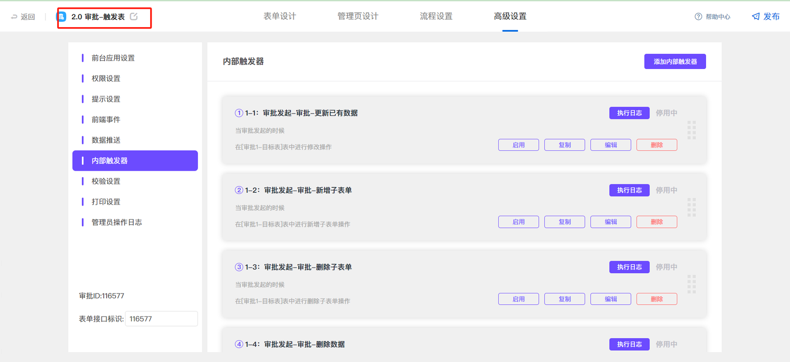

图2：业务流的流程基于单位FID统一管理入口 

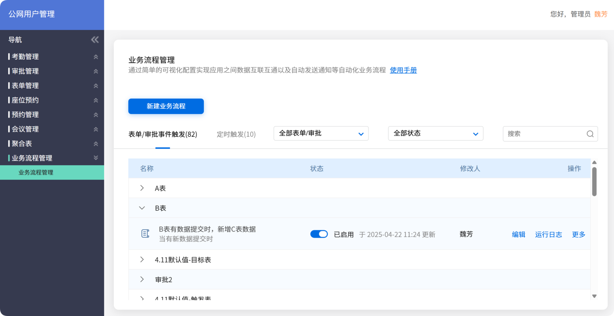

特点2：一个触发动作可配置多个分支流程 通过分支节点配置不同的分支条件，实现满足不同条件的数据按不同的流程去流转。

图1：触发器1个流程只能有1个目标表和1个执行动作 

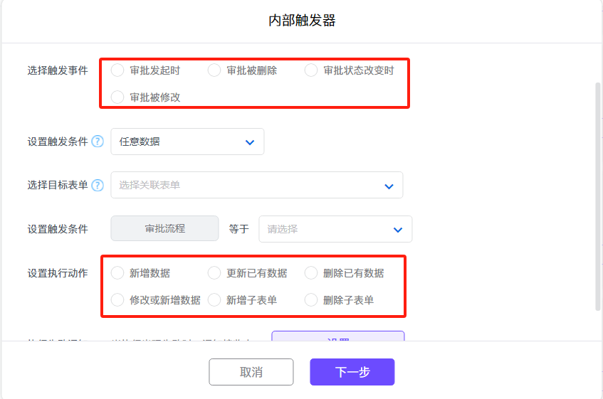

图2：业务流1个流程可以有多个目标表、多个执行动作 

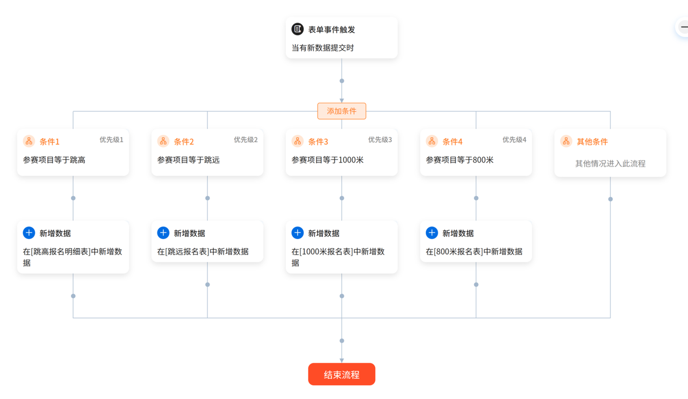

特点3：多个流程间连续触发 连续触发是指当前一个流程的执行动作符合下一个流程的触发事件时，前一个流程执行后自动触发下一个流程。业务流支持流程间的连续触发，内部触发器不支持连续触发。 

特点4：标准API接入连通器 连通器支持标准API接入，实现表单审批与第三方应用或服务之间的数据传递、业务衔接。 如下图：当员工提交一条表单数据后，往微服务用户管理注册用户。 

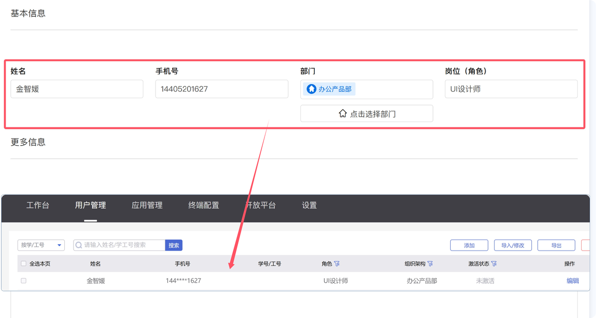

用已有功能，需要通过数据推送，由研发提供推送接口来实现 

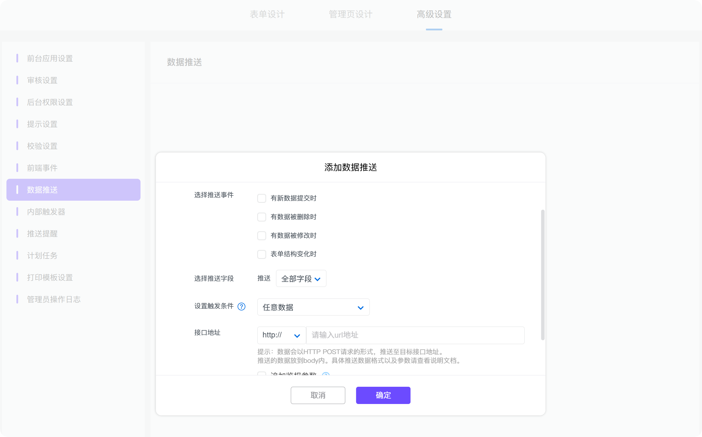

用连通器实现，可以由项目人员配置表单字段与接口参数赋值关系即可实现 

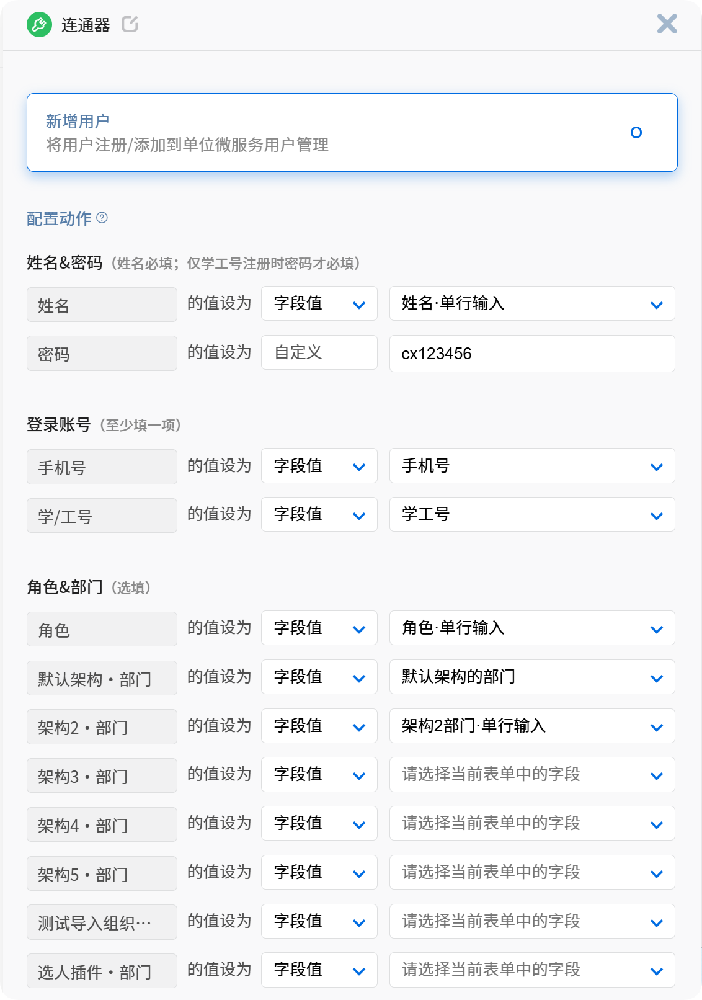

🧭 文档更新日期：2025年6月6日

#### 1.2、触发类型

[TOC]

触发类型是指触发业务流程的方式。目前支持表单/审批事件触发和定时触发两种触发类型。在创建业务流程时需要先确定一种触发类型。 表单/审批事件触发：指当表单或审批有数据变动（新增/修改/删除/状态修改）时触发整个业务流程。 定时触发：按某个固定的时间点触发业务流程。

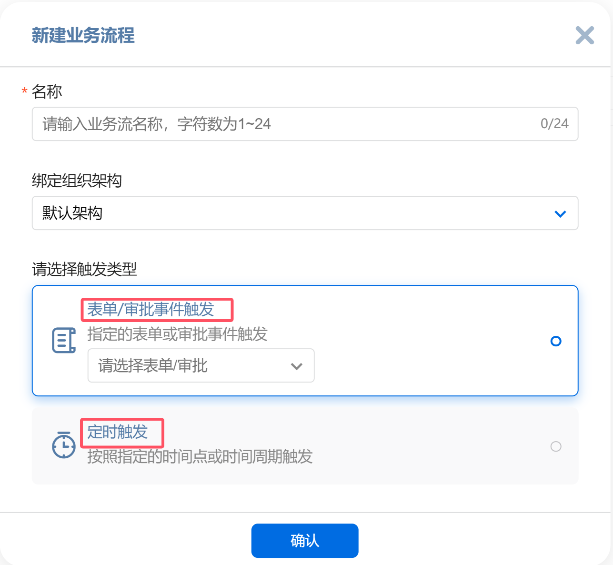

🧭 文档更新日期：2025年6月6日

#### 1.3、节点介绍

[TOC]

#### 节点介绍

业务流程的配置页面与审批流程类似，由开始节点、自定义节点、结束节点组成。自定义节点包含查询数据、操作数据（增删改）、推送提醒、分支节点、连通器 5类。通过不同节点的组合，就可以实现多张表之间、表与其他服务间的数据流转了。

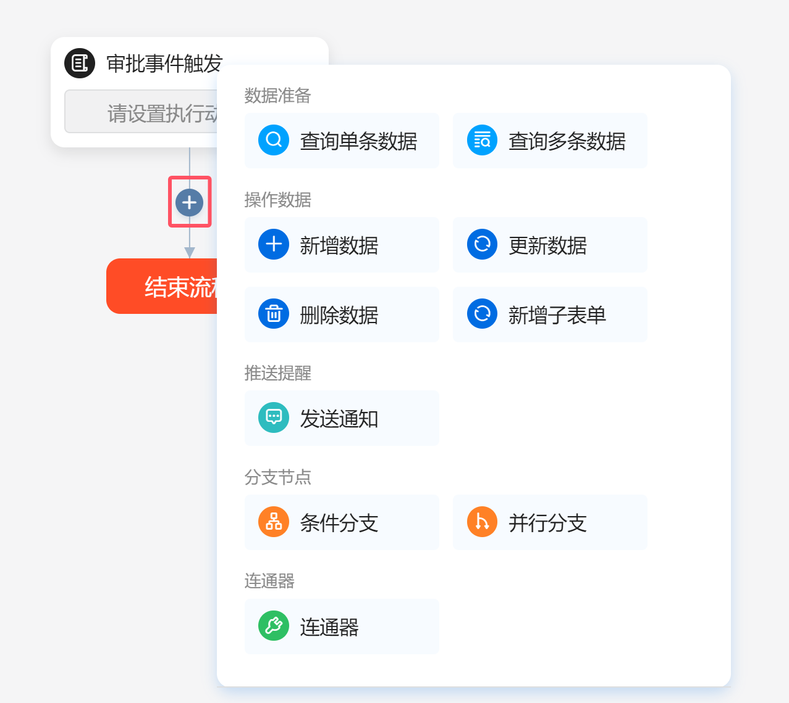

##### 1、开始节点

开始节点又叫触发节点，按触发类型的不同分为表单/审批事件触发和定时触发。

###### 1.1 表单事件触发

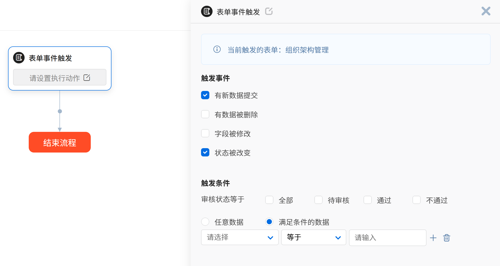

触发事件：支持有新数据提交时、有数据被删除时、字段被修改时、状态改变时4种方式。其中状态改变时，仅在表单开启审核时才显示。 触发条件：支持按审核状态和数据过滤2种方式，审核状态仅在该表单后台已开启审核时才可以设置，数据过滤支持任意数据或满足条件的数据进行触发。

###### 1.2 审批事件触发

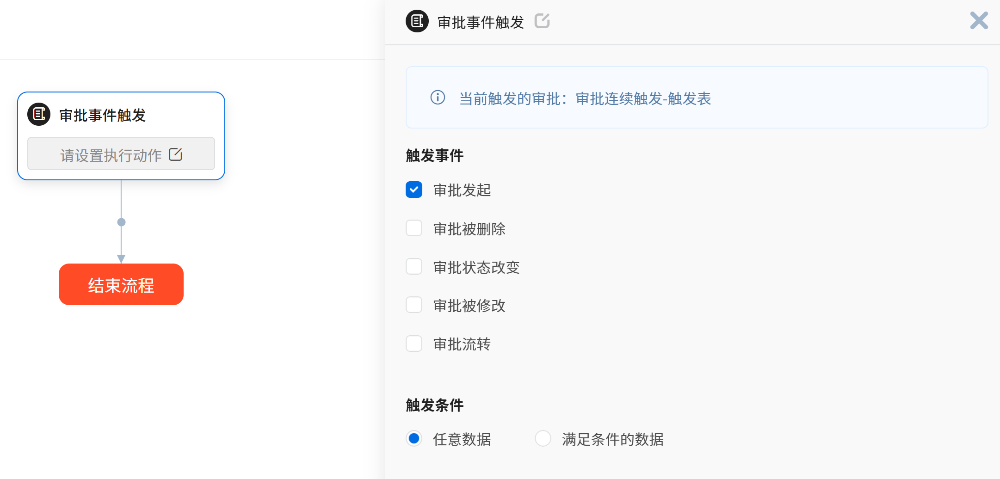

触发事件：支持审批发起、审批被删除、审批状态被修改、审批被修改/审批流转5种方式。其中审批被修改支持设置指定字段被修改，或者任意字段被修改。  审批流转是指第一级审批节点到第二级审批节点或者同一个节点设置要多人审批由其中1一个人做操作时触发。

触发条件：支持按审批状态和数据过滤2种方式，审批状态仅在触发事件选中【审批被修改】时才可以设置，数据过滤支持任意数据或满足条件的数据进行触发。

###### 1.3 定时触发

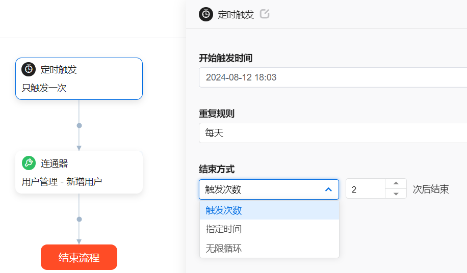

开始触发时间   业务流程开始的时间点

重复规则   重复规则支持以下5种：只触发1次、每小时、每天、每周、每月

结束方式   结束方式支持3种 触发次数：在设定的触发次数完成后结束流程。 指定时间：在指定的时间点结束流程。 循环触发：流程不结束。

##### 2、查询数据

###### 查询单条/多条数据

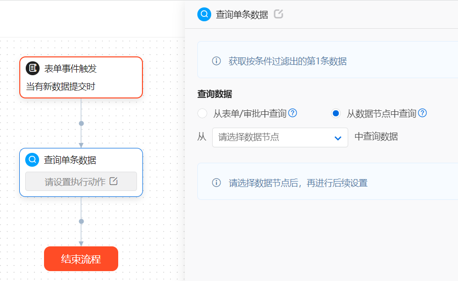

查询数据节点是为更新数据、新增子表单、删除数据节点做数据准备的。可以从表单、审批、前置的新增数据节点进行查询数据。 查询单条数据：获取按条件过滤出的第1条数据 查询多条数据：获取按条件过滤出的最多100条数据

##### 3、操作数据

操作数据节点包含新增数据、更新数据、新增子表单、删除数据4个节点，指通过节点对目标表的数据进行增、删、改等操作。操作数据节点包含新增数据、更新数据、新增子表单、删除数据4个节点，指通过节点对目标表的数据进行增、删、改等操作。

###### 3.1 新增数据

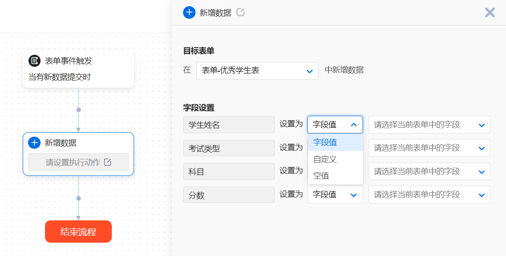

新增数据节点是指当事件触发时，在当前业务流中的选择某一个表单/审批应用作为目标表进行新增数据。新增数据支持按字段值、空值、自定义3种方式。

例如：当表单事件触发设置A表有数据提交时，添加新增数据节点，选择B表进行新增数据，可以设置B表中的字段值等于A表中的某些字段值，或者空值，或者自定义的值。

###### 2.2 更新数据

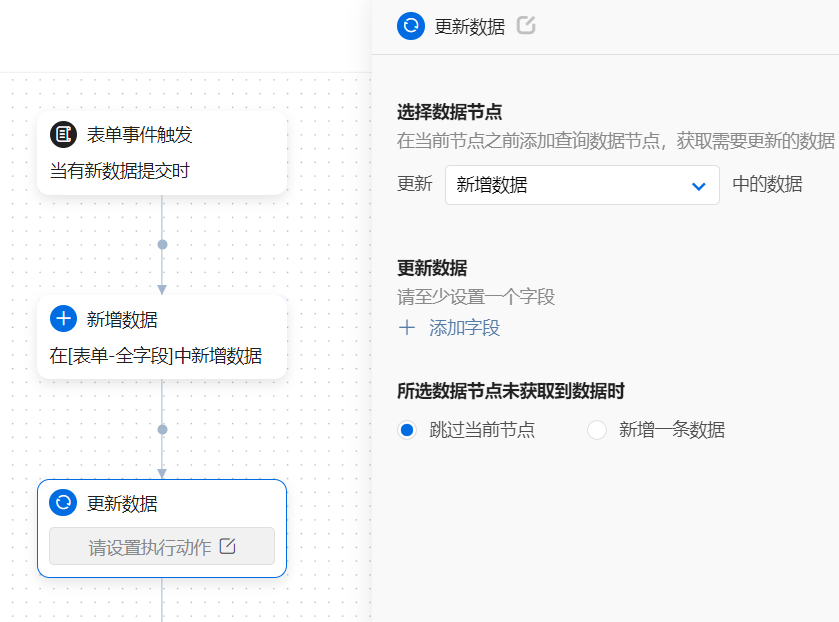

更新数据是指将选定的数据进行修改。整个过程需要设置【选择数据节点】【更新数据】【所选数据节点未获取到数据时】3个内容。

选择数据节点：可以选择前置的查询节点、新增节点。目的是为更新数据节点找到需要更新的目标数据。其他节点不可以作为更新数据节点的数据选择依据。 更新数据：基于选择数据节点筛选出来的目标数据，设置需要更新数据的字段，至少需要设置1个字段。需要更新的字段赋值方式支持按字段值、空值、自定义3种方式。 所选数据节点未获取到数据时：基于选择数据节点选择的数据获取为空时，可以选择跳过或者为目标表新增数据。

###### 2.3 删除数据

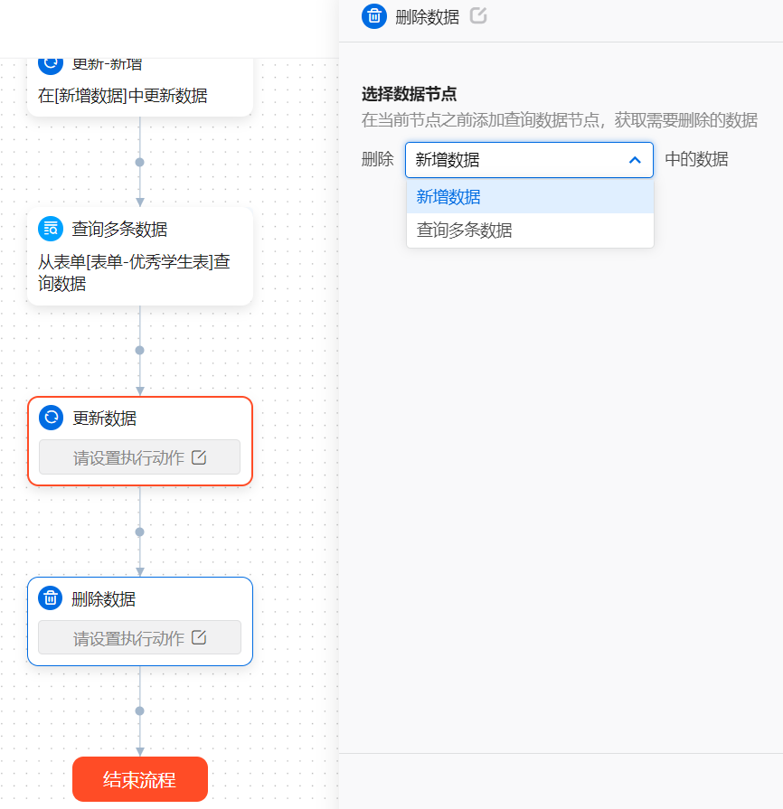

删除数据节点是指将选择的数据进行删除，支持选择前置新增数据节点和查询数据节点的数据。

###### 2.4 新增子表单

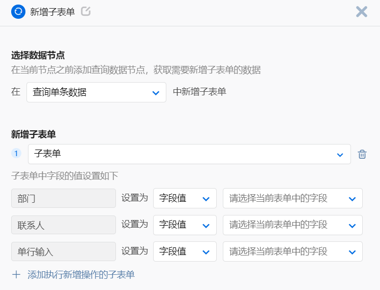

新增子表单节点是指基于前置的新增数据节点和查询数据节点对应的表结构中的子表单字段进行数据新增。

子表单字段的赋值方式支持按字段值、空值、自定义3种方式。

##### 3、 推送数据

发通知节点对接的是学习通站内信，由通知对象、通知标题、通知内容3个配置项组成，可以将流程执行的结果或触发数据的详情页实时同步到指定对象。

###### 发送通知

发通知节点对接的是学习通站内信，可以实现表单/审批事件触发或定时触发时通过学习通站内信给指定人员或指定角色的人员发送通知消息。

通知人员

当业务流触发类型为表单/审批触发时，通知人员除了支持指定成员和指定角色之外，还支持通过表内的联系人或者部门字段确定，当业务流触发类型为定时触发时，通知人员仅支持指定成员和指定角色。 表单/审批事件触发-发通知 

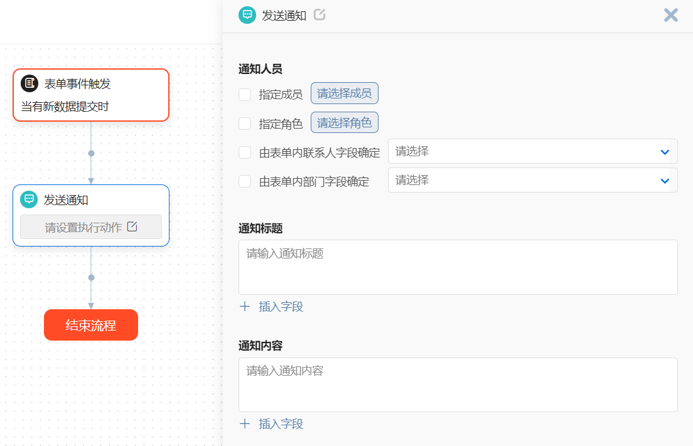

定时触发-发通知 

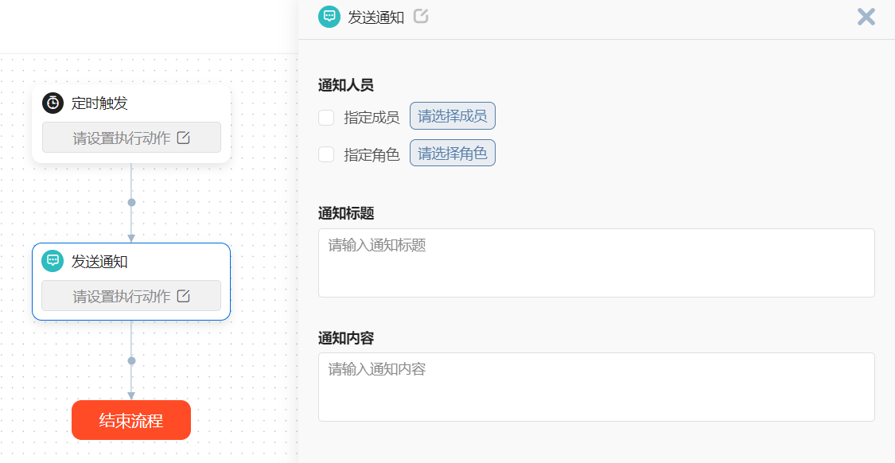

指定成员的范围，是指创建业务流时绑定的组织架构下的人员。 

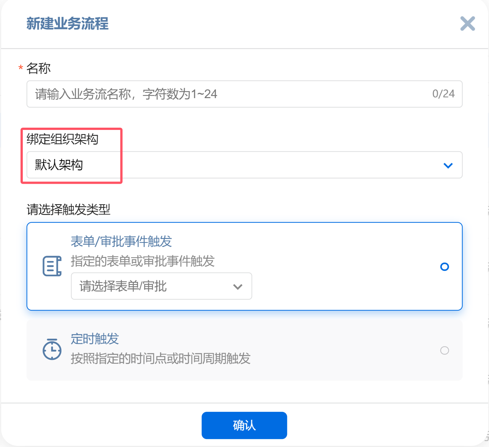

通知标题/通知内容

当业务流触发类型为表单/审批触发时，通知标题和通知内容支持插入表内字段和自定义；当业务流触发类型为定时触发时，仅支持自定义通知标题和通知内容

##### 4.、分支节点

###### 4.1 并行分支

并行分支：分支之间无优先级，满足条件的分支都会执行 

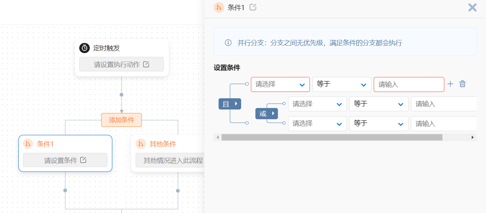

设置条件：支持按字段设置同级或者子级条件，多级条件之间支持为且和或的关系。

###### 4.2 条件分支

条件分支：只执行满足条件且优先级最高的分支，数字越小优先级越高 

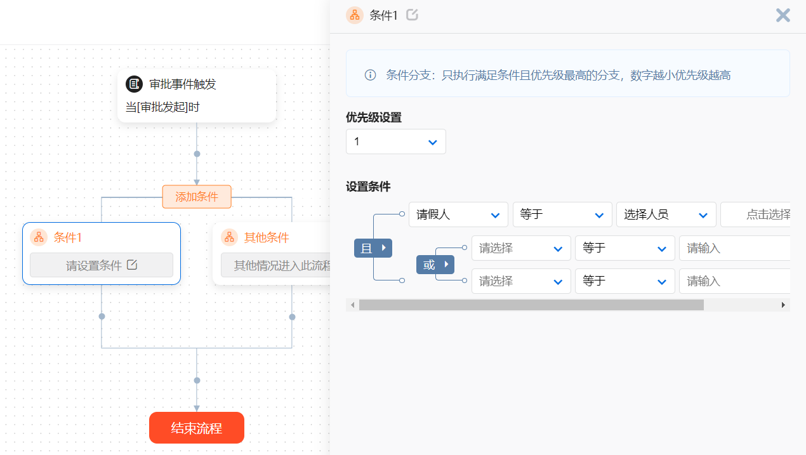

优先级设置： 每个条件有唯一顺序的优先级。 设置条件：支持按字段设置同级或者子级条件，多级条件之间支持为且和或的关系。

##### 5、 连通器

连通器是用于连接表单与其他应用数据的节点，分为官方连通器和自定义连通器。 

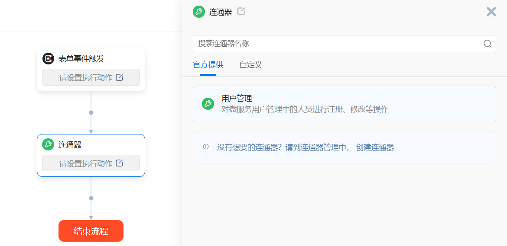

###### 5.1 官方连通器

官方连通器是指平台提供的节点，所有业务流的用户都可以直接使用。当前官方连通器有用户管理和组织架构2个，后续会根据市场需求逐渐增加其他连通器。

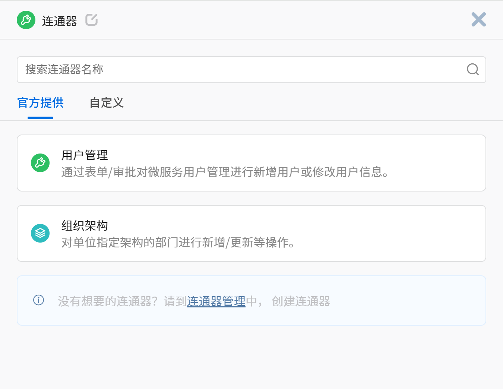

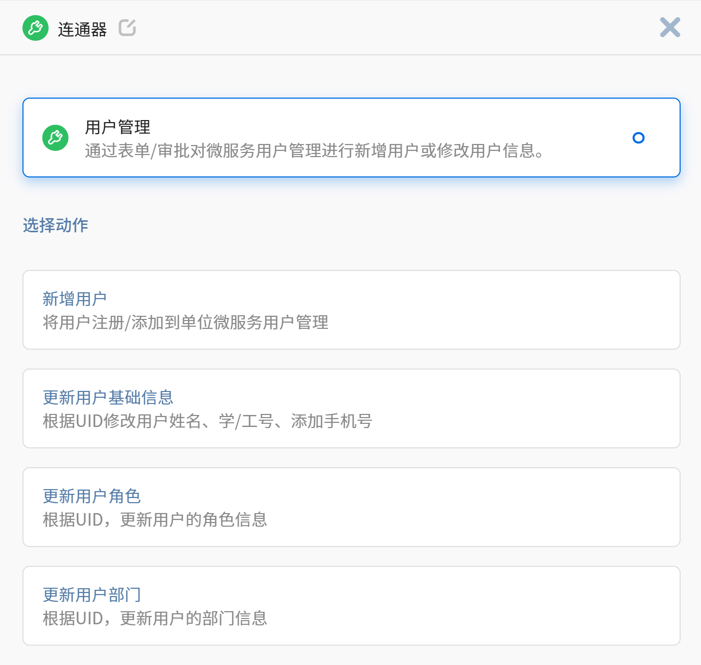

拿新增用户举例，动作配置面板需要分为3部分。 第1部分是注册用户时，微服务需要填写的一些必要字段； 第2部分是支持给微服务注册用户字段赋值的方式，根据各字段的属性笼统的支持字段值/空值/自定义等方式； 第3部分是通过表单字段或自定义字段值给微服务注册用户字段赋值。 通过设置表达式：{注册用户需要的姓名字段=表单字段值【姓名】}就实现了表单字段与注册用户接口字段的对应关系配置。其他字段的配置同理，以此配置所有必填字段并保存流程后，通过在表单操作数据，即可触发注册用户到微服务的流程执行。 

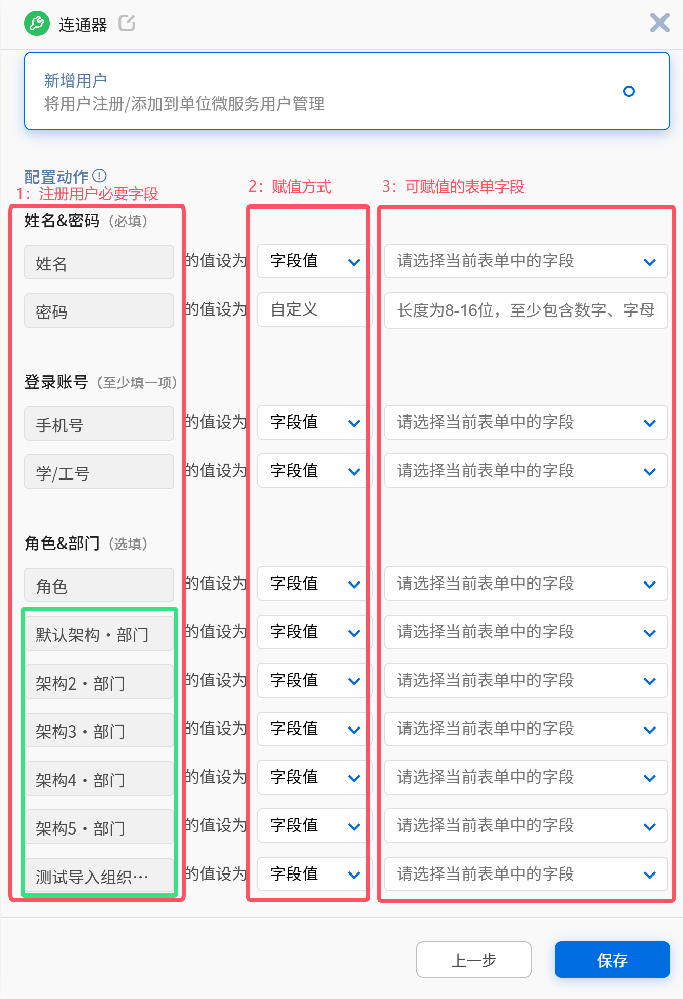

其中绿色框的字段表示单位组织架构，是根据各单位的情况动态展示单位下的全部组织架构。

关于【用户管理】连通器更多的使用案例，请参考[连通器-用户管理](https://document.chaoxing.com/web/#/115/1910 "连通器-用户管理") 关于【组织架构】连通器的使用案例，请参考[连通器-组织架构](https://document.chaoxing.com/web/#/115/2220 "连通器-组织架构")

###### 5.2 自定义连通器

官方连通器没有提供的应用，具有一定代码处理能力的用户可以通过连通器管理平台搭建自定义连通器。创建的连通器可以在自定义连通器中查看并使用。 

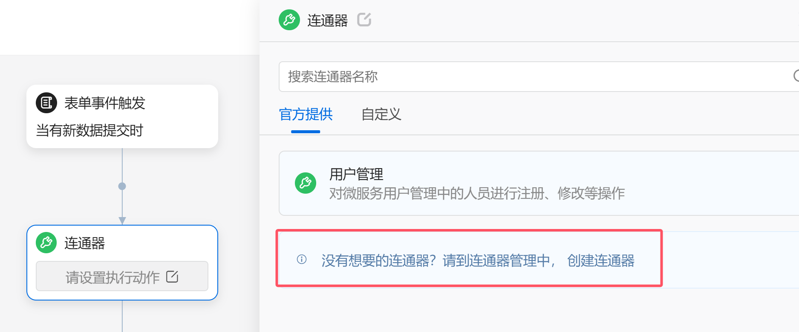

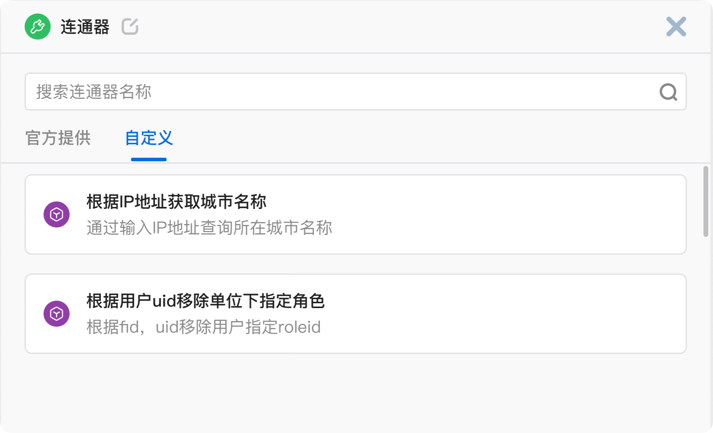

[连通器管理平台使用说明](https://document.chaoxing.com/web/#/130/1912 "连通器管理平台使用说明")

🧭 文档更新日期：2025年6月6日

### 2、二、创建并发布业务流程

#### 2.1、申请开通

业务流程管理当前处于试运行阶段，为保障服务稳定性，仅支持按FID+UID开放权限。请先阅读本手册了解业务流相关功能，如需开通使用，请提交[业务流程开通申请](http://16q.cn/JoyAWm "业务流程开通申请")。

开通申请的结果，会以学习通通知的方式告知您，请注意查收。待收到开通成功通知后，进入单位表单后台，会有一个【业务流程管理】入口，就可以开始使用业务流程管理了。 

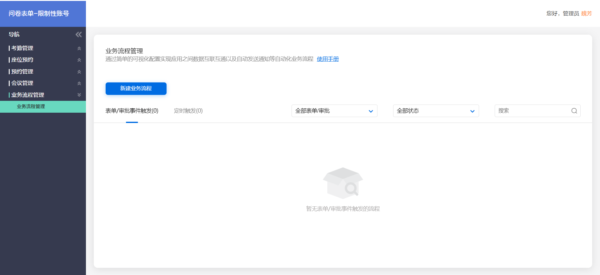

🧭 文档更新日期：2024年8月14日

#### 2.2、创建流程

已开通权限的单位用户，可以点击【新建业务流程】按钮，进入创建流程。创建业务流程需要确定3个元素： 业务流名称：必填，一个应用下有多个流程时，方便通过名称快速查找流程 绑定的组织架构：系统默认绑定默认的组织架构，方便在使用到通知节点时根据业务流绑定的组织架构设置通知人员。 触发的类型：目前支持表单/审批事件触发和定时触发2种方式。 

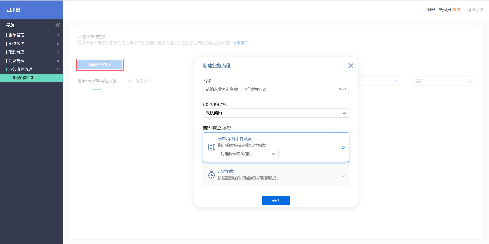

🧭 文档更新日期：2025年6月6日

#### 2.3、发布业务流程

发布业务流 流程配置完成后，点击右上角的【发布】按钮，即创建业务流程成功。 

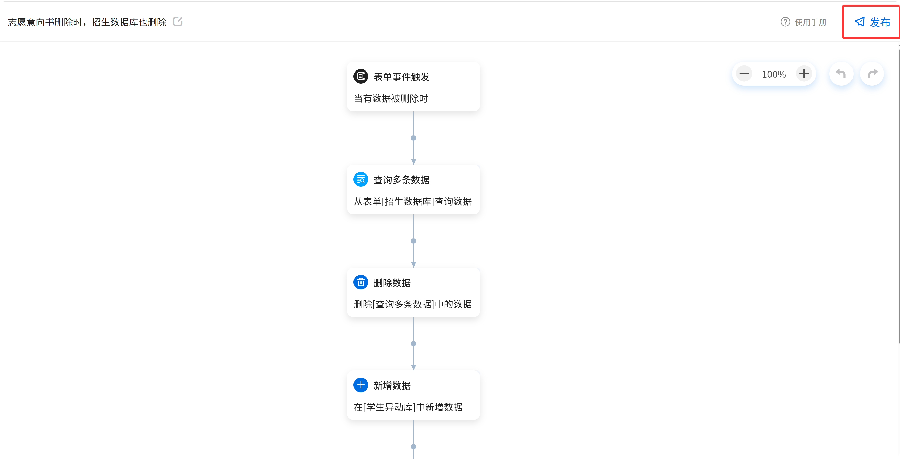

🧭 文档更新日期：2025年6月6日

### 3、三、运行业务流程

#### 3.1、运行业务流程

[TOC]

##### 1、业务流程状态

只有当业务流程状态为“已开启”时，业务流程才会运行。新创建的业务流程默认已开启状态。 

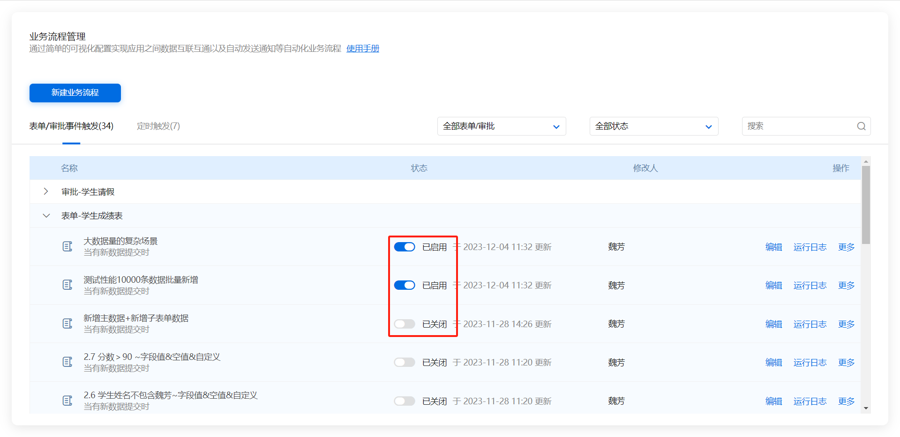

##### 2、运行日志

点击操作栏-运行日志，可以看到每条数据实例的运行结果，运行结果分为执行成功、执行中、执行失败 3种状态。执行失败的日志，可以查看对应失败的节点以及失败的原因。执行失败的数据实例，可以查看触发数据的数据id、数据详情地址、执行失败的原因。 

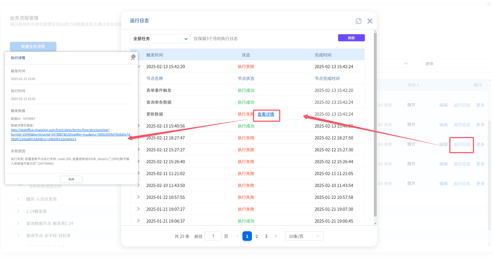

##### 3、操作记录

点击操作栏-更多-操作记录，可以查看当前流程配置的修改记录。 

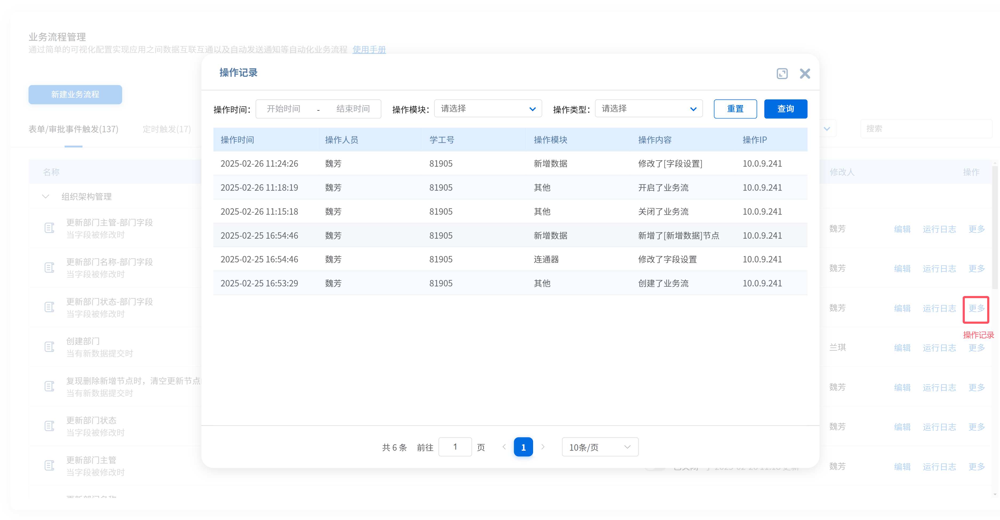

🧭 文档更新日期：2025年6月6日

### 4、四、连通器管理平台

#### 4.1、连通器管理平台

[TOC]

##### 1、什么是连通器管理平台？

连通器管理平台是提供给用户自定义创建连通器的工具。使用连通器管理平台，需要具有一定代码处理能力，创建的连通器可以在自定义连通器中查看并使用。自定义连通器的权限是以fid为单位的，即一个fid下创建的自定义连通器，该fid下的用户，在业务流程配置中，都可以使用。

##### 2、平台入口

在业务流程配置-添加节点-连通器-官方连通器列表下方，当在官方连通器中没有找到响应的应用时，就可以进入连通器管理平台创建自定义连通器 

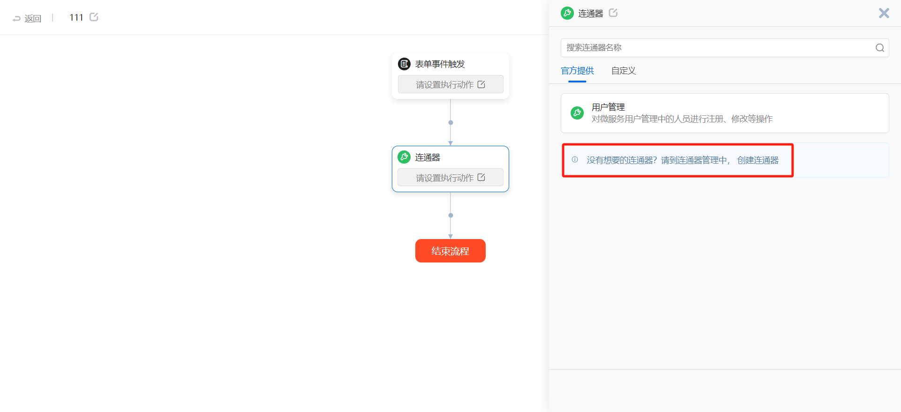

##### 3、连通器管理列表

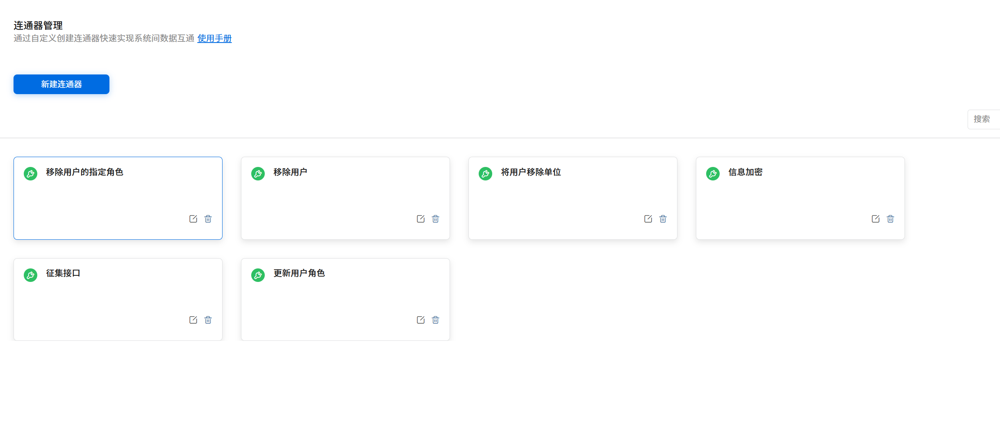

##### 4、创建连通器

在连通器管理列表页左上角，点击【新建连通器】进入创建连通器页面

基础设置：输入连通器名称、说明描述、图标 

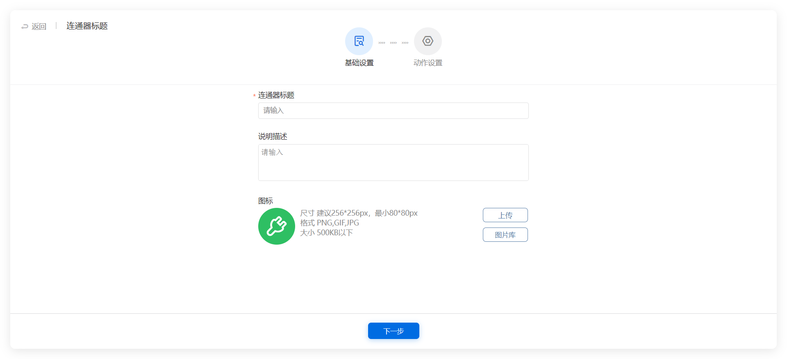

该三个信息主要用户在业务流程中显示出自定义连通器的基础信息，方便用户根据基础信息判断该自定义连通器的用途。

动作设置 

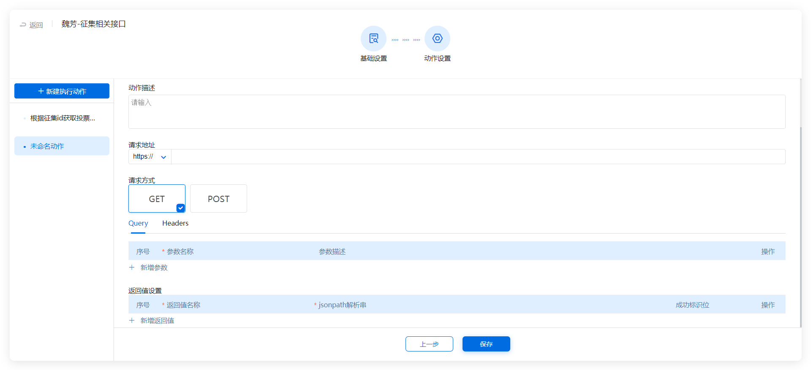

新建执行动作：点击页面左侧【新建执行动作】按钮，可以添加动作，一个连通器可以有多个动作。 动作名称：用于在业务流程配置页面连通器动作的显示名称 动作描述：用于业务流程配置页面连通器动作的副标题，辅助理解动作名称 请求地址：该动作执行时，需要请求的接口地址 请求方式：支持GET和POST请求两种方式。 入参：根据请求方式不同，设置不同的参数名称和参数描述，参数名称是需要在业务流程配置中展示给用户的字段，建议写的偏业务一些，方便用户理解。且目前仅支持固定入参。 出参：调用接口后需要返回的字段。返回值名称，会在连通器后置节点赋值时展示给用户，且返回字段的值需要用jsonpath解析出来。 删除：已添加的动作右上角支持删除

设置完整的参考如下 

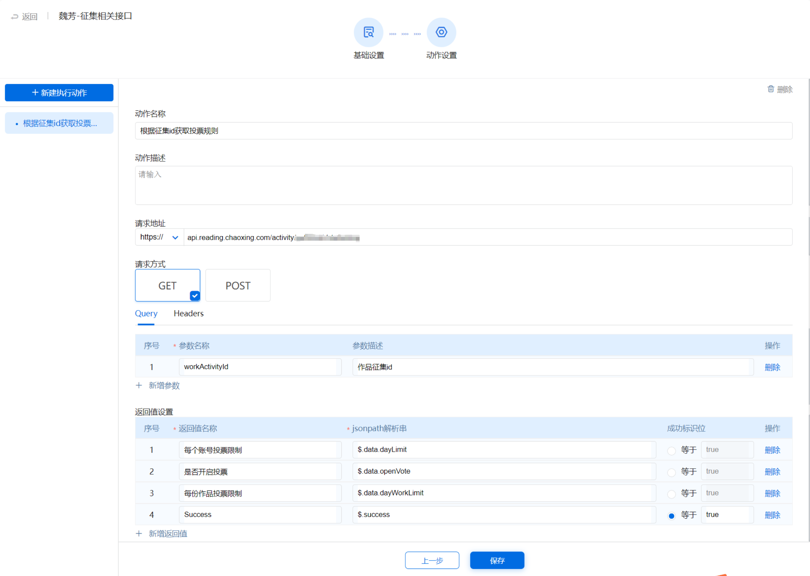

🧭 文档更新日期：2025年6月6日

### 5、五、视频演示案例

#### 5.1、连续触发

[TOC]

连续触发分为流程内连续触发和流程间的连续触发。

##### 1、流程内的连续触发

在一个流程中实现，同一条触发数据，可以连续触发到多个不同的目标表。 

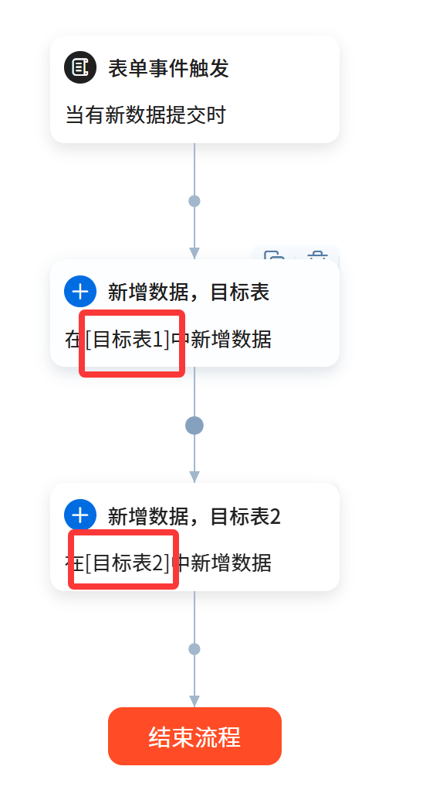

举例： 当触发表提交一条数据时，往目标表1中新增一条数据，再往目标表2新增数据。

效果演示视频如下，点击链接查看视频 https://pan-yz.cldisk.com/external/m/file/1034858747269328896

##### 2、流程间的连续触发

连续触发是指当前一个流程的执行动作符合下一个流程的触发事件时，前一个流程执行后自动触发下一个流程。 

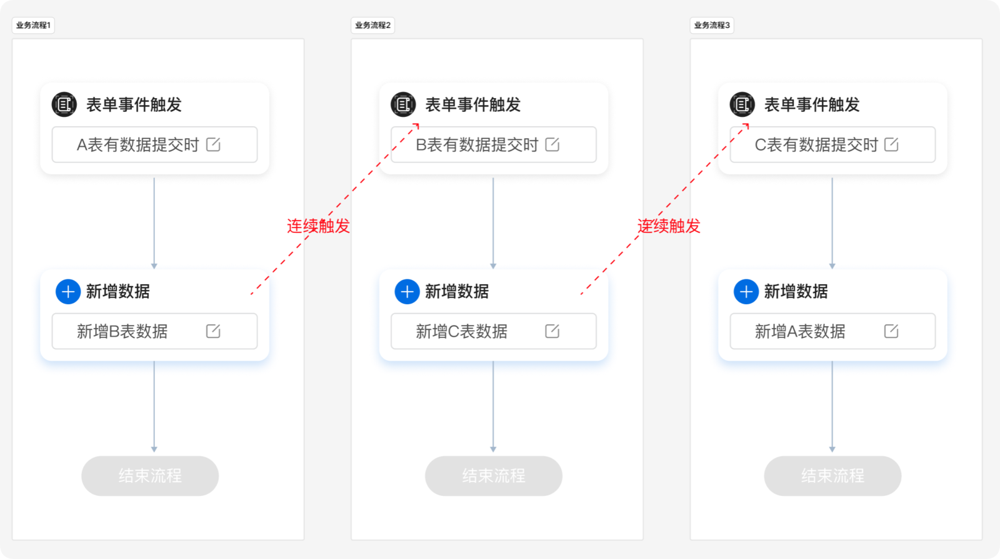

举例： 流程1设置为：当表单1提交一条数据时，修改表单2的数据； 流程2设置为：当表单2的数据被修改时，修改表单1的数据。

效果演示视频如下，点击链接查看视频 https://pan-yz.cldisk.com/external/m/file/1034858779714351104

🧭 文档更新日期：2025年6月6日

#### 5.2、官方连通器-用户管理

[TOC]

用户管理连通器是指可以通过表单/审批事件触发，再通过用户管理连通器相关动作来实现对单位下的用户进行新增和更新的操作。包含新增用户、更新用户基础信息、更新用户角色、更新用户部门4个动作，每个节点只能选择一个动作，每个流程中可以添加多个连通器节点。

使用用户管理连通器主要分以下三个步骤：

##### 第一步：准备一张用户信息管理表，设计表单结构时需要注意以下几点

###### 1、确认表中需要包含哪些字段？

注册用户时必要字段，比如姓名，手机号，学工号

角色字段，支持单行输入，多选，单选，下拉框，下拉复选

部门字段，支持单行输入和部门字段

基于项目需求想要在表单中存储的其他用户信息字段

用于存在执行动作返回的字段，比如uid，是否执行成功，返回信息等

###### 2、字段类型的选择如何确定？

参考配置规则，每个动作都要配置规则说明。

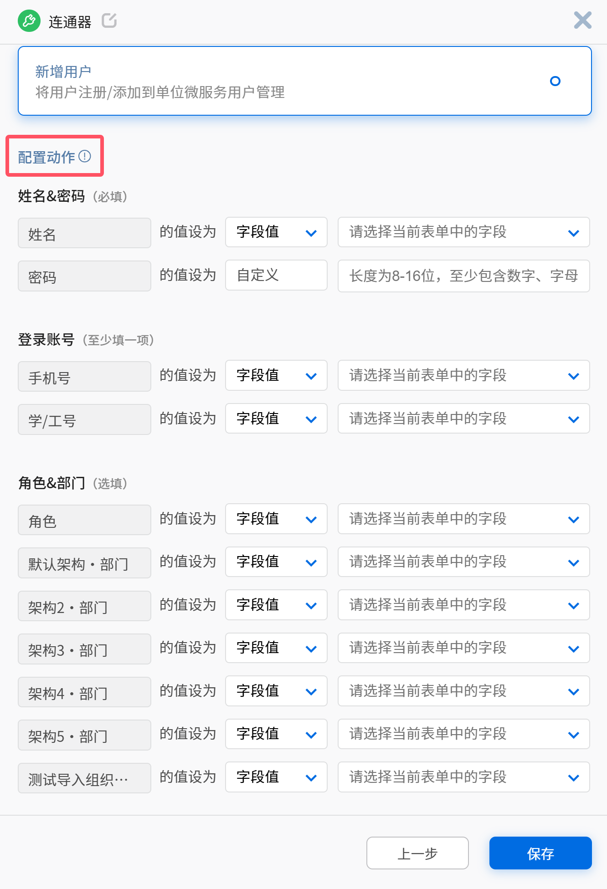

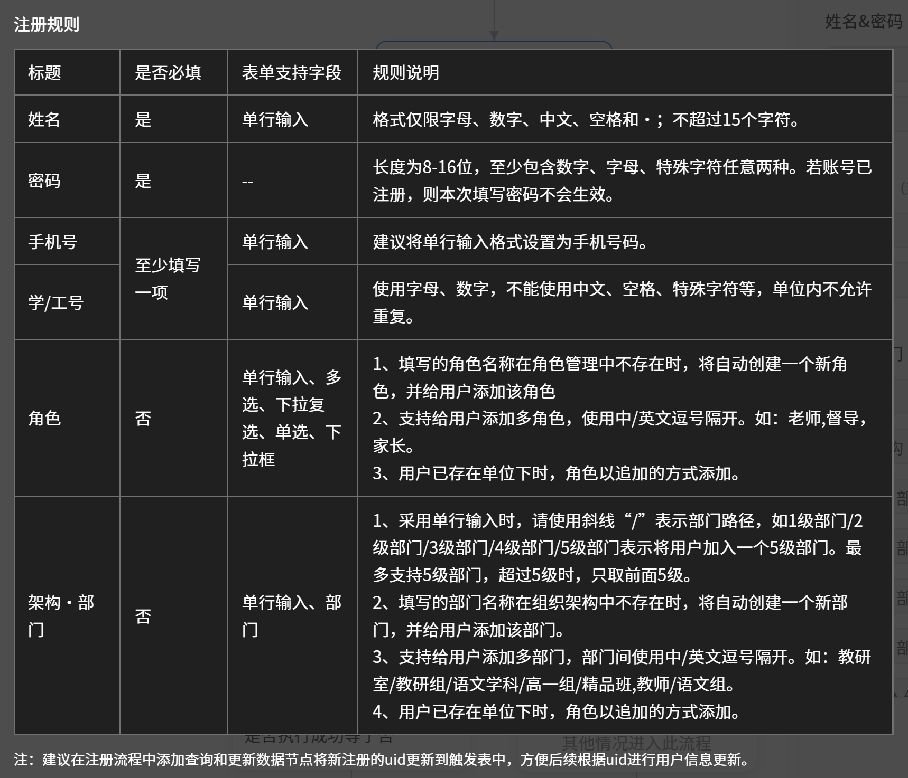

以新增用户举例：角色支持多个字段，但每次赋值时只能选择一个字段，故在选择字段时，可以基于项目情况而定。 如果先要最大限度给用户自定义角色自由，就使用单行输入字段； 如果要严格限制用户只能选择单位下已有角色，那就使用多选或者下拉复选； 如果想要优先让用户选择单位下已有角色，仅在单位没有角色时再由用户自己定义角色，则使用多选或者下拉复选并开启其他选项。

部门支持表单的单行输入和部门字段，若仅支持用户选择单位下已有部门，则选择部门字段；若支持用户自定义部门，则选择单行输入字段。

注意：一个表单只能绑定一套组织架构，如果需要在表单中维护多套架构下的部门信息时，仅绑定表单这套架构可以使用部门字段，其他架构的部门信息，则需要用单行输入字段来赋值。

###### 3、字段的规则校验设置

表单支持设置校验的字段，可以通过表单设置好校验要求，减少用户触发时因为不满足注册规则导致连通器触发失败。 姓名：单行输入字段勾选必填 手机号：单行输入字段格式限制为手机号 学工号：单行输入字段校验限制不允许重复 注册后返回的字段：隐藏字段显示 高级校验设置手机号与学工号不允许同时为空

##### 第二步：搭建业务流程

根据项目需要，搭建新建用户、更新用户信息流程。

###### 1、新增用户：通过表单/审批触发动作，往单位下注册用户。

新增用户完整业务流程 

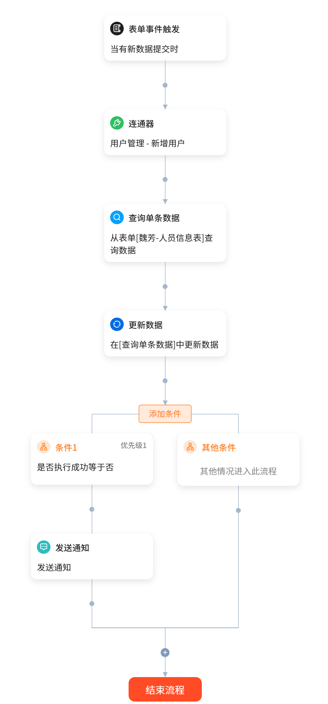

触发事件：有新数据提交时 

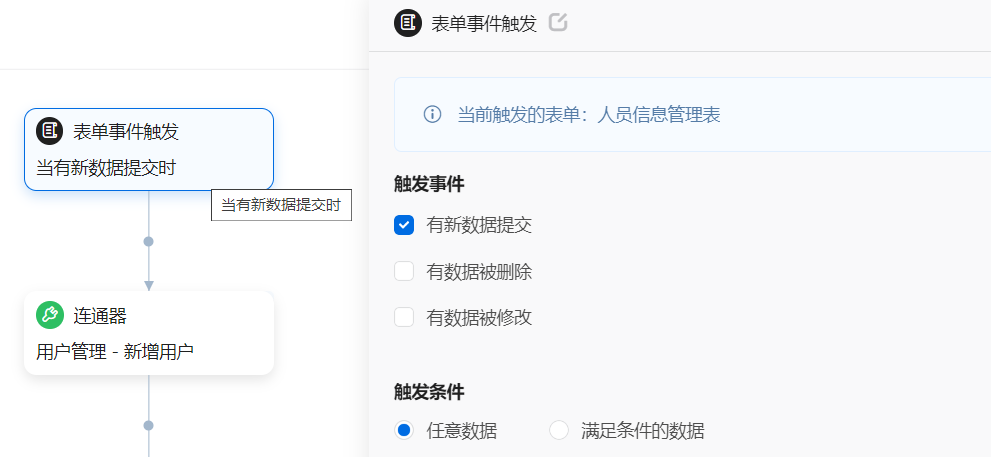

连通器配置：根据注册用户要求字段要求与项目需求逐一配置字段赋值规则

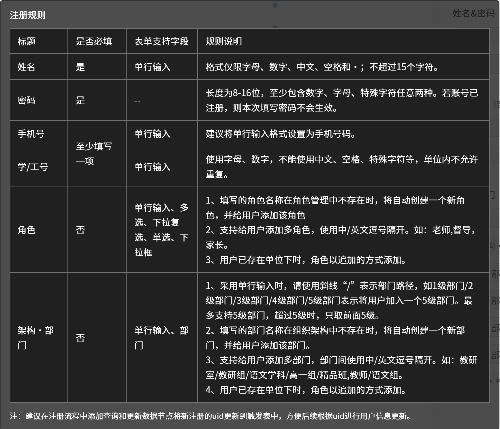

回填信息：通过查询节点、更新节点将注册用户的返回信息，是否注册成功，注册成功后的uid、联系人等信息更新回表单，便于后续更新用户和统一查看注册用户的结果。 

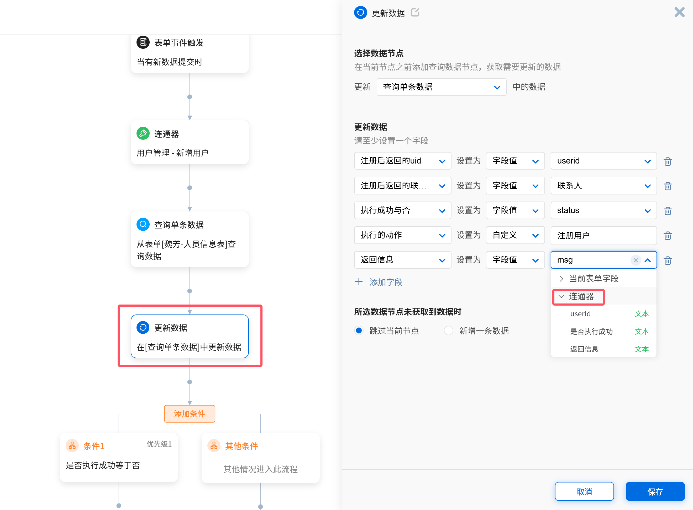

发送通知：用条件分支判断前置连通器的执行结果，当执行结果为否时，通过通知节点给相关人员推送执行失败的学习通通知消息。 

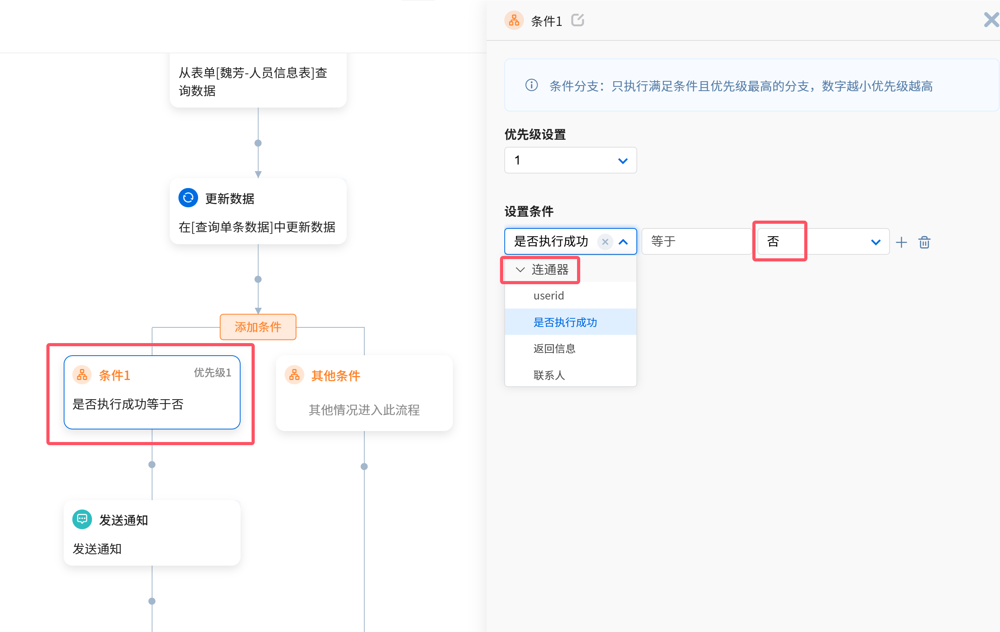

注意事项：

注册用户包含将未注册过的账号注册到指定单位下，也包含已注册过超星网的账号绑定到指定单位下

为了减少注册失败的情况，表单可以校验的字段比如姓名必填、学工号不允许重复、手机号格式、手机号和学工号不同时为空等，通过表单功能设置好校验规则

注册后切记需要将注册节点返回的uid/联系人等业务信息+节点执行结果信息更新回到触发数据中，方便统一查询执行结果以及处理批量处理注册失败的数据

###### 2、更新用户基础信息：根据用户uid，更新用户的姓名、手机号、学工号等基础信息。

触发事件：有字段修改-指定字段修改时 

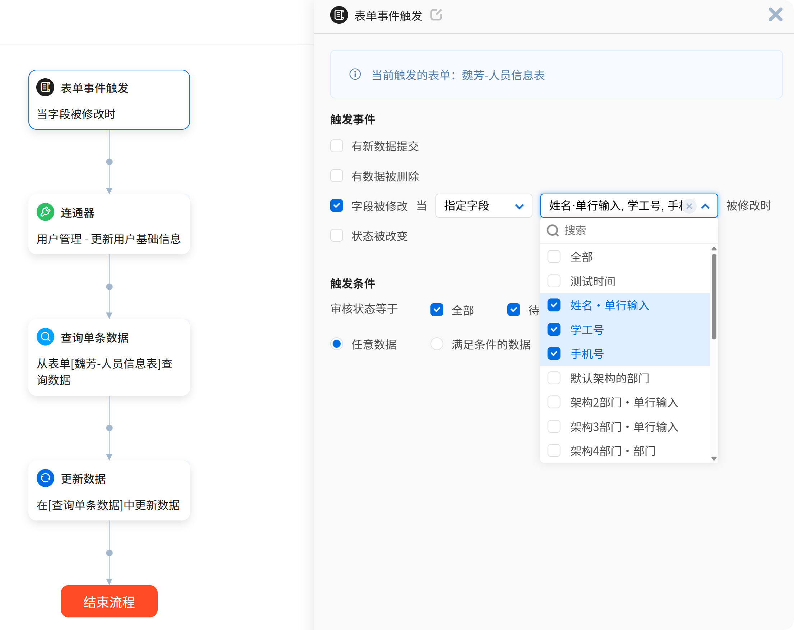

连通器配置：根据更新用户基础信息字段要求逐一配置字段赋值规则

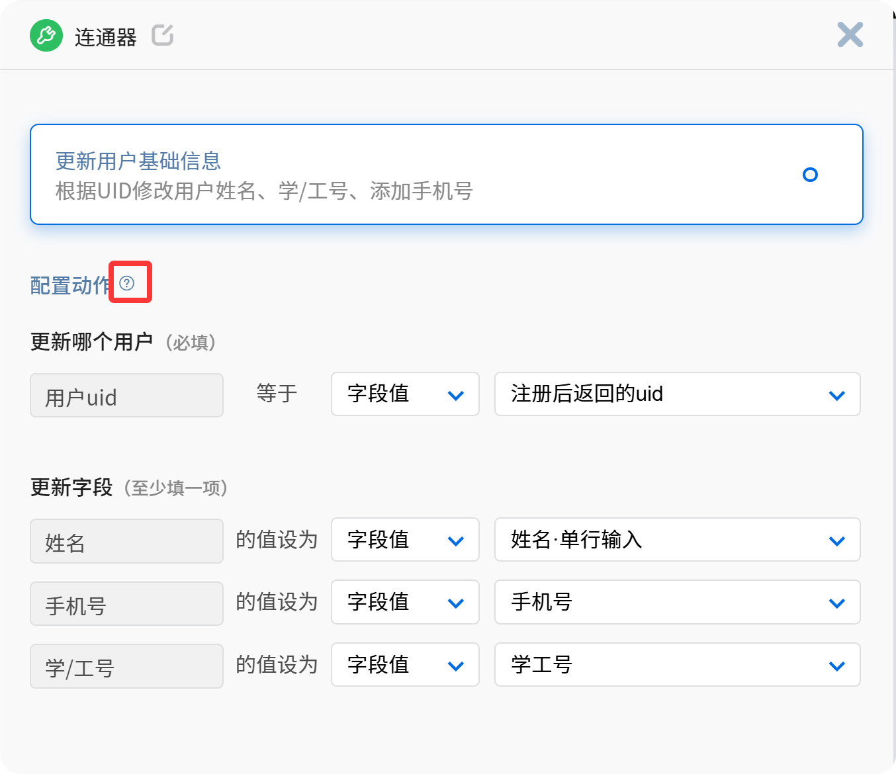

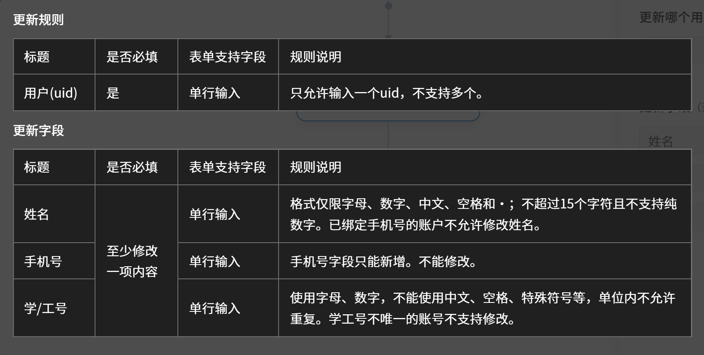

回填信息：通过查询节点、更新节点将动作的返回信息，是否更新成功等信息更新回表单，便于统一查看和处理结果。

注意事项：

流程的触发事件选择姓名、手机号、学工号相关字段被修改时触发。

姓名：不允许更新为空，赋值字段值空数据或者空值，都将更新失败

手机号：若账号原本已有手机号，不支持换绑、解绑手机号；新绑定的手机号若已注册超星账号，需要注册时的姓名与当前姓名一致。

学工号：同一个单位下不允许重复。同一个uid对应多个学工号的不支持修改

###### 3、更新用户角色：根据用户uid，更新用户的角色。

触发事件：有字段修改-指定字段修改时 一般一张表单中只会有一个字段来体现角色，根据项目选择的字段来设置指定字段即可。 

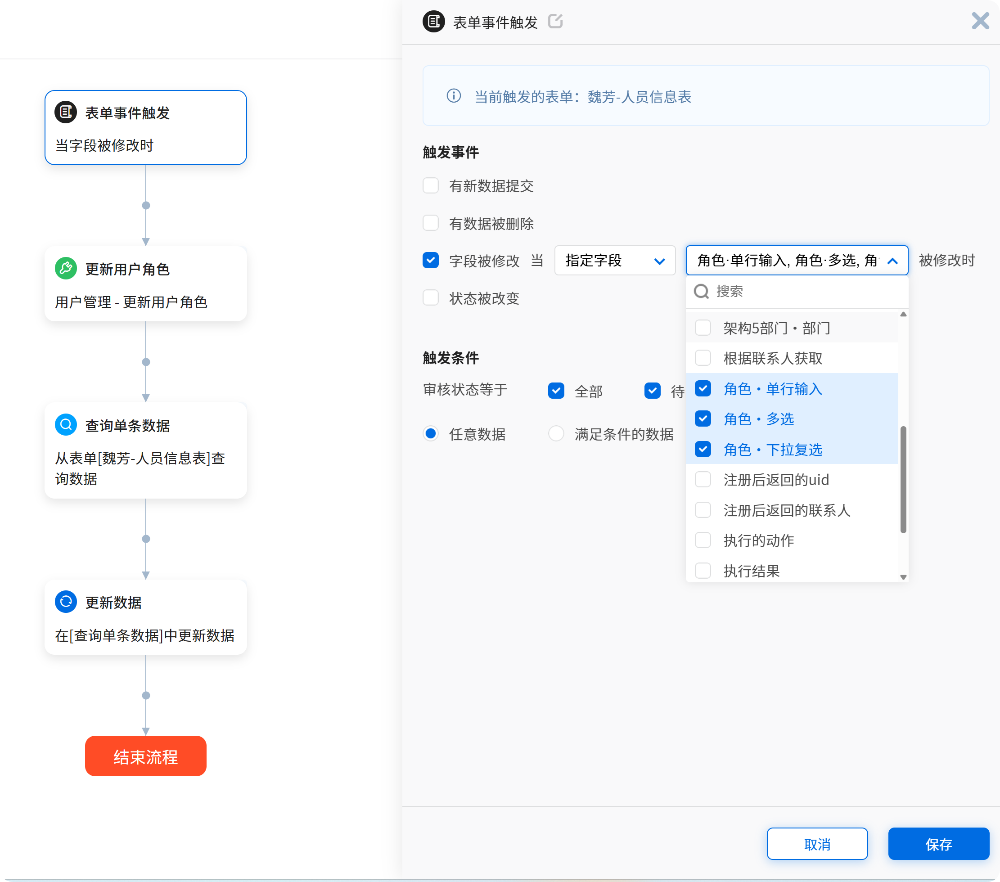

连通器配置：根据更新用户角色字段要求逐一配置字段赋值规则

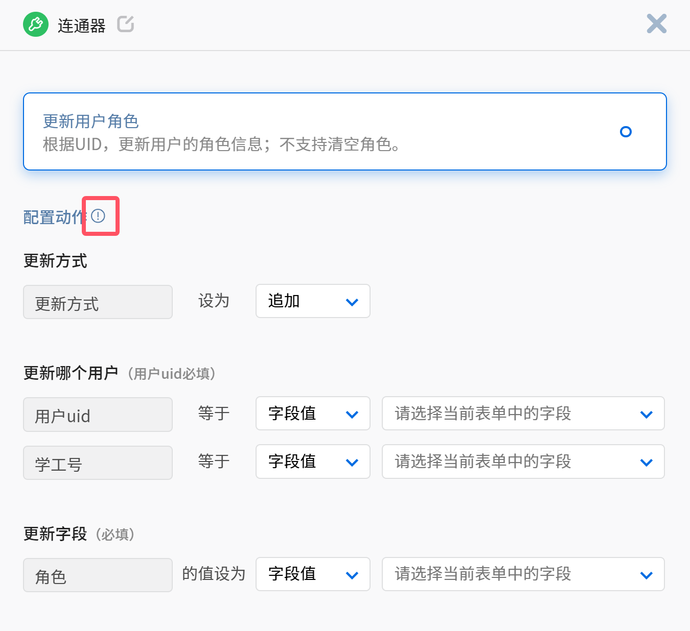

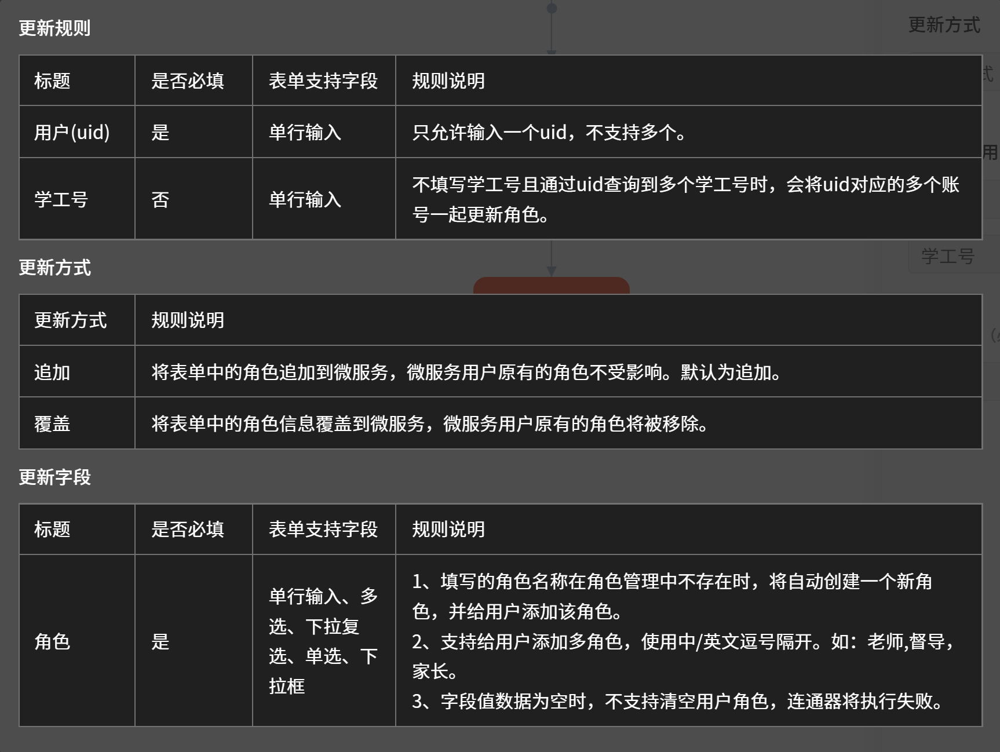

回填信息：通过查询节点、更新节点将动作的返回信息，是否更新成功等信息更新回表单，便于统一查看和处理结果。

注意事项：

流程的触发事件选择角色相关字段被修改时触发。

更新方式不支持移除/删除；覆盖时也不允许赋空值

存在1个uid对应多个学工号情况的场景，学工号也需要配置

角色字段支持由单行输入、单选、多选、下拉框、下拉复选进行赋值，一个连通器节点只能选择一个字段值进行赋值，根据业务场景选择合适的字段类型进行赋值

###### 4、更新用户部门：根据用户uid，更新用户的部门信息

触发事件：有字段修改-指定字段修改时 因为一张表单只能绑定一套组织架构，所以只能有一个部门字段来体现部门，剩余架构的信息可以用单行输入字段来体现。 

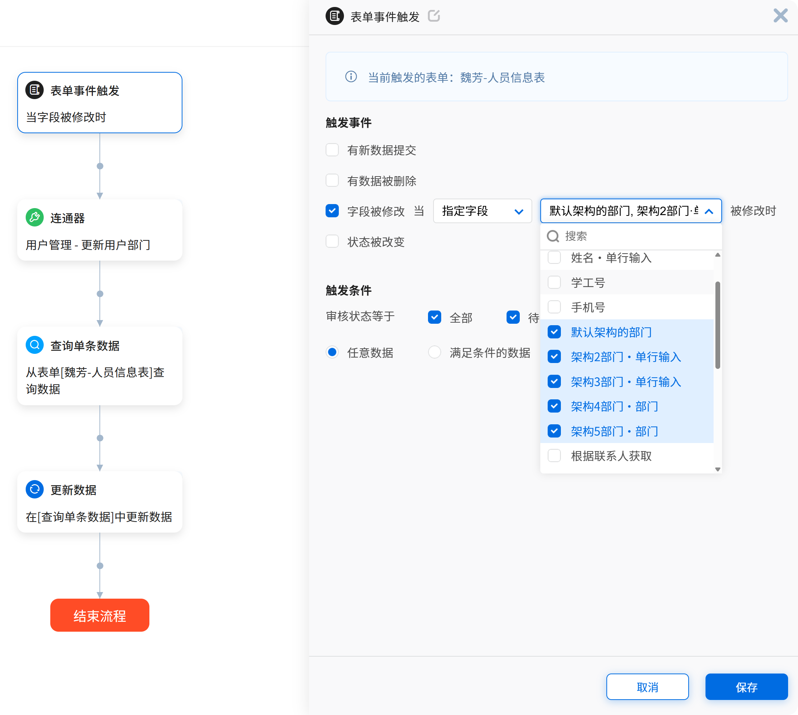

连通器配置：根据更新用户部门字段要求逐一配置字段赋值规则

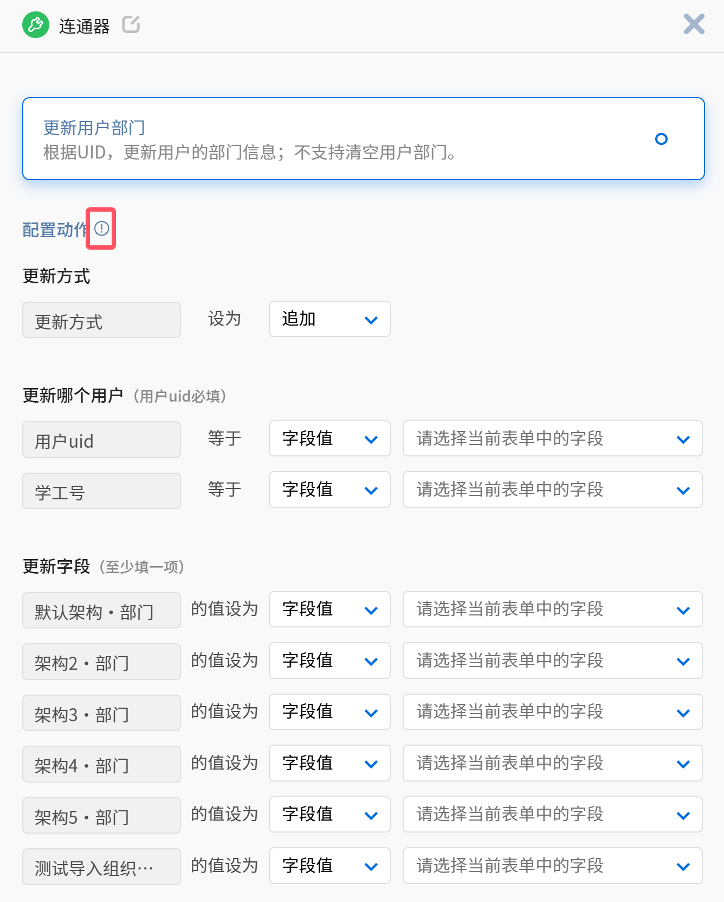

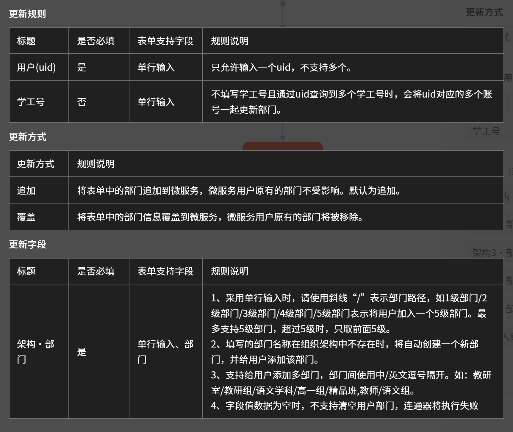

回填信息：通过查询节点、更新节点将动作的返回信息，是否更新成功等信息更新回表单，便于统一查看和处理结果。

注意事项：

流程的触发事件选择部门相关字段被修改时触发。

更新方式支持追加和覆盖，不支持移除/删除；覆盖时也不允许赋空值

可更新部门的组织架构范围：单位下的全部组织架构

部门字段支持单行输入和部门字段进行赋值； 用单行输入字段赋值时，组织架构下不存在的部门，可以创建后再给用户添加部门 用部门字段赋值时，若表单绑定的组织架构与赋值的架构不一致，则会将部门字段的名称去判断赋值架构下是否存在，存在就给用户添加部门；不存在就创建部门后再给用户添加该部门

##### 第三步：触发业务流程并查看执行结果

表单/审批触发数据 通过表单/审批提交/修改/删除数据，来触发流程

查看执行结果 根据各流程配置的返回字段，在对应的表中查看各动作的返回信息和执行结果

查看执行日志 若在更新返回信息表中未看到更新回来的信息，则进入业务流程管理-运行日志，查看是否调用接口成功。

##### 演示流程

注册用户并回填uid和联系人

修改学工号和用户姓名

绑定手机号

已绑定手机号的用户不支持修改姓名和手机号

更新或创建并更新用户角色

更新或创建并更新用户部门

效果演示视频如下，点击链接查看视频 https://pan-yz.cldisk.com/external/m/file/1033453691469418496

🧭 文档更新日期：2025年6月6日

#### 5.3、官方连通器-组织架构

[TOC]

组织架构连通器是指可以通过表单/审批新增/修改数据时触发，再通过组织架构连通器相关动作来实现对单位指定架构的部门进行创建和更新部门等操作。包含创建部门、更新部门名称、更新部门主管、更新部门状态4个动作，每个节点只能选择一个动作，每个流程中可以添加多个连通器节点。

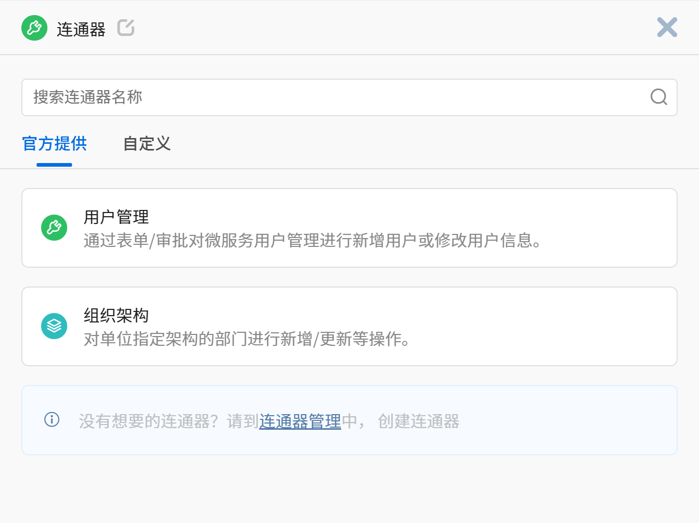

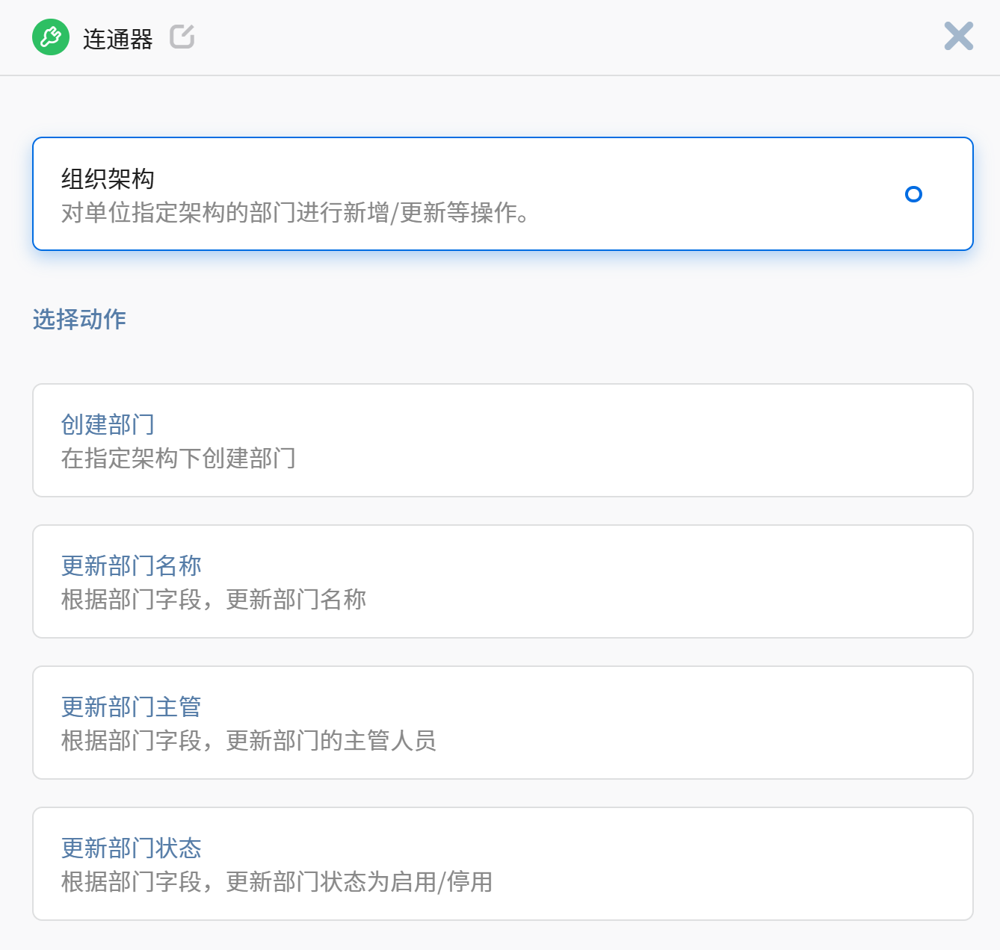

##### 1、创建部门

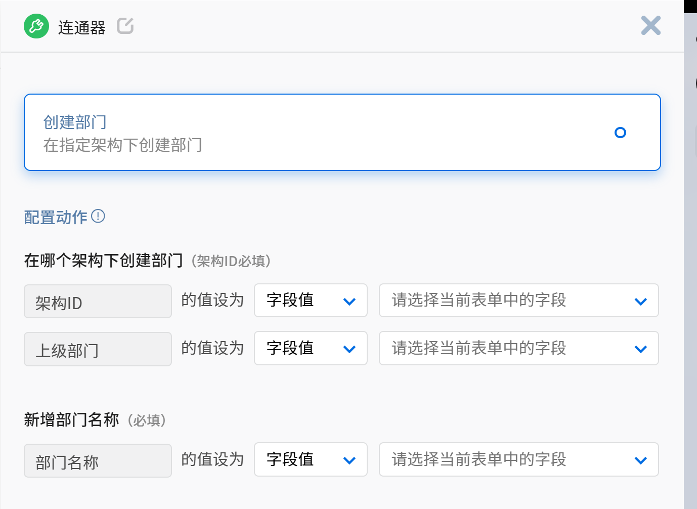

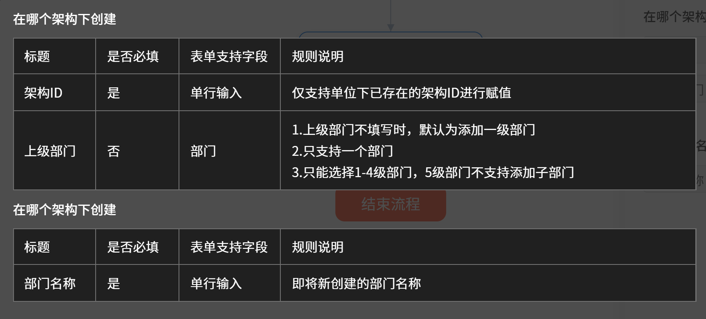

架构ID：必填，指微服务组织架构中的架构ID；仅允许传本单位下的架构ID。 

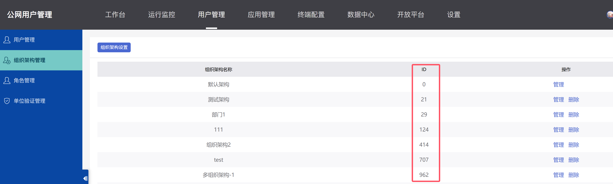

上级部门：非必填，不填写时默认创建1级部门；只允许部门字段进行赋值；

部门名称：必填，本次要注册的部门名称。 注意：同级名称已存在时，接口返回注册成功，实际是返回的已存在的部门以及部门ID

返回字段：创建部门动作支持返回微服务的部门ID，执行成功与否，返回信息3个字段；当执行失败（创建部门失败）时，不返回微服务的部门ID。 建议通过查询+更新节点，将创建部门动作返回的微服务部门ID，更新回到触发表中，方便后续根据部门ID作为入参进行更新部门其他操作。

注意事项：

架构ID查询路径：微服务-用户管理-组织架构管理页上，组织架构名称右侧的ID

上级部门：只能选择1-4级部门，不填时默认为1级部门

部门名称：输入的部门名称若已存在，不会重复创建部门，会返回已存在的部门ID

返回字段包含：微服务的部门ID、执行结果、返回信息

##### 2、更新部门名称

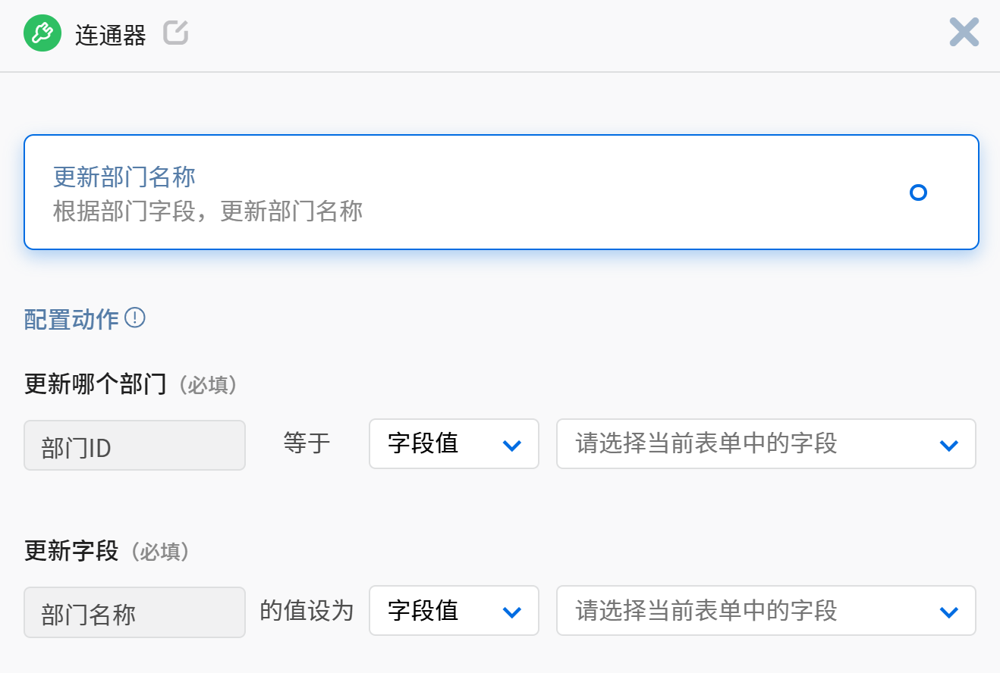

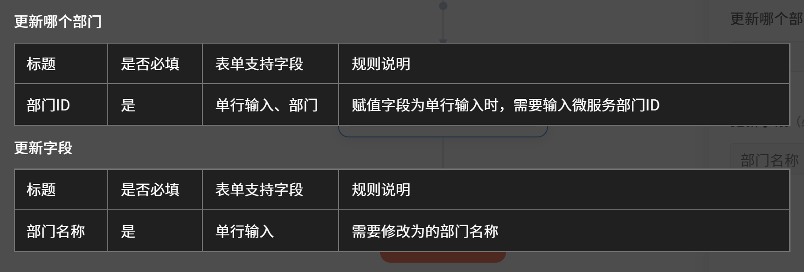

部门ID：支持由部门字段或者单行输入赋值，由单行输入赋值时需要输入微服务组织架构的部门ID。 部门名称：本次需要修改的部门名称；若输入的名称在同一架构下的同一上级部门下已存在，将无法更新部门名称成功。 返回字段：更新部门名称动作支持返回执行成功与否，返回信息2个字段。

注意 1.不允许将部门名称改为空值。 2.用部门字段给部门ID赋值，且部门字段输入多个值时，只取第一个值。 3.用部门字段给部门ID赋值，且部门是停用状态，无法成功修改部门名称。 4.计划修改名称的部门已删除，将无法成功更新部门名称。

##### 3、更新部门主管

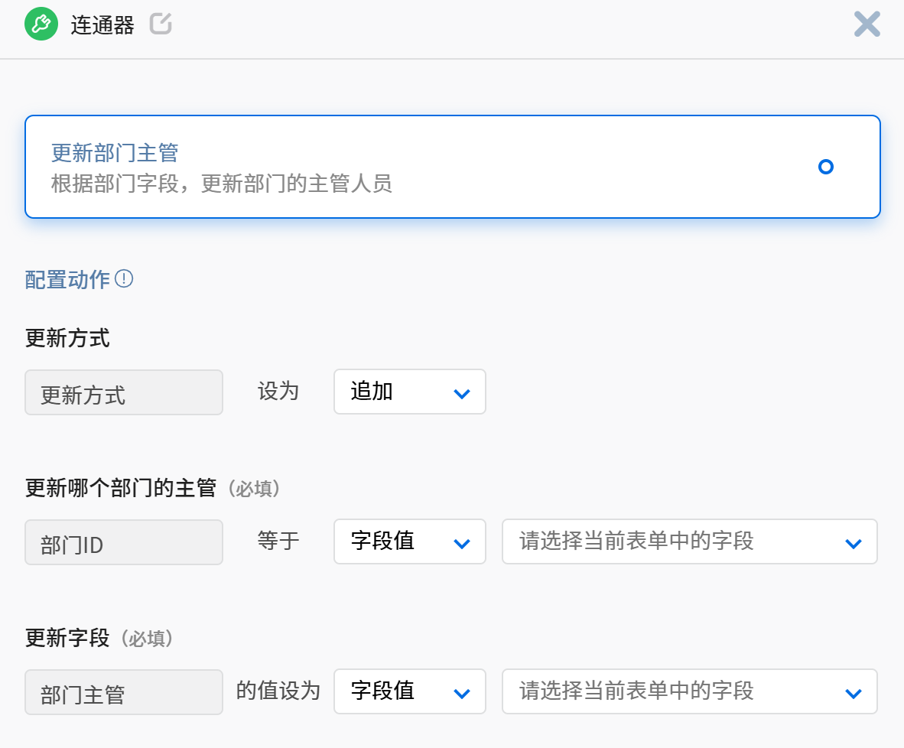

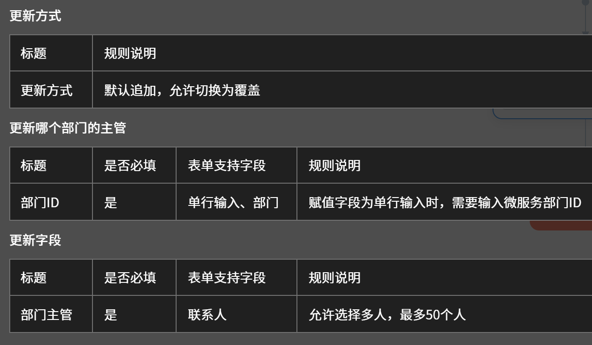

更新方式：默认为追加，支持覆盖。 部门ID：支持由部门字段或者单行输入赋值，由单行输入赋值时需要输入微服务组织架构的部门ID。 部门主管：给部门ID对应的部门设置的主管，允许选择多人，最多不超过50人。 返回字段：更新部门主管动作支持返回执行成功与否，返回信息2个字段。 注意 1.不允许将部门主管清空。 2.用部门字段给部门ID赋值，且部门是停用状态，无法成功更新部门主管。 3.计划更新主管的部门已删除时，将无法成功更新部门名称。

##### 4、更新部门状态

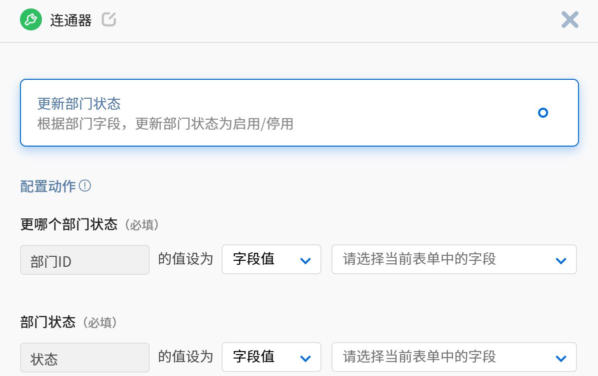

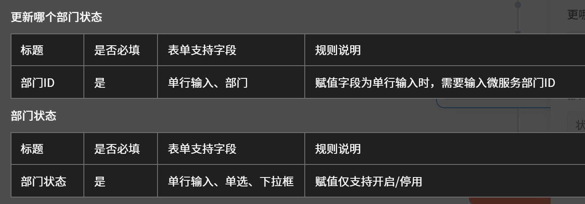

部门ID：支持由部门字段或者单行输入赋值，由单行输入赋值时需要输入微服务组织架构的部门ID。 状态：仅支持赋值为开启或停用。 返回字段：更新部门状态动作支持返回执行成功与否，返回信息2个字段。

注意： 1.父级停用，子级不能单独启用。 2.停用父级，子级会隐藏但不停用；重新开启父级时，子级可以重新显示 3.停用子级，再停用父级；开启父级时，子级会一起开启。 4.用部门字段给部门ID赋值，且部门是停用状态，不能启用部门。 5.部门已删除时，不支持再更新部门状态。

🧭 文档更新日期：2025年6月6日

#### 5.4、自定义连通器

通过连通器管理平台创建好的连通器，支持在业务流程中使用。

根据接口文档，在连通器管理后台创建好自定义连通器。

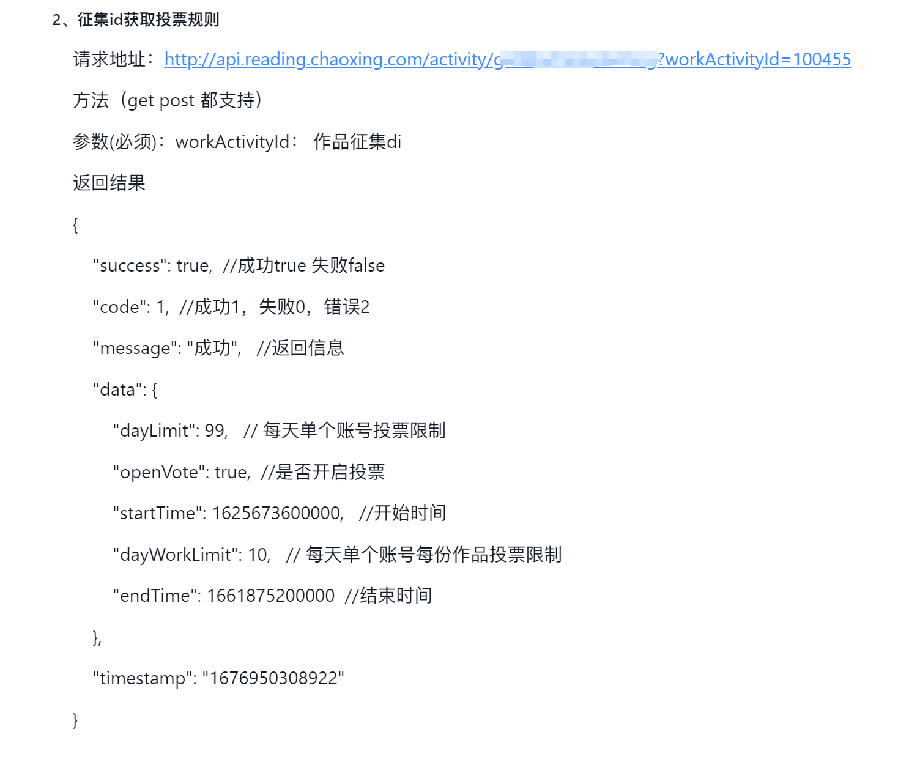

当在连通器管理平台列表页和业务流程配置-连通器节点-自定义连通器都可以看到创建好的连通器。

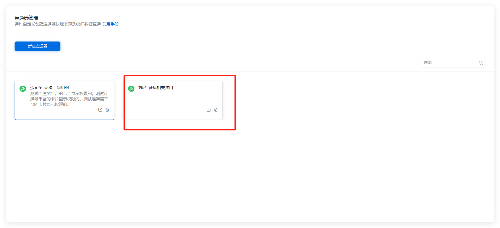

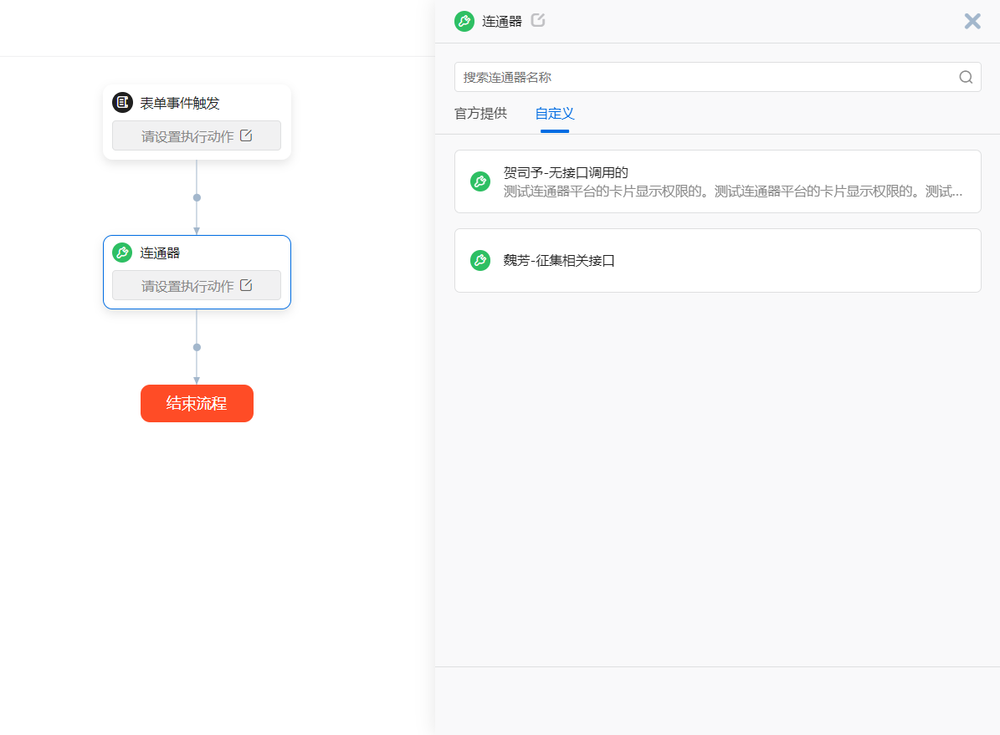

此时就可以使用自定义连通器了。

基于该接口的作用是，通过入参作品征集ID，查询该征集活动是否有开启投票，以及投票的具体规则说明。下面配置一个使用自定义连通器的流程： 当表单有数据提交时，调用自定义连通器，并查询刚提交的数据后，将连通器执行的结果更新到触发表中。 

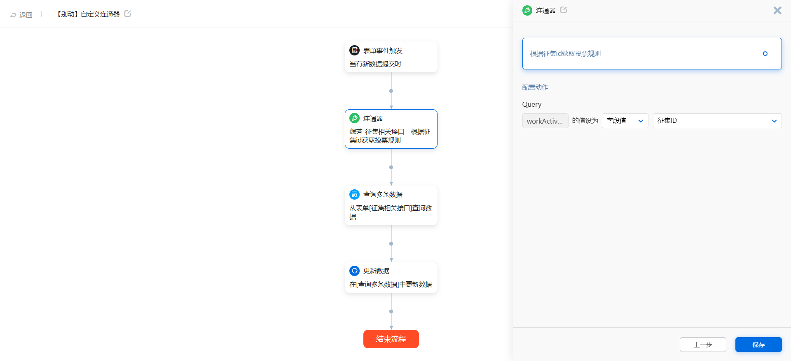

效果演示视频如下，点击链接查看视频 https://pan-yz.cldisk.com/external/m/file/1033455996342886400

🧭 文档更新日期：2024年8月21日

### 6、六、常见问题

#### 6.1、常见问题

[TOC]

###### 问题1：运行日志显示注册用户（/更新用户信息/角色/部门等动作）连通器节点执行成功，但微服务用户管理未注册（/更新用户信息/角色/部门）成功。

原因：官方连通器节点执行成功与否只判断接口是否调通，不判断接口业务（注册用户）执行结果。即业务流成功调用了注册用户的接口，但是用户提交的数据不满足注册用户的数据要求，比如姓名字段为空值时将注册失败。 解决办法：建议所有使用了官方连通器的节点，都在后续流程中将连通器的执行结果更新回到触发数据中，方便统一查看执行结果、执行失败的原因、以及批量操作重新触发。

###### 问题2：官方连通器执行失败的原因以及解决方案

执行动作：新增用户

返回信息：姓名不一致 原因：手机号在这之前已经在passport注册过账号了，且当时注册的姓名和本次注册的姓名不一致。 解决方案：修改本次注册数据提交的姓名与之前注册的姓名一致后重新触发流程。

返回信息：用户不存在 原因：检查下节点是否配置了角色字段，接口调用高峰时期，会有非常小的概率遇到注册用户成功后再按uid追加角色时，查不到刚注册的uid，导致添加角色失败。 解决方案：此情况一般用户注册是成功的，只是追加角色是失败的。如果场景是大批量导入数据注册，建议将注册用户和追加角色分2个流程支持。第1个流程只注册，第2个流程的触发事件为字段修改时触发，修改字段选择第1个流程执行成功后返回的字段，比如联系人字段，且不为空一定表示注册成功了。

返回信息：密码不能为空/密码长度必须为8-16位/密码至少包含数字、字母、特殊字符中任意两种. 原因：仅学工号注册时，需要校验密码必填，密码需要满足的规则：长度为8-16位，至少包含数字、字母、特殊字符任意两种。 解决方案：按密码规则要求调整密码后重新触发流程。

执行动作：更新用户基本信息

返回信息：userinfo未在修改范围内 原因：用户姓名、手机号、学工号，都与库里存在的信息一致 解决方案：此情况一般存在于调用更新用户基本信息的流程触发事件设置不严谨，比如设置了有字段被修改-任意字段时触发。这样设置可能会导致其他动作执行完成回填执行结果信息就触发了该流程。 ——修改流程触发事件和条件，确保仅业务需要的场景才执行该流程。

###### 问题3：在一个流程中，注册用户节点后加了发通知节点，通知对象选择的是表内联系人字段（更新节点将连通器注册后返回的联系人字段），用户注册成功了，但没有收到通知，是什么原因？

原因：当前表字段用来赋值时是指数据触发流程时的初始状态，即当提交/修改数据时，此时用户还没有注册，所以联系人字段也是空值，用空值的联系人字段设置通知对象，所以收不到通知。 

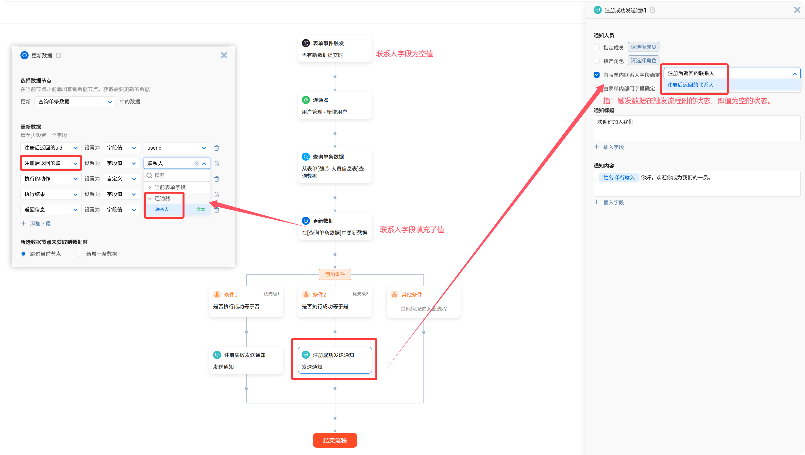

解决方案：另外创建一个流程，当触发表有字段被修改-联系人，且联系人不为空时触发发送通知给刚注册的人员。

###### 问题4：新增/更新数据时，目标表字段在表单中设置了默认值（数据联动/常用公式/公式编辑），如何配置业务流来触发默认值？

解决方案：默认值的触发逻辑时，参与默认值计算的条件字段被业务流新增/更新，则默认值字段也会一起更新。

举例：表单有字段学生姓名，身份证号（根据学生姓名数据联动），出生年月日（常用公式-根据身份证号提取），年龄（常用公式-根据身份证号提取），2年后的年龄（公式编辑=年龄+2） 在新增/更新节点，只需要配置学生姓名这个条件字段即可，其他字段都会因为条件字段有变化而触发更新。

注意：子表单整体默认值的触发，仅新增数据节点支持（含更新节点-找不到数据时，新增一条数据）。 

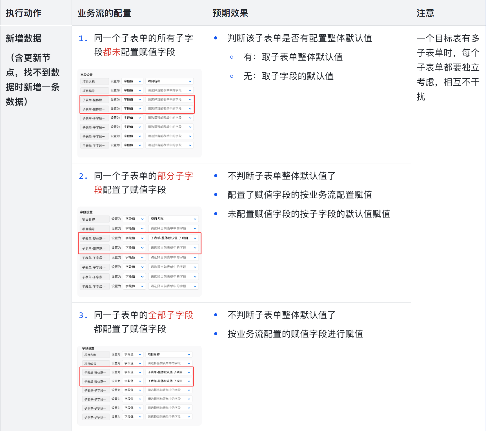

###### 问题5：数据已满足触发事件和触发条件，但是业务流程没有触发

原因：内部触发器与业务流之间，不支持相互触发； 解决方案：已使用内部触发器的，就继续使用内部触发器；需要用到连续触发的，要换业务流的就需要全部流程都换为业务流。不能内部触发器+业务流混合使用。

举例：通过内部触发器+业务流引擎配置流程：内部触发器：a表新增数据时，新增b表数据；业务流：b表新增数据时，新增c表数据

当用户在a表提交1条数据后，c表没有新增数据，且业务流没有运行日志，说明业务流程未触发。

###### 问题6：业务流触发与被触发的规则

业务流能触发的 

能触发业务流的 通过表单/审批的前台填写页/后台数据管理页/接口/业务流增删改动作节点对数据进行增删改操作都可以触发业务流。 有几点除外：

内部触发器的执行动作，不支持触发业务流。

右侧操作按钮触发修改-（新增数据、更新数据、删除数据）均不支持触发业务流。

审批恢复已删除数据

🧭 文档更新日期：2025年12月25日
