# 数据工厂使用说明

低代码开发平台—-数据工厂培训

什么是数据工厂？为什么会有数据工厂？

就是对数据进行加工处理的工具

通过表单构建的业务系统，完成了数据的收集、管理、权限的分配等一系列过程后，如何处理、利用、分析这些数据，得到符合客户个性化需求的结果。

目前有八个数据节点，横向连接、追加合并、数据筛选、分组汇总、字段设置、字段排序、去重、行转列

应用场景：考试试卷分数处理，教研积分处理、排版课表、评价统计

数据工厂

开通数据工厂：

http://16q.cn/JoyAWm

填写审批表就可以开通

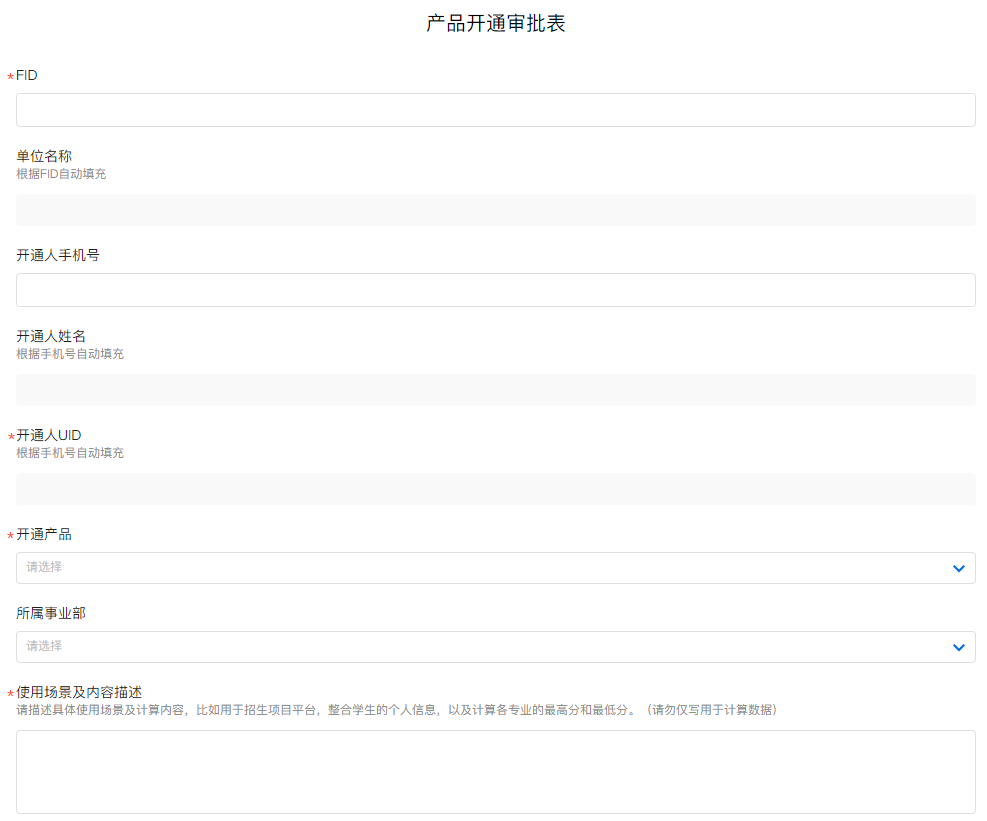

使用入口

数据工厂入口需要进入表单应用后台界面>>数据工厂

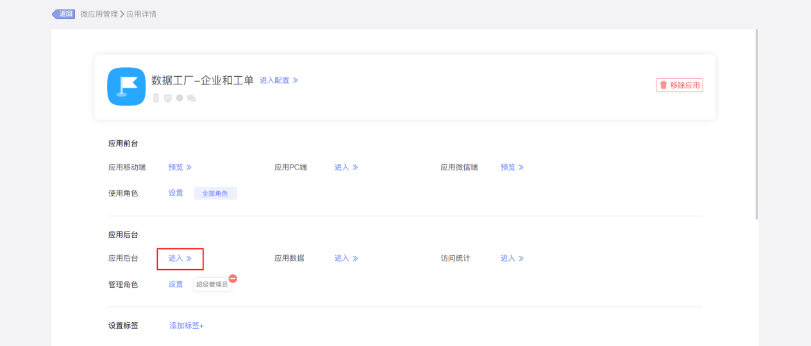

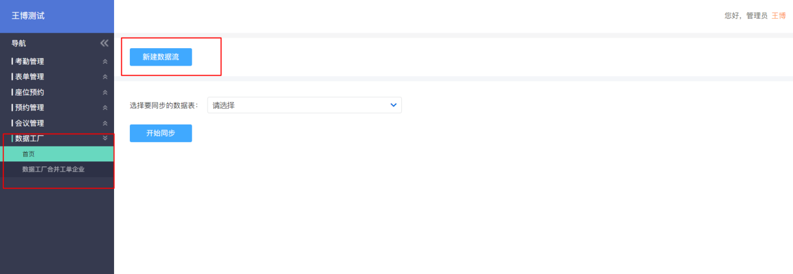

数据分析流程

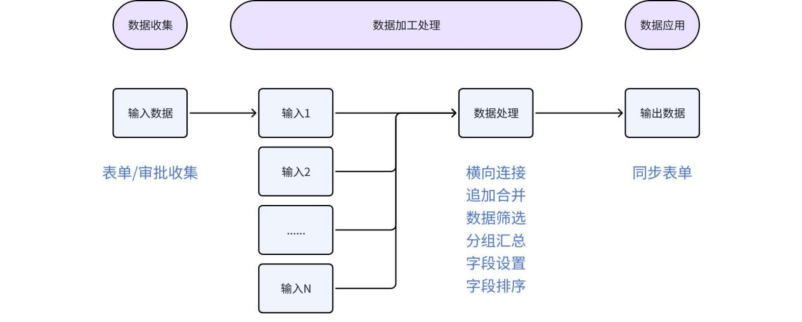

输入数据

输入数据是由数据工厂先进行同步数据表，即可在输入节点中选择同步到的表单或审批作为数据源。

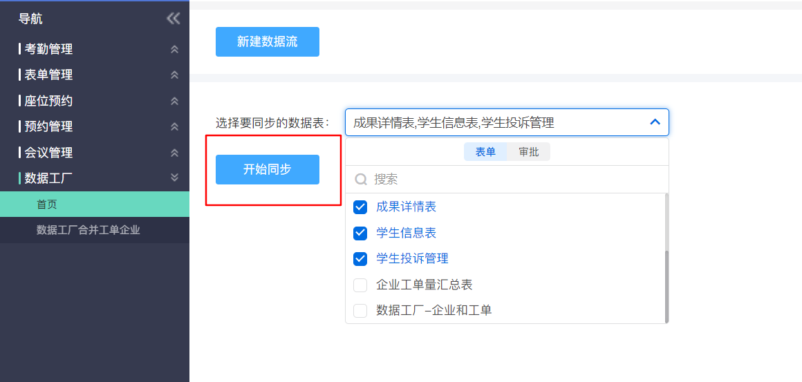

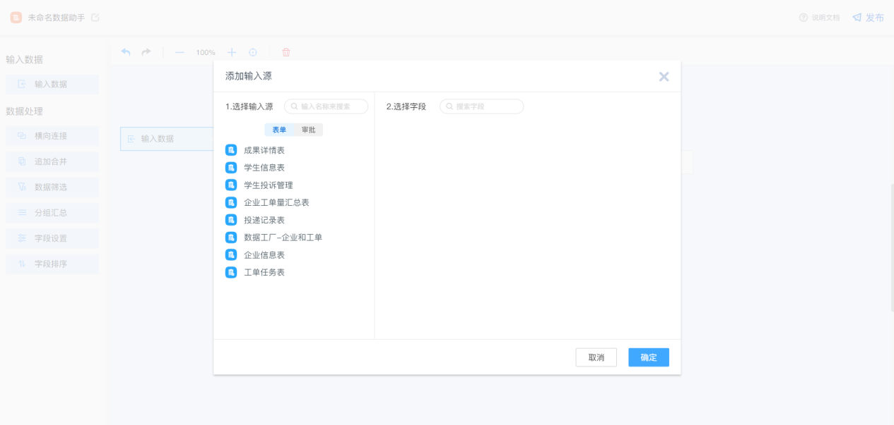

数据流

应用后台界面>>数据工厂下，每一条均代表一个数据流。如下图所示：

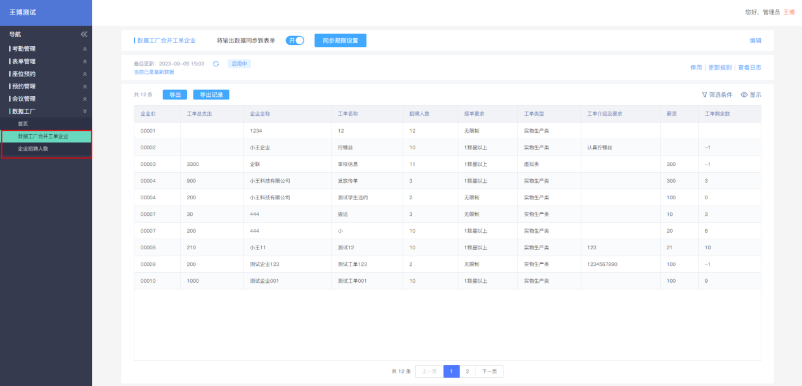

点击编辑按钮，可以对数据流进行调整或者重新设计：

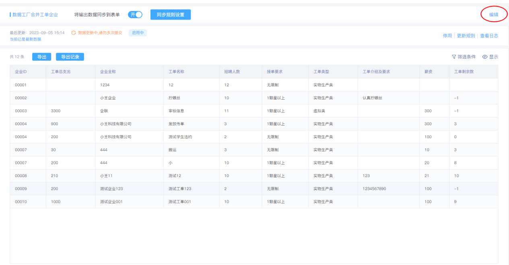

点击后进入数据流设计界面：

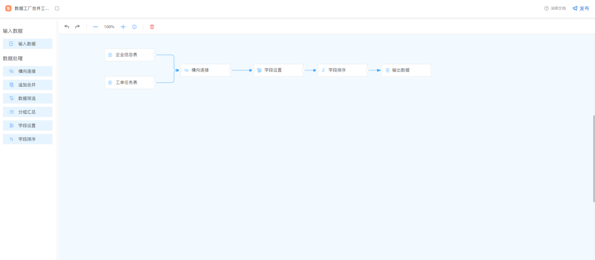

输出数据

输出数据是经过数据流计算得出的结果表。

可以设置同步到表单，也可以预览输出表数据：

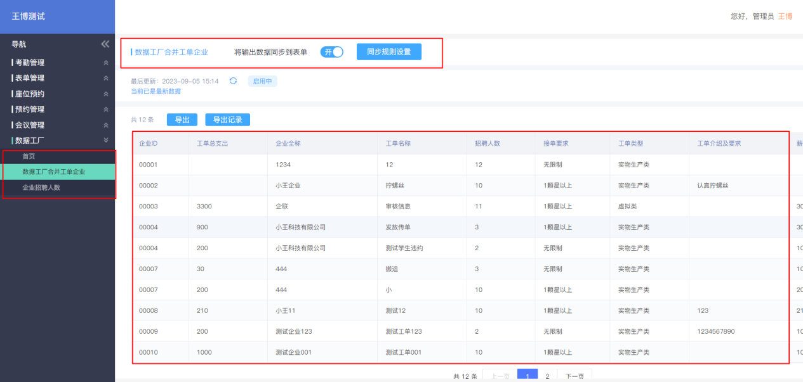

数据流

简介

功能简介

在数据工厂里，您也可以创建多个数据流，实现不同的数据加工和处理流程。

数据工厂是可以加工处理数据的场所，而其中的数据流则承担着具体的数据加工和处理工作。

应用场景

数据流可以选择多个表单作为数据源，然后自由组合数据处理节点，实现复杂的多表数据的处理，得到输出表。目前有 8大数据处理节点：

横向连接：将两张表左右相连，连接为一张新增了多列数据的新表。

例如：第一张表是学生数学成绩，第二张表是语文成绩，需要将学生所有成绩统计到一张表，用横向链接

追加合并：将多张表上下相连，连接为一张新增了多行数据的新表。

例如：第一张表1班学生成绩，第二张表2班学生成绩，行字段不一致，列一致，可以追加合并连接到一张表单中

数据筛选：添加筛选条件，过滤掉无用数据，只保留需要处理的数据进行加工计算。

分组汇总：分组汇总是指对原始数据根据条件，将相同的数据先合并到一组，然后按照分组后的数据进行汇总计算。

字段设置：字段设置可以设置表单字段显示/隐藏、排序（字段显示顺序）、重命名，也可以添加新的计算字段、排名字段。

字段排序：字段排序按单张表中的指定字段进行排序操作（内容排序）。

去重：对重复数据保留最新一条

行转列：一维表转化为二维表

创建入口

打开表单或审批应用后台，点击[数据工厂--首页--创建数据流]即可创建。

![打开表单或审批应用后台，点击[数据工厂--首页--创建数据流]即可创建。](../assets/data_factory_guide/image11.png)

设计界面介绍

点击「新建数据流」后即进入数据流的设计界面。

数据流设计页面可以分为三部分：节点选择区、数据流设计区和节点设置区。

【节点选择区】：里面的节点可以拖拽添加到数据流设计区。

【数据流设计区】：选中一个节点，就会从页面底部弹出该节点的节点设置区。

【节点设置区】：对单个节点进行详细配置，使得数据流按照既定规则处理加工数据。

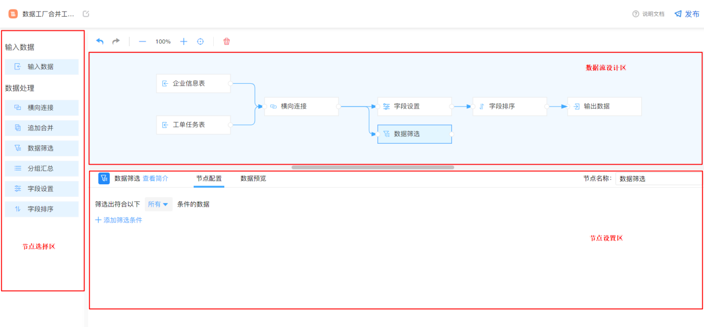

数据流设计步骤

数据流由「输入节点」、「数据处理节点」和「输出节点」构成，节点间用连接线相连。

设置输入节点

输入节点用来选择我们要处理的数据，拖拽到数据流设计区即可添加。

添加数据流后，会默认添加一个输出节点，拖拽左侧输入数据到数据流设计区，点击输入数据节点即可选择数据表单及表单字段。如下图所示：

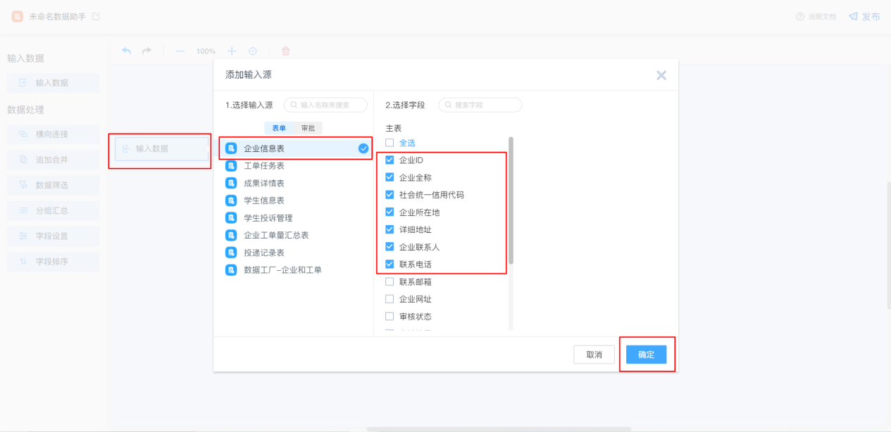

选择后点击节点可以预览数据源：

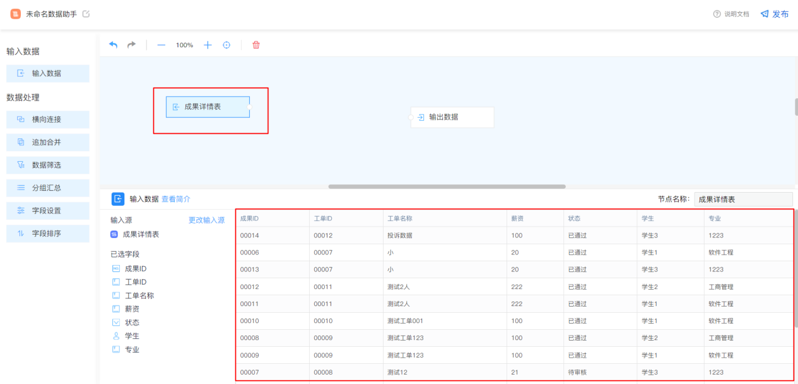

如果数据源选择有误需要更改，可以点击输入节点进行数据源更换。

[20230907_093703.mp4]

使用规则：

每个数据流中，支持添加多个输入节点。即可以对多个数据源表单进行处理和计算。

输入节点不能直接跟输出节点相连，中间需要插入至少 1 种数据处理节点。

如果表单中有多个子表单，只能选择 1 个子表单的数据进行输入。如果需要用到多个子表单的数据，可以添加多个输入节点。

添加并设置数据处理节点

数据工厂提供的 8种数据处理节点，是处理数据的核心工具。将节点拖拽到「数据流设计区」即可添加。

每种节点及作用如下：

节点名称

作用

横向连接

将两张表左右相连，连接为一张新增了多列数据的新表。

追加合并

将多张表上下相连，连接为一张新增了多行数据的新表。

数据筛选

添加筛选条件，过滤掉无用数据，只保留需要处理的数据进行加工计算。

分组汇总

分组汇总是指对原始数据根据条件，将相同的数据先合并到一组，然后按照分组后的数据进行汇总计算。

字段设置

字段设置可以设置表单字段显示/隐藏、排序（字段显示顺序）、重命名，也可以添加新的计算字段。

字段排序

字段排序按单张表中的指定字段进行排序操作（内容排序）。

去重

去重按照字段值进行保留最新一条数据

行转列

行转列可将一维表转成二维表

横向连接

横向连接主要是将2张数据表根据连接字段左右相连接，根据连接的方式不同又分为：内连接、左连接以及右连接。

内连接：根据连接字段，返回左右两侧表单连接字段相等的数据，即返回左右两个表单的数据交集。

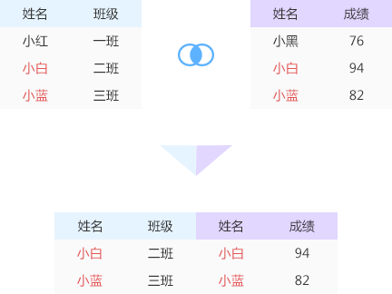

左连接：返回左侧表单的全部数据，根据连接字段，逐行匹配并连接右侧表单的数据，匹配不到则留空。

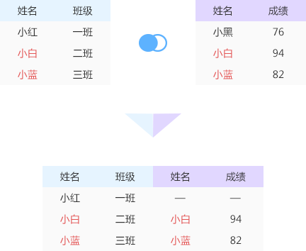

右连接：返回右侧表单的全部数据，根据连接字段，逐行匹配并连接左侧表单的数据，匹配不到则留空。

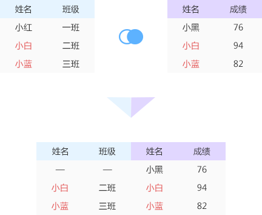

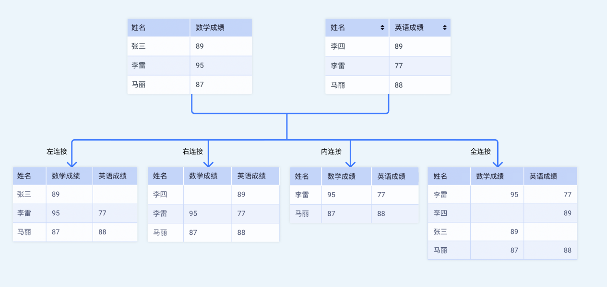

设置步骤：

选择数据源

对数据流重命名，并添加 2 个输入节点，分别选择数学成绩和英语成绩表作为输入源。如下图所示：

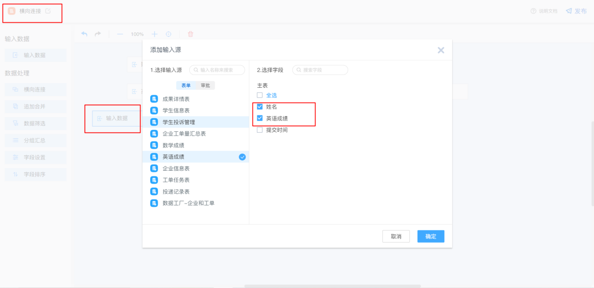

添加横向连接

在数据流设计画布中添加一个「横向连接」数据处理节点，然后将数学成绩和英语成绩 2 个输入节点依次连接至「横向连接」节点。如下图所示：

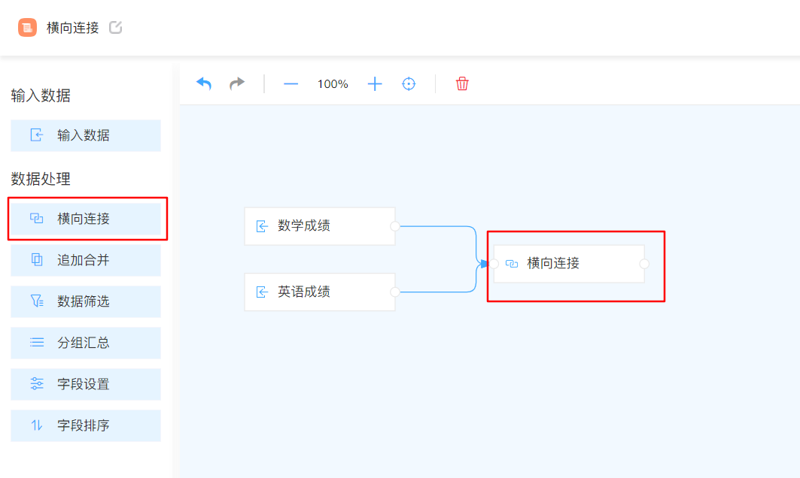

节点配置

横向连接需要配置连接方式及连接字段。如下图所示：

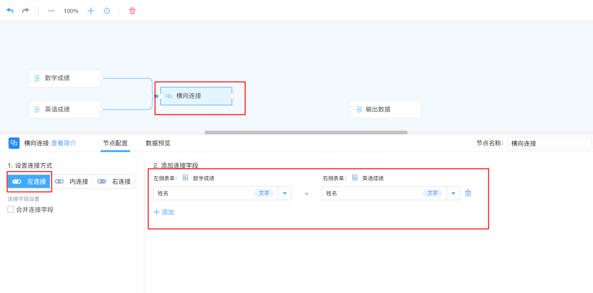

连接方式

连接方式目前支持内连接、左连接和右连接。横向连接时，是根据连接字段进行匹配的，连接字段相同的数据根据连接方式进行左右拼接。比如，内连接，取两张表的数据交集，连接字段只有在左右两张表都包含才会进行匹配，否则舍弃。

1）左右表单如何区分

方法一：先连向「横向连接」节点的表单为左侧表单，后连向「横向连接」节点的表单为右侧表单。

方法二：连接以后，在节点配置处也可以看到左右两侧的表单分别是哪一张：

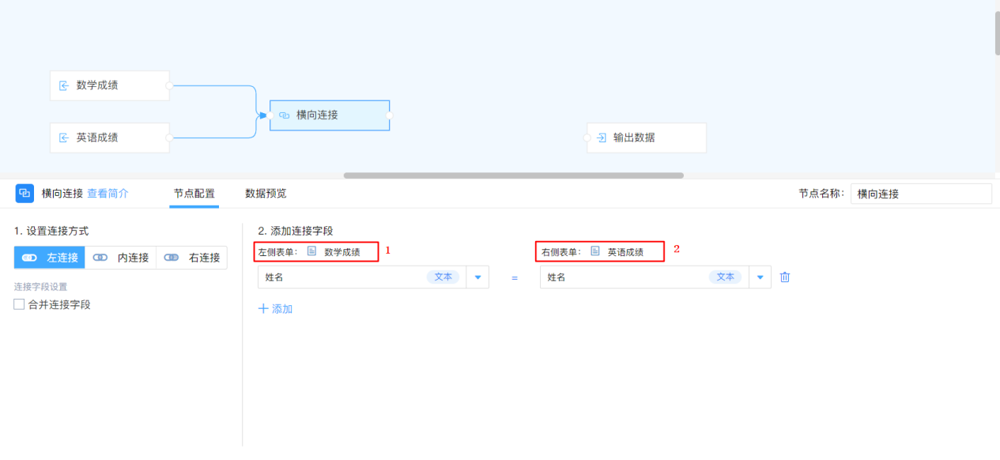

2）合并连接字段

横向连接时，若选择「合并连接字段」，合并后，连接字段将合并为一个字段。

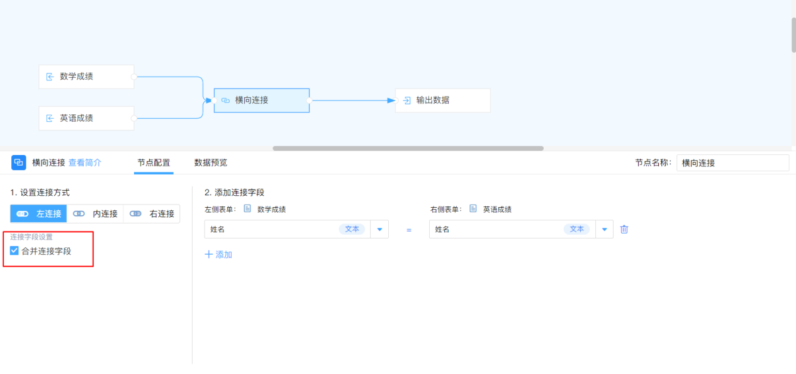

合并与否的效果如下图所示：

合并连接字段

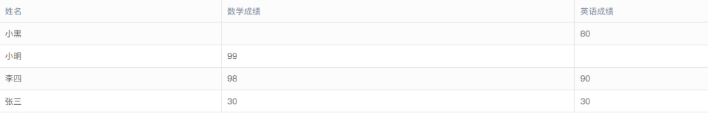

不合并连接字段

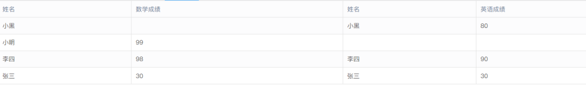

注：上图中的姓名代表的是连接字段。

连接字段

连接字段就是两张表单合并为一个表单的条件，如果有多个连接条件，那么可以添加多个连接字段。连接时，只有连接字段全部匹配的数据才会进行连接。如下图，点击「数据预览」可以预览连接后的效果：

[20230907_101608.mp4]

节点重命名

为了更好地标记数据流中每一个数据处理步骤的计算规则，可以对数据流节点进行重命名。如下图所示：

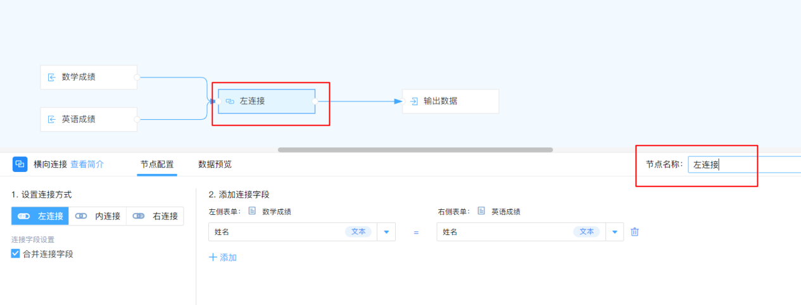

保存并输出

追加合并结束后，如果需要进一步计算，可以添加其他数据处理节点进行处理。如果处理完成，需要连输出节点将数据输出并保存处理结果。

追加合并

追加合并支持将2张以上数据表，按照字段对应关系纵向连接，合并为1张数据表，可用于整合分散的同类数据。

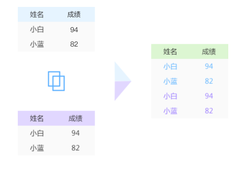

设置追加合并

添加一个「追加合并」数据处理节点，将 2 张数据源表单分别连向追加合并节点。如下图所示：

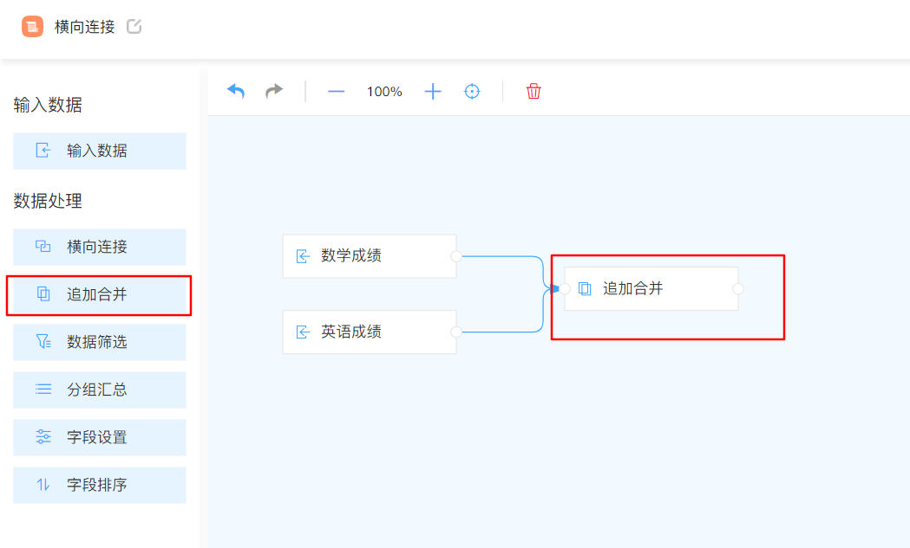

连接后，系统会将字段名相同且字段类型相同的数据自动合并为一列，名称不同的字段需手动完成合并。如下图所示：

[手动追加合并.mp4]

字段字节重命名

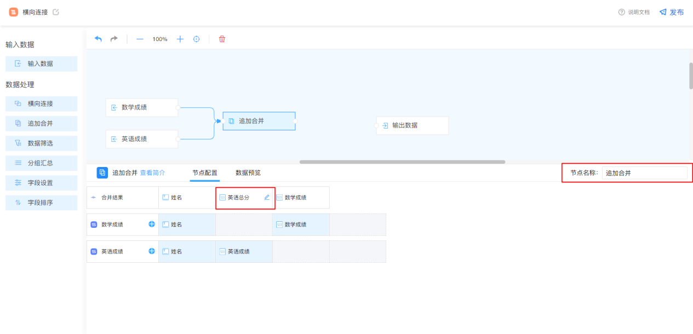

数据筛选

数据筛选支持给单张数据表添加筛选条件，可用于过滤掉无用的数据，只保留需要的数据。

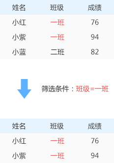

添加筛选条件

筛选条件与输出数据筛选相同。

添加筛选条件对字段可以勾选大于、大于等于、小于、小于等于、等于、不等于、等于任意一个、不等于任意一个、选择范围、为空、不为空。

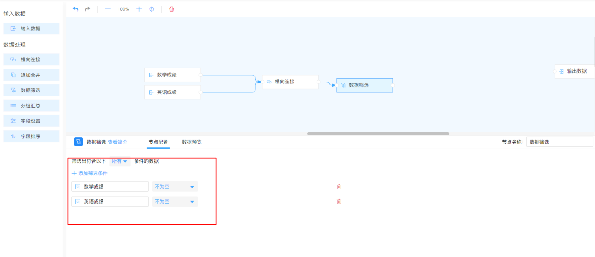

注意事项

- 1.一个数据筛选节点支持添加多个筛选条件，支持设置筛选条件之间的关系（并集或交集）。

- 2.数据筛选节点最少添加一条筛选条件，否则不能输出。

分组汇总

分组汇总其实就是先分组再汇总。

分组就是把分组字段值相同的数据分为一组，而汇总则是将分好组的数据各自按照指定的汇总方式计算汇总字段的值。

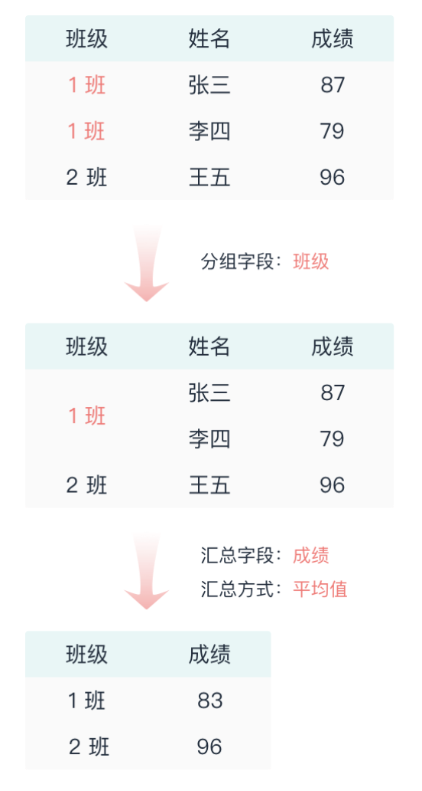

节点配置

分组汇总的节点配置包括分组字段设置和汇总字段设置。

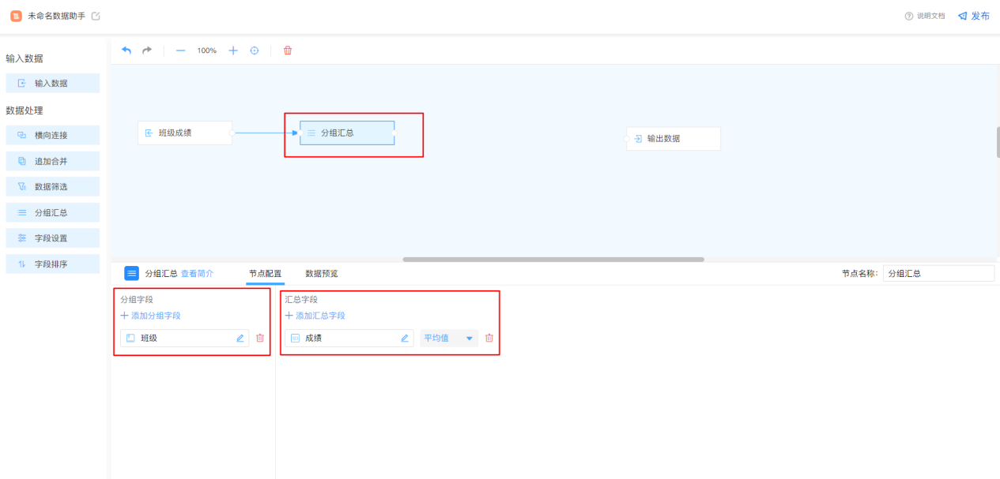

汇总字段支持汇总方式：

字段类型

汇总方式

文本类、日期时间类、地址、成员

计数、去重计数、多行合并、拼接

数字字段

求和、最大值、最小值、平均值、计数、去重计数、拼接、多行合并

多行合并：

根据分组，可以仅合并不计算，产生子表单，但必须为最后一个节点

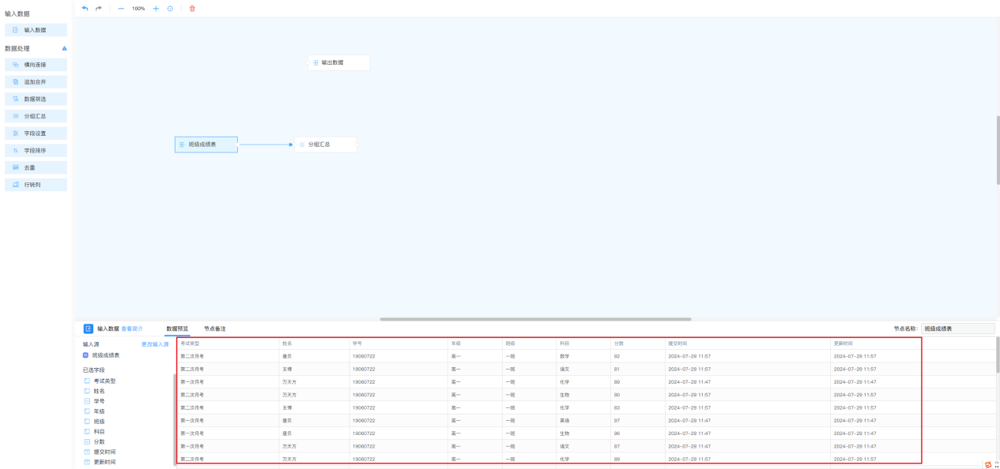

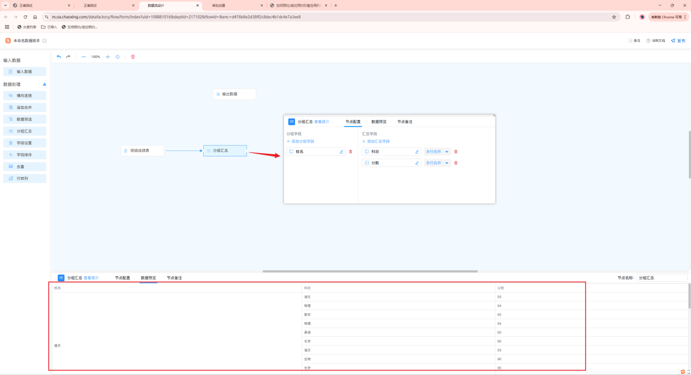

效果演示

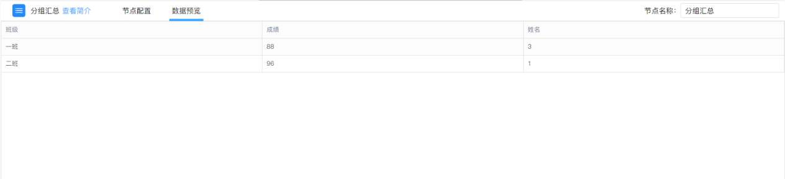

字段设置

字段设置可以对数据表中的字段进行排序、隐藏；也可以增加计算字段，对当前表单数据进行简单计算。

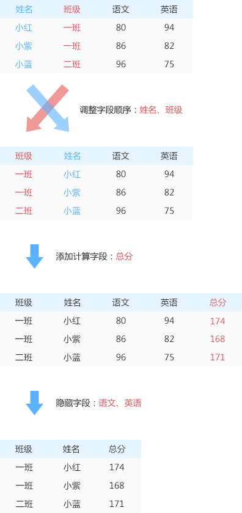

显示和隐藏

字段设置中，默认显示所有从上一节点输入进来的字段。

1）直接点击字段上方的眼睛图标可以隐藏该字段。

示例：隐藏不需要的系统字段。

[20230907_110710.mp4]

2）点击「显示原始字段」，可以通过勾选添加未显示字段。

示例：显示刚刚隐藏的字段。

[20230907_110754.mp4]

字段排序

通过拖拽字段可以给字段进行排序。

[20230907_110843.mp4]

字段重命名

在字段处，点击字段的「重命名」图标，即可修改字段名称。

[20230907_110940.mp4]

添加计算段

字段设置节点支持添加计算字段，

计算字段的公式目前支持加减乘除运算、数学函数、逻辑函数、文本函数、日期函数。

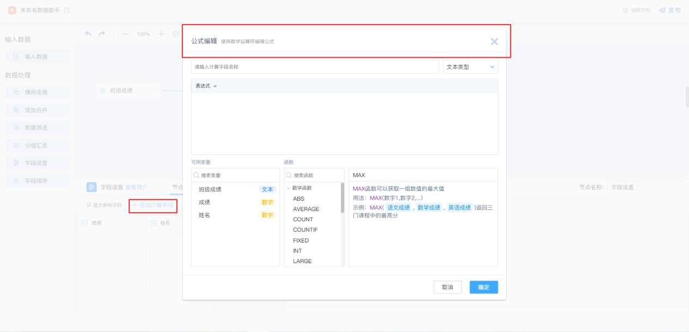

公式计算的数据输出类型需要手动选择，默认文本类型：

排名字段

可以添加字段显示目标字段的排名信息

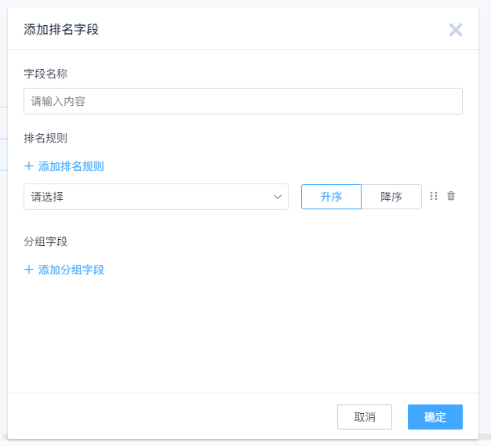

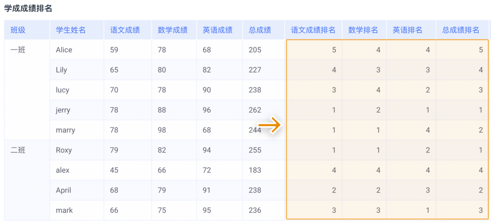

无分组

无分组的情况下，全量数据从 1 开始排名。比如，年级里的所有学生成绩通过一张表展示成绩，所有班级的学生按照成绩高低排名。排名效果如下图所示：

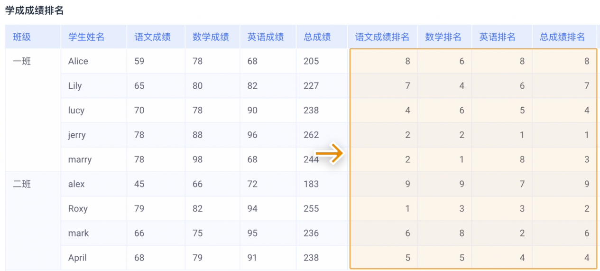

有分组

有分组的情况下，会在各自的分组内从 1 开始排名。比如，年级里的所有学生成绩通过一张表展示成绩，同一个班级的学生按照成绩高低排名，班级即为分组字段。排名效果如下图所示：

字段排序

字段排序按单张表中的指定字段进行排序操作。

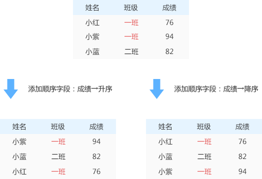

字段排序添加字段，只能设置正序和倒序。

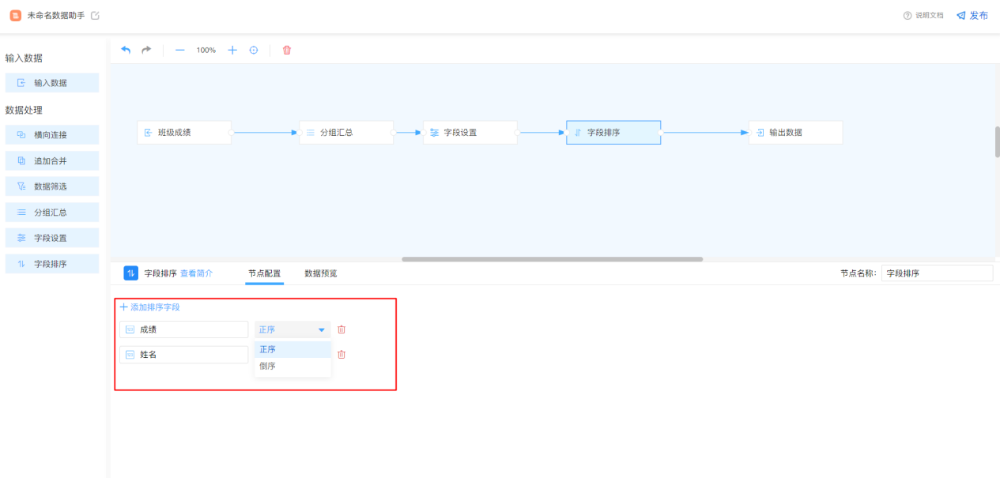

行转列

使用场景：教务统计表单只有科目字段，需要展示学生所有的科目成绩及总分

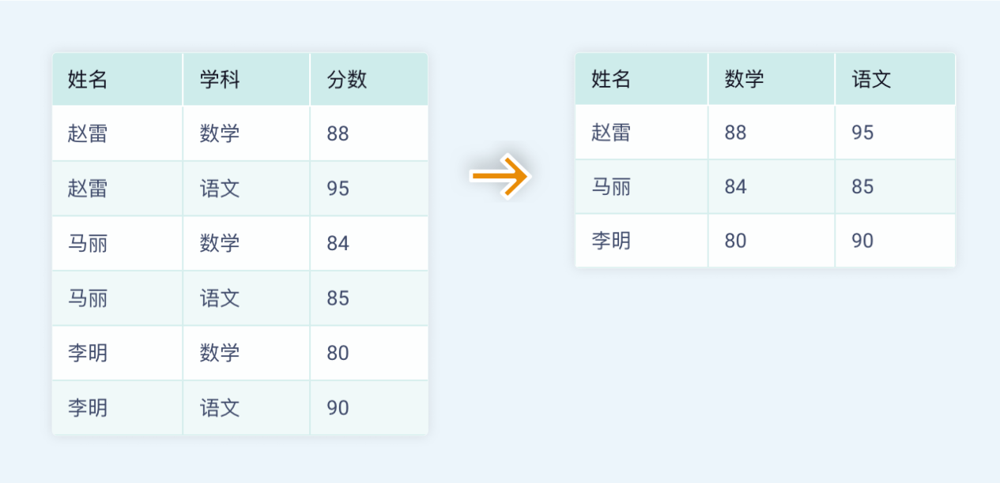

行转列可将一维表格转成二维表格

一维表格常称为流水线表格，一般有固定的列名，平常输入数据只需要一行一行的添加即可

二维表格是一种关系型表格，通常数据区域的值需要通过行列同时确定。更符合我们日常的阅读习惯，信息更浓缩，适合展示分析结果

使用步骤：

参考图中的配置步骤，添加行转列节点 ——> 连接数据源节点 ——> 依次选择分组字段、列字段、值字段

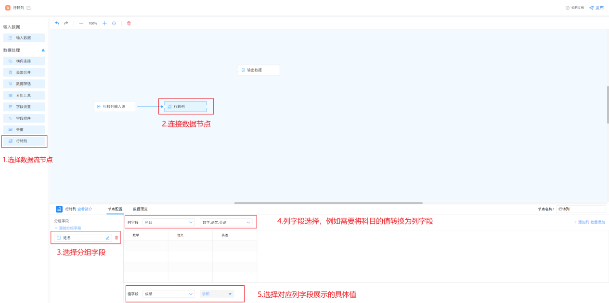

设置输出节点

输出节点用来存放处理完成的数据。可以设置输出节点名称来确定输出表内容。

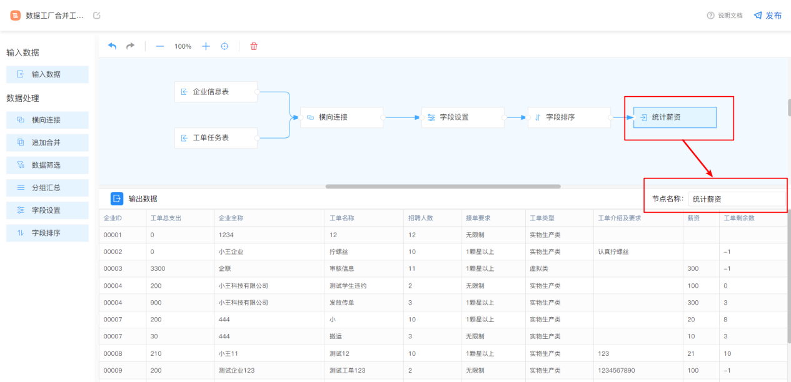

发布数据流

通过上述步骤，我们基本完成了数据流设计。千万不要忘记发布，另外也请记得给数据流设置名称。

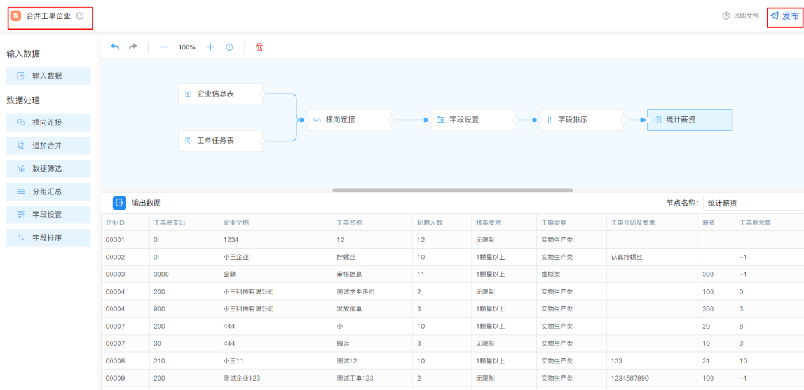

输出数据

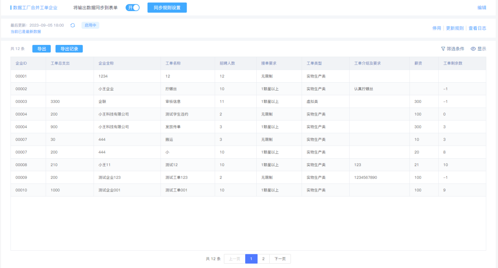

同步规则设置

将数据流输出数据同步到表单当中，如图所示：

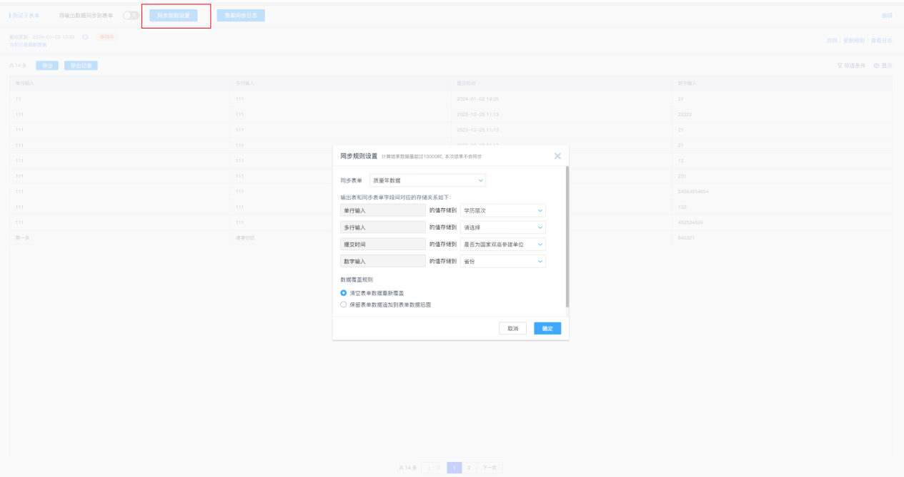

可以选择清空表单数据重新覆盖或者保留表单数据追加到表单数据后面

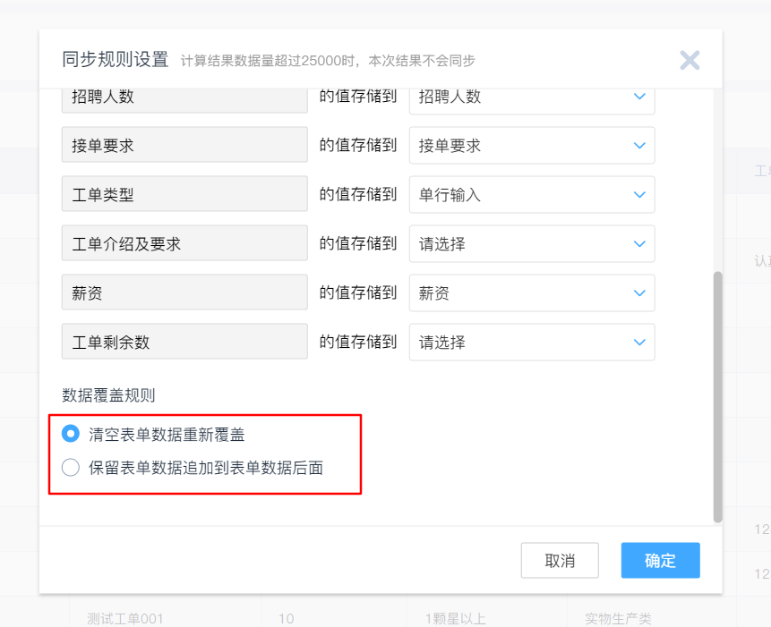

查看同步日志

可以查看数据工厂同步表单的进度、成功以及失败原因

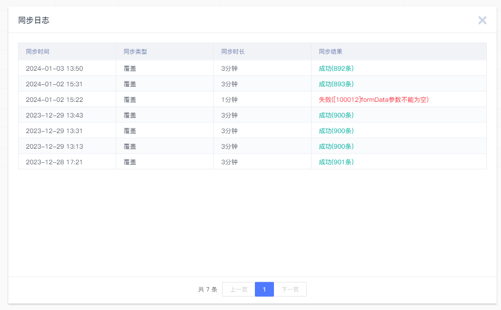

更新规则设置

支持以下三种同步方式设置：

更新规则

说明

自动更新

自动更新会在输入源数据发生变动后自动更新，更新间隔为设置的间隔小时数（最短设置为1小时）。

周期更新

在固定时间将输出表数据同步到表单，需要设置固定时间及同步周期。

手动更新

找到需要同步的输出表，点击刷新图标完成数据同步

自动更新

需要在数据流的更新规则中设置过自动更新，设置好以后，只有数据流自动更新成功，才会将输出表的数据立即同步到表单中。


周期更新

若选择周期更新，则需要设置同步的时间以及同步周期。同步周期支持：

每天同步一次

每周同步一次

每月同步一次

每年同步一次


手动更新

除了「自动更新」和「周期更新」，还可以通过点击刷新图标手动进行同步，用于数据同步。


查看日志

即可查看数据工厂更新日志


停用按钮

控制更新规则的开关


导出和导出记录

点击导出会将表单数据导出Excel格式在导出记录中提供下载


筛选条件

筛选条件可以对输出数据进行筛选，添加条件可以进行与或操作

添加筛选条件对字段可以勾选大于、大于等于、小于、小于等于、等于、不等于、等于任意一个、不等于任意一个、选择范围、为空、不为空。


显示

可以对字段进行隐藏或显示操作，并且可以选择冻结前几列操作。


案例

搭建案例（简单+中级）

案例一：评分统计（简单）

表单（一张）：用户评分表字段：被评分人、分数、提交人

思考？：这个表单数据可以怎样统计


例如：

统计被评分人的分数总数、次数总数

统计评分人的评分次数

按照月份、年份统计前两个

按照被评分人表单展示，例如：

主字段：被评分人、月份、总分、平均分

子表单：评分人、评分


案例二：志愿录取（中级）

简单版本：

场景：

学生可以填报志愿，每个学生可以填写三个老师，分别为第一志愿，第二志愿，第三志愿

老师：每个老师可以录取5个学生，按照志愿优先级和排名进行录取（第一志愿录取结束开始录取第二志愿，依次类推）

表单

字段

学生志愿表

学生姓名、第一志愿、第二志愿、第三志愿、学生成绩

老师信息表

老师姓名

需要实现：老师录取名单

图中只有一二志愿的录取


解决方案（高级）

教师评价（上海晋元中学）：

根据学生考试成绩得到班级汇总、各科汇总、老师汇总等维度分值


https://www.yuque.com/wtfbj/tecacw/gfohb7z2gz30kl9b?singleDoc#

南京特殊教育师范学院

教研积分总和


上海市奉贤中学

需要将数据进行行转列转化（字段固定）再用图表展示


江西制造职业技术学院

需求：

https://sharewh2.xuexi365.com/share/B2DD87E1-145B-4E11-BBC2-CA90E7899C06?t=3

校级：按届数计算全校各年级的各值

院级：按届数、学院计算全校各年级各学院的各值

专业：按届数、学院、专业、学制计算全校各年级各学院各学制专业的各值

班级：按届数、学院、专业、学制、班级计算全校各年级各学院各学制专业各班级的各值

专业岗位统计：按届数、学院、专业、学制、工作职位类别计算全校各年级各学院各学制专业的工作职位类别的各值

按照五个维度汇总，学生就业去向人数及其占比

实现方式：

https://m.oa.chaoxing.com/datafactory/flow/form/edit?deptId=1355&uid=108881016&flowId=662880c7a7baf9431e244a87&enc=7bd5be6aa70ebf16ca87c02b1e9cad24


原始表：毕业去向，字段：毕业代码

不同毕业代码组合为不同的去向

通过行转列对不同代码对应人数字段展示

筛选地区、汇总全校人数、筛选雨露计划

最后根据不同维度汇总
