# 表单使用说明（图片版）

### 1、一、表单引擎简介

#### 1.1、表单引擎使用说明

本使用说明将从以下几个方面，对表单的使用场景、功能、操作、实现效果等做详细的介绍：

表单的功能与优势

表单的创建入口、表单的创建方式

表单设计简介

管理页设计简介

高级设置简介

发布表单填写页、发布数据管理页

[使用表单填写页](https://document.chaoxing.com/web/#/120/1900 )、使用数据管理页

提示：您可以通过左侧【目录】直接定位到想要查看的页面，还可以通过【搜索】进行精确查询

#### 1.2、表单的功能与优势

[TOC]

🧭 文档更新日期：2025年2月11日

### 📖 万能表单的功能

万能表单引擎是一种【表单类应用】的生成工具，同时兼具【收集数据、管理数据、输出数据】等功能

##### 1. 利用【表单创建页】设计表单的前后台

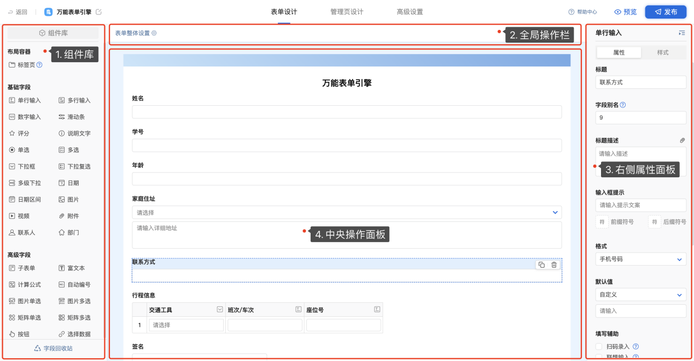

##### 2. 利用【表单前台填写页】收集数据

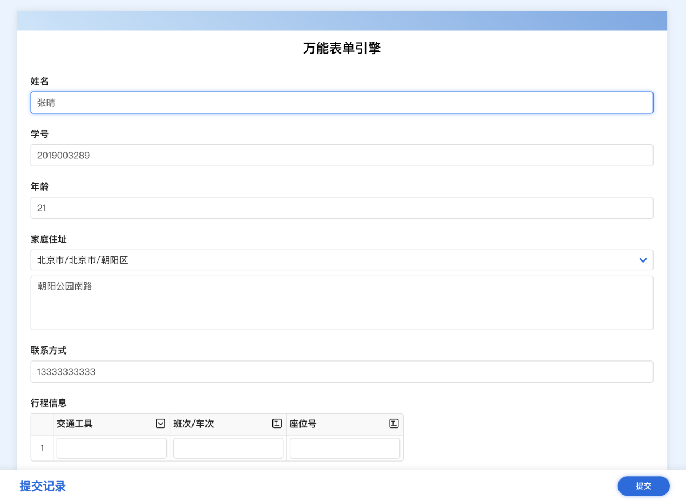

##### 3. 利用【后台数据管理页】管理数据

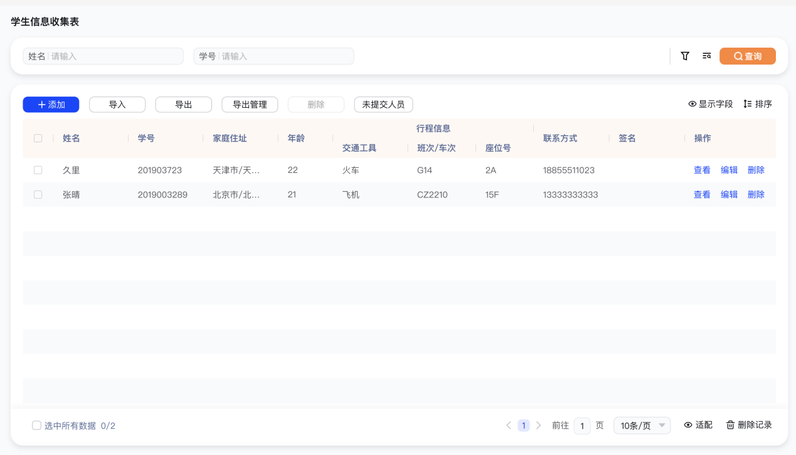

##### 4. 作为本单位其他应用的【数据源】输出数据

表单引擎可以作为【图表、信息查询、报表、报告、数据工厂、门户、大屏】等其他引擎的数据源

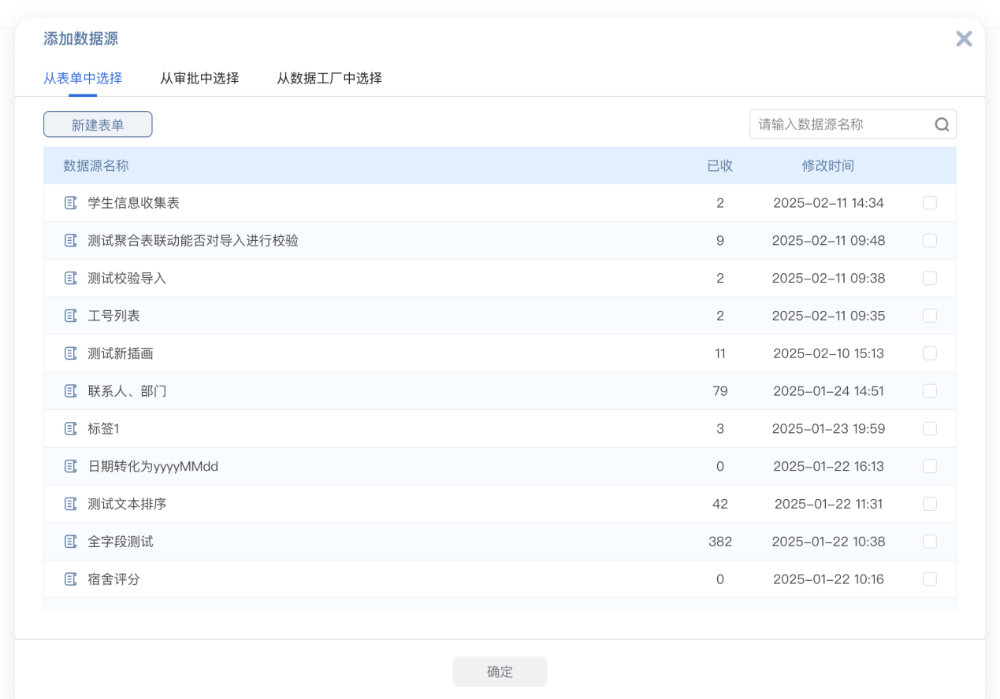

### 🔆 万能表单的优势

利用表单可以快速搭建出各类业务系统，有效缩减研发工作量、降低业务系统的创建门槛及维护成本，具体优势如下：

表单提供多种类型的【字段】，每种字段又提供丰富的【属性设置】，以满足各类信息的收集需求

填写端支持设置填写时段、收集数量限制、提交校验、数据查看权限等，支持自定义样式，并提供多套模板

数据管理页支持数据的筛选、查看、增删改、导入导出、打印等功能，此外还可添加特殊的功能按钮

### 2、二、创建表单

#### 2.1、两个创建入口

##### 2.1.1、在应用管理中创建

[TOC]

🧭 文档更新日期：2025年2月11日

##### 🪧 创建入口

微服务平台-应用管理

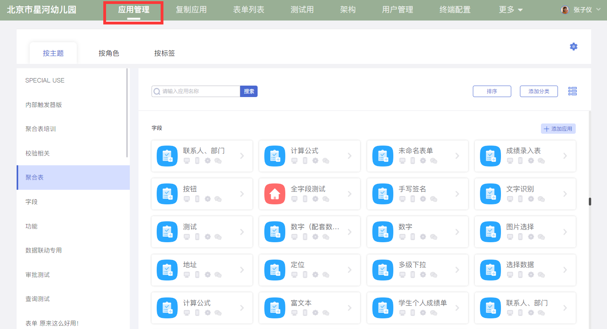

##### 🪧 创建步骤

登录微服务后台 —— 选择【应用管理】 —— 点击【添加应用】 —— 选择【应用引擎】-【表单】

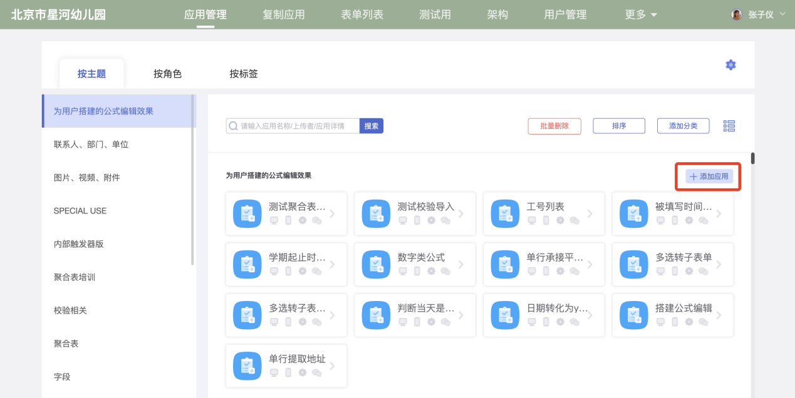

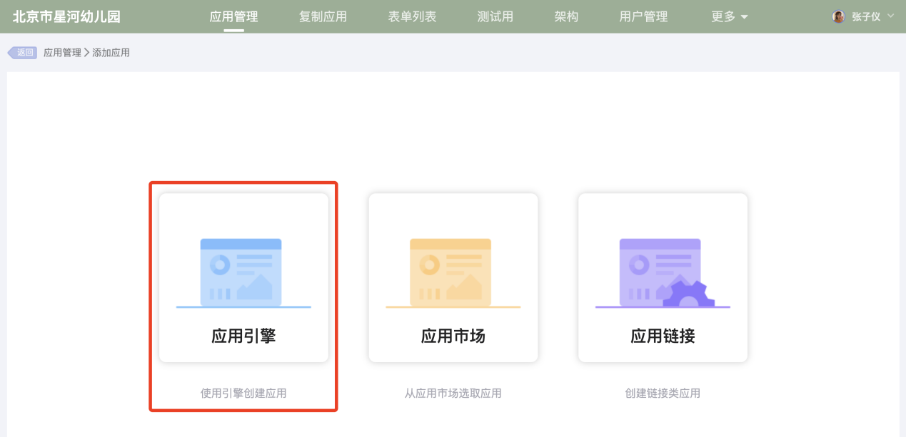

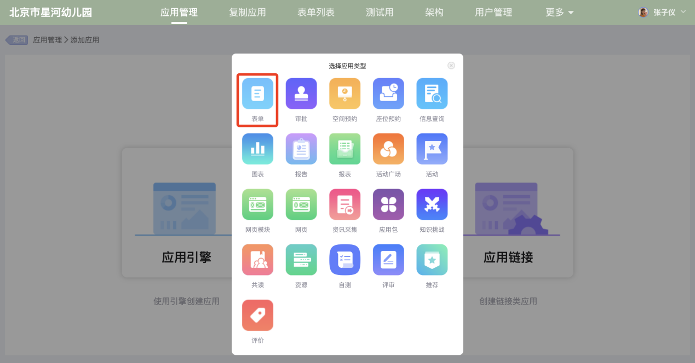

选择【新建表单】【从Excel创建表单】或【复制已存在表单】

##### 2.1.2、在业务系统中创建

[TOC]

🧭 文档更新日期：2025年2月11日

##### 🪧 创建入口

微服务平台-设置-业务系统界面管理-配置菜单

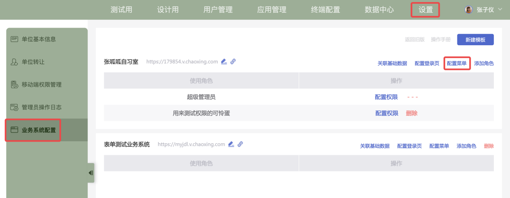

##### 🪧 创建步骤

打开配置菜单界面 —— 在左侧菜单中添加栏目，选中需要编辑的栏目 —— 在右侧页面中选择【新建应用】-【万能表单】

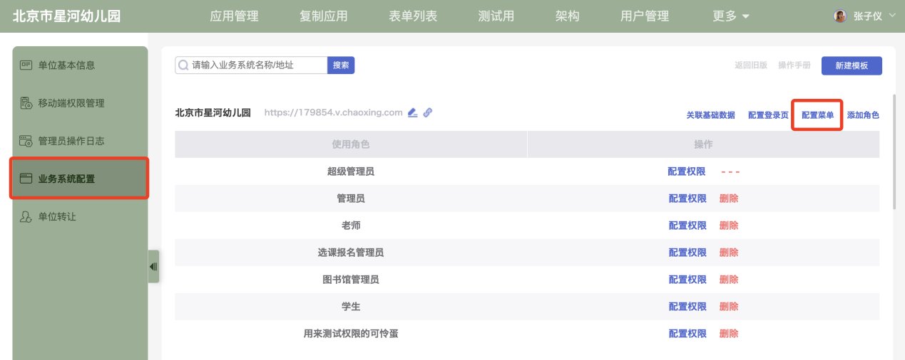

⚠️ 初次点进时，需点击右上角编辑按钮，先添加一个允许编辑的菜单

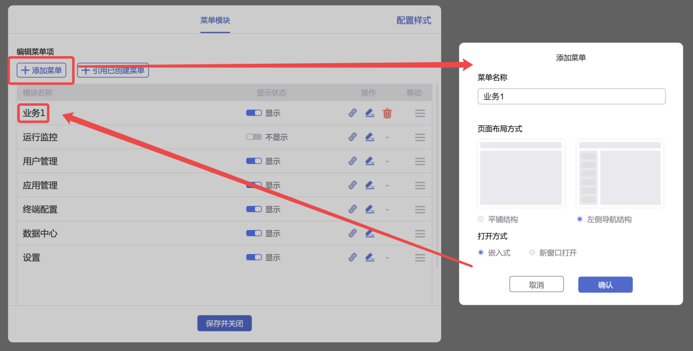

选择【新建表单】【从Excel创建表单】或【复制已存在表单】

##### 2.1.3、两种途径的区别与联系

[TOC]

🧭 文档更新日期：2024年7月17日

### 📖 区别

##### 1. 表单名称的设置方式不同

从【业务系统】创建的表单：名称在【菜单】处修改

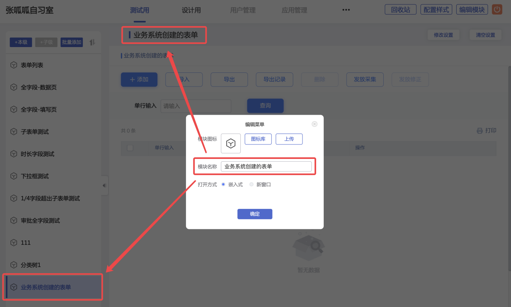

从【应用管理】创建的表单：名称、图标在左上角的【表单基础设置】中修改

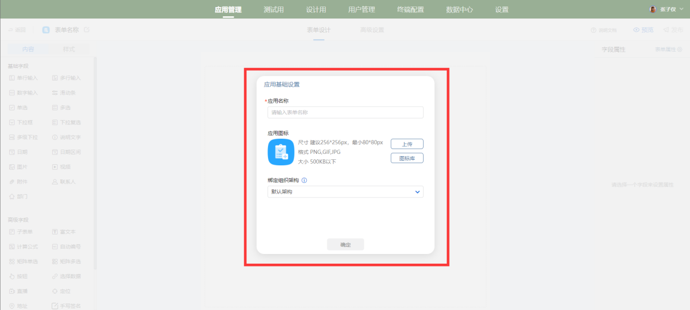

##### 2. 创建后的默认添加到不同位置

从【业务系统】创建的表单：只默认添加于单位应用市场；如需在其它位置使用，需要从【单位应用市场】中手动选择，添加至单位应用管理页面中

从【应用管理】创建的表单：默认添加至单位应用管理页面中

### 📖 联系

##### 1. 创建后都会存放在应用市场

创建成功后都会进入【单位应用市场-自建应用-表单应用】分类下

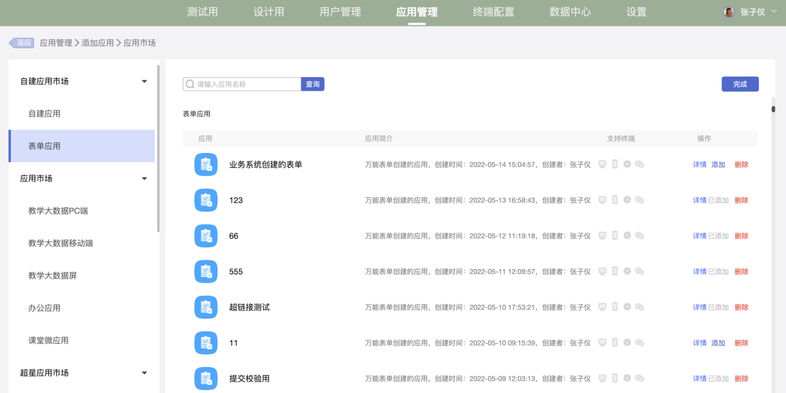

##### 2. 创建后都会自动生成前后台

创建成功后，系统都会自动生成表单前台（填写页）和表单后台（数据管理页）

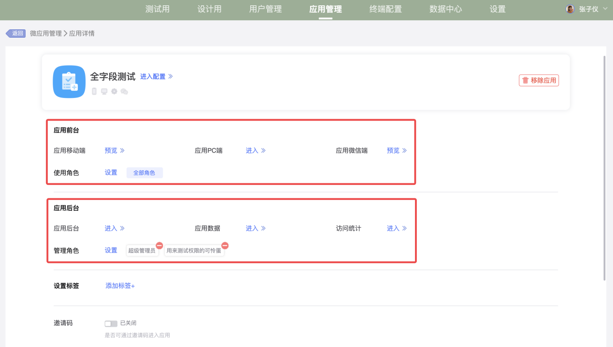

#### 2.2、三种创建方式

##### 2.2.1、新建表单

🧭 文档更新日期：2024年7月17日

选择【新建表单】后，将直接进入一张【空白的表单创建页】

需要手动拖入所需的字段，进行相关的属性配置，点击发布即可完成表单的创建

##### 2.2.2、从Excel创建表单

[TOC]

🧭 文档更新日期：2024年7月17日

选择【从excel创建表单】后，可以使用已有Excel文件直接创建表单，同时导入文件数据

### 🔧 配置流程

##### 🪧 第一步 上传Excel

提前准备好要使用的Excel文件，文件应符合以下标准：

不能存在合并的单元格

支持 2MB 以内的xls、xlsx格式文件

文件中数据不能超过10000行，100列

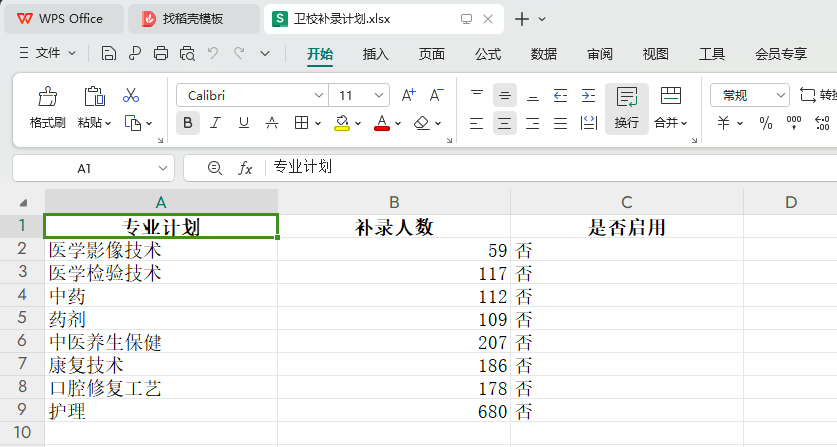

文件上传成功后可进入下一步

##### 🪧 第二步 预览数据

在【预览数据】界面可以选择某个Excel中【要导入的sheet】以及【要作为字段标题的行】，检查字段和数据，确认无误后可进入下一步

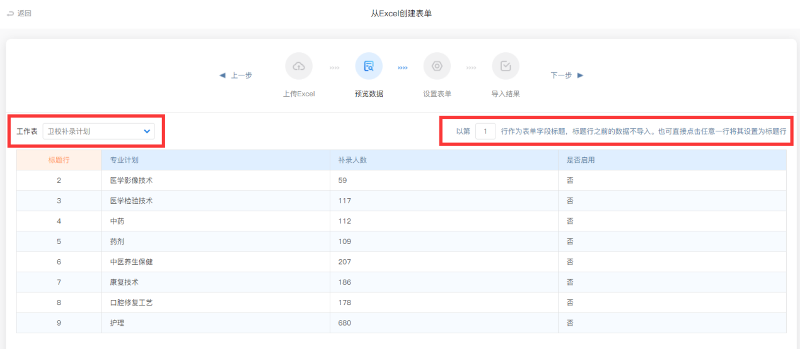

##### 🪧 第三步 设置表单

在【设置表单】界面可以修改表单名称、字段名称、字段类型

💡 尽量在创建时确定好字段类型再导入

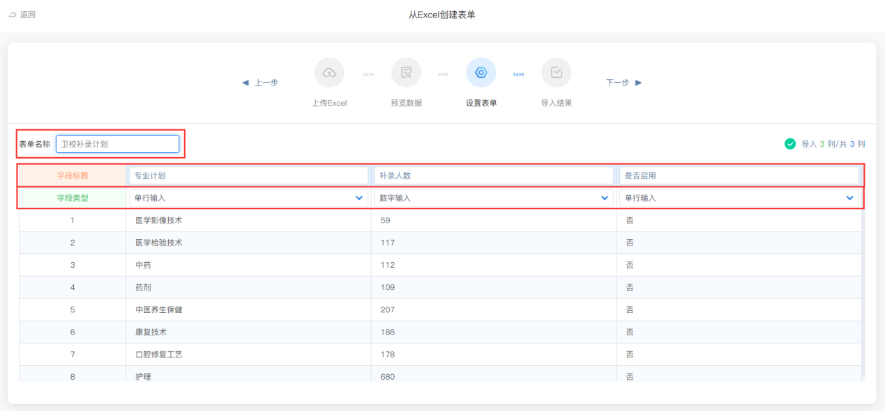

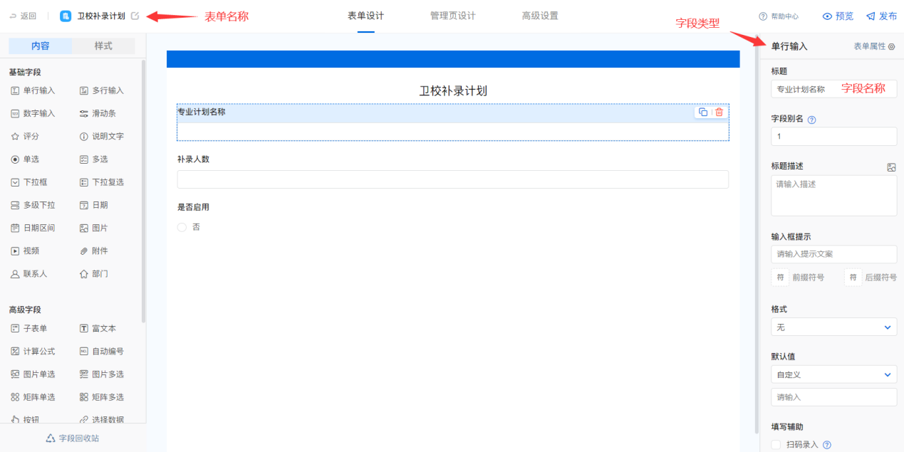

##### 🪧 第四步 确定导入结果

##### 🪧 第五步 检查表单配置和数据

创建完成后，可以到【表单创建页】和【数据管理页】中检查生成的配置和数据，也可以进行二次修改

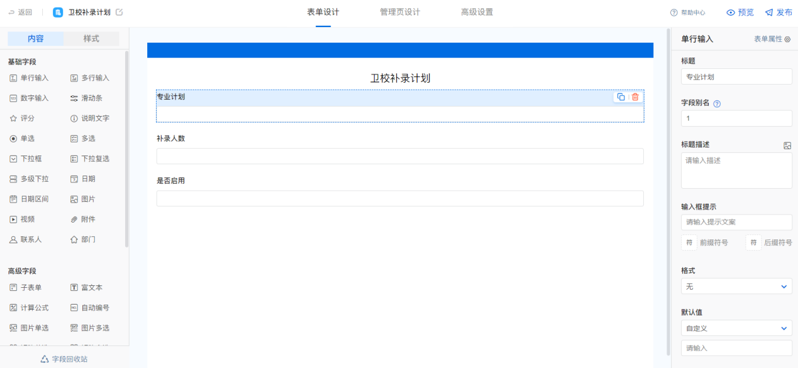

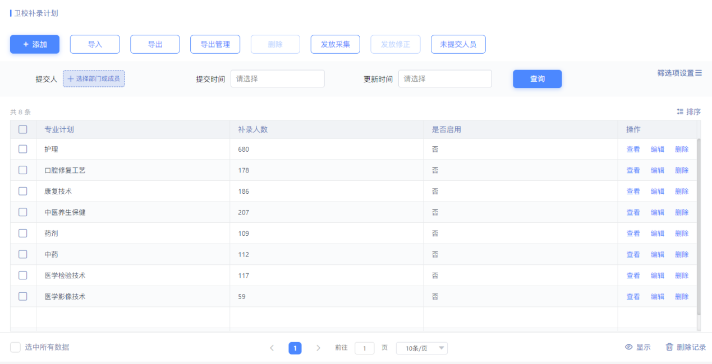

##### 2.2.3、复制已存在应用

🧭 文档更新日期：2025年2月11日

选择【复制已存在应用】后，可以从本单位中选择一张表单/审批，确定后将 自动创建副本，并直接进入该副本的创建页中

副本表会继承原表单的所有配置（包括和其他表单相关联的配置，如数据联动等）

在原有配置的基础上可进行二次编辑，发布后即可生成新的表单

🔆 特殊说明：

表单和审批之间支持双向复制，用户可以将搭建好的表单应用，快速转换为带流程的审批应用，或反之

从审批复制为表单时，只保留字段相关配置

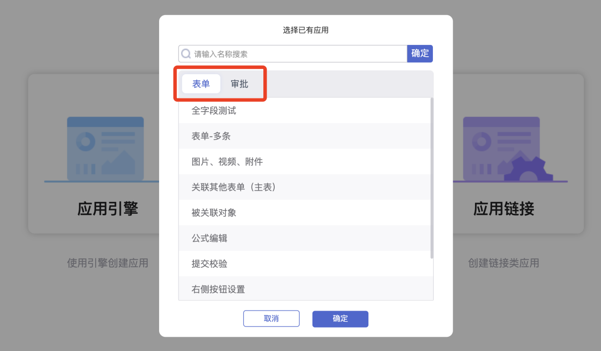

### 3、三、配置表单

#### 3.1、表单基础设置

##### 3.1.1、应用名称、图标

🧭 文档更新日期：2024年7月19日

从应用管理中创建表单后，进入创建页会直接弹出基础设置的弹窗

弹窗中可修改应用的名称、选择或上传应用的图标

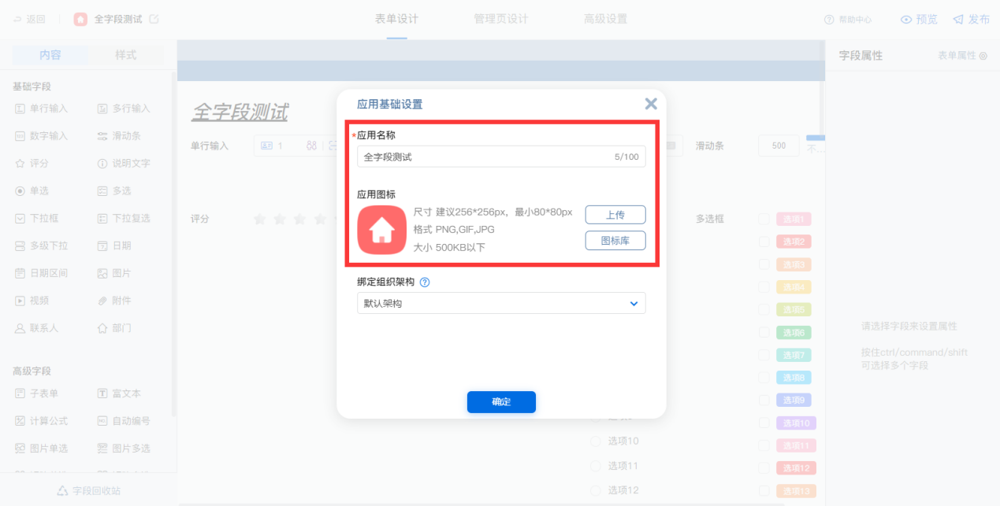

设置后，该名称和图标将显示在：应用列表、填写页、数据管理页等各个地方

 

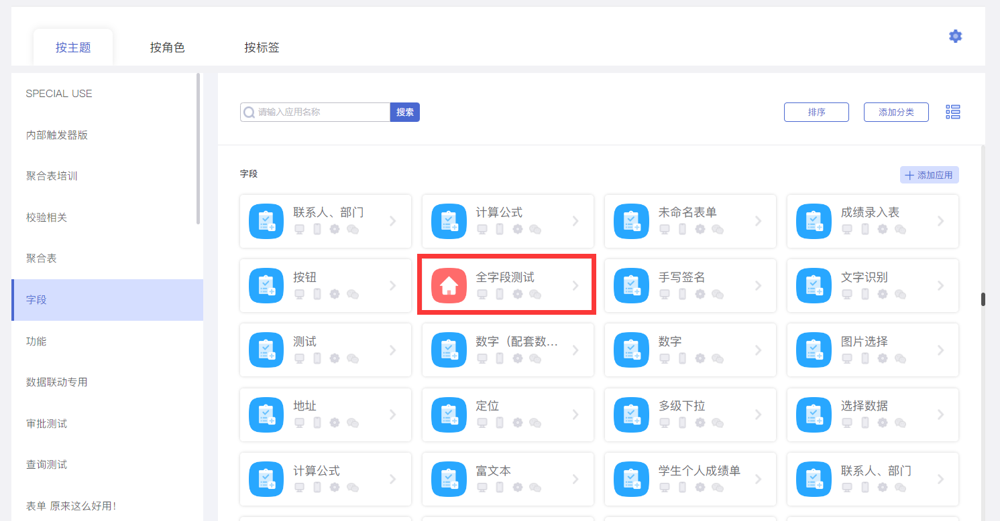

 

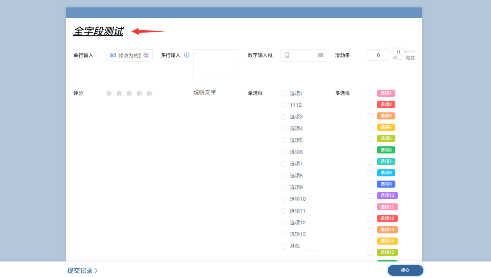

 

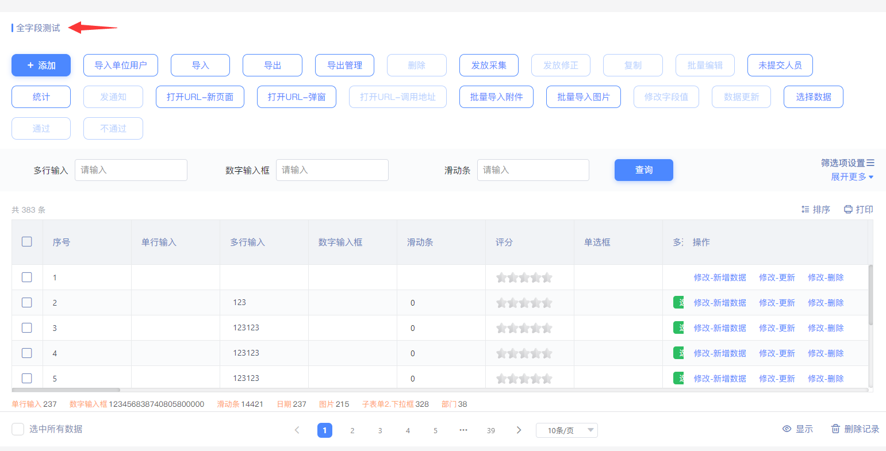

##### 3.1.2、绑定组织架构

[TOC]

🧭 文档更新日期：2025年2月11日

### 📖 功能简介

##### 🪧定义

组织架构用于维护该单位中的部门列表、部门和人的关系，每个单位可以创建多套组织架构，分别服务于不同的业务

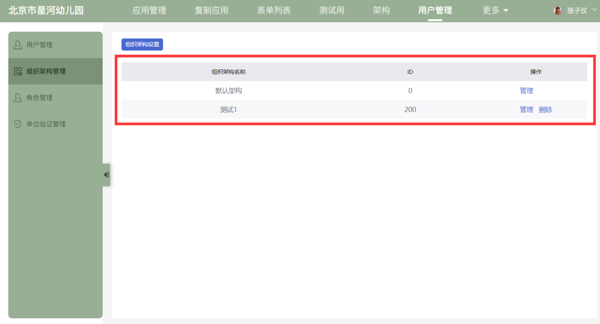

但每张表单必须绑定其中的某一套架构

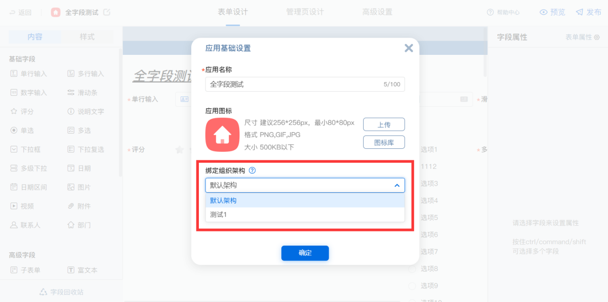

##### 🪧使用场景

学校有多套架构，分别用于教学管理、教务管理、后勤管理 教学和教务系统中涉及的表单，需要绑定架构A；后勤系统中涉及的表单，需要绑定架构B

### 💡 特殊说明

##### 🪧绑定架构影响位置

绑定不同的组织架构，会影响以下地方弹窗中显示的内容

表单填写页：联系人、所属人、部门字段展开的弹窗中的部门和人员列表

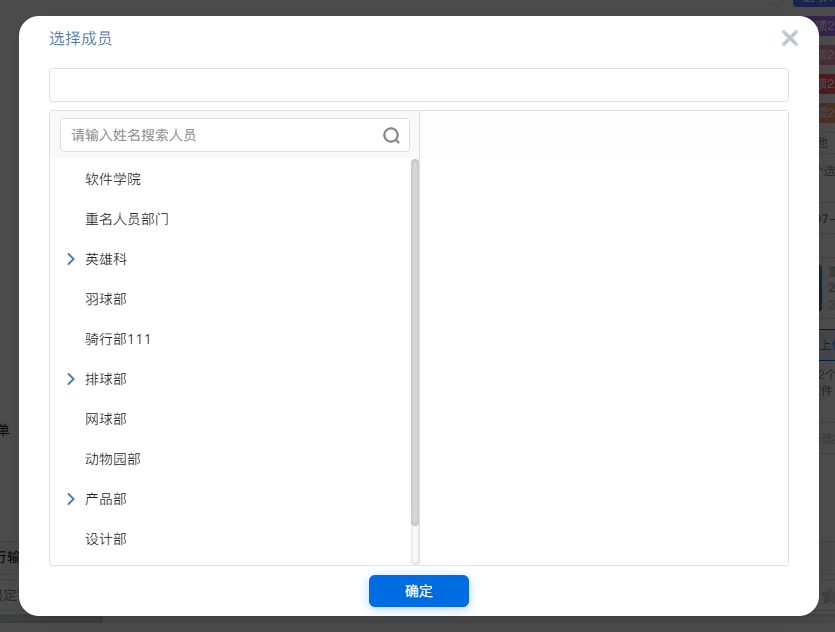

"; style="border:1px solid #e1e3e5; border-radius: 5px;"

数据管理页：联系人、部门等字段的【筛选项】弹窗中的部门和人员列表

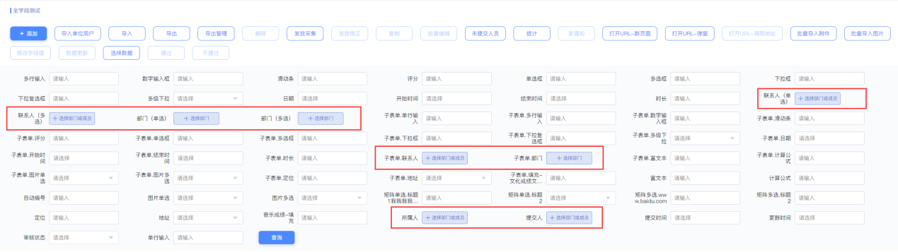

创建页：联系人、部门等字段的【过滤组件、赋值组件等】弹窗中的部门和人员列表

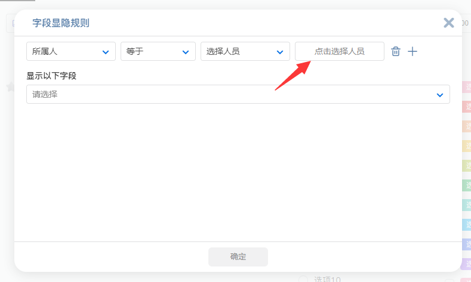

##### 🪧切换架构影响位置

切换组织架构后，会导致联系人字段已经配置的可选范围失效，需要重新配置

##### 3.1.3、绑定区域架构

[TOC]

🧭 文档更新日期：2025年2月11日

### 📖 功能简介

##### 🪧 什么是区域架构

以往，基于微服务的业务大多局限于某个单位内部，但随着数字化转型推进，跨单位业务的需求在日益增长 例如：集团校的师生管理、文化馆总分馆间的资源流转等

为此公司开发了【区域架构】应用，用于维护多单位间的层级关系，在顶级单位中添加区域架构应用后，可将其他单位添加为下级单位，并为其设置角色、权限和相关应用

##### 🪧 绑定方式

当单位在区域架构中时，表单的基础设置弹窗中会显示【绑定区域架构】模块，开关默认关闭 注意：如果本张表单不用于跨单位的信息收集和管理，则无需开启区域架构

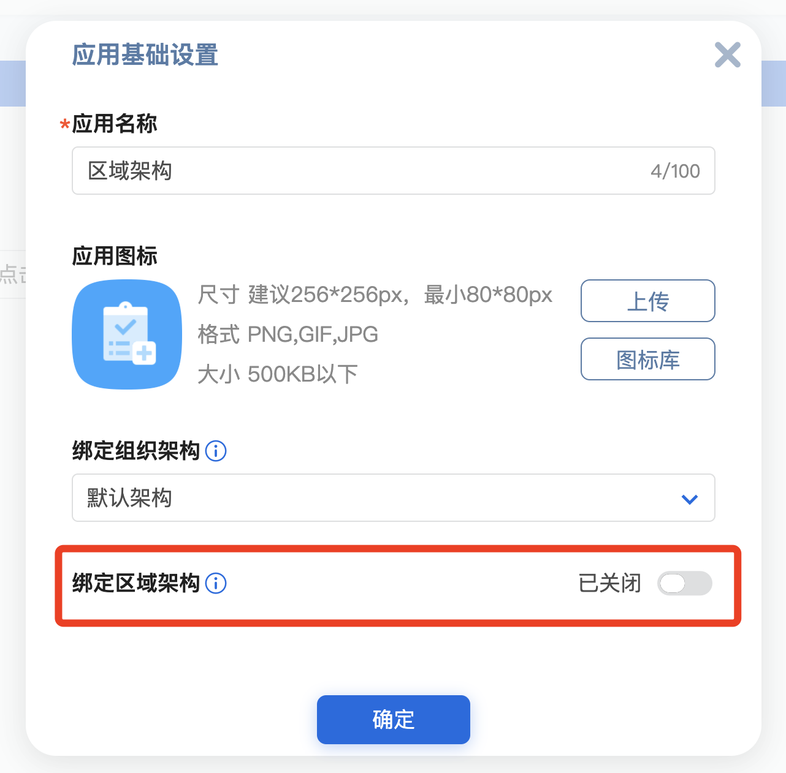

开关开启后，在下拉框中选择要绑定的架构 注意：一个单位可以存在于多套区域架构中，但每张表单必须绑定其中的某一套区域架构

### 💡 特殊说明

##### 🪧开启区域架构的影响

区域架构开启后，组件库中将显示【单位】字段，配置方式详见：[单位字段使用说明](https://document.chaoxing.com/web/#/120/2170 "单位字段使用说明")

区域架构开启后，联系人字段的【可选范围】将显示更多选项，配置方式详见：[联系人字段使用说明](https://document.chaoxing.com/web/#/120/1509 "联系人字段使用说明")

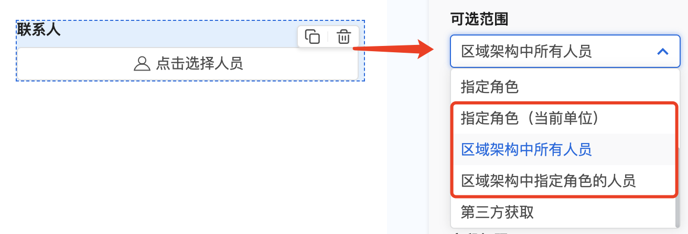

##### 🪧切换区域架构的影响

切换绑定的区域架构会导致单位、部门、联系人的范围和默认值等相关配置失效，需要重新配置

#### 3.2、表单设计

##### 3.2.1、◾表单设计简介

[TOC]

🧭 文档更新日期：2025年3月6日

##### 🪧 表单设计分区

表单设计页面分为四个区域：左侧组件库、顶部全局操作栏、右侧配置面板、中央操作面板

组件库：包含布局容器、基础字段、高级字段、系统字段，以及字段回收站

全局操作栏：包含表单整体设置、批量删除字段等功能

右侧配置面板：表单、组件的属性/样式配置面板

中央操作面板：实时预览填写页效果、操作表单元素的区域

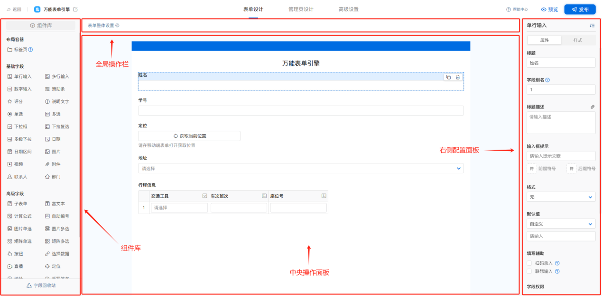

##### 🪧 通用设计流程

从【组件库】拖拽所需的组件至预览区

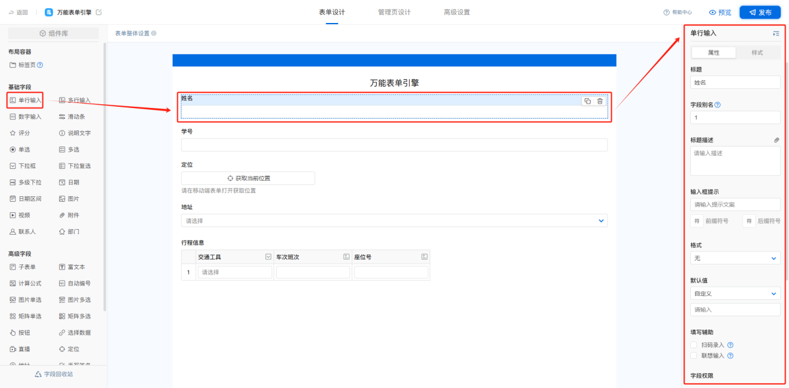

在【中央操作面板】调节组件顺序、对组件进行复制或删除

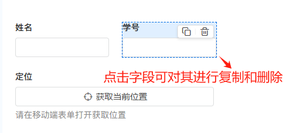

点击某个组件，在【右侧配置面板】对该字段的属性、样式进行配置

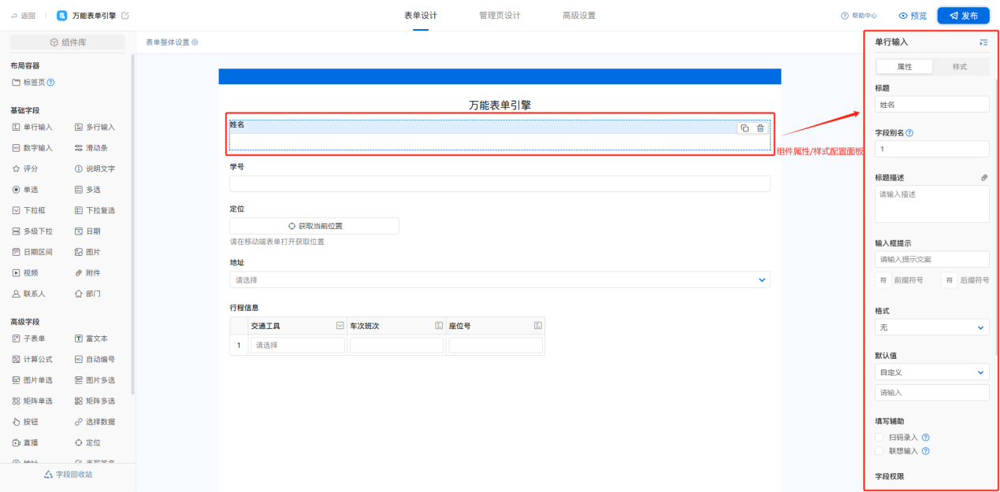

点击【表单整体设置】，对表单的属性、样式进行调整

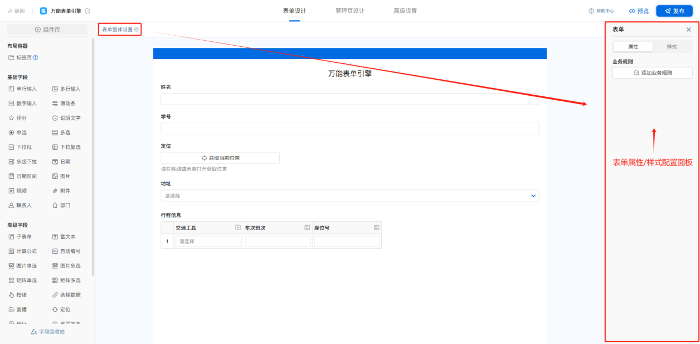

##### 3.2.2、◾表单属性

点击表单整体设置，可以在【右侧配置面板】调整表单整体属性：业务规则（显隐规则、编辑规则、必填规则）

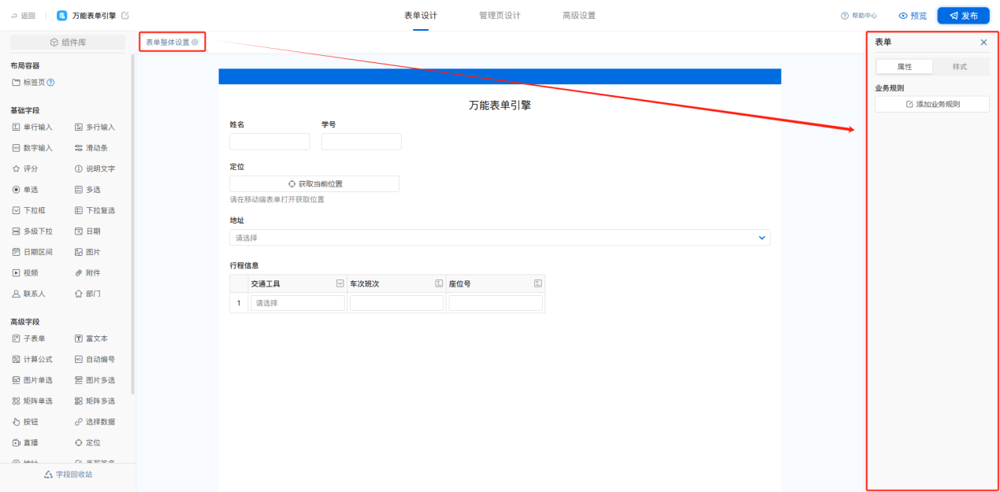

##### 3.2.3、◽◾业务规则-显隐规则

[TOC]

🧭 文档更新日期：2025年3月6日

### 📖 功能简介

##### 🪧 定义

根据当前填写页中的某些字段的值，判断其他字段是否显示

##### 🪧 使用场景

活动报名表中，仅当勾选了【同意上述规则】字段，才显示其他的报名字段

学生所在年级不同，需要填写的报名字段不同

终端设置中勾选了哪些端口，就显示相应的字段，不勾选时不显示

##### 🪧 功能位置

表单创建页-【表单整体设置】-右侧配置面板【属性】-【业务规则-显隐规则】

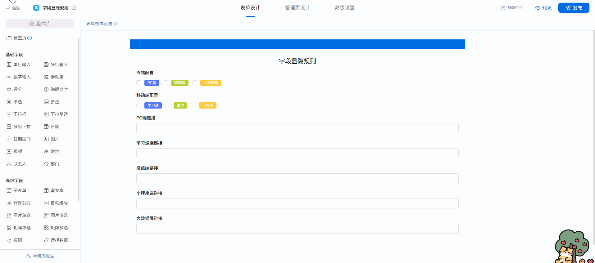

### 🔧 配置流程

显隐规则的配置流程一共分为三步：添加显隐规则、配置条件、选择显示字段

##### 🪧 第一步：添加显隐规则

在【表单整体设置-属性-业务规则】中添加显隐规则，可添加多条

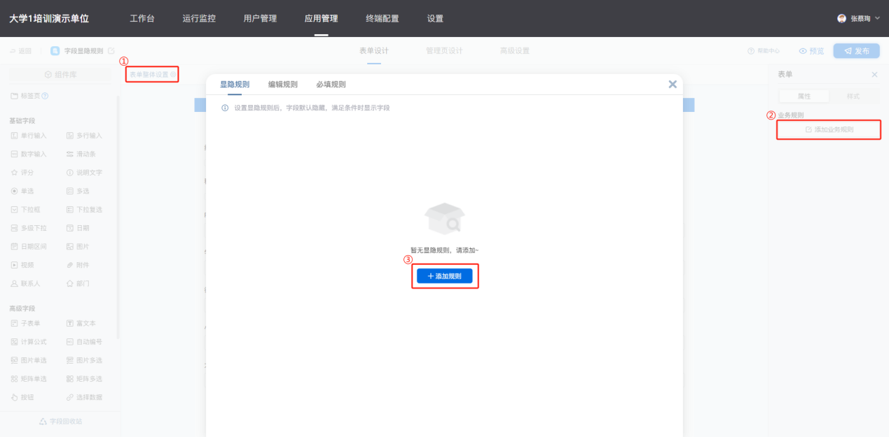

##### 🪧 第二步：配置条件

配置条件，用于判断其他字段是否显示 - 支持配置多个条件，条件之间可为 “且/或”混合关系 - 必须先配置条件，才能继续选择显示字段

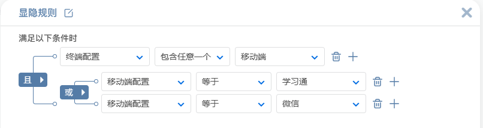

##### 🪧 第三步：选择显示字段

选择一个或多个被上述条件控制显隐的字段 - 配置过条件后，显示字段列表处只显示位于所有条件字段 后面 的字段

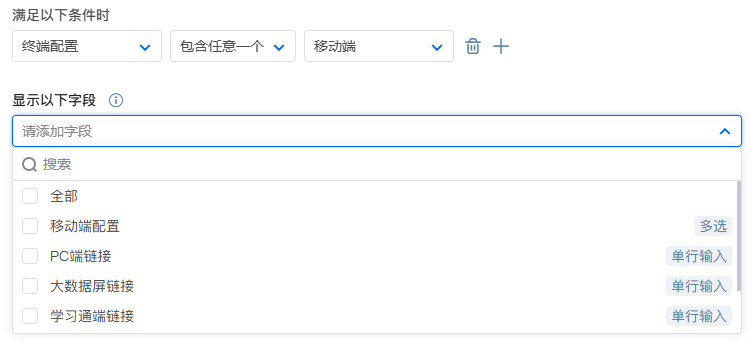

### 💡 配置规则

##### 🪧 每个字段只能被一个规则控制显隐

示例：学校类型为“中学”时显示A、B字段；为“小学”时显示B、C字段

此时不能同时设置两个规则来控制B字段

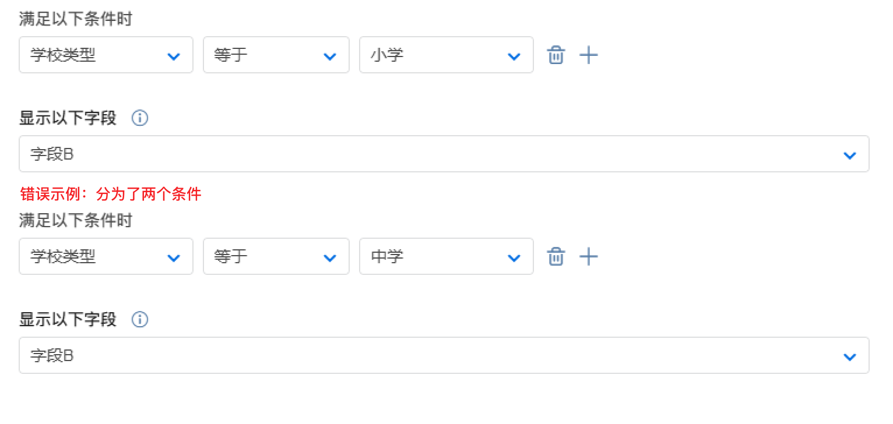

而应该在一个规则中，一次性把所有条件配置完

##### 🪧 条件字段只能控制后面的字段

必须先配置条件，才能继续选择显示字段

配置过条件后，显示字段列表处只显示位于所有条件字段 后面 的字段

调整字段顺序不会使字段显隐规则失效，但系统会限制规则的条件和显示字段 形成闭环 的情况

【标签页】内的字段也有顺序，从表单整体上来说，顺序为：主表单区域字段、标签1区域字段、标签2区域字段…

当一个标签内的字段全部隐藏时，标签也会隐藏

【子表单】内的字段同样存在顺序，在子表单内，位于前面的字段可以控制后边字段的显隐

主字段可以控制子表单整体的显隐

### 💡 注意事项

##### 🪧 隐藏字段参与运算

因显隐规则而隐藏的字段，如果有值，仍会参与页面上的运算，此运算包括：数据联动、公式编辑、常用公式、计算公式

##### 🪧 提交后清空隐藏字段的值

数据提交后，因显隐规则而隐藏的字段会被 清空

##### 🪧 显隐规则触发机制

除用户手动填写数据外，通过【默认值、前端事件、数据联动、选择数据等】方式给条件字段赋值后，同样能触发字段显隐规则

##### 3.2.4、◽◾业务规则-必填规则

[TOC]

🧭 文档更新日期：2025年3月6日

### 📖 功能简介

##### 🪧 定义

根据当前填写页中的某些字段的值，判断其他字段是否必填

##### 🪧 使用场景

用户选择“实践课”时，必须填写【实验器材】

当监护人身份选“其他”时，必须填写【关系说明】

当论文类型为“实证类论文”时，必须填写【数据来源】

##### 🪧 功能位置

表单创建页-【表单整体设置】-右侧配置面板【属性】-【业务规则-必填规则】

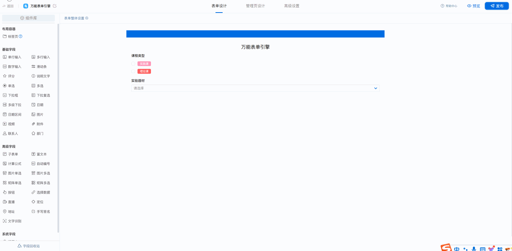

### 🔧 配置流程

必填规则的配置流程一共分为三步：添加必填规则、配置条件、选择必填字段

##### 🪧 第一步：添加必填规则

在【表单整体设置-属性-业务规则】中添加必填规则，可添加多条 

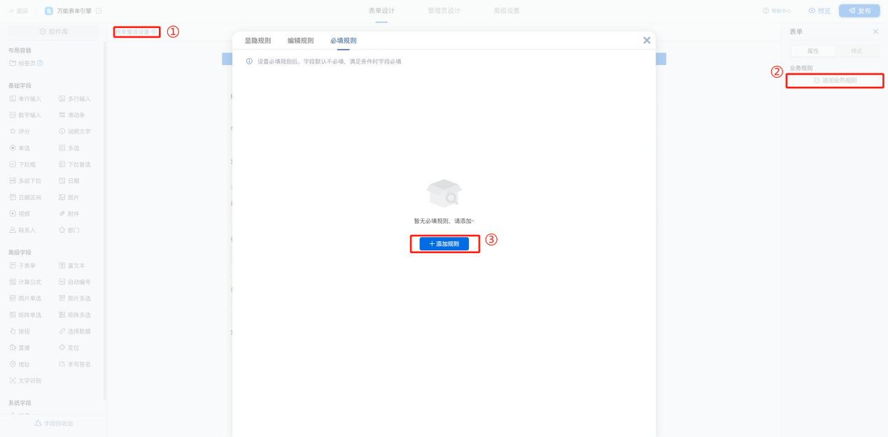

##### 🪧 第二步：配置条件

配置条件，用于判断其他字段是否必填 - 支持配置多个条件，条件之间可为 “且/或”混合关系 - 必须先配置条件，才能继续选择必填字段

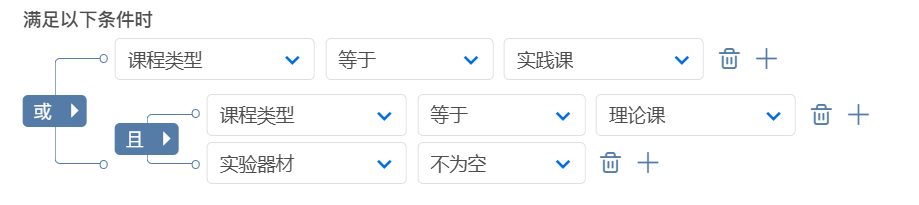

##### 🪧 第三步：选择必填字段

选择一个或多个被上述条件控制必填的字段 - 配置过条件后，必填字段列表处只显示位于所有条件字段 后面 的字段

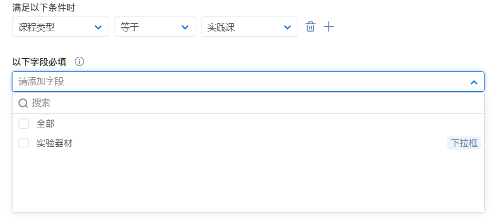

### 💡 配置规则

##### 🪧 每个字段只能被一个规则控制必填

示例：课程类型为“实践课”或“实践理论结合课”时实验器材字段必填

此时不能同时设置两个规则来控制实验器材字段

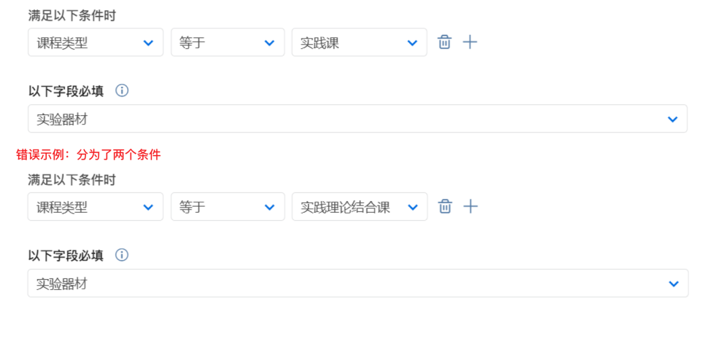

而应该在一个规则中，一次性把所有条件配置完

##### 🪧 条件字段只能控制后面的字段

必须先配置条件，才能继续选择必填字段

配置过条件后，必填字段列表处只显示位于所有条件字段 后面 的字段

子表单内的字段同样存在顺序，在子表单内，位于前面的字段可以控制后边字段的必填

### 💡 注意事项

##### 🪧 必填属性仅可在一个地方配置

配置必填规则后，字段属性处必填属性隐藏，不可重复配置

##### 3.2.5、◽◾业务规则-编辑规则

[TOC]

🧭 文档更新日期：2025年3月6日

### 📖 功能简介

##### 🪧 定义

根据当前填写页中的某些字段的值，判断其他字段是否允许编辑

##### 🪧 使用场景

教师只能在成绩提交截止日期前编辑成绩，过期后不可修改

学生选题经导师确认后，选题字段自动锁定

报修单状态变为“维修中”时，报修描述和联系方式字段锁定，仅允许补充维修反馈

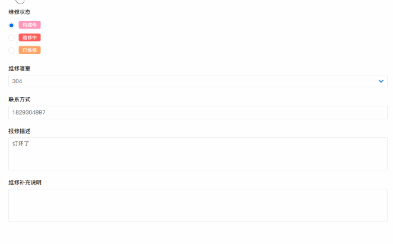

##### 🪧 功能位置

表单创建页-【表单整体设置】-右侧配置面板【属性】-【业务规则-编辑规则】


### 🔧 配置流程

编辑规则的配置流程一共分为三步：添加编辑规则、配置条件、选择可编辑字段

##### 🪧 第一步：添加编辑规则

在【表单整体设置-属性-业务规则】中添加编辑规则，可添加多条


##### 🪧 第二步：配置条件

配置条件，用于判断其他字段是否可编辑 - 支持配置多个条件，条件之间可为 “且/或”混合关系 - 必须先配置条件，才能继续选择可编辑字段


##### 🪧 第三步：选择可编辑字段

选择一个或多个被上述条件控制编辑属性的字段 - 配置过条件后，可编辑字段列表处只显示位于所有条件字段 后面 的字段


### 💡 配置规则

##### 🪧 每个字段只能被一个规则控制编辑属性

示例：维修状态为“维修中”或“已维修”时维修补充说明字段可编辑

此时不能同时设置两个规则来控制维修补充说明字段


而应该在一个规则中，一次性把所有条件配置完

##### 🪧 条件字段只能控制后面的字段

必须先配置条件，才能继续选择可编辑字段

配置过条件后，可编辑字段列表处只显示位于所有条件字段 后面 的字段

子表单内的字段同样存在顺序，在子表单内，位于前面的字段可以控制后边字段是否可编辑

##### 🪧 编辑权限由字段属性和编辑规则共同控制

字段显示+字段属性为可编+满足编辑规则时，字段才可编辑

### 💡 注意事项

##### 🪧 子表单的编辑规则

满足编辑规则的子表单，可编辑内容根据子表单【字段属性-字段权限】处配置决定

##### 3.2.6、◾表单样式

[TOC]

🧭 文档更新日期：2025年3月6日

### 📖 功能简介

##### 🪧 定义

用于配置表单填写页的整体样式，包含标题、背景、按钮、字段等

##### 🪧 功能位置

表单创建页 -【表单整体设置】- 右侧配置面板【样式】


### 🔧 配置流程

##### 🪧 样式模板

系统提供了多套样式模板，创建者可以根据场景自行选择

用户也可以在每套模板的基础上对各个元素进行二次编辑，编辑后会生成一套自定义模板


##### 🪧 页面背景

用于控制填写页的背景色，目前支持选择【纯色】或自行上传【图片】，仅在PC端生效


##### 🪧 表单背景

用于控制中央填写区域的背景颜色，目前支持设置为纯色或自行上传【图片】，在PC、移动端均生效


##### 🪧 表头样式

用于控制表头区域的内容和高度，内容支持选择【纯色】【渐变色】或上传【图片】，在PC、移动端均生效


##### 🪧 表单标题

控制是否显示表单标题，以及显示的位置、字体等，在PC、移动端均生效


##### 🪧 提交按钮

控制提交按钮的文案和按钮样式，在pc、移动端均生效


##### 🪧 字段宽度

批量设置表内所有字段的宽度，支持设置1/6、1/4、1/3、1/2、1或自定义，仅在pc端生效

设置后，用户仍可单独调节某个字段的宽度

新插入的字段，默认按此处设置的宽度进行显示


##### 🪧 字段标题位置

批量设置表内所有字段的标题位置，支持选择【上下】【左右】【隐藏标题】，在pc、移动端均生效

选择【左右】时，支持设置标题对齐方式

设置后，用户仍可单独调节某个字段的标题位置

新插入的字段，默认按此处设置的位置进行显示


##### 3.2.7、◾组件库简介

[TOC]

🧭 文档更新日期：2025年3月6日

##### 🪧 组件库分区

组件库分为四大模块：布局容器、基础字段、高级字段、系统字段

布局容器：支持拖拽添加标签页

基础字段：包含单行输入、多行输入、数字输入等基础字段

高级字段：包含子表单、富文本等高级字段

系统字段：支持拖拽添加所属人字段


##### 3.2.8、◾布局容器

[TOC]

🧭 文档更新日期：2024年3月8日

### 📖 功能简介

##### 🪧 定义

布局容器是用于存放多个字段的容器类组件，目前支持：标签页

标签页：用于字段的分类存放，帮助用户更高效地管理和展示信息，使界面更加清晰、直观和易于操作

##### 🪧 使用场景

将学生信息分为“基本信息”“成绩记录”“考勤记录”等部分，方便教师快速查看和更新

将活动按类型分组，如“体育类”“艺术类”“学术类”，方便学生和家长选择


##### 3.2.9、◽◾标签页

[TOC]

🧭 文档更新日期：2025年3月6日

### 📖 功能简介

##### 🪧 定义

标签页是一种布局组件，用于字段的分类存放，帮助用户更高效地管理和展示信息，使界面更加清晰、直观和易于操作

##### 🪧 使用场景

例如幼儿入园申请表：添加多个标签，分别用于收集【基本信息】【班级信息】【健康与生活】【性格与教育】等


##### 🪧 功能位置

表单创建页-组件库-布局容器


### 🔧 配置流程

添加标签页后，可以在属性区增删标签，也可以对标签名称、顺序进行更改

删除某个标签时，可选择将标签内的字段一并删除，或转移到主表单的尾部


##### 3.2.10、◽◾表格布局（待补充）

##### 3.2.11、◽◾卡片布局（待补充）

##### 3.2.12、◾字段简介

🧭 文档更新日期：2025年3月6日

我们将利用表单收集到的信息称为【数据】，而【字段】是数据的最小单元

例如：收集学生家长信息时，每个学生提交一条数据，数据中的【学生姓名】【家长姓名】【家长联系方式】等均是字段


目前万能表单提供了近40种不同类型的字段，供用户构建信息采集表

⚠️ 字段类型之间无法相互转换，因此在搭建前期【字段类型】的选择非常重要，关系到公式编辑、数据联动、统计等功能是否可用


##### 3.2.13、◾字段属性

[TOC]

🧭 文档更新日期：2025年3月6日

万能表单提供了近40种不同类型的字段，而每个字段又有丰富灵活的属性配置项，可以满足多样的信息收集需求

选中某个字段，页面右侧区域将显示该字段的全部属性，创建者可以根据需要对配置进行更改


下文将列出一些较为通用的属性及其配置方式，其他特殊属性请查看字段库中每个字段处的介绍：

标题：指该字段的名称，其默认值为字段类型名称

字段别名：在使用表单数据接口时使用，只能输入字母和数字；同一个表单下唯一，且不能为空

标题描述：对该字段的解释或说明，可添加图片

格式：系统预设的数据格式，起到校验的作用，例如：勾选了手机号码，用户则必须输入11位数字才能提交数据

默认值：指用户在填写表单时默认填入该字段的值，例如自定义、数据联动等

表单填写缓存：部分字段可设置进入表单时，自动加载上次提交过的填写内容

字段权限：可设置字段对填写者是否可见、可编辑

校验：部分字段可设置是否必填、是否允许小数、是否允许重复值、选择多项等

##### 3.2.14、◽◾数据联动

[TOC]

🧭 文档更新日期：2025年3月6日

### 📖 功能简介

##### 🪧 定义

数据联动是字段【默认值】或【选项来源】的一种，在当前表单数据符合一定条件时，调用另一张表中的数据，并将其作为默认值或选项，带入当前表单中。

##### 🪧 使用场景

当某一字段需要根据其他字段值的变化而变化时，可以使用数据联动功能，例如：

在教学管理系统中，老师选择了 班级和日期 后，系统自动联动出对应的 课程明细，填入对应字段

在库存管理系统中，管理员填入 商品编号 时，系统自动联动出商品相关信息 ，填入对应字段

示例：入库时选择资产编号，联动显示资产名称、类型等信息

##### 🪧 支持字段及功能位置

支持作为以下字段的【默认值】：单行输入、多行输入、数字输入、下拉框、下拉复选、日期、图片、视频、附件、联系人、部门、子表单、富文本、定位、地址、所属人

在【字段属性-默认值】处选择【数据联动】后，可在弹窗内配置数据联动


 


支持作为以下字段的【选项】：下拉框、下拉复选

在【字段属性-选项】处选择【数据联动】后，可在弹窗内配置选项数据联动

"; style="border:1px solid #e1e3e5; border-radius: 5px;" width="200px" 


### 🔧 配置流程

数据联动的配置流程一共分为四步：选择联动表单、配置条件、选择联动字段、设置数据排序规则


##### 🪧 第一步：选择联动表单

选择本单位的表单、审批或聚合表（开通后可见）作为目标表

##### 🪧 第二步：配置条件

配置条件，用于在目标表中筛选数据： - 支持配置多个条件，条件之间为 “且” 的关系 - 左侧选择的是目标表中的字段，中间选择逻辑关系，右侧设置比较对象 - 比较对象可以设置为本表中的某个字段、固定值、动态值等


##### 🪧 第三步：选择联动字段

从目标表中选择一个字段，用于给【当前字段】赋值

联动字段有字段类型限制，详见注意事项处的说明

##### 🪧 第四步：设置数据排序规则

配置的条件，可能从目标表中筛选出多条符合条件的数据，此时系统会根据此处的规则，将这些数据进行排序，用于：

- 如果是【默认值】设置了数据联动，系统会按设置的顺序，将 第一条数据 联动到本表中

- 如果是【选项】设置了数据联动，系统将数据滤重后，会按设置的顺序返回到下拉框的选项中


 

支持五种排序规则：

- 按提交时间排序-正序：最老提交的数据在前- 按提交时间排序-倒序：最新提交的数据在前- 按字段值-正序：按数据正向排序，空值—特殊符号—数字—汉字—字母- 按字段值-倒序：按数据倒序排序，字母—汉字—数字—特殊符号—空值- 按手动排序顺序：按手动设置的顺序（注意：仅当目标表开启了手动排序时才显示该选项）

 


### 💡 注意事项 & 配置规则

##### 🪧 联动字段类型限制

除【单行输入、下拉框、下拉复选】字段外，大部分字段只能关联相同类型的字段，具体对应关系如下：

本表字段类型

目标表可选择的字段类型

单行输入

单行输入、单选框、下拉框、多级下拉、计算公式、地址、自动编号

多行输入

多行输入

数字输入

数字输入、计算公式

下拉框

单行输入、数字输入、日期、下拉框、下拉复选、计算公式、滑动条、自动编号

下拉复选

单行输入、数字输入、日期、下拉框、下拉复选、计算公式、滑动条、自动编号

日期

日期

图片

图片

视频

视频

附件

附件

联系人（单选）

联系人（单选）、所属人

联系人（多选）

联系人（多选）

部门（单选）

部门（单选）

部门（多选）

部门（多选）

子表单

子表单（内部字段也需要满足对应关系）

富文本

富文本

定位

定位

地址

地址

所属人

所属人、联系人（单选）

##### 🪧 单行输入OR下拉框

单行输入和下拉框都是用于存储文本类信息的字段，如果这个字段要设置数据联动，那是使用单行输入，还是下拉框呢？

可以根据下述场景进行选择：

如果从目标表筛选出的数据有多条，且系统无法替用户决定要填入哪一条，则应该选择【下拉框】字段，并且是需要给下拉框的【选项】模块设置数据联动

如果从目标表中筛选出的数据仅有一条，则可以根据需要选用其他字段

… …… …… …… …… …… …

示例：资产信息表中存在两条资产编号相同的数据


资产名称使用【单行输入】进行联动时：只能联动显示一条数据

资产名称使用【下拉框】进行联动时：可显示两条数据供选择

##### 3.2.15、◽◾公式编辑

[TOC]

🧭 文档更新日期：2025年3月6日

### 📖 功能简介

##### 🪧 定义

公式编辑是字段【默认值】的一种，它能获取到当前数据中其他字段的值，并根据配置的公式进行计算，最终将结果返回本字段。

##### 🪧 使用场景

当某个字段的值需要通过一定的计算才能获得，可以使用公式编辑功能 ，例如：

用户输入了活动的 开始时间、结束时间，系统自动计算 时长

用户输入 身份证号，系统自动返回对应的 年龄、性别 等信息

考试结束后，教师往表单中录入学生的 分数，需要根据分数计算对应的 等级

示例：录入学生成绩，大于85分，输出优秀；70-85分的区间，输出良好；60-75分的区间，输出合格；小于60分，输出不合格


🔆 得益于丰富的函数，公式编辑可以进行非常灵活的运算，能满足绝大多数计算类的需求

##### 🪧 支持字段及功能位置

支持作为以下字段的【默认值】：单行输入、多行输入、数字输入、日期

在【字段属性-默认值】处选择【公式编辑】后，可在弹窗内配置数据联动：

 


### 🔧 配置界面

公式编辑的弹窗中分为几个区域：公式编辑区、可用变量列表、函数列表、函数说明

在【公式编辑区】输入公式

在【可用变量列表】中选择要插入到公式中的字段，插入后，该字段将参与运算

在【函数列表】中选择需要的函数

如果对函数功能不了解，还可以查看【函数说明】中该函数的示例


具体的函数使用说明请查看以下说明文档或对应的函数示例说明:https://vptbfpqk2e.feishu.cn/docx/YhwvdStn3oEbExxGDw6cMIH7nMe

### 📋 配置规则

##### 🪧 使用英文半角符号

公式编辑中支持插入如下符号，请确保使用英文输入法输入

等于

不等于

大于

大于等于

小于

小于等于

加

减

乘

除

==

!=

=

<

<=

+

-

*

/

小数点

逗号

双引号

单引号

小括号

中括号

.

,

""

''

( )

[ ]

##### 🪧 选择正确的字段类型

公式编辑可能会输出【文本、数字、日期类】的结果

我们需要事先判断输出值类型，选择合适的字段，再给这个字段配置公式编辑

示例1：想要输出“优秀、良好、合格”等文本信息，如果给【数字输入】配置该公式，则无法正常返回

示例2：想要输出日期，如果给【数字输入】配置该公式，则会返回时间戳“1714360167376”

### 💡 配置思路

我们可以将公式和函数分为两类：计算、判断

计算类的函数和公式：SUM、COUNT、CONCATENATE、DAY、+-*/…

根据函数进行运算，返回某个值

判断类的函数和公式：AND、OR、NOT、ISEMPTY、EXACT、EXACTALL、==、!=、、<…

根据函数进行判断，返回true或false

判断+计算类的函数：IF、IFS、COUNTIF

既能进行判断，又能根据判断结果进行运算

按照上述函数的分类方式，我们也可以将使用场景进行分类：

##### 🪧 简单场景——直接计算

示例1：获取当前时间（仅利用函数进行计算）

 

示例2：获取联系人字段中的姓名文本（仅利用字段进行计算）

 

示例3：表单中有各科成绩，求各科的总分（利用字段和函数进行计算）

 


##### 🪧 复杂场景——判断后再计算

示例1：计算团队成员中的女生数量（利用COUNTIF函数，进行判断和运算）

 


示例2：录入学生成绩，根据分值计算等级（利用IFS函数，进行判断并规定输出值）


 

### 🔑 使用技巧

##### 🪧 利用字符颜色查找问题

可根据字符颜色判断公式是否有误，错误的文本、符号会标红显示


点击括号，左右括号均会高亮显示，常用于查找层级错误的位置

##### 🪧 复杂公式转行

多级嵌套的公式可能非常长，可以在不同层级之间进行转行，方便查看和编辑

转行前：


转行后：


##### 3.2.16、◾字段样式

[TOC]

🧭 文档更新日期：2025年4月30日

当字段属性右侧标签切换到【样式】后，可以给每个字段设置样式


##### 🪧 【全部字段】字段宽度

字段显示的宽度占表单整行的比例 ，可在右侧属性面板进行调整，也可在中央预览区拖拽调整字段宽度


##### 🪧 【全部字段】字段标题位置

字段标题显示的位置，支持选择上下、左右或隐藏标题，选择左右时，还支持设置居左或居右显示


##### 🪧 【单选/多选】排列方式

存在多个选项时，选项的排列模式，支持纵向、横向、矩阵排列

纵向排列


横向排列

矩阵排列

##### 🪧 【图片】显示样式

上传图片后，图片的显示形式，支持选择卡片或缩略图

卡片：


缩略图：

##### 🪧 【附件】文件排列方式

附件上传后文件的排列方式，支持选择纵向排列或横向排列

纵向


横向


##### 🪧 【图片单选/图片多选】选项框样式

支持调整选项框的大小以及图片是否完整显示

填满显示

完整显示

##### 🪧 【子表单】显示样式

子表单显示样式，支持选择按横向表格显示或纵向展开显示

横向表格展示：字段紧凑、节约空间，适用于字段较多、每个字段内容较少的场景


纵向展开展示：适用于字段较少，希望尽可能完整显示字段内容的场景


##### 3.2.17、◾基础字段

【基础字段】为配置表单的最基础、最常用的字段，包括：

[单行输入](https://document.chaoxing.com/web/#/120/1495 "单行输入")

[多行输入](https://document.chaoxing.com/web/#/120/1496 "多行输入")

[数字输入](https://document.chaoxing.com/web/#/120/1497 "数字输入")

[滑动条](https://document.chaoxing.com/web/#/120/1498 "滑动条")

[评分](https://document.chaoxing.com/web/#/120/1499 "评分")

[说明文字](https://document.chaoxing.com/web/#/120/1500 "说明文字")

[单选 / 多选](https://document.chaoxing.com/web/#/120/1501 "单选 / 多选")

[下拉框 / 下拉复选](https://document.chaoxing.com/web/#/120/1502 "下拉框 / 下拉复选")

[多级下拉](https://document.chaoxing.com/web/#/120/1503 "多级下拉")

[日期](https://document.chaoxing.com/web/#/120/1504 "日期")

[日期区间](https://document.chaoxing.com/web/#/120/1505 "日期区间")

[图片](https://document.chaoxing.com/web/#/120/1506 "图片")

[视频](https://document.chaoxing.com/web/#/120/1507 "视频")

[附件](https://document.chaoxing.com/web/#/120/1508 "附件")

[联系人](https://document.chaoxing.com/web/#/120/1509 "联系人")

[部门](https://document.chaoxing.com/web/#/120/1510 "部门")

[单位](https://document.chaoxing.com/web/#/120/2170 "单位")

##### 3.2.18、◽◾单行输入

[TOC]

🧭 文档更新日期：2025年3月6日

### 📖 功能简介

单行输入是表单中最基础的字段，常用于收集：

文本类信息，例如：人员姓名、物品名称、公司名称等

不需要进行运算的数字类信息，例如：手机号、身份证号、学工号、银行卡号等

### 🔧 字段属性

选中字段后，可以在右侧操作栏设置该字段的属性及样式通用属性请参见 字段属性 中的说明

#### 【输入框提示】

输入框提示：在用户尚未输入内容时，框内默认显示的提示文字 前后缀符号：输入框前后固定显示的提示图标

🔆 输入框提示不仅能提升表单美观度，还能有效引导用户操作、消除填写困惑

#### 【格式】

使用场景：收集身份证号、手机号等固定格式的信息，不满足该格式的数据不允许提交

系统提供了几种【预设格式】：邮箱：xxx@xxx.xxx手机号码：1开头的11位数字邮政编码：6位数字身份证号码：18位数字 / 17位数字+X


除选择上述预设格式外，还可以通过【自定义正则表达式】来限制其他特殊的格式

定义： 正则表达式是一种用于匹配和操作文本的文本模式，在表单中用于对字段值的格式进行校验；通过简单通用的语法、有限的字符，我们可以定义出多种复杂的文本格式，以满足不同场景的校验需求

示例：专利申请编号要求：开头ZL+中间12位数字(包含X)+小数点+1位数字正则表达式为：ZL[0-9X]{12}.[0-9]

![示例：专利申请编号要求：开头ZL+中间12位数字(包含X)+小数点+1位数字正则表达式为：ZL[0-9X]{12}.[0-9]](../assets/form_usage_guide/image144.png)

🔆 设置格式能有效保障数据的正确性

#### 【默认值】

定义：默认值是系统根据配置自动填入到字段中的值

使用场景：

用户输入了身份证号，自动识别出生日期、性别并填入另其他字段

表单中有很多评价项，每一项默认“合格”，极少数不合格的项目用户再手动修改

根据其他字段值进行运算与判断


🔆 设置默认值有助于提高用户填写效率、准确性，优化用户体验

… …… …… …… …… …… …

##### 🪧 自定义

适用于默认值为固定值的场景

示例：


… …… …… …… …… …… …… …

##### 🪧 数据联动

详见[【字段属性 | 数据联动】](https://document.chaoxing.com/web/#/120/1491 "【字段属性 | 数据联动】")处的介绍

… …… …… …… …… …… …

##### 🪧 上次填写内容

缓存用户上次提交的数据中该字段的值，适用于每次填写内容相同的场景

示例：


… …… …… …… …… …… …… …

##### 🪧 常用公式

通过系统预制的公式、根据其它字段的值提取需要的信息

公式：身份证号提取出生日期、性别、年龄 支持作为变量的字段：格式为身份证号的单行输入

公式：提取用户UID、学工号 支持作为变量的字段：联系人、所属人、提交人

公式：提取文件名称 支持作为变量的字段：图片、视频、附件

公式：提取行政区划码支持作为变量的字段：地址


📍 【常用公式】和【公式编辑】的区别与联系：

常用公式是系统预制的一些固定的公式，便于用户快捷使用；

公式编辑的核心是大量的基础函数，配置较为复杂但灵活度高，能实现各类运算和判断

两者都是通过公式，将计算后的值赋给当前的字段

… …… …… …… …… …… …

##### 🪧 公式编辑

使用函数编辑公式，详见[【字段属性-公式编辑】](https://document.chaoxing.com/web/#/65/789 "【字段属性——公式编辑】")处的介绍

#### 【填写辅助】

填写辅助是在用户填写字段时的辅助功能

🔆 设置填写辅助有助于提高用户填写效率，优化填写体验

… …… …… …… …… …… …… …

##### 🪧 扫码录入

使用场景：

招生场景中，提前准备好每个招生老师的二维码，现场学生直接扫码录入当前招生老师的信息

库存管理中，先给每个设备贴好设备二维码，出库时直接扫码录入设备信息

注意：勾选后，仅 学习通、微信 中支持扫码录入

… …… …… …… …… …… …… …

##### 🪧 联想输入

定义：系统根据输入框中的文字，自动匹配包含该文字的数据作为下拉框的选项（联想项），供用户快速选择

示例：用户输入“北京”，下拉框中列举所有包含“北京”的数据，如“北京市第三小学”“北京市第六中学”等等

… …… …… …… …… …… …

联想项支持三种的数据来源：

🧷 【关联表单字段】

选择本表单或其他表单中的部分字段，作为选项的数据源


… …… …… …… …

🧷 【自定义】

支持直接在输入框中录入全部选项

… …… …… …… …

🧷 【第三方获取】

配置url，从第三方获取数据


#### 【脱敏设置】

收集敏感信息（如：手机号、身份证号等）时，可以开启脱敏功能

勾选后，【填写页】及【个人提交记录】中，当该字段处于 不可编辑 状态时，将按照设置的规则进行脱敏显示

脱敏规则：不同格式的单行输入，有不同的脱敏方式- 身份证号：默认脱敏格式（110101********1843）/ 自定义规则- 手机号：默认脱敏格式（188****7020）/ 自定义规则- 邮箱：默认脱敏格式（3********@qq.com）/ 自定义规则- 邮政编码 / 无格式：全部脱敏（********）/ 自定义规则

自定义规则：- 设置前m位明文，后n位明文，系统将按照设置的规则进行脱敏


#### 【校验】

定义：在用户操作失焦后或提交数据前，对输入的数据进行验证，不满足条件时不允许提交数据

系统提供的校验项：

##### 🪧 必填

勾选后该字段为必填项

… …… …… …… …… …

##### 🪧 不允许重复值

勾选后，如果 当前填写数据 中该字段的值，和 表单已有数据 中该字段的值重复，则不允许提交

… …… …… …… …… …… …

##### 🪧 限定字符范围

可自定字符个数的最小值、最大值（最多支持10000字符），勾选后用户仅能输入符合字符范围限制的文本


🔆 设置校验能有效保障数据的正确性

##### 3.2.19、◽◾多行输入

[TOC]

🧭 文档更新日期：2024年3月13日

### 📖 功能简介

多行输入是用于录入多行无格式文本的字段，适用于收集大量文本信息的场景，例如：

备注：报销系统中描述报销详情、项目管理系统中记录进度与问题

反馈：客户满意度调研

说明：产品介绍、内容说明


### 🔧 字段属性

选中字段后，可以在右侧操作栏设置该字段的属性及样式通用属性请参见 字段属性 中的说明

#### 【默认值】

定义：默认值是系统根据配置自动填入到字段中的值

使用场景：

根据用户信息联动填入对应的详细地址

预设模板或指导语

🔆 设置默认值有助于提高用户填写效率、准确性，优化用户体验 … …… …… …… …… …… …

##### 🪧 自定义

适用于默认值为固定值的场景示例：

 


… …… …… …… …… …… …… …

##### 🪧 数据联动

详见[【字段属性 | 数据联动】](https://document.chaoxing.com/web/#/120/1491 "【字段属性 | 数据联动】")处的介绍

… …… …… …… …… …… …

##### 🪧 上次填写内容

缓存用户上次提交的数据中该字段的值，适用于每次填写内容相同的场景

示例：


… …… …… …… …… …… …… …

##### 🪧 公式编辑

使用函数编辑公式，详见[【字段属性-公式编辑】](https://document.chaoxing.com/web/#/65/789 "【字段属性——公式编辑】")处的介绍

#### 【校验】

定义：用户操作失焦后，对输入的数据进行验证，不满足条件时不允许提交数据

系统提供的校验项：

##### 🪧 必填

勾选后该字段为必填项

… …… …… …… …… …… …

##### 🪧 限定字符范围

可自定字符个数的最小值、最大值（最多支持10000字符），勾选后用户仅能输入符合字符范围限制的文本

示例：必填、限定字符数800及以上

🔆 设置校验能有效保障数据的正确性

##### 3.2.20、◽◾数字输入

[TOC]

🧭 文档更新日期：2024年3月13日

### 📖 功能简介

数字输入是用于记录数字类信息的字段，可参与计算与汇总

金额：报销金额的输入

年龄：个人信息编辑页面的年龄输入

数量：进货单的订单数量输入


⚠️ 数字位数过多（15位以上）会导致精度丢失、数据错误，身份证号、银行卡号、手机号等信息请尽量使用单行输入字段

### 🔧 字段属性

选中字段后，可以在右侧操作栏设置该字段的属性及样式通用属性请参见 字段属性 中的说明

#### 【输入框提示】

输入框提示：在用户尚未输入内容时，框内默认显示的提示文字 前后缀符号：输入框前后固定显示的提示图标

🔆  输入框提示不仅能提升表单美观度，还能有效引导用户操作、消除填写困惑

#### 【默认值】

定义：默认值是系统根据配置自动填入到字段中的值

使用场景：

用户输入身份证号后提取年龄

固定显示物品单价，用户输入数量后自动计算总价

教师输入跑步成绩，系统计算后返回该成绩对应的分数


🔆 设置默认值有助于提高用户填写效率、准确性，优化用户体验

… …… …… …… …… …… …

##### 🪧 自定义

适用于默认值为固定值的场景

示例：基础分与计算比例为固定值，进入页面时自动填入


… …… …… …… …… …… …… …

##### 🪧 数据联动

详见[【字段属性 | 数据联动】](https://document.chaoxing.com/web/#/120/1491 "【字段属性 | 数据联动】")处的介绍 … …… …… …… …… …… …

##### 🪧 上次填写内容

缓存用户上次提交的数据中该字段的值，适用于每次填写内容相同的场景

示例：


… …… …… …… …… …… …

##### 🪧 常用公式

通过系统预制的公式、根据其它字段的值提取需要的信息

公式：身份证号提取出年龄 支持作为变量的字段：格式为身份证号的单行输入


📍 【常用公式】和【公式编辑】的区别与联系：

常用公式是系统预制的一些固定的公式，便于用户快捷使用；

公式编辑的核心是大量的基础函数，配置较为复杂但灵活度高，能实现各类运算和判断

两者都是通过公式，将计算后的值赋给当前的字段

… …… …… …… …… …

##### 🪧 公式编辑

使用函数编辑公式，详见[【字段属性-公式编辑】](https://document.chaoxing.com/web/#/65/789 "【字段属性——公式编辑】")处的介绍

#### 【格式】

定义：规定输入数值的格式，自动进行格式调整

##### 🪧 数值格式下

可规定【保留小数的位数】，用户输入后会自动补齐/删除至该位数

可开启【显示千分符】，用户填写时会在输入框中自动显示千分符

可开启【显示大写金额】，用户填写时会在输入框下面显示数字对应的大写金额

… …… …… …… …… …

##### 🪧 百分比格式下

系统自动添加百分比符号

可规定【保留小数的位数】，用户输入后会自动补齐/删除至该位数


🔆 设置格式能帮助用户填写符合要求的数据

#### 【校验】

定义：在用户操作失焦后，对输入的数据进行验证，不满足条件时不允许提交数据

系统提供的校验项：

##### 🪧 必填

勾选后该字段为必填项

… …… …… …… …… …

##### 🪧 仅允许填写整数

勾选后用户仅能输入整数，该项不能与保留、限定小数范围同时勾选

… …… …… …… …… …… …

##### 🪧 限定数值范围

可自定义最小值、最大值，勾选后用户仅能输入该范围内的数字

… …… …… …… …… …

##### 🪧 限定小数位数

可设置固定/不超过几位小数，勾选后用户仅能输入符合小数位数的数字

示例：字段必填、限制范围1-500、限定小数位数2位


🔆设置校验能有效保障数据的正确性

##### 3.2.21、◽◾滑动条

[TOC]

🧭 文档更新日期：2024年3月8日

### 📖 功能简介

滑动条是方便用户通过拖动或输入数值进行快速、准确打分的字段，常用于：

内容评价：用户可以使用滑动条字段的对产品进行打分

收集数据：收集一些连续变化的数值，如年龄、身高、体重等

### 🔧 字段属性

选中字段后，可以在右侧操作栏设置该字段的属性及样式通用属性请参见 字段属性 中的说明

#### 【分值】

可以输入0~999之间的整数以限制滑动条的范围

示例：限制范围100-999


#### 【显示文本】

可选择是否显示最值对应文本，可编辑文本内容

示例：最小值文本设置为不满意、最大值文本设置为满意

🔆 设置显示文本可引导用户进行评分

#### 【校验】

定义：在用户操作失焦后，对输入的数据进行验证，不满足条件时不允许提交数据

系统提供的校验项：

##### 🪧 必填

勾选后该字段为必填项

示例：勾选后显示必填符号

🔆设置校验能有效保障数据的正确性

##### 3.2.22、◽◾评分

[TOC]

🧭 文档更新日期：2024年3月8日

### 📖 功能简介

评分字段允许用户通过“选择等级”的方式进行精确、规范的打分操作，例如：

用户满意度调查：用户可以轻松地通过点击对应的等级进行评分

优先级评估：可对不同优先级的任务直接进行评分

### 🔧 字段属性

选中字段后，可以在右侧操作栏设置该字段的属性及样式通用属性请参见 字段属性 中的说明

#### 【样式】

目前提供四种评分样式：星、心、火、花

🔆 针对不同评价对象，可选择合适的样式，以增强页面美观度

#### 【星级】

规定评分的最高等级、每级的分值以及是否支持打半星

示例：支持半星、总数4颗星、每颗星对应20分


 

##### 🪧 星星总数

最多支持5颗星、最少1颗星

… …… …… …… …… …

##### 🪧 每颗星对应分值

只允许设置整数分值，每颗星最多代表20分、最少1分

… …… …… …… …… …… …

##### 🪧 半星评价

默认关闭，开启后用户可以打半星，半星的分值是每颗星对应分值的1/2

… …… …… …… …… …

##### ⚠️ 注意

请在表单投入使用前确定好星级的配置用户一旦提交数据后，星级模块的配置项将被置灰，不允许修改只有当彻底删除了全部数据之后，才能重新配置

#### 【默认值】

支持给评分设置固定的默认值

⚠️ 未选择星级意味着 不设置 默认值，而不是设为0分

🔆 设置默认值有助于提高用户填写效率

#### 【提示信息】

提示信息是在字段周围显示的提示语，分为 分值和提示文本

示例：显示分值、显示提示文本

##### 🪧 显示分值

分值在字段右侧显示

分值 = 当前已选等级 * 每颗星对应分值

勾选显示分值后，后台数据列表中也会显示，否则只显示星级

… …… …… …… …… …

##### 🪧 显示提示文本

提示文本显示在字段底部

勾选显示提示文本后，用户可以自定义每级提示的文本内容

空值默认提示“请点击评分”，且不允许修改


🔆 设置提示文本可帮助用户量化评价内容

#### 【校验】

定义：在用户操作失焦后，对输入的数据进行验证，不满足条件时不允许提交数据

系统提供的校验项：

##### 🪧 必填

勾选后该字段为必填项

⚠️ 评分字段 不支持打0分，用户没有打分时意味着该字段为空

🔆 设置校验能有效保障数据的正确性

##### 3.2.23、◽◾说明文字

[TOC]

🧭 文档更新日期：2024年3月22日

### 📖 功能简介

说明文字常用于给表单添加说明、注释信息，例如：

活动报名表的顶部介绍 活动详情

招生报名表中展示 填报须知


### 🔧 字段属性

选中字段后，可以在右侧操作栏设置该字段的属性及样式通用属性请参见 字段属性 中的说明

#### 【编辑说明文字】

支持设置常规的字体格式，包括字体、字号、加粗、倾斜、下划线、高亮、对齐方式等内容

支持插入公式、图片（本地上传/输入图片地址）、附件、设置超链接

支持图文混排

点击右上角放大按钮，展开弹窗，编辑更方便

#### 【字段权限】

说明文字仅在填写页显示，默认不可编辑

⚠️ 本字段在 表单后台 和 导出Excel 中不显示

⚠️ 若说明文字中没有配置任何内容，则该字段在填写页不显示，因此不能作为空白占位字段

##### 3.2.24、◽◾单选/多选

[TOC]

🧭 文档更新日期：2025年3月6日

### 📖 功能简介

单选/多选用于选项较少、可铺开显示的场景，例如：

选择性别：男、女

选择角色：管理员、老师、学生


### 🔧 字段属性

选中字段后，可以在右侧操作栏设置该字段的属性及样式通用属性请参见 字段属性 中的说明

#### 【选项】

选项默认3项，最少添加1项

点击【添加选项】可增加一项

开启【颜色】开关，选项卡片显示颜色

点击【添加其他选项】可以添加一项“其他”，供用户选择后自行填写内容

点击【批量编辑】可将已在别处编辑好的选项直接粘贴过来（一项一行）

勾选选项，可将其设置为该字段默认值

拖动排序按钮可更改选项顺序

点击删除图标，可删除选项


#### 【选项设置】

选项设置弹窗中，支持配置选项分值，以及是否开启选项输入框

… …… …… …… …… …… …… …

##### 🪧 选项分值

使用场景：试卷等类型的表单中，可给选项赋分

设置选项分值后，该字段将可参与公式计算 勾选【选项显示分值】后，用户填写时即可看到选项的赋分


… …… …… …… …… …… …… …

##### 🪧 添加输入框

使用场景：当用户选择“手机”时，显示输入框用于填写手机号码

勾选【添加输入框】后，用户选择该选项时即可看到并编辑输入框 勾选【必填】，则该选项必填


#### 【表单填写缓存】

勾选后，用户进入表单时将自动加载上次提交过的内容

⚠️ 若同时设置了默认值，第一次进入会显示默认值

#### 【校验】

定义：在用户操作失焦后，对输入的数据进行验证，不满足条件时不允许提交数据

系统提供的校验项：

##### 🪧 必填

勾选后该字段为必填项

… …… …… …… …… …

##### 🪧 限定可选选项个数

多选字段特有属性，勾选后可设置最小值、最大值，用户只能选择范围内数量的选项

⚠️ 若勾选后未设置最大值和最小值，表单保存后再次进入时自动回到取消勾选的状态

🔆 设置校验能有效保障数据的正确性

### ⭐️ 字段样式

选中字段后，可以在右侧操作栏设置该字段的属性及样式通用样式请参见 字段样式 中的说明

#### 【排列方式】

定义：可选择横向排列、纵向排列、矩阵排列，选择后选项将按照对应方式排列

横向排列：将选项 从左到右 依次排列

纵向排列：将选项 从上到下 依次排列

矩阵排列：按照每排配置数量，从左到右 均匀分布 排列


🔆 管理员可根据选项内容长短与美观度需要，自由选择排列方式

##### 3.2.25、◽◾下拉框/下拉复选

[TOC]

🧭 文档更新日期：2024年3月8日

### 📖 功能简介

下拉框、下拉复选多用于选项较多且不固定的场景，例如：

资产管理表中选择 资产类型

请假申请中选择 请假类型

申请教室时选择 教室

### 🔧 字段属性

选中字段后，可以在右侧操作栏设置该字段的属性及样式通用属性请参见 字段属性 中的说明

#### 【选项】

##### 🪧 自定义

默认为3项，最少1项

点击【添加选项】可增加一项


点击【添加其他选项】可以添加一项“其他”、供用户选择后自行填写内容


点击【批量编辑】可将已在别处编辑好的选项直接粘贴过来（一项一行）


勾选选项，可将其设置为默认值


点击并拖动选项可更改顺序


点击删除图标，可删除选项


开启【颜色】后可设置每个选项卡片的颜色


 


… …… …… …… …… …… …… …

##### 🪧 关联其它表单数据

定义：获取另一张表单中某个字段的全部数据，做聚合去重处理后，将结果展示在选项列表中

适用于如下场景：

选项列表为基础信息，需要在多张表单中重复使用，例如民族、省份

选项时常存在变动，例如课程

隐含逻辑：当仅联动出一个选项时，自动将该值填入字段

🔆 善用关联其他表单数据，可以减少重复配置、提升配置表单效率

示例：关联省份表数据，将省份作为下拉框选项供用户选择

操作步骤：1. 创建省份表


- 2. 本表下拉框字段的【选项】中选择【关联其他表单数据】，点击【关联】按钮，在弹窗中选择提前创建好的 省份表 以及需要关联的 省份 字段


实现效果：展开下拉框，选项列表为省份表中的所有省份数据


📍 【关联其他表单数据】和【数据联动】的区别与联系：

关联其他表单数据：获取的是目标表字段的 全部数据

数据联动：获取的是目标表字段的 满足条件的数据

两者都是从其他表单中获取数据，但关联其他表单数据仅能作为下拉框/下拉复选字段的 选项；而数据联动适用范围更广，还可作为其他字段的 默认值

… …… …… …… …… …

##### 🪧 数据联动

定义：获取另一张表单中某个字段的部分数据，做聚合去重处理后，将结果展示在选项列表中

详见[【字段属性 | 数据联动】](https://document.chaoxing.com/web/#/120/1491 "【字段属性 | 数据联动】")处的介绍

隐含逻辑：

当仅联动出一个选项时，自动将该值填入字段

当联动出多个选项时，不填入任何一个

注意事项：

如果联动出的选项有多个，则需要设置字段权限为【可编辑】，否则无法显示内容

示例：资产信息表中存在两条资产编号相同的数据，资产名称字段不勾选【可编辑】，此时不显示联动内容

… …… …… …… …… …… …

##### 🪧 第三方获取

定义：从第三方接口中获取数据，作为选项列表中的内容

操作步骤：

索取第三方接口，判断返回值结构

下拉框字段的【选项】中选择【第三方获取】

点击【设置】按钮，填写url，需要时可插入本表字段作为参数

配置head参数（非必填）

配置返回值


实现效果：展开下拉框时调用接口，显示对应选项


#### 【默认值】

定义：默认值是系统根据配置自动填入到字段中的值

使用场景：

系统获取到用户信息后，自动填入该用户的角色

🔆 设置默认值有助于提高用户填写效率、准确性，优化用户体验

… …… …… …… …… …… …

##### 🪧 读取选项

定义：从配置的选项范围内选择某个/某些值作为字段的默认值

当选项的配置为【自定义】或【关联其他表单数据】时支持设置此类默认值


… …… …… …… …… …… …… …

##### 🪧 数据联动

定义：从其他表单的数据中获取某个/某些值作为字段的默认值，填入的值不需要在选项范围内

所有选项的配置均支持设置此类默认值

操作步骤：

选择联动表单

配置联动条件

选择联动字段赋值关系

实现效果：输入当前用户信息（条件字段）后，自动联动出用户角色（联动字段）

… …… …… …… …… …… …… …

##### 🪧 上次选择内容

进入表单时自动加载上次提交过的填写内容

… …… …… …… …… …… …

##### 🪧 自定义

定义：管理员可手动输入一个/多个固定的值，作为字段的默认值

当选项的配置为【数据联动】或【第三方获取】时支持设置此类默认值

配置方式：

下拉框字段：直接输入

下拉复字段：输入后按回车或点击非输入框区域，即生成一个默认值，可添加多个默认值

#### 【校验】

定义：在用户操作失焦后，对输入的数据进行验证，不满足条件时不允许提交数据

系统提供的校验项：

##### 🪧 必填

勾选后该字段为必填项

… …… …… …… …… …… …

##### 🪧 限定可选选项个数

勾选后，可设置最小数量、最大数量，不允许用户提交个数在限定范围外的数据

💡 下拉复选字段特有的校验项

示例： 限定仅可选择两个时间段

实现效果： 选择的时间段个数不为两个时，进行提示并不允许提交

… …… …… …… …… …… …

##### 🪧 单次填写不允许重复值

勾选后，用户填写数据时，每行子表单中选择的选项不能重复

💡 子表单中的下拉框 字段特有的校验项

示例： 床位分配时，每个床位仅可被分配一次

实现效果： 床位被选择后，在下拉列表里置灰，不可再次选择


🔆 设置校验能有效保障数据的正确性

##### 3.2.26、◽◾多级下拉

[TOC]

🧭 文档更新日期：2025年3月6日

### 📖 功能简介

多级下拉用于设置多层级、有对应关系的选项，例如：

设置 省-市-区县

设置 学校-年级-班级

示例：按层级依次选择学院、系部、班级


### 🔧 字段属性

选中字段后，可以在右侧操作栏设置该字段的属性及样式通用属性请参见 字段属性 中的说明

#### 【选项】

##### 🪧 自定义

系统默认创建一级，3个选项

点击【+/-】可增删层级，最少2级，最多10级

点击【当*级选择】后的下拉框，选择某个选项后，可添加该选项的下级选项

点击【添加选项】可增加当前层级的选项


除了按上述步骤设置选项外，还可以点击【批量编辑】快速设置选项

左侧为编辑区、右侧为预览区

每行对应一个选项（回车换行），行首前使用Tab键区分下拉级别，最多支持10级

红色为配置错误项，原因为层级错乱或选项重复


… …… …… …… …… …… …… …

##### 🪧 第三方获取

定义：从第三方接口中获取数据，作为多级下拉选项列表中的内容


… …… …… …… …… …… …

##### 🪧 分类树获取

🧷 【定义】

分类树是一个独立应用，专门用于创建和维护 树形结构 的数据，例如：

资源库数据：一级、二级、三级资源库

院专班数据：学院、专业、班级列表

… …… …… …… …

🧷 【创建方式】

微服务设置 —— 业务系统配置 —— 配置菜单 —— 新建应用 —— 分类树

… …… …… …… …

🧷 【配置方式】

可逐一添加、编辑、删除分类，调整分类层级和顺序

可在弹窗中批量编辑分类，配置方式和多级下拉选项的批量编辑类似


… …… …… …… …

🧷 【引用方式】

多级下拉字段的选项，可从本单位的所有分类树应用中选择


#### 默认值

定义：默认值是系统根据配置自动填入到字段中的值

… …… …… …… …

##### 🪧 自定义

适用于默认值为固定值的场景

示例：职务字段默认填入“教学人员/教授”，用户可在此基础上补充下级


#### 【表单填写缓存】

进入表单时自动加载上次提交过的填写内容

⚠️ 若同时设置了默认值，第一次进入会显示默认值

#### 【校验】

定义：在用户操作失焦后，对输入的数据进行验证，不满足条件时不允许提交数据

系统提供的校验项：

##### 🪧 必填

勾选后该字段为必填项

… …… …… …… …

##### 🪧 必须填至最后一级

勾选后，用户必须填写至最后一级才能提交数据；不勾选时不做限制


🔆 设置校验能有效保障数据的正确性

##### 3.2.27、◽◾日期

[TOC]

🧭 文档更新日期：2024年3月22日

### 📖 功能简介

日期字段用于收集不同格式的日期、时间信息，例如：

时间类信息：当前时间、活动时长

日期类信息：出生日期、毕业年份


### 🔧 字段属性

选中字段后，可以在右侧操作栏设置该字段的属性及样式通用属性请参见 字段属性 中的说明

#### 【日期格式】

用于规定要收集的日期或时间的格式，支持 时:分、年、年-月、年-月-日、年-月-日 时:分


⚠️ 若修改日期格式，系统无法自动更新已有数据的格式，因此请在表单开放填报前确定所需格式

#### 【可选范围】

定义：可选范围限制了用户填写时可以选择的最早、最晚日期或时间

系统提供的可选范围：

不限制

本周、本月、本年（基于填写日期的动态范围）

指定范围（固定的范围）

动态范围（基于填写日期前后N天的动态范围）

⚠️ 不同的日期格式，支持的可选范围选项也略有不同


#### 【默认值】

定义：默认值是系统根据配置自动填入到字段中的值

##### 🪧 自定义

适用于默认值为固定值的场景，例如：教学计划表中的学期开始时间、学期结束时间

… …… …… …… …… …

##### 🪧 数据联动

仅能联动其他表单中的 日期 字段

配置说明详见[【字段属性 | 数据联动】](https://document.chaoxing.com/web/#/120/1491 "【字段属性 | 数据联动】")处的介绍

… …… …… …… …… …… …

##### 🪧 上次填写内容

缓存用户上次提交的日期，适用于每次填写内容相同的场景，例如：出生日期

… …… …… …… …… …

##### 🪧 基于初次填写日期

仅在【初次填写】数据时生效，用于记录数据的 提交时间

可选择：填写日期当天 / 前一天 / 后一天 / 后二天 / 后三天

… …… …… …… …… …… …

##### 🪧 基于每次更新日期

【初次填写、后续编辑】数据时均会更新日期，用户记录数据的 最新更新时间

可选择：更新日期当天 / 前一天 / 后一天 / 后二天 / 后三天

… …… …… …… …… …

##### 🪧 公式编辑

使用函数编辑公式，详见[【字段属性-公式编辑】](https://document.chaoxing.com/web/#/65/789 "【字段属性——公式编辑】")处的介绍

#### 【校验】

定义：在用户操作失焦后，对输入的数据进行验证，不满足条件时不允许提交数据

系统提供的校验项：

##### 🪧 必填

勾选后该字段为必填项

🔆设置校验能有效保障数据的正确性

##### 3.2.28、◽◾日期区间

[TOC]

🧭 文档更新日期：2024年3月27日

### 📖 功能简介

日期区间用于采集时间段数据，开启【自动计算时长】后，还可以根据开始时间和结束时间，自动计算时长，常用于：

记录请假的起止时间，计算请假时长

记录活动的开始时间、结束时间，记录活动天数


### 🔧 字段属性

选中字段后，可以在右侧操作栏设置该字段的属性及样式通用属性请参见 字段属性 中的说明

#### 【标题与提示文字】

可自定义开始、结束时间的标题和提示文字，标题最多100个字，提示语最多10个字


#### 【日期格式】

用于规定要收集的日期区间格式，支持：时:分、年-月-日、年-月-日 时:分

⚠️ 若修改日期格式，系统无法自动更新已有数据的格式，因此请在表单开放填报前确定所需格式

#### 【自动计算时长】

开启后可自动计算【开始时间】和【结束时间】之间的时长

可修改时长标题

时长单位可选择“天”或“小时”


#### 【可选范围】

定义：可选范围限制了用户填写时可以选择的最早、最晚日期

系统提供的可选范围：

不限制

本周、本月、本年（基于填写日期的动态范围）

指定范围（固定的范围）

动态范围（基于填写日期前后N天的动态范围）

不同的日期格式，支持的可选范围选项也略有不同


💡 除上述配置外，日期区间字段还有个隐含的范围限制，即：结束时间不能【早于】开始时间

#### 【校验】

定义：在用户操作失焦后，对输入的数据进行验证，不满足条件时不允许提交数据

系统提供的校验项：

##### 🪧 必填

勾选后该字段为必填项

… …… …… …… …… …… …

##### 🪧 允许相同

系统默认限制用户提交的 结束时间不能早于开始时间

勾选此项后，将允许用户提交的开始时间和结束时间 相同

… …… …… …… …… …

🔆 设置校验能有效保障数据的正确性

#### 【错误提示信息】

当用户输入的结束时间早于开始时间时，触发该提示

管理员可自定义提示语

##### 3.2.29、◽◾图片

[TOC]

🧭 文档更新日期：2025年4月30日

### 📖 功能简介

图片字段适用于需要让用户上传图片的场景

例如：上传证明材料，诸如就业协议书、学历证书、户口本、身份证等

### 🔧 字段属性

选中字段后，可以在右侧操作栏设置该字段的属性及样式通用属性请参见 字段属性 中的说明

#### 【默认值】

定义：默认值是系统根据配置自动填入到字段中的值

##### 🪧 自定义

用于设置固定的图片默认值


⚠️ 默认值中上传的图片也受校验限制，不满足条件无法上传

… …… …… …… …… …

##### 🪧 数据联动

仅能联动其他表单中的 图片 字段，配置详见[【字段属性 | 数据联动】](https://document.chaoxing.com/web/#/120/1491 "【字段属性 | 数据联动】")处的介绍

#### 【上传方式】

规定用户上传图片的方式

PC端：支持设置从云盘、从本地上传

学习通端：支持设置拍摄上传、从相册选择、从云盘上传、从文件选择

⚠️ 第三方界面暂不支持设置上传方式


 


#### 【图片预览页设置】

规定用户预览图片的方式，支持设置从【当前页面内打开】或【新标签页打开】

#### 【辅助功能】

##### 🪧 图片裁剪

开启开关后，支持让用户上传图片时对图片进行裁剪

实现效果：用户上传图片后进入编辑页面，支持对图片进行裁剪、旋转处理


#### 【字段权限】

##### 🪧 可下载已有图片

字段可见状态下，支持配置是否可下载已有图片

勾选后，用户可下载已有的图片，包含默认值图片、已上传图片等


#### 【校验】

定义：在用户在上传图片或提交数据时，对不符合校验的图片进行验证，不满足条件时不允许上传或提交数据

系统提供的校验项：

##### 🪧 必填

勾选后该字段为必填项

… …… …… …… …… …

##### 🪧 限制上传图片个数

勾选后可设置最小值、最大值，用户只能上传范围内数量的图片

最大支持上传 50张 图片

… …… …… …… …… …… …

##### 🪧 限制上传图片大小

勾选后可设置最大值，用户只能上传小于限制大小的图片

最大支持上传 1024M 的图片

… …… …… …… …… …

##### 🪧 限制上传图片格式

勾选某些格式后，用户将无法上传其他格式的图片

支持限制的格式：jpg、jpeg、png、gif

… …… …… …… …… …… …

##### 🪧 限制上传图片像素尺寸（宽*高）

仅支持限定某个固定的像素尺寸，勾选后用户将只能上传该尺寸的图片


⚠️ 若先上传了默认值，再设置校验条件，图片大小、格式、像素尺寸的校验设置会受到限制

#### 【临时存储】

勾选后，该字段上传的文件会打上临时存储标记，2年后自动删除 不勾选时，该字段上传的文件会被永久存储

### ⭐️ 字段样式

选中字段后，可以在右侧操作栏设置该字段的属性及样式通用样式请参见 字段样式 中的说明

#### 【图片显示】

设置不同的图片显示样式以适配不同的填写场景，支持： 卡片样式、缩略图样式


##### 🪧 卡片

样式特征：左侧显示较小的缩略图，右侧显示图片名称、大小等信息 适用于：文件个数较多、用户无需仔细查看图片的场景

… …… …… …… …… …… …

##### 🪧 缩略图

样式特征：上方显示较大的缩略图，下方显示图片名称、大小等信息 适用于：需要更大面积、更直观地展示图片的场景

设置为缩略图样式后，可继续配置如下功能：

🧷 【图片显示方式】

完整显示：即按图片原始比例完整显示 填满显示：即图片填满缩略图区域显示


… …… …… …… …

🧷 【缩略图大小】

提供了小、中、大三种缩略图大小来展示图片

⚠️ 缩略图大小仅作用于PC端

##### 3.2.30、◽◾视频

[TOC]

🧭 文档更新日期：2025年3月6日

### 📖 功能简介

视频字段适用于需要让用户上传视频的场景

例如：上传课程讲解视频、视频作业等

### 🔧 字段属性

选中字段后，可以在右侧操作栏设置该字段的属性及样式通用属性请参见 字段属性 中的说明

#### 【默认值】

定义：默认值是系统根据配置自动填入到字段中的值

##### 🪧 自定义

用于设置固定的视频默认值

⚠️ 默认值中上传的视频也受校验限制，不满足条件无法上传

… …… …… …… …… …… …

##### 🪧 数据联动

仅能联动其他表单中的 视频 字段，配置详见[【字段属性 | 数据联动】](https://document.chaoxing.com/web/#/120/1491 "【字段属性 | 数据联动】")处的介绍

#### 【上传方式】

规定用户上传视频的方式

PC端：支持设置从云盘、从本地上传

学习通端：支持设置拍摄上传、从相册选择、从云盘上传、从文件选择


#### 【视频预览页设置】

规定用户预览视频的方式，支持设置从【当前页面内打开】或【新标签页打开】

#### 【字段权限】

##### 🪧 可下载已有视频

字段可见状态下，支持配置是否可下载已有视频 勾选后，用户可下载已有的视频

控制位置如下：

前台填写页：设置为默认值的视频、自己上传的视频

提交记录-数据详情页：已提交的视频

数据管理页-数据表格中的附件预览 / 数据详情页：已提交的视频

#### 【校验】

定义：在用户在上传视频或提交数据时，对不符合校验的视频进行验证，不满足条件时不允许上传或提交

系统提供的校验项：

##### 🪧 必填

勾选后该字段为必填项

… …… …… …… …… …

##### 🪧 限制上传视频个数

勾选后可设置最小值、最大值，用户只能上传范围内数量的视频

最大支持上传 50个 视频

… …… …… …… …… …… …

##### 🪧 限制上传视频大小

勾选后可设置最大值，用户只能上传小于限制大小的视频

最大支持上传 2048M 的视频（可联系相关产品开通大附件上传，最大支持15G）

… …… …… …… …… …

##### 🪧 限制上传视频格式

勾选某些格式后，用户将无法上传其他格式的视频

支持限制的格式：3gp，avi，flv，m4v，mov，mp4，mpg，rmvb，vob，wmv

… …… …… …… …… …… …

##### 🪧 限制上传视频分辨率（宽*高）

仅支持限定某个固定的分辨率，勾选后用户将只能上传该分辨率的视频

… …… …… …… …… …

##### 🪧 限制上传视频时长

勾选后可设置最小时长、最大时长，用户只能上传时长在范围内的视频

最大支持上传 720分钟 的视频


⚠️ 若先上传了默认值，再设置校验条件，视频大小、格式、分辨率、时长校验的设置会受到限制

#### 【临时存储】

勾选后，该字段上传的文件会打上临时存储标记，2年后自动删除 不勾选时，该字段上传的文件会被永久存储

##### 3.2.31、◽◾附件

[TOC]

🧭 文档更新日期：2025年4月30日

### 📖 功能简介

附件字段适用于需要让用户上传附件的场景

例如：上传证明材料、活动方案文档等

### 🔧 字段属性

选中字段后，可以在右侧操作栏设置该字段的属性及样式通用属性请参见 字段属性 中的说明

#### 【默认值】

定义：默认值是系统根据配置自动填入到字段中的值

##### 🪧 自定义

用于设置固定的附件默认值

⚠️ 默认值中上传的附件也受校验限制，不满足条件无法上传

… …… …… …… …… …… …

##### 🪧 数据联动

仅能联动其他表单中的 附件 字段，配置详见[【字段属性 | 数据联动】](https://document.chaoxing.com/web/#/120/1491 "【字段属性 | 数据联动】")处的介绍

… …… …… …… …… …… …

##### 🪧 提取富文本文件

提取本表富文本字段中的文件 


#### 【上传方式】

规定用户上传附件的方式

PC端：支持设置从云盘、从本地上传

学习通端：支持设置拍摄上传、从相册选择、从云盘上传、从文件选择

#### 【附件预览页设置】

规定用户预览附件的方式，支持设置从【当前页面内打开】【新标签页打开】或【弹窗内打开】

#### 【字段权限】

##### 🪧 可下载已有附件

字段可见状态下，支持配置是否可下载已有附件

勾选后，用户可点击附件卡片上的下载按钮，或者预览页的下载按钮进行下载


控制位置如下：

前台填写页：设置为默认值的附件、自己上传的附件

提交记录-数据详情页：已提交的附件

数据管理页-数据表格中的附件预览 / 数据详情页：已提交的附件

… …… …… …… …… …… …

##### 🪧 可新增附件

字段可编辑状态下，支持配置是否可新增附件

不可新增时，上传按钮将被隐藏


… …… …… …… …… …… …

##### 🪧 可在线编辑已有附件

字段可编辑状态下，支持配置是否可在线编辑已有附件，不可编辑时文件为只读状态

💡 仅word，excel，ppt类型的附件支持在线编辑

… …… …… …… …… …… …

##### 🪧 可删除已有附件

字段可编辑状态下，支持配置是否可删除已有附件，不可删除时鼠标悬停不显示删除按钮


#### 【校验】

定义：在用户在上传附件或提交数据时，对不符合校验的附件进行验证，不满足条件时不允许上传或提交

系统提供的校验项：

##### 🪧 必填

勾选后该字段为必填项

… …… …… …… …… …

##### 🪧 限制上传文件个数

勾选后可设置最小值、最大值，用户只能上传范围内数量的文件

最大支持上传 50个 文件

… …… …… …… …… …… …

##### 🪧 限制上传文件大小

勾选后可设置最大值，用户只能上传小于限制大小的文件

最大支持上传 2048M 的文件（可联系相关产品开通大附件上传，最大支持15G）

… …… …… …… …… …

##### 🪧 限制上传文件扩展名

勾选后可自行输入文件扩展名，多个扩展名以英文 ; 间隔

例如：pdf，word，excel


⚠️ 若先上传了默认值，再设置校验条件，附件文件大小、扩展名的校验设置会受到限制

#### 【临时存储】

勾选后，该字段上传的文件会打上临时存储标记，2年后自动删除 不勾选时，该字段上传的文件会被永久存储

#### 【附件水印】

勾选后可配置附件水印样式，用户下载附件时会自动附上水印


实现效果：下载文件后，会自动附上管理员设置的水印 ⚠️ 后台批量导出附件时，水印不生效

### ⭐️ 字段样式

选中字段后，可以在右侧操作栏设置该字段的属性及样式通用样式请参见 字段样式 中的说明

#### 【文件排列方式】

字段属性-样式处可调整文件排列方式，支持调整为纵向排列或横向排列

纵向：

横向：

##### 3.2.32、◽◾联系人

[TOC]

🧭 文档更新日期：2025年3月6日

### 📖 功能简介

联系人字段用于收集人员信息，例如：请假学生、参会人员、报名用户等


💡 使用【联系人】和【单行输入】字段收集人员信息的区别：

单行输入：用户 手动输入 姓名信息，仅能记录姓名的文本，用于简单的收集场景

联系人：用户从弹窗中 选择 人员，同时记录人员姓名、UID；后续可通过联系人获取学号、部门，给该用户发送通知等

### 🔧 字段属性

选中字段后，可以在右侧操作栏设置该字段的属性及样式通用属性请参见 字段属性 中的说明

#### 【按钮名称】

可自定义前台显示的按钮名称，默认为【点击选择人员】


#### 【可选范围】

设置用户填写时可选择的联系人的范围，默认为【单位下所有部门】


##### 🪧 单位下所有部门

场景：无需特意设置范围时使用

实际效果：从 本表单绑定的组织架构/通讯录下的【全部部门】中选择用户


… …… …… …… …… …… …… …

##### 🪧 由当前用户部门权限决定

场景：根据用户的权限，规定动态的范围时使用

实际效果：绑定【组织架构】和【通讯录】时的效果不同

绑定通讯录：用户可以查看的范围由【通讯录-部门-部门属性】和【部门权限】共同决定


 


绑定组织架构：从 自己所属的部门及其父部门，以及自己管理的部门及其父/子部门 中选择人员

… …… …… …… …… …… …… …

##### 🪧 由表内部门字段决定

场景：根据表内其他部门字段的值，来确定联系人的可选范围

配置方式：选择本项后，还需要绑定本表中的一个部门字段，否则为无效配置

特殊说明：当联系人在子表单中时，只能绑定【主表单或者本子表单】中的部门字段


… …… …… …… …… …… …

##### 🪧 指定部门 / 人员 / 角色

场景：从固定的某个或某些【部门/人员/角色】下选择人员

配置方式：选择本项后，需要指定一个或多个部门/人员/角色，否则为无效配置

 

 

… …… …… …… …… …… …

##### 🪧 指定角色（当前单位）

场景：将表单映射到子单位中后，各个单位的用户在填写表单时，都从【本单位的该角色】下选择人员

特殊说明：区域架构的特殊配置，仅当单位处于区域架构中时才显示此可选范围

配置方式：选择本项后，需要指定一个或多个角色，否则为无效配置

… …… …… …… …… …… …

##### 🪧 区域架构中所有人员

场景：从 区域架构的所有单位 中选择人员

特殊说明：区域架构的特殊配置，仅当单位处于区域架构中时才显示此可选范围

… …… …… …… …… …… …

##### 🪧 区域架构中指定角色的人员

场景：从 区域架构所有单位的指定角色 中选择人员

特殊说明：区域架构的特殊配置，仅当单位处于区域架构中时才显示此可选范围

配置方式：选择本项后，需要指定一个或多个角色，否则为无效配置

… …… …… …… …… …… …

##### 🪧 第三方获取

场景：从第三方获取联系人列表，将列表中的人员显示在弹窗中作为可选范围

配置方式：选择本项后，需要配置url、返回值等信息，否则为无效配置


#### 【默认值】

默认值为用户打开表单时系统自动填写的内容，部分可选范围不支持设置默认值


##### 🪧 自定义

场景：从可选范围中选择某个/某些用户作为固定的默认值

注意：修改【可选范围】会清空已经设置的自定义值

… …… …… …… …… …… …… …

##### 🪧 数据联动

仅能联动其他表单中的【联系人】【所属人】字段，详见[【字段属性-数据联动】](https://document.chaoxing.com/web/#/120/1491 "【字段属性-数据联动】")处的介绍

… …… …… …… …… …… …… …

##### 🪧 上次填写内容

场景：自动填入用户上次提交数据中选择的人员

… …… …… …… …… …… …… …

##### 🪧 当前用户

场景：自动填入当前填写表单的用户

… …… …… …… …… …… …… …

##### 🪧 由表内学工号/手机号确定

场景：先输入学工号或手机号，自动联动出对应人员 ——导入数据时，该功能仍会生效

配置方式：

添加学工号字段（单行输入）、手机号字段（格式为手机号码的单行输入）

将联系人的默认值设置为由学工号、手机号决定

在下方选择要关联的学工号、手机号字段


实际效果：


#### 【校验】

定义：在用户操作失焦后或提交数据前，对输入的数据进行验证，不满足条件时不允许提交数据

系统提供的校验项：

##### 🪧 必填

勾选后该字段为必填项

#### 【选项】

可设置【只能选择一人】或【可同时选择多人】

💡 一个联系人字段一次最多选择300人


#### 【扫码录入】

勾选后支持从【学习通/微信】中通过扫描用户二维码来录入录入信息

从应用市场中添加【二维码管理】应用后，可批量下载本单位【办公通讯录】中的用户的二维码


### 💡 特殊说明

#### 【组织架构】

微服务-用户管理-【组织架构管理】中，可以自建多套组织架构


在新建表单时，可以选择绑定任意一套组织架构，绑定的组织架构会决定联系人、部门等字段弹窗中的内容


##### 3.2.33、◽◾部门

[TOC]

🧭 文档更新日期：2025年4月30日

### 📖 功能简介

部门字段用于收集用户的部门信息，例如：学生班级、发放部门等


 


### 🔧 字段属性

选中字段后，可以在右侧操作栏设置该字段的属性及样式通用属性请参见 字段属性 中的说明

#### 【按钮名称】

可自定义前台显示的按钮名称，默认为【点击选择部门】


#### 【默认值】

默认值为用户打开表单时系统自动填写的内容，部分可选范围不支持设置默认值


… …… …… …… …… …… …

##### 🪧 自定义

场景：从单位的所有部门中选择某个/某些部门作为固定的默认值

… …… …… …… …… …… …… …

##### 🪧 数据联动

仅能联动其他表单中的【部门】字段，详见[【字段属性-数据联动】](https://document.chaoxing.com/web/#/120/1491 "【字段属性-数据联动】")处的介绍

… …… …… …… …… …… …… …

##### 🪧 当前用户部门

场景：自动填入当前用户所在的部门

特殊说明：当前用户属于多个部门时，可以使用支持多选的部门来存放，否则仅会填入第一个部门

… …… …… …… …… …… …… …

##### 🪧 当前用户主管的部门

场景：自动填入当前用户管理的部门（即该用户作为主管的部门）


 


… …… …… …… …… …… …… …

##### 🪧 由表内联系人字段确定

场景：选择联系人后，自动联动出该人员对应所属的部门

配置流程：

添加联系人字段（该字段选项处必须勾选【只能选择一人】）

将部门的默认值设置为由联系人字段确定

在下方选择要关联的联系人字段

配置需获取哪一层级部门

实际效果：选择联系人后联动填入各级部门


⚠️ 第n级部门由所在部门开始往上推，如：用户在商学院-会计系-会计1班，那么会计1班为所在部门；会计系为第2级部门；商学院为第3级部门

#### 【校验】

定义：在用户操作失焦后或提交数据前，对输入的数据进行验证，不满足条件时不允许提交数据

系统提供的校验项：

##### 🪧 必填

勾选后该字段为必填项

#### 【选项】

可设置【只能选择一个部门】或【可同时选择多个部门】

##### 3.2.34、◽◾单位

[TOC]

🧭 文档更新日期：2025年4月30日

### 📖 功能简介

单位字段用于收集用户的单位信息，例如：报名参赛小组属于哪个学校等

当表单开启了【区域架构功能】时，可以从组件库中添加单位字段

### 🔧 字段属性

选中字段后，可以在右侧操作栏设置该字段的属性及样式通用属性请参见 字段属性 中的说明

#### 【按钮名称】

可自定义前台显示的按钮名称，默认为【点击选择单位】


#### 【选项】

可设置【只能选择一个单位】或【可同时选择多个单位】


#### 【可选范围】

限定可选择的单位范围，支持设置：全部单位、指定单位、由当前使用单位权限决定


##### 🪧 全部单位

支持选择区域架构下所有单位

##### 🪧 指定单位

可勾选配置指定单位，选择时仅允许从指定单位中进行选择


##### 🪧 由当前使用单位权限决定

由区域架构中对当前单位配置的权限决定可选范围

#### 【默认值】

默认值是用户打开表单时系统自动填写的内容


… …… …… …… …… …… …

##### 🪧 自定义

场景：从区域架构中选择某个/某些单位作为固定的默认值

… …… …… …… …… …… …… …

##### 🪧 数据联动

仅能联动其他表单中的【单位】字段，详见[【字段属性-数据联动】](https://document.chaoxing.com/web/#/120/1491 "【字段属性-数据联动】")处的介绍

… …… …… …… …… …… …… …

##### 🪧 上次填写内容

场景：自动填入上次填写的单位

… …… …… …… …… …… …… …

##### 🪧 当前使用单位

场景：自动填入当前用户打开表单时所在的单位，而非表单创建时的单位

#### 【校验】

定义：在用户操作失焦后或提交数据前，对输入的数据进行验证，不满足条件时不允许提交数据

系统提供的校验项：

##### 🪧 必填

勾选后该字段为必填项

### 💡 配置规则

##### 🪧 需先绑定区域架构

需绑定区域架构并开启后，才可添加单位字段


##### 3.2.35、◾高级字段

【高级字段】是表单中功能较为复杂的字段，包括：

[子表单](https://document.chaoxing.com/web/#/120/1512 "子表单")

[富文本](https://document.chaoxing.com/web/#/120/1513 "富文本")

[计算公式](https://document.chaoxing.com/web/#/120/1514 "计算公式")

[自动编号](https://document.chaoxing.com/web/#/120/1515 "自动编号")

[图片单选 / 图片多选](https://document.chaoxing.com/web/#/120/1610 "图片单选 / 图片多选")

[矩阵单选 / 矩阵多选](https://document.chaoxing.com/web/#/120/1516  "矩阵单选 / 矩阵多选")

[按钮](https://document.chaoxing.com/web/#/120/1517 "按钮")

[选择数据](https://document.chaoxing.com/web/#/120/1518 "选择数据")

[直播](https://document.chaoxing.com/web/#/120/1519 "直播")

定位

[地址](https://document.chaoxing.com/web/#/120/1521 "地址")

[手写签名](https://document.chaoxing.com/web/#/120/1522 "手写签名")

[文字识别](https://document.chaoxing.com/web/#/120/1523 "文字识别")

##### 3.2.36、◽◾子表单

[TOC]

🧭 文档更新日期：2025年4月30日

### 📖 功能简介

子表单一般用于收集格式固定、但录入条数不定的信息，例如：

班主任每天需上报本班的请假情况，可采用子表单记录本班 请假学生姓名、请假原因

宿舍查寝时，可采用子表单记录 床位号、学生姓名、反寝情况

授课计划中每门课程分为多周授课，可采用子表单记录 周次、每周授课内容

🔆 字段特点：

子表单中支持插入多个子字段，可用于填报信息的小范围归类


用户填写时，可以自行增加子表单数据的条数，适用于采集【条数不确定】的信息

横向子表单点击排序按钮后，拖拽序号，即可将子记录移动至所需的位置


使用子表单可增加表单的整体数据维度

无子表单时，表单整体数据维度为 1，增加子表单之后维度为 2

单张表单支持的最高维度为 2，拿到需求之后，可以采用【维度分析法】判断需求能否实现

### 🔧 字段属性

选中字段后，可以在右侧操作栏设置该字段的属性及样式通用属性请参见 字段属性 中的说明

#### 【新增记录按钮名称】

管理员可自定义按钮名称，该按钮用于给子表单添加数据


#### 【默认值】

##### 🪧 自定义

为子表单中的每行数据、每个字段配置固定的默认值

示例：提前设置周次、每周授课计划的模板，为教师填写数据提供便利


… …… …… …… …… …… …

##### 🪧 数据联动

类似于其他字段的数据联动功能，子表单的数据联动能够从其他表单中，将符合条件的子表单数据整体联动过来，或将符合条件的主字段数据联动填入子表单

模式一：将目标表中的子表单数据，整体联动至本表子表单

示例：输入 课程名称、老师 后，系统自动从目标表中获取该老师、该课程对应的教学计划，将 子表单整体 填入本表的子表单中


数据来源表：


联动填入效果：


模式二：将目标表的主字段数据，联动至本表子表单

示例：输入 课程名称、老师 后，系统自动从目标表中获取该老师、该课程对应的教学计划，将 符合条件的各主字段数据 填入本表的子表单中


数据来源表：


联动填入效果：


💡 管理员可以按照目标表的结构选择使用模式一或模式二

来源表中将同类数据维护在子表单中时，适用模式一，此时可将【联动子表单】开关开启

来源表中符合条件数据维护于主字段中时，适用模式二，此时可将【联动子表单】开关关闭

#### 【字段权限&编辑权限】

设置整个子表单的可见、可编辑权限


配置方式：

勾选了可编辑后，才会显示【编辑权限】模块


编辑权限包括：

可新增记录：勾选后允许用户通过【添加】按钮增加子数据

允许批量添加子表单：勾选后支持通过上传Excel的方式快速新增多条子数据（批量添加仅支持在pc端使用）

可编辑已有记录：勾选后用户可对子表单中的已有数据进行编辑

可删除已有记录：勾选后用户可删除子表单中的已有数据

注意：用户手动添加的子表单数据不属于已有记录，已有记录为用户未编辑子表单时就已存在的数据，包括：① 子表单整体自定义默认值 ② 子表单整体数据联动 ③ 选择数据填充子表单 ④ 按钮字段填充子表单 ⑤ 前端事件填充子表单 ⑥ 编辑数据时已存在的子表单数据

#### 【批量添加设置】

管理员可提前设置批量导入子表单时下载的导入模板

配置方式：勾选【使用自定义导入模板】并在设置弹窗内上传模板


实现效果：子表单批量导入弹窗内下载文件为自定义的模板


#### 【校验】

定义：在用户操作失焦后，对输入的数据进行验证，不满足条件时不允许提交数据

系统提供的校验项：

##### 🪧 限定添加子表单条数

用户必须添加符合校验条数的子表单数据才能正常提交

示例：子表单设置允许添加1-3条

当用户添加条数达到上限时，添加按钮会置灰；未达下限并提交数据时，会提示“数据条数不符合要求”


🔆 设置校验能规范用户填写的数据量

### ⭐️ 字段样式

选中字段后，可以在右侧操作栏设置该字段的属性及样式通用样式请参见 字段样式 中的说明

#### 【显示样式】

调整子表单的显示为 横向表格显示 或 纵向展开显示

##### 🪧 横向表格显示

功能描述：以表格的形式展示子表单 优势：紧凑、输入便捷，用户可自由调整子字段宽度


… …… …… …… …… …… …

##### 🪧 纵向展开显示

功能描述：以正常的字段样式展示子表单 优势：宽松、字段展示完整


🔆 选择适合的显示样式能提升用户填写体验

##### 3.2.37、◽◾富文本

[TOC]

🧭 文档更新日期：2025年3月13日

### 📖 功能简介

富文本常用于收集带特殊格式的文本信息，例如：会议纪要、论文章节等

🔆 字段功能：

支持设置常规的字体格式、段落格式

支持插入笔记、表格、思维导图、超链接、图片、附件等

支持图文混排


### 🔧 字段属性

选中字段后，可以在右侧操作栏设置该字段的属性及样式通用属性请参见 字段属性 中的说明

#### 【默认值】

定义：默认值是系统根据配置自动填入到字段中的值

使用场景：

将课程内容展示在富文本中，学生学习后填写课程作业等

提前设置好反馈问题的模板，用户直接将相关信息填入即可


🔆 设置默认值有助于提高用户填写效率、准确性，优化用户体验

… …… …… …… …… …

##### 🪧 自定义

用于设置固定的富文本默认值

示例：

… …… …… …… …… …

##### 🪧 数据联动

仅能联动其他表单中的【富文本】字段，配置详见[【字段属性 | 数据联动】](https://document.chaoxing.com/web/#/120/1491 "【字段属性 | 数据联动】")处的介绍

#### 【校验】

定义：在用户操作失焦后，对输入的数据进行验证，不满足条件时不允许提交数据

系统提供的校验项：

##### 🪧 必填

勾选后该字段为必填项

… …… …… …… …… …

##### 🪧 限定字符范围

可自定字符个数的最小值、最大值（最多支持10000字符），勾选后用户仅能输入符合字符范围限制的文本

示例：规定输入500-1000个字符

##### 3.2.38、◽◾计算公式

[TOC]

🧭 文档更新日期：2025年3月13日

### 📖 功能简介

计算公式用于对表单中【数字类字段】进行实时计算，例如：

学生回答选项类的题目，系统自动计算 得分

用户输入物品的 单价、数量，系统自动求 总价

### 🔧 字段属性

选中字段后，可以在右侧操作栏设置该字段的属性及样式通用属性请参见 字段属性 中的说明

#### 【计算公式】

选择参与计算的字段并通过软键盘输入公式

示例：总价字段的公式配置为【单价*数量】


💡支持作为计算对象的字段数字输入、评分、滑动条 设置了选项分值的单选、多选、下拉框、下拉复选、矩阵单选、矩阵多选 日期区间中的时长 其他计算公式字段

#### 【格式】

定义：规定计算结果的格式，系统将自动进行调整

##### 🪧 数值格式下

可规定【保留小数的位数】，计算后会自动补齐/删除至该位数，最多支持6位

可开启【显示千分符】，计算后在输入框中自动显示千分符

可开启【显示大写金额】，计算后在输入框下面显示数字对应的大写金额


… …… …… …… …… …… …

##### 🪧 百分比格式下

系统自动添加百分比符号

可规定【保留小数的位数】，计算后会自动补齐/删除至该位数，最多支持4位

#### 【字段权限】

计算公式的值完全取决于它的计算对象，因此本字段默认不可编辑

#### 【校验】

定义：发布表单时，对字段的数据进行验证，不满足条件时不允许提交数据

系统提供的校验项：

##### 🪧 必填

勾选后该字段为必填项

示例：


🔆 设置校验能有效保障数据的正确性

##### 3.2.39、◽◾自动编号

[TOC]

🧭 文档更新日期：2025年3月13日

### 📖 功能简介

自动编号用于自动生成一串有规则的、递增的编号，使用场景：

资产编号：资产入库时产生对应编号

项目编号：提交项目时给予对应编号

💡 本字段不需要手动填写，数据提交即可看到编号的值

### 🔧 字段属性

选中字段后，可以在右侧操作栏设置该字段的属性及样式通用属性请参见 字段属性 中的说明

#### 【格式】

格式用于配置生成自动编号的规则

格式中可添加多个部分

每个部分支持拖拽调整顺序

提交数据后，所有部分将按照设置的顺序共同组成编号值


##### 🪧 自动计数（默认格式）

自动计数是自动编号字段必须包含的部分，用于生成递增的数字

🧷 【计数位数设置】

默认5位数字，最多9位、最少1位

设置1位，数字将按照1-9循环；设置2位，将按照1-99循环，依此类推…

🧷 【位数固定】

开启【位数固定】后，会根据设置的位数补齐数字

例如：计数位数是3，1会显示为001

🧷 【重置方式】

支持设置自动重置、每日/每周/每月/每年重置自动重置：当计数达到规定位数的最大值时，从初始值开始重新计数每日重置：每日0时从初始值开始重新计数每周重置：每周一0时从初始值开始重新计数每月重置：每月1日0时从初始值开始重新计数每年重置：每年1月1日0时从初始值开始重新计数

⚠️ 若重置周期内达到最大计数位数，也将从初始值开始重新计数


🧷 【初始值】

可自定义每个循环开始的数字

##### 🪧 提交日期

如果编号中需要记录 提交日期 相关的信息，可添加此格式

配置方式：点击添加按钮，格式类型选择【提交日期】

🧷 【日期格式】和【显示格式】

日期格式支持设置为：年、年-月、年-月-日

不同的日期格式对应不同的显示方式


##### 🪧 表单字段

如果编号中需要插入本条数据中某个字段的值，可添加此格式

配置方式：点击添加按钮，格式类型选择【表单字段】，再选择要获取的字段


##### 🪧 固定字符

如果标号中需要插入一些自定义的字符，例如 - / # 等，可添加此格式，一般用于分割或提示

配置方式：点击添加按钮，格式类型选择【固定字符】，再输入要插入的字符


#### 【生成条件】

当提交的数据满足生成条件时，才会生成自动编号

使用场景：报名申请提交后需要经过审核，审核通过的数据才需要附上报名编号 配置方式：点击添加生成条件，在弹窗中进行配置，支持配置且或多层级条件


#### 【编号重置】

提示目前已计数到的数字，点击【重置】按钮并二次确认后，编号将从初始值开始重新递增

🔆 计数存在错误时，可通过手动调整初始值并重置编号进行修复

##### 3.2.40、◽◾图片单选/多选

[TOC]

🧭 文档更新日期：2025年3月13日

### 📖 功能简介

图片单选/多选适用于以图片作为主要选择依据的场景，例如：

进行仓库备件申报时，可以通过图片字段展示备件样式，方便用户选择

候选人选举，主要展示人像供用户选择

### 🔧 字段属性

选中字段后，可以在右侧操作栏设置该字段的属性及样式通用属性请参见 字段属性 中的说明

#### 【选项】

选项默认3项，最少添加1项，最多添加100项

点击【添加选项】可增加一项

点击【批量编辑】可将已在别处编辑好的选项直接复制粘贴过来（一项一行），仅能批量编辑选项名称，不能批量上传图片

勾选选项，可将其设置为该字段默认值

拖动排序按钮，可更改选项顺序

点击删除图标，可删除选项

点击选项前的图片图标，可上传图片，再次点击可删除


#### 【选项提示语设置】

当需要给每个选项提供更多的辅助信息时，可以设置选项提示语，例如：人员、活动的详细介绍

点击【设置选项提示语】展开弹窗，逐一为选项设置提示内容

#### 【选项框样式】

本字段提供了一些样式类的配置项： 选项框大小、图片显示方式

💡 选择适合的样式可以提升表单美观度

… …… …… …… …

##### 🪧 选项框大小

可设置大、中、小三种型号，默认为【中】

… …… …… …… …… …

##### 🪧 图片显示方式

图片显示框为正方形，当上传的图片为长方形时，可根据需要选择不同的显示方式

完整显示：将图片 宽边 显示完整，可能存在空白区域

填满显示：将图片 短边 完整显示，图片部分区域会被裁切

#### 【校验】

定义：在用户操作失焦后，对输入的数据进行验证，不满足条件时不允许提交数据

系统提供的校验项：

##### 🪧 必填

勾选后该字段为必填项

… …… …… …… …… …

##### 🪧 限定可选选项个数

图片多选字段特有属性，勾选后可设置最小值、最大值，用户只能选择范围内数量的选项

⚠️ 若勾选后未设置最大值和最小值，表单保存后再次进入时自动回到取消勾选的状态

🔆 设置校验能有效保障数据的正确性

##### 3.2.41、◽◾矩阵单选/多选

[TOC]

🧭 文档更新日期：2025年3月13日

### 📖 功能简介

矩阵单选/多选字段常用于评教、问卷、答题卡等类型的信息收集


### 🔧 字段属性

选中字段后，可以在右侧操作栏设置该字段的属性及样式通用属性请参见 字段属性 中的说明

#### 【行标题与选项】

行标题是在左侧显示的列表，一般用于列举 维度 选项是在顶部显示的列表，一般用于列举 指标


##### 🪧 行标题

可分别编辑矩阵单选左侧每行的标题，编辑时一个标题占一行

… …… …… …… …… …

##### 🪧 选项

选项默认3项，最少添加1项

点击【添加选项】可增加一项

点击【批量编辑】可将已在别处编辑好的选项直接复制粘贴过来（一项一行）

拖动排序按钮可更改选项顺序

点击删除图标，可删除选项

#### 【选项分值设置】

使用场景：试卷等类型的表单中，可给选项赋分

勾选【选项显示分值】后，用户填写时即可看到选项的赋分


⚠️ 矩阵的选项分值，支持作为【计算公式】字段的计算对象，但 暂不支持 作为【公式编辑】的变量

#### 【表单填写缓存】

勾选后，用户进入表单时将自动加载上次提交过的内容

#### 【校验】

定义：在用户操作失焦后，对输入的数据进行验证，不满足条件时不允许提交数据

系统提供的校验项：

##### 🪧 必填

勾选后该字段为必填项

… …… …… …… …… …

🔆 设置校验能有效保障数据的正确性

##### 3.2.42、◽◾按钮

[TOC]

🧭 文档更新日期：2025年3月13日

### 📖 功能简介

用户通过点击按钮打开弹窗，在弹窗中进行一系列操作，此后系统将操作结果返回给表单

使用场景：

点击按钮选择当前用户在学习通中建的课程，用于统计教师线上课程完成度

点击按钮打开阅读绘本，阅读完成之后，点击完成，并提交数据完成每日打卡


💡 弹窗中的内容可以是现成的网址，也可以是由研发人员针对特殊场景开发的页面，因此遇到表单功能无法实现的场景时，可以考虑通过 按钮字段配合少量的开发 来实现

### 🔎 字段功能

按钮字段目前支持实现四种功能：打开页面、回传数据给按钮字段、回传数据给表内其他字段、页面主动关闭弹窗

多种功能一般需要组合使用，以实现所需场景

#### 功能一【打开页面】

管理员配置url后，用户在前台填写页点击按钮即可打开对应的页面

#### 功能二【回传数据给按钮字段】

按钮字段可以接收页面回传的数据，以卡片效果显示

支持回传的内容如下：

封面（cover) - 必填字段 主标题（title) 副标题（subTitle) 跳转url（link) 附加内容（ext）

web端、微信端传值以 postMessage 方式传递： （学习通是以协议的方式传递值，参考后面的学习通相关段落，请注意区分）

window.parent.postMessage({

"type":"data",

"data":[

{

"cover":"https://p.ananas.chaoxing.com/star3/origin/3a7c4e2929905646967168696f78ff01.png",

"title":"测试金山和云视的断点放拖拽",

"subTitle":"王怀廷",

"link":"https://mooc1.chaoxing.com/course-ans/course/coursepreviewmiddle?courseId=216648748&enc=55408158d49600a4e33d85297eb5ef62"

}

],

"ext":"附加数据"

},'*');

#### 功能三【回传数据给表内其他字段】

页面回传的数据出了能返回给按钮字段，还可以返回给当前表单的其他字段

支持回传给如下字段：

单行输入（editinput） 多行输入（edittextarea） 数字输入（numberinput） 下拉框（selectbox） 图片（imagebox） 附件（fileupload） 所属人（belonger） 单选（radiobutton） 日期（dateinput） 联系人（contact） 视频（videobox）

web端、微信端传值以 postMessage 方式传递：

window.parent.postMessage({

"type":"setFieldValue",

'data': [

{

'alias': '13',

'val': [

'单行输入'

],

'compt': 'editinput'

},

{

'alias': '20',

'val': [

{

'val': '选项1'

}

],

'compt': 'radiobutton'

},

{

'alias': '21',

'val': [

'2021-09-03 00:00'

],

'compt': 'dateInput'

},

{

'alias': '14',

'val': [

'多行输入'

],

'compt': 'editTextarea'

},

{

'alias': '15',

'val': [

'123456'

],

'compt': 'numberInput'

},

{

'alias': '22',

'val': [

{

'puid': 73361131,

'uname': '张虎成'

}

],

'compt': 'contact'

},

{

'alias': '36',

'val': [

{

'puid': 73361131,

'uname': '张虎成'

}

],

'compt': 'belonger'

},

{

'alias': '16',

'val': [

{

'val': '选项2'

}

],

'compt': 'selectbox'

},

{

'alias': '17',

'val': [

{

'byteSize': '92815',

'duration': '0',

'fileUrl': 'http://pan-yz.chaoxing.com/thumbnail/origin/d40d4cdf4e7ebe2f9c0bb7952bbd558e',

'modifyDate': 1667876442261,

'name': 'zhuomian.jpg',

'objectId': 'd40d4cdf4e7ebe2f9c0bb7952bbd558e',

'puid': 73361131,

'resid': '796694800379404300',

'size': '90.64KB',

'suffix': 'jpg'

}

],

'compt': 'imagebox'

},

{

'alias': '18',

'val': [

{

'byteSize': '92815',

'duration': '0',

'modifyDate': 1667876448412,

'name': 'zhuomian.jpg',

'objectId': 'd40d4cdf4e7ebe2f9c0bb7952bbd558e',

'puid': 73361131,

'resid': '796694826177376256',

'size': '90.64KB',

'suffix': 'jpg'

}

],

'compt': 'fileupload'

},

{

'alias': '19',

'val': [

{

'byteSize': '439497',

'duration': '0',

'fileUrl': 'http://pan-yz.chaoxing.com/thumbnail/origin/abec7d95818c1117b53657770c504ade',

'modifyDate': 1667876560894,

'name': 'test.mp4',

'objectId': 'abec7d95818c1117b53657770c504ade',

'puid': 73361131,

'resid': '796695298581835800',

'size': '429.2KB',

'suffix': 'mp4',

'videoHeight': '0',

'videoWidth': '0'

}

],

'compt': 'videobox'

},

{

"alias":"100",

"compt":"detailcombox", // 子表单

"rows":[

[ // 第一行

{ // 第一列

"alias":"101",

"val":[

"单行输入"

],

"compt":"editinput"

}

],

[ // 第二行

{ // 第一列

"alias":"101",

"val":[

"单行输入2"

],

"compt":"editinput"

}

]

]

}

]

},'*');

##### 🪧 功能二、三移动端特殊说明

学习通移动端传值以jsBridge协议方式传递 （功能二和功能三的数据需要以数组形式一次性传递，具体方式如下）

jsBridge.postNotification('CLIENT_WEB_EXTRAINFO',

{

"typeflag": "CXWEB_FORM_BUTTON_PUSH",

"info": [

{

"type": "data",

"data": [

{

"cover": "https://p.ananas.chaoxing.com/star3/origin/3a7c4e2929905646967168696f78ff01.png",

"title": "测试金山和云视的断点放拖拽",

"subTitle": "王怀廷",

"link": "https://mooc1.chaoxing.com/course-ans/course/coursepreviewmiddle?courseId=216648748&enc=55408158d49600a4e33d85297eb5ef62"

}

],

"ext": "附加数据"

},

{

"type": "setFieldValue",

"data": [

{

"alias": "name",

"val": [

"zhangsan"

],

"compt": "editinput"

},

{

"alias": "age",

"val": [

"789"

],

"compt": "numberinput"

}

]

}

]

}

)

#### 功能四【页面主动关闭弹窗】

在按钮弹窗打开的页面中，调用对应方法关闭弹窗

web端、微信端传值以postMessage方式传递：

window.parent.postMessage({

type : "close"

},'*');

学习通移动端传值以jsBridge协议方式传递：

jsBridge.postNotification('CLIENT_EXIT_LEVEL', {'level': v});

### 🔧 字段属性

选中字段后，可以在右侧操作栏设置该字段的属性及样式通用属性请参见 字段属性 中的说明

#### 【按钮名称】

可自定义前台显示的 按钮名称及弹窗标题


#### 【按钮功能】

目前按钮仅支持 打开URL 一种功能，功能配置如下：

在输入框中填写要跳转的URL地址

可在URL中【插入字段】，触发按钮时将自动把 用户在该字段填写的内容 补充到地址中

设置PC端打开url弹窗的宽高尺寸，可选择固定的 像素值或百分比


#### 【校验】

定义：在用户操作失焦后或提交数据前，对输入的数据进行验证，不满足条件时不允许提交数据

系统提供的校验项：

##### 🪧 必填

勾选后该字段为必填项，必须由页面回传数据到按钮字段中，才允许提交

… …… …… …… …… …

🔆 设置校验能有效保障数据的正确性

##### 3.2.43、◽◾选择数据

[TOC]

🧭 文档更新日期：2025年3月13日

### 📖 功能简介

选择数据字段适用于需要从其他表单中调取数据，并填充到当前表单字段的场景，例如：

学生在选课时，先查看《课程库》中的课程；选择某门课后，将课程名称、任课教师等信息填入选课表中

教师在推优过程中，先查看《学生信息》中本班学生列表；选出合适人选后，将姓名、学号等信息填入推优表中

### 🔧 字段属性

选中字段后，可以在右侧操作栏设置该字段的属性及样式通用属性请参见 字段属性 中的说明

#### 【数据源】

即数据来源表，支持从本单位的表单、审批中进行选择

#### 【选择数据弹窗内容设置】

设置在弹窗中需要显示目标表中的哪些字段以及筛选项


筛选项设置可调整筛选项的显隐、排序和默认值


#### 【数据填充规则】

可以将关联表的字段值填充到当前表单的字段中，并随本表数据一起提交入库

目前有2种处理【字段值】的方式：

填充到新字段： 系统自动创建【新字段】，用以存储该关联表字段的值，并自动建立好对应关系

填充到已有字段： 将关联表中的字段与【已创建的字段】进行关联，需手动设置好对应关系


#### 【数据过滤】

当目标表中的数据过多，可以通过设置数据过滤条件，去除无关数据

可以设置多层级、且或混合关系的过滤条件


#### 【数据显示规则】

当选择数据字段在【子表单】中时，支持从目标表选择多条数据，选择后将填入子表单，形成多行子数据

此时，字段属性会出现【数据显示规则】配置项

勾选【锁定已选中数据】时，选择过的数据将不能被重复选择

取消勾选时，可以反复选择同一条数据

#### 【数据选择方式】

当选择数据字段在【子表单】中时，支持从目标表选择多条数据，选择后将填入子表单，形成多行子数据

此时，字段属性会出现【数据选择方式】配置项

选择单选时，每次只能从弹窗中选择一条数据

选择多选时，可以一次性从弹窗中选择多条数据

##### 3.2.44、◽◾直播

[TOC]

🧭 文档更新日期：2024年4月3日

### 📖 功能简介

直播字段允许用户通过学习通录制直播内容，上传到表单中，适用于 艺术类考试、线下作业录制 等场景


⚠️ 直播字段仅可在学习通中使用

#### 【移动端效果】

点击按钮后直接开始录制直播

⚠️ 结束时，一般应选择【允许回看】，否则填写、提交后无法再次进入查看

### 🔧 字段属性

选中字段后，可以在右侧操作栏设置该字段的属性及样式通用属性请参见 字段属性 中的说明

#### 【校验】

定义：在用户操作失焦后或提交数据前，对输入的数据进行验证，不满足条件时不允许提交数据

系统提供的校验项：

##### 🪧 必填

勾选后该字段为必填项

… …… …… …… …… …

🔆 设置校验能有效保障数据的正确性

##### 3.2.45、◽◾定位

[TOC]

🧭 文档更新日期：2025年3月13日

### 📖 功能简介

定位字段用于获取用户的位置信息，常用于考勤打卡限制位置等场景

 

### 🔧 字段属性

选中字段后，可以在右侧操作栏设置该字段的属性及样式通用属性请参见 字段属性 中的说明

#### 【默认值】

定义：默认值是系统根据配置自动填入到字段中的值

使用场景：

外勤打卡需要自动获取用户位置

🔆 设置默认值有助于提高用户填写效率、准确性，优化用户体验

… …… …… …… …… …… …

##### 🪧 自定义

暂不支持设置自定义默认值，选择【自定义】目前等于不设置默认值

… …… …… …… …… …

##### 🪧 数据联动

仅能联动其他表单中的 定位 字段，配置详见[【字段属性 | 数据联动】](https://document.chaoxing.com/web/#/120/1491 "【字段属性 | 数据联动】")处的介绍

… …… …… …… …… …

##### 🪧 当前位置

移动端打开页面时，自动获取当前定位并填入

#### 【定位方式】

用于规定定位字段的录入方式，支持选择：获取当前位置、从地图中选择


##### 🪧 获取当前位置

无需用户手动选择，自动获取当前所在的位置

⚠️ 仅支持在移动端使用，使用前须取得设备授权

… …… …… …… …… …

##### 🪧 从地图中选择

点击定位按钮后，用户需手动从地图中选择定位点，支持在PC端、移动端使用

#### 【微调地址范围】

仅当定位方式为【获取当前位置】时，显示此配置项

用户可选择 不可微调，或当前位置周围100m、200m、500m、1km、2km 的其他定位点


#### 【校验】

定义：在用户操作失焦后或提交数据前，对输入的数据进行验证，不满足条件时不允许提交数据

系统提供的校验项：

##### 🪧 必填

勾选后该字段为必填项

… …… …… …… …… …

##### 🪧 限定定位范围

勾选后将对定位的地点进行校验，共有两种校验模式：通过固定地点限制、通过其他定位字段限制


🧷 【通过固定地点限制】

从地图中设置一个或多个【定位中心】及其【区域范围】，用户只能提交 定位中心附近、规定范围内 的数据

… …… …… …… …… …

🧷 【通过其他定位字段限制】

选择本表中某个定位字段，并设置【区域范围】，用户只能提交 以该字段的定位为中心、规定范围内 的数据

⚠️ 注意：仅当表单中存在其他定位字段时，才显示此项

… …… …… …… …

🔆 设置校验能有效保障数据的正确性

##### 3.2.46、◽◾地址

[TOC]

🧭 文档更新日期：2025年3月13日

### 📖 功能简介

地址是让用户以多级下拉的形式填写 省-市-县区-详细地址 的字段，常用于收集：户籍所在地、收件地址等信息


### 🔧 字段属性

选中字段后，可以在右侧操作栏设置该字段的属性及样式通用属性请参见 字段属性 中的说明

#### 【地址格式】

可选择：省、省/市、省/市/县区、省/市/县区/详细地址

#### 【默认值】

定义：默认值是系统根据配置自动填入到字段中的值


##### 🪧 自定义

选择某个固定的地址做为默认值，默认值无需填写至规定格式的最后一级

示例：在江苏省-南京市范围内收集考生信息，可以预先设置【江苏省-南京市】为默认值，用户直接选择南京市下的区/县即可，减少填写步骤


 


… …… …… …… …… …… …

##### 🪧 数据联动

仅能联动其他表单中的 地址 字段，配置详见[【字段属性 | 数据联动】](https://document.chaoxing.com/web/#/120/1491 "【字段属性 | 数据联动】")处的介绍

… …… …… …… …… …

##### 🪧 上次填写内容

缓存用户上次提交的数据中该字段的值，适用于每次填写内容相同的场景

示例：学生信息采集表单中，家庭住址字段开启上次填写内容，定期收集信息时用户无需每次手动填写，只需在数据产生变化时修改内容即可

#### 【脱敏设置】

当地址格式精确到了 详细地址 时，可以开启脱敏功能

勾选后，【填写页】及【个人提交记录】中，当该字段处于 不可编辑 状态时，详细地址部分将以 * 显示


🔆 脱敏功能可以确保用户数据的安全，保障用户的隐私

#### 【校验】

定义：在用户操作失焦后或提交数据前，对输入的数据进行验证，不满足条件时不允许提交数据

系统提供的校验项：

##### 🪧 必填

勾选后该字段为必填项

… …… …… …… …… …

##### 🪧 必须填至最后一级

勾选后，地址字段必须填至最后一级


🔆 设置校验能有效保障数据的正确性

##### 3.2.47、◽◾手写签名

[TOC]

🧭 文档更新日期：2025年3月13日

### 📖 功能简介

供填写者在手机上进行手写签名，适用于承诺书签字、会议签到、审批人签字等场景

#### 【PC端效果】

点击字段弹出二维码，用户利用学习通扫码录入签名后，该签名会自动回显到PC端

#### 【移动端效果】

点击按钮后直接在弹窗汇总录入签名

可勾选【保存签名以备下次调用】，下次书写签名时可以直接调用上次保留的签名，无需重新书写

### 🔧 字段属性

选中字段后，可以在右侧操作栏设置该字段的属性及样式通用属性请参见 字段属性 中的说明

#### 【填写缓存】

勾选后书写签名时显示【保存签名以备下次调用】，可勾选后缓存签名

#### 【校验】

定义：在用户操作失焦后或提交数据前，对输入的数据进行验证，不满足条件时不允许提交数据

系统提供的校验项：

##### 🪧 必填

勾选后该字段为必填项

… …… …… …… …… …

🔆 设置校验能有效保障数据的正确性

##### 3.2.48、◽◾文字识别

[TOC]

🧭 文档更新日期：2025年3月13日

### 📖 功能简介

本字段用于自动识别上传文件中的信息，并将结果填入当前表单字段中

支持识别的文件类型有：身份证、户口本、行程码、健康码、人脸检测、增值税发票、通用文本识别

🔆 文字识别字段可以帮助用户省去繁琐的填写过程、避免因为录入错误数据而带来的麻烦


⚠️ 文字识别功能需要单独开通，如需使用请填写[【产品开通审批表】](http://16q.cn/O8yR84 "产品开通审批表")

### 🔧 字段属性

选中字段后，可以在右侧操作栏设置该字段的属性及样式通用属性请参见 字段属性 中的说明

#### 【识别内容】

配置步骤：

选择需要识别的文件类型：身份证、户口本、行程码、健康码、人脸检测、增值税发票、通用文本识别

点击【设置识别填充字段】

选择识别内容：不同类型的文件识别内容不同


选择字段值处理方式

填充到新字段：

根据识别内容的类型，自动创建对应类型的新字段，识别后将信息填入新字段中  填充到已有字段：手动选择表单中已有的字段，和识别内容进行一一匹配


##### 3.2.49、◾系统字段

【系统字段】是系统自动产生或获取的，包括：所属人、提交人、提交时间、更新时间，其中支持配置的字段只有：

[所属人](https://document.chaoxing.com/web/#/120/1525 "所属人")

##### 3.2.50、◽◾所属人

[TOC]

🧭 文档更新日期：2024年3月11日

### 📖 功能简介

所属人字段用于标记该条数据的归属人：

表单中未插入所属人字段时，该条数据归属于【提交人】

插入所属人字段后，该条数据归属于【所属人】

⚠️ 每个表单只能添加一个所属人字段


💡 使用【联系人】和【所属人】字段收集人员信息的区别：

【联系人】字段功能更加丰富，基本可以代替【所属人】字段

【所属人】字段特有功能：【导入单位用户】按钮

### 🔧 字段属性

选中字段后，可以在右侧操作栏设置该字段的属性及样式通用属性请参见 字段属性 中的说明

#### 【默认值】

默认值为用户打开表单时系统自动填写的内容，部分可选范围不支持设置默认值


##### 🪧 自定义

从本单位所有部门中选择某个用户作为固定的默认值

… …… …… …… …… …… …

##### 🪧 数据联动

所属人字段仅能联动其他表单中的 所属人、单选类的联系人 字段，配置说明详见[【字段属性-数据联动】](https://document.chaoxing.com/web/#/120/1491 "【字段属性-数据联动】")

… …… …… …… …… …… …

##### 🪧 当前用户

自动填入当前填写表单的用户

… …… …… …… …… …… …

##### 🪧 由表内学工号 / 手机号确定

场景：先输入学工号或手机号，自动联动出对应人员

配置方式：

添加学工号字段（单行输入）、手机号字段（格式为手机号码的单行输入）

将联系人的默认值设置为由学工号、手机号决定

在下方选择要关联的学工号、手机号字段

#### 【校验】

定义：在用户操作失焦后，对输入的数据进行验证，不满足条件时不允许提交数据

系统提供的校验项：

##### 🪧 必填

若添加了所属人字段，则该字段默认【必填】且不可取消该配置

##### 3.2.51、◾字段回收站

[TOC]

🧭 文档更新日期：2024年4月30日

### 📖 功能简介

##### 🪧 定义

字段回收站是专门用来存储被删除字段的地方；在回收站中，用户可以恢复60天内删除的字段、相关配置及字段数据

##### 🪧 功能位置

表单创建页-表单设计-左下角字段回收站


##### 🪧 功能意义

在用户操作表单时，可能会因为误操作或其他原因不小心删除了某些重要字段，进而造成不可逆的数据损失

字段回收站允许用户找回并恢复误删的字段， 提高了容错率，减少了因误操作带来的潜在风险

### 💡 注意事项

##### 🪧 删除和恢复机制

删除字段并发布表单后，该字段才会进入字段回收站

恢复字段后也需要发布表单，才真正恢复了字段

##### 🪧 彻底删除机制

为防止删除字段过多，数据量过大给服务器造成压力，删除超过60天的字段将自动被彻底删除

彻底删除的字段，字段配置和存储的数据将无法通过任何方式找回，彻底删除时请谨慎操作

##### 🪧 字段恢复后的位置

主字段恢复时，会自动追加至 主表单的尾部

原本标签页内的字段恢复时，也会恢复至 主表单的尾部

子表单内的字段恢复时，会恢复至 所属子表单的尾部

##### 🪧 字段恢复后的字段别名

字段恢复时，如果别名和其他字段重复，则恢复后会在自身的别名后追加“_1”

##### 🪧 字段相关限制

每个表单仅能存在一个所属人字段，恢复时需要确保当前表单中没有其他所属人字段，否则将提示：

恢复子字段时，需要确保该字段所属的子表单未被删除，否则将提示：

#### 3.3、管理页设计

##### 3.3.1、◾管理页设计简介

[TOC]

🧭 文档更新日期：2025年3月30日

管理页设计用于设置【数据管理页】的所有内容和样式，包括：表单标题、表格样式、树状导航、顶部/右侧操作按钮、筛选项、显示字段、聚合统计、分页类型等


##### 🪧 管理页设计分区

和表单设计页类似，管理页设计也分为三个区域：左侧【模板选择区】、中间【效果预览区】、右侧【属性配置区】


##### 3.3.2、◾模板简介

[TOC]

🧭 文档更新日期：2024年7月8日

### 📖 功能简介

表单为用户提供了4套数据管理页的默认模板，每套模板风格和功能略有不同，用户可根据使用场景自行选择

每种模板的具体配置详见后文


### 🔧 模板特点

##### 🪧 表格模板1

表格模板1是数据管理页的默认模板，支持管理页的绝大多数功能


##### 🪧 表格模板2

表格模板2风格简洁紧凑，将筛选、顶部按钮放置于同一行，把空间最大程度留给中间表格区域


##### 🪧 表格模板3

表格模板3配色更加鲜明活泼，各区域划分清晰明了


##### 🪧 卡片模板

每条数据显示在一个卡片中，可设置封面图，适合 资产管理、档案 等需要展示图片的表单

##### 3.3.3、◾️显示表单标题

[TOC]

🧭 文档更新日期：2024年7月13日

### 📖 功能简介

##### 🪧 定义

用于控制是否在数据管理页顶部显示【表单标题】，通常嵌入到业务系统菜单中时会将其隐藏

##### 🪧 功能位置

表单创建页-管理页设计-显示表单标题


##### 3.3.4、◾️树状导航

[TOC]

🧭 文档更新日期：2025年3月30日

### 📖 功能简介

##### 🪧 定义

功能简介：树状导航是一种全新的数据展示和筛选方式

优势：

树状导航中的数据结构清晰、层次分明，用户能够一目了然地把握数据的层级关系

通过展开或折叠节点，用户可以轻松地浏览不同层级的数据，并快速定位到感兴趣的部分，无需在冗长的列表中盲目搜索

##### 🪧 功能位置

表单创建页-管理页设计-树状导航


### 🔧 配置方式

点击【树状导航设置】，在弹窗内添加层级字段及排序规则即可

##### 3.3.5、◾顶部操作按钮 | 基础设置

[TOC]

🧭 文档更新日期：2024年7月8日

### 📖 功能简介

##### 🪧 定义

顶部按钮是显示在数据管理页上方的按钮，常用于对多条数据进行批量化处理，例如导入/导出、编辑、删除等


##### 🪧 功能位置

管理页设计-顶部操作按钮


### 🔧 基础设置

点击【顶部操作按钮管理】按钮，可在弹窗内对按钮进行配置和管理

##### 🪧 配置按钮功能

在按钮列表中点击【编辑】，可在二级弹窗中配置按钮的相关功能

";

###### 🧷 按钮名称

支持调整按钮内显示的文案，最多20字

###### 🧷 按钮样式

支持调整按钮边框颜色、填充颜色、文字颜色，以及边框线宽和圆角半径

###### 🧷 按钮图标

支持上传自定义图标，上传的图标会显示在按钮内左侧区域

###### 🧷 操作成功提示语

支持修改对应按钮操作成功后的提示语

实现效果：


##### 🪧 管理按钮

配置完各个按钮的功能后，可以在按钮列表中调整按钮的顺序、显示状态、删除自建按钮

###### 🧷 新建

点击左上角【新建】按钮，给按钮命名 —— 选择功能模块 —— 配置功能


###### 🧷 显示状态

操作【显示状态】的开关，可以临时将按钮隐藏


###### 🧷 删除

点击操作列的【删除】，可删除自建的按钮


###### 🧷 拖拽排序

按住拖拽排序按钮，可拖拽调整按钮的显示顺序


###### 🧷 按钮分组

添加分组按钮，可将多个按钮整合在一起，节约界面空间

配置流程：添加分组 —— 配置按钮名称和样式 —— 选择要添加至该分组下的按钮


实现效果：点击分组按钮，在下拉框中选择具体要执行的操作


##### 3.3.6、◾顶部操作按钮 | 系统按钮介绍

系统按钮是表单默认提供的按钮，管理页配置中开启后可直接使用，系统按钮包括：

添加：用于逐条添加数据

导入单位用户：用于批量给某些用户创建【所属人】为该用户的空数据

导入：用于一次性插入大量数据

导出：用于批量导出数据、条形码、二维码或附件

删除：用于批量删除数据

发放采集：用于给指定对象发放【数据采集】的站内信函，收件人可以通过信函中的链接填写表单

发放修正：批量将已提交的数据发放给指定人员进行修改

[复制：](https://document.chaoxing.com/web/#/120/1819 )用于批量复制已有数据进行

批量编辑：用于批量修改数据中某个字段的值

未提交人员：用于查看一定时间内、某些部门未提交该表单的人员名单，并支持发送站内信函，对未提交人员进行提醒

发通知：用于向学习通通讯录中的人员发送【站内信函】

数据统计：用于查看各字段填写情况的多类型统计

##### 3.3.7、◽◾添加

[TOC]

🧭 文档更新日期：2024年7月10日

### 📖 功能简介

##### 🪧 按钮功能

【添加】按钮为系统按钮，用于在数据管理页 逐条添加数据

##### 🪧 实现效果

点击添加按钮，弹出填写页弹窗，提交后新增一条数据

##### 🪧 配置位置

管理页设计-顶部操作按钮管理-添加


### 🔧 配置流程

通用配置详见[【顶部操作按钮-基础设置】](https://document.chaoxing.com/web/#/120/1781 "顶部操作按钮-基础设置")处的说明

### 💡 注意事项

在数据管理页中，通过【添加】按钮所打开的填写页，其字段权限由【高级设置-权限设置-字段权限】处的配置决定

##### 3.3.8、◽◾导入单位用户

[TOC]

🧭 文档更新日期：2024年7月10日

### 📖 功能简介

##### 🪧 按钮功能

【导入单位用户】按钮为系统按钮，用于 批量给某些用户创建【所属人】为该用户的空数据，时常配合【发放修正】功能使用

##### 🪧 实现效果

点击导入单位用户按钮，选择人员或部门，确定后将自动给每个用户创建一条【所属人】为该用户的空数据


##### 🪧 配置位置

管理页设计-顶部操作按钮管理-导入单位用户


### 🔧 配置流程

通用配置详见[【顶部操作按钮-基础设置】](https://document.chaoxing.com/web/#/120/1781 "顶部操作按钮-基础设置")处的说明

### 💡 注意事项

表单内必需有【所属人】字段才能开启【导入单位用户】按钮

##### 3.3.9、◽◾导入

[TOC]

🧭 文档更新日期：2025年3月30日

### 📖 功能简介

##### 🪧 按钮功能

【导入】按钮为系统按钮，用于一次性插入大量数据，例如：

导入学生基础信息

导入从其他系统迁移过来的历史数据

##### 🪧 实现效果

上传excel文件，可一次性将所有信息导入至表单中

##### 🪧 配置位置

管理页设计-顶部操作按钮管理-导入


### 🔧 配置流程

通用配置详见[【顶部操作按钮-基础设置】](https://document.chaoxing.com/web/#/120/1781 "顶部操作按钮-基础设置")处的说明 除通用配置外，导入按钮的还有几个特殊功能，详见下文：

##### 🪧 启用自定义导入模板

定义：【导入模板】指的是用户在导入弹窗中下载的文件


未配置自定义导入模板时，用户将通过【默认模板】导入数据 此时，管理员可以自定义【导入模板提示文字】，提示文字将显示在用户下载的excel文件中


开启自定义导入模板，在弹窗中下载【示例模板】，基于示例模板修改后重新上传，即可创建一个自定义模板

 


自定义模板可以添加多套，且支持给每套模板设置【使用范围】，实现不同角色的用户可通过不同的模板导入数据

 


整体配置流程：

实际效果：相关角色在后台导入数据时，下载的导入模板是管理员设置的自定义导入模板


##### 🪧 验证提交校验

当【高级设置-校验设置】配置了校验项时，导入弹窗中会显示【验证提交校验】弹窗


开启后，导入数据也受到提交校验的控制，不符合条件的数据无法导入，按照提交校验中配置的提示语进行提示


##### 🪧 字段导入设置

导入设置中有以下两类设置项：

【赋值方式】支持为每个字段设置特定的赋值方式

【导入校验】支持分别控制每个校验项是否对导入操作生效


###### 🧷 赋值方式

支持灵活配置各字段的赋值方式，以适应不同的导入场景，共三种赋值方式：

只读取excel值

只读取系统值（默认值或前端事件）

优先读取excel值，无值时读取系统值

导入规则：


整体配置流程：

实际效果：导入数据时将会根据字段设置的赋值方式进行赋值

###### 🧷 导入校验

字段在表单设计中设置了校验内容时，在导入时也可以进行校验

支持分别控制每个校验项是否对导入操作生效

💡 利用此列表可以快速检查表单中开启的所有校验项


整体配置流程：

实际效果：导入数据时将会校验选中的校验项，不符合校验条件的数据会导入失败

##### 3.3.10、◽◾导出

[TOC]

🧭 文档更新日期：2024年7月10日

### 📖 功能简介

##### 🪧 按钮功能

【导出】按钮为系统按钮，用于在数据管理页 批量导出数据、条形码、二维码或附件

导出学生个人信息用于存档

导出学生身份证的二维码，方便后续通过扫码快速录入该学生信息

##### 🪧 实现效果

选中数据，点击导出按钮并设置相关导出内容，确定导出后，可于【导出管理】中下载历次导出文件 * 若未选择数据视为导出全部数据


##### 🪧 配置位置

管理页设计-顶部操作按钮管理-导出


### 🔧 配置流程

通用配置详见[【顶部操作按钮-基础设置】](https://document.chaoxing.com/web/#/120/1781 "顶部操作按钮-基础设置")处的说明

导出按钮是一个分组按钮，包含四类不同的导出功能：导出excel、导出条形码、导出二维码、导出附件，可分别控制每个按钮的显示状态和具体功能


##### 🪧 导出Excel

导出Excel按钮中除了通用配置外，还可以添加导出模板


###### 🧷 配置导出模板

管理员可以在列表中勾选启用的导出方式，或添加多套导出模板

系统默认的导出方式：- 自定义导出（用户点击导出按钮后，手动勾选需要导出的字段）- 按旧版本字段导出（存在多版本的表单，可导出历次版本下的历史数据）

自建的导出方式：- 按照模板导出（用户点击导出按钮后，直接按照管理员设置的导出字段，一键快速完成导出操作）

配置好导出模板后，可以规定每套模板的使用角色，实现不同角色导出不同字段 权限配置路径：高级设置-权限设置-操作权限-导出按钮及右侧小齿轮


实际效果：用户点击【导出excel】按钮，如有多套可用的打印模板则弹出弹窗，选择后执行相应的导出动作


##### 🪧 导出条形码、二维码、附件

导出条形码、导出二维码、导出附件三个按钮，在创建页中无特殊配置


### 💡 注意事项

操作权限处默认不勾选导出条形码、导出二维码，如需使用请手动勾选 权限配置路径：高级设置-权限设置-操作权限-导出按钮及右侧小齿轮


##### 3.3.11、◽◾删除

[TOC]

🧭 文档更新日期：2024年7月10日

### 📖 功能简介

##### 🪧 按钮功能

【删除】按钮为系统按钮，用于在数据管理页 批量删除数据

老师导入学生信息后发现存在错误，需批量删除数据

##### 🪧 实现效果

选中一条或多条数据，点击删除按钮，二次确认后，选中的数据将被一次性删除


##### 🪧 配置位置

管理页设计-顶部操作按钮管理-删除


### 🔧 配置流程

通用配置详见[【顶部操作按钮-基础设置】](https://document.chaoxing.com/web/#/120/1781 "顶部操作按钮-基础设置")处的说明

##### 3.3.12、◽◾发放采集

[TOC]

🧭 文档更新日期：2024年7月10日

### 📖 功能简介

##### 🪧 按钮功能

【发放采集】按钮为系统按钮，用于 给指定对象发放【数据采集】的站内信函，收件人可以通过信函中的链接填写表单

学期末向部分学生发放教师评价问卷

##### 🪧 实现效果

点击发放采集按钮，在弹窗中配置好相关信息，点击发送后，采集对象将收到提醒其填写表单的站内信函


##### 🪧 配置位置

管理页设计-顶部操作按钮管理-发放采集


### 🔧 配置流程

通用配置详见[【顶部操作按钮-基础设置】](https://document.chaoxing.com/web/#/120/1781 "顶部操作按钮-基础设置")处的说明

##### 3.3.13、◽◾发放修正

[TOC]

🧭 文档更新日期：2024年7月10日

### 📖 功能简介

##### 🪧 按钮功能

【发放修正】按钮为系统按钮，用于 批量将已提交的数据发放给指定人员进行修改

老师审阅学生提交的作业后，将不合格作业发放给学生进行修改

项目申报材料出现遗漏时，审核人将数据发放给提交人进行补充

##### 🪧 实现效果

选中一条或多条数据，点击发放修正按钮，在弹窗中配置好相关信息，点击发送后，发放对象将收到提醒其修改数据的站内信函


##### 🪧 配置位置

管理页设计-顶部操作按钮管理-发放修正


### 🔧 配置流程

通用配置详见[【顶部操作按钮-基础设置】](https://document.chaoxing.com/web/#/120/1781 "顶部操作按钮-基础设置")处的说明

##### 3.3.14、◽◾复制

[TOC]

🧭 文档更新日期：2024年7月10日

### 📖 功能简介

##### 🪧 按钮功能

【复制】按钮为系统按钮，用于 批量复制已有数据

##### 🪧 实现效果

选中一条或多条数据，点击复制按钮，将已选批量进行复制


##### 🪧 配置位置

管理页设计-顶部操作按钮管理-复制


### 🔧 配置流程

通用配置详见[【顶部操作按钮-基础设置】](https://document.chaoxing.com/web/#/120/1781 "顶部操作按钮-基础设置")处的说明

##### 3.3.15、◽◾批量编辑

[TOC]

🧭 文档更新日期：2024年7月10日

### 📖 功能简介

##### 🪧 按钮功能

【批量编辑】按钮为系统按钮，用于 批量修改数据中某个字段的值

统一将资产状态改成已入库

统一将毕业学生状态改成已毕业

##### 🪧 实现效果

选中一条或多条数据，点击批量编辑按钮，设置要修改的字段和内容，确定后将批量修改选中数据中该字段的值


##### 🪧 配置位置

管理页设计-顶部操作按钮管理-批量编辑


### 🔧 配置流程

通用配置详见[【顶部操作按钮-基础设置】](https://document.chaoxing.com/web/#/120/1781 "顶部操作按钮-基础设置")处的说明

##### 🪧 操作成功后动作

可选择【返回第一页】或【留在当前分页】

##### 3.3.16、◽◾未提交人员

[TOC]

🧭 文档更新日期：2024年7月10日

### 📖 功能简介

##### 🪧 按钮功能

【未提交人员】按钮为系统按钮，用于 查看一定时间内、某些部门未提交该表单的人员名单，并支持发送站内信函，对未提交人员进行提醒

学生未按时提交作业时进行提醒

到岗信息未填报时进行提醒

##### 🪧 实现效果

点击未提交人员按钮，在弹窗中查询出某时间段内未提交的人员信息后，点击提醒按钮给其发送通知进行提醒


##### 🪧 配置位置

管理页设计-顶部操作按钮管理-未提交人员


### 🔧 配置流程

通用配置详见[【顶部操作按钮-基础设置】](https://document.chaoxing.com/web/#/120/1781 "顶部操作按钮-基础设置")处的说明

##### 3.3.17、◽◾发通知（顶部按钮）

[TOC]

🧭 文档更新日期：2024年7月10日

### 📖 功能简介

##### 🪧 按钮功能

【发通知】按钮为系统按钮，用于 向学习通通讯录中的人员发送【站内信函】

向资产申请通过的员工发送领用资产通知

向成绩不合格的学生，发送补考通知

##### 🪧 实现效果

点击发通知按钮，在页面中设置收件人、信函标题和内容，点击发送即可


##### 🪧 配置位置

管理页设计-顶部操作按钮管理-发通知


### 🔧 配置流程

通用配置详见[【顶部操作按钮-基础设置】](https://document.chaoxing.com/web/#/120/1781 "顶部操作按钮-基础设置")处的说明

##### 🪧 默认收件人

默认收件人可设置为表内 所属人、提交人、联系人（单选多选均可），设置好后自动把相应用户填入通知的收件人中


##### 3.3.18、◽◾数据统计

[TOC]

🧭 文档更新日期：2025年3月30日

### 📖 功能简介

##### 🪧 按钮功能

【数据统计】按钮为系统按钮，用于 查看各字段填写情况的多类型统计

查看有多少员工选择了年会方案一

查看各优先级项目的占比

##### 🪧 实现效果

点击数据统计按钮，即可自动以图表形式，精准统计各字段所对应的详细数据的填写情况


##### 🪧 配置位置

管理页设计-顶部操作按钮管理-数据统计


### 🔧 配置流程

通用配置详见[【顶部操作按钮-基础设置】](https://document.chaoxing.com/web/#/120/1781 "顶部操作按钮-基础设置")处的说明

##### 3.3.19、◽◾通过/不通过（顶部按钮）

[TOC]

🧭 文档更新日期：2024年7月10日

### 📖 功能简介

##### 🪧 按钮功能

当表单高级设置中开启了【审核】功能后，顶部系统按钮中会自动增加【通过/不通过】按钮，用于 批量修改数据的审核状态

批量通过学生的请假申请

拒绝信息不完善的立项申请

##### 🪧 实现效果

选中一条或多条要审核的数据，点击通过/不通过按钮，该数据的【审核状态】字段将进行相应的修改


##### 🪧 配置位置

管理页设计-顶部操作按钮管理-通过/不通过


### 🔧 配置流程

通用配置详见[【顶部操作按钮-基础设置】](https://document.chaoxing.com/web/#/120/1781 "顶部操作按钮-基础设置")处的说明

##### 3.3.20、◾顶部操作按钮 | 自建按钮介绍

自建按钮是管理员根据需要自行添加的按钮，同一类型的自建按钮可配置多个，自建按钮包括：

打开URL：用于打开指定的URL

批量导入附件/图片：用于给已有数据中批量导入匹配的附件/图片

修改字段值：批量对数据中指定字段的值进行修改

选择数据：将其他表单中的数据批量插入当前表

数据更新：更新所选数据中设置有数据联动、公式编辑及其他默认值配置的字段值

打开应用：在表单中快速插入其他应用的页面

##### 3.3.21、◽◾打开URL（顶部按钮）

[TOC]

🧭 文档更新日期：2024年7月12日

### 📖 功能简介

##### 🪧 按钮功能

【打开URL】按钮为自建按钮，用于 打开指定的URL

URL概念介绍：URL（Uniform Resource Locator）是「统一资源定位符」的缩写，俗称“网址”，用于指定网络上的资源的位置和访问方式当您输入URL时，您的浏览器会遍历计算机网络以检索该位置的资源

##### 🪧 实现效果

点击按钮，在弹窗或新页面中打开对应网址


##### 🪧 配置位置

管理页设计-顶部操作按钮管理-新建-选择按钮功能模块-打开URL


### 🔧 配置流程

通用配置详见[【顶部操作按钮-基础设置】](https://document.chaoxing.com/web/#/120/1781 "顶部操作按钮-基础设置")处的说明

##### 🪧 URL地址

选择传输协议，并输入要跳转至的URL地址

💡 点击按钮时会自动在URL中追加【表单ID、单位ID、用户ID、角色ID、查询ID及选中行的数量】   示例：http://xxx/path?formId=12&fid=123&uid=12345&roleid=xxx&queryId=xxx&selectTotal=12


##### 🪧 选择数据后启用

勾选后只有在有数据被选中时，按钮才能正常使用，否则置灰

##### 🪧 选择打开方式

支持选择【打开新页面】【打开弹窗页面】或【调用URL地址】

选择【打开弹窗页面】后，可设置弹窗宽高和标题


选择【调用URL地址】后，可根据业务需求配置调用成功后的动作

### 💡配置规则

##### 🪧 弹窗内页面主动关闭弹窗并且刷新数据方法

调用示例：

window.parent.postMessage(JSON.stringify({action: 1}), '*')

解释：

action:

2：刷新全部

1：刷新当前页

0或其他：不刷新

##### 🪧 用户手动关闭弹窗时想要刷新数据方法

第三方页面通过postMessage注册，在关闭按钮触发时，告知第三方页面

{ "command": "urlPopWndClose", "type": "register" }

用户点 关闭按钮时，若已注册，我方通过postMessage告知第三方页面 该弹窗即将关闭，消息具体内容如下：

{ "appName": "officeApp", "command": "urlPopWndClose", "desc": "弹窗即将关闭" }

第三方页面监听到通知后，postMessage，关闭弹窗，并通过action控制刷新方式

{ "action": 1 }

##### 🪧 打开新页面方式-通知表单管理页刷新方法

调用示例：

window.opener.postMessage(JSON.stringify({action: 1}), '*')

解释：

action:

2：刷新全部

1：刷新当前页

##### 3.3.22、◽◾批量导入附件/图片

[TOC]

🧭 文档更新日期：2024年7月12日

### 📖 功能简介

##### 🪧 按钮功能

【批量导入附件/图片】按钮为自建按钮，用于 给已有数据批量导入匹配的附件/图片

学生信息管理中，为信息库中学生导入证件照

库存管理中，为商品导入说明文件

##### 🪧 实现效果

提前准备好要上传的文件并打包，点击按钮，上传压缩包，即可批量将文件导入对应数据中


##### 🪧 配置位置

管理页设计-顶部操作按钮管理-新建-选择按钮功能模块-批量导入附件/图片


### 🔧 配置流程

通用配置详见[【顶部操作按钮-基础设置】](https://document.chaoxing.com/web/#/120/1781 "顶部操作按钮-基础设置")处的说明

##### 🪧 文件名对应字段

批量导入附件/图片并不是创建新的数据，而是往已有数据中导入文件，而且是有对应关系地导入 所以需要提前设置好匹配字段，并且需要将文件按照字段值命名

例如：将学生证件照导入学生信息库时，可以使用【学号】作为匹配字段，提前把文件名改为该学生的学号，压缩后即可批量上传至对应学生的数据中


##### 🪧 附件/图片导入字段

选择要将附件/图片导入的字段，例如字段类型为图片的【证件照】字段

##### 🪧 说明文字

支持自定义说明文字，提示语将显示在点击按钮后弹出的弹窗中


 

### 💡 注意事项

压缩包内文件数量不得多于5000个，压缩包大小不得超过1G

导入前无需勾选数据

每个字段、每行数据仅支持导入一个附件或图片

##### 3.3.23、◽◾修改字段值（顶部按钮）

[TOC]

🧭 文档更新日期：2024年7月12日

### 📖 功能简介

##### 🪧 按钮功能

【修改字段值】按钮为自建按钮，用于 批量对数据中指定字段的值进行修改，将其改为【固定值】或允许用户【自定义】

考勤负责人对已核实过的请假数据批量进行通过操作

库存管理表中，需要将多条数据的资产管理人批量修改

##### 🪧 实现效果

选中要修改的数据，点击按钮对其进行修改


##### 🪧 配置位置

管理页设计-顶部操作按钮管理-新建-选择按钮功能模块-修改字段值


### 🔧 配置流程

通用配置详见[【顶部操作按钮-基础设置】](https://document.chaoxing.com/web/#/120/1781 "顶部操作按钮-基础设置")处的说明

##### 🪧 添加修改字段

点击添加字段，在下拉框中选择要修改的字段，支持一次性添加多个字段

⚠️ 支持的字段类型： 单行输入、多行输入、数字输入、滑动条、评分、单选、多选、下拉框、下拉复选、多级下拉、日期、日期区间、图片、视频、附件、联系人、部门、子表单、富文本、图片单选、图片多选、地址、手写签名、所属人


##### 🪧 把字段值设置为

支持选择修改为【固定值】或【用户自定义】，支持给不同字段选择不同的修改方式

如果选择了【固定值】，则需要填写具体的修改内容，如需设置字段值为空，保留此项为空即可

如果选择了【用户自定义】，则无需做进一步配置

##### 3.3.24、◽◾选择数据（顶部按钮）

[TOC]

🧭 文档更新日期：2024年7月12日

### 📖 功能简介

##### 🪧 按钮功能

【选择数据】按钮为自建按钮，用于 将其他表单中的数据批量插入当前表

从《教师库》中选择一批教师的数据，插入当前所在的《教师基本信息表》中

##### 🪧 实现效果

点击按钮，在弹窗中选择数据后，自动插入本表当中


##### 🪧 配置位置

管理页设计-顶部操作按钮管理-新建-选择按钮功能模块-选择数据


### 🔧 配置流程

通用配置详见[【顶部操作按钮-基础设置】](https://document.chaoxing.com/web/#/120/1781 "顶部操作按钮-基础设置")处的说明

##### 🪧 选择目标表

即数据来源表，支持从本单位的表单、审批中进行选择


##### 🪧 选择数据弹窗显示字段

支持设置弹窗中要显示的字段


 


##### 🪧 设置数据填充规则

设置将目标表数据填入当前表单时字段的对应关系

⚠️ 想要填入本表的字段必须显示在弹窗中；而在弹窗中显示的字段可以只作为提示信息，无需全部填入本表


##### 🪧 添加数据过滤条件

当目标表中的数据过多，可以通过设置数据过滤条件，去除无关数据


##### 3.3.25、◽◾数据更新（顶部按钮）

[TOC]

🧭 文档更新日期：2024年7月12日

### 📖 功能简介

##### 🪧 按钮功能

【数据更新】按钮为自建按钮，用于 更新所选数据中设置有数据联动、公式编辑及其他默认值配置的字段值

教师状态设置数据联动时，使用数据更新将状态更新为最新的值

##### 🪧 实现效果

选中要修改的数据，点击按钮对其进行批量更新


##### 🪧 配置位置

管理页设计-顶部操作按钮管理-新建-选择按钮功能模块-数据更新

### 🔧 配置流程

通用配置详见[【顶部操作按钮-基础设置】](https://document.chaoxing.com/web/#/120/1781 "顶部操作按钮-基础设置")处的说明

##### 🪧 选择更新字段

选择需要更新的字段（只有当字段配置了默认值时，更新才会生效）

💡 尽量只选择每次需要更新的字段，防止误修改数据


##### 🪧 操作成功后动作

支持选择【返回第一页】或【留在当前分页】

##### 🪧 操作成功提示语

支持自定义操作成功后在顶部弹出的toast提示语文案


##### 3.3.26、◽◾打开应用

[TOC]

🧭 文档更新日期：2025年7月12日

### 📖 功能简介

##### 🪧 按钮功能

【打开应用】按钮为自建按钮，用于 在表单中快速插入其他应用的页面

从《成绩表》后台直接打开统计图表，查看成绩分布情况

从《问题反馈表》后台直接打开统计报表，查看问题反馈情况


##### 🪧 实现效果

点击打开应用按钮，可直接打开图表或报表


##### 🪧 配置位置

管理页设计-顶部操作按钮管理-新建-选择按钮功能模块-打开应用

### 🔧 配置流程

通用配置详见[【顶部操作按钮-基础设置】](https://document.chaoxing.com/web/#/120/1781 "顶部操作按钮-基础设置")处的说明

##### 🪧 选择应用

目前仅支持打开本单位创建的【图表】【报表】应用


###### 🧷 打开图表

打开方式：

支持选择从【新页面打开】或从【弹窗打开】，如果选择了从【弹窗打开】，则需要设置弹窗的宽高及标题

###### 🧷 打开报表


数据关联：

打开全量数据报表：直接打开完整数据的报表，按钮不受选中数据影响

选择数据打开：表单内必须有被选中数据才能点击使用此按钮，未勾选数据时按钮不可用，所选报表如果采用了本表数据作为数据源，将只使用所选数据进行构建

打开方式：

支持选择从【新页面打开】或从【弹窗打开】，如果选择了从【弹窗打开】，则需要设置弹窗的宽高及标题

##### 3.3.27、◾筛选项

[TOC]

🧭 文档更新日期：2025年3月30日

### 📖 功能简介

##### 🪧 定义

【筛选项】用于对数据管理页显示的数据进行筛选，方便快速查找所需数据

筛选字段：用户可在后台根据筛选字段对数据进行检索，各筛选条件为“且”的关系

快捷筛选项：管理员根据常用的查询需求预先设定一系列筛选条件，用户在使用时只需轻轻一点，便能根据预设条件，从海量数据中迅速筛选出符合条件的数据

##### 🪧 功能位置

管理页设计-筛选项管理，详见[【筛选字段】](https://document.chaoxing.com/web/#/120/2181 "【筛选字段】")和[【快捷筛选】](https://document.chaoxing.com/web/#/120/2173 "【快捷筛选】")处说明


##### 3.3.28、◽◾筛选字段

[TOC]

🧭 文档更新日期：2025年3月30日

### 📖 功能简介

在数据管理页中，用户可以根据此处配置的筛选字段对数据进行检索，各筛选条件为“且”的关系


##### 🪧 不同模板内筛选项的展示方式

不同模板中筛选项的展示方式不同，配置项也略有差异，详见下述说明：

###### 📎 表格模板1

支持选择【默认收起】或【默认展开】

- 默认收起：每次打开数据管理页时，只显示第一行筛选项，点击右侧【展开更多】 按钮以显示全部筛选项


- 默认展开：每次打开数据管理页时，直接显示全部筛选项


###### 📎 表格模板2/3/卡片模板

不支持设置默认的显示样式


##### 🪧 功能位置

管理页设计-筛选项管理-【筛选字段】标签页内


### 🔧 配置流程

###### 📎 添加筛选字段

新建表单默认添加3个字段作为筛选项，可以点击左上方的【添加筛选字段】按钮，在二级弹窗中进行增删

###### 📎 筛选类型和逻辑关系

添加筛选字段后，在列表中可以选择每个字段的【筛选类型】和【逻辑关系】


筛选类型：不用字段支持选择的筛选类型也不同，以下罗列了几种常见的筛选类型

- 输入筛选：显示为输入框，可直接输入筛选内容 - 下拉筛选：显示为下拉框，用户从选项中选择筛选内容 - 选择筛选：联系人、部门、多级下拉、地址等字段，点击筛选会弹出特定弹窗，用户从中选择筛选内容 - 时间筛选：日期类字段，使用特殊的日期选择器进行筛选

逻辑关系：不同的筛选类型支持选择的逻辑关系也不同

- 输入筛选： - 【文本类】支持“模糊匹配 / 精确匹配” - 【数字类】支持“等于 / 范围” - 下拉筛选： - 【单选类】仅支持“等于任意一个” - 【多选类】支持“包含任意一个 / 同时包含 / 等于” - 选择筛选：同下拉筛选 - 时间筛选：支持 “等于 / 范围”

###### 📎 筛选字段名称

在【设置】按钮中，可以自定义所有筛选字段的名称

###### 📎 默认值

部分字段作为筛选项时，支持设置默认值：

- 文本类字段：单行，多行，自动编号- 数字类字段：数字，滑动条，计算公式，日期区间时长- 单选类字段：单选，下拉，矩阵单选- 日期类字段：日期、日期区间

默认值有【自定义】和【从其他表单取值】两种设置方式，如下图所示：


 


###### 📎 选项规则

当筛选类型设置为【下拉筛选】时，可以设置选项规则，如下图所示：

- 文本类字段：可以设置选项按字段值倒序或正序，还可以设置自定义规则- 数字类字段：可以设置选项按数值降序或升序- 选项类字段：可以设置选项内容和排序规则


 


 


###### 📎 其他操作

删除：点击可删除筛选项

排序：可拖拽调整筛选项的顺序，点击【还原】图标，可一键按照表单设计页的字段顺序重新排序


##### 3.3.29、◽◾快捷筛选

[TOC]

🧭 文档更新日期：2025年3月30日

### 📖 功能简介

##### 🪧 快捷筛选功能

管理员根据常用的查询需求预先设定一系列筛选条件，用户直接点击按钮，即可对数据进行【一键筛选】


##### 🪧 功能位置

管理页设计-筛选项管理-【快捷筛选】标签页内


### 🔧 配置流程

点击新建按钮，即可添加快捷筛选项，可设置【筛选项目名称】和【筛选条件】

可以添加多个快捷筛选项目，支持排序


可以统一设置快捷筛选项的显示状态，或为不同角色设置不同的按钮，配置位置在高级设置-后台权限设置-功能权限


##### 3.3.30、◾右侧操作按钮 | 基础设置

[TOC]

🧭 文档更新日期：2024年7月13日

### 📖 功能简介

##### 🪧 定义

右侧操作列是显示在数据表格最右侧的一列，用于放置各种对单条数据进行操作的功能按钮，例如编辑、删除等

##### 🪧 功能位置

管理页设计-右侧操作列


### 🔧 基础设置

##### 🪧 操作列最大宽度

可根据按钮数量设置右侧操作列的最大宽度（可调整范围：70-462px）

要显示的按钮较少时，可以将右侧列最大宽度调窄，将空间更多地留给中央数据


按钮较多时，可以适当调宽右侧列的最大宽度，以确保操作的便利性，仍然显示不下的按钮将统一放在【更多】按钮中


##### 🪧 配置按钮功能

进入【右侧按钮管理】的弹窗后，在按钮列表中点击【编辑】，可在二级弹窗中配置按钮的相关功能

###### 📎 按钮名称

支持调整按钮内显示的文案


###### 📎 按钮显示规则

支持自定义按钮的显示规则，当数据符合显示规则时按钮才显示，例如：- 当数据的审核状态是待审核时，才显示通过/不通过按钮- 当学生数据中的班主任是当前用户时，才显示编辑按钮

###### 📎 操作成功提示语

部分按钮支持修改操作成功后的提示语

实现效果：


###### 📎 开启确认弹框

部分按钮支持开启确认弹框，并设置弹窗中显示的内容

实现效果：


##### 🪧 管理按钮

配置完各个按钮的功能后，可以在按钮列表中调整按钮的顺序、显示状态、删除自建按钮

###### 📎 新建

点击左上角【新建】按钮，给按钮命名 —— 选择按钮功能（可多选） —— 配置功能 —— 完成其他基础设置

###### 📎 显示状态

操作【显示状态】的开关，可以临时将按钮隐藏


###### 📎 删除

点击操作列的【删除】，可删除自建的按钮


###### 📎 拖拽排序

按住拖拽排序按钮，可拖拽调整按钮的显示顺序


##### 3.3.31、◾右侧操作按钮 | 系统按钮

系统按钮是表单默认提供的按钮，管理页配置中开启后可直接使用，系统按钮包括：

查看：用于查看该条数据的详情页

编辑：用于对该条数据进行修改和完善

删除：用于删除该条数据

##### 3.3.32、◽◾查看

[TOC]

🧭 文档更新日期：2024年7月13日

### 📖 功能简介

##### 🪧 按钮功能

【查看】按钮为系统按钮，用于 查看该条数据的详情页

查看推荐书目的详细信息

查看学生详细信息

##### 🪧 实现效果

点击查看按钮，即可查看该条数据的详情页


##### 🪧 配置位置

管理页设计-右侧操作按钮管理-查看


### 🔧 配置流程

通用配置详见【右侧操作按钮-基础设置】处的说明

##### 3.3.33、◽◾编辑

[TOC]

🧭 文档更新日期：2024年7月13日

### 📖 功能简介

##### 🪧 按钮功能

【编辑】按钮为系统按钮，用于 对该条数据进行修改和完善

完善学生基本信息

修改推荐书目信息

##### 🪧 实现效果

点击编辑按钮，即可进入该条数据的编辑页面


##### 🪧 配置位置

管理页设计-右侧操作按钮管理-编辑


### 🔧 配置流程

通用配置详见【右侧操作按钮-基础设置】处的说明

##### 3.3.34、◽◾删除（右侧按钮）

[TOC]

🧭 文档更新日期：2024年7月13日

### 📖 功能简介

##### 🪧 按钮功能

【删除】按钮为系统按钮，用于 删除该条数据

删除不需要的书目信息

##### 🪧 实现效果

点击删除按钮，即可删除该条数据

##### 🪧 配置位置

管理页设计-右侧操作按钮管理-删除


### 🔧 配置流程

通用配置详见【右侧操作按钮-基础设置】处的说明

##### 3.3.35、◽◾打印/下载打印记录（右侧按钮）

[TOC]

🧭 文档更新日期：2025年3月30日

### 📖 功能简介

##### 🪧 按钮功能

在高级设置-打印模板处配置了【打印模板】后，右侧系统按钮中会自动增加【打印】和【下载打印文件】按钮

打印按钮用于 调起打印机打印文件

下载打印文件用于 直接下载打印文件

##### 🪧 实现效果

打印

下载打印文件


##### 🪧 配置位置

管理页设计-右侧操作按钮管理


### 🔧 配置流程

通用配置详见【右侧操作按钮-基础设置】处的说明

##### 3.3.36、◽◾通过/不通过（右侧按钮）

[TOC]

🧭 文档更新日期：2024年7月10日

### 📖 功能简介

##### 🪧 按钮功能

当表单高级设置中开启了【审核】功能后，右侧系统按钮中会自动增加【通过/不通过】按钮，用于 修改当前数据的审核状态

通过学生的请假申请

拒绝信息不完善的立项申请

##### 🪧 实现效果

点击通过/不通过按钮，该数据的【审核状态】字段将进行相应的修改


##### 🪧 配置位置

管理页设计-右侧操作按钮管理-通过/不通过


### 🔧 配置流程

通用配置详见【右侧操作按钮-基础设置】处的说明

##### 3.3.37、◾右侧操作按钮 | 自建按钮

自建按钮是管理员根据需要自行添加的按钮，功能丰富、配置灵活，包括以下功能：

打开URL：用于打开指定的URL

修改字段值：用于对当前数据中指定字段的值进行修改

自定义编辑：和系统自带的【编辑】按钮功能相同，只是 支持自定义每个字段的可见、可编辑权限

打开关联表：用于快速查看其他表单中和当前数据有关联的数据

发放编辑：用于给发放对象发送站内信函，通知其修改数据

发起审批/填表：用于打开其他表单/审批的填写页并提交数据

触发修改：用于通过点击按钮来触发其他表单数据的增删改

发通知：用于向学习通通讯录中的人员发送【站内信函】

打开报表：用于直接打开一张由【报表引擎】生成的页面

💡 以上十种功能可以自由组合配置，形成强大的【多功能按钮】以适应复杂的业务场景

##### 3.3.38、◽◾打开URL（右侧按钮）

[TOC]

🧭 文档更新日期：2024年7月13日

### 📖 功能简介

##### 🪧 按钮功能

【打开URL】按钮用于 打开指定的URL

URL概念介绍：URL（Uniform Resource Locator）是「统一资源定位符」的缩写，俗称“网址”，用于指定网络上的资源的位置和访问方式当您输入URL时，您的浏览器会遍历计算机网络以检索该位置的资源

##### 🪧 实现效果

点击按钮，在弹窗或新页面中打开对应网址


##### 🪧 配置位置

管理页设计-右侧操作按钮管理-新建-选择按钮功能-打开URL


### 🔧 配置流程

通用配置详见【右侧操作按钮-基础设置】处的说明

##### 🪧 URL地址

###### 📎 输入地址 & 插入字段

输入要跳转至的URL地址，可以往URL中插入字段作为【动态参数】

###### 📎 追加加密串

支持勾选【追加加密串】，并填写密钥（key）

加密规则：将URL中的所有参数按照字母排序后加上key，整体进行MD5哈希加密，调用URL时将enc加密串追加到链接末尾

以上图为例：enc=MD5([datetime=2024050110][keyword=低代码平台][vt=65262374][abcdefg!@#$%^&*])=36ca85a20034ec360a89d4af7018c29a

##### 🪧 按钮点击动作设置

支持选择【打开新页面】【打开弹窗页面】或【调用URL地址】

选择【打开弹窗页面】后，可设置弹窗宽高和标题

选择【调用URL地址】后，可根据业务需求配置调用成功后的动作，包括：无动作、刷新当前页数据、刷新所有数据

##### 3.3.39、◽◾修改字段值（右侧按钮）

[TOC]

🧭 文档更新日期：2025年3月30日

### 📖 功能简介

##### 🪧 按钮功能

【修改字段值】按钮用于 对当前数据中指定字段的值进行修改，将其改为【固定值】或允许【自定义】

使用场景：

用户自定义：展开编辑页，手动填写借书用户的信息

固定值：无需展开编辑页，自动将同意借出的书籍状态修改为“已借出”状态

##### 🪧 实现效果

点击按钮，对当前数据进行修改

##### 🪧 配置位置

管理页设计-右侧操作按钮管理-新建-选择按钮功能-修改字段值


### 🔧 配置流程

通用配置详见【右侧操作按钮-基础设置】处的说明

##### 🪧 添加修改字段

点击添加字段，在下拉框中选择要修改的字段，支持一次性添加多个字段

⚠️ 支持的字段类型： 单行输入、多行输入、数字输入、滑动条、评分、单选、多选、下拉框、下拉复选、多级下拉、日期、日期区间、图片、视频、附件、联系人、部门、子表单、富文本、图片单选、图片多选、地址、手写签名、所属人

##### 🪧 把字段值设置为

支持选择修改为【固定值】或【用户自定义】，支持给不同字段选择不同的修改方式

如果选择了【固定值】，则需要填写具体的修改内容，如需设置字段值为空，保留此项为空即可

如果选择了【用户自定义】，则无需做进一步配置

##### 3.3.40、◽◾自定义编辑

[TOC]

🧭 文档更新日期：2024年7月13日

### 📖 功能简介

##### 🪧 按钮功能

【自定义编辑】和系统自带的【编辑】按钮功能相同，只是 支持自定义每个字段的可见、可编辑权限

填写推荐书目的推荐理由（仅支持编辑推荐理由字段，其他字段仅可见）

##### 🪧 实现效果

点击按钮，在弹窗中对当前数据进行修改后提交

##### 🪧 配置位置

管理页设计-右侧操作按钮管理-新建-选择按钮功能-自定义编辑


### 🔧 配置流程

通用配置详见【右侧操作按钮-基础设置】处的说明

##### 🪧 字段权限设置

可自定义编辑页中每个字段的字段权限

设为【可见】的字段才会在弹窗内出现

设为【可见、可编辑】的字段才可以被修改


##### 3.3.41、◽◾打开关联表

[TOC]

🧭 文档更新日期：2024年7月13日

### 📖 功能简介

##### 🪧 按钮功能

【打开关联表】按钮用于 快速查看其他表单中和当前数据有关联的数据

在《图书库》中点击某本图书的右侧按钮，快速查看该书目的借阅记录（借阅记录是另外一张表）

在《班级信息表》中点击右侧查看学生按钮，快速查看当前班级下的学生列表（学生信息表是另外一张表）

##### 🪧 实现效果

点击按钮，打开另外一张或多张表单/审批，查看相关数据列表或详情页

##### 🪧 配置位置

管理页设计-右侧操作按钮管理-新建-选择按钮功能-打开关联表


### 🔧 配置流程

通用配置详见【右侧操作按钮-基础设置】处的说明

##### 🪧 关联单表/多表

首先选择要【关联单表】或【关联多表】


关联多表的效果为：进入二级页面后，可在顶部切换关联表


##### 🪧 选择关联表单

在下拉框中选择一个或多个本单位的表单/审批应用


##### 🪧 设置数据关联

为关联表设置数据过滤条件，从右侧按钮进入关联表后，只有满足条件的数据才会展示

添加条件的下拉框中为关联表字段，逻辑关系只能为【等于】，对比对象可设置为：当前表单字段、用户自定义

如果设置了和【当前表单字段】相关的条件，则从不同数据的右侧按钮进入关联表，可能会看到不同数据

如果设置的全部都是【用户自定义】类的条件，则从任意数据右侧进入关联表，看到的都是相同的、过滤后的数据


💡 关联条件非必填项，若不设置条件，从本表任意数据进入关联表中都将看到全部数据

##### 🪧 设置关联内容

支持选择显示为【数据列表页】或【数据详情页】

【数据列表页】效果：直接显示关联表的数据管理页，支持对数据进行过滤、操作等，可展示多条数据


【数据详情页】效果：直接打开第一条符合关联条件的数据的详情页，只能查看，无法进行其他操作

##### 🪧 关联显示字段

当选择显示为【数据列表页】时，可以选择一些本表中的字段，用于提示相关信息

💡 显示字段仅起到提示作用，不作为关联条件


显示效果：在打开的关联表顶部显示上述字段和字段值


##### 🪧 关联多表

选择了【关联多表】时，需要在每一个关联表的标签页内分别进行上述配置


##### 3.3.42、◽◾发放编辑

[TOC]

🧭 文档更新日期：2024年7月13日

### 📖 功能简介

##### 🪧 按钮功能

【发放编辑】和顶部【发放修正】按钮功能基本相同，用于 给发放对象发送站内信函，通知其修改数据

要求申请人补充填写借阅书籍的借阅理由

要求某个学生核实自己的基本信息

##### 🪧 实现效果

点击按钮即可给预先设置好的发放对象发送信函

##### 🪧 配置位置

管理页设计-右侧操作按钮管理-新建-选择按钮功能-发放编辑


### 🔧 配置流程

通用配置详见【右侧操作按钮-基础设置】处的说明

##### 🪧 选择发放对象

支持选择本表中的 所属人、提交人、联系人（单选）类型的字段作为发放对象


##### 🪧 设置通知标题、提示语、表单名称

支持自定义信函的标题、提示语、表单名称等用于提示的信息

##### 🪧 设置截止时间

如只允许用户在某个时间点之前编辑数据，可设置截止时间

 

##### 🪧 设置可见/可编辑字段

支持自定义编辑页中每个字段的可见、可编辑权限


##### 3.3.43、◽◾发起填表/审批

[TOC]

🧭 文档更新日期：2024年7月13日

### 📖 功能简介

##### 🪧 按钮功能

【发起填表/审批】用于 打开其他表单/审批的填写页并提交数据

在《推荐书目》表单中快速发起对于某本图书的借阅申请

##### 🪧 实现效果

点击按钮，在弹窗中打开目标表的填写页，补充信息后即可提交数据

##### 🪧 配置位置

管理页设计-右侧操作按钮管理-新建-选择按钮功能-发起填表/审批


### 🔧 配置流程

通用配置详见【右侧操作按钮-基础设置】处的说明

##### 🪧 选择目标表单/审批

在下拉框中选择本单位的表单/审批作为目标表


##### 🪧 设置赋值规则

赋值规则：左侧为目标表的字段列表，赋值方式支持设置为： 当前表单字段值、自定义、空值

当前表单字段值：可在右侧下拉框中选择当前表字段，支持选择的字段类型取决于被赋值字段的类型

自定义：可输入/选择任意值

空值：无需做其他配置


设置的值会以【默认值】的形式显示在发起的目标表单/审批中，赋值后字段值仍然可修改


##### 🪧 按目标表单权限设置中的字段权限

打开目标表的填写页时，需要遵守目标表中配置的字段权限：

开关关闭时，取目标表【表单设计-字段属性】处的配置

开关开启时，取目标表【高级设置-字段权限】处的配置

⚠️ 仅发起填表有此项配置，发起审批没有


##### 🪧 打开方式

支持选择【弹窗打开】或【新页面打开】

弹窗内打开：在当前页面以弹窗的形式打开目标表单/审批的提交页

新页面打开：在新的标签页打开目标表单/审批的提交页

##### 3.3.44、◽◾触发修改

[TOC]

🧭 文档更新日期：2024年7月13日

### 📖 功能简介

##### 🪧 按钮功能

【触发修改】用于 通过点击按钮来触发其他表单数据的增删改

推荐书目信息修改时，触发借阅申请记录表内的书目信息同步更新

##### 🪧 实现效果

点击按钮，触发其他表单数据的增删改

##### 🪧 触发修改按钮 vs 内部触发器

两者都是对表单数据进行增删改操作的功能，但是触发操作的事件不同

右侧的【触发修改】按钮的触发事件是：用户手动点击右侧按钮

内部触发器的触发事件是：当前表单数据产生变化，可以是用户手动增删改了数据，也可以是计划任务、接口等功能对数据进行的操作

##### 🪧 配置位置

管理页设计-右侧操作按钮管理-新建-选择按钮功能-触发修改


### 🔧 配置流程

通用配置详见【右侧操作按钮-基础设置】处的说明

##### 🪧 选择目标表单/审批

在下拉框中选择本单位的表单/审批作为目标表


##### 🪧 设置执行动作

支持选择【新增数据】【更新已有数据】或【删除已有数据】

###### 📎新增数据

执行效果：点击右侧按钮时，将按照下述赋值规则向目标表中新增数据

配置方式：选择向目标表新增数据时，仅需配置【赋值规则】即可


- 赋值规则：左侧为目标表的字段列表，赋值方式支持设置为：当前表单字段值、自定义、空值

当前表单字段值：可在右侧下拉框中选择当前表字段，支持选择的字段类型取决于被赋值字段的类型

自定义：可输入/选择任意值

空值：无需做其他配置

###### 📎 更新已有数据

执行效果：点击右侧按钮时，根据过滤条件去目标表中查找数据，如果查到了符合条件的数据，就按照下述配置对数据进行修改

配置方式：选择更新目标表数据时，需要先配置过滤条件（用于确定要修改目标表中的哪些数据），再配置修改内容


- 过滤条件：用于筛选目标表中的数据，添加条件的下拉框中为目标表字段，逻辑关系只能为【等于】，对比对象可设置为：当前表单字段值、自定义、空值

 


- 修改内容：用于设置将目标表的哪些字段修改为何值，输入框中可以输入任意值、插入本表和目标表字段，当被修改字段为【数字字段】时，还可以在输入框中配置【加减乘除】的计算公式


 

###### 📎 删除已有数据

执行效果：点击右侧按钮时，根据过滤条件去目标表中查找数据，如果查到了符合条件的数据，就将其删除

配置方式：选择删除目标表数据时，仅需配置【过滤条件】即可


- 过滤条件：用于筛选目标表中的数据，添加条件的下拉框中为目标表字段，逻辑关系只能为【等于】，对比对象可设置为：当前表单字段值、自定义、空值

 

##### 3.3.45、◽◾发通知（右侧按钮）

[TOC]

🧭 文档更新日期：2024年7月13日

### 📖 功能简介

##### 🪧 按钮功能

【发通知】用于 向学习通通讯录中的人员发送【站内信函】

教师通过学生的借阅申请后，通知学生查看审核结果

##### 🪧 实现效果

点击发通知按钮，在页面中设置收件人、信函标题和内容，点击发送即可；发送后，收件人将收到信函

 

##### 🪧 配置位置

管理页设计-右侧操作按钮管理-新建-选择按钮功能-发通知


### 🔧 配置流程

通用配置详见[【顶部操作按钮-基础设置】](https://document.chaoxing.com/web/#/120/1781 "顶部操作按钮-基础设置")处的说明

##### 🪧 收件人

默认收件人可设置为：指定人员、指定角色、由表内人员字段确认、由表内部门字段确认

选择【指定人员/角色】后，需要选择用户或角色

选择【由表内人员/部门字段确认】后，需要选择相应的字段

💡 创建页中设置的收件人只是默认值，实际发送通知时仍可以进行修改

##### 🪧 设置通知标题、内容

自定义通知中显示的提示文本，支持插入表单字段以实现动态内容（通过不同数据发送的通知内容可以不同）

💡 创建页中设置的通知标题、内容只是默认值，实际发送通知时仍可以进行修改

##### 3.3.46、◽◾打开报表

[TOC]

🧭 文档更新日期：2025年3月30日

### 📖 功能简介

##### 🪧 按钮功能

【打开报表】用于在数据管理页直接打开报表引擎创建的页面

##### 🪧 实现效果

点击打开报表按钮，即可打开报表


##### 🪧 配置位置

管理页设计-右侧按钮管理-新建按钮-选择【打开报表】功能模块

### 🔧 配置流程

通用配置详见[【顶部操作按钮-基础设置】](https://document.chaoxing.com/web/#/120/1781 "顶部操作按钮-基础设置")处的说明

##### 🪧 选择目标报表

在下拉框内可选择目标报表

##### 🪧 数据关联

打开全量数据报表：直接打开完整数据的报表。按钮不受选中数据影响。 选择数据打开：表单内必须有被选中数据才能点击使用此按钮，未勾选数据时按钮不可用，所选报表如果采用了本表数据作为数据源，将只使用所选数据进行构建

##### 🪧 打开方式

支持选择从【新页面打开】或从【弹窗打开】，如果选择了从【弹窗打开】，则需要设置弹窗的宽高及标题

##### 3.3.47、◽◾多功能按钮

[TOC]

🧭 文档更新日期：2025年3月30日

### 📖 功能简介

##### 🪧 按钮功能

按顺序组合使用右侧按钮的各种功能模块，以实现丰富的业务场景

##### 🪧 示例场景

当管理员将某本书籍的借阅状态修改为“禁止借阅”时，同时拒绝该书的全部借阅申请

### 🔧 配置流程

实现以上场景需要进行两步操作 1.修改书籍状态 2.触发申请表数据中审核状态字段的修改

⚠️ 注意将功能顺序调整为【先执行的在前】，否则可能影响业务流程


##### 🪧 修改字段值

首先在推荐书目表单中，给一个按钮配置【修改字段值】功能，将书籍的状态修改为固定值“禁止借阅”


##### 🪧 触发修改

再给该按钮配置【触发修改】功能，将申请表中该书籍的所有申请数据的审核状态为“审核不通过”


##### 3.3.48、◾【待补充】显示字段

[TOC]

🧭 文档更新日期：2025年3月30日

### 📖 功能简介

##### 🪧 定义

【显示字段】用于控制数据管理页的数据列表中，显示哪些字段、字段的顺序、样式、功能，以及表内数据的排序规则等

##### 🪧 功能位置

管理页设计-显示字段管理


### 🔧 基础设置

##### 🪧 字段列宽

点击【设置】按钮打开弹窗，在弹窗内手动拖拽各字段列宽至合适宽度（仅表格模板1/2/3支持此项配置）


##### 🪧 显示字段标题

可勾选是否需要在卡片上显示各字段标题（仅卡片模板支持）


##### 🪧 显示字段管理

【显示字段管理】弹窗中有非常多的配置项，详见下述说明：

数据排序规则：默认排序规则/手动排序——基于字段设置表内数据在数据管理页显示时的排序规则

字段名称： a. 自建字段同表单设计页的字段名称（如需修改，需在表单设计页修改） b. 系统字段可在操作列重命名按钮中修改该字段显示在数据管理页列表中的名称

直接编辑：仅部分字段支持直接编辑，开关开启后，可在数据管理页列表内该字段单元格内直接进行编辑，无需进入编辑页面修改。

字段底色：可设置该列字段在数据管理页列表中的底色（用于突出显示）

操作列：重命名、设置、删除（详见后文说明）

排序： a. 可拖拽调整字段在数据列表中显示的顺序 b. 一键重排按钮：可按照表单设计页的字段顺序对字段进行重新排序


###### 📎 数据排序规则

默认排序规则

设置用户初次打开数据管理页时，数据的默认排序规则 支持按照某一个字段值的正序或倒序进行排列，默认为【提交时间-降序】


实际效果：此处设置的仅为排序规则的【默认值】，用户仍可以在数据管理页中对排序规则进行修改

💡 详细说明请参考[【数据的查看】](https://document.chaoxing.com/web/#/120/1847 "数据的查看")

](../assets/form_usage_guide/image643.png)

手动排序

开启【手动排序】后，数据的顺序将由用户手动调整，不再自动按规则进行排序（仅表格模板1/2/3支持此项配置）

开关开启后，默认排序规则失效，用户可在数据管理页手动对数据进行排序。

支持给数据的手动排序功能设置角色权限，特定角色的用户才能对数据进行手动排序，点击【设置使用范围】按钮即可在弹窗内设置可使用的角色


实际效果：


 


###### 📎 管理字段

点击左上方的【管理字段】按钮，在二级弹窗中对于要显示的字段进行增删

- 在表单设计中手动添加的字段，默认全部为显示字段- 系统字段默认不显示，需要手动添加

💡 显示字段控制的是【所有角色】在数据列表中可见的字段，某角色是否可见还要参照【高级设置-权限设置】中的配置

###### 📎 直接编辑

开启【直接编辑】后，该字段在数据列表中可直接点击进行编辑，无需再打开整个编辑页（仅表格模板1/2/3支持此项配置）

主字段：直接打开开关即可


* 子表单内字段：需要点击小齿轮，在弹窗内开启开关


实际效果：


###### 📎 字段底色

可设置该字段在数据管理页显示的字段底色，使该列字段在表格中更加突出（仅表格模板1/2/3支持此项配置）


###### 📎 操作列

- 1. 重命名 系统字段可在此处修改显示名称 支持字段：序号、提交人、提交时间、更新时间、UID、学工号、部门


- 2. 设置

- 自定义排序规则：开启后，可输入一个自定义序列，当数据按照该字段进行排序时，将依照此序列进行排序 支持字段：单行输入、单选、下拉框

 

- 显示文件名称：勾选之后可在数据列表中直接显示文件名称 支持字段：图片、附件、视频


- 数据显示方式：可选择图片多选字段在数据列表中的显示方式 支持字段：图片多选


- 3. 删除

点击可以删除该显示字段


###### 📎 排序

在显示字段列表中，可以对字段进行拖拽排序

💡 点击排序右侧【还原】图标，可一键将字段顺序调整成和创建页一致


##### 🪧 【待补充】】】】】允许使用分组

##### 3.3.49、◾聚合统计项

[TOC]

🧭 文档更新日期：2024年7月16日

### 📖 功能简介

##### 🪧 定义

【聚合统计项】用于对表单内字段值进行一些简单的统计，例如计次、求和等

##### 🪧 功能位置

管理页设计-统计项管理（仅表格模板1/2/3支持此项配置）


##### 🪧 聚合统计 VS 公式编辑

计算公式、公式编辑：在 同一行数据 内，使用不同字段值进行的计算

聚合统计：针对 同一字段 的多行数据进行计算

### 🔧 基础设置

##### 🪧 统计项显示位置

可设置统计项显示在数据列表的：表格以外底部、表格以内底部、表格以内第一行

表格以外底部：


表格以内底部：


表格以内第一行：


##### 🪧 统计项管理

###### 📎 添加统计项目

统计项默认为空，需要自行点击【添加统计项目】按钮手动添加


 


###### 📎 设置统计项

点击添加按钮，在弹出的弹窗中可以设置：统计字段、统计项目名称、数值单位、过滤条件


数据过滤条件：添加过滤条件可以控制只统计部分数据 示例：需要统计每种状态下的任务条数，可以都以【当前状态】字段作为统计项，每一项添加对应的过滤条件


###### 📎 设置统计方式

在统计项列表中，可以设置每个项目的【统计方式】

- 数字字段：求和（默认）、计次、去重计次，平均值、最大值、最小值- 其他字段：计次、去重计次


示例：都以【金额】作为统计字段，一个计次、一个求和，即可分别计算得到成交数量和成交总额


###### 📎 管理统计项目

在统计项列表中，还可以对统计项进行拖拽排序和删除操作


### 💡 特殊说明

##### 🪧 统计项显示位置

以哪个字段作为统计字段，生成的统计项就会显示在哪个字段对应的单元格中

设置统计项位置为【表格以内底部】或【表格以内第一行】时，统计项显示在统计字段对应的单元格内 若一个字段被添加了多个统计项，则按设置的统计项顺序从上至下换行显示


设置统计项位置为【表格以外底部】时，所有统计项按设置的顺序依次罗列显示


##### 3.3.50、◾分页设置

[TOC]

🧭 文档更新日期：2024年7月16日

### 📖 功能简介

##### 🪧 定义

【分页设置】用于控制表单数据管理页分页组件的显示风格，及用户可选择的分页条数

##### 🪧 功能位置

管理页设计-分页设置


### 🔧 基础设置

##### 🪧 分页风格

完整版：支持翻页、跳页，可以更改分页条数


简洁版：支持翻页，可以更改分页条数


##### 🪧 分页选项列表

设置用户在数据管理页可以选择的分页条数，全部可选选项为：5 / 10 / 20 / 25 / 40 / 50 / 80 / 100


##### 3.3.51、◾卡片模板属性

[TOC]

🧭 文档更新日期：2024年7月16日

### 📖 功能简介

##### 🪧 定义

将每条数据放置在一张卡片内进行展示，并可以设置封面图片 该模板适合包含图片字段、并需要直观展示图片内容的场景

### 🔧 配置流程

##### 🪧 显示表单标题

和其他表格模板配置方式一致


 

##### 🪧 数据标题

可选择表单中的某个字段，将其字段值作为卡片标题

 

##### 🪧 卡片大小

可设置每个卡片显示的大小

 

solid #e1e3e5; border-radius: 8px;"  


##### 🪧 封面图片

可选择一个图片类的字段，将其字段值作为每个卡片的展示封面


###### 📎 显示位置

支持选择上（默认）、下、左、右 

###### 📎 显示方式

支持选择完整显示（默认）、填满 


##### 🪧 顶部操作按钮

和其他表格模板配置方式一致，详见[【顶部操作按钮管理】](https://document.chaoxing.com/web/#/120/1781 "顶部操作按钮管理")

##### 🪧 筛选项

和其他表格模板配置方式一致，详见[【筛选项管理】](https://document.chaoxing.com/web/#/120/1885 )

](../assets/form_usage_guide/image690.png)

##### 🪧 操作按钮

类似其他模板的右侧按钮，设置内容相同、但显示位置不同，配置方式详见【右侧按钮管理】

###### 📎 显示方式

支持选择折叠（默认）、展开

###### 📎 显示位置

当显示方式为折叠时，显示位置可选：右上（默认）、右下、左上、左下当显示方式为展开时，显示位置可选：右侧（默认）、左侧、顶部、底部，并可设置对应的对齐方式

##### 🪧 显示字段

基本等同其他模板的显示字段，卡片模板不能设置字段列宽，但可以选择是否要显示字段标题，配置方式详见[【显示字段设置】](https://document.chaoxing.com/web/#/120/1886 "显示字段设置")


 


📍注意：卡片模板中，不能开启手动排序，也不能开启字段的直接编辑或设置字段底色


 


##### 🪧 分页设置

和其他表格模板配置方式一致，详见[【分页设置】](https://document.chaoxing.com/web/#/120/1888 "分页设置")

](../assets/form_usage_guide/image697.png)

#### 3.4、高级设置

##### 3.4.1、◾高级设置简介

高级设置模块提供了全面而灵活的配置项，能够满足用户在不同场景下的复杂需求，详细说明：

[前台应用设置](https://document.chaoxing.com/web/#/120/1617 "前台应用设置")：[前台填写限制](https://document.chaoxing.com/web/#/120/1618 "前台填写限制")、[前台数据权限](https://document.chaoxing.com/web/#/120/1619 "前台数据权限")、[前台数据统计权限](https://document.chaoxing.com/web/#/120/1620 "前台数据统计权限")、[前台数据缓存](https://document.chaoxing.com/web/#/120/1808 "前台数据缓存")

[审核设置](https://document.chaoxing.com/web/#/120/1621 "审核设置")

[权限设置](https://document.chaoxing.com/web/#/120/1622 "权限设置")：[数据权限](https://document.chaoxing.com/web/#/120/1624 "数据权限")、[字段权限](https://document.chaoxing.com/web/#/120/1625 "字段权限")、[操作权限](https://document.chaoxing.com/web/#/120/1626 "操作权限")、[其他权限](https://document.chaoxing.com/web/#/120/1627 "其他权限")、[权限组](https://document.chaoxing.com/web/#/120/1623 "权限组")

[提示设置](https://document.chaoxing.com/web/#/120/1628 "提示设置")：[进入表单时提示](https://document.chaoxing.com/web/#/120/1629 "进入表单时提示")、[提交数据后提示](https://document.chaoxing.com/web/#/120/1630 "提交数据后提示")

[校验设置](https://document.chaoxing.com/web/#/120/1631 "校验设置")：[基础校验](https://document.chaoxing.com/web/#/120/1632 "基础校验")、[高级校验](https://document.chaoxing.com/web/#/120/1633 "高级校验")、[第三方校验](https://document.chaoxing.com/web/#/120/1634 "第三方校验")、[进入表单校验](https://document.chaoxing.com/web/#/120/1635 "进入表单校验")

[前端事件](https://document.chaoxing.com/web/#/120/1636 "前端事件")

[数据推送](https://document.chaoxing.com/web/#/120/1637 "数据推送")

[内部触发器](https://document.chaoxing.com/web/#/120/1638 "内部触发器")

[推送提醒](https://document.chaoxing.com/web/#/120/1639 "推送提醒")：[新数据提交时提醒](https://document.chaoxing.com/web/#/120/1640 "新数据提交时提醒")、[数据被修改时提醒](https://document.chaoxing.com/web/#/120/1641 "数据被修改时提醒")、[自定义提醒时间](https://document.chaoxing.com/web/#/120/1642 "自定义提醒时间")、[根据表单内日期字段提醒](https://document.chaoxing.com/web/#/120/1643 "根据表单内日期字段提醒")

[计划任务](https://document.chaoxing.com/web/#/120/1644 "计划任务")：[定时更新时间间隔](https://document.chaoxing.com/web/#/120/1645 "定时更新时间间隔")、[日期超过指定期限修改字段值](https://document.chaoxing.com/web/#/120/1646 "日期超过指定期限修改字段值")、[数据更新](https://document.chaoxing.com/web/#/120/1647 "数据更新")

[打印模板设置](https://document.chaoxing.com/web/#/120/1648 "打印模板设置")

[管理员操作日志](https://document.chaoxing.com/web/#/120/1651 "管理员操作日志")

](../assets/form_usage_guide/image698.png)

##### 3.4.2、◾️前台应用设置

[TOC]

🧭 文档更新日期：2024年7月4日

### 📖 功能简介

##### 🪧 定义

前台应用设置中，都是控制表单【前台填写页属性】的各类设置项，允许管理员对用户提交、查看、编辑数据等动作进行限制

##### 🪧 功能位置

表单创建页-高级设置-前台应用设置


### 📂 功能分类

前台应用设置中有诸多配置项，可以分为以下几类

##### 🪧 前台填写限制

对于表单的填写时间、提交数量、用户来源进行限制，配置项详见[【前台填写限制】](https://document.chaoxing.com/web/#/120/1618 "前台填写限制")中的说明

##### 🪧 前台数据权限

对于用户是否能查看、编辑、删除、打印自己提交的数据等进行限制，配置项详见[【前台数据权限】](https://document.chaoxing.com/web/#/120/1619 "字段前台数据权限权限")中的说明

##### 🪧 前台数据统计权限

对于用户能否在学习通端查看统计数据进行限制，配置项详见[【前台数据统计权限】](https://document.chaoxing.com/web/#/120/1620 "前台数据统计权限")中的说明

##### 🪧 前台数据缓存

对于是否允许用户缓存或暂存尚未提交的数据进行限制，配置项详见[【前台数据缓存】](https://document.chaoxing.com/web/#/120/1808 "前台数据缓存")中的说明

##### 3.4.3、◽◾前台填写限制

[TOC]

🧭 文档更新日期：2025年4月30日

### 📖 功能简介

##### 🪧 定义

对于表单的填写时间、提交数量、用户来源进行限制

##### 🪧 使用场景

活动开始前一星期，才允许用户填写报名信息表，每个用户限报1次

向社会发放的调查问卷，需要免登录填写

### 🔧 功能说明

##### 🪧 表单有效时段

支持设置表单的启用时间、停用时间，仅有效时段内允许用户进入表单，否则将进入对应的提示页面

支持添加多个时段，并给每个时段设置不同的重复周期，提示语支持自定义


用户进入表单时，将会按照有限时段显示对应的内容


 


⚠️ 上述限制仅能控制通过【前台填写页】进行的提交操作，不能控制管理员从后台手动添加数据

##### 🪧 表单收集数量限制

支持设置表单【总计、每日、每周、每月、每年】的收集数量上限

收集数量达到上限后，将不允许任何用户继续提交数据

⚠️ 仅能控制通过【前台填写页】进行的提交操作，不能控制管理员从后台手动添加数据


##### 🪧 仅允许本单位用户使用

勾选后，未在本单位用户管理中添加过的用户，将无法进入表单填写页，适用于单位内部的信息收集场景

##### 🪧 免登录

允许用户在不登陆的状态下提交数据，适用于大范围问卷、新生报名等场景

⚠️ 注意事项：

免登录并非【匿名提交】，如果用户未登录，提交后将统一显示为“未登录用户”；而已登录的用户提交后会正常显示提交人

未登陆的用户提交数据后，无法查看自己的提交记录，也就无法修改数据

表单开启免登录后，还需要在微服务-应用详情页中同步开启【微信端权限】中的免登录开关

##### 🪧 用户填写限制

支持设置每个用户【总计、每日、每周、每月、每年】的提交数量上限


提交数量达到上限后，将不允许该用户继续填写数据

##### 3.4.4、◽◾前台数据权限

[TOC]

🧭 文档更新日期：2025年4月30日

### 📖 功能简介

##### 🪧 定义

对用户是否能查看、编辑、删除、打印、分享自己提交的数据以及查看数据日志进行限制


##### 🪧 使用场景

开学前收集学生的个人信息，截止时间前允许学生反复修改自己的数据

允许用户通过删除自己的数据来取消报名某活动

### 🔧 功能说明

##### 🪧 允许用户查看个人提交记录

勾选后，用户可以在前台填写页看到【提交记录】按钮，可进入查看自己提交过的历次数据


##### 🪧 允许用户提交后修改本人数据

勾选后，用户将在数据详情页中看到【编辑】按钮，点击可以对数据进行二次编辑，且支持设置修改次数和编辑时能够修改的字段


 


##### 🪧 允许用户提交后删除本人数据

勾选后，用户将在数据详情页中看到【删除】按钮，点击可将本条数据删除


 

##### 🪧 允许用户查看数据日志

勾选后，用户将在数据详情页的右侧看到【数据日志】栏目，日志记录了数据的提交、修改等每一次的变化


 


##### 🪧 允许用户打印或下载数据

勾选后，用户将在数据详情页中看到【下载/打印】按钮，点击可将本条数据按照表单默认模板进行下载或直接唤起打印预览页


未添加【打印模板】时，用户在数据详情页点击【下载/打印】按钮，可将本条数据按照表单默认模板进行下载或直接唤起打印预览页

添加了【打印模板】后，支持选择配置异步下载/同步下载，可将本条数据按照设置的打印模板生成后文件后下载或直接唤起打印预览页


异步下载：详情页将显示【打印】、【下载】和【下载记录】两个按钮，点击打印会按照打印模板格式唤起打印预览页，点击下载系统会按照打印模板生成打印文件，用户可以自行到下载记录中下载打印文件


同步下载：详情页将显示【打印】和【下载】按钮，点击打印会按照打印模板格式唤起打印预览页，点击下载系统会按照打印模板生成打印文件并直接下载该文件


##### 3.4.5、◽◾前台数据统计权限

[TOC]

🧭 文档更新日期：2025年4月30日

### 📖 功能简介

##### 🪧 定义

学习通【数据统计】模块是表单引擎自动生成的、较为简单的数据统计功能

在前台应用设置中，管理员可以设置是否允许用户在学习通端看到【数据统计】模块

可以默认筛选今日或昨日的数据，也可以设置数据统计页面显示的字段


### 🔧 功能说明

##### 🪧 使用角色说明

使用角色

权限

超级管理员

可以查看到本单位下所有人提交的数据

部门主管

当【高级设置-学习通查看统计-允许部门主管查看本部门数据】处于【开启】状态时，部门主管可以查看负责部门的数据

##### 3.4.6、◽◾前台数据缓存

[TOC]

🧭 文档更新日期：2024年7月4日

### 📖 功能简介

##### 🪧 定义

自动缓存：系统自动保存已填写但未提交的内容，在用户下次进入填写页面时自动填充

手动保存：用户填写时页面出现【暂存】按钮，需要手动暂存未提交的数据

##### 🪧 使用场景

用户在填写复杂表单时，可能会因为各种原因（如网络中断、页面意外关闭等）导致已输入的数据丢失，使用缓存功能可以有效地防止这种情况发生

教师通过表单记录学生整个学期的学习情况，需要分批填写信息，学期末统一提交

##### 🪧 自动缓存 vs 手动保存

两者都是将用户未提交的数据存储，在用户下次进入填写页面时自动填充的功能

自动缓存：无需用户做任何操作即可保存数据；数据仅存于当前浏览器，不支持跨设备读取

手动暂存：需要用户手动点击【暂存】按钮才能保存数据；数据存于服务器中，支持跨设备读取

### 🔧 功能说明

##### 🪧 允许保存多条未提交内容

开启允许保存多条的开关后，用户在前台填写时可以手动暂存多条数据，暂存后可以在草稿箱中查看


点击草稿箱中的某条数据，该数据将回填至填写页中


##### 3.4.7、◾审核设置

[TOC]

🧭 文档更新日期：2025年4月30日

### 📖 功能简介

##### 🪧 定义

管理者对用户提交的数据进行核查，并标记状态

开启审核功能后，系统会为该表单中每条数据增添【通过】、【不通过】、【待审核】的状态

管理员可以在数据管理页进行审核操作，即修改该数据的状态

##### 🪧 使用场景

在需要对提交内容的准确性、合规性进行审核时使用，例如：

学生提交请假申请，老师根据实际情况决定是否通过学生的请假

职工申请办公资产，资产管理员根据库存等信息，决定是否通过职工的申请


##### 🪧 与审批引擎的区别与联系

支持的层级不同

a. 表单的审核功能是较为简单的【单级】审核 b. 审批引擎支持设置复杂的【多级】审批流程

审批人、审批方式不同

a. 表单的审核功能仅允许管理员在【数据管理页】进行审核操作，无法指定特定的审核人 b. 审批引擎可以灵活设置各层级的审批人，审批人可以在【审批助手、通知】等各处进行审核操作

支持操作端不同 a. 审核仅支持通过PC端进行 b. 审批支持在PC端、学习通、微信登多端进行

##### 🪧 功能位置

表单创建页-高级设置-审核设置


### 🔧 配置流程

开启【启用审核】的开关后，系统会增加一些默认的配置，例如顶部、右侧按钮等，管理员可以直接进行审核操作。除此之外，审核功能还支持做如下配置：

##### 🪧 数据权限

控制提交用户对于数据的修改权限，勾选后，用户不可再修改【审核通过】的数据

⚠️ 即使【前台应用设置】处开放了数据的编辑权限，审核通过的数据也不再支持编辑

##### 🪧 审核通知

根据数据来源的不同，可分别设置从【前台填写】【发放采集】【发放修正】获取的数据，在管理员改变审核状态后，是否通知对应的人员


【不通过通知设置】弹窗处可设置：

a. 是否要求审核人在选择【不通过】时填写原因、原因是否必填

b. 是否允许审核人单独为不通过的数据【设置可修改字段】

开启后，管理员在修改审核状态为不通过时，需要填写原因、配置字段权限

##### 🪧 审核状态显示文字

默认文字为【通过】、【不通过】、【待审核】

可修改状态文字和字体颜色


### 💡 注意事项

##### 🪧 支持触发通知的操作

审核通知只针对通过前台提交的数据，后台【数据管理页】填写的数据，状态改变时不会发送通知

##### 🪧 不通过通知中的字段权限

若未开启【允许审核人设置可修改字段】，则通知中数据的字段权限，等同于【原数据来源】为其设置的数据权限，即：

前台填写的数据：按照【字段属性】中设置的【可见/可编辑】权限

发放采集、发放修正的数据：按照发放时设置的【字段权限】

##### 🪧 数据修改后自动变为待审核

已审核的数据被编辑过后，会重新变回【待审核】状态

### 🔑 自建审核功能

🔆 表单的审核是较为通用的功能，如果想要更为灵活的审核流程，可以用【表单字段、右侧按钮、推送提醒】等功能自行组合

##### 🪧 配置方式

第一步：表单内添加【审核状态】字段，推荐使用单选、下拉框

- 字段选项设置为【待审核、通过、不通过】，默认值为【待审核】- 可以开启颜色，方便区分状态


第二步：数据管理页添加【通过】【不通过】按钮

- 推荐使用【顶部/右侧按钮-修改字段值】功能，将数据的【审核状态】字段修改为对应的状态- 配合按钮的显隐规则，不同的数据显示不同的审核按钮

第三步：高级设置-推送提醒处，添加数据被修改时提醒

- 当管理员修改审核状态后，将对应的结果推送给和数据相关的人员

##### 🪧 优势

存在多环节、多角色审核场景时，可根据需求配置多个审核按钮，审核不同内容

可自定义审核通知内容

例如：申领资产时需多个不同层级领导进行审核，可以为每一层级的领导设置一个审核字段，并配置对应的右侧按钮，领导只能看到自己负责的字段和右侧按钮，当所有领导均审核通过时，向申领人发送通知

##### 3.4.8、◾后台权限设置

[TOC]

🧭 文档更新日期：2025年4月30日

### 📖 功能简介

##### 🪧 定义

用于控制不同角色的用户在表单后台（即数据管理页）中的各类权限，包括：数据权限、字段权限、功能权限、其他权限

##### 🪧 使用场景

超级管理员需要查看全部数据，而院系管理员只能查看本院学生的数据

语文老师只能录入语文成绩（即可以看到并编辑“语文成绩”字段），数学老师只能录入数学成绩

审核员可以看到并使用“审核”按钮，普通老师的页面上没有这个按钮


 


##### 🪧 功能位置

表单创建页-高级设置-后台权限设置


### 🔧 配置流程

##### 🪧 第一步 选择权限组

默认为一个权限组，可添加多个

可修改权限组名称、描述信息，用于标记该权限组的使用场景

权限组的定义、使用场景、配置方式详见[【权限组】](https://document.chaoxing.com/web/#/120/1623 "权限组")中的说明

...](../assets/form_usage_guide/image742.png)

solid #e1e3e5; border-radius: 5px;" height="250px" 

##### 🪧 第二步 选择权限类型

进入要配置的权限类型标签：数据权限、字段权限、功能权限、其他权限


##### 🪧 第三步 选择角色

每一种权限，默认使用角色都是【全部】，如果直接配置权限、将对所有角色生效


点击【新建】按钮，可添加使用角色，支持一次性选择多个角色（所选角色的权限一致）

⚠️ 每种权限下，每个角色只能被添加一次


添加后，原来的【全部】角色变为【其他】角色，用于控制未被单独列举的角色的相关权限

可随时调整已配置的角色


##### 🪧 第四步 配置权限

不同权限的配置内容和方式不同，具体配置步骤详见后文

### 📂 权限分类

##### 🪧 数据权限

配置方式详见[【数据权限】](https://document.chaoxing.com/web/#/120/1624 "数据权限")中的说明

##### 🪧 字段权限

配置方式详见[【字段权限】](https://document.chaoxing.com/web/#/120/1625 "字段权限")中的说明

##### 🪧 功能权限

配置方式详见[【功能权限】](https://document.chaoxing.com/web/#/120/1626 "操作权限")中的说明

##### 🪧 其他权限

配置方式详见[【其他权限】](https://document.chaoxing.com/web/#/120/1627 "其他权限")中的说明

##### 3.4.9、◽◾数据权限

[TOC]

🧭 文档更新日期：2025年4月30日

### 📖 功能简介

##### 🪧 定义

数据权限控制的是：用户在表单后台（即数据管理页）可以看到哪些 数据

通过配置可以实现不同角色的用户，在打开同一表单的数据管理页时，看到不同的数据

##### 🪧 使用场景

例如：超级管理员需要查看全部数据，而老师只能查看部分数据


### 🔧 配置流程

##### 🪧 第一步 选择角色

点击右上角【新建】按钮，在弹窗中选择要单独设置权限的角色（可以多选）

##### 🪧 第二步 选择权限控制的模式

选择角色后，需要继续选择权限控制的模式，系统提供以下两种模式，具体说明详见后文：

按角色管理范围显示人员数据：指定角色中的人员只能看到其【角色管理范围】内人员【提交】的数据

设置筛选条件显示对应数据：指定角色中的人员只能看到【满足数据过滤条件】的数据

###### 🧷 模式一：按角色管理范围显示人员数据

定义：指定角色中的人员，只能看到 提交人（所属人）属于自己管理范围内的人员 的数据


 

配置方式：选择此种模式后，无需再做其他设置，但是需要在微服务-用户管理-角色管理中维护好该角色的管理范围


角色管理范围的维护：微服务用户管理-角色管理-人员管理-配置对应的管理范围

⚠️ 注意事项：

提交人or所属人：当表内有所属人字段时，根据所属人中存的用户来判断；没有所属人时根据提交人来判断

默认的【全部】角色以及新建角色后的【其他】角色不能设置此模式，仅新建的角色能设置

 

示例：

在微服务用户管理-角色管理-人员管理中，维护某位用户的管理范围

如图设置数据权限

这位用户在以【督办人】角色打开表单数据管理页时，将看到提交人（或所属人）属于【后端三组】中的人员的数据


###### 🧷 模式二：设置筛选条件显示对应数据

定义：指定角色中的人员只能看到【满足数据过滤条件】的数据

配置方式：选择此种模式后，需要手动添加基于表内字段值的数据过滤条件


 


示例：

点击使用角色最右侧的设置数据权限按钮，在打开的弹窗中设置数据过滤条件

设置完成后，该角色只能看到符合过滤条件的数据

🧷 几种特殊的数据过滤配置

- 1. 通过联系人字段，实现按角色管理范围显示人员数据

使用场景：类似于模式一的场景，想要根据角色管理范围查看数据，但是需要使用【联系人】字段来对应角色管理范围，而不是【提交人/所属人】字段

配置方式：1. 过滤条件选择【只能选择一人】的联系人字段2. 逻辑关系选择【等于任意一个】3. 对比对象选择【角色管理范围】


效果：设置完成后，对应角色下的用户将只能看到【联系人】字段中存储的用户是属于自己管理范围内用户的数据

特殊说明：所属人、提交人字段也可以这样设置，设置后的效果和模式一完全相同

… …… …… …… …… …… …

- 2. 从其他表单获取数据权限

使用场景1：《学期管理表》中包含“学年学期”和“是否为当前学期”两个字段，《课程管理表》中只包含“学年学期”字段。用户需要在《课程管理表》中，只看到学年学期是当前学期的数据。

配置方式：1. 设置好条件字段后，逻辑关系选择【等于】，对比对象选择【从其他表单获取】2. 进入设置弹窗，目标表单选择存储了学期信息的表，即《学期管理表》3. 配置目标表中的数据过滤条件，即“是否为当前学期”字段等于“是”4. 配置目标表中作为对比对象的字段，即“学年学期”字段

使用场景2：《班级信息表》中包含“班级名称”“班主任手机号”等字段，《学生信息表》中只包含“学生姓名”“班级”等字段，不包含班主任信息。希望实现每个班主任在打开《学生信息表》时，只能看到属于自己管理的班级下的学生信息。

配置方式：

- 1. 设置好条件字段后，逻辑关系选择【等于】，对比对象选择【从其他表单获取】2. 进入设置弹窗，目标表单选择存储了权限信息的表，即《班级信息表》3. 配置目标表中的数据过滤条件，例如，“用户手机号”等于“当前用户手机号”4. 配置目标表中作为对比对象的字段，即“班级”字段

##### 3.4.10、◽◾字段权限

[TOC]

🧭 文档更新日期：2025年4月30日

### 📖 功能简介

##### 🪧 定义

字段权限控制的是：用户在表单后台（即数据管理页）可以查看和编辑哪些  字段

##### 🪧 使用场景

超级管理员可以看到全部字段，普通老师只能看到部分字段

任课老师只能编辑自己科目的成绩字段，审核员可以查看所有科目的成绩，但是不能编辑这些字段


### 🔧 配置流程

##### 🪧 第一步 选择角色

点击右上角【新建】按钮，在弹窗中选择要单独设置权限的角色（可以多选）


##### 🪧 第二步 设置字段权限

在添加好的角色右侧，点击【设置字段权限】按钮，在打开的弹窗中可以为每个字段单独设置其可见、可编辑的权限

可见：该角色在数据管理页可以看到这个字段

可编辑：该角色在数据管理页可以编辑这个字段


##### 🪧 几种特殊的配置项

###### 🧷 数据脱敏显示

支持字段：单行输入、地址

位置：高级设置-权限设置-字段权限-字段标题旁的齿轮图标

效果：点击齿轮图标，在弹窗中勾选【数据脱敏显示】后、该角色用户在【数据管理页】将只能看到脱敏后的字段值


特殊说明：脱敏规则可在【[表单设计-该字段的字段属性-脱敏设置](https://document.chaoxing.com/web/#/120/1495 "表单设计-该字段的字段属性-脱敏设置")】模块中进行自定义设置

###### 🧷 是否可下载图片/视频/附件

支持字段：图片、视频、附件

位置：高级设置-权限设置-字段权限-字段【可见】勾选框旁的齿轮图标

效果：点击齿轮图标，在弹窗中勾选【可下载已有图片/视频/附件】后，该角色用户才能在【数据管理页】下载数据中的文件

###### 🧷 附件字段的编辑权限细化

支持字段：附件

位置：高级设置-权限设置-字段权限-附件字段【可编辑】勾选框旁的齿轮图标

效果：在附件字段”可编辑”的状态下，还可以进一步控制用户可否新增附件、在线编辑或删除已有附件


###### 🧷 子表单整体的编辑权限细化

支持字段：子表单

位置：高级设置-权限设置-字段权限-子表单【可编辑】勾选框旁的齿轮图标

效果：除了可以单独控制子字段的可见、可编辑属性外，还可以控制子表单整体的一些权限，包括：用户可否新增记录（指在子表单内新增一行数据）、编辑编辑已有记录或删除已有记录


### 💡 特殊说明

##### 🪧 不是所有字段都支持编辑

仅支持可见、不支持编辑的字段：

自建字段：说明文字、计算公式、自动编号

系统字段：序号、提交人、uid、手机号、学工号、部门、提交时间、更新时间、审核状态

上述字段在用户填写和编辑数据时，只能自动赋值、不支持编辑


##### 3.4.11、◽◾功能权限

[TOC]

🧭 文档更新日期：2025年4月30日

### 📖 功能简介

##### 🪧 定义

功能权限控制的是：用户在表单后台（即数据管理页）可以查看并使用哪些  操作按钮及筛选字段

##### 🪧 使用场景

超级管理员可以使用全部按钮（例如删除、编辑等），审核员只能使用审核功能相关的按钮

院系管理员可以导入数据，普通老师只能下载数据


 


### 🔧 配置流程

##### 🪧 第一步 选择角色

点击右上角【新建】按钮，在弹窗中选择要单独设置权限的角色（可以多选）


##### 🪧 第二步 设置功能权限

在添加好的角色右侧，点击【设置功能权限】按钮，在打开的弹窗中可以为每个按钮单独设置可用权限 默认所有按钮和筛选字段都是勾选状态，取消勾选则改按钮或筛选字段针对指定角色不可见


##### 🪧 几种特殊的配置项

###### 🧷 导入按钮的子设置项

导入按钮，三种导入模式可以单独设置：仅新增数据、仅更新数据、更新和新增数据，默认全部勾选，若都取消勾选，则针对该角色在数据管理页中不显示导入按钮


 


###### 🧷 导出按钮的子设置项

导出按钮，四种导出内容可以单独设置：导出excel、导出附件、导出条形码、导出二维码，当配置多套导出excel模板时，还可以单独选择开放的模板

💡注意：仅当表单内有附件字段时，【导出附件】的选项才会实际出现


###### 🧷 打开关联表-关联目标表的权限组

功能为【打开关联表】的右侧按钮，如果目标表单设置了多个权限组，可以在功能权限中选择要关联哪个权限组

功能背景：用户通过右侧按钮打开某张关联表时，需要遵循该表单中设置的各类权限，包括功能权限，当该表单中存在多套权限组时，需要事先关联某个权限组

打开关联表功能详见：[打开关联表功能说明](https://document.chaoxing.com/web/#/120/1839 "打开关联表功能说明") 多权限组功能详见：[多权限组功能说明](https://document.chaoxing.com/web/#/120/1623 "多权限组功能说明")


### 💡 注意事项

##### 🪧 不同模板中【打印】按钮位置不同

在三个表格模板（表格模板1、表格模板2、表格模板3）中，打印按钮被划分在【其他操作按钮】 中


 


 


而在卡片模板中，按钮名称为导出打印文件，被划分在【顶部操作按钮】中

 


##### 3.4.12、◽◾其他权限

[TOC]

🧭 文档更新日期：2025年4月30日

### 📖 功能简介

##### 🪧 定义

其他权限控制的是：除数据、字段、操作权限外，用户的一些其他行为的权限，例如： 查看数据日志、点击某条数据打开详情页

##### 🪧 使用场景

超级管理员可以查看数据日志，普通老师不能看到数据日志

开启直接编辑功能后，为免误触，需要关闭“点击某条数据直接打开详情页”的效果


 


### 🔧 配置流程

##### 🪧 第一步 选择角色

点击右上角【新建】按钮，在弹窗中选择要单独设置权限的角色（可以多选）


##### 🪧 第二步 设置其他权限

在添加好的角色右侧，点击【设置权限】按钮，在打开的弹窗中勾选需要的内容


###### 🧷 允许用户查看数据日志

选中时，对应角色的用户在查看数据时，可以在右侧看到数据日志

 


###### 🧷 允许用户点击某条数据打开详情页

选中时，对应角色的用户在数据管理页的数据列表中，点击一条数据的任何位置，均可直接打开其详情页，取消勾选后则只能通过右侧【查看】按钮展开数据详情页

示例：超级管理员角色勾选了允许用户点击某条数据打开详情页，教师角色未勾选


##### 3.4.13、◽◾权限组

[TOC]

🧭 文档更新日期：2025年4月30日

### 📖 功能简介

##### 🪧 定义

权限设置中支持设置多个权限组，每个权限组内都包含一套完整的权限设置，即数据、字段、操作和其它权限

当同一个角色在不同的场景中，需要对某个表单有不同的权限时，可以使用【权限组】保存多套权限设置

##### 🪧 使用场景

任务记录表中有【完成状态】字段，用户希望在任务管理系统的不同菜单中，分别查看“未开始”“进行中”“已完成”的数据

##### 🪧 多权限组 vs 多角色

添加【多权限组】和添加【多角色】有不同的权限控制效果：

设置多角色，可以实现不同角色的用户在打开同一个表单后台时，可以看到不同的数据（或拥有不同的字段、操作权限）

设置多权限组，可以实现相同角色的用户在登录业务系统时，通过切换左侧菜单，查看同一个表单不同的数据或字段、拥有不同的操作权限

总的来说，如果只有一个权限组，用户想要查看同一个表单的不同数据时，需要切换自己的角色；而如果设置了多个权限组、并在业务系统不同的菜单上完成了关联，则用户只需要切换菜单，就可以查看同一表单的不同数据，无需再切换角色


 


🔆 权限组功能大大拓展了业务系统搭建的灵活性

### 🔧 配置流程

##### 🪧 第一步 添加权限组

默认只有一套权限配置，管理员可以通过右上角【添加权限组】按钮，添加多套权限组


 


🔆 【权限组名称】和【描述信息】用于给每个权限组作标记，方便管理员在列表页进行快速区分

##### 🪧 第二步 配置权限

每个权限组中都包含一套完整的权限设置，即数据、字段、功能和其它权限，详细配置方式详见前述章节

##### 🪧 第三步 关联权限组

目前，多权限组的效果，只能在微服务业务系统的不同菜单中体现，具体配置步骤将通过下述示例进行讲解

示例：

配置：下述业务系统中，每个菜单关联的都是《需求登记》这张表单，该表单设置有多权限组，每个权限组中根据【当前状态】字段的值，设置了不同的数据权限。

使用效果：用户通过切换菜单，看到处于不同状态的数据

配置步骤：

首先，在表单中配置好多个权限组，以及权限组中的各类权限


 


其次，在微服务业务系统中配置菜单，绑定权限组


效果演示：左侧切换菜单后，即可在右侧查看同一张表单中的不同数据


##### 3.4.14、◾提示设置

[TOC]

🧭 文档更新日期：2025年4月30日

### 📖 功能简介

##### 🪧 定义

用于添加在表单的各页面弹出的提示信息

##### 🪧 功能位置

表单创建页-高级设置-提示设置


##### 🪧 配置流程

点击【添加提示页面】—— 选择触发事件 —— 在弹窗中配置提示样式和内容


### 📂 功能分类

##### 🪧 进入表单时提示

进入表单填写页时触发的提示，配置方式详见[【进入表单时提示】](https://document.chaoxing.com/web/#/120/1629 "进入表单时提示")中的说明

##### 🪧 提交数据后提示

提交数据后触发的提示，配置方式详见[【提交数据后提示】](https://document.chaoxing.com/web/#/120/1630 "【提交数据后提示】")中的说明

##### 3.4.15、◽◾进入表单时提示

[TOC]

🧭 文档更新日期：2025年4月30日

### 📖 功能简介

用户进入表单填写页前进行的提示，例如：

用户填报资产申请前，先提示申请须知

学生填报学科竞赛获奖情况前，先提示填报须知


### 🔧 配置流程

点击【添加提示页面】—— 选【进入表单时】提示 —— 在弹窗中配置提示样式和内容

系统提供如下配置项：

##### 🪧 提示类型

整页提示：提示弹窗覆盖整个页面，适用于提示内容很多、图文混排的页面

抽屉提示：从底部弹出抽屉弹窗进行提示，适用于提示内容较少的页面

弹窗提示：从中央弹出弹窗进行提示，适用于提示内容较少的页面

🔆 根据提示内容的多少选择适合的提示类型，以确保提示信息尽可能完整显示，提升页面的美观度

##### 🪧 内容区域大小

可设置内容区域的宽度、高度（仅对PC端生效）

##### 🪧 内容编辑

可输入任意文案、调整文字样式、插入图片、添加超连接等

配置内容不满意时可一键清空

提示内容较多时，可最大化配置弹窗

⚠️ 填写的内容过多时，会出现无法保存表单的情况，请尽量不要将【带格式】的文本直接粘贴进来

##### 🪧 按钮设置

进入表单提示的按钮只有一个功能，即关闭弹窗并进入填写页

支持自定义按钮的名称、样式


支持开启【强制阅读倒计时】，开启后用户需要停留在提示页面一段时间，之后才能点击关闭弹窗、开始填写表单

### 🎐 效果演示

##### 🪧 整页提示

表单链接：http://16q.cn/IJA1xi


##### 🪧 抽屉提示

表单链接：http://16q.cn/2Ikqvy

##### 🪧 弹窗提示

表单链接：http://16q.cn/Y51FRh


##### 🪧 强制阅读

表单链接：http://16q.cn/Y51FRh

倒计时结束前，进入表单的按钮呈置灰状态

##### 3.4.16、◽◾提交数据后提示

[TOC]

🧭 文档更新日期：2025年4月30日

### 📖 功能简介

用户提交数据后，提示提交成功或跳转至其他页面，例如：

提交论文后，跳转至查重结果页面

提交资产申领申请后，提示申领人后续领用步骤


### 🔧 配置流程

提交数据后仅支持弹出【整页提示】，内容来源可选择：【自定义页面】、【指定URL】、【本条数据详情】

##### 🪧 自定义页面

适用于需要自定义提示页面内容、进行多种操作的场景

 

可配置项：

内容区域大小：可设置内容区域的宽度、高度（仅对PC端生效）

内容编辑：

可输入任意文案、调整文字样式、插入图片、添加超连接等

系统提供默认的提示内容，修改后可一键重置

按钮设置：可控制按钮的显隐、修改按钮名称及样式

继续添加：默认按钮，用于跳转回填写页

查看本条数据：默认按钮，用于跳转至本条数据的数据详情页

自定义跳转：自定义按钮，用于跳转至指定地址


勾选【在个人提交记录列表显示】后的效果：


##### 🪧 指定URL

适用于直接跳转至固定地址的场景

支持自行输入跳转链接

支持在链接地址中支持插入字段，以实现不同数据提交后，显示不同提示内容的效果


##### 🪧 本条数据详情

适用于提交数据后需要立刻查看本条数据的场景


### 🎐 效果演示

##### 🪧 跳转至自定义页面

表单链接：http://16q.cn/IJA1xi

##### 🪧 跳转至指定URL

表单链接：http://16q.cn/2Ikqvy

##### 🪧 跳转至本条数据详情

表单链接：http://16q.cn/Y51FRh

##### 3.4.17、◾校验设置

[TOC]

🧭 文档更新日期：2025年4月30日

### 📖 功能简介

##### 🪧 定义

用于设置【进入表单】和【提交数据】时进行的校验，不满足条件时不允许填写或提交表单

##### 🪧 功能位置

表单创建页-高级设置-校验设置


##### 🪧 配置流程

点击【添加提交校验】—— 选择校验类型 —— 设置校验条件/接口 —— 完成其他配置


### 📂 功能分类

##### 🪧 提交校验

提交校验支持不同的校验类型：

基础校验：通过加减乘除运算、大小比较，给表单中【数字类字段】设置校验条件，配置方式详见[【基础校验】](https://document.chaoxing.com/web/#/120/1632 "【基础校验】")中的说明

高级校验：通过公式和函数设置表单提交校验条件，配置方式详见[【高级校验】](https://document.chaoxing.com/web/#/120/1633 "【高级校验】")中的说明

第三方校验：配置第三方校验接口，由第三方返回校验结果决定是否允许提交，详细介绍见配置方式详见[【第三方校验】](https://document.chaoxing.com/web/#/120/1634 "【第三方校验】")中的说明

配置好的校验会出现在校验列表内，支持启用/停用、编辑、删除、排序

##### 🪧 进入表单校验

在用户进入表单前进行校验，不满足条件不允许填写表单，配置方式详见[【进入表单校验】](https://document.chaoxing.com/web/#/120/1635 "【进入表单校验】")中的说明


##### 3.4.18、◽◾提交校验 | 基础校验

[TOC]

🧭 文档更新日期：2025年4月14日

### 📖 功能简介

##### 🪧 定义

通过加减乘除运算、大小比较，给表单中【数字类字段】设置校验条件

用户提交数据时进行校验，不符合条件的数据不允许提交，并显示设置的提示语

##### 🪧 使用场景

适用于对于 年龄、数量 等信息进行校验的场景，例如：

限制报名用户的年龄必须大于18岁

限制用户借阅书籍的数量不能超过5本


### 🔧 配置流程

点击【添加提交校验】—— 选择【基础校验】

选择校验事件 —— 设置提示文字、条件表达式 —— 配置完成


##### 🪧 选择校验事件

系统提供以下三种校验事件：

新增、修改时均校验（默认）

仅新增数据时校验

仅修改数据时校验

新增数据涉及：前台填写数据、后台添加数据、导入数据 修改数据涉及：前台修改数据、后台编辑数据、导入更新数据等


##### 🪧 不满足条件时的提示文字

可自定义提示文字，在用户提交不满足条件的数据时进行解释说明

##### 🪧 配置条件表达式

条件表达式的编辑器分为三个部分：公式预览区、计算对象选择区、计算键盘区

用户需要通过【选择计算对象、点击计算键盘】来编辑公式

计算对象支持：数字、评分、计算公式、设置了选项分值的单选/下拉框

计算公式支持：数字；加、减、乘、除；大于、大于等于、小于、小于等于、等于、不等于

⚠️ 此处配置的是【允许提交】的数据条件，而配置的提示语是【不满足条件】时出现的，两者是相反的，请不要混淆

### 💡 特殊说明

##### 🪧 子字段校验逻辑

若计算对象为子表单中的字段，例如： 用户提交时将对子表单中的每一行数据进行验证，任意一行不满足条件（大于5），都不允许提交

##### 3.4.19、◽◾提交校验 | 高级校验

[TOC]

🧭 文档更新日期：2025年4月14日

### 📖 功能简介

##### 🪧 定义

通过公式、函数设置表单提交校验条件

用户提交数据时进行校验，不符合条件的数据不允许提交，并显示设置的提示语

##### 🪧 使用场景

相比基础校验，高级校验能满足的场景更加灵活多变，例如：

差旅费总额超过经费总额25%时不允许提交表单

当书籍状态为“可借阅”时，申请人才可以提交借阅申请


### 🔧 配置流程

点击【添加提交校验】—— 选择【高级校验】


选择校验事件 —— 设置提示文字、条件表达式 —— 配置完成


##### 🪧 选择校验事件

系统提供以下三种校验事件：

新增、修改时均校验（默认）

仅新增数据时校验

仅修改数据时校验

新增数据涉及：前台填写数据、后台添加数据、导入数据 修改数据涉及：前台修改数据、后台编辑数据、导入更新数据等


##### 🪧 不满足条件时的提示文字

可自定义提示文字，在用户提交不满足条件的数据时进行解释说明

##### 🪧 配置条件表达式

条件表达式的编辑器分为几个区域：公式编辑区、可用变量列表、函数列表、函数说明

在【公式编辑区】输入公式

在【可用变量列表】中选择要插入到公式中的字段，插入后，该字段将参与校验

在【函数列表】中选择需要的函数

如果对函数功能不了解，还可以查看【函数说明】中该函数的示例


具体的函数使用说明请查看……处的介绍

### 📋 配置规则

##### 🪧 使用英文半角符号

高级校验中支持插入如下符号，请确保使用英文输入法输入

等于

不等于

大于

大于等于

小于

小于等于

加

减

乘

除

==

!=

=

<

<=

+

-

*

/

小数点

逗号

双引号

单引号

小括号

中括号

.

,

""

''

( )

[ ]

##### 🪧 表达式中至少插入一个字段

与公式编辑功能不同，高级校验的表达式中至少插入一个字段


##### 🪧 表达式中必须包含校验部分

我们可以将公式和函数分为两类：计算、判断

计算类的函数和公式：SUM、COUNT、CONCATENATE、DAY、+-*/…

根据函数进行运算，返回某个值

判断类的函数和公式：AND、OR、NOT、ISEMPTY、EXACT、EXACTALL、==、!=、、<…

根据函数进行判断，返回true或false

高级校验的最外层必须为【判断类】的公式或函数，不能为计算类的公式，即最终输出的结果必须为true/false


##### 🪧 子字段需配合特定函数进行运算

和基础校验不同，对子字段进行校验时，不能直接配置判断公式，需要配合函数进行校验


### 💡 配置思路

##### 🪧 第一步：区分判断和计算

高级校验的公式经常是多级嵌套、复杂冗长的，根本原因是：这类公式中往往掺杂了【执行条件、提交条件、计算】三个部分

因此在构思公式前，我们可以先将三个部分进行区分：

执行校验的条件：如果……，进行校验（如果……，不进行校验）

提交条件：当……时，允许提交（当……时，不允许提交）

计算过程：有一些参数不是现有的，需要通过计算获得

##### 🪧 第二步：描述所有能提交的情况

将条件和计算区分开后，我们可以通过文字来描述所有能提交数据的情况

示例1：当【满意度】字段为“不满意/一般”时，必须填写【原因】字段

描述为允许提交的情况：

当【满意度】字段值为“不满意/一般”，且【原因】字段不为空时，允许提交

当【满意度】字段值为“满意”时，允许提交

示例2：每条数据为发布的一个活动，上午10点后不能再发布当天的活动

描述为允许提交的情况：

【活动日期】字段值不为当天时，允许提交

【活动日期】字段值为当天，且提交表单时间小于当天10点时，允许提交

##### 🪧 第三步：将描述翻译为公式

以下提供一些常用的对照关系：

常见描述

翻译为

应使用函数

枚举所有可以提交的情况

或

OR( …… , …… )

将执行校验条件和提交条件结合

且

AND( …… , …… )

不允许…

非

NOT( …… )

字段值为…

判断是否相等

EXACT ( …… , …… )

…不能为空

判断是否为空

ISEMPTY ( …… )

### 🔑 使用技巧

##### 🪧 利用字符颜色查找问题

可根据字符颜色判断公式是否有误，错误的文本、符号会标红显示

点击括号，左右括号均会高亮显示，常用于查找层级错误的位置

##### 🪧 复杂公式转行

多级嵌套的公式可能非常长，可以在不同层级之间进行转行，方便查看和编辑

转行前：

转行后：

##### 🪧 善用NOT函数简化公式

当【允许提交】的情况占全部情况的大部分时，如果“正向”写公式，公式很长且容易出错

直接列举所有允许提交的情况，公式较长：


列举不允许提交的情况，外层嵌套NOT，公式更简洁：


##### 3.4.20、◽◾提交校验 | 第三方校验

[TOC]

🧭 文档更新日期：2025年4月14日

### 📖 功能简介

##### 🪧 定义

配置校验接口，用户提交数据时，将数据传给第三方，由第三方判断是否允许提交，并将判断结果返回给表单

##### 🪧 使用场景

适用于校验条件不由表单中的数据决定的场景，例如：

学生通过表单借阅图书，图书的库存信息存储于第三方系统当中，此时需要通过接口校验该图书的库存量，库存量不足时不允许提交

通过表单报名活动，提交时第三方接口对活动剩余名额进行校验，名额不足时不允许提交

### 🔧 配置流程

点击【添加提交校验】—— 选择【第三方校验】—— 设置校验名称 —— 选择校验事件 —— 设置接口地址

##### 🪧 设置校验名称

名称用于给校验项作标记，方便在列表页快速区分多个校验项


⚠️ 第三方校验的名称不是校验不通过时的提示语，提示语由接口参数返回

##### 🪧 选择校验事件

系统提供以下三种校验事件：

新增、修改时均校验（默认）

仅新增数据时校验

仅修改数据时校验

新增数据涉及：前台填写数据、后台添加数据、导入数据 修改数据涉及：前台修改数据、后台编辑数据、导入更新数据等

##### 🪧 设置接口地址

数据会以HTTP POST请求的形式，推送至接口地址

推送的数据放到body内

接口地址需要返回校验结果，以result参数标记

result为YES时允许提交表单

否则不允许提交并且弹出错误提示，提示内容需放到message参数中

⚠️ 请注意：提供的接口不能有登录验证！！

### 🔒 参数说明

第三方校验的接口中，需要要有【接收参数和返回值】

##### 🪧 接收的参数

系统字段：提交人、提交时间、表单id、单位fid

表单字段：所有字段值都将推送给第三方

提交标记 op：data_create(数据提交)、data_update(数据更新) （ps：审批没有update的情况)

##### 🪧 返回值中两个必要参数

result (校验结果)：YES/NO

message (校验结果描述）：一般result为NO时，表单会把message的内容弹出，如果message为空，则弹出默认提示“第三方校验失败”

{

"result":"YES",

"message":""

}

{

"result":"NO",

"message":"提交数量达到上限了"

}

##### 🪧 传参方式及示例

传参方式为 form（application/x-www-form-urlencoded），参数和示例如下：

"formId":123,

"fid":124,

"uid":123434,

"op":"data_create",

"dateTime":3424234534523,

"formData"："[]"  //一个jsonArray字符串

formData 参数的Json数据结构示例：

[

{

"id":1,

"compt":"editinput",

"label":"姓名",

"value":[

{

"val":"张三"

}

]

},

{

"id":2,

"compt":"editinput",

"label":"性别",

"value":[

{

"val":"男"

}

]

},

{

"id":3,

"compt":"detailcombox",

"label":"行程",

"compts":[

[

{

"id":4,

"compt":"editinput",

"label":"出发地",

"value":[

{

"val":"北京"

}

]

},

{

"id":5,

"compt":"editinput",

"label":"到达地",

"value":[

{

"val":"上海"

}

]

}

],

[

{

"id":4,

"compt":"editinput",

"label":"出发地",

"value":[

{

"val":"郑州"

}

]

},

{

"id":5,

"compt":"editinput",

"label":"到达地",

"value":[

{

"val":"洛阳"

}

]

}

]

]

}

]

### 💡 注意事项

##### 🪧 接口中不能有登录验证

第三方校验接口由表单服务端访问，提供的接口不能设置登录校验，如果需要验证，可以验证办公的服务器ip

##### 3.4.21、◽◾进入表单校验

[TOC]

🧭 文档更新日期：2025年4月14日

### 📖 功能简介

##### 🪧 定义

配置校验接口，进入表单填写页时会先调用接口，根据返回值来决定是否允许用户填写表单

##### 🪧 使用场景

表单的【高级设置-前台应用设置】中自带一些控制填写权限的功能，例如填写时间、次数、用户范围限制等

上述功能较为通用化，如果要更灵活自由的控制填写权限，则需要利用接口实现，例如：

限制教师只能在自己有课的星期填写课程计划

### 🔧 配置流程

高级设置—— 校验设置—— 进入表单校验 —— 设置接口地址 —— 配置完成


### 🔒 参数说明

进入表单校验与第三方校验编写方式类似，都需要【接收参数和返回值】

##### 🪧 接收的参数

打开URL时，系统自动追加单位ID、当前用户ID及表单ID

示例：http://xxxxx/path?deptId=1385&uid=1234&formId=12

##### 🪧 返回值中两个必要参数

result (校验结果)：YES\NO

message (校验结果描述）：result为YES时允许填写表单；result为NO时，表单会把message的内容弹出，如果message为空，则弹出默认提示“第三方校验失败”

{

"result":"YES",

"message":""

}

{

"result":"NO",

"message":"提交数量达到上限了"

}

##### 3.4.22、◾前端事件

[TOC]

🧭 文档更新日期：2025年4月14日

### 📖 功能简介

##### 🪧 定义

前端事件是给表单字段 自动赋值 的一种方式，他能通过接口从外部获取数据，并将数据填入规定的字段当中

##### 🪧 使用场景

适用于需要自动填入某些信息的场景，例如：

用户填写快递单号，返回具体物流信息

输入书籍编号，返回书籍名称


##### 🪧 与数据联动的区别与联系

两者都是给表单字段自动赋值的功能

数据联动的数据来源是 单位中的其他表单/审批应用

前端事件的数据来源于 外部，需要通过接口获取

##### 🪧 功能位置

表单创建页-高级设置-前端事件


### 🔧 配置流程

点击【添加前端事件】 —— 设置事件名称 —— 选择触发字段 —— 输入URL、设置head参数和返回值


##### 🪧 设置事件名称

名称用于给每个前端事件作标记，方便在列表页快速区分


##### 🪧 选择触发字段

触发字段下拉框中的选项分为两类：当前表单字段、进入表单时

🧷 当前表单字段

在表单字段的值发生变动、字段失去焦点时触发

例如：用户输入了快递单号后，触发前端事件，返回快递信息

… …… …… …… …… …… …

🧷 进入表单时

在用户进入表单填写页后立刻触发

例如：老师打开表单，触发前端事件，返回他管理的班级名称、班级id等信息

##### 🪧 设置请求URL

在此处配置请求的地址，地址中支持插入字段

插入字段的目的：请求时，获取该字段的值，将其插入到url中做为参数值（一般触发字段和此处插入的字段是相同的）

插入系统字段：应用所在单位=创建表单的单位，当前单位=打开表单的单位

⚠️ 请注意：提供的接口不能有登录验证！！

##### 🪧 设置header参数

一般公司内部接口不需要配置header参数，外部接口可能需要

和业务方获取需要的参数名称（name）和参数值（value）


##### 🪧 设置返回值

获取到数据后，系统将根据返回值这里的配置，将数据填入指定的字段

触发一次前端事件，可同时给多个字段赋值

返回值要求是JSON格式

JSONPath 是一种用于 JSON 数据的路径查询语言，可以用来快速提取 JSON 对象中的指定数据

JSONPath 的表达式类似于在 JSON 对象中导航，主要组成部分包括:

- $ 访问根节点- . 访问子节点- [] 迭代操作或通过索引访问- * **通配符，用于匹配任何节点- ?() 条件表达式过滤

![- $ 访问根节点- . 访问子节点- [] 迭代操作或通过索引访问- * **通配符，用于匹配任何节点- ?() 条件表达式过滤](../assets/form_usage_guide/image865.png)

##### 🪧 列表功能

配置完成后，可在列表页可以对该条事件进行【停用、启用】【编辑】【删除】操作


### 🔑 触发功能

除了在 表单填写页 中支持触发前端事件进行赋值，下述操作也能触发：

##### 🪧 导入数据

配置方式：

前端事件：将某个字段设置为【返回值字段】

导入：导入文件中该字段值为空，且导入时该字段进行了匹配

此时，导入后会将前端事件返回的值填入该字段

##### 🪧 数据更新

配置方式：

前端事件：触发字段为A字段，返回值字段为B字段

数据更新：更新字段中包含B字段

此时，点击数据更新按钮，B字段可根据A字段重新进行赋值

### 💡 注意事项

##### 🪧 接口中不能有登录验证

前端事件接口由表单服务端访问，提供的接口不能设置登录校验，如果需要验证，可以验证办公的服务器ip

##### 3.4.23、◾数据推送

[TOC]

🧭 文档更新日期：2025年4月30日

### 📖 功能简介

##### 🪧 定义

当 表单数据/表单字段结构 发生变化时，将 变更后的数据与操作 推送至指定接口

##### 🪧 使用场景

适用于需要和外部产生数据流转的场景，例如：

同步数据到其他数据库

新增/修改数据时，同步进行其他操作，如：注册超星账号，添加角色，添加部门等

处理表单现有功能无法满足的需求

##### 🪧 功能位置

表单创建页-高级设置-数据推送


### 🔧 配置流程

点击【添加数据推送】 —— 设置推送名称 —— 选择推送事件 —— 选择推送字段 —— 设置触发条件 —— 输入接口地址 —— 设置失败重试机制


##### 🪧 设置推送名称

名称用于给每个数据推送作标记，方便在列表页快速区分

例如：名称设置为“审核通过后在微服务用户管理中增加人员”

##### 🪧 选择推送事件

触发事件是：发生什么事情时，进行推送

表单中的推送事件包括：有新数据提交时、有数据被删除时、有数据被修改时、表单结构变化时

- 任何能够提交、修改、删除数据的操作都能够触发数据推送- 选择数据被修改时，可以指定【某些字段被修改】时才触发- 表单结构变化，指【修改了表单的字段结构】并发布时- 可同时勾选多个事件

##### 🪧 选择推送字段

触发字段是：将哪些字段的数据推送给指定接口

- 当推送事件仅选择表单结构变化时，不显示推送字段- 指定推送字段后，实际执行推送时，将仅推送【选择的字段+系统字段】

##### 🪧 设置触发条件

触发条件是：当数据满足什么条件时，才会推送

默认为任意数据都可以触发数据推送，配置触发条件后，只有满足条件的数据才能触发

🔆 设置触发条件，可以减轻接口所在服务器的压力

##### 🪧 设置接口地址

数据会以HTTP POST请求的形式，推送至目标接口地址，勾选追加鉴权参数时，会连同鉴权参数一并推送

鉴权参数 enc = RSA(MD5([data=xxx][datetime=xxx][formId=xxx][formUserId=xxx][自定义key])) - data：推送的数据，具体格式见本文档推送数据结构说明部分 - datatime：推送数据中的datetime值，时间戳格式 - formId：表单id - formUserId：数据id，当推送事件为“表单结构变化时”，与formUserId无关，生成鉴权参数时，也会去除formUserId部分 - 自定义key：上限为32位 - [RSA解密代码参考文档](https://noteyd.chaoxing.com/pc/caaa6ead-c3c4-41da-8379-c6286c0ceb37 "RSA解密代码参考文档")

⚠️ http和https协议需要手动选择，复制接口进来时需注意不要重复填写

##### 🪧 失败重试设置

为防止偶发的网络问题，可以开启失败重试

推送出现失败时，每隔1,2,3,5,10分钟自动重试一次，最多重试5次 推送失败时可以自动发通知提醒管理员

##### 🪧 列表功能

配置完成后，可在列表页可以对该条数据推送进行【停用、启用】【编辑】【删除】操作

在列表中还可以查看各个数据推送的【推送日志】，在日志中查看推送详情、进行重推操作


 

### 💡 注意事项

数据推送出现失败时，可以进行手动重试，或通过接口获取失败数据

数据推送存在队列机制，全网推送任务较多时，可能会排队等待，此时日志中显示状态为【队列中】

每个单位每天最多执行30w次推送任务，如果预计单位每日推送量超过30w，请联系产品部门加白名单

办公团队仅开发针对表单的通用开发接口，例如：表单新增数据、修改数据、删除数据接口。 配置在数据推送中的接口属于具体业务功能接口，需要业务方研发开发，若当前事业部没有研发资源，可向上级申请。

### 🔒 推送数据结构说明

推送给服务的数据，以form形式提交

##### 🪧 参数说明

op：data_create(数据提交)、data_update(数据修改)、data_remove(数据删除)、data_recover(数据删除后被恢复)、form_update(表单结构变化)

formId：表单ID

deptId：单位ID

formName：表单名称

appName：应用名（表单接口标识）（等同于formAlias）

formAlias：表单别名（表单接口标识）

indexID：该表单某一行的ID（等同于formUserId，Long类型）

formUserId：该表单某一行的ID（注：op = form_update时，formUserId为0；Long类型）

uid：数据操作人（针对新增，等同提交人；针对修改，代表数据修改人；针对删除，代表删除的人）

originUid：数据原始提交人

auditStatus：审核状态，0-待审核，1-审核通过，2-审核不通过

data： 具体的表单数据内容 (表单这一行的数据)

id：字段ID，数字格式

alias：字段别名，字符串格式

compt：字段类型，字符串格式

fields：字段具体信息，数组格式

values：字段值，数组格式，【图片、视频、附件】字段的fields里可以有【多个对象】代表上传的多个文件，其他字段都是只有【一个对象】

label：字段标题，字符串格式

inserttime： 数据提交时间

updatetime： 数据更新时间

uuid： 该条数据对应的uuid

##### 🪧 推送内容示例

deptId:'170507',

uid: '58178393',

formId:'19224661',

formName:'数据推送'，

aPPName:'19224661',

formAlias:'19224661',

indexID:'627041251',

formUserId:'6270841251',

op:'data_update',

originUid:'158178393'，

inserttime:'1691408785129',

updatetime:'1695008258840',

uuid:"0f5af37b3e4d46709130ca9b5d37e917'

data:[

{

"compt": "editinput",

"id": 1,

"alias": "1",

"fields": [

{

"label": "单行输入",

"values": [

{

"val": "63"

}

]

}

],

"values": [

{

"val": "63"

}

]

},

{

"compt": "numberinput",

"id": 2,

"alias": "2",

"fields": [

{

"label": "数字输入",

"values": [

{

"val": "23",

"realNumVal": 23

}

]

}

],

"values": [

{

"val": "23",

"realNumVal": 23

}

]

},

{

"compt": "contact",

"id": 3,

"alias": "3",

"fields": [

{

"label": "联系人",

"values": [

{

"puid": 5817839,

"uname": "任鑫意",

"enc": "4d1db55c9756a46a7885911883e3a0b1"

}

]

}

],

"values": [

{

"puid": 5817839,

"uname": "任鑫意",

"enc": "4d1db55c9756a46a7885911883e3a0b1"

}

]

},

{

"compt": "dateinput",

"id": 4,

"alias": "4",

"fields": [

{

"label": "日期",

"values": [

{

"val": "2023-09-18 00:00",

"realDateVal": 1694966400000

}

]

}

],

"values": [

{

"val": "2023-09-18 00:00",

"realDateVal": 1694966400000

}

]

}

]

##### 🪧 推送接口示例

注：接口超时时间10s，注意接口效率问题

##### 3.4.24、◾内部触发器

[TOC]

🧭 文档更新日期：2025年4月30日

### 📖 功能简介

##### 🪧 定义

内部触发器是 当某个表单数据产生变化时，自动对本表/其他表单的数据进行【增删改】操作 的功能

可执行的操作包括：新增数据、将符合条件的数据修改为指定的值、或删除指定数据 等

##### 🪧 使用场景

用户在《项目申请表》中提交评审材料后，在《人员信息表》表中将该用户的提交状态修改为“已提交”

用户在《报名信息表》中提交数据后，在《统计表》中自动将报名总人数+1

##### 🪧 内部触发器 vs 触发修改按钮

两者都是对表单数据进行增删改操作的功能，但是触发操作的事件不同

内部触发器的触发事件是：当前表单数据产生变化，可以是用户手动增删改了数据，也可以是计划任务、接口等功能对数据进行的操作

右侧的【触发修改】按钮的触发事件是：用户手动点击右侧按钮

##### 🪧 功能位置

表单创建页-高级设置-内部触发器


### 🔧 配置流程

点击【添加内部触发器】 —— 设置触发器名称 —— 选择触发事件 —— 设置触发条件 —— 选择目标表单 —— 设置执行动作 —— 设置执行失败通知 —— 根据执行动作配置具体的操作 —— 完成设置

上述流程可分为三步：设置触发器基本信息、设置触发动作、设置执行动作

##### 🪧 第一步 设置基本信息

###### 📎 触发器名称

建议输入明确的触发和执行动作信息，方便在列表页快速查找，如：新增数据触发修改统计状态

###### 📎 执行失败通知（非必填）

可设置执行失败时通知指定的用户，对于数据准确度和实时性要求很高的情况可使用，方便提醒该用户及时处理问题


##### 🪧 第二步 设置触发动作

###### 📎 选择触发事件

对于表单引擎，支持设置的触发事件有三种：有新数据提交、有数据被删除、有数据被修改 时触发，其中【有数据被修改】时触发，还可以指定被修改的字段

💡 上述触发事件可以是用户手动增删改数据，或计划任务、接口等对数据进行的操作，但是不能是由其他触发器引起的

###### 📎 设置触发条件（非必填）

默认为任意数据，可切换为满足条件的数据，并设置触发条件

任意数据：触发事件发生时，任意数据都可以引发后续动作的执行满足条件的数据：触发事件发生且引发触发事件的数据满足一定条件时，才会引发后续动作的执行，具体可解释为：- 新增的数据满足触发条件- 数据 被修改后 满足触发条件- 被删除的数据满足触发条件


特殊说明：当表单开启了【审核】功能后，审核状态也可以作为触发条件


##### 🪧 第三步 设置执行动作

触发器可以对目标表执行多种操作，包括：新增数据、更新已有数据、删除已有数据、修改或新增数据、新增子表单、删除子表单

每种执行动作服务于不同的场景，也有不同的配置流程，详见下文中的说明：

###### 📎新增数据

执行效果：当满足触发条件时，将按照下述赋值规则向目标表中新增数据

配置方式：选择向目标表新增数据时，需配置【赋值规则】


- 赋值规则：左侧为目标表的字段列表，赋值方式支持设置为：当前表单字段值、自定义、空值

当前表单字段值：可在右侧下拉框中选择当前表字段，支持选择的字段类型取决于被赋值字段的类型

自定义：可输入/选择任意值

空值：无需做其他配置- 特殊说明：执行动作为新增数据时，支持配置【执行顺序】，作用于批量添加数据时的执行顺序

并行：多条数据各自同步执行。执行速度快，排队时间少，适合在目标表新增的数据没有顺序要求的场景

串行：多条数据逐条按顺序执行。执行速度慢，排队时间长，适合新增的数据顺序要和当前表操作的数据顺序保持一致的场景

###### 📎 更新已有数据

执行效果：当满足触发条件时，根据过滤条件去目标表中查找数据，如果查到了符合条件的数据，就按照下述配置对数据进行修改

配置方式：选择更新目标表数据时，需要先配置过滤条件（用于确定要修改目标表中的哪些数据），再配置修改内容

- 过滤条件：用于筛选目标表中的数据，添加条件的下拉框中为目标表字段，逻辑关系只能为【等于】，对比对象可设置为：当前表单字段值、自定义、空值

 

- 修改内容：用于设置将目标表的哪些字段修改为何值，输入框中可以输入任意值、插入本表和目标表字段，当被修改字段为【数字字段】时，还可以在输入框中配置【加减乘除】的计算公式

 

###### 📎 删除已有数据

执行效果：当满足触发条件时，根据过滤条件去目标表中查找数据，如果查到了符合条件的数据，就将其删除

配置方式：选择删除目标表数据时，仅需配置【过滤条件】即可

- 过滤条件：用于筛选目标表中的数据，添加条件的下拉框中为目标表字段，逻辑关系只能为【等于】，对比对象可设置为：当前表单字段值、自定义、空值

 

###### 📎 修改或新增数据

执行效果：当满足触发条件时，根据过滤条件去目标表中查找数据，如果查到了符合条件的数据，就按照下述配置对数据进行修改；如果未查到符合条件的数据，就按照下述赋值规则向目标表中新增一条数据

配置方式：选择修改或新增目标表数据时，需要先配置过滤条件（用于确定要修改目标表中的哪些数据）和修改内容，再配置新增数据时的赋值规则


- 过滤条件：用于筛选目标表中的数据，添加条件的下拉框中为目标表字段，逻辑关系只能为【等于】，对比对象可设置为：当前表单字段值、自定义、空值

 

- 修改内容：用于设置将目标表的哪些字段修改为何值，输入框中可以输入任意值、插入本表和目标表字段，当被修改字段为【数字字段】时，还可以在输入框中配置【加减乘除】的计算公式

 

- 新增数据赋值规则：左侧为目标表的字段列表，赋值方式支持设置为：当前表单字段值、自定义、空值

当前表单字段值：可在右侧下拉框中选择当前表字段，支持选择的字段类型取决于被赋值字段的类型

自定义：可输入/选择任意值

空值：无需做其他配置

###### 📎 新增子表单

执行效果：当满足触发条件时，根据过滤条件去目标表中查找数据，如果查到了符合条件的数据，就按照下述配置给这些数据的【子表单】中增加数据

配置方式：选择新增子表单时，需要先配置过滤条件（用于确定要往目标表的哪些数据中新增子数据），再选择要新增数据的子表单，并配置新增子数据时的赋值规则


- 过滤条件：用于筛选目标表中的数据，添加条件的下拉框中为目标表字段，逻辑关系只能为【等于】，对比对象可设置为：当前表单字段值、自定义、空值

 

- 新增子数据赋值规则：首先选择要执行新增操作的子表单，选择后左侧显示该子表单中的字段，赋值方式支持设置为

当前表单字段值：可在右侧下拉框中选择当前表的主字段，支持选择的字段类型取决于被赋值字段的类型

自定义：可输入/选择任意值

空值：无需做其他配置

###### 📎 删除子表单

执行效果：当满足触发条件时，根据过滤条件去目标表中查找数据，如果查到了符合条件的数据，就会删除满足条件的子表单数据

配置方式：选择删除子表单时，直接配置过滤条件（用于确定要删除目标表中的哪些数据）

⚠️ 过滤条件中必须同时包含目标表的【主字段】和【子字段】，否则无法定位到要删除哪条数据中的哪行子数据


##### 🪧 列表功能

一张表单中支持设置多个触发器，配置完成后可在列表页可以对该触发器进行【停用、启用】【复制】【编辑】【删除】操作


在列表页中，可以通过拖拽调整触发器顺序，系统将按照此处配置的顺序依次执行

在列表中可以进入各个触发器的【执行日志】，在日志中查看触发/执行时间、执行结果、执行详情等信息，触发失败的数据还可以手动重新触发


### 💡 注意事项

##### 🪧 触发器不支持连续触发

配置：A表配置了触发器1，新增数据时触发修改B表数据；B表中配置了触发器2，修改数据触发向C表中新增数据 效果：A表中新增数据时，仅会执行触发器1，不会连续执行触发器2 替换方案：如果需要实现类似效果，可以在A表中配置两个触发器，同时向B、C表中进行操作

##### 🪧 注意触发器的顺序

如果一个动作同时触发了多个触发器，会按照在配置页中设置的顺序依次执行

场景：A表为学生请假表、B表为班级请假信息，想要实现学生通过A表请假后，在B表汇总每个班级的请假信息 配置：在A表中按顺序配置触发器1和2，新增数据时分别向B表中修改或新增数据、新增子表单 效果：学生在A表提交请假信息之后，首先在B表中查询当天本班级是否有请假数据，如果有则执行一个无效操作(比如把字段值改为原来的值)，如果没有请假数据，则新增一条该班级当天的请假数据；然后再把A表中学生的请假信息填充到B表该班级当天的请假数据子表单中，实现每个班级请假信息的聚合。如果触发器1、2的顺序配置错了，则无法实现上述效果

##### 🪧 触发器能触发后续运算

通过触发器往目标表新增/修改数据后，如果目标表中配置了【公式编辑】或【计算公式字段】，则可以触发后续的运算

特殊说明：执行修改数据的操作时，只有当公式编辑或计算公式的参数包含被修改字段，才能被连续触发

##### 3.4.25、◾推送提醒

[TOC]

🧭 文档更新日期：2025年4月30日

### 📖 功能简介

##### 🪧 定义

推送提醒是表单中的一类 自动发通知 功能

推送消息的途径为【学习通站内信函】

收件人、内容、发送规则均可自定义，配置十分灵活

##### 🪧 功能位置

表单创建页-高级设置-推送提醒

##### 🪧 配置流程

点击【添加推送提醒】—— 选择提醒类型 —— 完成其他配置

配置完成后，可在列表页可以对该条提醒进行【停用、启用】【编辑】【删除】操作

### 📂 功能分类

##### 🪧 新数据提交时提醒

有新数据提交时，向被提醒人发送通知，配置方式详见[【新数据提交时提醒】](https://document.chaoxing.com/web/#/120/1640 "进入表单时提示")中的说明

##### 🪧 数据被修改时提醒

有数据被修改时，向被提醒人发送通知，配置方式详见[【数据被修改时提醒】](https://document.chaoxing.com/web/#/120/1641 "进入表单时提示")中的说明

##### 🪧 数据被删除时提醒

有数据被修改时，向被提醒人发送通知，配置方式详见[【数据被删除时提醒】](https://document.chaoxing.com/web/#/120/2256 "进入表单时提示")中的说明

##### 🪧 自定义提醒时间

在指定的时间进行提醒，配置方式详见[【自定义提醒时间】](https://document.chaoxing.com/web/#/120/1642 "进入表单时提示")中的说明

##### 🪧 根据表单内日期字段提醒

根据数据中日期字段的时间进行提醒，配置方式详见[【根据表单内日期字段提醒】](https://document.chaoxing.com/web/#/120/1643 "进入表单时提示")中的说明

##### 3.4.26、◽◾新数据提交时提醒

[TOC]

🧭 文档更新日期：2025年4月30日

### 📖 功能简介

##### 🪧 定义

有新数据提交时，向被提醒人发送学习通站内信函

##### 🪧 使用场景

适用于需要告知用户有新数据提交的场景，例如：

教师提交了资产申请表后，提醒资产管理员即及时审批

学生报名活动后，提醒该学生的班主任及时查看

### 🔧 配置流程

点击【添加推送提醒】—— 选择【新数据提交时提醒】—— 设置提醒条件 —— 被提醒人 —— 通知标题、内容

##### 🪧 设置提醒条件

默认为【任意数据】，无过滤条件，只要有新数据提交，就推送提醒

可添加一个或多个条件，只有当数据【满足过滤条件】且有新数据提交时，才会推送提醒

##### 🪧 选择被提醒人

可选择：指定人员、指定角色、提交人、由表内联系人字段确认、由表内部门字段确认


##### 🪧 设置通知标题

可自定义站内信函的标题，默认为：有新数据提交，请及时处理。

支持在标题中插入字段，插入后可实现动态标题

支持插入的内容包括：- 表单名称- 表单字段- 系统字段：提交人、提交时间

##### 🪧 设置通知内容

可自定义站内信函的具体内容，默认为：表单名称、提交人、提交时间、数据详情页

支持在标题中插入字段、数据链接，插入后可实现动态内容

支持插入的内容包括：- 表单名称- 表单字段- 系统字段：提交人、提交时间- 数据详情页链接：从通知中展开数据详情页，查看详细的数据内容- 数据提交页链接：从通知中展开表单填写页，填写新的数据- 数据编辑页链接：从通知中展开数据编辑页，编辑本条数据

上述数据链接中可见、可编辑哪些字段，由数据提交的途径决定：

用户通过前台提交数据：由【字段属性处的字段权限】决定

用户通过后台提交/导入数据：由【高级设置处的字段权限】决定


##### 3.4.27、◽◾数据被修改时提醒

[TOC]

🧭 文档更新日期：2025年4月30日

### 📖 功能简介

##### 🪧 定义

有数据被修改时，向被提醒人发送学习通站内信函

##### 🪧 使用场景

适用于需要告知用户有数据被修改的场景，例如：

教师批改作业后，提醒学生及时查看批改结果

用户提交的资产申请被通过或拒绝后，提醒申请人查看

### 🔧 配置流程

点击【添加推送】—— 选择【数据被修改时提醒】—— 指定修改字段 ——设置提醒条件 —— 选择被提醒人 —— 设置通知标题、内容

##### 🪧 指定修改字段

默认为【任意字段修改后提醒】，数据只要被修改，就推送提醒

可设置为【指定字段修改后提醒】，仅指定的字段被修改，才推送提醒 如果设置了多个提醒字段，任意一个字段被修改就会触发提醒

##### 🪧 设置提醒条件

默认为【任意数据】，无过滤条件，只要有数据被修改，就推送提醒

可添加一个或多个条件，只有当数据【满足过滤条件】且被修改时，才推送提醒

##### 🪧 选择被提醒人

可选择：指定人员、指定角色、提交人、由表内联系人字段确认、由表内部门字段确认

##### 🪧 设置通知标题

可自定义站内信函的标题，默认为：有数据被修改，请及时处理。

支持在标题中插入字段，插入后可实现动态标题

支持插入的内容包括：- 表单名称- 表单字段- 系统字段：修改人、提交时间、更新时间

##### 🪧 设置通知内容

可自定义站内信函的具体内容，默认为：表单名称、修改人、修改时间、数据详情页

支持在标题中插入字段、数据链接，插入后可实现动态内容

支持插入的内容包括：- 表单名称- 表单字段- 系统字段：修改人、提交时间、更新时间- 数据详情页链接：从通知中展开数据详情页，查看详细的数据内容- 数据提交页链接：从通知中展开表单填写页，填写新的数据- 数据编辑页链接：从通知中展开数据编辑页，编辑本条数据

上述数据链接中可见、可编辑哪些字段，由数据提交的途径决定：

用户通过前台修改数据：由【字段属性处的字段权限】决定

用户通过后台编辑数据：由【高级设置处的字段权限】决定


##### 3.4.28、◽◾数据被删除时提醒

[TOC]

🧭 文档更新日期：2025年4月30日

### 📖 功能简介

##### 🪧 定义

有新数据被删除时，向被提醒人发送学习通站内信函

##### 🪧 使用场景

适用于需要告知用户有新数据删除的场景，例如：

活动管理员删除活动时，要通知已报名的人员无需再来参加活动

学生提交开题报告申请，导师审核通过后，学生再删除开题报告申请，需要通知导师

### 🔧 配置流程

点击【添加推送】—— 选择【数据被删除时提醒】—— 设置提醒条件 —— 被提醒人 —— 通知标题、内容

##### 🪧 设置提醒条件

默认为【任意数据】，无过滤条件，只要有新数据提交，就推送提醒

可添加一个或多个条件，只有当数据【满足过滤条件】且有新数据提交时，才会推送提醒

##### 🪧 选择被提醒人

可选择：指定人员、指定角色、提交人、由表内联系人字段确认、由表内部门字段确认

##### 🪧 设置通知标题

可自定义站内信函的标题，默认为：有数据被删除，请及时处理。

支持在标题中插入字段，插入后可实现动态标题

支持插入的内容包括：- 表单名称- 表单字段- 系统字段：提交人、提交时间、删除人、删除时间

##### 🪧 设置通知内容

可自定义站内信函的具体内容，默认为：表单名称、删除人、删除时间、数据详情页

支持在标题中插入字段、数据链接，插入后可实现动态内容

支持插入的内容包括：- 表单名称- 表单字段- 系统字段：提交人、删除人、提交时间、删除时间- 数据详情页链接：从通知中展开数据详情页，查看详细的数据内容- 数据提交页链接：从通知中展开表单填写页，填写新的数据


##### 3.4.29、◽◾自定义提醒时间

[TOC]

🧭 文档更新日期：2025年4月30日

### 📖 功能简介

##### 🪧 定义

在指定的时间，向被提醒人发送学习通站内信函

##### 🪧 使用场景

适用于需要在固定时间提醒，或定期提醒的场景，例如：

作品提交截止日期前，提醒参赛人提交作品

每天指定时间提醒资产管理员批量处理资产申请

### 🔧 配置流程

点击【添加推送】—— 选择【自定义提醒时间】—— 设置提醒时间、重复类型、结束时间 —— 选择被提醒人 —— 设置通知标题、内容

##### 🪧 设置提醒时间

此处设置的是开始提醒的时间，如重复类型为按周期提醒，则从开始时间往后重复进行提醒


##### 🪧 设置重复类型、结束时间

可设置：只提醒一次、每天提醒一次、每周提醒一次、每月提醒一次、每年提醒一次、自定义重复

自定义重复：可灵活设置每周的周几、每几个月的哪天进行提醒

结束提醒时间：按周期提醒时，可设置结束提醒的时间


##### 🪧 选择被提醒人

可选择：指定人员、指定角色

重复类型只要不为自定义重复时，均可勾选【仅提醒未提交人】、设置校验开始时间 勾选后，系统将查询在校验时间之后，尚未提交数据的用户，对其进行提醒

⚠️ 自定义时间的提醒和数据无关，因此被提醒人无法设置为提交人、联系人、部门等字段

##### 🪧 设置通知标题

可自定义站内信函的标题，默认为：已到提醒时间，请及时处理。

支持在标题中插入【表单名称】，实现动态标题

##### 🪧 设置通知内容

可自定义站内信函的具体内容，默认为：表单名称、数据提交页链接

支持在标题中插入字段、数据链接，插入后可实现动态内容

支持插入的内容包括：- 表单名称- 数据提交页链接：从通知中展开表单填写页，填写新的数据


##### 3.4.30、◽◾根据表单内日期字段提醒

[TOC]

🧭 文档更新日期：2025年4月30日

### 📖 功能简介

##### 🪧 定义

在表单内日期字段存储的时间点，向被提醒人发送学习通站内信函

##### 🪧 使用场景

适用于提醒的时间存在表单日期字段中的场景，例如：

每条数据中都记录着该资产的归还日期，需要在日期临近时，提醒借用人及时归还资产

### 🔧 配置流程

点击【添加推送】—— 选择【根据表单内日期字段提醒】—— 设置提醒时间 —— 设置提醒条件 —— 选择被提醒人 —— 设置通知标题、内容

##### 🪧 设置提醒时间

首先选择表单内的某个日期字段

设置是该日期当时提醒，或日期之前/之后的一段时间进行提醒


##### 🪧 设置提醒条件

默认为【任意数据】，无过滤条件，只要到了数据中日期字段指定的时间，就推送提醒

可添加一个或多个条件，只有当数据【满足过滤条件】且到了字段中指定的时间，才会推送提醒

##### 🪧 选择被提醒人

可选择：指定人员、指定角色、提交人、由表内联系人字段确认、由表内部门字段确认

##### 🪧 设置通知标题

可自定义站内信函的标题，默认为：有数据到期，请及时处理。

支持在标题中插入字段，插入后可实现动态标题

支持插入的内容包括：- 表单名称- 表单字段- 系统字段：提交人、修改人、提交时间、更新时间

##### 🪧 设置通知内容

可自定义站内信函的具体内容，默认为：表单名称、数据详情页链接

支持在标题中插入字段、数据链接，插入后可实现动态内容

支持插入的内容包括：- 表单名称- 表单字段- 系统字段：提交人、修改人、提交时间、更新时间- 数据详情页链接：从通知中展开数据详情页，查看详细的数据内容- 数据提交页链接：从通知中展开表单填写页，填写新的数据- 数据编辑页链接：从通知中展开数据编辑页，编辑本条数据


##### 3.4.31、◾计划任务

[TOC]

🧭 文档更新日期：2025年4月30日

### 📖 功能简介

##### 🪧 定义

计划任务是系统 在指定的时间，自动执行指定任务 的功能

目前能执行的任务都和 修改数据 相关，包含：定时更新间隔时间、日期超过指定期限修改字段值、数据更新、修改字段值

##### 🪧 功能位置

表单创建页-高级设置-计划任务

##### 🪧 配置流程

点击【添加计划任务】—— 设置任务名称 —— 设置计划任务类型、执行时间 —— 设置执行条件 —— 选择功能计划模块 —— 配置执行任务

配置完成后，可在列表页可以对该条任务进行【停用、启用】【编辑】【删除】操作


### 📂 功能分类

##### 🪧 定时更新时间间隔

定时更新 指定时间到当天 的间隔值，配置方式详见[【定时更新时间间隔】](https://document.chaoxing.com/web/#/120/1645 "定时更新时间间隔")中的说明

##### 🪧 日期超过指定期限修改字段值

当表单内日期字段和当日的间隔超过设定值后，修改指定字段的值，配置方式详见[【日期超过指定期限修改字段值】](https://document.chaoxing.com/web/#/120/1646 "日期超过指定期限修改字段值")中的说明

##### 🪧 数据更新

定时对表单数据中某些字段的值进行自动更新，配置方式详见[【数据更新】](https://document.chaoxing.com/web/#/120/1647 "数据更新")中的说明

##### 🪧 修改字段值

定时对表单中的数据进行修改，配置方式详见[【修改字段值】](https://document.chaoxing.com/web/#/120/2259 "【修改字段值】")中的说明

##### 3.4.32、◽◾定时更新时间间隔

[TOC]

🧭 文档更新日期：2025年4月16日

### 📖 功能简介

##### 🪧 定义

定时更新指定时间到当天的间隔值

##### 🪧 使用场景

适用于需要在数据中显示较为准确的 间隔时长或状态信息 的场景，例如：

每天根据图书的【归还时间】，自动更新书籍的【剩余借阅时长】

超期未归还图书，自动将图书借阅状态改为【已逾期】

### 🔧 配置流程

点击【添加计划任务】—— 设置任务名称 —— 设置任务类型、执行时间 —— 设置执行条件 —— 选择【定时更新时间间隔】—— 配置执行任务

##### 🪧 设置任务名称

名称用于给每个计划任务作标记，方便在列表页快速区分

例如：名称设置为“超出归还时间修改借阅状态为【已逾期】”

##### 🪧 设置任务类型、执行时间

计划任务有三种执行方式：定时、重复、循环执行

定时执行：在某个固定点时间执行任务

需要设置执行的日期和时间

重复执行：在结束时间前，按照一定的周期重复执行

需要设置重复周期（每天、每周、每月或每年），每日执行时间和任务结束时间

循环执行：在开始时间后，按照一定的周期执行指定的次数

需要设置开始执行时间、循环次数和间隔时间循环次数为0代表无限循环，不停止执行时间最小间隔为【小时】


##### 🪧 设置执行条件

默认为任意数据都执行计划任务，配置执行条件后，只有满足条件的数据才执行任务

##### 🪧 配置执行任务

任务模块选择【定时更新时间间隔】后，将会进入该任务的配置弹窗中


###### 🧷 模式选择

选择用哪两个时间点来计算间隔 - 指定时间减当天：用于计算当天距离【未来】某个时间点的间隔 - 当天减指定时间：用于计算当天距离【过去】某个时间点的间隔 - 结束时间减开始时间：开始、结束时间都存在表单中，无需和当天做对比

###### 🧷 间隔值类型

选择间隔时间用什么单位表示，支持：日、月、年

###### 🧷 选择指定时间对应字段

选择时间点的数据取自哪个字段

- 模式为【指定时间减当天】【当天减指定时间】时，只用匹配一个日期字段 - 模式为【结束时间减开始时间】时，需要匹配两个日期字段


###### 🧷 间隔更新对应字段、更新设置

选择将计算完的间隔值/状态值更新到哪个字段，并设置更新为什么值

- 支持选择表单中的：单行输入、数字输入字段 - 支持更新为间隔值（数字）或自定义值（文本）


##### 3.4.33、◽◾日期超过指定期限修改字段值

[TOC]

🧭 文档更新日期：2025年4月16日

### 📖 功能简介

##### 🪧 定义

当表单内日期字段和当日的间隔超过设定值后，修改指定字段的值

##### 🪧 使用场景

适用于需要在数据中显示较为准确的 状态信息 的场景，例如：

每小时更新活动状态，当前时间超过【活动开始时间】时，自动将状态改为【进行中】

每天更新图书的借阅状态，当前日期超出【归还时间】时，自动将状态改为【已逾期】

### 🔧 配置流程

点击【添加计划任务】—— 设置任务名称 —— 设置任务类型、执行时间 —— 设置执行条件 —— 选择【日期超过指定期限修改字段值】—— 配置执行任务

##### 🪧 设置任务名称

名称用于给每个计划任务作标记，方便在列表页快速区分

例如：名称设置为“活动开始后修改状态为【进行中】”

##### 🪧 设置任务类型、执行时间

计划任务有三种执行方式：定时、重复、循环执行

定时执行：在某个固定点时间执行任务

需要设置执行的日期和时间

重复执行：在结束时间前，按照一定的周期重复执行

需要设置重复周期（每天、每周、每月或每年），每日执行时间和任务结束时间

循环执行：在开始时间后，按照一定的周期执行指定的次数

需要设置开始执行时间、循环次数和间隔时间循环次数为0代表无限循环，不停止执行时间最小间隔为【小时】

##### 🪧 设置执行条件

默认为任意数据都执行计划任务，配置执行条件后，只有满足条件的数据才执行任务

##### 🪧 配置执行任务

任务模块选择【定时更新时间间隔】后，将会进入该任务的配置弹窗中


###### 🧷 选择日期对应字段

选择计算当前时间和哪个日期字段的间隔


###### 🧷 选择间隔类型、设置差值

设置间隔时间的数值和单位，支持：分、时、日、月、年

###### 🧷 修改字段值为

到达预设的间隔时间时，修改哪个字段的值

##### 3.4.34、◽◾数据更新

[TOC]

🧭 文档更新日期：2025年4月16日

### 📖 功能简介

##### 🪧 定义

定时对表单数据中某些字段的值进行自动更新

##### 🪧 使用场景

适用于需要定期自动刷新表单数据的场景，例如：

每日随机抽取部分学生打卡

表单中设置有随机数字段，每天凌晨执行一次数据更新，给所有的数据重新生成随机数，从而根据该数字判断当天这个人是否需要打卡

每小时更新活动报名人数

表单中设置有报名人数字段，该字段通过数据联动，从聚合表中获取当前活动的报名人数，每小时执行一次数据更新，将报名人数更新为最新数据

### 🔧 配置流程

点击【添加计划任务】—— 设置任务名称 —— 设置任务类型、执行时间 —— 设置执行条件 —— 选择【数据更新】—— 配置执行任务


##### 🪧 设置任务名称

名称用于给每个计划任务作标记，方便在列表页快速区分

例如：名称设置为“超出归还时间修改借阅状态为【已逾期】”

##### 🪧 设置任务类型、执行时间

计划任务有三种执行方式：定时、重复、循环执行

定时执行：在某个固定点时间执行任务

需要设置执行的日期和时间

重复执行：在结束时间前，按照一定的周期重复执行

需要设置重复周期（每天、每周、每月或每年），每日执行时间和任务结束时间

循环执行：在开始时间后，按照一定的周期执行指定的次数

需要设置开始执行时间、循环次数和间隔时间循环次数为0代表无限循环，不停止执行时间最小间隔为【小时】

##### 🪧 设置执行条件

默认为任意数据都执行计划任务，配置执行条件后，只有满足条件的数据才执行任务

##### 🪧 配置执行任务

任务模块选择【数据更新】后，将会进入该任务的配置弹窗中，选择更新哪些字段


##### 3.4.35、◽◾修改字段值

[TOC]

🧭 文档更新日期：2025年4月30日

### 📖 功能简介

##### 🪧 定义

到达指定时间点时，直接修改指定字段的值

##### 🪧 使用场景

适用于需要定时改变 状态信息 的场景，例如：

每天7:00修改自习室的开启状态为“开启”，18:00修改自习室的开启状态为“关闭”

### 🔧 配置流程

点击【添加计划任务】—— 设置任务名称 —— 设置任务类型、执行时间 —— 设置执行条件 —— 选择【修改字段值】—— 配置执行任务

##### 🪧 设置任务名称

名称用于给每个计划任务作标记，方便在列表页快速区分

例如：名称设置为“7点开启自习室”

##### 🪧 设置任务类型、执行时间

计划任务有三种执行方式：定时、重复、循环执行

定时执行：在某个固定点时间执行任务

需要设置执行的日期和时间

重复执行：在结束时间前，按照一定的周期重复执行

需要设置重复周期（每天、每周、每月或每年），每日执行时间和任务结束时间

循环执行：在开始时间后，按照一定的周期执行指定的次数

需要设置开始执行时间、循环次数和间隔时间循环次数为0代表无限循环，不停止执行时间最小间隔为【小时】

##### 🪧 设置执行条件

默认为任意数据都执行计划任务，配置执行条件后，只有满足条件的数据才执行任务

##### 🪧 配置执行任务

任务模块选择【修改字段值】后，将会进入该任务的配置弹窗中


###### 🧷 修改字段值配置

用于配置到指定时间时后，将哪个字段修改为何值


##### 3.4.36、◾打印模板设置

[TOC]

🧭 文档更新日期：2024年7月5日

### 📖 功能简介

##### 🪧 定义

表单的打印模板是预定义的文档格式，包含文本、图像、表格等元素，用于根据表单数据生成格式化打印文档，提升打印效率和文档专业性。

添加打印模板后，用户在打印表单数据时将按照设置好的模版格式进行打印。

假如没有启用中的打印模板：【个人提交记录】中将按表单的默认模板进行打印，【数据管理页】则不显示打印按钮、不能使用打印功能。

打印模板可以添加多个。当前用户对应多个启用中的打印模板时、可以在打印时选择需要使用哪个模板进行本次打印。

##### 🪧 使用场景


##### 🪧 功能位置

高级设置-打印模板设置


### 🔧 配置流程

##### 🪧 第一步 添加打印模板

点击【添加打印模板】按钮进行添加，打印模板可以添加多个


##### 🪧 第二步 编辑打印模板

具体说明详见：[万能打印使用说明](https://sharewh2.xuexi365.com/share/02ed1abd-3b89-4d52-92b5-a549bac5204e?t=3 "万能打印使用说明")


solid #e1e3e5; border-radius: 8px;" height=320px 


##### 🪧 第三步 启用/停用打印模板

上传打印模板并保存后，就添加好了一个打印模板，该模板可以在表单前台（数据详情页）或后台（数据管理页）页面中使用


上传打印模板后，前后台使用状态均默认为【启用】状态

点击【前台停用】【后台停用】按钮，可分别禁用对应页面对该模板的使用权限，再次点击按钮可以恢复启用


##### 🪧 第四步 设置使用范围

上传的打印模板可以分别设置其前/后台使用范围：前台可以添加使用条件；后台可以设置使用角色、也可以添加使用条件

设置好使用范围后：

前台不符合条件的数据将不能使用该模板

后台非可使用角色的用户将看不到该模板，不符合条件的数据将不能使用该模板进行打印

### 🖨️ 使用效果

打印模板数量、状态、使用权限等配置，决定了用户可以使用的模板可能有零个/一个/多个，效果如下：

##### 🪧 前台-没有上传打印模板

如果在【前台应用设置-数据权限】中开启了打印权限，但是没有配置打印模板，用户将只能按表单的【默认模板】进行打印

⚠️ 数据管理页无法按默认模板打印数据，如果未添加自定义的打印模板，打印按钮会被隐藏


 


##### 🪧 前/后台-仅一个符合条件的模板

如何符合条件的打印模板只有一个，则用户点击打印按钮，将直接按照此模板进行打印

前台打印：


 


后台打印：


 


 


##### 🪧 前/后台-有多个符合条件的模板

点击打印按钮后，选择需要使用的模板即可，后续步骤不变


 


##### 🪧 后台-打印单条数据

数据管理页只选中一条数据进行打印时，可以选择【直接打印】，点击后直接调起打印机，不需要先下载后另行打印


### 💡 万能打印使用说明

表单的打印功能调用的是【万能打印】插件，使用时请注意如下事项：

如需打印图片，需要将此字段勾选为【图片】

子表单数据打印时需要配置【循环打印】

默认下载的文件类型配置，支持下载word源文件和转码后的PDF文件

更多配置说明详见：[打印模板配置说明](https://sharewh2.xuexi365.com/share/02ed1abd-3b89-4d52-92b5-a549bac5204e?t=3 "打印模板配置说明")

常见问题详见：[万能打印FAQ](https://sharewh2.xuexi365.com/share/1fcb97a9-75aa-4463-8dc3-c0050271e4cc?t=3 "万能打印FAQ")

##### 3.4.37、◾管理员操作日志

[TOC]

🧭 文档更新日期：2024年7月4日

### 📖 功能简介

##### 🪧 定义

管理员操作日志中记录了管理员在创建页做过的所有操作，用户可通过修改时间、模块、类型等进行检索。

##### 🪧 使用场景

常用于问题的追溯，查看何时添加了哪些字段、何人修改了哪些设置等


### 🔧 功能说明

可以根据【操作时间段、修改模块、事件类型】对操作日志进行筛选查询


操作时间段：选择想要查询的操作起止时间段


修改模块：可选全部、字段、其他（除字段外的所有其他功能）


事件类型：可选全部、新增、修改、删除


### 4、四、发布表单

#### 4.1、发布表单填写页

[TOC]

🧭 文档更新日期：2025年2月11日

管理员发布表单后，可以通过各种方式将填写页分享给用户

##### 🪧 分享链接和二维码

从【应用管理】进入应用详情页，详情页的【前台应用】模块中，可以查看/复制三端的填写页地址和二维码

 

##### 🪧 挂接至学习通

从【终端配置】进入【学习通】，可将常用的表单的填写页挂在该单位的学习通首页，或直接在应用市场

 

##### 🪧 挂接至个人空间

从【终端配置】进入【个人空间配置】，在新建的菜单中选择表单应用的【前端】页面


实际效果：用户在个人空间中可以直接进入表单填写页

##### 🪧 挂接至业务系统

从【设置-业务系统配置-配置菜单】中进入配置页面，在新建的菜单中选择表单应用的【前端】页面


实际效果：用户在【业务系统】的该菜单下可以直接进入表单填写页


#### 4.2、发布数据管理页

[TOC]

🧭 文档更新日期：2025年2月11日

管理员发布表单后，可以将审批的数据管理页挂接在各个地方，方便用户管理数据

##### 🪧 从应用详情进入后台

从【应用管理】进入应用详情页后，可以从【应用后台】进入数据管理页

##### 🪧 挂接至个人空间

从【终端配置】进入【个人空间配置】，在新建的菜单中选择审批应用的【后端】页面


实际效果：用户在【个人空间】中可以直接进入审批数据管理页

##### 🪧 挂接至业务系统

从【设置-业务系统配置-配置菜单】中进入配置页面，在新建的菜单中选择审批应用的【后端】页面


实际效果：用户在【业务系统】的该菜单下可以直接进入审批数据管理页


### 5、五、使用表单

#### 5.1、前台使用

##### 5.1.1、◾填写表单

[TOC]

🧭 文档更新日期：2025年3月30日

##### 🪧 学习通端填写

用户登录学习通，可在首页看到本单位为自己配置的相关应用，点击进入填写页面


点击顶部可以在【提交数据】【个人提交记录】【数据统计】间切换

个人提交记录：可查看【数据列表页】和【数据详情页】


可以在【高级设置-前台应用设置-数据权限】处设置用户对于数据的操作权限


数据统计：部分有查看统计权限的用户可以看到该表单的数据统计


##### 🪧 微信端填写

可通过扫描二维码、登录学习通账号，从第三方应用发起填表，填报流程和学习通内相同

##### 🪧 PC端填写

通过PC端链接可以进入表单填写页


可点击左下角【提交记录】按钮查看自己提交的数据，可查看数据列表或详情


#### 5.2、后台使用

##### 5.2.1、◾数据管理页简介

[TOC]

🧭 文档更新日期：2024年7月15日

### 📖 功能简介

表单引擎最核心的功能除了收集数据外，还有管理这些收集上来的数据，用户可以在【数据管理页】中对表单数据进行各类操作，后续篇章中会逐一进行说明


### 🔧 配置流程

在【表单创建页-管理页设计】中进行相关配置，详见 【管理页设计】 中的说明


##### 5.2.2、◾数据的查看

[TOC]

🧭 文档更新日期：2025年4月30日

### 📖 功能简介

查看数据是表单数据管理页最基本的功能，本小节将介绍：用户在数据管理页可以看到哪些数据、字段，数据如何排序，怎样查找自己需要的数据，以及如何查看对数据结果的简单统计等


### 🔑 使用流程

##### 🪧 数据列表

数据管理页页面主体部分为【数据列表】，用户将在这里看到所有自己拥有查看权限的数据和字段


###### 🧷 列表中显示的【数据】

你能看到的数据总条数由你当前登录角色的【数据权限】所决定

对应配置位置：表单配置页-高级设置-权限设置-数据权限


###### 🧷 列表中显示的【字段】

你能看到的字段 = 由当前登录角色的【字段权限】+ 该表单的【显示字段】+ 【显示】设置中选择的字段

对应配置位置：

① 表单配置页-高级设置-权限设置-字段权限


② 表单配置页-管理页设计-显示字段


💡 你可以在数据列表中直接看到的字段是①和②的交集

③ 数据管理页-【显示】设置：允许你二次选择想要直接在列表中看到的字段


💡 你能在“显示”中看到的字段总数等于上述①和②的交集

##### 🪧 查看单条数据详情

点击每条数据右侧的【查看】按钮，将打开这条数据的详情页


数据详情页说明如下图所示：

 链接：点击可以复制这条数据链接，用于分享 编辑：点击可以进入数据编辑页面 删除：点击可以删除本条数据 上一条/下一条：用于翻页查看上一条/下一条数据* 数据日志：

记录了本条数据的被操作日志（可以在高级设置-权限设置-其他权限中取消显示）

鼠标悬浮在【创建】二字时，会出现气泡提示本条数据的创建途径

有两种方式可以展开数据详情页，这两种方式也都受权限控制：

###### 🧷 点击【查看】按钮打开详情页

能否看到【查看】按钮：

① 表单配置页-高级设置-权限设置-操作权限 + ② 管理页设计-右侧按钮管理-“查看”按钮的按钮显示规则


 


###### 🧷 点击数据空白处打开详情页

能否直接点击数据打开详情页：表单配置页-高级设置-权限设置-其他权限


##### 🪧 设置数据排序规则

###### 🧷 默认排序规则

初次打开表单数据管理页时，遵循默认排序规则

配置详见：表单配置页-管理页设计-【显示字段管理-默认排序规则】 中的说明


###### 🧷 自定义排序规则

如默认排序不满足当前的查看需求，可以在【排序】中设置自定义的排序规则


###### 🧷 手动排序

如需将数据随意调整顺序，可以开启【手动排序】，用户即可自行调整每条数据的顺序

⚠️ 当开启了【手动排序】时，不能再使用自定义排序的功能


##### 🪧 显示设置

【显示】按钮用来控制页面中显示的字段、字段的顺序以及冻结哪些列


### 💡 特殊说明

##### 🪧 不同模板的数据管理页

前文主要以表格模板1为例介绍了数据管理页查看数据的相关功能。其余几个模板功能类似，只是在样式和位置上略有差异

###### 🧷 表格模板2


###### 🧷 表格模板3


###### 🧷 卡片模板

##### 🪧 数据管理页最多显示一万条数据

表单可以存储大量的数据，但数据管理页显示的上限为1万条

可以通过筛选来看到未显示的数据


##### 5.2.3、◾数据的筛选

[TOC]

🧭 文档更新日期：2025年4月30日

数据的筛选是指从大量数据中提取符合特定条件的数据，减少无关信息的干扰，从而提升数据处理的效率和精准度

本章将介绍一些筛选数据的方法：

[筛选字段](https://document.chaoxing.com/web/#/120/2176 )：用户可以根据此处配置的筛选字段对数据进行检索，各筛选条件为“且”的关系

快捷筛选：管理员根据常用的查询需求预先设定一系列筛选条件，用户直接点击按钮，即可对数据进行【一键筛选】

高级检索：用户通过多字段、多层级、且或混合的复杂查询条件，在数据库中精确查找符合特定条件的数据

[树状导航](https://document.chaoxing.com/web/#/120/2172 )：管理员提前配置好树状导航的聚合规则，用户即可通过点击节点，轻松地浏览不同层级的数据，并快速定位到感兴趣的部分

##### 5.2.4、◽◾筛选字段（使用端）

[TOC]

🧭 文档更新日期：2025年4月30日

### 📖 功能简介

在数据管理页中，用户可以根据此处配置的筛选字段对数据进行检索，各筛选条件为“且”的关系

### 🔧 配置流程

每套模板的配置方式相同，详见【筛选字段】

### 🔑 使用流程

各模板的筛选字段使用起来有所区别，以下为各模板的详细介绍

###### 🧷 表格模板1

通过数据管理页上方的筛选项可对表单数据进行检索及筛选查看

- 一行显示不下时，请可以点击【展开更多】查看其余筛选项- 在【筛选项设置】中，可以选择自己想要看到的筛选项、并为他们排序- 勾选【缓存筛选条件】后，每次打开表单将保留上次的筛选条件


 


###### 🧷 表格模板2

筛选功能显示为一个【搜索框】，对每个筛选项进行独立搜索的功能隐藏在高级搜索选项中

- 默认状态：点击放大镜图标展开搜索框，输入的内容默认在表内所有【单行输入】【多行输入】【数字输入】【自动编号】字段中进行检索。也可点开下拉框，勾选特定字段进行检索。


- 高级搜索：在搜索框的下拉选项中选择【高级搜索】，打开高级搜索弹窗，可针对所有筛选项逐个输入检索


###### 🧷 表格模板3

默认展开两行筛选项，查看其他筛选项需要点击右侧【展开更多】按钮


###### 🧷 卡片模板

默认显示第一行筛选项，点击右侧【展开更多】按钮显示其余筛选项

##### 5.2.5、◽◾快捷筛选（使用端）

[TOC]

🧭 文档更新日期：2025年4月30日

### 📖 功能简介

管理员根据常用的查询需求预先设定一系列筛选条件，用户直接点击按钮，即可对数据进行【一键筛选】

使用场景：一键筛选项今年出版且禁止借阅的书籍


### 🔧 配置流程

在【管理页设计-筛选项管理】可进行相关配置，详见 【快捷筛选】 中的说明

### 🔑 使用流程

用户直接点击筛选字段下方的快捷筛选项，即可一键筛选出满足条件的数据，再次点击可取消筛选

##### 5.2.6、◽◾树状导航（使用端）

[TOC]

🧭 文档更新日期：2025年4月30日

### 📖 功能简介

树状导航是一种全新的数据展示和筛选方式

优势：

树状导航中的数据结构清晰、层次分明，用户能够一目了然地把握数据的层级关系

通过展开或折叠节点，用户可以轻松地浏览不同层级的数据，并快速定位到感兴趣的部分，无需在冗长的列表中盲目搜索

### 🔧 配置流程

在【管理页设计-树状导航】可进行相关配置，详见 【树状导航】 中的说明

### 🔑 使用流程

在左侧的树状导航栏中找到关注的分类，点击后右侧即可快速筛选相关数据

##### 5.2.7、◽◾高级检索（使用端）

[TOC]

🧭 文档更新日期：2025年4月30日

### 📖 功能简介

配置多字段、多层级、且或混合的复杂查询条件，在数据库中精确查找符合特定条件的数据

仅表格模板1、表格模板3支持【高级检索】功能

开启后，后台用户可以在【高级检索、普通检索】间灵活切换

### 🔑 使用流程

点击【高级检索】按钮，在弹窗内设置筛选条件后，点击查询即可

可以开启【缓存查询条件】开关，避免每次重复录入复杂条件表达式

点击【切换普通筛选】，可关闭高级检索模式


##### 5.2.8、◾数据的选择

[TOC]

🧭 文档更新日期：2024年7月15日

### 📖 功能简介

在对数据进行批量处理前，需要先选择好目标数据，本篇将介绍一些选择数据的方法


### 🔑 使用流程

##### 🪧 选择单条数据

表格模板的勾选框在数据最左侧的一列

卡片模板的勾选框在每条数据的左上角


##### 🪧 全选当前分页数据

在表格模板中点击数据列表标题行最左侧列的勾选框，即可选中/取消选中当前分页所有数据

卡片模板不支持全选当前分页

##### 🪧 选中所有数据

在表格/卡片模板中，点击页面左下方【选中所有数据】选择框，即可选中当前表内全部数据


##### 🪧 筛选后选择数据

在使用筛选项对数据进行筛选时，可以继续在筛选结果中选择需要的数据

💡 筛选后不勾选任何数据就点击顶部操作按钮，将会对【筛选结果中的全部数据】执行相应的操作


### 💡 特殊说明

##### 🪧 支持跨页选数据

支持分别在不同分页勾选数据（在下一个分页选择数据时不会取消在上一个分页的勾选），可以在表格左上角查看自己目前一共选中了多少条数据


##### 🪧 选择数据与执行操作

部分操作按钮支持在不勾选数据的情况下就能执行，另一些则需要事先选择数据才能使用

一般来说，不勾选任何数据视为选择全部数据如果有筛选项，不勾选任何数据则视为选中筛选结果的全部数据

###### 🧷 右侧按钮-无需勾选数据

右侧操作列中的所有按钮仅对单条数据生效，因此无需勾选数据，直接点击就可以使用


###### 🧷 顶部按钮-部分无需勾选数据

顶部按钮可以用来执行批量操作，其中部分按钮不选择数据就可以使用，例如：

- 添加、导入、导出，发放采集、未提交人员，批量导入图片、批量导入附件……

###### 🧷 顶部按钮-需要勾选数据

部分顶部按钮需要事先选择数据才能使用，未选择数据时，这些按钮将被【置灰】，例如：

- 删除、复制，发放修正，发通知，批量编辑、修改字段值、数据更新……


##### 5.2.9、◾数据的新增

数据管理页支持多种新增数据的方式，每种方式有不同的效果，用户可根据实际需求选择适合的功能：

添加

发放采集

复制

导入

导入单位用户

批量导入附件/图片

选择数据

发起填表/审批

##### 5.2.10、◽◾添加（使用端）

[TOC]

🧭 文档更新日期：2024年7月15日

### 📖 功能简介

通过顶部【添加】按钮，在数据管理页 逐条添加数据

老师在后台录入某个学生的课业成绩

资产管理员在后台录入资产信息

### 🔑 使用流程

点击【添加】按钮 —— 填写数据 —— 点击确定进行提交

### 🔧 配置流程

在【管理页设计-顶部操作按钮管理】中可对按钮进行相关配置，详见 【添加】 中的说明

### 💡 注意事项

在数据管理页中，通过【添加】按钮所打开的填写页，其字段权限由【高级设置-权限设置-字段权限】处的配置决定

##### 5.2.11、◽◾发放采集（使用端）

[TOC]

🧭 文档更新日期：2024年7月15日

### 📖 功能简介

通过顶部【发放采集】按钮，给指定对象发放【数据采集】的站内信函，收件人可以通过信函中的链接填写表单

学期末向部分学生发放教师评价问卷

### 🔑 使用流程

##### 🪧 配置采集内容和规则

发放采集的内容、规则等是由管理员每次在后台发放时临时设置的


###### 🧷 设置采集对象

支持从组织架构中指定部门或人员进行发放

可开启【随机发放】并设置发放比例，设置后系统将从指定的人员或部门中【抽取】用户进行发放

可禁止发放对象以外人员提交

###### 🧷 设置通知标题、表单名称、提示语

支持自定义采集通知的各类提示信息

###### 🧷 设置匿名提交、截止时间、次数限制

可开启【匿名提交】，开启后，数据的提交人将显示为【匿名用户】


可设置【截止时间】，该时间后用户将无法提交数据

可开启【只允许填写一次】，数量达到上限后用户将无法提交数据

###### 🧷 设置显示、可编辑字段

每次发放采集时，可自定义本次发放链接中可见/可编辑的字段

##### 🪧 用户填写采集表单

收件人可以通过站内信函中的附件来填写表单

##### 🪧 查看发放记录

发放采集的弹窗右上角可以点击查看【发放记录】

发放记录中可以查看：发放对象、字段、已提交人和未提交人；可以撤回发放、删除本条记录


在未提交人员弹窗中，可以对其再次发放通知，督促其提醒

### 🔧 配置流程

在【管理页设计-顶部操作按钮管理】中可对按钮进行相关配置，详见 【发放采集】 中的说明

##### 5.2.12、◽◾复制（使用端）

[TOC]

🧭 文档更新日期：2024年7月15日

### 📖 功能简介

通过顶部【复制】按钮，批量复制已有数据

### 🔑 使用流程

选中单条或多条数据 —— 点击【复制】按钮 —— 数据复制成功后将插入当前表


### 🔧 配置流程

在【管理页设计-顶部操作按钮管理】中可对按钮进行相关配置，详见 【复制】 中的说明

##### 5.2.13、◽◾导入（使用端）

[TOC]

🧭 文档更新日期：2025年4月30日

### 📖 功能简介

通过顶部【导入】按钮，批量导入数据

导入学生基础信息

导入从其他系统迁移过来的历史数据

### 🔧 配置流程

在【管理页设计-顶部操作按钮管理】中可对按钮进行相关配置，详见 【导入】 中的说明

### 🔑 使用流程

选择导入模式 —— 下载模板/导出要修改的数据 —— 编辑表格 —— 上传 —— 匹配导入字段 —— 导入

##### 🪧 仅新增数据

- 1. 点击导入，在弹窗内点击「下载excel模板」按钮下载模板


- 2. 在模板中准备好需要导入的数据


⚠️ 为避免导入格式错误，请在导入数据前仔细阅读导入示例和说明（下载的导入模板中的sheet2）


- 3. 上传模式选择「仅新增数据」，上传excel文件，匹配字段后导入即可

在预览页面确认导入字段，系统会自动匹配名称完全一致的字段，用户也可选择【不导入】或选择其他字段 注意：预览页只显示100条数据


##### 🪧 仅更新数据

- 1. 先点击顶部导出按钮，导出需要修改的数据（需要勾选“同时导出data_id”）


- 2. 在导出的文件中，按需修改数据（data_id列无需修改）


- 3. 上传模式选择「仅更新数据」，上传excel文件，匹配字段后导入即可

##### 🪧 更新和新增数据

- 1. 点击顶部导出按钮，导出需要修改的数据（需要勾选同时导出data_id）

- 2. 在该文件中进行修改，并将需要新增的数据直接加在该文件中（需要新增的数据保持data_id为空即可）


- 3. 上传模式选择「更新和新增数据」，上传excel文件，匹配字段后导入即可。 导入效果为：原有data_id的数据将被更新，没有data_id的将被新增为新数据

### 💡 注意事项

##### 🪧 导入限制

单次导入的文件不能超过1万行，200列

如果开启了导入校验，不符合校验的数据会导入失败，可导出错误数据查看失败原因

##### 🪧 特殊字段的导入说明

部分字段需要按照特殊格式进行导入，请参考下述说明：

###### 🧷 子表单

子表单内每条数据占一行，N条数据导入N行；对应的其余主表字段占N行，导入时数据输入第一行或合并单元格


###### 🧷 日期

日期导入的标准格式为：yyyy-mm-dd hh:mm

###### 🧷 联系人、所属人

支持三种导入方式：姓名、姓名#学工号#、姓名*手机号 *

如仅使用【姓名】进行导入，导入后若有重名，需手动进行选择确认，否则将不导入该联系人

###### 🧷 部门

可以直接输部门名称进行导入，如存在多级部门，需填写从第一级至本级的部门名称，中间用 / 隔开

###### 🧷 矩阵单选、矩阵多选

矩阵单选、矩阵多选与子表单类似，矩阵的行相当于子表单的标题，矩阵的列数据导入相应的行下。

同一个表单中既有矩阵字段又有子表单时，矩阵数据导入第一行或合并单元格


###### 🧷 提交人

支持两种导入方式：姓名#学工号#、姓名* 手机号 *

⚠️ 提交人为系统特殊字段，不得为空；如不填写，默认为导入数据的用户

###### 🧷 图片、视频、附件

图片、视频、附件等字段无法通过excel导入至表单中，请使用顶部【批量导入附件/图片】按钮进行导入

##### 5.2.14、◽◾导入单位用户（使用端）

[TOC]

🧭 文档更新日期：2024年7月15日

### 📖 功能简介

通过顶部【导入单位用户】按钮，批量给某些用户创建【所属人】为该用户的空数据

### 🔑 使用流程

点击【导入单位用户】按钮 —— 在弹窗中选择部门或人员 —— 成功为其创建数据


### 🔧 配置流程

在【管理页设计-顶部操作按钮管理】中可对按钮进行相关配置，详见 【导入单位用户】 中的说明

### 💡 特殊说明

单行输入-常用公式选择了【uid、学工号】的，导入单位用户时会填充对应值

部门字段【默认值】为由表内所属人字段确定，导入单位用户时也会填充所属人对应部门

##### 5.2.15、◽◾批量导入附件/图片（使用端）

[TOC]

🧭 文档更新日期：2024年7月15日

### 📖 功能简介

通过顶部【批量导入图片/附件】按钮，给已有数据中批量导入匹配的附件/图片

学生信息管理中，为信息库中学生导入证件照

库存管理中，为商品导入说明文件

### 🔑 使用流程

##### 🪧 文件名和字段值对应

无论是按照已有的数据将文件进行命名，还是按照已有的文件名先填充好数据，只要能将两者对应上即可

##### 🪧 打包

将文件压缩为一个压缩包

##### 🪧 上传压缩包

点击按钮，上传压缩包


### 🔧 配置流程

在【管理页设计-顶部操作按钮管理】中可对按钮进行相关配置，详见 【批量导入附件/图片】 中的说明

### 💡 注意事项

压缩包内文件数量不得多于5000个，压缩包大小不得超过1G

导入前无需勾选数据

每个字段、每行数据仅支持导入一个附件或图片

##### 5.2.16、◽◾选择数据（使用端）

[TOC]

🧭 文档更新日期：2024年7月15日

### 📖 功能简介

通过顶部【选择数据】按钮，将其他表单中的数据批量插入当前表

从《教师库》中选择一批教师的数据，插入当前所在的《教师基本信息表》中，再对其在职状态等其他信息进行维护

### 🔑 使用流程

点击【选择数据】按钮 —— 勾选需填入本表的数据 —— 点击确定将数据插入本表当中

支持在弹窗中进行筛选，以便快速定位数据

支持在底部修改每页显示数据的条数

支持全选当前页数据（暂不支持全选所有数据）

### 🔧 配置流程

在【管理页设计-顶部操作按钮管理】中可对按钮进行相关配置，详见 【选择数据】 中的说明

##### 5.2.17、◽◾发起填表/审批（使用端）

[TOC]

🧭 文档更新日期：2024年7月15日

### 📖 功能简介

通过右侧【发起填表/审批】按钮，打开其他表单/审批的填写页并提交数据

在《推荐书目》表单中快速发起对于某本图书的借阅申请

### 🔑 使用流程

点击右侧【发起填表/审批】按钮


在弹出的页面中填写数据


数据提交后，即可在目标表单/审批内增加一条数据


### 🔧 配置流程

在【管理页设计-右侧操作按钮管理】中可对按钮进行相关配置，详见 【发起填表/审批】 中的说明

##### 5.2.18、◾数据的编辑

数据管理页支持多种编辑数据的方式，每种方式有不同的效果，用户可根据实际需求选择适合的编辑功能：

编辑

自定义编辑

发放修正、发放编辑

直接编辑

批量编辑

修改字段值

数据更新

审核

触发修改

##### 5.2.19、◽◾编辑（使用端）

[TOC]

🧭 文档更新日期：2024年7月15日

### 📖 功能简介

通过点击某条数据右侧的【编辑】按钮，对该条数据进行修改和完善

完善学生基本信息

修改推荐书目信息

### 🔑 使用流程

点击右侧【编辑】按钮，出现该条数据编辑页面

编辑数据后，点击提交即可更新数据


### 🔧 配置流程

在【管理页设计-右侧操作按钮管理】中可对按钮进行相关配置，详见 【编辑】 中的说明

##### 5.2.20、◽◾自定义编辑（使用端）

[TOC]

🧭 文档更新日期：2024年7月15日

### 📖 功能简介

通过点击某条数据右侧具有【自定义编辑】功能的按钮，对该条数据进行修改和完善

填写推荐书目的推荐理由（仅支持编辑推荐理由字段，其他字段仅可见）

### 🔑 使用流程

点击按钮，进入该条数据的编辑页面（编辑页的字段权限不受后台权限控制，仅受该按钮控制）

修改需要编辑的字段


提交完成后，即可将修改的内容保存入库


### 🔧 配置流程

在【管理页设计-右侧操作按钮管理】中可对按钮进行相关配置，详见 【自定义编辑】 中的说明

##### 5.2.21、◽◾发放修正、发起编辑（使用端）

[TOC]

🧭 文档更新日期：2024年7月15日

### 📖 功能简介

右侧【发放编辑】和顶部【发放修正】按钮功能基本相同，用于给发放对象发送站内信函，通知其修改数据

老师审阅学生提交的作业后，将不合格作业发放给学生进行修改

项目申报材料出现遗漏时，审核人将数据发放给提交人进行补充

### 🔑 使用发放修正

发放修正适用于 对多条数据进行批量发放 的情况

发放的内容、规则都是在数据管理页发放时 临时 设置的

##### 🪧 配置修正内容和规则

###### 🧷 选择要发放的数据

选择一条或多条数据

###### 🧷 选择发放对象

支持选择本表中的所属人、提交人、联系人（单选）类型的字段作为发放对象

###### 🧷设置通知标题、提示语、表单名称

支持自定义信函的标题、提示语、表单名称等用于提示的信息

###### 🧷 设置截止时间

如只允许用户在某个时间点之前编辑数据，可设置截止时间

 

###### 🧷 设置可见/可编辑字段

支持自定义编辑页中每个字段的可见、可编辑权限

##### 🪧 用户填写修正表单

收件人可以通过站内信函中的附件来编辑数据

##### 🪧 查看发放记录

发放修正的弹窗右上角可以点击查看【发放记录】


发放记录中可以查看：发放对象、字段、已提交人和未提交人；可以撤回发放、删除本条记录


在未提交人员弹窗中，可以对其再次发放通知，督促其提醒


### 🔑 使用发放编辑

发放编辑适用于 仅需通知用户编辑某一条数据 的情况

发放的内容、规则都是创建者 提前 设置好的，点击按钮即可直接发放通知


### 🔧 配置流程

在【管理页设计-顶部/右侧操作按钮管理】中可对按钮进行相关配置，详见：

【发放修正】 中的说明

【发放编辑】 中的说明

##### 5.2.22、◽◾直接编辑（使用端）

[TOC]

🧭 文档更新日期：2024年7月15日

### 📖 功能简介

通过点击数据表格中的某个单元格，直接进入编辑字段的状态，无需再展开编辑页（卡片模板不支持该功能）

登记成绩时，老师可以直接在单元格里输入成绩，不需要再打开整个编辑页


### 🔑 使用流程

直接点击需要编辑的单元格即可


### 🔧 配置流程

在【管理页设计-显示字段管理】中可开启直接编辑功能，详见 【显示字段】 中的说明


### 💡 注意事项

##### 🪧 直接编辑权限

仅权限为【可编辑】的字段才可以使用直接编辑

配置位置：高级设置-权限设置-字段权限


##### 🪧 直接编辑热区

当【直接编辑】和【允许用户点击某条数据打开详情页】同时开启时，可同时生效

直接编辑的热区：单元格输入框内

打开数据详情页的热区：输入框外空白部分


##### 5.2.23、◽◾批量编辑（使用端）

[TOC]

🧭 文档更新日期：2024年7月15日

### 📖 功能简介

通过点击顶部【批量编辑】按钮，快速修改多条数据中某个字段的值

统一将资产状态改成已入库

统一将毕业学生状态改成已毕业

### 🔑 使用流程

选中一条或多条数据，点击批量编辑按钮 —— 设置要修改的字段和内容 —— 确定后将批量修改选中数据中该字段的值

🔆 如需清空字段，则在给字段赋予新值时保留该项为空即可


### 🔧 配置流程

在【管理页设计-顶部操作按钮管理】中可对按钮进行相关配置，详见 【批量编辑】 中的说明

### 📏 配置规则

每次只能选择编辑1个字段

图片、视频、附件、定位、直播、计算公式、手写签名等特殊字段不支持批量编辑

设置了【不允许重复值】的单行输入字段不支持批量编辑

【高级设置-权限设置-字段权限】中设置为【可编辑】的字段，才能出现在此处字段下拉框的选项中

批量编辑仅修改当前列的值，不触发联动、公式等后续运算

批量编辑不受到各类校验项的校验

### 💡 注意事项

批量编辑一旦完成将无法撤销，请谨慎操作！

同一个表单仅可同时进行一个批量修改，必须等待上次批量修改执行完成后，才可以再次执行

##### 5.2.24、◽◾修改字段值（使用端）

[TOC]

🧭 文档更新日期：2024年7月15日

### 📖 功能简介

【修改字段值】按钮用于对数据中指定字段的值进行修改，顶部按钮进行批量操作、右侧按钮进行单条操作

通过右侧按钮，将同意借出的书籍状态修改为“已借出”状态

通过顶部按钮，将全部书籍的状态修改为“禁止借阅”状态

### 🔑 使用流程

##### 🪧 选择要修改的数据

对单条数据进行操作时，可以直接点击该数据右侧的按钮

对多条数据批量进行操作时，则需要先选中数据，再点击顶部按钮


##### 🪧 修改数据

顶部和右侧按钮在此步骤中配置流程完全一致 ，根据修改方式的不同，可分为下述三种情况：

###### 📎 修改为固定值

当按钮中所有字段的修改方式都是【固定值】时，点击按钮直接对数据进行修改，无弹窗弹出


###### 📎 修改为自定义值

当按钮中所有字段的修改方式都是【用户自定义】时，点击按钮弹出编辑页弹窗，用户提交后修改内容才会保存入库

###### 📎 混合的修改方式

当按钮中字段的修改方式同时包含【固定值】和【用户自定义】时，点击按钮弹出编辑页弹窗，用户提交后修改内容才会保存入库

此时，修改为固定值的字段仅可见，默认值为预设的固定值


### 🔧 配置流程

在【管理页设计-顶部/右侧操作按钮管理】中可对按钮进行相关配置，详见：

修改字段值（顶部按钮）

修改字段值（右侧按钮）

##### 5.2.25、◽◾数据更新（使用端）

[TOC]

🧭 文档更新日期：2024年7月15日

### 📖 功能简介

【数据更新】按钮用于更新所选数据中设置有数据联动、公式编辑及其他默认值配置的字段值

教师状态设置数据联动时，使用数据更新将状态更新为最新的值

### 🔑 使用流程

选中一条或多条数据，点击数据更新按钮 —— 核对数据条数和更新字段 —— 确认无误后即可点击确定进行更新


### 🔧 配置流程

在【管理页设计-顶部操作按钮管理】中可对按钮进行相关配置，详见 【数据更新】 中的说明

##### 5.2.26、◽◾审核（使用端）

[TOC]

🧭 文档更新日期：2024年7月15日

### 📖 功能简介

当表单高级设置中开启了【审核】功能后，顶部/右侧系统按钮中会自动增加【通过/不通过】按钮，用于修改数据的【审核状态】字段

学生提交请假申请，老师后台审核是否通过该申请

职工申请办公资产，资产管理员审核是否通过该申请

### 🔑 使用流程

##### 🪧 选择要修改的数据

对单条数据进行操作时，可以直接点击该数据右侧的按钮

对多条数据批量进行操作时，则需要先选中数据，再点击顶部按钮

##### 🪧 修改数据

点击【通过/不通过】按钮，对数据的审核状态进行修改


### 🔧 配置流程

在【管理页设计-顶部/右侧操作按钮管理】中可对按钮进行相关配置，详见：

通过/不通过（顶部按钮）

通过/不通过（右侧按钮）

### 💡 特殊说明

已审核的数据被编辑过后，会重新变回【待审核】状态

##### 5.2.27、◽◾触发修改（使用端）

[TOC]

🧭 文档更新日期：2024年7月15日

### 📖 功能简介

【触发修改】按钮用于对其他表单的数据进行增删改

推荐书目信息修改时，触发借阅申请记录表内的书目信息同步更新

### 🔑 使用流程

点击按钮，即可按照配置触发目标表数据的增删改


### 🔧 配置流程

在【管理页设计-右侧操作按钮管理】中可对按钮进行相关配置，详见 【触发修改】 中的说明

##### 5.2.28、◾数据的删除

数据管理页的数据支持单条或批量删除，删除后可在删除记录中恢复或彻底删除：

删除

删除记录

##### 5.2.29、◽◾删除（使用端）

[TOC]

🧭 文档更新日期：2024年7月15日

### 📖 功能简介

通过顶部/右侧的【删除】按钮，删除无用数据

删除不再需要的书目信息

删除误导入的学生数据

### 🔑 使用流程

##### 🪧 选择要删除的数据

对单条数据进行操作时，可以直接点击该数据右侧的按钮

对多条数据批量进行操作时，则需要先选中数据，再点击顶部按钮

##### 🪧 删除数据

点击删除按钮，二次确认后将数据删除

### 🔧 配置流程

在【管理页设计-顶部/右侧操作按钮管理】中可对按钮进行相关配置，详见：

删除（顶部按钮）

删除（右侧按钮）


##### 5.2.30、◽◾删除记录

[TOC]

🧭 文档更新日期：2025年3月30日

### 📖 功能简介

数据被删除后，会临时存储在【删除记录】中，管理员可对已删除的数据进行 查看、恢复、彻底删除和导出 的操作

恢复误删的书目信息

彻底删除无用数据

导出已删除的学生信息用来备份


### 🔑 使用流程

点击数据管理页右下角的【删除记录】按钮，进入删除记录页面


##### 🪧 查看数据

点击某条数据右侧的【查看】按钮，即可打开该数据的详情页

##### 🪧 恢复/彻底删除数据

点击某条数据右侧的【恢复、彻底删除】按钮，即可对该条数据执行对应操作

点击顶部【恢复、彻底删除】按钮，即可批量将选中的数据进行恢复或彻底删除


##### 🪧 导出删除记录

点击顶部【导出】按钮，即可导出数据，导出完成后可在【导出记录】中下载查看


### 💡 注意事项

删除记录页面也遵循数据权限，用户只能查看权限内的数据

删除记录中的数据仅能保留6个月，6个月后未被恢复的数据将被彻底删除

##### 5.2.31、◾数据的导出

数据管理页的数据支持以不同的形式导出：

导出excel：将数据以excel格式导出

导出条形码/二维码：将字段值储存在条码中进行导出

导出附件：将数据中的图片、视频、附件批量导出

##### 5.2.32、◽◾导出excel

[TOC]

🧭 文档更新日期：2025年3月30日

### 📖 功能简介

【导出excel】用于将表单数据导出至excel文件中

导出学生个人信息用于存档

导出库存信息

### 🔑 使用流程

##### 🪧 选择要导出的数据

勾选一条或多条数据，点击按钮时会将已选数据进行导出

未勾选数据，点击按钮时默认导出全部数据（如有筛选，则导出筛选结果中的全部数据）

##### 🪧 进行导出操作

支持多种导出方式，每种方式的使用流程略有不同，详见下述说明：

###### 🧷 自定义导出

系统默认的导出方式，用户点击按钮后，需要在弹窗中 手动选择 每次需要导出的字段和其他信息

⚠️ 对当前用户角色设置了【不可见】的字段无法导出

###### 🧷 按旧版本字段导出

当表单结构发生过更改（例如增加/删除过字段）时，支持【按旧版本字段导出】数据


导出的excel中按照表单版本对已选数据进行了划分，每个版本占一个sheet


###### 🧷 按导出模板导出

管理员提前在创建页设置了导出模板，预设好允许导出的字段和其他信息，用户使用导出模板导出时，无需自己选择字段


##### 🪧 导出项说明

###### 🧷 data_id

data_id是每条数据的唯一性标记，如后续要对数据进行【导入更新】操作，请在导出时勾选“同时导出data_id”，并不要改动data_id


###### 🧷 聚合统计项

在【管理页设计-聚合统计项】中添加统计字段后，可以将统计信息一同导出到excel文件中


### 💡 注意事项

- 1、 导出excel内数据的顺序和数据管理页的排序的顺序一致 2、 导出数据量大时会分成多个sheet 3、 富文本内的附件无法导出至excel中，可以添加附件字段，设置默认值为提取富文本字段，再通过【导出附件】按钮导出

### 🔧 配置流程

在【管理页设计-顶部操作按钮管理】中可对按钮进行相关配置，详见 【导出】 中的说明

##### 5.2.33、◽◾导出条形码/二维码

[TOC]

🧭 文档更新日期：2024年7月15日

### 📖 功能简介

导出【条形码/二维码】用于将某些字段值储存在条码中，方便后续通过扫描的方式快速录入信息

将物品编号导出为二维码，给对应物品贴好，后续出入库都可以通过扫码方式快速识别物品

将教师姓名导出为二维码，方便后续招生时通过扫码的方式快速记录招生教师


### 🔑 使用流程

##### 🪧 选择要导出的数据

勾选一条或多条数据，点击按钮时会将已选数据进行导出

未勾选数据，点击按钮时默认导出全部数据（如有筛选，则导出筛选结果中的全部数据）

##### 🪧 进行导出配置

###### 🧷 导出文件名

支持自定义导出文件的名称

###### 🧷 条形码/二维码的标题

支持自定义每个条形码/二维码的标题，标题将显示在条码下方支持输入固定文本或插入字段

###### 🧷 条形码/二维码内容

条形码：支持选择某个字段（自动编号、数字、单行、日期类的字段）作为条码的内容，扫码即可录入该字段的值

⚠️ 仅格式为数字或字母的内容能生成条形码，如要记录汉字信息请选择二维码

二维码：支持选择【数据二维码】或【字段二维码】

###### 🧷 页面设置

支持选择导出条码的排版方式


### 🔧 配置流程

在【管理页设计-顶部操作按钮管理】中可对按钮进行相关配置，详见 【导出】 中的说明

##### 5.2.34、◽◾导出附件

[TOC]

🧭 文档更新日期：2024年7月15日

### 📖 功能简介

图片、视频、附件无法通过excel进行导出，只能通过顶部【导出附件】按钮进行批量导出

统一导出学生上传的证件照

### 🔑 使用流程

##### 🪧 选择要导出的数据

勾选一条或多条数据，点击按钮时会将已选数据进行导出

未勾选数据，点击按钮时默认导出全部数据（如有筛选，则导出筛选结果中的全部数据）

##### 🪧 进行导出配置

###### 🧷 导出压缩包名称

支持自定义导出压缩包的名称

###### 🧷 文件夹命名规则

- 1. 每个附件字段生成一个文件夹：

操作：勾选要导出的字段后，需要给一级、二级文件夹添加命名方式，可以插入字段以实现动态名称


导出文件：

- 2. 每组数据生成一个文件夹

操作：设置每组数据的文件夹命名规则，勾选要导出的附件字段，还可以开启按字段生成子级文件夹


导出文件：

### 🔧 配置流程

在【管理页设计-顶部操作按钮管理】中可对按钮进行相关配置，详见 【导出】 中的说明

##### 5.2.35、◽◾导出管理

[TOC]

🧭 文档更新日期：2024年7月15日

### 📖 功能简介

表单的各类导出功能均为【异步导出】，导出后需要在【导出管理】中进行下载


### 🔑 使用流程

在【导出管理】中可以下载历次的导出文件、删除导出记录


##### 5.2.36、◾数据的打印

[TOC]

🧭 文档更新日期：2024年7月15日

### 📖 功能简介

数据管理页的数据除了可以导出，还可以按照用户自定义的格式进行打印，以满足不同的场景需求


### 🔑 使用流程

##### 🪧 第一步：选择需要打印的数据

未选择数据时，默认打印全部数据（如果有筛选，则打印筛选结果的全部数据）

目前一次最多可打印1000条数据


##### 🪧 第二步：选择打印模板

用户当前登录角色下可能有多个可以使用的打印模板，选择好需要打印的数据后，将鼠标悬停于打印按钮之上、在出现的下拉框中点击选择合适的打印模板


##### 🪧 第三步：确认数据条数后进行下载

点击要使用的模板标题 —— 确认要打印的数据 —— 点击下载打印文件 —— 出现提示：文件准备中 —— 点确定关掉弹窗


##### 🪧 第四步：在打印记录中下载文件

再次将鼠标悬停在打印按钮上，点击下拉框最下方的【打印记录】，在打印记录列表中找到本次的打印文件并下载即可


### 🔧 配置流程

##### 🪧 打印模板

在【高级设置-打印模板设置】中进行相关配置，详见 【打印模板设置】 中的说明


##### 🪧 批量打印按钮

在【高级设置-权限设置-操作权限】中进行相关配置，详见 【操作权限】 中的说明


 


##### 🪧 单条打印按钮

在【管理页设计-右侧操作按钮管理】中进行相关配置，详见 【打印/下载打印记录】 中的说明


 


### 💡 特殊说明

##### 🪧 选择一条数据时可以直接打印

如果只选中一条数据，点击打印时，将可以使用【直接打印】按钮，点击后可直接调起打印机


##### 🪧 打印模板设置过滤条件时

打印模板的【后台使用范围】中添加有数据过滤条件时，将只打印符合条件的数据

配置位置：高级设置-打印模板设置-后台使用范围


对数据进行【批量打印】时，会在打印确认页面提示本次将打印的（即符合条件的数据）有几条


打印【单条数据】是，打印按钮下拉框中将不显示不符合条件的模板（如果没有符合条件的模板，将直接不显示打印按钮）


##### 🪧 打印按钮的显示规则

仅当 添加有打印模板，且至少有一个模板处于后台启用中状态 时，数据管理页才显示打印按钮


##### 🪧 打印按钮的显示位置

###### 🧷 位置一：数据列表外

表格模板1、表格模板2、表格模板3：打印按钮在表格上方


卡片模板：打印按钮在顶部按钮中

###### 🧷 位置一：数据操作列

当符合按钮显示规则，且有符合后台使用条件的模板时才显示打印按钮

表格模板1、表格模板2、表格模板3：打印按钮在数据右侧操作列


 


 


卡片模板：打印按钮在卡片中

##### 5.2.37、◾数据的统计

[TOC]

🧭 文档更新日期：2025年3月30日

### 📖 功能简介

除了管理数据的功能外，表单后台还提供了几个和统计相关的功能，可以帮助用户更好地对数据进行分析

### 🔑 使用流程

##### 🪧 聚合统计项

数据管理页中可以配置对表单字段进行简单的计次、求和之类的统计，并在指定位置显示计算结果

该结果是动态计算的，如果对数据进行了筛选、将显示对筛选结果数据的统计结果

可以在导出数据时选择同时导出聚合统计结果


配置位置：在【管理页设计-聚合统计项】进行配置，详见 【聚合统计项】 中的说明

##### 🪧 数据统计

点击顶部【数据统计】按钮，系统可自动生成图表，精准统计各字段的数据填写情况


筛选项：支持针对数据提交时间、提交人所属部门进行筛选


导出：点击右上方导出按钮，支持导出统计结果的Word文档


统计区域： a. 单选/多选类字段支持切换查看统计表格、饼状图、条形图 b. 矩阵选项类字段支持切换查看统计表格、雷达图、条形图 c. 文本/数字等其他字段支持查看统计表格


支持点击后查看提交详情: a. 单选/多选类--表格【计数】列的数字 b. 矩阵选项类--表格【标题】和【选项】列的数字


配置位置：在【管理页设计-顶部操作按钮管理】开启【数据统计】按钮即可，详见 【数据统计】 中的说明


##### 5.2.38、◾其他功能

数据管理页还有一些其他功能：

发通知

##### 5.2.39、◽◾发通知（使用端）

[TOC]

🧭 文档更新日期：2024年7月15日

### 📖 功能简介

通过点击【发通知】按钮，向学习通通讯录中的人员发送【站内信函】，可自定义信函标题和内容

向资产申请通过的员工发送领用资产通知

向成绩不合格的学生，发送补考通知

### 🔑 使用流程

选择需发送通知的数据 —— 点击顶部或右侧【发通知】 —— 编辑通知内容并发送


### 🔧 配置流程

在【管理页设计-顶部/右侧操作按钮管理】中可对按钮进行相关配置，详见：

发通知（顶部按钮）

发通知（右侧按钮）

### 💡 特殊说明

收件人默认为所属人，没有所属人默认提交人，也可改为从表单内联系人字段获取
