# 信息查询说明文档

信息查询说明文档

## 一、信息查询简介

### 1. 功能简介

信息查询可以帮助用户快速准确地查询到所需要的信息

信息查询引擎支持两种查询方式

- 1.个人信息查询

查询特点：要求登录，可查属于自己的信息（将设置的用户识别字段和当前用户做匹配）

查询步骤：进入查询列表页➡️点击要查询的查询项目➡️得到查询结果

- 2.自定义查询

查询特点：支持免登录，输入正确查询条件即可查询到对应信息

查询步骤：进入查询列表页➡️点击要查询的查询项目➡️输入查询条件➡️得到查询结果

### 2. 使用场景

工资查询

考试成绩查询

准考证查询

……

https://office.chaoxing.com/front/web/apps/inquire/new/list?id=11061&enc=19619723439925084c4c6ddc5a2d03b4&fidEnc=3949e8533dbcb65c

https://office.chaoxing.com/front/web/apps/inquire/new/list?id=10842&enc=ede919d123fc6e1b31ffaeac32d68db4&fidEnc=3949e8533dbcb65c

### 3. 创建入口

进入微服务后台，打开“应用管理”，点击“添加应用”

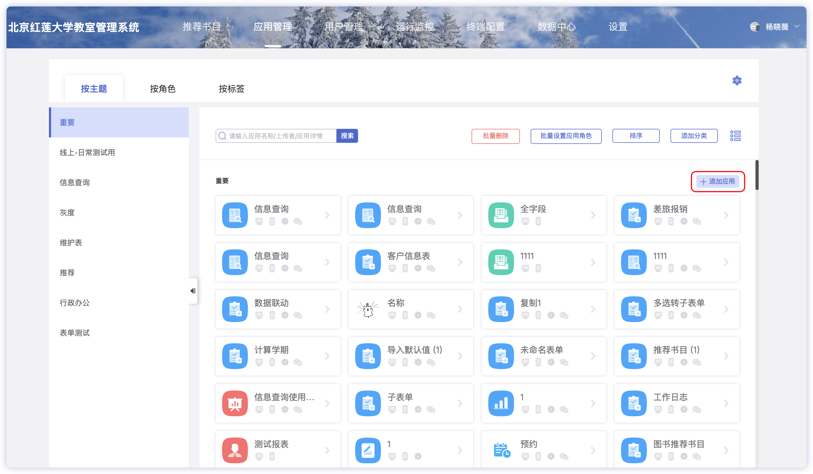

在打开的页面选择“应用引擎”，选择信息查询，进入信息查询应用配置页面

## 二、使用信息查询

### 1. 查询项目列表页

每个查询应用中可以创建多个查询项目，会以列表形式显示在本页面

应用中只存在一个查询项目时，个人信息查询会直接进入查询结果页，自定义查询会直接进入查询条件页

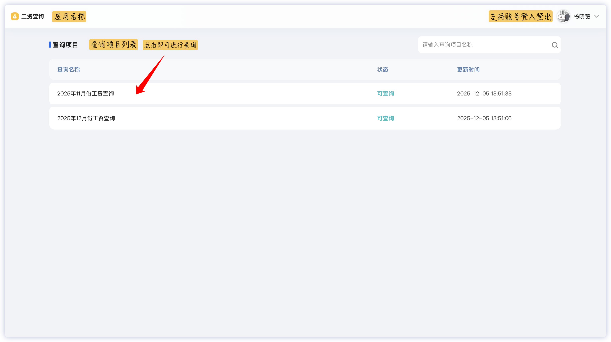

### 2. 查询条件页

当查询方式为自定义查询时会有这个页面，输入条件后即可查到相应结果

### 3. 查询结果页

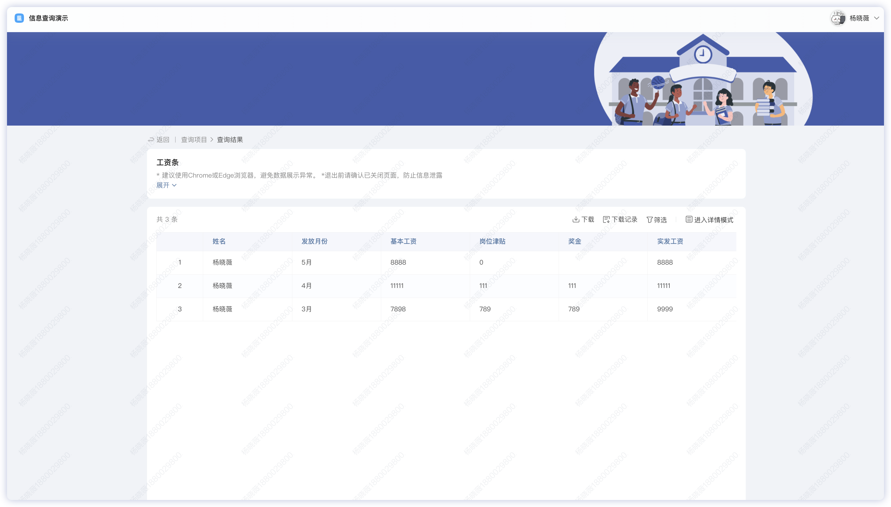

#### 3.1 查询结果的展示

列表页和详情页

查询结果为多条时，默认显示列表页

查询结果为单条时，默认显示详情页

可点击按钮进行页面的切换

列表页

以列表形式展示查询结果

详情页

展示单条结果的数据详情

配置了打印模板时，支持按照打印模板样式显示数据详情

其他

可设置banner图对页面进行美化

可设置备注信息

可设置水印

#### 3.2 查询结果的筛选

点击筛选按钮，支持设置筛选条件对查询结果进行筛选

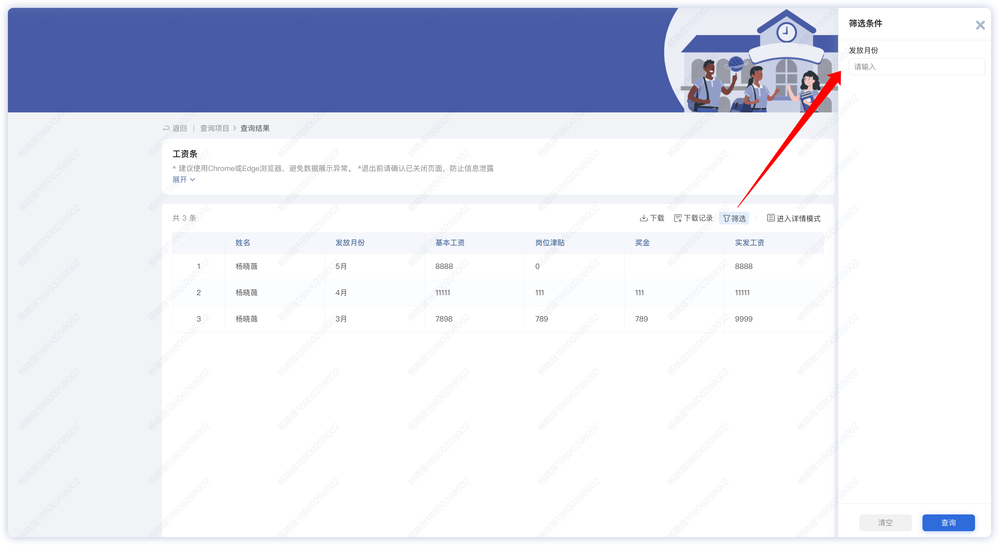

#### 3.3 查询结果的导出

单条下载-【详情页-PC&移动端】支持下载单条数据（配置了打印模板按模板下载，未配置则按系统模板下载）

批量下载-【列表页-PC端】支持以excel形式下载查询结果

⚠️：设置了筛选条件时进行下载，下载结果为筛选后的结果

## 三、创建信息查询

### 1. 基础设置

设置应用基础信息

设置应用名称

设置应用图标（可上传自定义图标）

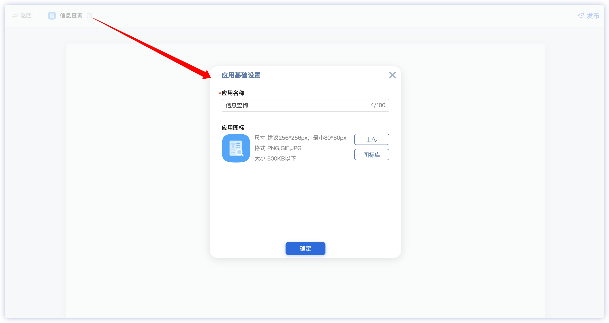

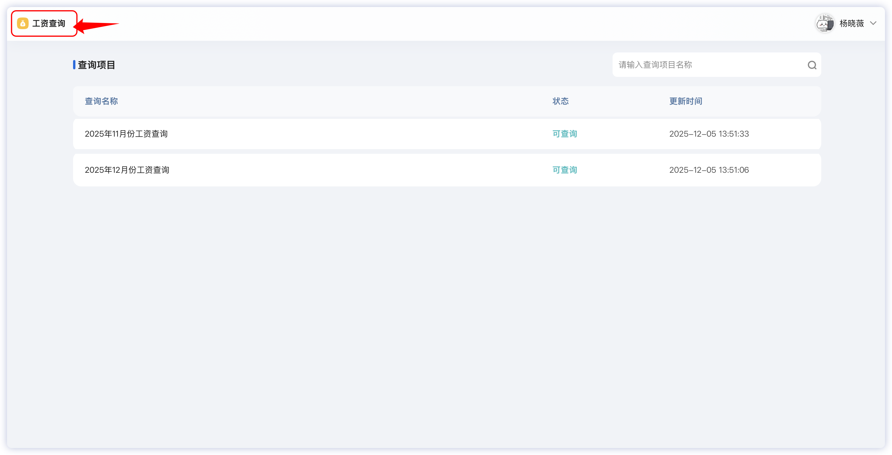

### 2. 创建信息查询项目

新建查询

点击“新建查询”，在弹窗内选择想要的查询方式创建查询项目

创建步骤

个人信息查询有两个创建步骤：1️⃣数据源设置 2️⃣查询结果页设置

自定义查询有三个创建步骤：1️⃣数据源设置 2️⃣查询条件页设置 3️⃣查询结果页设置

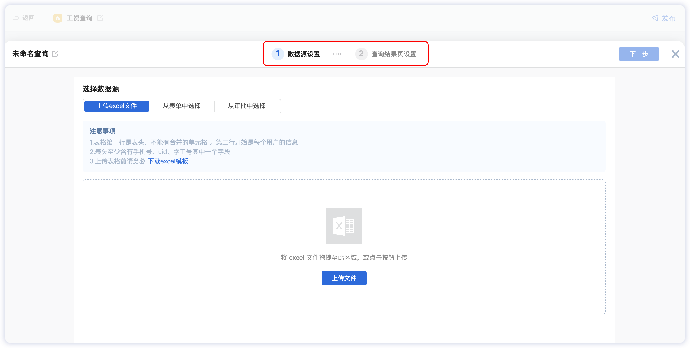

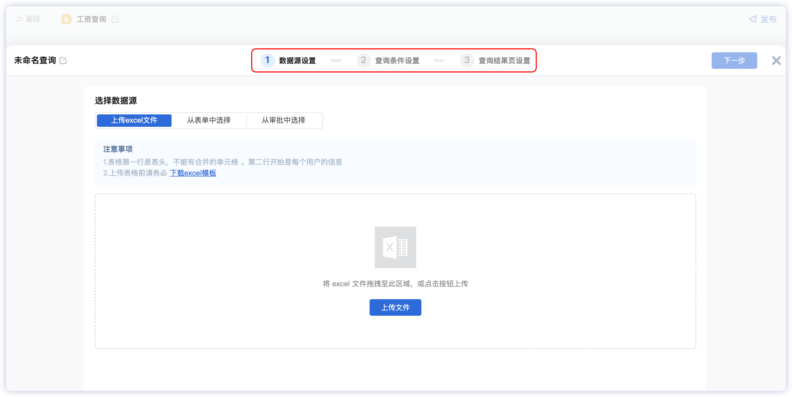

修改查询项目名称-点击编辑按钮即可修改

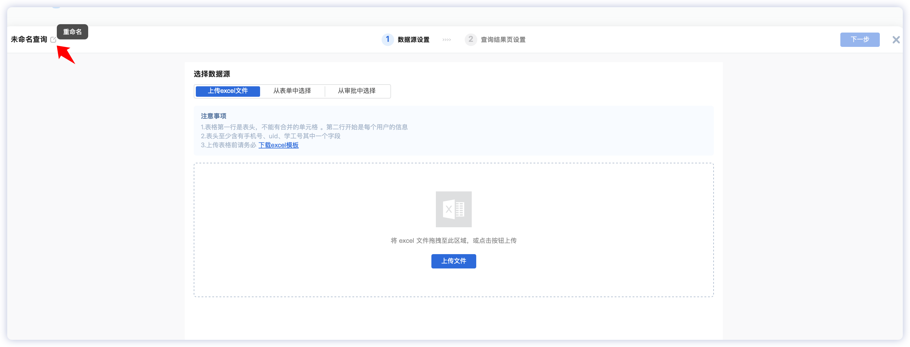

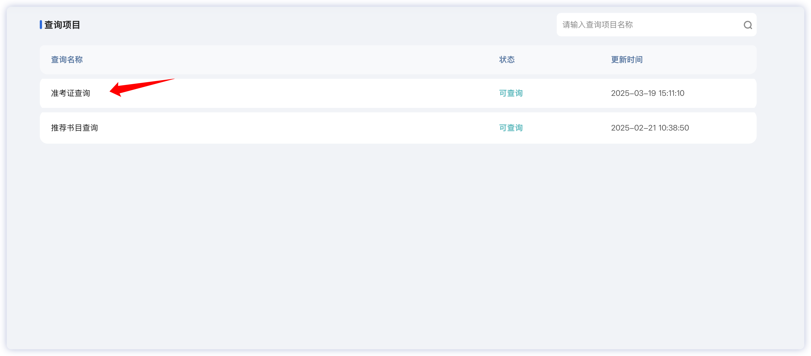

#### 2.1 数据源设置

数据源即信息查询引擎生成查询结果的来源表，分为excel数据源、表单数据源、审批数据源三类

##### 2.1.1 excel数据源

上传文件：点击上传文件按钮即可上传excel文件

上传文件的要求：

表格第一行是表头，不能有合并的单元格 。第二行开始是每个用户的信息

查询方式为“个人信息查询”时，表头至少含有手机号、uid、学工号其中一个字段（用户识别字段）

手机号格式需正确

学工号需属于本单位

excel文件大小的上限是10M

上传文件失败的常见原因：

excel格式不符合上传要求（表头有合并单元格…等）

excel内有字段包含公式，系统无法解析

系统默认读取excel内的第一个sheet，有隐藏sheet且不符合要求时也会上传失败

##### 2.1.2 表单/审批数据源

选择数据源

可以选择本单位表单/审批应用作为数据源

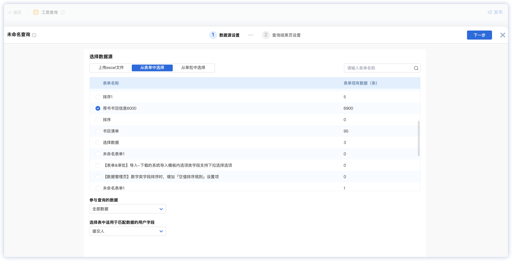

参与查询的数据

支持查询全部数据，也可以对表内数据进行过滤之后，查询满足条件的数据

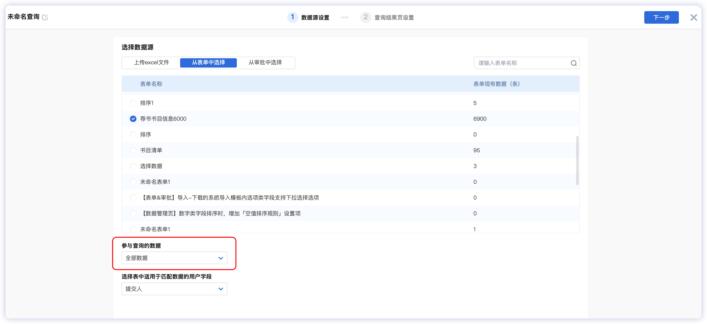

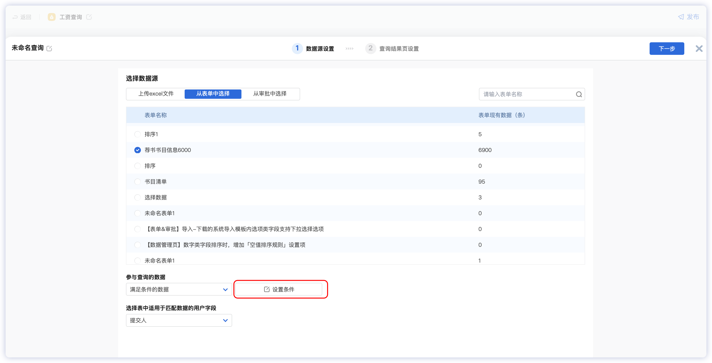

选择表中适用于匹配数据的用户字段

仅个人信息查询需要设置用户识别字段

表单支持设置提交人、所属人、联系人

审批支持设置提交人、审批人、联系人

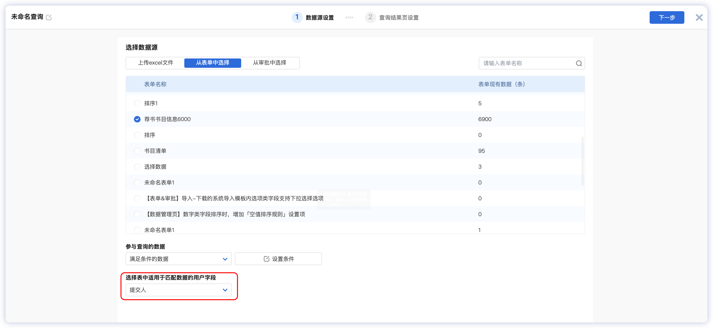

#### 2.2 查询条件设置

仅自定义查询有这一步骤

##### 2.2.1 提示信息

支持自定义查询条件页面提示信息

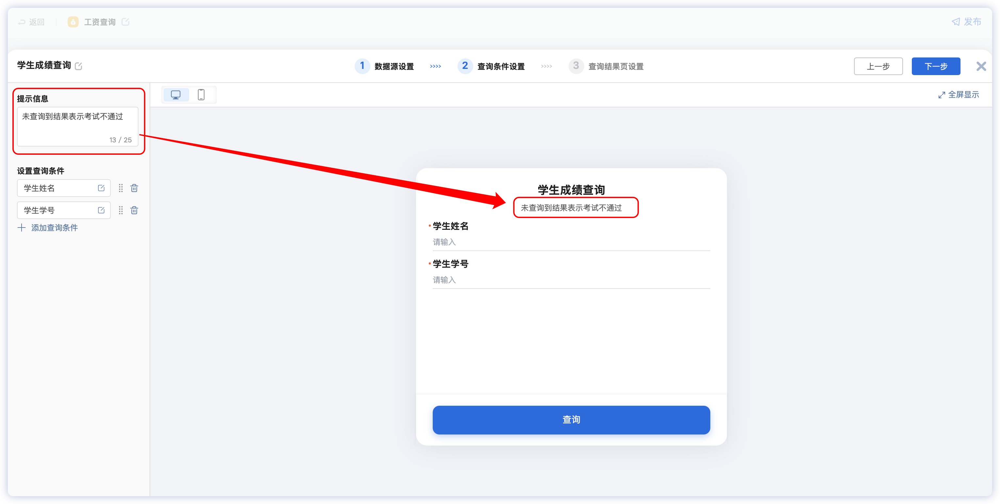

##### 2.2.2 设置查询条件

添加查询条件

点击“添加查询条件”按钮，可在下拉框内勾选需要作为查询条件的字段

查询条件至少添加一个，至多添加十个

拖拽排序按钮可调整查询条件的显示顺序

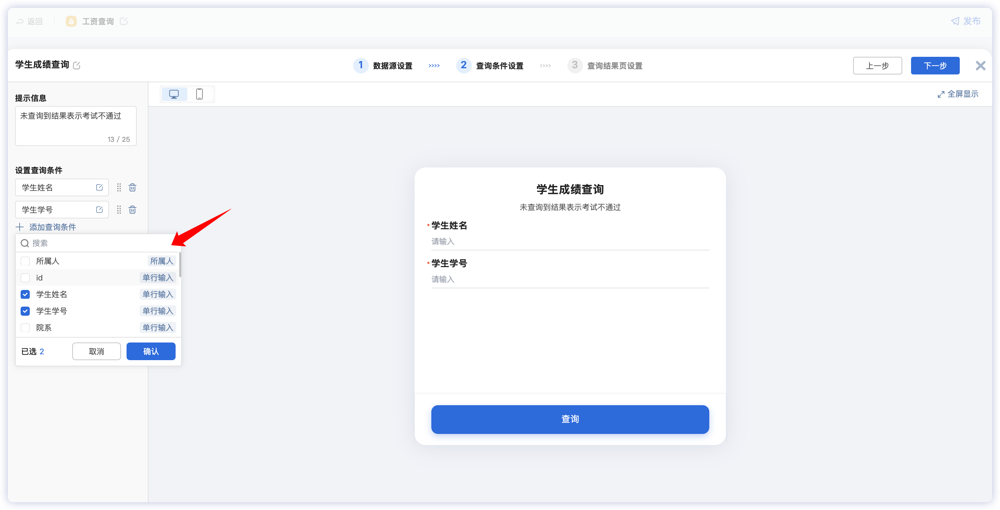

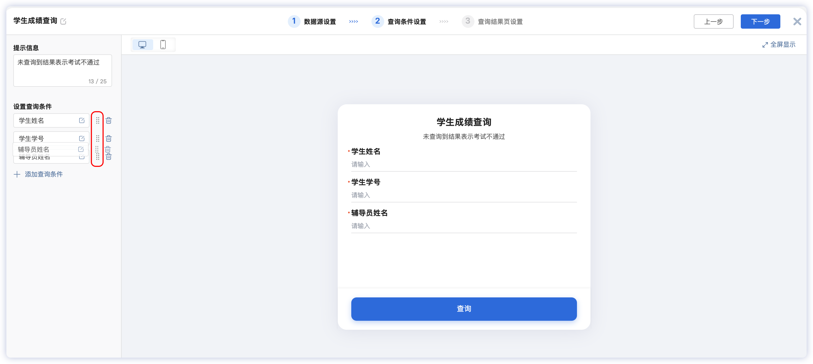

编辑查询条件

查询条件名称：支持修改查询条件字段名称

查询方式：支持按字段类型设置输入、下拉、时间筛选等不同查询方式

逻辑关系：支持按字段类型设置不同的逻辑关系

提示信息：支持设置该查询条件字段处的提示信息

查询条件必填：开启后，此查询条件字段为必填

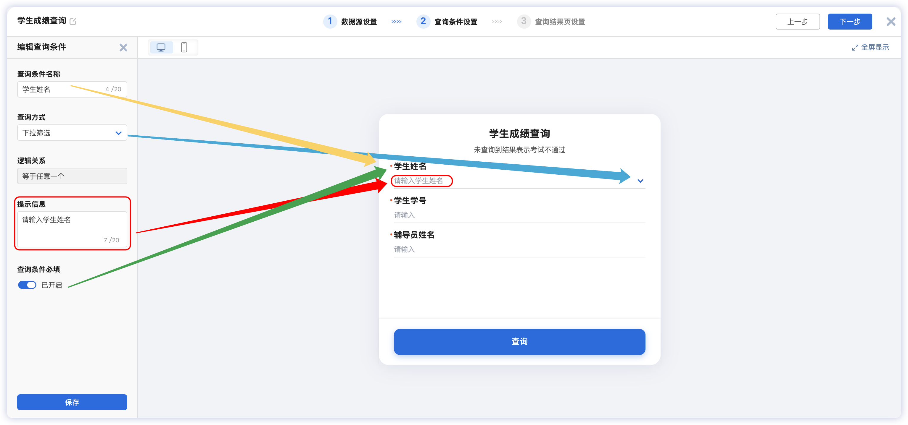

其他说明

可切换PC端/移动端预览页面

支持全屏预览

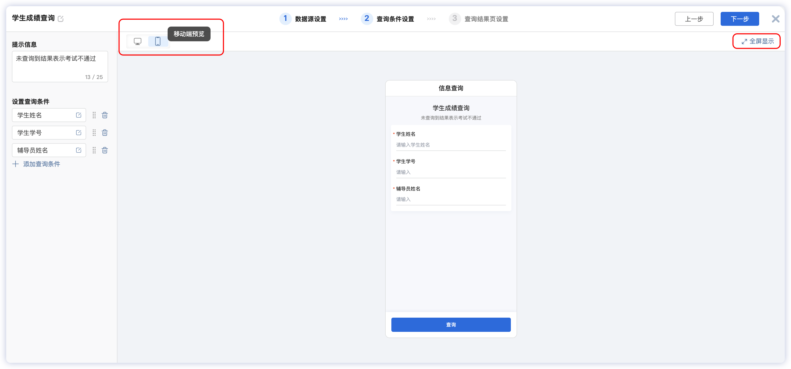

#### 2.3 查询结果页设置

##### 2.3.1 备注信息

支持自定义查询结果页备注信息

支持设置默认展开/默认收起

##### 2.3.2 筛选项

点击“筛选项设置”按钮支持添加筛选字段，可为不同类型的字段设置不同的筛选类型和逻辑关系

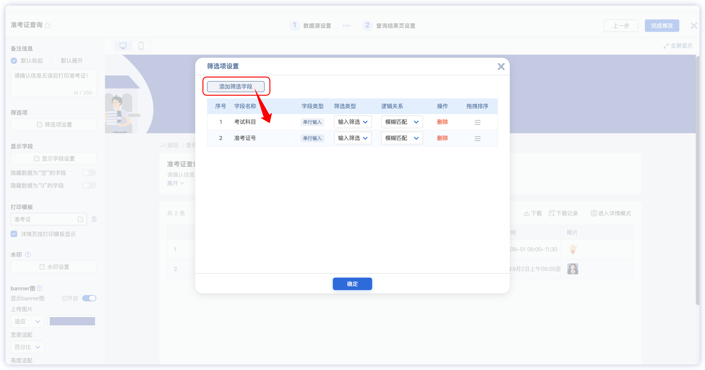

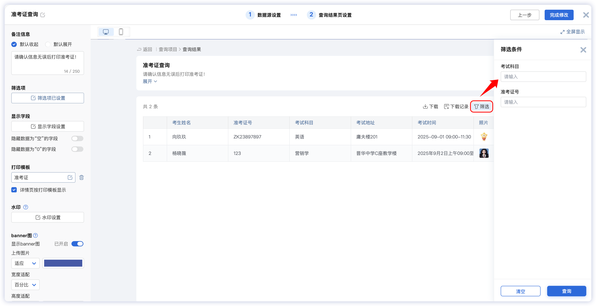

##### 2.3.3 显示字段

- 1.显示字段设置：数据源为表单或审批时，支持设置显示字段

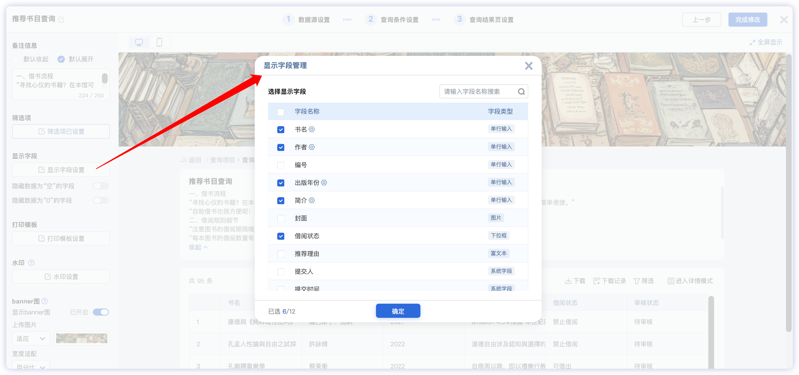

- 2.隐藏数据为“空”的字段：开关开启时，详情页会隐藏字段值为空的字段

- 3.隐藏数据为“0”的字段：开关开启时，详情页会隐藏字段值为0的字段

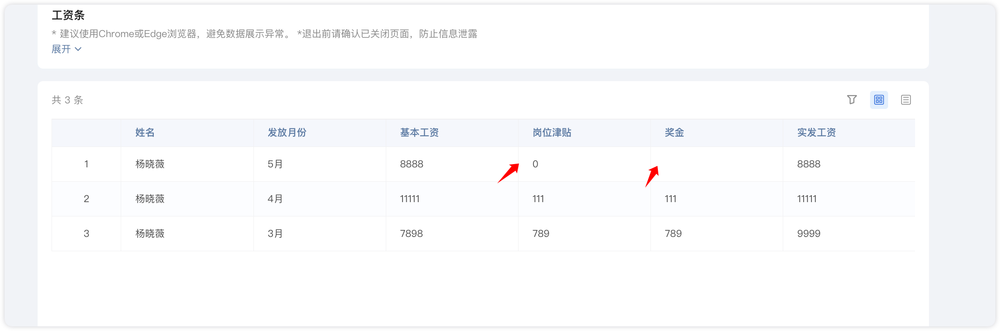

##### 2.3.4 打印模板

支持设置打印模板

设置打印模板后，可在查询结果详情页下载单条数据时按打印模板下载，还支持详情页按打印模板显示

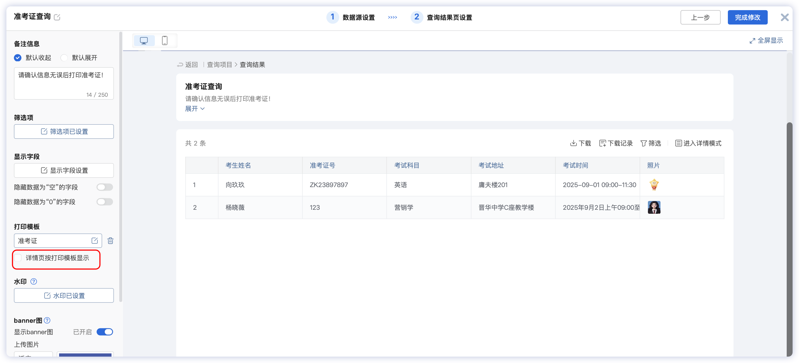

系统详情页

##### 2.3.5 水印

支持为列表页和详情页分别设置水印

水印支持插入动态字段：查询项目名称、当用用户、当前用户uid、当前用户手机号码、查询时间、查询页链接

支持调整水印样式，包括：字体、颜色、字号、角度、间距、透明度

##### 2.3.6 banner图

支持添加banner图美化查询页面

