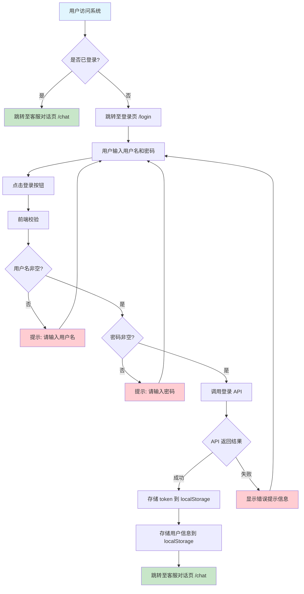
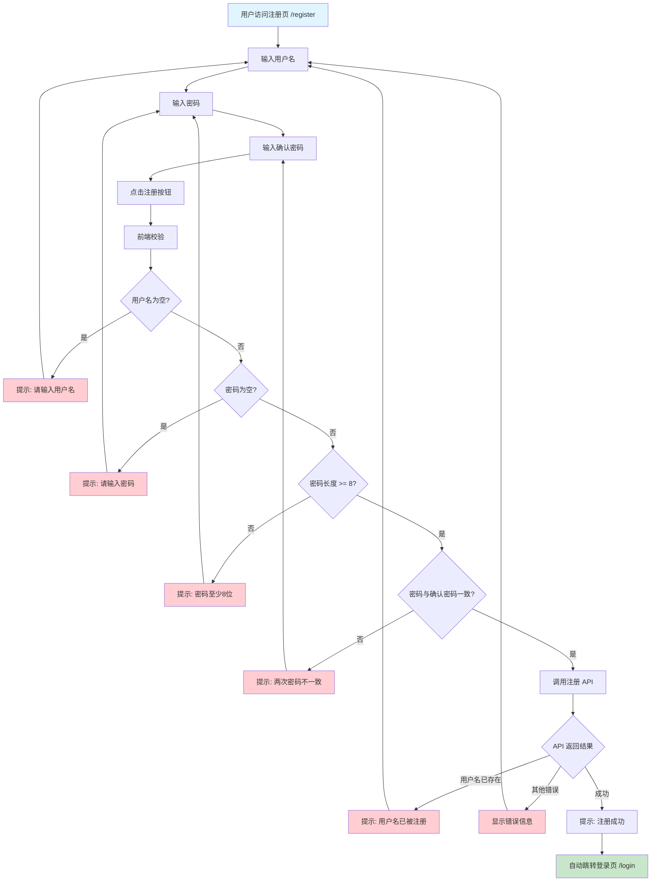
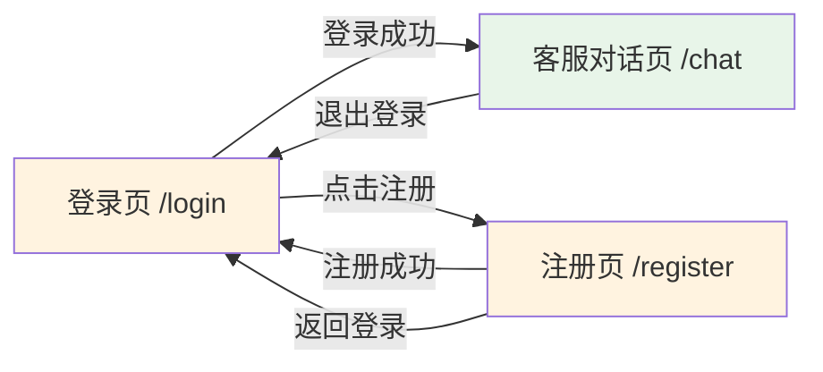

# 01 - 登录及注册页原型设计

> 智能客服系统 — 用户登录 & 注册页面结构原型

---

## 设计稿

| 页面 | 文件 | 预览 |
|------|------|------|
| P1 登录页 | [login.html](../design/design_diagrams/01_登录及注册页/login.html) | 浏览器直接打开即可预览 |
| P2 注册页 | [register.html](../design/design_diagrams/01_登录及注册页/register.html) | 浏览器直接打开即可预览 |

> 设计规范参见：[01_设计规范.md](../design/design_specifications/01_设计规范.md)

---

## 一、涉及页面

| 序号 | 页面名称 | 所属端 | 路由 |
|------|---------|--------|------|
| P1 | 登录页 | 用户前台 | `/login` |
| P2 | 注册页 | 用户前台 | `/register` |

---

## 二、P1 — 登录页原型

```
┌──────────────────────────────────────────────────────┐
│                                                      │
│                                                      │
│                   [①] 系统 Logo / 标题                │
│                   智能客服平台                         │
│                                                      │
│                                                      │
│              ┌──────────────────────┐                │
│              │ [②] 用户名输入框      │                │
│              └──────────────────────┘                │
│                                                      │
│              ┌──────────────────────┐                │
│              │ [③] 密码输入框        │                │
│              └──────────────────────┘                │
│                                                      │
│              ┌──────────────────────┐                │
│              │     [④] 登录按钮      │                │
│              └──────────────────────┘                │
│                                                      │
│                   [⑤] 还没有账号？立即注册             │
│                                                      │
│                                                      │
└──────────────────────────────────────────────────────┘
```

### 区域说明

| 编号 | 区域名称 | 功能说明 |
|------|---------|---------|
| ① | 系统 Logo / 标题 | 展示平台品牌标识，居中显示"智能客服平台"标题与 Logo |
| ② | 用户名输入框 | 用户输入注册时使用的用户名，前端做非空校验 |
| ③ | 密码输入框 | 用户输入密码，type=password 密文显示，支持显示/隐藏切换 |
| ④ | 登录按钮 | 点击后调用登录 API，校验通过后跳转至客服对话页 `/chat` |
| ⑤ | 注册入口 | 链接/按钮，点击跳转至注册页 `/register` |

### 交互逻辑

- 未登录用户访问 `/chat` → 自动重定向到 `/login`
- 登录成功后，后端返回 token + 用户信息，前端存入 localStorage
- 登录失败时，在表单上方显示红色错误提示（如"用户名或密码错误"）

---

## 三、P2 — 注册页原型

```
┌──────────────────────────────────────────────────────┐
│                                                      │
│                                                      │
│                   [①] 系统 Logo / 标题                │
│                   创建新账号                           │
│                                                      │
│                                                      │
│              ┌──────────────────────┐                │
│              │ [②] 用户名输入框      │                │
│              └──────────────────────┘                │
│                                                      │
│              ┌──────────────────────┐                │
│              │ [③] 密码输入框        │                │
│              └──────────────────────┘                │
│                                                      │
│              ┌──────────────────────┐                │
│              │ [④] 确认密码输入框    │                │
│              └──────────────────────┘                │
│                                                      │
│              ┌──────────────────────┐                │
│              │     [⑤] 注册按钮      │                │
│              └──────────────────────┘                │
│                                                      │
│                   [⑥] 已有账号？返回登录               │
│                                                      │
│                                                      │
└──────────────────────────────────────────────────────┘
```

### 区域说明

| 编号 | 区域名称 | 功能说明 |
|------|---------|---------|
| ① | 系统 Logo / 标题 | 展示"创建新账号"标题 |
| ② | 用户名输入框 | 输入用户名，前端校验：非空、长度限制、唯一性需后端校验 |
| ③ | 密码输入框 | 输入密码，type=password，前端校验密码强度（最小8位，含字母+数字） |
| ④ | 确认密码输入框 | 再次输入密码，前端校验与③一致 |
| ⑤ | 注册按钮 | 前端校验通过后调用注册 API，成功后自动跳转登录页并提示"注册成功" |
| ⑥ | 登录入口 | 链接，点击跳转至登录页 `/login` |

### 交互逻辑

- 前端实时校验：密码与确认密码是否一致（不一致时④下方红色提示）
- 用户名失焦时可触发后端唯一性校验（防抖 debounce 300ms）
- 注册成功后 → 跳转 `/login` 并 toast 提示"注册成功，请登录"

---

## 四、登录流程图



---

## 五、注册流程图



---

## 六、页面跳转关系



---

## 七、技术备注

| 项目 | 说明 |
|------|------|
| 前端框架 | 待定（React / Vue） |
| UI 组件库 | 待定（Ant Design / Element Plus / TDesign） |
| 路由守卫 | 需要：未登录用户自动跳转 `/login` |
| Token 存储 | localStorage，每次请求携带在 Authorization Header |
