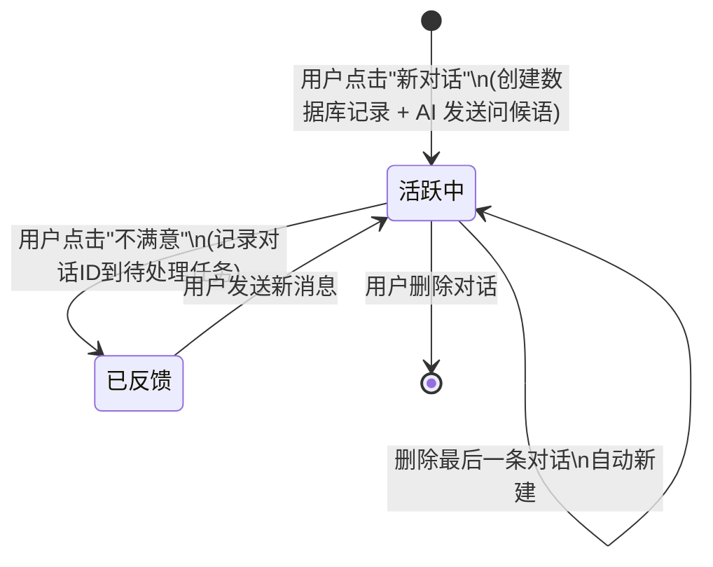
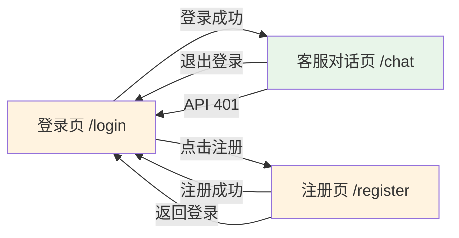

# 02 - 客服对话页原型设计

> 智能客服系统 — 用户前台客服对话页结构原型

---

## 一、涉及页面

| 序号 | 页面名称 | 所属端 | 路由 |
|------|---------|--------|------|
| P3 | 客服对话页 | 用户前台 | `/chat` |

---

## 二、P3 — 客服对话页原型 (核心页面)

```
┌───────────────────────┬──────────────────────────────────────────────────────────────┐
│  [①] 侧边栏 (可拖拽)  │   [③] 对话名称 (可编辑)          [④] 用户名 · 头像 · 退出     │
│        ↕              ├──────────────────────────────────────────────────────────────┤
│ ┌───────────────────┐ │                                                              │
│ │ [①.1] 新对话       │ │                                                              │
│ │   + 新建对话       │ │                                                              │
│ └───────────────────┘ │                                                              │
│                       │              [⑤] 消息列表区域                                  │
│ ┌───────────────────┐ │                                                              │
│ │ [①.2] 搜索对话     │ │  2025-06-02 14:30:25   ← 消息时间戳(北京时间)                  │
│ │ 🔍 按名称搜索..    │ │  ┌──────────────────────────────┐                            │
│ └───────────────────┘ │  │  🤖 您好，我是智能客服小助手，  │  ← AI 消息(左对齐)          │
│                       │  │     有什么可以帮您？           │  Markdown 渲染              │
│ ┌───────────────────┐ │  └──────────────────────────────┘                            │
│ │ [①.3] 对话列表     │ │                                                              │
│ │ (瀑布流,按时间倒序) │ │       2025-06-02 14:31:02                                    │
│ │                   │ │              ┌──────────────────────────┐                     │
│ │ 📌 新对话         │ │              │      我想咨询退款流程 😊   │  ← 用户消息(右对齐)   │
│ │ 最后一条消息摘要.. │ │              └──────────────────────────┘                     │
│ │ 📌 退款咨询       │ │                                                              │
│ │ 最后一条消息摘要.. │ │  2025-06-02 14:31:05                                          │
│ │                   │ │  ┌──────────────────────────────┐                            │
│ │ ... 加载中 ●      │ │  │  🤖 💭 思考中...              │  ← AI 思考过程             │
│ │                   │ │  │  ┌────────────────────────┐  │                            │
│ └───────────────────┘ │  │  │ 正在检索退款政策...     │  │  ← 思考内容(固定高度,可滚) │
│                       │  │  │ 已找到3条相关规则...    │  │                            │
│                       │  │  └────────────────────────┘  │                            │
│                       │  │  ──────────────────────────  │  ← 思考截止分隔线            │
│                       │  │  退款流程如下：1. 进入...     │  ← 最终回复(流式输出)        │
│                       │  │                    🔄 重新生成 │  ← 生成失败时显示             │
│                       │  └──────────────────────────────┘                            │
│                       │                                                              │
│                       │  2025-06-02 14:31:10                                          │
│                       │  ┌──────────────────────────────┐                            │
│                       │  │  🤖 根据我们的政策，您可以在  │  ← 纯回复消息                │
│                       │  │     7天内申请退款...          │                            │
│                       │  └──────────────────────────────┘                            │
│                       ├──────────────────────────────────────────────────────────────┤
│                       │  ┌─────────────────────────────────────────────────────────┐ │
│                       │  │ [⑦] 👎 不满意本次回答？                      (常显按钮)  │ │
│                       │  └─────────────────────────────────────────────────────────┘ │
│                       │  ┌──────────────────────────────────────────┐ ┌───────────┐ │
│                       │  │ [⑥.1] 输入您的问题...                    │ │  [⑥.2]   │ │
│                       │  │  (Enter发送, Shift+Enter换行, IME安全)   │ │ 发送/停止  │ │
│                       │  └──────────────────────────────────────────┘ └───────────┘ │
└───────────────────────┴──────────────────────────────────────────────────────────────┘
```

### 区域说明

| 编号 | 区域名称 | 功能说明 |
|------|---------|---------|
| **①** | **侧边栏** | 左侧导航区域，包含新对话按钮、搜索框、对话列表。右侧边缘支持**左右拖拽**调整宽度，范围 200px ~ 500px。拖拽时自动压缩/扩展聊天区域 |
| ①.1 | 新对话按钮 | 点击后自动创建新对话并进入，AI 自动发送问候语。新对话初始名称为"新对话"，若已存在同名则追加"-1"、"-2"… |
| ①.2 | 搜索对话 | 输入关键词按**对话名称**实时过滤对话列表，支持模糊搜索 |
| ①.3 | 对话列表 | 以**瀑布流形式**展示历史对话列表，按添加时间**倒序排列**（最新在最上）。每条显示标题和**最后一条消息摘要**（参考火山引擎 chat API 中对话摘要字段，超出部分从头部截断，保留尾部内容）。滚动到底部自动加载更多，每次加载 **10 条**。点击可切换对话，切换时显示 **loading** 状态。当前选中对话高亮显示。每条对话支持右键/更多操作中**删除**（当前选中对话不可删除） |
| **③** | **对话名称** | 显示当前对话名称，支持点击编辑（内联编辑，按 Esc 取消），修改后自动保存到数据库 |
| **④** | **用户信息区** | 显示当前登录用户的**用户名**、**头像**（默认头像占位）和**退出登录**按钮 |
| **⑤** | **消息列表区域** | 核心聊天展示区，消息按发送时间从上到下排列。AI 消息支持 **Markdown 渲染**（代码高亮、链接可点击、图片自动预览）。AI 客服消息**左对齐**，用户消息**右对齐**。支持向上滚动加载历史消息（每次 **10 条**，加载时显示 loading），用户向上翻阅历史时，**新消息到来不改变当前滚动位置**。AI 消息可能包含**思考过程区域**和**最终回复区域**两部分。**每条消息气泡上方**显示发送时间，以**北京时间为准**，格式为 `年-月-日 时:分:秒`（如 `2025-06-02 14:30:25`） |
| ⑤.思考 | 思考过程区域 | 在 AI 消息气泡内部上方，展示思考中的动画效果。思考内容（任务触发、任务执行、执行结果等）在固定高度区域内滚动显示。思考截止后出现分隔线，下方开始流式输出最终回复。若大模型无思考过程，则气泡中直接流式输出结果 |
| ⑤.失败 | 生成失败处理 | SSE 连接断开时，气泡内已输出内容保留，并在气泡下方显示「🔄 重新生成」图标按钮，点击后重新调用大模型接口生成内容 |
| **⑥.1** | **文本输入框** | 用户手动输入问题的多行文本框。Enter 发送（Shift+Enter 换行），**中文输入法（IME）选词期间按 Enter 不触发发送**。AI 生成期间输入框**不可输入**（置灰），也不可发送新消息 |
| **⑥.2** | **发送/停止按钮** | 默认状态为"发送"按钮，点击后发送消息。大模型生成过程中变为"停止"按钮，点击可终止大模型生成 |
| **⑦** | **不满意反馈** | **常显按钮**，文本"👎 不满意本次回答？"。反馈**颗粒度**为整个会话维度。点击后仅记录**对话 ID** 到待处理任务。重复点击时提示："当前对话已反馈管理员，请勿重复点击～" |

---

## 三、交互逻辑

### 3.1 新对话

1. 用户点击 ①.1「新对话」按钮
2. 系统自动创建新对话任务，对话初始名称为 **"新对话"**
3. 若当前用户已有名为"新对话"的对话，则依次命名为 `新对话-1`、`新对话-2`…（名称去重）
4. 页面自动切换到该新对话
5. AI 机器人自动发送一条**问候语**（如"您好，我是智能客服小助手，有什么可以帮您？"）
6. 对话立即持久化到数据库（不再是临时会话）

### 3.2 修改对话名称

1. 用户点击顶部 ③ 对话名称区域
2. 进入内联编辑模式（input 框）
3. 用户修改名称后按 Enter 或失焦确认；按 Esc 取消编辑，恢复原名称
4. 新名称实时保存到数据库，对话列表同步更新
5. 若新名称为空，恢复原名称

### 3.3 发送消息

1. 用户在 ⑥.1 输入框中手动输入文字
2. 点击 ⑥.2「发送」按钮（或按 Enter 键）
3. 用户消息立即出现在消息列表中（**右对齐**气泡），气泡上方显示北京时间戳
4. 输入框**清空并置灰**（不可输入），⑥.2 按钮切换为「停止」按钮
5. 调用大模型 API，开始流式返回
6. **AI 回复期间不支持发送新消息**，用户只能通过停止按钮终止或等待输出完毕
7. 若网络请求失败/超时，消息列表中新增一条 AI 消息气泡，内容为："**当前网络似乎不太稳定，请稍后重试～**"

### 3.4 大模型流式生成（思考过程 + 最终回复）

1. 大模型开始生成后，消息列表中新增一条 **AI 消息气泡**（左对齐），气泡上方显示北京时间戳
2. 气泡内先显示**思考中动效**（如闪烁的 💭 图标或加载动画）
3. 大模型返回的 **思考过程**（包括任务触发、任务执行、任务执行结果等）在气泡内**固定高度区域**（如 max-height: 200px）中流式渲染，内容溢出时区域内滚动显示
4. 思考过程结束后，出现一条**分隔线**表示思考截止
5. 分隔线下方开始流式输出**最终回复内容**，逐字/逐 token 渲染
6. 最终回复输出完毕后，⑥.2 按钮恢复为「发送」按钮，输入框恢复可用
7. **若大模型无思考过程直接返回答案**，则消息气泡中跳过思考区域，直接流式输出结果

> **重要区分**：思考过程（任务触发、执行步骤、中间结果）与最终回复（给用户看的答案）在 UI 上有明确视觉分隔，用户能清晰辨别哪些是思考、哪些是最终答案。

### 3.5 停止生成

1. 大模型生成过程中，⑥.2 显示为「停止」按钮，输入框置灰
2. 用户点击「停止」按钮
3. 前端中断 SSE 连接（`AbortController.abort()`），大模型停止生成
4. 已生成的内容保留在消息气泡中（包括已输出的思考过程和部分最终回复）
5. ⑥.2 按钮恢复为「发送」按钮，输入框恢复可用
6. 输入框内容保留（若用户在生成期间预输入，停止后内容不清空），点击发送可继续对话
7. **停止后，已输出的部分思考/回复内容不写入数据库**（不持久化）

### 3.6 SSE 连接断开处理

1. 大模型流式生成过程中 SSE 连接意外断开
2. 气泡内已输出的内容保留
3. 气泡下方显示「🔄 重新生成」图标按钮
4. 用户点击「重新生成」后，重新调用大模型接口，在原气泡位置重新生成完整回复（覆盖旧内容）
5. 重新生成过程中，「重新生成」按钮隐藏

### 3.7 切换对话

1. 点击 ①.3 中任意对话项
2. 该对话高亮为当前选中状态
3. 右侧消息区域显示 **loading** 状态
4. 加载该对话的历史消息（每次 10 条，滚动向上加载更多）
5. 顶部 ③ 更新为对应对话名称
6. 输入框清空并恢复可用，准备接收新消息

### 3.8 搜索对话

1. 在 ①.2 输入框中输入关键词
2. 按**对话名称**进行实时模糊匹配过滤
3. ①.3 对话列表仅显示匹配的对话项
4. 清空搜索框后恢复完整对话列表

### 3.9 删除对话

1. 用户在 ①.3 对话列表中，对某条对话执行删除操作（右键菜单或悬停出现的删除图标）
2. **当前选中对话不可删除**（删除按钮置灰或隐藏）
3. 点击删除后弹出确认提示："确定要删除该对话吗？删除后不可恢复。"
4. 确认后：
   - 数据库中该对话及关联消息**同步删除**
   - 前端对话列表中该对话**立即消失**
   - 若删除的是其他对话，当前选中对话保持不变
5. 若用户尝试删除当前对话，删除操作被阻止
6. **当删除最后一条对话时**，系统自动新建一个新对话（执行 3.1 新对话流程），保证页面始终有一个活跃对话

### 3.10 不满意反馈

1. 「👎 不满意本次回答？」按钮**常显**在输入框上方
2. 反馈**颗粒度**为整个会话维度
3. 点击按钮后仅记录**对话 ID**，后端将该对话标记为"待处理"并记录到待处理任务队列
4. 页面弹出提示：**"当前对话已反馈管理员，请勿重复点击～"**
5. 管理员后台根据对话 ID 加载对应对话内容，用于更新 context、优化回答质量
6. **重复点击时**再次弹出相同提示，不重复记录

### 3.11 退出登录

1. 点击 ④ 中的「退出登录」按钮
2. 弹出确认弹窗
3. 确认后清除 token，前端状态重置
4. 跳转 `/login`

### 3.12 Token 过期处理

1. API 请求返回 **401** 状态码时，前端清除 token
2. 跳转登录页 `/login`
3. 无需弹窗提示，直接跳转

---

## 四、会话存储策略

| 会话类型 | 存储位置 | 生命周期 | 说明 |
|---------|---------|---------|------|
| 持久会话 | 后端数据库 | 永久保存 | 用户点击"新对话"即创建数据库记录，AI 问候语作为首条消息一并入库。对话名称、消息记录、反馈状态均持久化存储。**停止生成的部分内容不入库** |

> **变更说明**：不再区分"临时会话"和"永久会话"。用户点击新对话时直接创建数据库记录，避免前端 sessionStorage 状态管理复杂度。

---

## 五、会话生命周期



---

## 六、页面跳转关系



---

## 七、加载状态规范

| 触发场景 | 加载态表现 |
|---------|-----------|
| 切换对话加载历史消息 | 消息列表区域显示居中 loading 动画（如 Spin/Spinner），加载完成后平滑过渡到消息列表 |
| 对话列表瀑布流加载更多 | 列表底部显示「加载中…」或 loading 动画，加载完成后追加新条目 |
| 消息历史向上滚动加载 | 消息列表顶部显示 loading 指示器，加载完成后向上追加历史消息，**不改变当前滚动位置** |
| 新对话创建 + AI 问候语 | 消息列表短暂显示 loading（等待问候语入库），随后显示问候语气泡 |

---

## 八、侧边栏拖拽规范

| 属性 | 取值 |
|------|------|
| 默认宽度 | 260px |
| 最小宽度（下限） | 200px |
| 最大宽度（上限） | 500px |
| 拖拽触发区域 | 侧边栏右侧边缘 4px 区域内 |
| 拖拽光标样式 | `col-resize` |
| 聊天区最小宽度 | 400px（侧边栏拖拽到最大时，聊天区不得小于此值） |
| 移动端适配 | 暂不做 |

---

## 九、消息列表滚动行为

| 场景 | 行为 |
|------|------|
| 新消息到来 / AI 流式输出时，用户处于消息列表**底部** | 自动滚动到底部，跟随最新内容 |
| 新消息到来 / AI 流式输出时，用户**向上翻阅**了历史消息 | **不改变当前滚动位置**，保持用户阅读位置不动 |
| 用户重新滚动回底部 | 恢复自动跟随行为 |
| 切换对话加载完成 | 滚动到对话底部（最新消息） |

---

## 十、技术备注

| 项目 | 说明 |
|------|------|
| 前端框架 | 待定（React / Vue） |
| UI 组件库 | 待定（Ant Design / Element Plus / TDesign） |
| 状态管理 | 待定 |
| 会话存储 | 后端 MySQL/PostgreSQL，点击新对话即入库。停止生成的 partial 内容不入库 |
| 消息流式渲染 | AI 回复支持 SSE (Server-Sent Events) 流式输出 |
| 思考过程渲染 | SSE 需区分思考过程和最终回复两类事件（如 `event: thinking` 和 `event: message`），前端分别渲染到对应区域 |
| 无思考过程 | 若 SSE 无 `thinking` 事件，直接以 `message` 事件流式渲染到气泡中 |
| 停止生成 | 前端通过 `AbortController.abort()` 中断 SSE 连接；停止后 partial 内容不入库 |
| SSE 断连处理 | 监听 `EventSource.onerror`，断连后保留已输出内容并显示「重新生成」按钮，点击重新发起请求 |
| 对话名称去重 | 前端/后端在创建对话时检查用户已有对话名称，自动追加序号 |
| 删除对话 | 软删除或硬删除待定；需同时删除对话记录和关联消息记录；当前选中对话不允许删除；删除最后一条时自动新建 |
| 对话列表分页 | 瀑布流形式，按添加时间倒序，每次加载 10 条 |
| 消息历史分页 | 每次滚动加载 10 条 |
| 对话摘要截断 | 对话列表中"最后一条消息摘要"参考火山引擎 chat API 的 summary 字段，超出指定宽度时从**头部**截断，保留尾部内容 |
| AI 上下文传递 | 参考火山引擎 chat API 规范，将对话历史中的 `messages` 数组（含 `role` 和 `content`）作为请求参数传入大模型接口，实现多轮对话上下文 |
| Markdown 渲染 | AI 回复消息气泡需支持 Markdown 渲染，包括：代码块高亮、超链接可点击、图片自动预览 |
| 消息时间戳 | 每条消息气泡上方显示北京时间，格式 `YYYY-MM-DD HH:mm:ss` |
| 不满意反馈 | 按钮常显，反馈颗粒度为**整个会话**，仅记录对话 ID；重复点击提示"勿重复点击"不重复入库；后端按对话 ID 加载待处理任务 |
| Token 过期 | API 返回 401 时前端直接跳转 `/login`，清除 token |
| 多标签页同步 | 不实时推送同步；用户刷新页面或打开对应对话时，从数据库加载最新数据 |
| 输入框 | Enter 发送，Shift+Enter 换行；需处理 IME composition 状态（`compositionstart`/`compositionend`），中文输入法选词期间 Enter 不触发发送 |
| AI 生成期间 | 输入框置灰不可输入，发送按钮变为停止按钮；不支持连续发消息 |
| 停止后行为 | 输入框内容保留不清空，按钮恢复发送，可继续对话 |
| 网络错误 | 超时/网络错误时自动显示 AI 气泡："当前网络似乎不太稳定，请稍后重试～" |
| 侧边栏拖拽 | 右侧边缘可拖拽，宽度范围 200px~500px，聊天区最小宽度 400px；暂不做移动端适配 |
