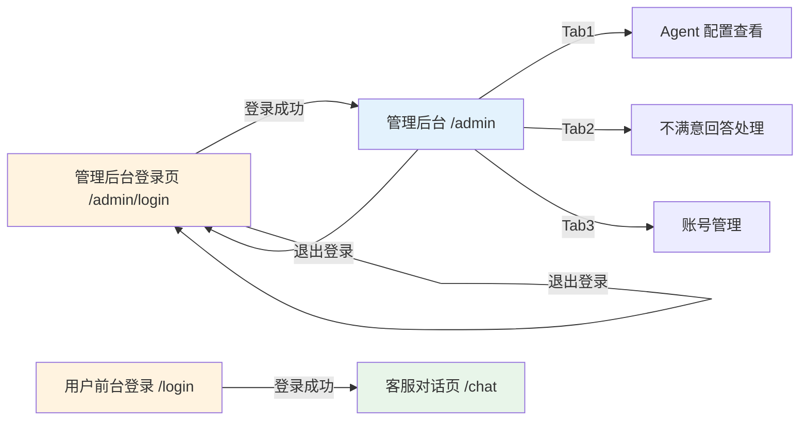

# 03 - 管理员后台页原型设计

> 智能客服系统 — 管理员后台页面结构原型（含 Agent 配置查看、不满意回答处理、账号管理）

---

## 设计稿

| 页面 | 文件 | 预览 |
|------|------|------|
| P4 管理员登录页 | [admin_login.html](../design/design_diagrams/03_管理员后台页/admin_login.html) | 浏览器直接打开即可预览 |
| P5 管理员后台页 | [admin_dashboard.html](../design/design_diagrams/03_管理员后台页/admin_dashboard.html) | 浏览器直接打开即可预览 |

> 设计规范参见：[01_设计规范.md](../design/design_specifications/01_设计规范.md)

---

## 一、涉及页面

| 序号 | 页面名称 | 所属端 | 路由 |
|------|---------|--------|------|
| P4 | 管理员登录页 | 管理端 | `/admin/login` |
| P5 | 管理员后台 | 管理端 | `/admin` |

---

## 二、数据库设计

> 后端使用 **SQLite**，数据库文件路径 `backend/data/app.db`。以下为相关表结构及本次需要改造的内容。

### 2.1 `users` 表（已有，需改造）

当前表结构（[auth_service.py](file:///Users/joec/Joec‘s%20code/P7_lowcode_customer_service/backend/services/auth_service.py#L26)）：

```sql
CREATE TABLE IF NOT EXISTS users (
    id          INTEGER PRIMARY KEY AUTOINCREMENT,
    username    TEXT    NOT NULL UNIQUE,
    password    TEXT    NOT NULL,
    role        TEXT    DEFAULT 'user',
    avatar      TEXT    DEFAULT '',
    created_at  REAL    NOT NULL,
    updated_at  REAL    NOT NULL
);
```

**本次需新增字段**（ALTER TABLE 幂等执行）：

| 新增字段 | 类型 | 默认值 | 说明 |
|---------|------|--------|------|
| `can_chat` | INTEGER | 1 | 前台使用权限：1=可登录 `/chat` 客服对话页，0=不可 |
| `can_admin` | INTEGER | 0 | 后台管理权限：1=可登录 `/admin` 管理后台，0=不可 |

迁移 SQL：

```sql
ALTER TABLE users ADD COLUMN can_chat INTEGER DEFAULT 1;
ALTER TABLE users ADD COLUMN can_admin INTEGER DEFAULT 0;
-- 初始 admin 账号赋予双权限
UPDATE users SET can_admin = 1 WHERE username = 'admin';
```

### 2.2 `sessions` 表（已有）

```sql
CREATE TABLE IF NOT EXISTS sessions (
    id          TEXT PRIMARY KEY,
    title       TEXT DEFAULT '',
    user_id     INTEGER,
    status      TEXT DEFAULT 'active',
    deleted_at  REAL,
    created_at  REAL NOT NULL,
    updated_at  REAL NOT NULL,
    FOREIGN KEY (user_id) REFERENCES users(id)
);
```

### 2.3 `messages` 表（已有）

```sql
CREATE TABLE IF NOT EXISTS messages (
    id                 INTEGER PRIMARY KEY AUTOINCREMENT,
    session_id         TEXT    NOT NULL,
    role               TEXT    NOT NULL,
    content            TEXT    NOT NULL,
    reasoning_content  TEXT    DEFAULT '',
    created_at         REAL    NOT NULL,
    FOREIGN KEY (session_id) REFERENCES sessions(id)
);
```

### 2.4 `feedback` 表（已有）

```sql
CREATE TABLE IF NOT EXISTS feedback (
    id          INTEGER PRIMARY KEY AUTOINCREMENT,
    session_id  TEXT    NOT NULL,
    user_id     INTEGER NOT NULL,
    created_at  REAL    NOT NULL,
    status      TEXT    DEFAULT 'pending',
    FOREIGN KEY (session_id) REFERENCES sessions(id),
    FOREIGN KEY (user_id) REFERENCES users(id)
);
```

唯一约束：`UNIQUE(user_id, session_id)`（同一用户对同一对话只能反馈一次）

`status` 枚举：
| 值 | 说明 |
|----|------|
| `pending` | 待处理（用户刚提交不满意反馈） |
| `resolved` | 已处理（管理员已改写并保存至 FAQ） |

---

## 三、P4 — 管理员登录页原型

> 复用用户前台登录页 UI 设计，但需在标题文字上有明确区分。

```
┌──────────────────────────────────────────────────────┐
│                                                      │
│                                                      │
│                   [①] 系统 Logo / 标题                │
│               低代码平台智能客服管理后台                │
│                                                      │
│                                                      │
│              ┌──────────────────────┐                │
│              │ [②] 用户名输入框      │                │
│              └──────────────────────┘                │
│                                                      │
│              ┌──────────────────────┐                │
│              │ [③] 密码输入框        │                │
│              └──────────────────────┘                │
│                                                      │
│              ┌──────────────────────┐                │
│              │     [④] 登录按钮      │                │
│              └──────────────────────┘                │
│                                                      │
│              ⚠ 管理后台不支持自主注册                   │
│                                                      │
│                                                      │
└──────────────────────────────────────────────────────┘
```

### 区域说明

| 编号 | 区域名称 | 功能说明 |
|------|---------|---------|
| ① | 系统 Logo / 标题 | 展示平台品牌标识，居中显示"低代码平台智能客服管理后台"标题与 Logo，与用户前台登录页标题"智能客服平台"做区分 |
| ② | 用户名输入框 | 输入管理员用户名，前端做非空校验 |
| ③ | 密码输入框 | 输入密码，type=password 密文显示，支持显示/隐藏切换 |
| ④ | 登录按钮 | 点击后调用管理端登录 API，校验通过后跳转至管理后台 `/admin` |

### 交互逻辑

- 管理员登录页**不支持注册**入口，页面底部仅显示提示文案"管理后台不支持自主注册，请联系超级管理员"
- 未登录管理员访问 `/admin` → 自动重定向到 `/admin/login`
- 非管理员账号（`can_admin = 0` 的用户）即使登录成功也跳转回 `/admin/login` 并提示"无管理权限"
- 登录成功后，后端返回 token + 管理员信息，前端存入 localStorage（与用户前台 token 做 key 区分，如 `admin_token`）
- 登录失败时，在表单上方显示红色错误提示

### 初始管理员账号

| 用户名 | 密码 | 说明 |
|--------|------|------|
| admin | 123456 | 初始超级管理员，`can_chat = 1`，`can_admin = 1`，首次登录后建议修改密码 |

---

## 四、P5 — 管理员后台原型（整体布局）

```
┌────────────────────┬──────────────────────────────────────────────────────────┐
│   [①] 侧边导航栏   │  [③] 低代码平台智能客服管理后台           [④] 头像 · 姓名 · 退出 │
│                    ├──────────────────────────────────────────────────────────┤
│ ┌────────────────┐ │                                                          │
│ │ 📂 Agent 配置   │ │                                                          │
│ └────────────────┘ │                                                          │
│ ┌────────────────┐ │              [⑤] 内容区域                                 │
│ │ 💬 不满意回答    │ │                                                          │
│ └────────────────┘ │     ┌──────────────────────────────────────────────────┐ │
│ ┌────────────────┐ │     │                                                  │ │
│ │ 👥 账号管理     │ │     │        (根据左侧导航切换不同子页面内容)             │ │
│ └────────────────┘ │     │                                                  │ │
│                    │     │                                                  │ │
│                    │     └──────────────────────────────────────────────────┘ │
│                    │                                                          │
│                    │                                                          │
└────────────────────┴──────────────────────────────────────────────────────────┘
```

### 区域说明

| 编号 | 区域名称 | 功能说明 |
|------|---------|---------|
| **①** | **侧边导航栏** | 左侧功能菜单，宽度约 220px，包含三个 Tab：Agent 配置、不满意回答、账号管理。高亮当前选中项，点击切换右侧内容区域 |
| ③ | 顶部栏 | 左端固定显示"低代码平台智能客服管理后台"；右端显示当前管理员头像（默认头像占位）、姓名、退出登录按钮 |
| ④ | 管理员信息区 | 显示头像 + 姓名 + 退出登录按钮，点击退出登录后清除 admin_token，跳转 `/admin/login` |
| **⑤** | **内容区域** | 主内容区，根据左侧导航切换渲染三个子页面 |

---

## 五、子页面原型 — Agent 配置（侧边栏 Tab 1）

> 以文件管理器形式展示整个 `agent_config/` 目录（含 `skills/`、`agent.md` 等）下的全部文件结构，仅可查看 `.md` 文件，其他格式文件置灰不可点击。

```
┌──────────────────────────────────────────────────────────────────────────────┐
│  📂 Agent 配置                                                               │
├──────────────────────────────────────────────────────────────────────────────┤
│                                                                              │
│  ┌───────────────────────┐  ┌──────────────────────────────────────────────┐ │
│  │  [⑥.1] 文件树          │  │  [⑥.2] 文件内容预览区                         │ │
│  │                       │  │                                              │ │
│  │  📁 agent_config/     │  │  ┌────────────────────────────────────────┐  │ │
│  │  ├─ 📁 context        │  │  │                                        │  │ │
│  │  │  ├─ 📁 faq         │  │  │   (点击左侧 .md 文件后，在此区域右侧    │  │ │
│  │  │  │  └─ 📄 general_faq.md  │   展开渲染 Markdown 内容)              │  │ │
│  │  │  ├─ 📄 index.md    │  │  │                                        │  │ │
│  │  │  ├─ 📁 product_docs│  │  │                                        │  │ │
│  │  │  │  ├─ 📄 data_factory_guide.md│                                        │  │ │
│  │  │  │  ├─ 📄 form_usage_guide.md  │                                        │  │ │
│  │  │  │  ├─ ...         │  │  │                                        │  │ │
│  │  │  ├─ 📁 temporary   │  │  └────────────────────────────────────────┘  │ │
│  │  │  │  └─ 📄 temp_notes.md│                                              │ │
│  │  │  └─ 📁 logic       │  │                                              │ │
│  │  │     └─ 📄 business_logic.md│                                         │ │
│  │  ├─ 📁 skills         │  │                                              │ │
│  │  │  ├─ 📄 build_business_system.md│                                     │ │
│  │  │  ├─ ...            │  │                                              │ │
│  │  │  └─ 📁 knowledge_retrieval│                                          │ │
│  │  │     └─ 📄 ...      │  │                                              │ │
│  │  └─ 📄 agent.md       │  │                                              │ │
│  │                       │  │                                              │ │
│  └───────────────────────┘  └──────────────────────────────────────────────┘ │
│                                                                              │
└──────────────────────────────────────────────────────────────────────────────┘
```

### 区域说明

| 编号 | 区域名称 | 功能说明 |
|------|---------|---------|
| ⑥.1 | 文件树 | 以树形结构展示整个 `agent_config/` 目录（含 `skills/`、`agent.md` 等）下全部文件与子文件夹。目录默认展开第一层，支持点击展开/折叠子目录。仅 `.md` 文件为可点击状态（正常文字颜色），非 `.md` 文件（图片 `.png/.gif`、`.faiss/` 目录、`chunk_meta.json` 等）置灰显示，鼠标悬浮显示 tooltip"不支持预览"。文件树宽度固定约 300px，内容过长时可纵向滚动 |
| ⑥.2 | 文件内容预览区 | 点击左侧 `.md` 文件后，右侧区域渲染该文件的 Markdown 内容。内容为**只读模式**，不可编辑。顶部显示当前文件名作为标题。若未选中任何文件，显示占位提示"请在左侧选择文件进行预览" |

### 交互逻辑

- 文件树数据由后端读取 `agent_config/` 目录结构并返回 JSON 树形数据
- 仅 `.md` 文件可点击查看，点击后请求后端读取文件内容，返回 Markdown 原文，前端渲染
- 非 `.md` 文件（图片 `.png/.gif`、`.faiss/` 目录、`chunk_meta.json` 等）置灰且不可点击
- 支持文件树节点的展开/折叠，初始默认展开第一层目录
- 预览区文件名标题显示文件相对路径，如 `agent_config/context/faq/general_faq.md`
- 内容区所有内容**只读**，无编辑按钮

---

## 六、子页面原型 — 不满意回答（侧边栏 Tab 2）

> 展示用户点击"不满意"反馈的对话，管理员可查看完整对话内容并手动改写回复，改写后的 Q&A 自动存入 FAQ 知识库并同步向量索引。

### 6.1 整体布局

```
┌──────────────────────────────────────────────────────────────────────────────┐
│  💬 不满意回答                                    筛选：[全部 ▾]             │
├──────────────────────────────────────────────────────────────────────────────┤
│                                                                              │
│  ┌────────────────────────────────┐  ┌─────────────────────────────────────┐ │
│  │  [⑦.1] 不满意对话列表（按日期分组）│  │  [⑦.2] 对话详情 & 改写区            │ │
│  │                                │  │                                     │ │
│  │  📅 2025-06-07                 │  │  ┌─────────────────────────────────┐│ │
│  │  ├─ 用户A · 退款问题咨询·已处理 │  │  │  用户: 我想咨询退款流程 😊        ││ │
│  │  │  14:30 · 3条消息            │  │  │  AI: 您好，退款流程如下...       ││ │
│  │  ├─ 用户B · 订单查询 · 待处理   │  │  │  用户: 我还是不太明白             ││ │
│  │  │  11:20 · 5条消息            │  │  │  AI: ...                        ││ │
│  │                                │  │  │  ───────────────────────────── ││ │
│  │  📅 2025-06-06                 │  │  │  [⑦.3] 改写输入区                 ││ │
│  │  ├─ 用户C · 账户异常 · 待处理   │  │  │  ┌─────────────────────────────┐││ │
│  │  │  16:45 · 7条消息            │  │  │  │ Q: 用户原始问题               │││ │
│  │                                │  │  │  │ [可复制对话内容后粘贴]         │││ │
│  │                                │  │  │  │                             │││ │
│  │                                │  │  │  ├─────────────────────────────┤││ │
│  │                                │  │  │  │ A: 管理员改写回答             │││ │
│  │                                │  │  │  │                             │││ │
│  │                                │  │  │  └─────────────────────────────┘││ │
│  │                                │  │  │  [⑦.4] 确认提交                  ││ │
│  │                                │  │  └─────────────────────────────────┘│ │
│  └────────────────────────────────┘  └─────────────────────────────────────┘ │
│                                                                              │
└──────────────────────────────────────────────────────────────────────────────┘
```

### 区域说明

| 编号 | 区域名称 | 功能说明 |
|------|---------|---------|
| ⑦.1 | 不满意对话列表 | 按**日期分组**展示所有被标记为"不满意"的对话。日期分组支持**点击展开/收起**。每条记录显示：用户名、对话标题摘要、处理状态（待处理/已处理）、最后活跃时间、消息条数。支持按处理状态筛选（全部/待处理/已处理）。当前选中项高亮。列表采用瀑布流分批加载，每批 **20 条**，滚动到底部自动加载更多，按时间倒序排列。列表面板宽度约 260px |
| ⑦.2 | 对话详情区 | 点击左侧某条对话后，右侧**左栏**展示该对话的**完整消息记录**。所有消息（用户和 AI ）**左对齐**展示，每条消息包含角色头像、内容气泡、时间戳。**每条消息旁有一个常显的复制按钮**（📋），点击可将该条消息内容复制到剪贴板 |
| ⑦.3 | 改写输入区 | **右侧独立栏**（约 320px），标题"改写区"。支持**多条 Q&A**同时处理，默认显示一条。每条包含两个输入框：上方为"用户原始问题"（Q），下方为"管理员改写回答"（A）。支持添加（＋ 添加 Q&A）和删除（✕）额外的 Q&A 条目 |
| ⑦.4 | 完成处理按钮 | 位于改写栏底部，点击后校验至少有一条 A 内容非空，然后将所有 Q&A 条目写入 FAQ 知识库并触发向量化 |

### 6.2 筛选功能

顶部筛选下拉框，选项：

| 筛选选项 | 说明 |
|---------|------|
| 全部 | 展示所有不满意反馈（默认） |
| 待处理 | 仅展示 `status = 'pending'` 的记录 |
| 已处理 | 仅展示 `status = 'resolved'` 的记录 |

已处理的对话在列表中标题后标注"已处理"文字标记（灰色），以与待处理区分。

日期分组标签旁有展开/收起箭头图标（▼/▶），点击可折叠或展开该日期的全部对话条目。

### 6.3 改写粒度

支持两种改写粒度，且可同时处理多条 Q&A：

**粒度 1：综合改写（整个对话）**
- 管理员查看完整对话后，在一条 Q&A 中汇总用户全部问题，A 框输入综合回答
- 如需针对同一对话中多个不同主题分别改写，可点击"＋ 添加 Q&A"增加条目

**粒度 2：逐条改写（针对具体某条 AI 回复）**
- 管理员通过对话消息旁的复制按钮（📋），将某一条具体的用户问题和对应的 AI 回答分别粘贴到 Q 和 A 输入框
- 修改 A 内容为更准确的回答
- 每条 Q&A 可独立填写，点击"＋ 添加 Q&A"可增加更多条目
- 不再需要的 Q&A 条目可点击 ✕ 删除

### 6.4 提交改写流程

1. 管理员在每个 Q&A 条目中填入用户问题和改写后的回答
2. 点击"完成处理"按钮
3. 后端校验至少有一条 A 内容非空，然后将所有有效的 Q&A 条目逐条写入 `agent_config/context/faq/general_faq.md`（**追加**到文件末尾）：

   ```markdown
   ### Q: {用户问题}
   A: {管理员改写回答}
   ```

4. 写入规则：
   - 仅追加，不删除已有内容
   - 当 `general_faq.md` 中 Q&A 数量接近 100 条时自动拆分：
     - 前 100 条保留在 `general_faq.md`
     - 第 101-200 条写入 `general_faq(101-200).md`
     - 第 201-300 条写入 `general_faq(201-300).md`，以此类推
5. 写入文件后，调用 **增量向量化** 更新 FAISS 索引：
   - 使用已有的 `update_document()` 方法（[vectorizer.py](file:///Users/joec/Joec‘s%20code/P7_lowcode_customer_service/agent_config/skills/context_transformation/vectorizer.py#L298)）
   - 仅对新增/变更内容做向量化，不重建全量索引
   - Embedding 模型：`BAAI/bge-small-zh-v1.5`（512 维，L2 归一化）
6. 提交成功后：
   - 该反馈记录 `status` 更新为 `resolved`
   - 左侧列表刷新（已处理的对话标注"已处理"）
   - 右侧改写输入区清空
   - 提示"改写已保存并同步至知识库"

### 6.5 文件拆分规则

| 文件名 | Q&A 范围 |
|--------|---------|
| `general_faq.md` | 第 1 ~ 100 条 |
| `general_faq(101-200).md` | 第 101 ~ 200 条 |
| `general_faq(201-300).md` | 第 201 ~ 300 条 |
| `general_faq(N-M).md` | 第 N ~ M 条（每 100 条一组） |

### 6.6 对话详情区复制功能

- 对话详情区中**每条消息旁有一个 📋 复制按钮**，hover 时显示，点击可将该条消息内容复制到剪贴板
- 改写输入区 Q/A 框支持直接粘贴剪贴板内容

---

## 七、子页面原型 — 账号管理（侧边栏 Tab 3）

> 展示所有注册用户列表，支持搜索、查看/修改密码、管理权限（`can_chat` / `can_admin`）、添加账号。

```
┌──────────────────────────────────────────────────────────────────────────────┐
│  👥 账号管理                                                  + 添加账号      │
├──────────────────────────────────────────────────────────────────────────────┤
│                                                                              │
│  🔍 按用户名搜索...                                                          │
│                                                                              │
│  ┌──────────┬──────────┬──────────────────────┬──────────────┬──────────────┐│
│  │ 用户名    │ 密码      │ 权限                  │ 操作          │              ││
│  ├──────────┼──────────┼──────────────────────┼──────────────┼──────────────┤│
│  │ admin    │ ******👁  │ ☑ 前台 ☑ 后台         │ 修改密码 修改权限│              ││
│  │ zhangsan │ ******👁  │ ☑ 前台 ☐ 后台         │ 修改密码 修改权限│              ││
│  │ lisi     │ ******👁  │ ☐ 前台 ☑ 后台         │ 修改密码 修改权限│              ││
│  │ wangwu   │ ******👁  │ ☑ 前台 ☑ 后台         │ 修改密码 修改权限│              ││
│  └──────────┴──────────┴──────────────────────┴──────────────┴──────────────┘│
│                                                                              │
│                           < 1  2  3  ... 10 >                                │
└──────────────────────────────────────────────────────────────────────────────┘
```

### 区域说明

| 编号 | 区域名称 | 功能说明 |
|------|---------|---------|
| ⑧.1 | 搜索框 | 按用户名模糊搜索，输入关键词实时过滤列表 |
| ⑧.2 | 用户列表 | 表格形式展示所有注册用户，列：用户名、密码（隐藏显示）、权限、操作 |
| ⑧.3 | 密码列 | 默认显示 `******`，点击右侧 👁 小眼睛图标可明文显示密码，再次点击恢复隐藏 |
| ⑧.4 | 权限列 | 两个勾选项：☑**前台使用权限**（`can_chat = 1`，可登录 `/chat` 客服对话页）、☑**后台管理权限**（`can_admin = 1`，可登录 `/admin` 管理后台） |
| ⑧.5 | 操作列 | 每个用户行提供两个按钮：修改密码、修改权限 |
| ⑧.6 | 添加账号按钮 | 列表右上角，点击弹出添加账号弹窗 |

### 交互逻辑 — 修改密码

1. 点击某用户行的"修改密码"按钮
2. 弹出模态弹窗：

   ```
   ┌─────────────────────────────────┐
   │  修改密码 — {用户名}              │
   ├─────────────────────────────────┤
   │                                 │
   │  新密码：  [____________]  👁    │
   │                                 │
   │  确认密码：[____________]  👁    │
   │                                 │
   │        [取消]    [确认修改]      │
   └─────────────────────────────────┘
   ```

3. 前端校验：新密码非空，两次输入一致
4. 点击确认 → 调用后端 API 更新 `users.password` → 数据库即时更新 → 提示"密码修改成功"
5. 密码存储使用 bcrypt 哈希（与现有注册逻辑一致）

### 交互逻辑 — 修改权限

1. 点击某用户行的"修改权限"按钮
2. 弹出模态弹窗：

   ```
   ┌─────────────────────────────────┐
   │  修改权限 — {用户名}              │
   ├─────────────────────────────────┤
   │                                 │
   │  ☑ 前台使用权限                   │
   │    （可登录客服对话页 /chat）       │
   │                                 │
   │  ☑ 后台管理权限                   │
   │    （可登录管理后台 /admin）       │
   │                                 │
   │        [取消]    [确认修改]      │
   └─────────────────────────────────┘
   ```

3. 两个权限对应数据库字段 `can_chat` 和 `can_admin`，支持多选
4. 点击确认 → 调用后端 API 更新 `users.can_chat` / `users.can_admin` → 数据库即时更新 → 列表刷新
5. **admin 账号的 `can_admin` 不可取消**（复选框置灰，前端阻止取消勾选）
6. 权限生效规则：
   - `can_chat = 1` → 该用户可登录 `/chat` 进行智能客服对话
   - `can_admin = 1` → 该用户可登录 `/admin` 进入管理后台

### 交互逻辑 — 添加账号

1. 点击列表右上角"+ 添加账号"按钮
2. 弹出模态弹窗：

   ```
   ┌─────────────────────────────────┐
   │  添加账号                         │
   ├─────────────────────────────────┤
   │                                 │
   │  用户名：  [____________]        │
   │                                 │
   │  密码：    [____________]  👁    │
   │                                 │
   │  确认密码：[____________]  👁    │
   │                                 │
   │  权限：                         │
   │  ☐ 前台使用权限                   │
   │  ☐ 后台管理权限                   │
   │                                 │
   │        [取消]    [确认添加]      │
   └─────────────────────────────────┘
   ```

3. 前端校验：用户名非空、密码非空、两次密码一致
4. 后端校验：用户名唯一性（`users.username UNIQUE`）
5. 点击确认 → 调用后端 API 创建用户（INSERT INTO users，密码 bcrypt 哈希） → 数据库即时更新 → 列表刷新 → 提示"账号添加成功"

### 其他约束

- 管理员**无权删除**任何账号，列表无删除按钮
- 列表支持分页，每页 20 条
- admin 账号不可删除、不可取消后台管理权限
- 所有账号改动（密码、权限、新增）**即时存入数据库**

---

## 八、退出登录 & 顶部栏交互

```
┌──────────────────────────────────────────────────────────────────────────────┐
│  低代码平台智能客服管理后台                              [👤] admin · 退出登录  │
└──────────────────────────────────────────────────────────────────────────────┘
```

1. 顶部栏左端固定显示"低代码平台智能客服管理后台"
2. 右端显示当前管理员头像（默认占位图）、用户名、"退出登录"按钮
3. 点击"退出登录"：
   - 弹出确认提示："确定要退出管理后台吗？"
   - 确认后清除 `admin_token`，跳转至 `/admin/login`

---

## 九、页面跳转关系



---

## 十、技术备注

| 项目 | 说明 |
|------|------|
| 前端框架 | Vue 3 (Composition API + `<script setup>`) |
| UI 组件库 | Element Plus |
| 构建工具 | Vite |
| 后端框架 | FastAPI + Uvicorn (Python) |
| 数据库 | SQLite (`backend/data/app.db`) |
| Markdown 渲染 | marked.js（文件预览区需支持 Markdown 渲染） |
| 文件树组件 | Element Plus `el-tree`，自定义节点渲染区分可点击/置灰 |
| Embedding 模型 | `BAAI/bge-small-zh-v1.5`（512 维，L2 归一化，sentence-transformers 加载） |
| FAISS 索引 | `IndexFlatIP`（内积索引），已存在于 `agent_config/context/.faiss/` |
| 增量向量化 | 复用 `vectorizer.py` 的 `update_document()` 方法，仅处理新增/变更内容 |
| `users` 表改造 | 新增 `can_chat` (INTEGER DEFAULT 1) 和 `can_admin` (INTEGER DEFAULT 0) 字段 |
| `feedback` 表 | 已有；`status` 字段：`pending` → `resolved` |
| 管理员权限 | `can_admin = 1` 才可登录 `/admin`；admin 账号的 `can_admin` 不可取消 |
| Token 区分 | `admin_token` 与 `user_token` 使用不同 localStorage key，避免冲突 |
| 路由守卫 | 管理员未登录 → 重定向 `/admin/login`；`can_admin = 0` → 拒绝访问 |
| 初始账号 | admin / 123456，`can_chat = 1`，`can_admin = 1` |
| 文件拆分 | 每 100 条 Q&A 一个文件，按范围命名 `general_faq(N-M).md` |
